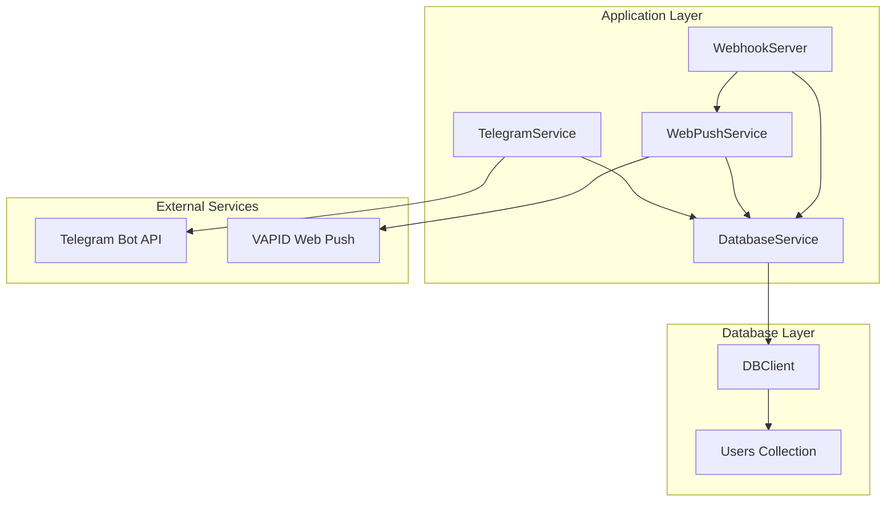
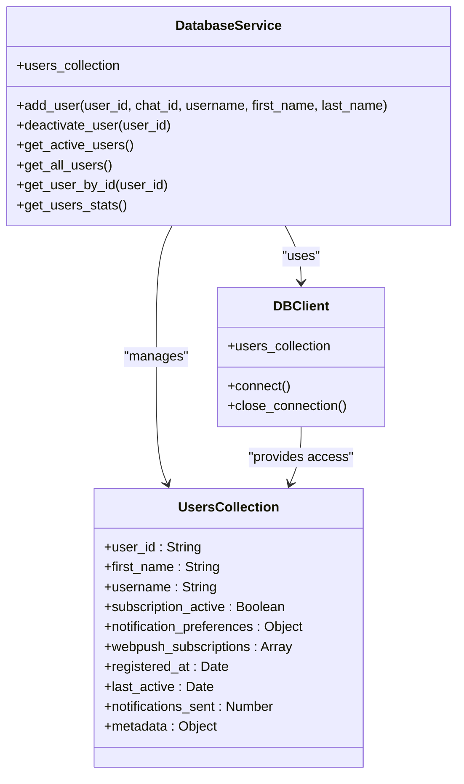
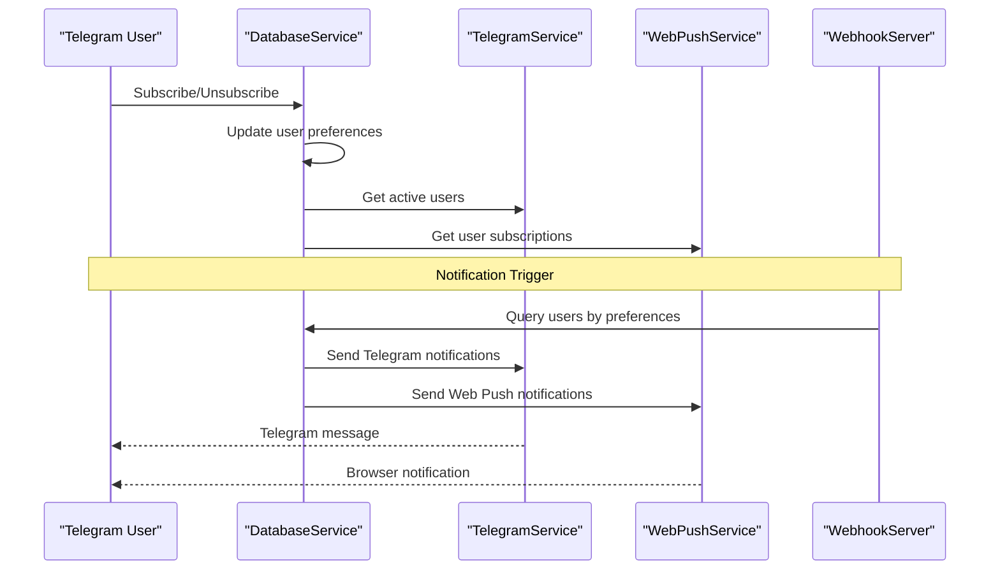
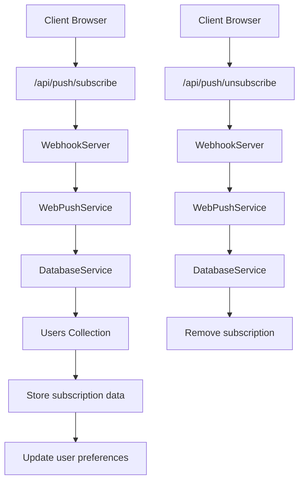
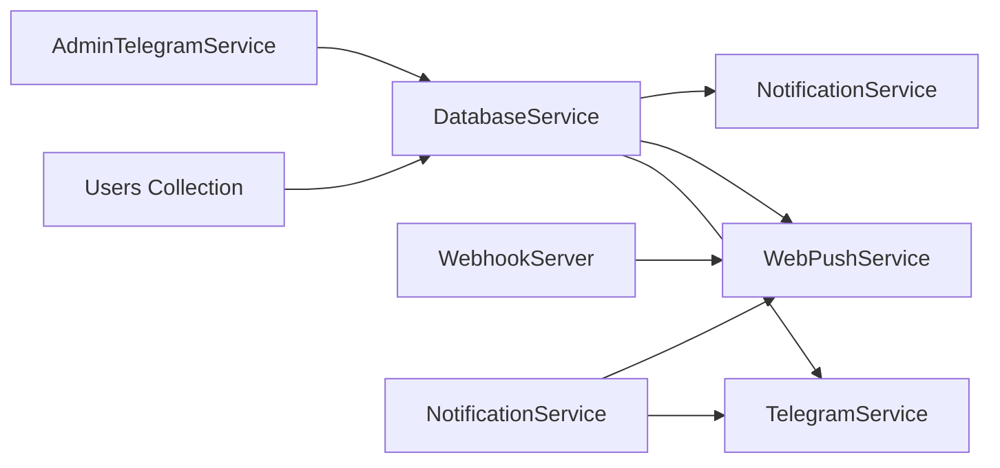

# Users Collection

<cite>
**Referenced Files in This Document**
- [DATABASE.md](file://docs/DATABASE.md)
- [database_service.py](file://app/services/database_service.py)
- [db_client.py](file://app/clients/db_client.py)
- [web_push_service.py](file://app/services/web_push_service.py)
- [webhook_server.py](file://app/servers/webhook_server.py)
- [telegram_service.py](file://app/services/telegram_service.py)
</cite>

## Table of Contents
1. [Introduction](#introduction)
2. [Project Structure](#project-structure)
3. [Core Components](#core-components)
4. [Architecture Overview](#architecture-overview)
5. [Detailed Component Analysis](#detailed-component-analysis)
6. [Dependency Analysis](#dependency-analysis)
7. [Performance Considerations](#performance-considerations)
8. [Troubleshooting Guide](#troubleshooting-guide)
9. [Conclusion](#conclusion)

## Introduction
This document provides comprehensive documentation for the Users collection schema that stores user subscription data and preferences for the SuperSet Telegram Notification Bot. The Users collection serves as the central repository for managing user subscriptions, notification preferences, and associated metadata. It enables the system to deliver notifications via Telegram and Web Push channels while maintaining user preferences and activity tracking.

The Users collection schema is designed to handle multiple notification channels, track user engagement, and support flexible subscription management. It integrates seamlessly with the broader notification ecosystem, providing a robust foundation for user-centric communication workflows.

## Project Structure
The Users collection is part of the MongoDB database schema and interacts with several key components:

**Diagram sources**
- [database_service.py](file://app/services/database_service.py#L16-L46)
- [db_client.py](file://app/clients/db_client.py#L16-L61)
- [web_push_service.py](file://app/services/web_push_service.py#L27-L75)
- [webhook_server.py](file://app/servers/webhook_server.py#L69-L131)

**Section sources**
- [database_service.py](file://app/services/database_service.py#L16-L46)
- [db_client.py](file://app/clients/db_client.py#L16-L61)

## Core Components

### Users Collection Schema
The Users collection implements a comprehensive schema designed for flexible user subscription management:

**Primary Identifier**: `user_id` (String)
- Telegram user ID serving as the unique identifier
- Separate from MongoDB's ObjectId for external system integration
- Unique index ensures data integrity

**Personal Information Fields**:
- `first_name`: String - User's first name
- `username`: String (Optional) - Telegram username

**Subscription Management**:
- `subscription_active`: Boolean - Overall subscription status
- `notification_preferences`: Embedded document controlling notification channels

**Notification Preferences**:
Embedded document with three boolean flags:
- `telegram`: Boolean - Telegram notification preference
- `webpush`: Boolean - Web Push notification preference  
- `email`: Boolean - Email notification preference

**Web Push Subscriptions**:
Array of embedded subscription objects:
- `subscription_id`: String - Unique subscription identifier
- `endpoint`: String - Web Push endpoint URL
- `keys`: Embedded object containing cryptographic keys
  - `p256dh`: String - ECDH key
  - `auth`: String - Authentication key
- `created_at`: Date - Timestamp of subscription creation

**Activity Tracking**:
- `registered_at`: Date - User registration timestamp
- `last_active`: Date - Last user activity timestamp
- `notifications_sent`: Number - Counter for sent notifications

**Metadata**:
Embedded document with optional fields:
- `branch`: String - Student's academic branch
- `batch_year`: String - Graduation year
- `device_type`: String - Device classification ('mobile', 'desktop', 'web')

**Section sources**
- [DATABASE.md](file://docs/DATABASE.md#L256-L329)

### Database Integration
The Users collection is accessed through the DatabaseService, which provides a clean abstraction layer for MongoDB operations:

**Diagram sources**
- [database_service.py](file://app/services/database_service.py#L16-L46)
- [db_client.py](file://app/clients/db_client.py#L16-L61)
- [DATABASE.md](file://docs/DATABASE.md#L256-L329)

**Section sources**
- [database_service.py](file://app/services/database_service.py#L616-L728)
- [db_client.py](file://app/clients/db_client.py#L34-L61)

## Architecture Overview

### Notification Delivery Workflow
The Users collection integrates with the notification delivery pipeline:

**Diagram sources**
- [database_service.py](file://app/services/database_service.py#L684-L728)
- [telegram_service.py](file://app/services/telegram_service.py#L140-L172)
- [web_push_service.py](file://app/services/web_push_service.py#L120-L155)
- [webhook_server.py](file://app/servers/webhook_server.py#L186-L226)

### Web Push Subscription Management
The system handles Web Push subscriptions through dedicated endpoints:

**Diagram sources**
- [webhook_server.py](file://app/servers/webhook_server.py#L186-L226)
- [web_push_service.py](file://app/services/web_push_service.py#L213-L237)
- [database_service.py](file://app/services/database_service.py#L616-L668)

**Section sources**
- [webhook_server.py](file://app/servers/webhook_server.py#L186-L226)
- [web_push_service.py](file://app/services/web_push_service.py#L213-L237)

## Detailed Component Analysis

### User Registration and Management
The user registration process involves creating user records with comprehensive metadata:

**Registration Flow**:
1. User initiates subscription via Telegram bot
2. System creates user record with `user_id` as primary identifier
3. Sets initial preferences and activity timestamps
4. Stores personal information (first_name, username)
5. Initializes counters and metadata fields

**Deactivation Process**:
- Soft deletion mechanism using `is_active` flag
- Preserves user data for potential reactivation
- Maintains historical activity records

**Section sources**
- [database_service.py](file://app/services/database_service.py#L616-L668)
- [database_service.py](file://app/services/database_service.py#L670-L682)

### Notification Preference Management
The notification preferences system provides granular control over communication channels:

**Preference Structure**:
- `telegram`: Controls Telegram message delivery
- `webpush`: Controls browser notification delivery
- `email`: Controls email notification delivery

**Integration Points**:
- Real-time preference evaluation during notification dispatch
- Batch processing considers individual user preferences
- Admin interface allows bulk preference updates

**Section sources**
- [DATABASE.md](file://docs/DATABASE.md#L264-L268)
- [database_service.py](file://app/services/database_service.py#L684-L728)

### Web Push Subscription Handling
The Web Push subscription system manages browser push endpoints:

**Subscription Data Model**:
- Endpoint URL for push delivery
- Cryptographic keys for secure communication
- Creation timestamp for subscription lifecycle management
- Unique subscription identifiers

**Subscription Lifecycle**:
1. Client browser registers for push notifications
2. Server validates subscription with VAPID authentication
3. Subscription stored in user document
4. Automatic cleanup of expired/invalid subscriptions
5. Support for user-initiated unsubscription

**Section sources**
- [DATABASE.md](file://docs/DATABASE.md#L269-L279)
- [web_push_service.py](file://app/services/web_push_service.py#L157-L208)
- [webhook_server.py](file://app/servers/webhook_server.py#L186-L226)

### Activity Tracking and Analytics
The Users collection maintains comprehensive activity metrics:

**Tracking Fields**:
- `registered_at`: User registration timestamp
- `last_active`: Last recorded user interaction
- `notifications_sent`: Running counter for delivered notifications
- Metadata fields for demographic and behavioral insights

**Analytics Applications**:
- User engagement analysis
- Subscription retention metrics
- Platform usage patterns
- Personalized notification targeting

**Section sources**
- [DATABASE.md](file://docs/DATABASE.md#L280-L287)
- [database_service.py](file://app/services/database_service.py#L714-L728)

## Dependency Analysis

### Component Relationships
The Users collection participates in several critical dependency relationships:

**Diagram sources**
- [database_service.py](file://app/services/database_service.py#L16-L46)
- [telegram_service.py](file://app/services/telegram_service.py#L20-L51)
- [web_push_service.py](file://app/services/web_push_service.py#L27-L75)
- [webhook_server.py](file://app/servers/webhook_server.py#L69-L131)

### External Dependencies
The Users collection relies on several external systems:

**MongoDB Integration**:
- Connection management through DBClient
- Index management for query optimization
- Transaction support for atomic operations

**Third-party Services**:
- Telegram Bot API for message delivery
- VAPID Web Push infrastructure for browser notifications
- External authentication providers for user verification

**Section sources**
- [db_client.py](file://app/clients/db_client.py#L21-L72)
- [web_push_service.py](file://app/services/web_push_service.py#L55-L79)

## Performance Considerations

### Index Strategy
The Users collection benefits from strategic indexing:

**Critical Indexes**:
- `{ user_id: 1 }` (Unique) - Primary user lookup
- `{ subscription_active: 1 }` - Active user filtering
- `{ last_active: 1 }` - Activity-based queries

**Query Optimization**:
- Efficient user preference filtering
- Rapid subscription status checks
- Optimized broadcast operations

### Scalability Factors
- Horizontal scaling through sharding by user_id
- Connection pooling for database operations
- Asynchronous processing for notification delivery
- Caching strategies for frequently accessed user data

## Troubleshooting Guide

### Common Issues and Solutions

**User Registration Failures**:
- Verify MongoDB connectivity and authentication
- Check for duplicate user_id entries
- Validate required field constraints

**Notification Delivery Problems**:
- Confirm user subscription status
- Verify notification preferences alignment
- Check external service availability (Telegram/VAPID)

**Web Push Subscription Issues**:
- Validate VAPID key configuration
- Check subscription endpoint validity
- Monitor for expired/invalid subscriptions

**Section sources**
- [database_service.py](file://app/services/database_service.py#L616-L668)
- [web_push_service.py](file://app/services/web_push_service.py#L157-L208)

## Conclusion
The Users collection schema provides a robust foundation for managing user subscriptions and preferences in the SuperSet Telegram Notification Bot. Its comprehensive design supports multiple notification channels, detailed activity tracking, and flexible subscription management. The integration with the broader notification ecosystem ensures seamless user experience while maintaining data integrity and system performance.

The schema's flexibility accommodates various user scenarios, from simple Telegram-only subscribers to complex multi-channel users with Web Push subscriptions. The embedded document structure optimizes query performance while maintaining data normalization principles. With proper indexing and monitoring, the Users collection scales effectively to support the application's growing user base and evolving feature requirements.