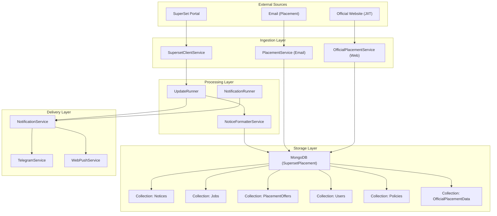
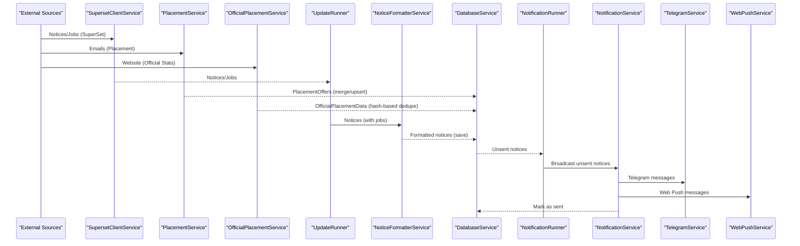
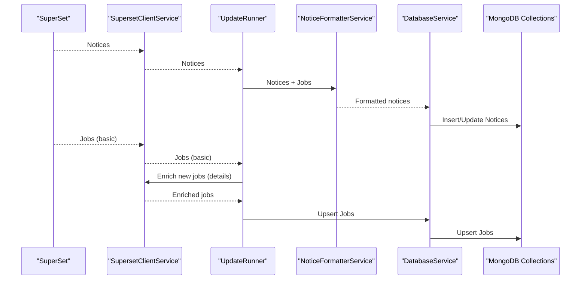
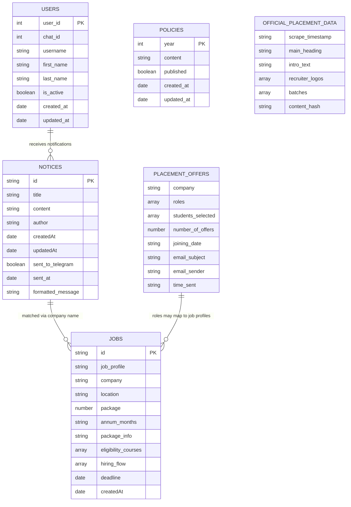
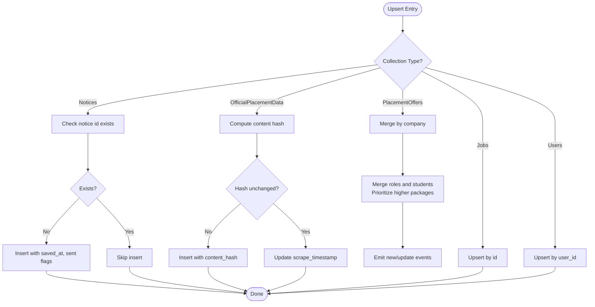
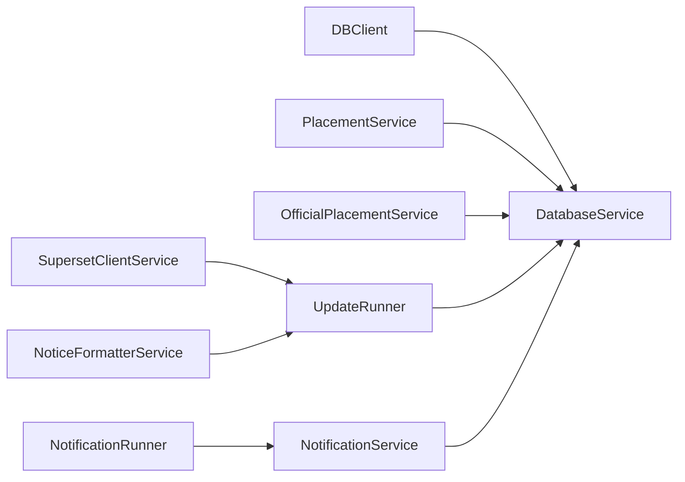

# Data flow & collection relationships

## Introduction
This page explains the data flow patterns and collection relationships in the notification system. It traces how data enters the system from external sources (SuperSet portal, email, official websites), how it is processed and stored in MongoDB collections, and how it is delivered to users. It also covers upsert logic to avoid duplicates, data lifecycle management, and how the schema supports real-time notifications and historical analysis.

## Project structure
The system is organized around a modular architecture:
- Data ingestion from SuperSet, email, and official websites
- Structuring and enrichment of notices and jobs
- Storage in MongoDB collections
- Notification dispatch across channels
- Historical analytics and statistics computation

```mermaid
graph TB
subgraph "External Sources"
SS["SuperSet Portal"]
EMAIL["Email (Placement)"]
WEB["Official Website (JIIT)"]
end
subgraph "Ingestion Layer"
SCR["SupersetClientService"]
PS["PlacementService (Email)"]
OPS["OfficialPlacementService (Web)"]
end
subgraph "Processing Layer"
NFR["NoticeFormatterService"]
UR["UpdateRunner"]
NR["NotificationRunner"]
end
subgraph "Storage Layer"
DB["MongoDB (SupersetPlacement)"]
COL_NOTICES["Collection: Notices"]
COL_JOBS["Collection: Jobs"]
COL_OFFERS["Collection: PlacementOffers"]
COL_USERS["Collection: Users"]
COL_POLICIES["Collection: Policies"]
COL_OFFICIAL["Collection: OfficialPlacementData"]
end
subgraph "Delivery Layer"
NS["NotificationService"]
TG["TelegramService"]
WP["WebPushService"]
end
SS --> SCR
EMAIL --> PS
WEB --> OPS
SCR --> UR
UR --> NFR
NFR --> DB
DB --> COL_NOTICES
DB --> COL_JOBS
PS --> DB
DB --> COL_OFFERS
OPS --> DB
DB --> COL_OFFICIAL
DB --> COL_USERS
DB --> COL_POLICIES
UR --> NS
NR --> NS
NS --> TG
NS --> WP
```

## Core components
- DBClient: Provides MongoDB connection and exposes typed collection handles.
- DatabaseService: Implements CRUD and aggregation operations across collections, including notices, jobs, placement offers, users, policies, and official placement data.
- SupersetClientService: Authenticates and fetches notices and jobs from SuperSet, with enrichment for detailed job information.
- NoticeFormatterService: LLM-powered notice classification, job matching, extraction, and formatting for notifications.
- UpdateRunner: Orchestrates fetching notices/jobs from SuperSet, deduplication, enrichment, and saving to DB.
- PlacementService: Extracts placement offers from emails using a LangGraph pipeline and merges updates into PlacementOffers.
- OfficialPlacementService: Scrapes official placement statistics from the JIIT website and stores normalized data.
- NotificationRunner and NotificationService: Dispatch unsent notices to Telegram and Web Push channels, marking them as sent.

## Architecture overview
The system follows a pipeline architecture:
- Ingestion: SuperSet notices/jobs, email placement offers, official website data
- Processing: Structuring, enrichment, LLM-based formatting, deduplication
- Storage: MongoDB collections with targeted upsert logic
- Delivery: Real-time notifications to Telegram/Web Push
- Analytics: Historical stats and reporting

```mermaid
sequenceDiagram
participant SRC as "External Sources"
participant SCR as "SupersetClientService"
participant PS as "PlacementService"
participant OPS as "OfficialPlacementService"
participant UR as "UpdateRunner"
participant NFR as "NoticeFormatterService"
participant DB as "DatabaseService"
participant NR as "NotificationRunner"
participant NS as "NotificationService"
participant TG as "TelegramService"
participant WP as "WebPushService"
SRC->>SCR : Notices/Jobs (SuperSet)
SRC->>PS : Emails (Placement)
SRC->>OPS : Website (Official Stats)
SCR-->>UR : Notices/Jobs
PS-->>DB : PlacementOffers (merge/upsert)
OPS-->>DB : OfficialPlacementData (hash-based dedupe)
UR->>NFR : Notices (with jobs)
NFR-->>DB : Formatted notices (save)
DB-->>NR : Unsent notices
NR->>NS : Broadcast unsent notices
NS->>TG : Telegram messages
NS->>WP : Web Push messages
NS-->>DB : Mark as sent
```

## Detailed component analysis

### Data flow from external sources to MongoDB
- SuperSet notices and jobs:
  - SupersetClientService authenticates and fetches notices and job listings.
  - UpdateRunner filters existing IDs, enriches only new jobs, and passes notices through NoticeFormatterService.
  - DatabaseService saves notices and upserts jobs.
- Email-based placement offers:
  - PlacementService runs a LangGraph pipeline to classify, extract, validate, sanitize, and format placement offers.
  - DatabaseService merges updates into PlacementOffers with deduplication by company and student records.
- Official website statistics:
  - OfficialPlacementService scrapes and normalizes data, then DatabaseService inserts or updates OfficialPlacementData using content hash to detect changes.

```mermaid
sequenceDiagram
participant SS as "SuperSet"
participant SCR as "SupersetClientService"
participant UR as "UpdateRunner"
participant NFR as "NoticeFormatterService"
participant DB as "DatabaseService"
participant COL as "MongoDB Collections"
SS-->>SCR : Notices
SCR-->>UR : Notices
UR->>NFR : Notices + Jobs
NFR-->>DB : Formatted notices
DB->>COL : Insert/Update Notices
SS-->>SCR : Jobs (basic)
SCR-->>UR : Jobs (basic)
UR->>SCR : Enrich new jobs (details)
SCR-->>UR : Enriched jobs
UR->>DB : Upsert Jobs
DB->>COL : Upsert Jobs
```

### Collection relationships and data modeling
- Notices: Stores formatted notices with sent status flags for channels.
- Jobs: Structured job listings with eligibility, location, package, and hiring flow.
- PlacementOffers: Company-wise placement offers with roles, students, and package details.
- Users: User profiles and subscription status for notifications.
- Policies: Academic placement policies by year.
- OfficialPlacementData: Normalized official statistics with content hash for change detection.

```mermaid
erDiagram
NOTICES {
string id PK
string title
string content
string author
date createdAt
date updatedAt
boolean sent_to_telegram
date sent_at
string formatted_message
}
JOBS {
string id PK
string job_profile
string company
string location
number package
string annum_months
string package_info
array eligibility_courses
array hiring_flow
date deadline
date createdAt
}
PLACEMENT_OFFERS {
string company
array roles
array students_selected
number number_of_offers
string joining_date
string email_subject
string email_sender
string time_sent
}
USERS {
int user_id PK
int chat_id
string username
string first_name
string last_name
boolean is_active
date created_at
date updated_at
}
POLICIES {
int year PK
string content
boolean published
date created_at
date updated_at
}
OFFICIAL_PLACEMENT_DATA {
string scrape_timestamp
string main_heading
string intro_text
array recruiter_logos
array batches
string content_hash
}
NOTICES ||--o{ JOBS : "matched via company name"
PLACEMENT_OFFERS ||--o{ JOBS : "roles may map to job profiles"
USERS ||--o{ NOTICES : "receives notifications"
```

### Upsert logic and duplicate prevention
- Notices: Insert-only by ID; existence checked before insert to prevent duplicates.
- Jobs: Upsert by ID; if existing, replace with merged fields and updated timestamp.
- PlacementOffers: Merge by company; roles and students merged with deduplication and package prioritization; emits events for new offers and updates.
- OfficialPlacementData: Hash-based deduplication; content hash computed excluding timestamps and previous hash; unchanged content updates timestamp only.
- Users: Upsert by user_id; activate/deactivate logic for soft deletion.

```mermaid
flowchart TD
Start([Upsert Entry]) --> CheckType{"Collection Type?"}
CheckType --> |Notices| CheckExists["Check notice id exists"]
CheckExists --> Exists{"Exists?"}
Exists --> |Yes| Skip["Skip insert"]
Exists --> |No| Insert["Insert with saved_at, sent flags"]
CheckType --> |Jobs| UpsertJob["Upsert by id"]
CheckType --> |PlacementOffers| MergeOffers["Merge by company"]
CheckType --> |OfficialPlacementData| HashCheck["Compute content hash"]
CheckType --> |Users| UpsertUser["Upsert by user_id"]
MergeOffers --> MergeLogic["Merge roles and students<br/>Prioritize higher packages"]
MergeLogic --> EmitEvents["Emit new/update events"]
HashCheck --> CompareHash{"Hash unchanged?"}
CompareHash --> |Yes| UpdateTS["Update scrape_timestamp"]
CompareHash --> |No| InsertDoc["Insert with content_hash"]
Insert --> End([Done])
Skip --> End
InsertDoc --> End
UpdateTS --> End
UpsertJob --> End
UpsertUser --> End
```

### Data lifecycle management
- Creation: Notices and jobs created via ingestion; placement offers created/updated via email processing; official stats created via scraping.
- Updates: Jobs and placement offers are upserted; notices marked as sent after delivery; users activated/deactivated.
- Archiving/Cleanup: TTL indexes recommended for logs and temporary data; unsent notices retained for retry; official stats stored with timestamps for historical analysis.

### Real-time delivery and historical analysis
- Real-time: NotificationService fetches unsent notices and broadcasts to Telegram/Web Push; marks as sent upon successful delivery.
- Historical: Placement statistics computed from PlacementOffers; official stats aggregated from OfficialPlacementData; notices archived with timestamps for audit.

## Dependency analysis
The system exhibits low coupling and high cohesion:
- DBClient encapsulates MongoDB connectivity and collection exposure.
- DatabaseService centralizes all DB operations and maintains clear separation of concerns.
- SupersetClientService and OfficialPlacementService are specialized for ingestion.
- NoticeFormatterService and PlacementService encapsulate LLM pipelines for processing.
- NotificationRunner and NotificationService orchestrate delivery.

```mermaid
graph LR
DBClient --> DatabaseService
SupersetClientService --> UpdateRunner
PlacementService --> DatabaseService
OfficialPlacementService --> DatabaseService
NoticeFormatterService --> UpdateRunner
UpdateRunner --> DatabaseService
NotificationRunner --> NotificationService
NotificationService --> DatabaseService
```

## Performance considerations
- Efficient queries: Use targeted projections and limits; use indexes on frequently queried fields (e.g., createdAt, updatedAt, id).
- Batch operations: InsertMany for bulk notices/jobs; minimize round-trips.
- Hash-based deduplication: OfficialPlacementData reduces unnecessary writes.
- TTL indexes: Automatically expire logs and temporary data.
- Connection pooling: Use PyMongo's pooled connections.

[No sources needed since this section provides general guidance]

## Troubleshooting guide
Common issues and resolutions:
- MongoDB connection failures: Verify MONGO_CONNECTION_STR; check DBClient initialization and ping command.
- Duplicate notices: Confirm notice_exists check and ID uniqueness; review save_notice logic.
- Missing job details: Ensure enrich_jobs is called for new jobs; verify SupersetClientService enrichment flow.
- Placement offer conflicts: Review merge logic for roles and students; confirm package prioritization rules.
- Notification delivery failures: Inspect NotificationService broadcast results; verify channel configurations.

## Conclusion
The system integrates external data sources, processes and structures content, and persists it in MongoDB collections with reliable upsert logic to prevent duplicates. It supports real-time notifications and historical analytics through dedicated collections and aggregation functions. Clear separation of concerns and modular components enable maintainability and scalability.

[No sources needed since this section summarizes without analyzing specific files]

## Appendices

### Appendix A: representative data samples
- Structured job listings sample: `app/data/structured_job_listings.json`
- Placement offers sample: `app/data/placement_offers.json`
