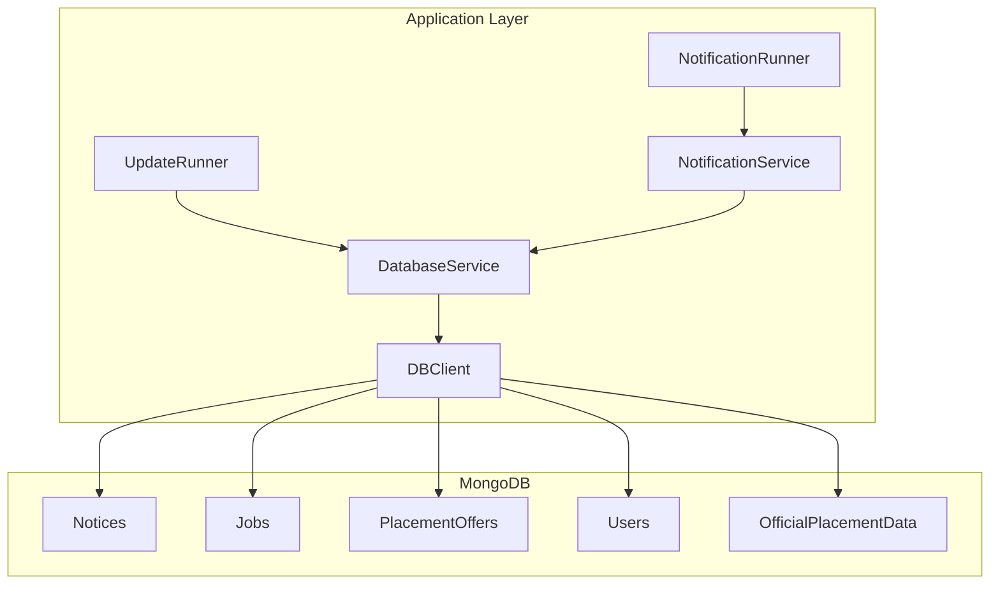
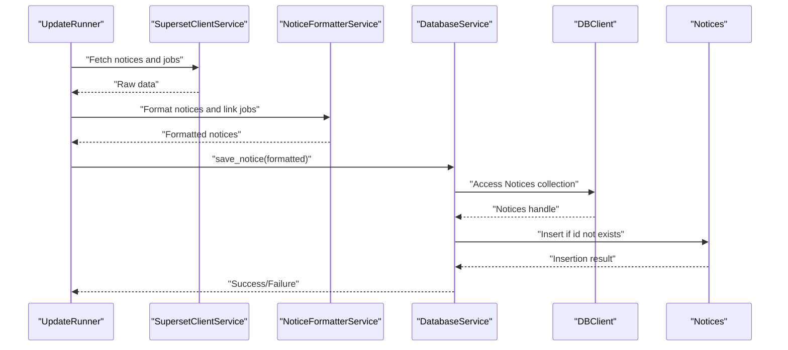
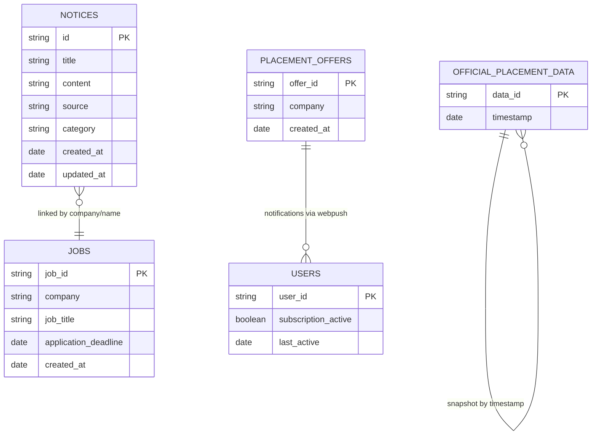
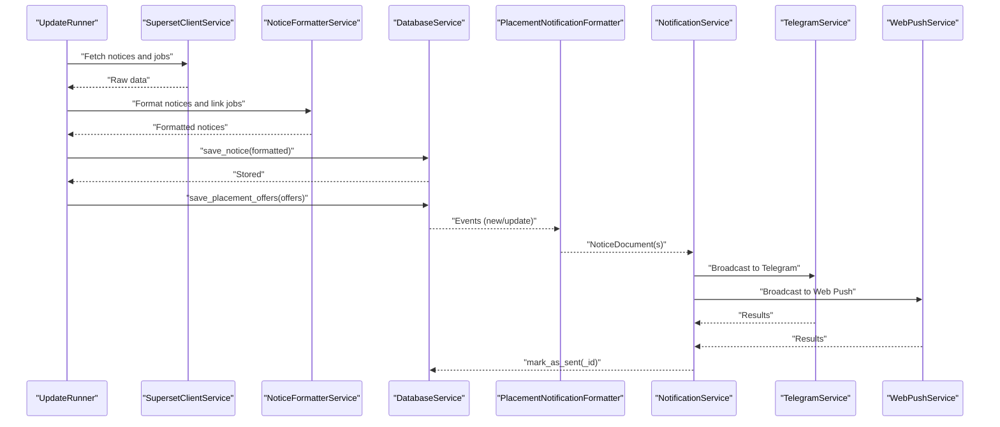
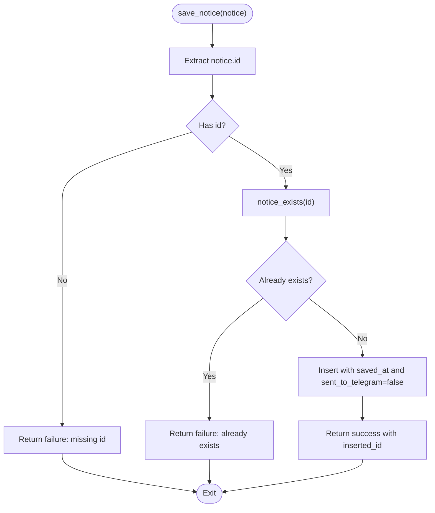
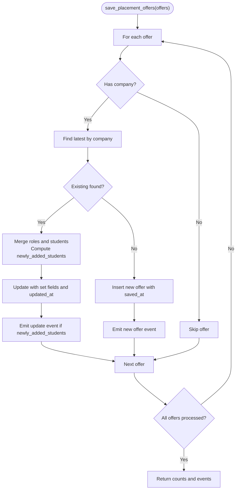
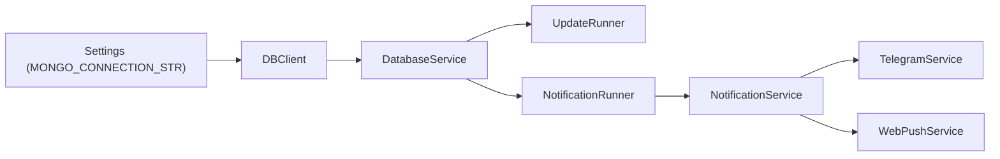

# Database Schema & Data Model

<cite>
**Referenced Files in This Document**
- [DATABASE.md](file://docs/DATABASE.md)
- [db_client.py](file://app/clients/db_client.py)
- [database_service.py](file://app/services/database_service.py)
- [notification_service.py](file://app/services/notification_service.py)
- [notification_runner.py](file://app/runners/notification_runner.py)
- [update_runner.py](file://app/runners/update_runner.py)
- [config.py](file://app/core/config.py)
- [docker-compose.dev.yaml](file://app/docker-compose.dev.yaml)
</cite>

## Table of Contents
1. [Introduction](#introduction)
2. [Project Structure](#project-structure)
3. [Core Components](#core-components)
4. [Architecture Overview](#architecture-overview)
5. [Detailed Component Analysis](#detailed-component-analysis)
6. [Dependency Analysis](#dependency-analysis)
7. [Performance Considerations](#performance-considerations)
8. [Troubleshooting Guide](#troubleshooting-guide)
9. [Conclusion](#conclusion)
10. [Appendices](#appendices)

## Introduction
This document provides comprehensive data model documentation for the MongoDB-based storage system used by the SuperSet Telegram Notification Bot. It defines the five primary collections (Notices, Jobs, PlacementOffers, Users, OfficialPlacementData), their field definitions, data types, validation rules, and relationships. It also explains how the schema supports real-time notifications and historical analytics, outlines index strategies for performance, describes upsert logic to prevent duplicates, and documents the event generation system for tracking changes.

## Project Structure
The database layer is implemented as a thin client-service abstraction:
- DBClient: Establishes the MongoDB connection and exposes typed collection handles.
- DatabaseService: Implements domain-specific operations (existence checks, upserts, stats, event emission).
- Runners: Orchestrate periodic tasks (fetching updates, sending notifications).
- Services: Coordinate channels and routing for notifications.



**Diagram sources**
- [db_client.py](file://app/clients/db_client.py#L42-L104)
- [database_service.py](file://app/services/database_service.py#L28-L45)
- [notification_runner.py](file://app/runners/notification_runner.py#L28-L115)
- [notification_service.py](file://app/services/notification_service.py#L21-L91)

**Section sources**
- [db_client.py](file://app/clients/db_client.py#L16-L104)
- [database_service.py](file://app/services/database_service.py#L16-L46)
- [notification_runner.py](file://app/runners/notification_runner.py#L21-L115)
- [notification_service.py](file://app/services/notification_service.py#L13-L91)

## Core Components
- DatabaseClient: Manages connection and exposes collections for Notices, Jobs, PlacementOffers, Users, Policies, and OfficialPlacementData.
- DatabaseService: Provides CRUD and operational helpers, including duplicate prevention, upsert logic, and event generation for placement offers.
- NotificationService: Orchestrates sending unsent notices to Telegram and Web Push channels.
- Runners: Encapsulate orchestration for update fetching and notification dispatch.

Key responsibilities:
- Notices: Store formatted notifications with delivery flags and timestamps.
- Jobs: Structured job listings with qualification criteria and deadlines.
- PlacementOffers: Offers with merged student profiles and role packages.
- Users: Subscription and preference management.
- OfficialPlacementData: Aggregated statistics snapshots.

**Section sources**
- [db_client.py](file://app/clients/db_client.py#L42-L104)
- [database_service.py](file://app/services/database_service.py#L56-L200)
- [notification_service.py](file://app/services/notification_service.py#L93-L167)

## Architecture Overview
The system follows a layered architecture:
- Clients: DBClient encapsulates MongoDB connectivity.
- Services: DatabaseService implements domain logic and deduplication/upserts.
- Runners: UpdateRunner and NotificationRunner coordinate periodic tasks.
- Channels: NotificationService routes messages to Telegram/Web Push.



**Diagram sources**
- [update_runner.py](file://app/runners/update_runner.py#L56-L148)
- [database_service.py](file://app/services/database_service.py#L80-L105)
- [db_client.py](file://app/clients/db_client.py#L82-L83)

## Detailed Component Analysis

### Notices Collection
Purpose: Store all types of notifications (job postings, announcements, updates) with delivery tracking.

Schema highlights:
- Unique identifiers: id (string), _id (ObjectId).
- Delivery flags: sent_to_telegram, sent_to_webpush (each with value and timestamp).
- Metadata: source, category, formatted_content, scraped_at, created_at, updated_at.

Validation rules:
- Unique index on id.
- Indexes on sent_to_telegram, sent_to_webpush, created_at, source+category.

Typical document structure:
- Fields include identifiers, content, delivery flags, metadata, and timestamps.

Upsert logic:
- Existence check by id before insertion prevents duplicates.

Real-time and history:
- Delivery flags enable real-time routing.
- created_at supports chronological queries and historical analysis.

**Section sources**
- [DATABASE.md](file://docs/DATABASE.md#L32-L94)
- [DATABASE.md](file://docs/DATABASE.md#L430-L435)
- [database_service.py](file://app/services/database_service.py#L56-L105)

### Jobs Collection
Purpose: Structured job listings extracted from SuperSet.

Schema highlights:
- Unique identifiers: job_id (string), _id (ObjectId).
- Qualification criteria: min_cgpa, branches, batch_years.
- Position details: total_positions, job_location, job_type.
- Compensation: base_salary, bonus, currency.
- Deadlines and URLs: application_deadline, posted_at, source_url.

Validation rules:
- Unique index on job_id.
- Indexes on company, application_deadline, qualification_criteria.branches.

Upsert logic:
- Existence check by job_id; if present, replace with merged fields and updated_at.

Typical document structure:
- Includes company, job_title, description, criteria, position details, compensation, deadlines, and timestamps.

**Section sources**
- [DATABASE.md](file://docs/DATABASE.md#L98-L162)
- [DATABASE.md](file://docs/DATABASE.md#L437-L441)
- [database_service.py](file://app/services/database_service.py#L205-L257)

### PlacementOffers Collection
Purpose: Extracted and structured placement offer data from emails.

Schema highlights:
- Unique identifiers: offer_id (string), _id (ObjectId).
- Offer details: company, role, package breakdown (base, bonus, total, currency).
- Students: array of selected students with name, email, branch, enrollment number.
- Status: offer_status, processing_status, notifications_sent.
- Timestamps: extracted_at, created_at, updated_at.

Validation rules:
- Unique index on offer_id.
- Indexes on company, processing_status, created_at.

Upsert logic and event generation:
- Merge logic for roles and students; emits events for new offers and updates with newly added students.
- Events carry company, offer_id, offer_data, roles, total_students, and metadata.

Typical document structure:
- Company, role, package, students, statuses, and timestamps.

**Section sources**
- [DATABASE.md](file://docs/DATABASE.md#L169-L244)
- [DATABASE.md](file://docs/DATABASE.md#L443-L447)
- [database_service.py](file://app/services/database_service.py#L274-L441)

### Users Collection
Purpose: Store user subscription data and preferences.

Schema highlights:
- Unique identifiers: user_id (string), _id (ObjectId).
- Preferences: telegram, webpush, email booleans.
- Web push subscriptions: array of subscription objects with endpoint and keys.
- Metadata: branch, batch_year, device_type.
- Activity: registered_at, last_active, notifications_sent.

Validation rules:
- Unique index on user_id.
- Indexes on subscription_active, last_active, registered_at.

Typical document structure:
- User identity, preferences, web push subscriptions, metadata, and activity timestamps.

**Section sources**
- [DATABASE.md](file://docs/DATABASE.md#L252-L324)
- [DATABASE.md](file://docs/DATABASE.md#L449-L453)

### OfficialPlacementData Collection
Purpose: Store aggregated placement statistics from official sources.

Schema highlights:
- Unique identifiers: data_id (string), _id (ObjectId).
- Snapshot: timestamp.
- Overall statistics: total_students, total_placed, placement_percentage, average_package, highest_package, lowest_package.
- Hierarchical breakdowns: branch_wise, company_wise, sector_wise.
- Source URL and timestamps: source_url, created_at, updated_at.

Validation rules:
- Unique index on data_id.
- Index on timestamp (descending for latest-first queries).

Typical document structure:
- Snapshot metadata, overall stats, branch-wise, company-wise, sector-wise, and timestamps.

**Section sources**
- [DATABASE.md](file://docs/DATABASE.md#L331-L418)
- [DATABASE.md](file://docs/DATABASE.md#L455-L457)
- [database_service.py](file://app/services/database_service.py#L443-L484)

### Relationships Between Collections
- Notices may reference Jobs via enrichment/linking during formatting; Jobs are linked by company and identifiers.
- PlacementOffers are independent snapshots; they can be correlated with Users via web push subscriptions for notifications.
- OfficialPlacementData is a standalone statistics snapshot collection.



**Diagram sources**
- [DATABASE.md](file://docs/DATABASE.md#L32-L94)
- [DATABASE.md](file://docs/DATABASE.md#L98-L162)
- [DATABASE.md](file://docs/DATABASE.md#L169-L244)
- [DATABASE.md](file://docs/DATABASE.md#L252-L324)
- [DATABASE.md](file://docs/DATABASE.md#L331-L418)

## Architecture Overview
End-to-end flow for fetching, formatting, storing, and notifying about placement offers:



**Diagram sources**
- [update_runner.py](file://app/runners/update_runner.py#L56-L148)
- [database_service.py](file://app/services/database_service.py#L274-L441)
- [notification_service.py](file://app/services/notification_service.py#L93-L167)
- [notification_runner.py](file://app/runners/notification_runner.py#L60-L115)

## Detailed Component Analysis

### Notices Upsert and Duplicate Prevention
- Existence check by id before insertion prevents duplicates.
- Delivery flags track Telegram and Web Push delivery with timestamps.
- Chronological sorting by createdAt ensures FIFO processing.



**Diagram sources**
- [database_service.py](file://app/services/database_service.py#L80-L105)
- [database_service.py](file://app/services/database_service.py#L56-L67)

**Section sources**
- [database_service.py](file://app/services/database_service.py#L56-L105)

### Jobs Upsert Logic
- Existence check by job_id; if present, replace with merged fields and updated_at; otherwise insert with saved_at.

**Section sources**
- [database_service.py](file://app/services/database_service.py#L205-L257)

### PlacementOffers Upsert and Event Generation
- Merge roles and students; compute newly added students; emit events for new offers and updates.
- Events include company, offer_id, offer_data, roles, total_students, and metadata.



**Diagram sources**
- [database_service.py](file://app/services/database_service.py#L274-L441)

**Section sources**
- [database_service.py](file://app/services/database_service.py#L274-L441)

### Users Management
- Add or reactivate users with is_active flag and timestamps.
- Deactivate users (soft delete) and query active users for broadcasting.

**Section sources**
- [database_service.py](file://app/services/database_service.py#L616-L682)

### OfficialPlacementData Upsert with Content Hash
- Compute content hash excluding scrape_timestamp and content_hash.
- Compare with latest document; if unchanged, update scrape_timestamp; otherwise insert new.

**Section sources**
- [database_service.py](file://app/services/database_service.py#L443-L484)

## Dependency Analysis
- DBClient depends on environment configuration for the MongoDB connection string.
- DatabaseService depends on DBClient for collection handles.
- Runners depend on DatabaseService and channel services for orchestration.
- NotificationService depends on DatabaseService for unsent notices and on channel services for delivery.



**Diagram sources**
- [config.py](file://app/core/config.py#L26-L31)
- [db_client.py](file://app/clients/db_client.py#L21-L30)
- [database_service.py](file://app/services/database_service.py#L28-L45)
- [notification_runner.py](file://app/runners/notification_runner.py#L28-L104)

**Section sources**
- [config.py](file://app/core/config.py#L18-L31)
- [db_client.py](file://app/clients/db_client.py#L21-L30)
- [database_service.py](file://app/services/database_service.py#L28-L45)
- [notification_runner.py](file://app/runners/notification_runner.py#L28-L104)

## Performance Considerations
Indexing strategy:
- Notices: unique id, sent_to_telegram, sent_to_webpush, created_at, source+category.
- Jobs: unique job_id, company, application_deadline, qualification_criteria.branches.
- PlacementOffers: unique offer_id, company, processing_status, created_at.
- Users: unique user_id, subscription_active, last_active, registered_at.
- OfficialPlacementData: unique data_id, timestamp (descending).

Recommendations:
- Use targeted projections to reduce payload sizes.
- Prefer bulk operations for inserts and updates.
- Consider TTL indexes for temporary logs or audit trails.
- Leverage connection pooling via PyMongo’s default pool.

**Section sources**
- [DATABASE.md](file://docs/DATABASE.md#L425-L458)
- [DATABASE.md](file://docs/DATABASE.md#L560-L614)

## Troubleshooting Guide
Common issues and resolutions:
- Connection failures: Verify MONGO_CONNECTION_STR environment variable and network reachability.
- Missing collections: Ensure DBClient.connect() succeeds and collections are initialized.
- Duplicate notices: rely on notice_exists(id) and unique id index.
- Slow queries: confirm appropriate indexes exist and use targeted projections.
- Notification delivery: inspect sent_to_telegram flags and channel-specific logs.

Operational checks:
- Ping the database to validate connectivity.
- Use explain plans to analyze slow queries.
- Monitor unsent notices and adjust batching limits.

**Section sources**
- [db_client.py](file://app/clients/db_client.py#L42-L79)
- [database_service.py](file://app/services/database_service.py#L56-L78)
- [DATABASE.md](file://docs/DATABASE.md#L504-L558)

## Conclusion
The MongoDB schema is designed to support both real-time notifications and historical analytics. Unique identifiers and targeted indexes optimize duplicate prevention and query performance. Upsert logic and event generation ensure robust data ingestion and change tracking. The layered architecture cleanly separates concerns, enabling maintainable and testable operations.

## Appendices

### Index Creation Commands
```javascript
// Notices
db.Notices.createIndex({ id: 1 }, { unique: true });
db.Notices.createIndex({ "sent_to_telegram.value": 1 });
db.Notices.createIndex({ "sent_to_webpush.value": 1 });
db.Notices.createIndex({ created_at: -1 });
db.Notices.createIndex({ source: 1, category: 1 });

// Jobs
db.Jobs.createIndex({ job_id: 1 }, { unique: true });
db.Jobs.createIndex({ company: 1 });
db.Jobs.createIndex({ application_deadline: 1 });
db.Jobs.createIndex({ "qualification_criteria.branches": 1 });

// PlacementOffers
db.PlacementOffers.createIndex({ offer_id: 1 }, { unique: true });
db.PlacementOffers.createIndex({ company: 1 });
db.PlacementOffers.createIndex({ processing_status: 1 });
db.PlacementOffers.createIndex({ created_at: -1 });

// Users
db.Users.createIndex({ user_id: 1 }, { unique: true });
db.Users.createIndex({ subscription_active: 1 });
db.Users.createIndex({ last_active: -1 });
db.Users.createIndex({ registered_at: 1 });

// OfficialPlacementData
db.OfficialPlacementData.createIndex({ data_id: 1 }, { unique: true });
db.OfficialPlacementData.createIndex({ timestamp: -1 });
```

**Section sources**
- [DATABASE.md](file://docs/DATABASE.md#L429-L457)

### Environment Configuration
- MONGO_CONNECTION_STR: MongoDB connection string.
- TELEGRAM_BOT_TOKEN, TELEGRAM_CHAT_ID: Telegram configuration.
- SUPERSET_CREDENTIALS: JSON list of SuperSet credentials.
- GOOGLE_API_KEY: Gemini LLM API key.
- PLCAMENT_EMAIL, PLCAMENT_APP_PASSWORD: Email credentials for placement offers.
- VAPID_PRIVATE_KEY, VAPID_PUBLIC_KEY, VAPID_EMAIL: Web Push configuration.
- WEBHOOK_PORT, WEBHOOK_HOST: Webhook server settings.
- DAEMON_MODE, LOG_LEVEL, LOG_FILE, SCHEDULER_LOG_FILE: Logging and daemon settings.

**Section sources**
- [config.py](file://app/core/config.py#L18-L87)

### Development Database Setup
- Docker Compose service initializes a local MongoDB instance with credentials and persistent volume.

**Section sources**
- [docker-compose.dev.yaml](file://app/docker-compose.dev.yaml#L1-L14)