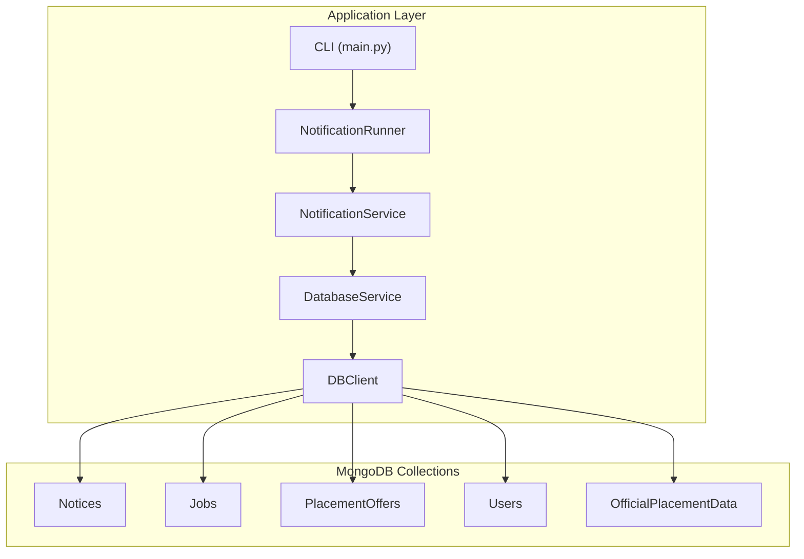
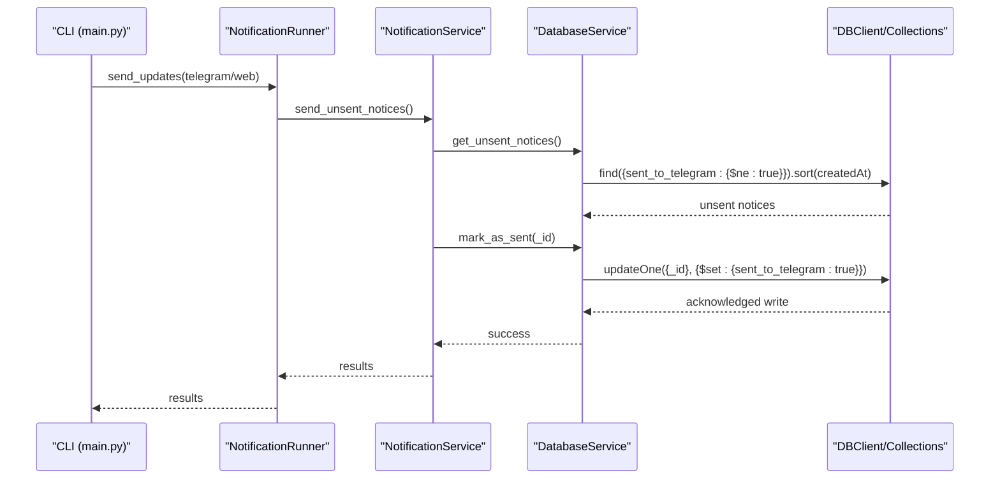
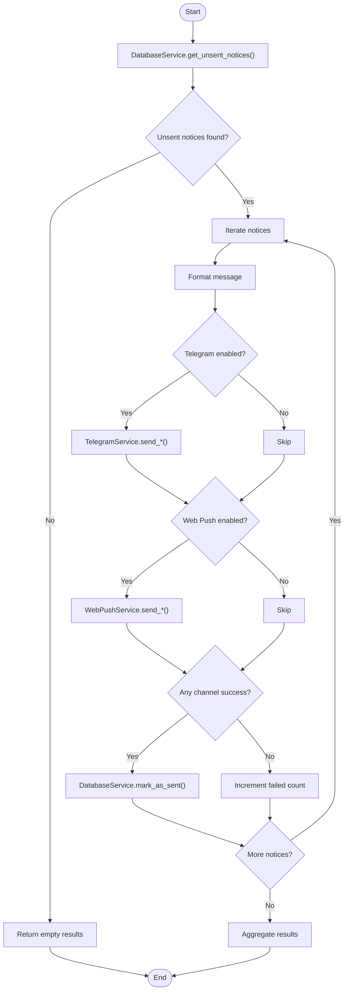
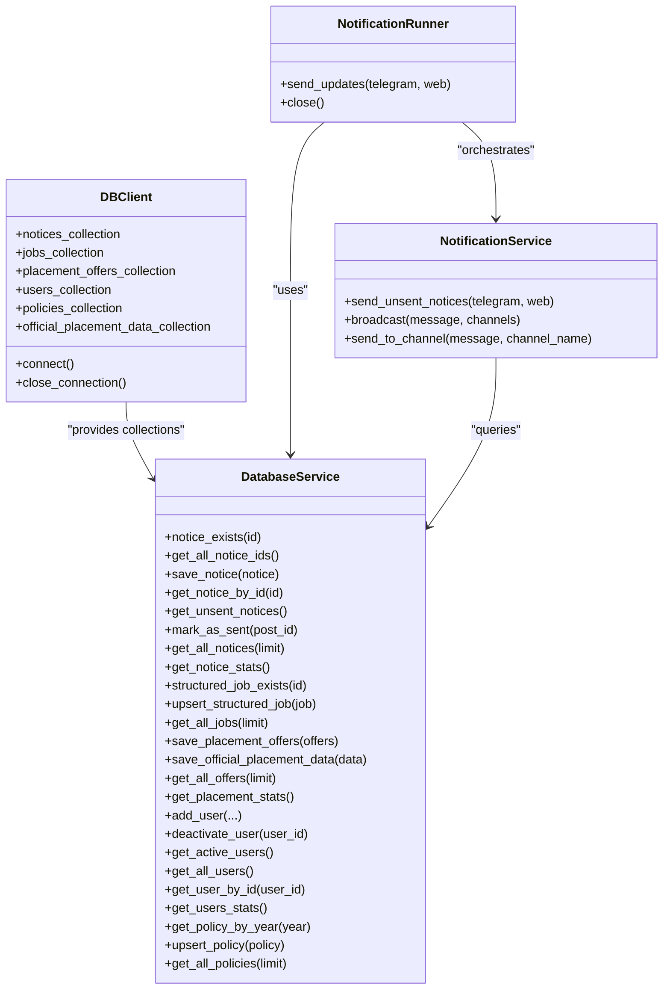

# Indexing Strategy & Performance Optimization

<cite>
**Referenced Files in This Document**
- [DATABASE.md](file://docs/DATABASE.md)
- [db_client.py](file://app/clients/db_client.py)
- [database_service.py](file://app/services/database_service.py)
- [notification_runner.py](file://app/runners/notification_runner.py)
- [notification_service.py](file://app/services/notification_service.py)
- [telegram_service.py](file://app/services/telegram_service.py)
- [web_push_service.py](file://app/services/web_push_service.py)
- [config.py](file://app/core/config.py)
- [main.py](file://app/main.py)
</cite>

## Table of Contents
1. [Introduction](#introduction)
2. [Project Structure](#project-structure)
3. [Core Components](#core-components)
4. [Architecture Overview](#architecture-overview)
5. [Detailed Component Analysis](#detailed-component-analysis)
6. [Dependency Analysis](#dependency-analysis)
7. [Performance Considerations](#performance-considerations)
8. [Troubleshooting Guide](#troubleshooting-guide)
9. [Conclusion](#conclusion)
10. [Appendices](#appendices)

## Introduction
This document details the MongoDB indexing strategy and performance optimization techniques used in the notification system. It covers collection indexes, rationale for each index, query patterns for notification delivery, user management, and data aggregation. It also explains index creation syntax, how to analyze query plans using explain(), and provides guidance on index maintenance, monitoring index usage statistics, and identifying missing indexes. Best practices for index design are included, balancing write performance implications, storage overhead, and read optimization trade-offs.

## Project Structure
The notification system is organized around five main MongoDB collections and supporting services:
- Notices: stores notifications and delivery status
- Jobs: structured job listings
- PlacementOffers: placement offer data
- Users: user subscription and preference data
- OfficialPlacementData: aggregated statistics snapshots

**Diagram sources**
- [main.py](file://app/main.py#L265-L281)
- [notification_runner.py](file://app/runners/notification_runner.py#L21-L115)
- [notification_service.py](file://app/services/notification_service.py#L93-L167)
- [database_service.py](file://app/services/database_service.py#L28-L46)
- [db_client.py](file://app/clients/db_client.py#L21-L61)

**Section sources**
- [DATABASE.md](file://docs/DATABASE.md#L30-L424)
- [db_client.py](file://app/clients/db_client.py#L16-L104)
- [database_service.py](file://app/services/database_service.py#L16-L46)
- [main.py](file://app/main.py#L265-L281)

## Core Components
- Database connectivity and collection access are encapsulated in DBClient, which connects to the SupersetPlacement database and exposes collection handles.
- DatabaseService implements CRUD and aggregation operations for notices, jobs, placement offers, users, and policies, delegating to DBClient.
- NotificationRunner orchestrates sending unsent notices via Telegram and/or Web Push using NotificationService.
- Services for Telegram and Web Push implement channel-specific logic and rely on DatabaseService for user and subscription data.

Key operational flows:
- CLI invokes NotificationRunner → NotificationService → DatabaseService → DBClient → MongoDB collections
- Indexes are created at the database level to optimize these flows

**Section sources**
- [db_client.py](file://app/clients/db_client.py#L16-L104)
- [database_service.py](file://app/services/database_service.py#L16-L795)
- [notification_runner.py](file://app/runners/notification_runner.py#L21-L115)
- [notification_service.py](file://app/services/notification_service.py#L13-L237)
- [telegram_service.py](file://app/services/telegram_service.py#L20-L351)
- [web_push_service.py](file://app/services/web_push_service.py#L27-L242)

## Architecture Overview
The indexing strategy targets three primary workloads:
- Notification delivery: finding unsent notices and marking them sent
- User management: active user queries and subscription lookups
- Data aggregation: statistics and analytics over placement and notices

**Diagram sources**
- [main.py](file://app/main.py#L265-L281)
- [notification_runner.py](file://app/runners/notification_runner.py#L60-L115)
- [notification_service.py](file://app/services/notification_service.py#L93-L167)
- [database_service.py](file://app/services/database_service.py#L116-L147)
- [db_client.py](file://app/clients/db_client.py#L82-L103)

## Detailed Component Analysis

### Notices Collection Indexes
Purpose-built indexes:
- Unique index on id for fast deduplication and existence checks
- Index on sent_to_telegram for efficient unsent notice retrieval
- Index on created_at for chronological sorting and recent queries
- Compound index on {source, category} for filtering by source and category

Rationale:
- Existence checks and insert-on-absent rely on the unique id index
- Delivery pipeline filters unsent notices using sent_to_telegram
- Sorting by created_at supports FIFO delivery ordering
- Compound index accelerates filtering by source and category

Index creation syntax:
- Unique: createIndex({ id: 1 }, { unique: true })
- Delivery: createIndex({ sent_to_telegram: 1 })
- Chronology: createIndex({ created_at: -1 })
- Filtering: createIndex({ source: 1, category: 1 })

Query plan analysis:
- Use explain("executionStats") on unsent notice queries to confirm index usage
- Verify that projection and limits minimize returned documents

Performance tips:
- Prefer filtered queries with sent_to_telegram and created_at
- Use projection to limit fields when retrieving notices
- Batch updates for marking sent to reduce round trips

**Section sources**
- [DATABASE.md](file://docs/DATABASE.md#L32-L96)
- [DATABASE.md](file://docs/DATABASE.md#L429-L435)
- [DATABASE.md](file://docs/DATABASE.md#L506-L515)
- [DATABASE.md](file://docs/DATABASE.md#L460-L468)
- [database_service.py](file://app/services/database_service.py#L56-L104)
- [database_service.py](file://app/services/database_service.py#L116-L147)

### Jobs Collection Indexes
Indexes:
- Unique index on job_id for upsert and existence checks
- Index on company for company-based queries
- Index on application_deadline for deadline-sensitive filtering
- Index on qualification_criteria.branches for branch-based targeting

Rationale:
- job_id uniqueness prevents duplicates during upsert
- company index supports filtering and reporting
- application_deadline enables near-future deadlines queries
- qualification_criteria.branches index targets eligible candidates

Index creation syntax:
- Unique: createIndex({ job_id: 1 }, { unique: true })
- Company: createIndex({ company: 1 })
- Deadline: createIndex({ application_deadline: 1 })
- Branches: createIndex({ "qualification_criteria.branches": 1 })

Query patterns:
- Upsert structured jobs using job_id
- Filter by company and deadline for targeted notifications
- Project only required fields to reduce payload

**Section sources**
- [DATABASE.md](file://docs/DATABASE.md#L98-L167)
- [DATABASE.md](file://docs/DATABASE.md#L437-L441)
- [database_service.py](file://app/services/database_service.py#L205-L257)

### PlacementOffers Collection Indexes
Indexes:
- Unique offer_id for deduplication and upsert
- company for company-centric analytics and notifications
- processing_status for workflow state queries
- created_at for reverse-chronological listing

Rationale:
- offer_id ensures idempotent processing of offers
- company index supports company-specific alerts
- processing_status optimizes workflow queries
- created_at sorts newest offers first

Index creation syntax:
- Unique: createIndex({ offer_id: 1 }, { unique: true })
- Company: createIndex({ company: 1 })
- Status: createIndex({ processing_status: 1 })
- Timestamp: createIndex({ created_at: -1 })

Query patterns:
- Sort by created_at descending for recent offers
- Group and count students per company for analytics

**Section sources**
- [DATABASE.md](file://docs/DATABASE.md#L169-L251)
- [DATABASE.md](file://docs/DATABASE.md#L443-L447)
- [database_service.py](file://app/services/database_service.py#L274-L441)

### Users Collection Indexes
Indexes:
- Unique user_id for user identity and soft-deletion workflows
- subscription_active for active user queries
- last_active for recency-based operations
- registered_at for registration-time analytics

Rationale:
- user_id uniqueness underpins user management
- subscription_active powers broadcast targeting
- last_active supports engagement metrics and cleanup
- registered_at enables cohort analysis

Index creation syntax:
- Unique: createIndex({ user_id: 1 }, { unique: true })
- Active: createIndex({ subscription_active: 1 })
- LastActive: createIndex({ last_active: -1 })
- Registered: createIndex({ registered_at: 1 })

Query patterns:
- Broadcast to active users
- Count active users efficiently
- Retrieve user profiles by user_id

**Section sources**
- [DATABASE.md](file://docs/DATABASE.md#L252-L330)
- [DATABASE.md](file://docs/DATABASE.md#L449-L453)
- [database_service.py](file://app/services/database_service.py#L616-L728)

### OfficialPlacementData Collection Indexes
Indexes:
- Unique data_id for snapshot identity
- timestamp descending for latest snapshot queries

Rationale:
- data_id ensures idempotent snapshot writes
- timestamp descending supports latest-first retrieval

Index creation syntax:
- Unique: createIndex({ data_id: 1 }, { unique: true })
- Latest: createIndex({ timestamp: -1 })

Query patterns:
- Find latest snapshot by sorting by timestamp desc
- Project only required fields for branch-wise statistics

**Section sources**
- [DATABASE.md](file://docs/DATABASE.md#L331-L424)
- [DATABASE.md](file://docs/DATABASE.md#L455-L457)
- [database_service.py](file://app/services/database_service.py#L443-L484)

### Notification Delivery Pipeline
The delivery pipeline retrieves unsent notices, formats messages, and sends via Telegram and/or Web Push, then marks them sent.

**Diagram sources**
- [notification_service.py](file://app/services/notification_service.py#L93-L167)
- [database_service.py](file://app/services/database_service.py#L116-L147)
- [telegram_service.py](file://app/services/telegram_service.py#L140-L172)
- [web_push_service.py](file://app/services/web_push_service.py#L120-L155)

**Section sources**
- [notification_service.py](file://app/services/notification_service.py#L93-L167)
- [database_service.py](file://app/services/database_service.py#L116-L147)
- [telegram_service.py](file://app/services/telegram_service.py#L140-L172)
- [web_push_service.py](file://app/services/web_push_service.py#L120-L155)

## Dependency Analysis
The notification system’s data access layer is decoupled via DBClient and DatabaseService, enabling testability and clean separation of concerns.

**Diagram sources**
- [db_client.py](file://app/clients/db_client.py#L16-L104)
- [database_service.py](file://app/services/database_service.py#L16-L795)
- [notification_runner.py](file://app/runners/notification_runner.py#L21-L115)
- [notification_service.py](file://app/services/notification_service.py#L13-L92)

**Section sources**
- [db_client.py](file://app/clients/db_client.py#L16-L104)
- [database_service.py](file://app/services/database_service.py#L16-L795)
- [notification_runner.py](file://app/runners/notification_runner.py#L21-L115)
- [notification_service.py](file://app/services/notification_service.py#L13-L92)

## Performance Considerations
Index creation syntax and usage:
- Notices: createIndex({ id: 1 }, { unique: true }), createIndex({ sent_to_telegram: 1 }), createIndex({ created_at: -1 }), createIndex({ source: 1, category: 1 })
- Jobs: createIndex({ job_id: 1 }, { unique: true }), createIndex({ company: 1 }), createIndex({ application_deadline: 1 }), createIndex({ "qualification_criteria.branches": 1 })
- PlacementOffers: createIndex({ offer_id: 1 }, { unique: true }), createIndex({ company: 1 }), createIndex({ processing_status: 1 }), createIndex({ created_at: -1 })
- Users: createIndex({ user_id: 1 }, { unique: true }), createIndex({ subscription_active: 1 }), createIndex({ last_active: -1 }), createIndex({ registered_at: 1 })
- OfficialPlacementData: createIndex({ data_id: 1 }, { unique: true }), createIndex({ timestamp: -1 })

Query plan analysis:
- Use explain("executionStats") on unsent notice retrieval to verify index usage
- Aggregate indexStats to review index effectiveness

Efficient queries and projections:
- Limit unsent notice retrieval and apply projection to reduce payload
- Use targeted filters on source/category and company/processing_status

Batch operations:
- Insert and update notices and offers in batches to improve throughput

TTL indexes:
- Consider expireAfterSeconds on temporary logs or transient collections to auto-clean

Connection pooling:
- PyMongo pools connections by default; configure maxPoolSize appropriately

Caching:
- Cache expensive computations like placement statistics for a short TTL

**Section sources**
- [DATABASE.md](file://docs/DATABASE.md#L429-L468)
- [DATABASE.md](file://docs/DATABASE.md#L506-L581)
- [database_service.py](file://app/services/database_service.py#L116-L147)
- [database_service.py](file://app/services/database_service.py#L274-L441)

## Troubleshooting Guide
Common issues and resolutions:
- Slow unsent notice retrieval: verify sent_to_telegram and created_at indexes; add projection and limit
- High write amplification: batch inserts/updates; avoid unnecessary index updates
- Index growth: monitor index sizes; drop unused indexes; consolidate overlapping indexes
- Query plan regressions: periodically run explain("executionStats"); adjust indexes based on actual query patterns

Monitoring index usage:
- Use $indexStats aggregation to inspect index usage frequency and size
- Track slow query logs and re-index based on hotspots

Identifying missing indexes:
- Review explain("executionStats") outputs for table scans on frequently queried fields
- Correlate with query patterns from notification delivery and user management

**Section sources**
- [DATABASE.md](file://docs/DATABASE.md#L460-L468)
- [database_service.py](file://app/services/database_service.py#L116-L147)

## Conclusion
The indexing strategy aligns closely with the notification system’s core workloads: delivering unsent notices, managing users, and aggregating placement data. Unique indexes on identifiers prevent duplication, while targeted single-field and compound indexes accelerate common queries. Proper use of explain(), projections, and batch operations ensures optimal performance. Regular monitoring and iterative index refinement will maintain efficiency as data volumes grow.

## Appendices

### Index Creation Syntax Reference
- Notices: createIndex({ id: 1 }, { unique: true }), createIndex({ sent_to_telegram: 1 }), createIndex({ created_at: -1 }), createIndex({ source: 1, category: 1 })
- Jobs: createIndex({ job_id: 1 }, { unique: true }), createIndex({ company: 1 }), createIndex({ application_deadline: 1 }), createIndex({ "qualification_criteria.branches": 1 })
- PlacementOffers: createIndex({ offer_id: 1 }, { unique: true }), createIndex({ company: 1 }), createIndex({ processing_status: 1 }), createIndex({ created_at: -1 })
- Users: createIndex({ user_id: 1 }, { unique: true }), createIndex({ subscription_active: 1 }), createIndex({ last_active: -1 }), createIndex({ registered_at: 1 })
- OfficialPlacementData: createIndex({ data_id: 1 }, { unique: true }), createIndex({ timestamp: -1 })

**Section sources**
- [DATABASE.md](file://docs/DATABASE.md#L429-L457)