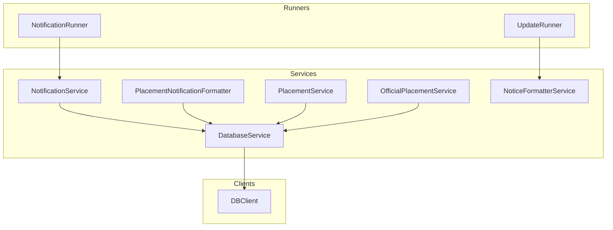
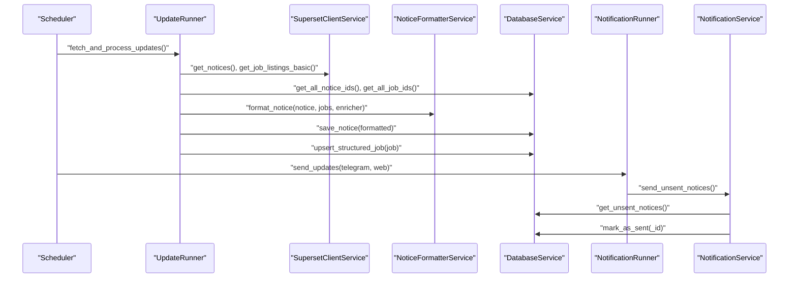
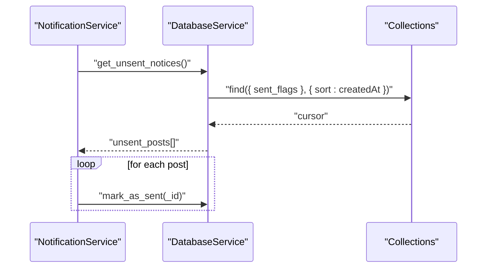
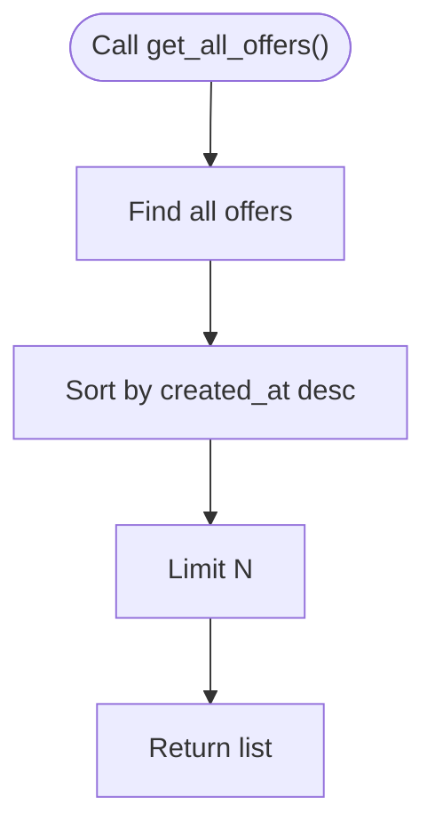
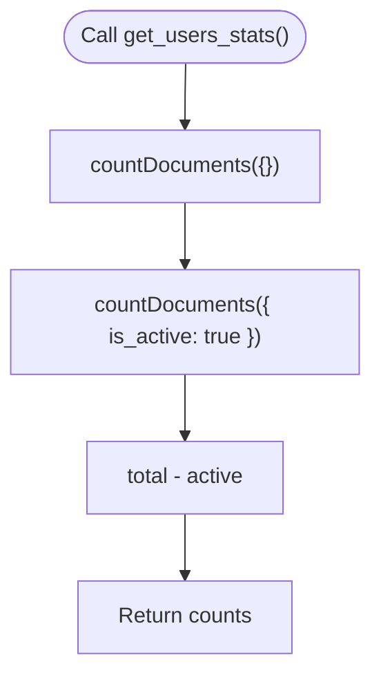
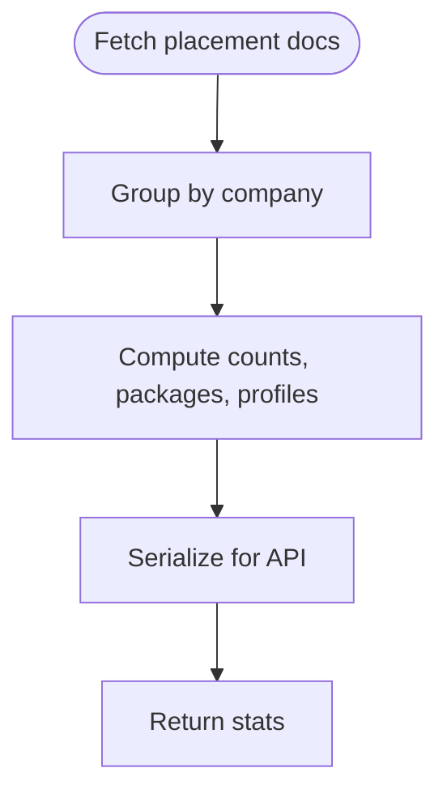
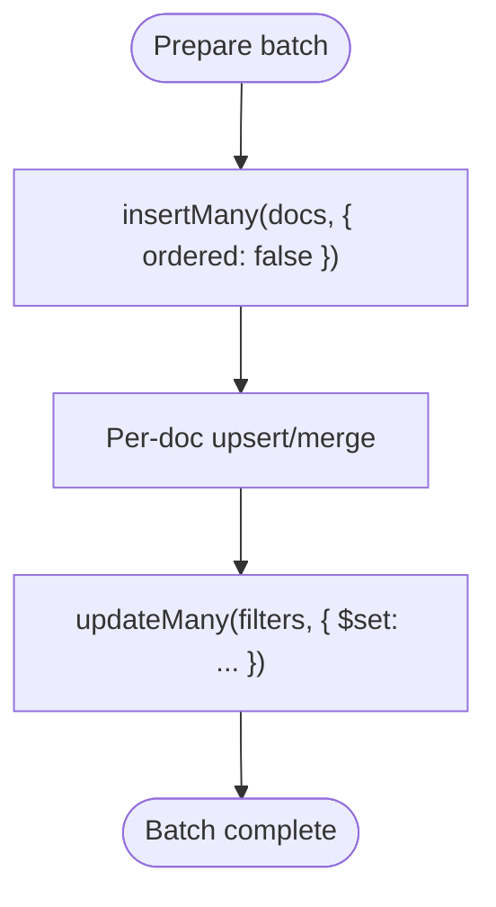
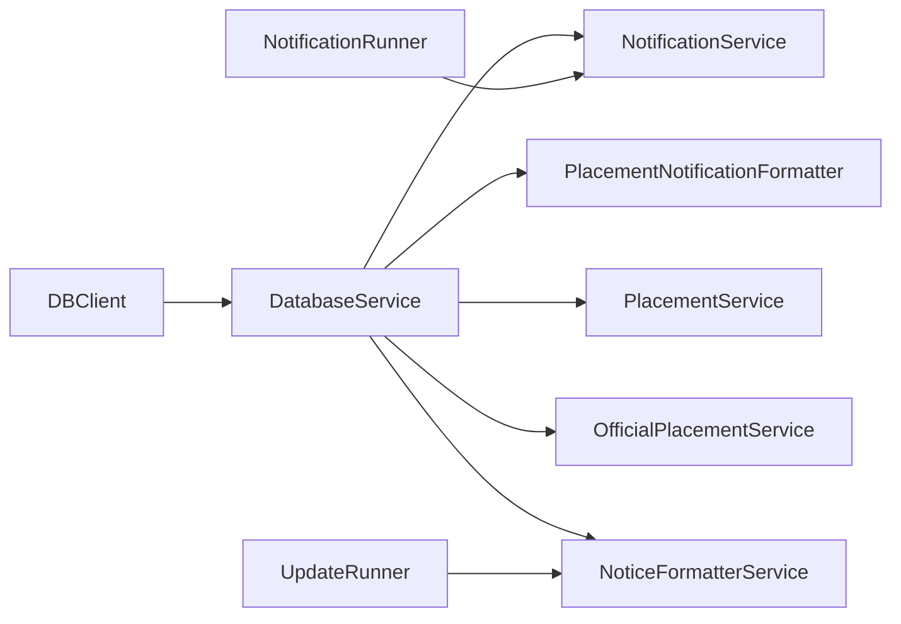

# Query patterns & practical examples

## Introduction
This page consolidates MongoDB query patterns and practical examples used across the notification system. It focuses on:
- Finding unsent notifications
- Retrieving recent placement data
- Counting active users
- Aggregating statistics (company-wise, branch-wise)
- Bulk operations (insertMany, updateMany, delete)
- Performance optimization (hints, indexes, cursor management)
- Error handling and query debugging (explain, profiling)

The goal is to provide actionable, code-mapped guidance for efficient data access and processing in the SuperSet Telegram Notification Bot.

## Project structure
The notification system is organized around a layered architecture:
- Clients: Database connectivity and raw collection access
- Services: Business logic for notices, jobs, placement offers, users, policies
- Runners: Orchestration for scheduled tasks (fetching updates, sending notifications)
- Docs: Database schema, indexing strategy, and query examples

```mermaid
graph TB
subgraph "Runners"
NR["NotificationRunner"]
UR["UpdateRunner"]
end
subgraph "Services"
NS["NotificationService"]
DB["DatabaseService"]
PNF["PlacementNotificationFormatter"]
PS["PlacementService"]
OPS["OfficialPlacementService"]
NFS["NoticeFormatterService"]
end
subgraph "Clients"
DBC["DBClient"]
end
NR --> NS
UR --> NFS
NS --> DB
PNF --> DB
PS --> DB
OPS --> DB
DB --> DBC
```

## Core components
This section maps the primary query patterns to concrete code paths and database operations.

- Finding unsent notices
  - Code path: `app/services/notification_service.py` calls `app/services/database_service.py` which executes a find with sorting.
  - Query pattern: find with filter on sent flags, sort by creation time, limit results.
  - Projection and sorting: see `app/services/database_service.py`.

- Retrieving recent placement data
  - Code path: `app/services/database_service.py` retrieves recent offers.
  - Query pattern: find with sort by created_at descending and limit.

- Counting active users
  - Code path: `app/services/database_service.py` and `app/services/database_service.py` use countDocuments.
  - Query pattern: countDocuments with filter on active flag.

- Aggregation examples
  - Company-wise totals: `app/services/database_service.py` computes per-company stats in-memory; MongoDB aggregation is also supported conceptually via `docs/DATABASE.md`.
  - Branch statistics: `docs/DATABASE.md` shows retrieval of branch_wise data from OfficialPlacementData.

- Bulk operations
  - Insert many notices/jobs/placement offers: `docs/DATABASE.md` and `app/services/database_service.py` demonstrate upsert/merge logic and batch-like processing.
  - Update many: `docs/DATABASE.md` shows updateMany for marking notifications as sent.

- Pagination patterns
  - Limit and sort: `app/services/database_service.py`, `app/services/database_service.py`, `app/services/database_service.py`, `app/services/database_service.py`.

- Projections
  - Selective fields: `app/services/database_service.py`, `app/services/database_service.py`, `app/services/database_service.py`, `docs/DATABASE.md`.

## Architecture overview
The notification pipeline integrates data ingestion, formatting, and dispatch.

```mermaid
sequenceDiagram
participant CRON as "Scheduler"
participant UR as "UpdateRunner"
participant SCR as "SupersetClientService"
participant NFS as "NoticeFormatterService"
participant DB as "DatabaseService"
participant NR as "NotificationRunner"
participant NS as "NotificationService"
CRON->>UR : "fetch_and_process_updates()"
UR->>SCR : "get_notices(), get_job_listings_basic()"
UR->>DB : "get_all_notice_ids(), get_all_job_ids()"
UR->>NFS : "format_notice(notice, jobs, enricher)"
UR->>DB : "save_notice(formatted)"
UR->>DB : "upsert_structured_job(job)"
CRON->>NR : "send_updates(telegram, web)"
NR->>NS : "send_unsent_notices()"
NS->>DB : "get_unsent_notices()"
NS->>DB : "mark_as_sent(_id)"
```

## Detailed component analysis

### Finding unsent notifications
- Purpose: Retrieve notices not yet sent to Telegram/WebPush for broadcast.
- Implementation:
  - DatabaseService.get_unsent_notices() builds a query on sent flags, sorts by creation time, and filters post-hoc for safety.
  - NotificationService.send_unsent_notices() iterates over results, sends via channels, and marks as sent.
- Query pattern:
  - Filter: sent flags (conceptually similar to docs examples)
  - Sort: createdAt ascending
  - Limit: caller-controlled batching
- Projections and pagination:
  - Use find with projection to minimize payload; combine with limit for pagination.

```mermaid
sequenceDiagram
participant NS as "NotificationService"
participant DB as "DatabaseService"
participant C as "Collections"
NS->>DB : "get_unsent_notices()"
DB->>C : "find({ sent_flags }, { sort : createdAt })"
C-->>DB : "cursor"
DB-->>NS : "unsent_posts[]"
loop for each post
NS->>DB : "mark_as_sent(_id)"
end
```

### Retrieving recent placement data
- Purpose: Fetch latest placement offers for display or processing.
- Implementation:
  - DatabaseService.get_all_offers() finds documents, sorts by created_at descending, and applies limit.
- Query pattern:
  - Filter: none (or optional filters in future)
  - Sort: created_at desc
  - Limit: configurable

```mermaid
flowchart TD
Start(["Call get_all_offers()"]) --> Query["Find all offers"]
Query --> Sort["Sort by created_at desc"]
Sort --> Limit["Limit N"]
Limit --> Return["Return list"]
```

### Counting active users
- Purpose: Compute active vs inactive user counts for analytics.
- Implementation:
  - DatabaseService.get_users_stats() uses countDocuments on is_active flag.
- Query pattern:
  - Filter: is_active true/false
  - Count: countDocuments

```mermaid
flowchart TD
Start(["Call get_users_stats()"]) --> Total["countDocuments({})"]
Total --> Active["countDocuments({ is_active: true })"]
Active --> Inactive["total - active"]
Inactive --> Return["Return counts"]
```

### Aggregating statistics (company-wise and branch-wise)
- Company-wise placement counts:
  - In-memory aggregation in DatabaseService.get_placement_stats() demonstrates grouping by company and computing metrics.
  - MongoDB aggregation is conceptually supported; see docs example for summing student counts per company.
- Branch statistics:
  - docs/DATABASE.md shows retrieving branch_wise data from OfficialPlacementData snapshots.

```mermaid
flowchart TD
Start(["Fetch placement docs"]) --> Group["Group by company"]
Group --> Metrics["Compute counts, packages, profiles"]
Metrics --> Serialize["Serialize for API"]
Serialize --> Return["Return stats"]
```

### Bulk operations for efficient data processing
- Insert many:
  - docs/DATABASE.md shows insertMany for notices/jobs/placement offers.
  - DatabaseService.save_placement_offers() performs batch-like upsert/merge per offer.
- Update many:
  - docs/DATABASE.md shows updateMany to mark notifications as sent.
- Delete:
  - docs/DATABASE.md outlines TTL indexes for auto-cleanup; deletion patterns can be modeled similarly.

```mermaid
flowchart TD
Start(["Prepare batch"]) --> Insert["insertMany(docs, { ordered: false })"]
Insert --> Upsert["Per-doc upsert/merge"]
Upsert --> Update["updateMany(filters, { $set: ... })"]
Update --> Done(["Batch complete"])
```

### Practical query patterns: find, projections, sorting, pagination
- Find unsent notices:
  - Filter by sent flags; sort by createdAt asc; limit results.
- Projections:
  - Select only needed fields (e.g., id, title, formatted_message) to reduce payload.
- Sorting:
  - createdAt desc for recent items; asc for chronological order.
- Pagination:
  - Combine sort + limit; maintain consistent sort key for reliable pagination.

## Dependency analysis
Key dependencies and their roles:
- DBClient: Provides MongoClient and collection handles.
- DatabaseService: Encapsulates CRUD and aggregation operations for notices, jobs, placement offers, users, policies.
- NotificationService: Orchestrates unsent notice dispatch across channels.
- Runners: Coordinate periodic tasks (fetching updates, sending notifications).

```mermaid
graph LR
DBC["DBClient"] --> DB["DatabaseService"]
DB --> NS["NotificationService"]
DB --> PNF["PlacementNotificationFormatter"]
DB --> PS["PlacementService"]
DB --> OPS["OfficialPlacementService"]
DB --> NFS["NoticeFormatterService"]
NR["NotificationRunner"] --> NS
UR["UpdateRunner"] --> NFS
```

## Performance considerations
- Efficient queries:
  - Avoid full collection scans; filter early and use indexes.
- Projections:
  - Retrieve only required fields to minimize network and memory overhead.
- Batch operations:
  - Prefer insertMany/updateMany for bulk writes; disable ordering when acceptable.
- TTL indexes:
  - Use expireAfterSeconds for auto-cleanup of transient data.
- Connection pooling:
  - Rely on PyMongo's built-in pooling; tune maxPoolSize appropriately.
- Cursor management:
  - Use sort + limit; avoid toArray() on large datasets.
- Index usage:
  - Ensure appropriate indexes exist for frequent filters and sorts (refer to schema and indexing docs).
- Query hints:
  - Use hint() when necessary to force index usage for critical queries.

[No sources needed since this section provides general guidance]

## Troubleshooting guide
- Query debugging:
  - Use explain("executionStats") to inspect query plans and index usage.
  - Enable profiling to capture slow queries.
- Error handling patterns:
  - Wrap database calls in try/catch; log errors and return safe defaults.
  - Validate inputs (e.g., notice ids, user ids) before querying.
- Common pitfalls:
  - Forgetting to sort consistently for pagination.
  - Not limiting results in long-running find operations.
  - Performing expensive operations in-memory when aggregation could be used.

## Conclusion
This page mapped MongoDB query patterns and practical examples used in the notification system. By using targeted filters, projections, sorting, and pagination, combined with bulk operations and proper indexing, the system achieves efficient data access and processing. The provided diagrams and code-path references enable developers to implement, debug, and optimize queries confidently.
