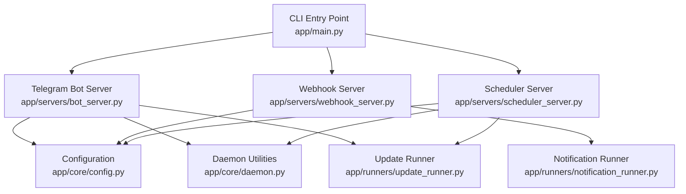
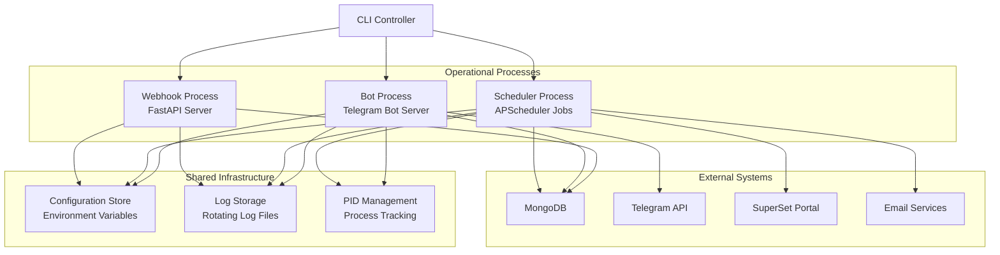
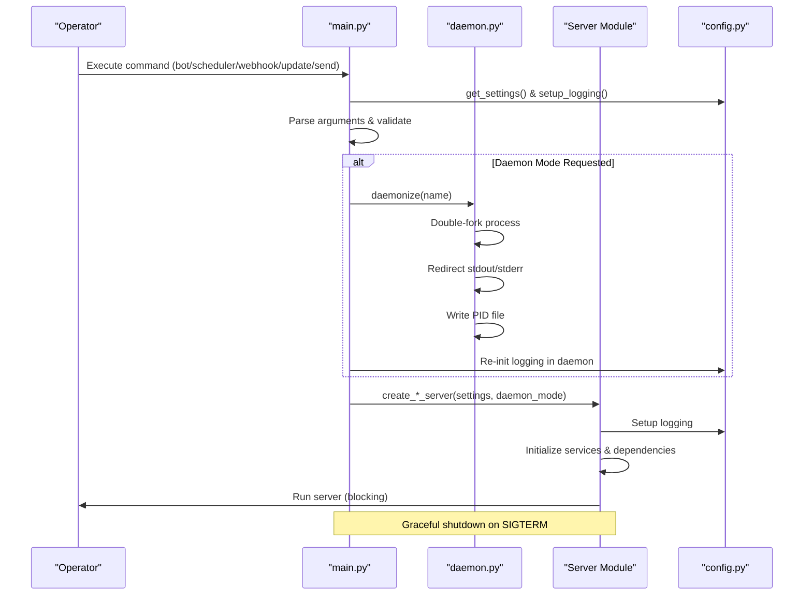
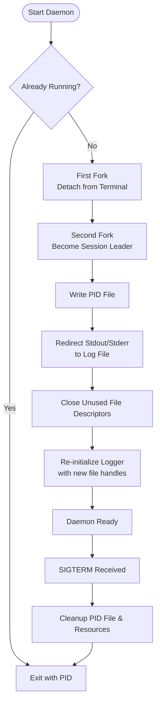
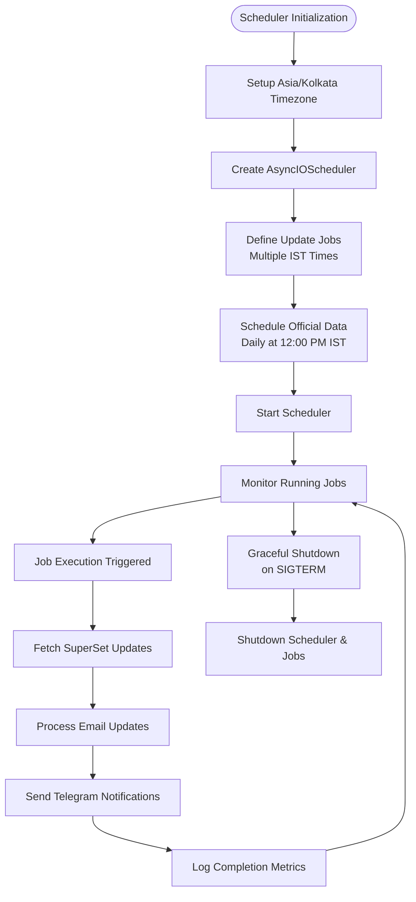
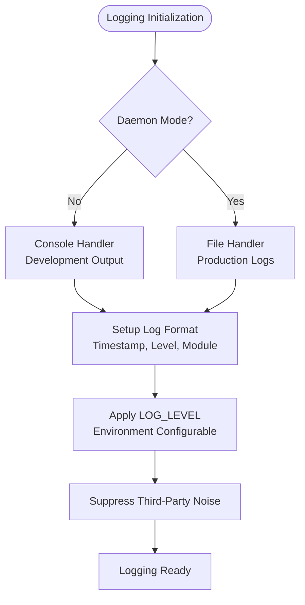
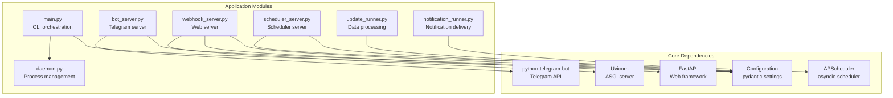

# Deployment Architecture

<cite>
**Referenced Files in This Document**
- [main.py](file://app/main.py)
- [daemon.py](file://app/core/daemon.py)
- [config.py](file://app/core/config.py)
- [bot_server.py](file://app/servers/bot_server.py)
- [webhook_server.py](file://app/servers/webhook_server.py)
- [scheduler_server.py](file://app/servers/scheduler_server.py)
- [update_runner.py](file://app/runners/update_runner.py)
- [notification_runner.py](file://app/runners/notification_runner.py)
- [requirements.txt](file://app/requirements.txt)
</cite>

## Table of Contents
1. [Introduction](#introduction)
2. [Project Structure](#project-structure)
3. [Core Components](#core-components)
4. [Architecture Overview](#architecture-overview)
5. [Detailed Component Analysis](#detailed-component-analysis)
6. [Dependency Analysis](#dependency-analysis)
7. [Performance Considerations](#performance-considerations)
8. [Troubleshooting Guide](#troubleshooting-guide)
9. [Conclusion](#conclusion)

## Introduction
This document describes the deployment and operational architecture of the SuperSet Telegram Notification Bot. The system is organized around a unified CLI that coordinates three distinct operational modes:
- Telegram bot server for user interactions and administrative commands
- FastAPI webhook server for REST APIs and health checks
- Scheduler server for automated update cycles

The architecture emphasizes daemon mode operation, robust process management, configurable scheduling with APScheduler, and comprehensive logging strategies suitable for both development and production environments.

## Project Structure
The application follows a modular structure with clear separation of concerns:
- CLI entry point orchestrating all operations
- Core utilities for configuration and daemon management
- Server implementations for Telegram, webhook, and scheduler
- Runner modules encapsulating update and notification logic
- Services and clients for external integrations

**Diagram sources**
- [main.py](file://app/main.py#L370-L632)
- [bot_server.py](file://app/servers/bot_server.py#L29-L519)
- [webhook_server.py](file://app/servers/webhook_server.py#L69-L387)
- [scheduler_server.py](file://app/servers/scheduler_server.py#L33-L388)
- [config.py](file://app/core/config.py#L188-L254)
- [daemon.py](file://app/core/daemon.py#L114-L251)
- [update_runner.py](file://app/runners/update_runner.py#L21-L278)
- [notification_runner.py](file://app/runners/notification_runner.py#L21-L160)

**Section sources**
- [main.py](file://app/main.py#L1-L632)
- [bot_server.py](file://app/servers/bot_server.py#L1-L519)
- [webhook_server.py](file://app/servers/webhook_server.py#L1-L387)
- [scheduler_server.py](file://app/servers/scheduler_server.py#L1-L388)

## Core Components
The deployment architecture centers on four primary components:

### CLI Orchestration Layer
The main entry point provides a unified interface for all operational modes:
- Command parsing with subcommands for bot, scheduler, webhook, and data operations
- Global daemon mode flag propagation
- Centralized logging initialization with verbose mode support
- Graceful error handling and user interruption management

### Daemon Management System
Unix-style daemonization with:
- Double-fork process isolation
- PID file management for process tracking
- Signal-based graceful shutdown
- Automatic cleanup of stale PID files
- Separate logging redirection for daemon processes

### Scheduling Infrastructure
APScheduler-based automation with:
- Configurable update cycles across multiple IST time slots
- Independent scheduler server decoupled from the Telegram bot
- Job persistence and restart resilience
- Timezone-aware scheduling with Asia/Kolkata timezone

### Operational Servers
Three specialized servers with distinct responsibilities:
- Telegram bot server with command handlers and administrative controls
- FastAPI webhook server with health checks and notification endpoints
- Scheduler server orchestrating automated update workflows

**Section sources**
- [main.py](file://app/main.py#L370-L632)
- [daemon.py](file://app/core/daemon.py#L114-L251)
- [scheduler_server.py](file://app/servers/scheduler_server.py#L274-L321)

## Architecture Overview
The system operates as a distributed set of cooperating processes, each designed for specific operational tasks:

**Diagram sources**
- [main.py](file://app/main.py#L370-L632)
- [daemon.py](file://app/core/daemon.py#L114-L251)
- [bot_server.py](file://app/servers/bot_server.py#L29-L519)
- [webhook_server.py](file://app/servers/webhook_server.py#L69-L387)
- [scheduler_server.py](file://app/servers/scheduler_server.py#L33-L388)

## Detailed Component Analysis

### CLI Command Processing Flow
The CLI orchestrates all operational modes through a centralized dispatch mechanism:

**Diagram sources**
- [main.py](file://app/main.py#L37-L85)
- [daemon.py](file://app/core/daemon.py#L114-L233)
- [config.py](file://app/core/config.py#L188-L254)

**Section sources**
- [main.py](file://app/main.py#L37-L85)
- [daemon.py](file://app/core/daemon.py#L114-L233)

### Daemon Process Lifecycle
The daemonization process ensures robust background operation:

**Diagram sources**
- [daemon.py](file://app/core/daemon.py#L114-L233)

**Section sources**
- [daemon.py](file://app/core/daemon.py#L114-L233)

### Scheduling Architecture with APScheduler
The scheduler implements a comprehensive update automation system:

**Diagram sources**
- [scheduler_server.py](file://app/servers/scheduler_server.py#L274-L321)
- [scheduler_server.py](file://app/servers/scheduler_server.py#L78-L117)

**Section sources**
- [scheduler_server.py](file://app/servers/scheduler_server.py#L274-L321)
- [scheduler_server.py](file://app/servers/scheduler_server.py#L78-L117)

### Logging Strategy and Configuration
The logging system adapts to operational modes:

**Diagram sources**
- [config.py](file://app/core/config.py#L188-L254)

**Section sources**
- [config.py](file://app/core/config.py#L188-L254)

### Server-Specific Architectures

#### Telegram Bot Server
The Telegram bot server provides user interaction capabilities:
- Command handlers for user registration, status checking, and statistics
- Administrative commands for system management
- Integration with database services for user management
- Polling-based message reception with graceful shutdown

#### Webhook Server
The FastAPI-based webhook server exposes:
- Health check endpoints for monitoring
- Web push subscription management
- Notification delivery endpoints
- Statistics endpoints for operational insights
- CORS configuration for cross-origin requests

#### Scheduler Server
The scheduler server orchestrates automated operations:
- Independent from Telegram bot for reliability
- Configurable update cycles across multiple IST time slots
- Official data scraping at designated intervals
- Job persistence and restart handling

**Section sources**
- [bot_server.py](file://app/servers/bot_server.py#L29-L519)
- [webhook_server.py](file://app/servers/webhook_server.py#L69-L387)
- [scheduler_server.py](file://app/servers/scheduler_server.py#L33-L388)

## Dependency Analysis
The system exhibits clear dependency relationships:

**Diagram sources**
- [requirements.txt](file://app/requirements.txt#L1-L81)
- [main.py](file://app/main.py#L31-L34)
- [bot_server.py](file://app/servers/bot_server.py#L12-L26)
- [webhook_server.py](file://app/servers/webhook_server.py#L14-L18)
- [scheduler_server.py](file://app/servers/scheduler_server.py#L22-L30)

**Section sources**
- [requirements.txt](file://app/requirements.txt#L1-L81)
- [main.py](file://app/main.py#L31-L34)

## Performance Considerations
The architecture incorporates several performance optimization strategies:

### Asynchronous Operations
- APScheduler integrated with AsyncIO for non-blocking job execution
- Telegram bot uses asynchronous polling model
- FastAPI server leverages async request handling

### Resource Management
- Connection pooling for database clients
- Lazy initialization of services to reduce startup overhead
- Efficient message splitting for Telegram notifications

### Scalability Patterns
- Decoupled server architecture allows independent scaling
- Modular runner components enable selective service deployment
- Environment-based configuration supports containerized deployments

## Troubleshooting Guide

### Process Management Issues
Common daemon-related problems and solutions:
- **Process already running**: Check PID files in data/pids/ directory
- **Stale PID files**: Manual cleanup required when processes terminate unexpectedly
- **Permission errors**: Verify write permissions for logs and pids directories

### Logging and Debugging
- **Missing logs**: Verify LOG_LEVEL environment variable and log file paths
- **Debug mode**: Use -v flag for verbose output in development
- **Production logging**: Ensure separate log files for bot and scheduler processes

### Service Dependencies
- **Telegram connectivity**: Verify TELEGRAM_BOT_TOKEN and TELEGRAM_CHAT_ID
- **Database connectivity**: Check MONGO_CONNECTION_STR configuration
- **Scheduler jobs**: Confirm timezone settings and network connectivity for external APIs

**Section sources**
- [daemon.py](file://app/core/daemon.py#L59-L112)
- [config.py](file://app/core/config.py#L188-L254)

## Conclusion
The deployment architecture provides a robust foundation for operational excellence through:
- Clear separation of concerns across dedicated server processes
- Reliable daemon management with proper process isolation
- Configurable scheduling with comprehensive monitoring capabilities
- Flexible logging strategies suitable for diverse operational environments
- Modular design enabling independent scaling and maintenance

The architecture successfully balances operational simplicity with production-grade reliability, supporting both development iteration and enterprise deployment scenarios.