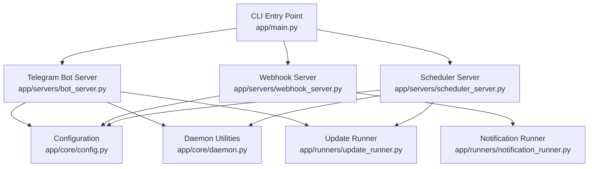
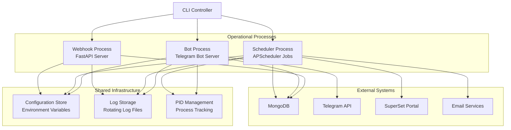
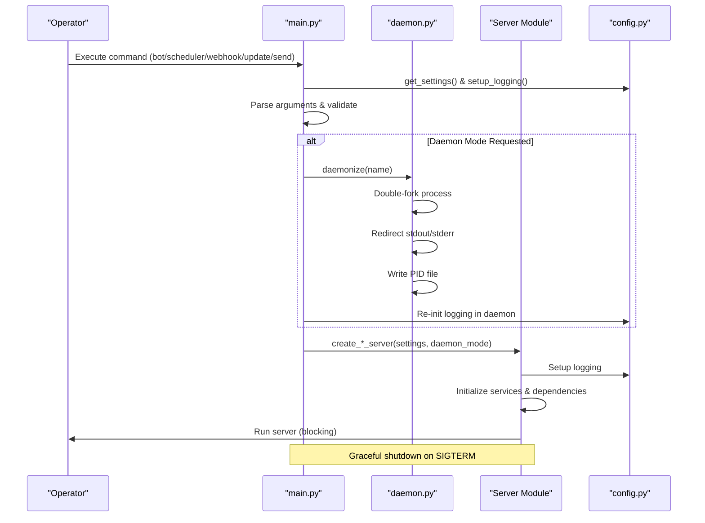
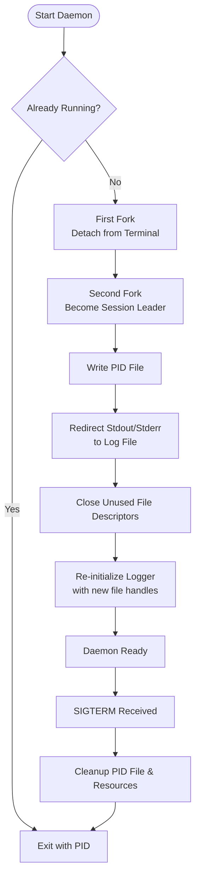
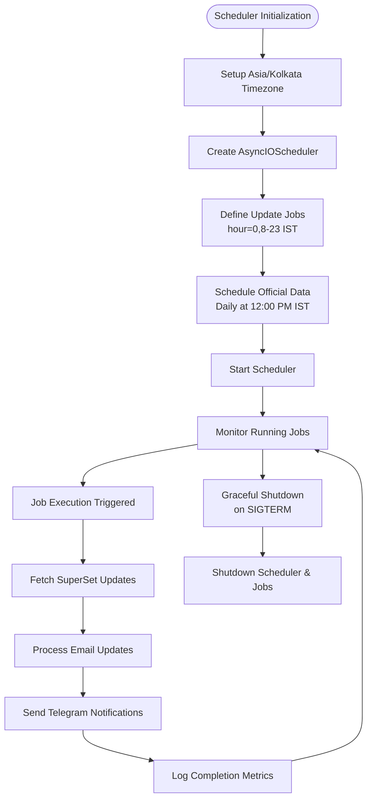
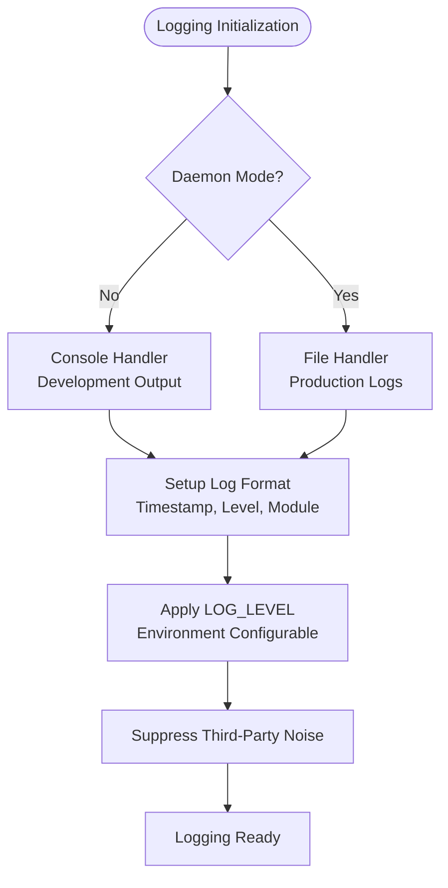
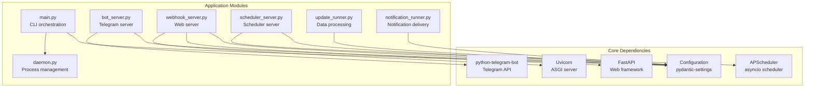

# Deployment architecture

## Introduction
How the bot runs in the wild. One CLI, three modes: bot, scheduler, webhook. Local/VPS, Docker, and the usual PaaS options, plus how daemon mode changes logging and process shape.

## Project structure
The application follows a modular structure :
- CLI entry point orchestrating all operations
- Core utilities for configuration and daemon management
- Server implementations for Telegram, webhook, and scheduler
- Runner modules encapsulating update and notification logic
- Services and clients for external integrations

```mermaid
graph TB
CLI["CLI Entry Point<br/>app/main.py"] --> Bot["Telegram Bot Server<br/>app/servers/bot_server.py"]
CLI --> Webhook["Webhook Server<br/>app/servers/webhook_server.py"]
CLI --> Scheduler["Scheduler Server<br/>app/servers/scheduler_server.py"]
Bot --> Config["Configuration<br/>app/core/config.py"]
Webhook --> Config
Scheduler --> Config
Bot --> Daemon["Daemon Utilities<br/>app/core/daemon.py"]
Scheduler --> Daemon
Bot --> UpdateRunner["Update Runner<br/>app/runners/update_runner.py"]
Scheduler --> UpdateRunner
Webhook --> NotificationRunner["Notification Runner<br/>app/runners/notification_runner.py"]
```

## Core components
The deployment architecture centers on four primary components:

### CLI orchestration layer
The main entry point is the CLI for all operational modes:
- Command parsing with subcommands for bot, scheduler, webhook, and data operations
- Global daemon mode flag propagation
- Centralized logging initialization with verbose mode support
- Graceful error handling and user interruption management

### Daemon management system
Unix-style daemonization :
- Double-fork process isolation
- PID file management for process tracking
- Signal-based graceful shutdown
- Automatic cleanup of stale PID files
- Separate logging redirection for daemon processes

### Scheduling infrastructure
APScheduler-based automation :
- Configurable update cycles across multiple IST time slots
- Independent scheduler server decoupled from the Telegram bot
- Job persistence and restart resilience
- Timezone-aware scheduling with Asia/Kolkata timezone

### Operational servers
Three specialized servers with distinct responsibilities:
- Telegram bot server with command handlers and administrative controls
- FastAPI webhook server with health checks and notification endpoints
- Scheduler server orchestrating automated update workflows

## Architecture overview
Separate processes, each with a job:

```mermaid
graph TB
subgraph "Operational Processes"
BotProc["Bot Process<br/>Telegram Bot Server"]
SchedProc["Scheduler Process<br/>APScheduler Jobs"]
WebProc["Webhook Process<br/>FastAPI Server"]
end
subgraph "Shared Infrastructure"
ConfigStore["Configuration Store<br/>Environment Variables"]
LogStore["Log Storage<br/>Rotating Log Files"]
PIDStore["PID Management<br/>Process Tracking"]
end
subgraph "External Systems"
Mongo["MongoDB"]
Telegram["Telegram API"]
Superset["SuperSet Portal"]
Email["Email Services"]
end
CLI["CLI Controller"] --> BotProc
CLI --> SchedProc
CLI --> WebProc
BotProc --> ConfigStore
SchedProc --> ConfigStore
WebProc --> ConfigStore
BotProc --> LogStore
SchedProc --> LogStore
WebProc --> LogStore
BotProc --> PIDStore
SchedProc --> PIDStore
BotProc --> Telegram
SchedProc --> Superset
SchedProc --> Email
WebProc --> Mongo
BotProc --> Mongo
SchedProc --> Mongo
```

## Detailed component analysis

### CLI command processing flow
The CLI orchestrates all operational modes through a centralized dispatch mechanism:

```mermaid
sequenceDiagram
participant User as "Operator"
participant CLI as "main.py"
participant Daemon as "daemon.py"
participant Server as "Server Module"
participant Config as "config.py"
User->>CLI : Execute command (bot/scheduler/webhook/update/send)
CLI->>Config : get_settings() & setup_logging()
CLI->>CLI : Parse arguments & validate
alt Daemon Mode Requested
CLI->>Daemon : daemonize(name)
Daemon->>Daemon : Double-fork process
Daemon->>Daemon : Redirect stdout/stderr
Daemon->>Daemon : Write PID file
CLI->>Config : Re-init logging in daemon
end
CLI->>Server : create_*_server(settings, daemon_mode)
Server->>Config : Setup logging
Server->>Server : Initialize services & dependencies
Server->>User : Run server (blocking)
Note over CLI,Server : Graceful shutdown on SIGTERM
```

### Daemon process lifecycle
Daemonization steps:

```mermaid
flowchart TD
Start(["Start Daemon"]) --> CheckRunning{"Already Running?"}
CheckRunning --> |Yes| Exit["Exit with PID"]
CheckRunning --> |No| FirstFork["First Fork<br/>Detach from Terminal"]
FirstFork --> SecondFork["Second Fork<br/>Become Session Leader"]
SecondFork --> WritePID["Write PID File"]
WritePID --> RedirectIO["Redirect Stdout/Stderr<br/>to Log File"]
RedirectIO --> CloseFD["Close Unused File Descriptors"]
CloseFD --> ReInitLogger["Re-initialize Logger<br/>with new file handles"]
ReInitLogger --> Ready["Daemon Ready"]
Ready --> Shutdown["SIGTERM Received"]
Shutdown --> Cleanup["Cleanup PID File & Resources"]
Cleanup --> Exit
```

### Scheduling architecture with APScheduler
The scheduler implements a detailed update automation system:

```mermaid
flowchart TD
Init(["Scheduler Initialization"]) --> SetupTZ["Setup Asia/Kolkata Timezone"]
SetupTZ --> CreateScheduler["Create AsyncIOScheduler"]
CreateScheduler --> DefineJobs["Define Update Jobs<br/>hour=0,8-23 IST"]
DefineJobs --> ScheduleOfficial["Schedule Official Data<br/>Daily at 12:00 PM IST"]
ScheduleOfficial --> StartScheduler["Start Scheduler"]
StartScheduler --> Monitor["Monitor Running Jobs"]
Monitor --> TriggerJob["Job Execution Triggered"]
TriggerJob --> FetchUpdates["Fetch SuperSet Updates"]
FetchUpdates --> ProcessEmails["Process Email Updates"]
ProcessEmails --> SendNotifications["Send Telegram Notifications"]
SendNotifications --> LogResult["Log Completion Metrics"]
LogResult --> Monitor
Monitor --> GracefulShutdown["Graceful Shutdown<br/>on SIGTERM"]
GracefulShutdown --> Cleanup["Shutdown Scheduler & Jobs"]
```

### Logging strategy and configuration
The logging system adapts to operational modes:

```mermaid
flowchart TD
Start(["Logging Initialization"]) --> CheckDaemon{"Daemon Mode?"}
CheckDaemon --> |No| ConsoleHandler["Console Handler<br/>Development Output"]
CheckDaemon --> |Yes| FileHandler["File Handler<br/>Production Logs"]
ConsoleHandler --> SetupFormat["Setup Log Format<br/>Timestamp, Level, Module"]
FileHandler --> SetupFormat
SetupFormat --> SetLevel["Apply LOG_LEVEL<br/>Environment Configurable"]
SetLevel --> ReduceNoise["Suppress Third-Party Noise"]
ReduceNoise --> InitComplete["Logging Ready"]
```

### Server-Specific architectures

#### Telegram bot server
The Telegram bot server provides user interaction capabilities:
- Command handlers for user registration, status checking, and statistics
- Administrative commands for system management
- Integration with database services for user management
- Polling-based message reception with graceful shutdown

#### Webhook server
The FastAPI-based webhook server exposes:
- Health check endpoints for monitoring
- Web push subscription management
- Notification delivery endpoints
- Statistics endpoints for operational insights
- CORS configuration for cross-origin requests

#### Scheduler server
The scheduler server orchestrates automated operations:
- Independent from Telegram bot for reliability
- Update jobs at midnight and 8 AM through 11 PM IST
- Official data scrape at 12:00 PM IST
- Job persistence and restart handling

## Dependency analysis
Dependencies:

```mermaid
graph TB
subgraph "Core Dependencies"
Config["Configuration<br/>pydantic-settings"]
APScheduler["APScheduler<br/>asyncio scheduler"]
Telegram["python-telegram-bot<br/>Telegram API"]
FastAPI["FastAPI<br/>Web framework"]
Uvicorn["Uvicorn<br/>ASGI server"]
end
subgraph "Application Modules"
Main["main.py<br/>CLI orchestration"]
Daemon["daemon.py<br/>Process management"]
Bot["bot_server.py<br/>Telegram server"]
Webhook["webhook_server.py<br/>Web server"]
Scheduler["scheduler_server.py<br/>Scheduler server"]
UpdateRunner["update_runner.py<br/>Data processing"]
NotifyRunner["notification_runner.py<br/>Notification delivery"]
end
Main --> Config
Main --> Daemon
Bot --> Config
Bot --> Telegram
Webhook --> Config
Webhook --> FastAPI
Webhook --> Uvicorn
Scheduler --> Config
Scheduler --> APScheduler
UpdateRunner --> Config
NotifyRunner --> Config
```

## Performance considerations
The architecture incorporates several performance work strategies:

### Asynchronous operations
- APScheduler integrated with AsyncIO for non-blocking job execution
- Telegram bot uses asynchronous polling model
- FastAPI server uses async request handling

### Resource management
- Connection pooling for database clients
- Lazy initialization of services to reduce startup overhead
- Efficient message splitting for Telegram notifications

### Scalability patterns
- Decoupled server architecture allows independent scaling
- Modular runner components enable selective service deployment
- Environment-based configuration supports containerized deployments

## Troubleshooting guide

### Process management issues
Common daemon-related problems and solutions:
- **Process already running**: Check PID files in data/pids/ directory
- **Stale PID files**: Manual cleanup required when processes terminate unexpectedly
- **Permission errors**: Verify write permissions for logs and pids directories

### Logging and debugging
- **Missing logs**: Verify LOG_LEVEL environment variable and log file paths
- **Debug mode**: Use -v flag for verbose output in development
- **Production logging**: Ensure separate log files for bot and scheduler processes

### Service dependencies
- **Telegram connectivity**: Verify TELEGRAM_BOT_TOKEN and TELEGRAM_CHAT_ID
- **Database connectivity**: Check MONGO_CONNECTION_STR configuration
- **Scheduler jobs**: Confirm timezone settings and network connectivity for external APIs

## Conclusion
Three processes, shared config, daemon mode when you leave. Split the servers so a bot restart does not kill the scheduler.
