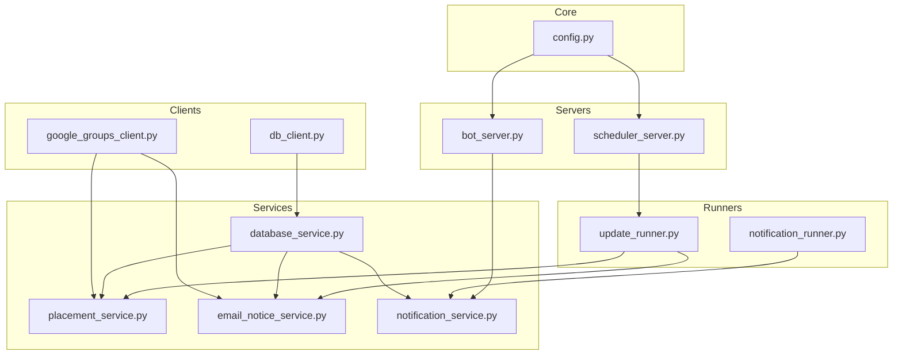
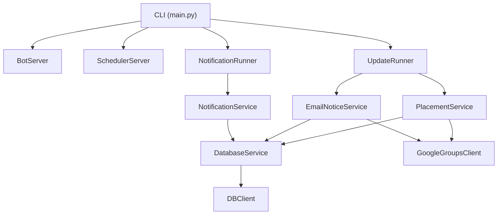
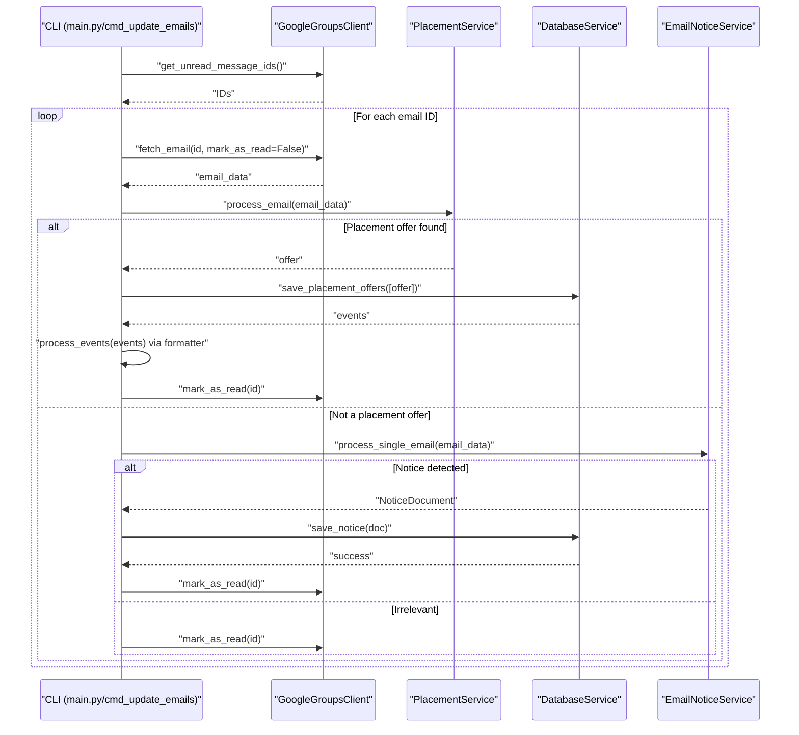
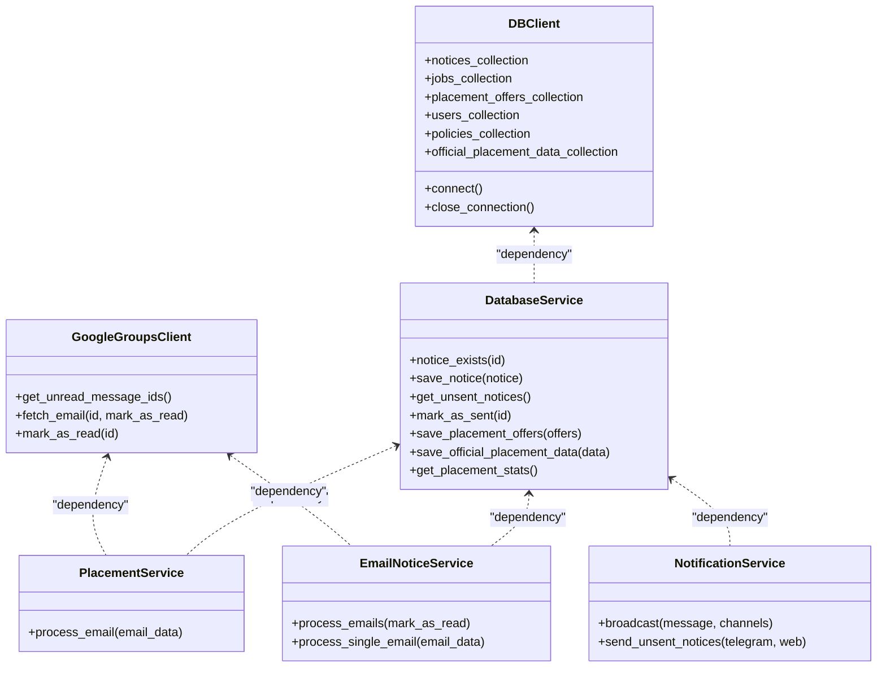
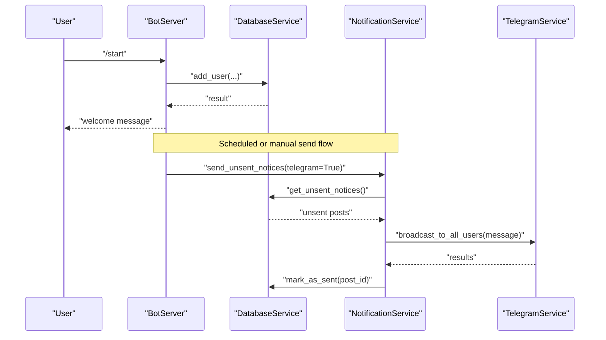
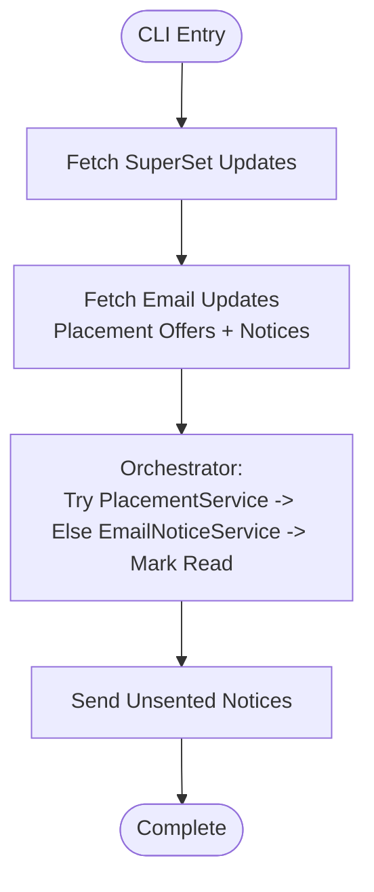
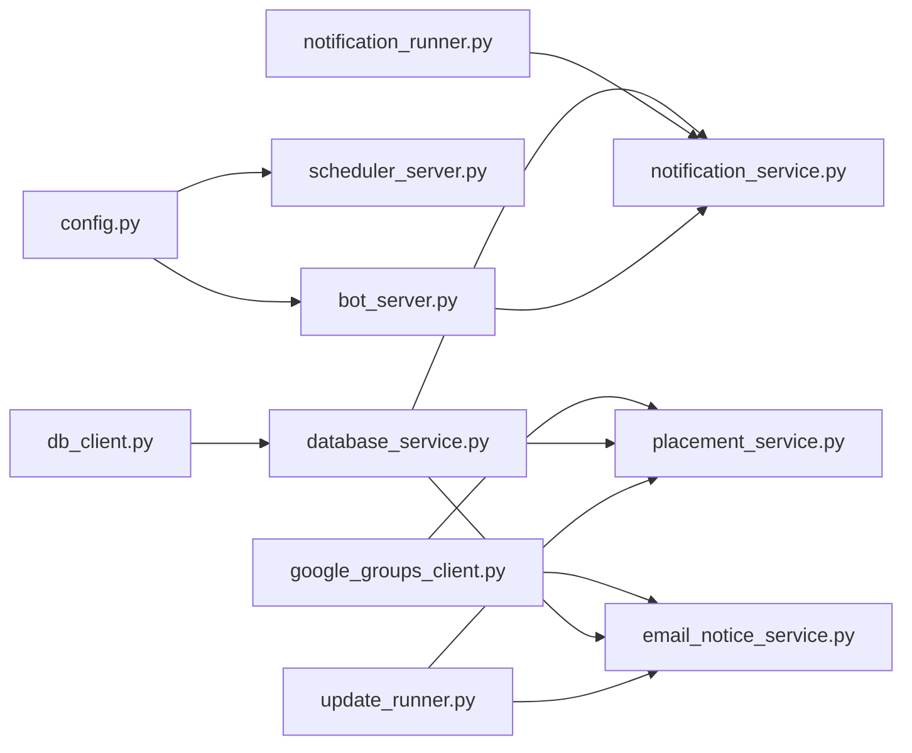

# Design Principles

<cite>
**Referenced Files in This Document**
- [main.py](file://app/main.py)
- [config.py](file://app/core/config.py)
- [database_service.py](file://app/services/database_service.py)
- [db_client.py](file://app/clients/db_client.py)
- [placement_service.py](file://app/services/placement_service.py)
- [google_groups_client.py](file://app/clients/google_groups_client.py)
- [email_notice_service.py](file://app/services/email_notice_service.py)
- [update_runner.py](file://app/runners/update_runner.py)
- [notification_service.py](file://app/services/notification_service.py)
- [notification_runner.py](file://app/runners/notification_runner.py)
- [bot_server.py](file://app/servers/bot_server.py)
- [scheduler_server.py](file://app/servers/scheduler_server.py)
</cite>

## Table of Contents
1. [Introduction](#introduction)
2. [Project Structure](#project-structure)
3. [Core Components](#core-components)
4. [Architecture Overview](#architecture-overview)
5. [Detailed Component Analysis](#detailed-component-analysis)
6. [Dependency Analysis](#dependency-analysis)
7. [Performance Considerations](#performance-considerations)
8. [Troubleshooting Guide](#troubleshooting-guide)
9. [Conclusion](#conclusion)

## Introduction
This document explains the design principles underpinning the SuperSet Telegram Notification Bot. The system follows Service-Oriented Architecture (SOA) with a strong emphasis on single responsibility, dependency injection for loose coupling, and separation of concerns across data access, business logic, presentation, and distribution layers. It also documents the orchestration pattern used for email processing to prevent data loss, ensuring emails are marked as read only after successful processing.

## Project Structure
The project is organized into distinct layers:
- Core: centralized configuration and logging
- Clients: external integrations (database, SuperSet, Google Groups)
- Services: business logic and processing (notices, placement, notifications)
- Runners: orchestrators for update and notification flows
- Servers: presentation layer (Telegram bot, scheduler, webhook)
- Data: local storage artifacts and configuration

**Diagram sources**
- [config.py](file://app/core/config.py#L156-L254)
- [db_client.py](file://app/clients/db_client.py#L16-L104)
- [google_groups_client.py](file://app/clients/google_groups_client.py#L19-L465)
- [database_service.py](file://app/services/database_service.py#L16-L795)
- [placement_service.py](file://app/services/placement_service.py#L419-L800)
- [email_notice_service.py](file://app/services/email_notice_service.py#L335-L800)
- [update_runner.py](file://app/runners/update_runner.py#L21-L278)
- [notification_service.py](file://app/services/notification_service.py#L13-L237)
- [notification_runner.py](file://app/runners/notification_runner.py#L21-L160)
- [bot_server.py](file://app/servers/bot_server.py#L29-L519)
- [scheduler_server.py](file://app/servers/scheduler_server.py#L33-L388)

**Section sources**
- [config.py](file://app/core/config.py#L156-L254)
- [db_client.py](file://app/clients/db_client.py#L16-L104)
- [database_service.py](file://app/services/database_service.py#L16-L795)
- [placement_service.py](file://app/services/placement_service.py#L419-L800)
- [email_notice_service.py](file://app/services/email_notice_service.py#L335-L800)
- [update_runner.py](file://app/runners/update_runner.py#L21-L278)
- [notification_service.py](file://app/services/notification_service.py#L13-L237)
- [notification_runner.py](file://app/runners/notification_runner.py#L21-L160)
- [bot_server.py](file://app/servers/bot_server.py#L29-L519)
- [scheduler_server.py](file://app/servers/scheduler_server.py#L33-L388)

## Core Components
- Configuration and logging: centralized settings and logging setup with daemon-aware printing and caching.
- Data access: DBClient encapsulates MongoDB connectivity; DatabaseService exposes typed operations and maintains loose coupling via dependency injection.
- Business logic: PlacementService and EmailNoticeService implement robust LLM-driven pipelines with classification, extraction, validation, and privacy sanitization.
- Orchestration: UpdateRunner and NotificationRunner coordinate multi-service workflows with DI and resource lifecycle management.
- Presentation: BotServer and SchedulerServer expose command-driven and scheduled workflows respectively, injecting services for decoupled operation.
- Distribution: NotificationService orchestrates multiple channels (Telegram, Web Push) and marks notices sent only after successful delivery.

Key design principles demonstrated:
- Single Responsibility: Each class focuses on one concern (e.g., DBClient for DB connectivity, PlacementService for placement extraction).
- Dependency Injection: Services accept dependencies via constructor parameters, enabling testability and runtime substitution.
- Separation of Concerns: Data access (clients), business logic (services), orchestration (runners), presentation (servers), and distribution (notification service) are cleanly separated.

**Section sources**
- [config.py](file://app/core/config.py#L18-L254)
- [db_client.py](file://app/clients/db_client.py#L16-L104)
- [database_service.py](file://app/services/database_service.py#L16-L795)
- [placement_service.py](file://app/services/placement_service.py#L419-L800)
- [email_notice_service.py](file://app/services/email_notice_service.py#L335-L800)
- [update_runner.py](file://app/runners/update_runner.py#L21-L278)
- [notification_service.py](file://app/services/notification_service.py#L13-L237)
- [notification_runner.py](file://app/runners/notification_runner.py#L21-L160)
- [bot_server.py](file://app/servers/bot_server.py#L29-L519)
- [scheduler_server.py](file://app/servers/scheduler_server.py#L33-L388)

## Architecture Overview
The system adheres to SOA with DI and layered separation:
- Presentation: Telegram bot and scheduler servers expose user/admin interfaces and scheduled jobs.
- Orchestration: Runners coordinate data ingestion and notification dispatch.
- Business Logic: Services encapsulate domain-specific processing (placement offers, notices, policies).
- Data Access: Clients abstract external systems; DatabaseService centralizes persistence operations.
- Distribution: NotificationService routes messages across channels and marks notices sent upon success.

**Diagram sources**
- [main.py](file://app/main.py#L370-L632)
- [bot_server.py](file://app/servers/bot_server.py#L455-L519)
- [scheduler_server.py](file://app/servers/scheduler_server.py#L365-L388)
- [update_runner.py](file://app/runners/update_runner.py#L254-L278)
- [notification_runner.py](file://app/runners/notification_runner.py#L132-L160)
- [placement_service.py](file://app/services/placement_service.py#L419-L800)
- [email_notice_service.py](file://app/services/email_notice_service.py#L335-L800)
- [notification_service.py](file://app/services/notification_service.py#L13-L237)
- [database_service.py](file://app/services/database_service.py#L16-L795)
- [db_client.py](file://app/clients/db_client.py#L16-L104)
- [google_groups_client.py](file://app/clients/google_groups_client.py#L19-L465)

## Detailed Component Analysis

### Dependency Injection Patterns and Loose Coupling
- Constructor injection: Services accept dependencies (e.g., DatabaseService, GoogleGroupsClient, TelegramService) via constructor parameters, enabling runtime substitution and test doubles.
- Optional dependencies with defaults: Runners conditionally construct services if not provided, allowing reuse across CLI, servers, and tests.
- Resource ownership: Runners track whether they own DB connections and close them deterministically via context managers.

Examples from the codebase:
- DatabaseService receives a DBClient instance and delegates collection access, keeping persistence logic isolated.
- PlacementService and EmailNoticeService accept DB and formatter/policy services, enabling modular composition.
- UpdateRunner and NotificationRunner accept services or construct them locally, supporting DI and isolation.

**Section sources**
- [database_service.py](file://app/services/database_service.py#L28-L46)
- [placement_service.py](file://app/services/placement_service.py#L430-L478)
- [email_notice_service.py](file://app/services/email_notice_service.py#L346-L392)
- [update_runner.py](file://app/runners/update_runner.py#L28-L55)
- [notification_runner.py](file://app/runners/notification_runner.py#L28-L59)

### Orchestration Pattern for Email Processing (Sequential, Read-Affirmed)
The email processing orchestrator ensures data integrity by fetching content without marking as read, attempting placement detection, then notice detection, and finally marking as read only after successful processing or determination of irrelevance. This prevents data loss if transient failures occur mid-processing.

**Diagram sources**
- [main.py](file://app/main.py#L105-L242)
- [google_groups_client.py](file://app/clients/google_groups_client.py#L88-L140)
- [placement_service.py](file://app/services/placement_service.py#L419-L800)
- [email_notice_service.py](file://app/services/email_notice_service.py#L699-L738)
- [database_service.py](file://app/services/database_service.py#L274-L442)

**Section sources**
- [main.py](file://app/main.py#L105-L242)
- [google_groups_client.py](file://app/clients/google_groups_client.py#L88-L140)
- [placement_service.py](file://app/services/placement_service.py#L419-L800)
- [email_notice_service.py](file://app/services/email_notice_service.py#L699-L738)
- [database_service.py](file://app/services/database_service.py#L274-L442)

### Service-Oriented Architecture with Single Responsibility
- DBClient: encapsulates MongoDB connection and collection access.
- DatabaseService: exposes typed CRUD and aggregation operations for notices, jobs, placement offers, users, policies, and official data.
- PlacementService: orchestrates placement offer extraction via LangGraph with classification, extraction, validation, and privacy sanitization.
- EmailNoticeService: processes non-placement notices via LLM-based classification and extraction, with policy update handling.
- NotificationService: aggregates channels and broadcasts messages, marking notices sent only after successful delivery.
- UpdateRunner and NotificationRunner: coordinate multi-service workflows for ingestion and distribution.

**Diagram sources**
- [db_client.py](file://app/clients/db_client.py#L16-L104)
- [database_service.py](file://app/services/database_service.py#L16-L795)
- [google_groups_client.py](file://app/clients/google_groups_client.py#L19-L465)
- [placement_service.py](file://app/services/placement_service.py#L419-L800)
- [email_notice_service.py](file://app/services/email_notice_service.py#L335-L800)
- [notification_service.py](file://app/services/notification_service.py#L13-L237)

**Section sources**
- [db_client.py](file://app/clients/db_client.py#L16-L104)
- [database_service.py](file://app/services/database_service.py#L16-L795)
- [google_groups_client.py](file://app/clients/google_groups_client.py#L19-L465)
- [placement_service.py](file://app/services/placement_service.py#L419-L800)
- [email_notice_service.py](file://app/services/email_notice_service.py#L335-L800)
- [notification_service.py](file://app/services/notification_service.py#L13-L237)

### Presentation and Distribution Layers
- BotServer: Telegram bot with DI for DB, notification, admin, and stats services; registers command handlers and runs in polling mode.
- SchedulerServer: schedules periodic update jobs mirroring legacy behavior and official placement scraping.
- NotificationRunner: constructs channels (Telegram/Web Push) and delegates to NotificationService for sending unsent notices.

**Diagram sources**
- [bot_server.py](file://app/servers/bot_server.py#L87-L164)
- [notification_service.py](file://app/services/notification_service.py#L93-L167)
- [notification_runner.py](file://app/runners/notification_runner.py#L60-L115)
- [database_service.py](file://app/services/database_service.py#L116-L147)

**Section sources**
- [bot_server.py](file://app/servers/bot_server.py#L87-L164)
- [notification_service.py](file://app/services/notification_service.py#L93-L167)
- [notification_runner.py](file://app/runners/notification_runner.py#L60-L115)
- [database_service.py](file://app/services/database_service.py#L116-L147)

### Orchestration Flow in CLI (SuperSet + Emails + Send)
The CLI composes a full pipeline: SuperSet updates, email updates (placement offers and notices), and notification dispatch. This demonstrates SOA with DI and layered orchestration.

**Diagram sources**
- [main.py](file://app/main.py#L245-L262)
- [update_runner.py](file://app/runners/update_runner.py#L56-L148)
- [scheduler_server.py](file://app/servers/scheduler_server.py#L78-L117)

**Section sources**
- [main.py](file://app/main.py#L245-L262)
- [update_runner.py](file://app/runners/update_runner.py#L56-L148)
- [scheduler_server.py](file://app/servers/scheduler_server.py#L78-L117)

## Dependency Analysis
The system exhibits low coupling and high cohesion:
- Clients depend on external APIs; services depend on clients and shared protocols.
- Runners depend on services and orchestrate workflows.
- Servers depend on services for presentation and scheduling.

**Diagram sources**
- [config.py](file://app/core/config.py#L156-L254)
- [db_client.py](file://app/clients/db_client.py#L16-L104)
- [database_service.py](file://app/services/database_service.py#L16-L795)
- [google_groups_client.py](file://app/clients/google_groups_client.py#L19-L465)
- [placement_service.py](file://app/services/placement_service.py#L419-L800)
- [email_notice_service.py](file://app/services/email_notice_service.py#L335-L800)
- [notification_service.py](file://app/services/notification_service.py#L13-L237)
- [update_runner.py](file://app/runners/update_runner.py#L21-L278)
- [notification_runner.py](file://app/runners/notification_runner.py#L21-L160)
- [bot_server.py](file://app/servers/bot_server.py#L29-L519)
- [scheduler_server.py](file://app/servers/scheduler_server.py#L33-L388)

**Section sources**
- [config.py](file://app/core/config.py#L156-L254)
- [db_client.py](file://app/clients/db_client.py#L16-L104)
- [database_service.py](file://app/services/database_service.py#L16-L795)
- [google_groups_client.py](file://app/clients/google_groups_client.py#L19-L465)
- [placement_service.py](file://app/services/placement_service.py#L419-L800)
- [email_notice_service.py](file://app/services/email_notice_service.py#L335-L800)
- [notification_service.py](file://app/services/notification_service.py#L13-L237)
- [update_runner.py](file://app/runners/update_runner.py#L21-L278)
- [notification_runner.py](file://app/runners/notification_runner.py#L21-L160)
- [bot_server.py](file://app/servers/bot_server.py#L29-L519)
- [scheduler_server.py](file://app/servers/scheduler_server.py#L33-L388)

## Performance Considerations
- Lazy initialization and DI reduce startup overhead and enable reuse of services.
- Batch operations: DatabaseService merges placement offers and computes statistics efficiently.
- Conditional enrichment: UpdateRunner filters existing IDs and enriches only new jobs to minimize API calls.
- Sequential email processing avoids concurrent writes and ensures atomicity of read-mark cycles.
- Logging and daemon mode reduce I/O overhead in production environments.

[No sources needed since this section provides general guidance]

## Troubleshooting Guide
- Configuration and logging: Centralized settings and logging setup with daemon-aware printing and cached settings.
- Graceful error handling: Services catch exceptions, log errors, and avoid marking emails as read on failure to retry later.
- Resource lifecycle: Runners manage DB connections and close them deterministically.

**Section sources**
- [config.py](file://app/core/config.py#L156-L254)
- [main.py](file://app/main.py#L169-L226)
- [update_runner.py](file://app/runners/update_runner.py#L178-L236)
- [notification_runner.py](file://app/runners/notification_runner.py#L117-L129)

## Conclusion
The SuperSet Telegram Notification Bot applies SOA with DI and separation of concerns to achieve maintainability, testability, and extensibility. The orchestration pattern for email processing prioritizes data integrity by marking emails as read only after successful processing. These design principles enable clean layering, easy testing, and straightforward extension of new sources, channels, and processing logic.