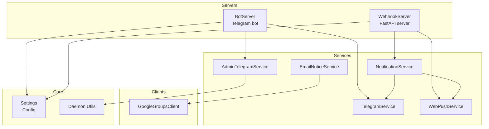
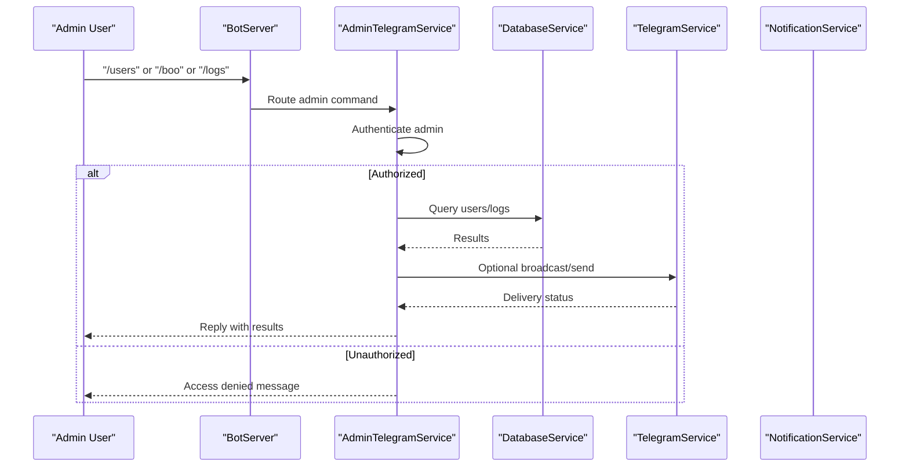
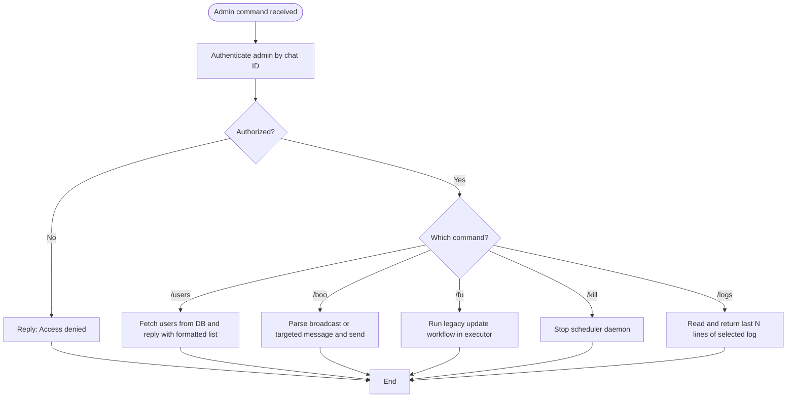
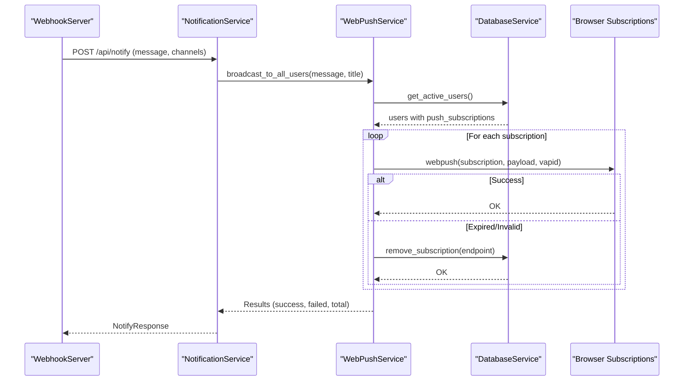
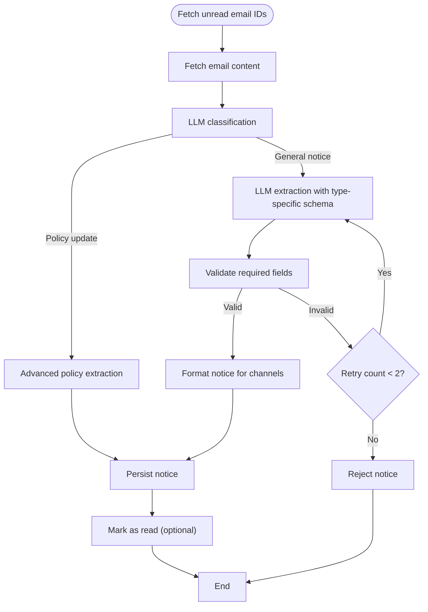
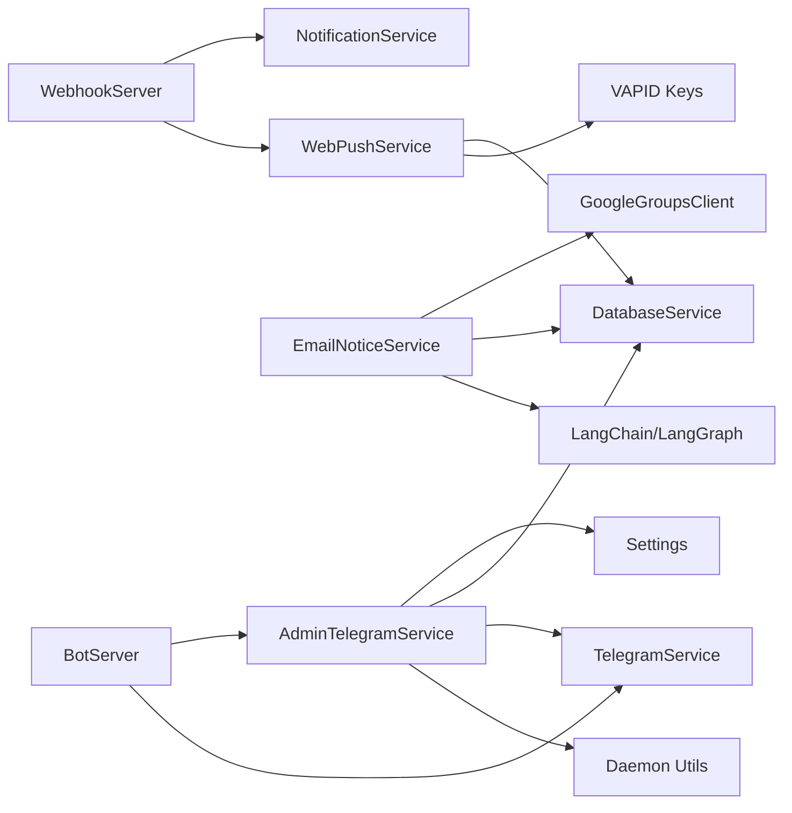

# Administrative Services

<cite>
**Referenced Files in This Document**
- [admin_telegram_service.py](file://app/services/admin_telegram_service.py)
- [web_push_service.py](file://app/services/web_push_service.py)
- [email_notice_service.py](file://app/services/email_notice_service.py)
- [config.py](file://app/core/config.py)
- [daemon.py](file://app/core/daemon.py)
- [bot_server.py](file://app/servers/bot_server.py)
- [webhook_server.py](file://app/servers/webhook_server.py)
- [telegram_service.py](file://app/services/telegram_service.py)
- [notification_service.py](file://app/services/notification_service.py)
- [google_groups_client.py](file://app/clients/google_groups_client.py)
</cite>

## Table of Contents
1. [Introduction](#introduction)
2. [Project Structure](#project-structure)
3. [Core Components](#core-components)
4. [Architecture Overview](#architecture-overview)
5. [Detailed Component Analysis](#detailed-component-analysis)
6. [Dependency Analysis](#dependency-analysis)
7. [Performance Considerations](#performance-considerations)
8. [Troubleshooting Guide](#troubleshooting-guide)
9. [Conclusion](#conclusion)

## Introduction
This document describes the administrative services that manage system operations, user communications, and external integrations. It focuses on:
- AdminTelegramService for administrative bot commands, permission enforcement, and system control
- WebPushService for VAPID-secured browser push notifications, subscription management, and delivery
- EmailNoticeService for processing general notices via Google Groups, LLM-based classification/extraction, and distribution

It also covers configuration, security considerations, subscription workflows, and how these services integrate with the broader notification ecosystem.

## Project Structure
The administrative services live under app/services and are integrated with app/servers, app/clients, and app/core. The primary entry points are:
- Telegram bot server for user/admin commands
- Webhook server for external integrations and push subscription APIs
- Core configuration and daemon utilities

**Diagram sources**
- [bot_server.py](file://app/servers/bot_server.py#L455-L507)
- [webhook_server.py](file://app/servers/webhook_server.py#L69-L131)
- [admin_telegram_service.py](file://app/services/admin_telegram_service.py#L19-L42)
- [telegram_service.py](file://app/services/telegram_service.py#L20-L51)
- [notification_service.py](file://app/services/notification_service.py#L13-L40)
- [web_push_service.py](file://app/services/web_push_service.py#L27-L79)
- [email_notice_service.py](file://app/services/email_notice_service.py#L335-L393)
- [google_groups_client.py](file://app/clients/google_groups_client.py#L19-L51)
- [config.py](file://app/core/config.py#L18-L128)
- [daemon.py](file://app/core/daemon.py#L24-L73)

**Section sources**
- [bot_server.py](file://app/servers/bot_server.py#L455-L507)
- [webhook_server.py](file://app/servers/webhook_server.py#L69-L131)
- [config.py](file://app/core/config.py#L18-L128)

## Core Components
- AdminTelegramService: Enforces admin-only commands, authenticates administrators, and executes administrative actions such as user listing, broadcast messaging, scraping triggers, scheduler control, and log viewing.
- WebPushService: Implements the INotificationChannel protocol for web push, manages VAPID authentication, broadcasts to all users, and handles subscription CRUD operations.
- EmailNoticeService: Processes non-placement notices from Google Groups using a LangGraph pipeline, classifies and extracts structured data via LLM, formats notices, and persists them to the database.

**Section sources**
- [admin_telegram_service.py](file://app/services/admin_telegram_service.py#L19-L42)
- [web_push_service.py](file://app/services/web_push_service.py#L27-L79)
- [email_notice_service.py](file://app/services/email_notice_service.py#L335-L393)

## Architecture Overview
The administrative services operate within two primary servers:
- Telegram Bot Server: Hosts user-facing commands and admin commands routed through AdminTelegramService.
- Webhook Server: Exposes REST endpoints for push subscriptions, notifications, and statistics; integrates NotificationService and WebPushService.

**Diagram sources**
- [bot_server.py](file://app/servers/bot_server.py#L379-L401)
- [admin_telegram_service.py](file://app/services/admin_telegram_service.py#L43-L55)
- [telegram_service.py](file://app/services/telegram_service.py#L140-L172)

**Section sources**
- [bot_server.py](file://app/servers/bot_server.py#L366-L404)
- [admin_telegram_service.py](file://app/services/admin_telegram_service.py#L43-L108)

## Detailed Component Analysis

### AdminTelegramService
Responsibilities:
- Admin authentication via a configured admin chat ID
- User listing with activation status
- Broadcast messaging to all users or targeted user
- Triggering scraping workflows via legacy command wrapper
- Scheduler control (start/stop) using daemon utilities
- Log viewing for bot and scheduler logs

Security and Permissions:
- Uses a dedicated admin chat ID to restrict command access
- Logs unauthorized attempts and replies with access denial

Operational Commands:
- /users: Lists all users with status
- /boo broadcast <message>: Broadcasts to all users
- /boo <chat_id> <message>: Sends targeted message
- /fu or /s or /scrapyyy: Runs legacy update workflow in a thread pool to avoid blocking the event loop
- /kill: Stops the scheduler daemon
- /logs [bot|scheduler]: Reads and returns recent log lines safely escaped

**Diagram sources**
- [admin_telegram_service.py](file://app/services/admin_telegram_service.py#L43-L108)
- [admin_telegram_service.py](file://app/services/admin_telegram_service.py#L109-L192)
- [admin_telegram_service.py](file://app/services/admin_telegram_service.py#L193-L248)
- [admin_telegram_service.py](file://app/services/admin_telegram_service.py#L249-L276)
- [admin_telegram_service.py](file://app/services/admin_telegram_service.py#L277-L349)
- [daemon.py](file://app/core/daemon.py#L75-L111)

**Section sources**
- [admin_telegram_service.py](file://app/services/admin_telegram_service.py#L43-L349)
- [daemon.py](file://app/core/daemon.py#L59-L111)

### WebPushService
Responsibilities:
- Implements INotificationChannel protocol for web push
- VAPID authentication for push delivery
- Broadcast to all users with push subscriptions
- Per-user push delivery
- Subscription management endpoints (save/remove)
- Graceful degradation when pywebpush is unavailable

Configuration and Security:
- Requires VAPID private/public key and contact email
- Checks availability of pywebpush and VAPID keys at initialization
- Uses VAPID claims with mailto contact URI

Delivery Workflow:
- Broadcast: Iterates active users and their push subscriptions, sending individual pushes
- Per-user: Retrieves user’s subscriptions and sends to each
- Error handling: Removes invalid/expired subscriptions on 404/410 responses

**Diagram sources**
- [webhook_server.py](file://app/servers/webhook_server.py#L244-L264)
- [notification_service.py](file://app/services/notification_service.py#L61-L91)
- [web_push_service.py](file://app/services/web_push_service.py#L120-L155)
- [web_push_service.py](file://app/services/web_push_service.py#L157-L193)

**Section sources**
- [web_push_service.py](file://app/services/web_push_service.py#L27-L79)
- [web_push_service.py](file://app/services/web_push_service.py#L120-L155)
- [web_push_service.py](file://app/services/web_push_service.py#L157-L193)
- [webhook_server.py](file://app/servers/webhook_server.py#L186-L238)

### EmailNoticeService
Responsibilities:
- Fetches unread emails from Google Groups via GoogleGroupsClient
- Classifies and extracts structured notice data using a LangGraph pipeline with LLM
- Formats notices for downstream channels
- Persists notices to the database

Pipeline Highlights:
- Classification: LLM determines relevance and type
- Extraction: Structured JSON extraction with type-specific fields
- Validation: Ensures minimal required fields
- Policy detection: Specialized handling for placement policy updates
- Formatting: Produces human-readable formatted_message for channels

**Diagram sources**
- [email_notice_service.py](file://app/services/email_notice_service.py#L636-L697)
- [email_notice_service.py](file://app/services/email_notice_service.py#L419-L433)
- [email_notice_service.py](file://app/services/email_notice_service.py#L435-L569)
- [email_notice_service.py](file://app/services/email_notice_service.py#L570-L590)
- [email_notice_service.py](file://app/services/email_notice_service.py#L592-L607)
- [email_notice_service.py](file://app/services/email_notice_service.py#L728-L738)

**Section sources**
- [email_notice_service.py](file://app/services/email_notice_service.py#L335-L393)
- [email_notice_service.py](file://app/services/email_notice_service.py#L419-L569)
- [email_notice_service.py](file://app/services/email_notice_service.py#L570-L590)
- [email_notice_service.py](file://app/services/email_notice_service.py#L592-L607)
- [email_notice_service.py](file://app/services/email_notice_service.py#L636-L697)
- [email_notice_service.py](file://app/services/email_notice_service.py#L728-L738)
- [google_groups_client.py](file://app/clients/google_groups_client.py#L88-L168)

## Dependency Analysis
- AdminTelegramService depends on:
  - Settings for admin chat ID
  - DatabaseService for user and log operations
  - TelegramService for broadcast and targeted messaging
  - Daemon utilities for scheduler control
- WebPushService depends on:
  - pywebpush (optional) for push delivery
  - VAPID keys from environment/settings
  - DatabaseService for subscription management
- EmailNoticeService depends on:
  - GoogleGroupsClient for email fetching
  - LangChain/LangGraph for classification/extraction
  - DatabaseService for persistence

**Diagram sources**
- [admin_telegram_service.py](file://app/services/admin_telegram_service.py#L29-L38)
- [web_push_service.py](file://app/services/web_push_service.py#L37-L58)
- [email_notice_service.py](file://app/services/email_notice_service.py#L346-L380)
- [webhook_server.py](file://app/servers/webhook_server.py#L113-L127)
- [bot_server.py](file://app/servers/bot_server.py#L492-L495)

**Section sources**
- [admin_telegram_service.py](file://app/services/admin_telegram_service.py#L29-L38)
- [web_push_service.py](file://app/services/web_push_service.py#L37-L58)
- [email_notice_service.py](file://app/services/email_notice_service.py#L346-L380)
- [webhook_server.py](file://app/servers/webhook_server.py#L113-L127)
- [bot_server.py](file://app/servers/bot_server.py#L492-L495)

## Performance Considerations
- AdminTelegramService:
  - Uses run_in_executor for legacy update workflows to avoid blocking the event loop
  - Splits long messages for Telegram replies
- WebPushService:
  - Gracefully degrades when pywebpush is unavailable
  - Removes invalid/expired subscriptions on 404/410 responses
  - Broadcast loops over users and subscriptions; consider batching or rate limiting if scaling
- EmailNoticeService:
  - Sequential processing of unread emails to avoid race conditions
  - LLM calls introduce latency; consider caching or parallelism with caution

[No sources needed since this section provides general guidance]

## Troubleshooting Guide
Common issues and resolutions:
- Admin commands failing:
  - Verify admin chat ID configuration and that the sender matches
  - Check logs for unauthorized access attempts
- Web push failures:
  - Confirm VAPID keys and email are configured
  - Inspect pywebpush installation and network connectivity
  - Review subscription removal on 404/410 responses
- Email processing errors:
  - Ensure Google Groups credentials are set
  - Validate LLM API key and model availability
  - Check for malformed emails or missing required fields triggering retries

**Section sources**
- [admin_telegram_service.py](file://app/services/admin_telegram_service.py#L43-L55)
- [web_push_service.py](file://app/services/web_push_service.py#L62-L69)
- [web_push_service.py](file://app/services/web_push_service.py#L185-L193)
- [email_notice_service.py](file://app/services/email_notice_service.py#L655-L660)
- [email_notice_service.py](file://app/services/email_notice_service.py#L553-L569)

## Conclusion
The administrative services provide a cohesive administrative and communication backbone:
- AdminTelegramService secures and automates system control and user operations
- WebPushService delivers secure, scalable browser notifications with robust error handling
- EmailNoticeService transforms unstructured emails into structured notices with LLM-powered intelligence

They integrate cleanly with the configuration and daemon utilities, enabling reliable operation across Telegram, web push, and email channels.