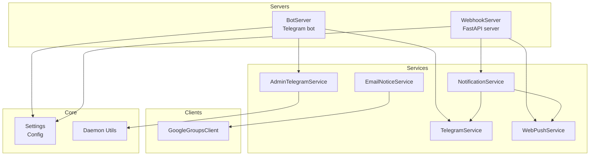
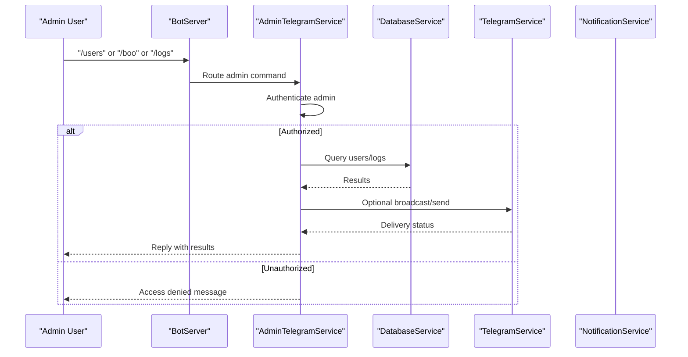
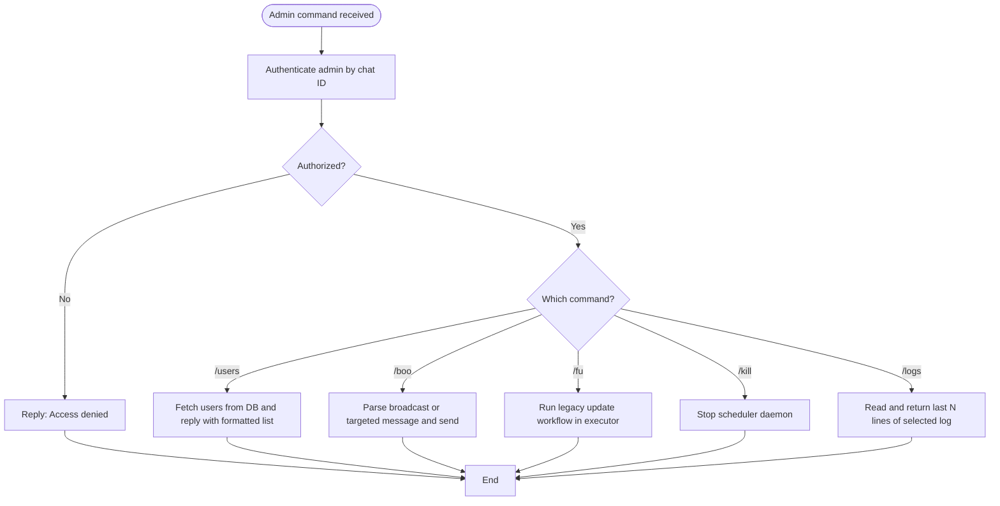
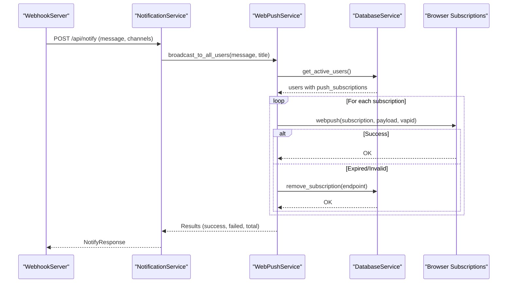
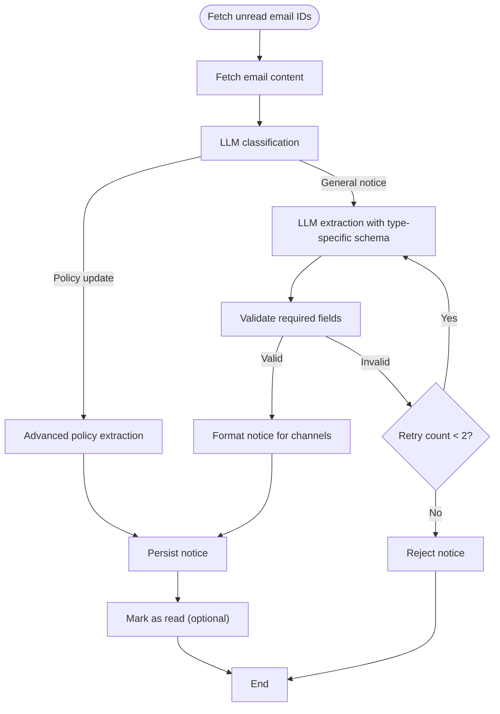
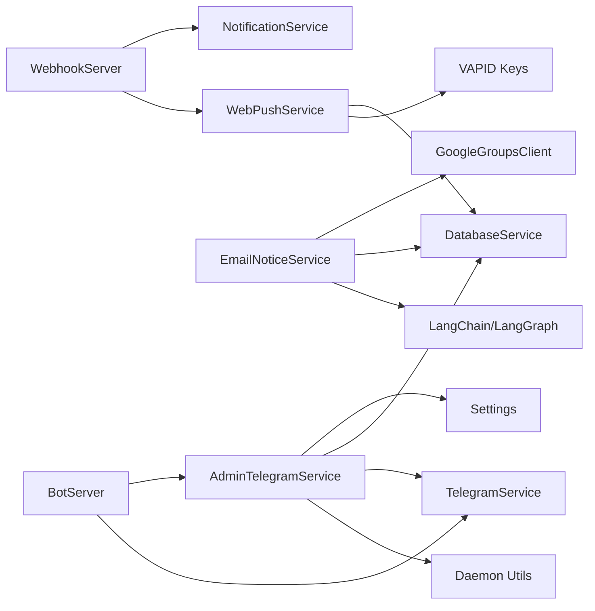

# Administrative services

## Introduction
This page describes the administrative services that manage system operations, user communications, and external integrations. It focuses on:
- AdminTelegramService for administrative bot commands, permission enforcement, and system control
- WebPushService for VAPID-secured browser push notifications, subscription management, and delivery
- EmailNoticeService for processing general notices via Google Groups, LLM-based classification/extraction, and distribution

It also covers configuration, security considerations, subscription workflows, and how these services integrate with the broader notification ecosystem.

## Project structure
The administrative services live under app/services and are integrated with app/servers, app/clients, and app/core. The primary entry points are:
- Telegram bot server for user/admin commands
- Webhook server for external integrations and push subscription APIs
- Core configuration and daemon utilities

```mermaid
graph TB
subgraph "Servers"
Bot["BotServer<br/>Telegram bot"]
Hook["WebhookServer<br/>FastAPI server"]
end
subgraph "Services"
Admin["AdminTelegramService"]
Tele["TelegramService"]
Notif["NotificationService"]
WebPush["WebPushService"]
Email["EmailNoticeService"]
end
subgraph "Clients"
GGC["GoogleGroupsClient"]
end
subgraph "Core"
Cfg["Settings<br/>Config"]
Dmn["Daemon Utils"]
end
Bot --> Admin
Bot --> Tele
Hook --> Notif
Hook --> WebPush
Notif --> Tele
Notif --> WebPush
Email --> GGC
Admin --> Dmn
Bot --> Cfg
Hook --> Cfg
```

## Core components
- AdminTelegramService: Enforces admin-only commands, authenticates administrators, and executes administrative actions such as user listing, broadcast messaging, scraping triggers, scheduler control, and log viewing.
- WebPushService: Implements the INotificationChannel protocol for web push, manages VAPID authentication, broadcasts to all users, and handles subscription CRUD operations.
- EmailNoticeService: Processes non-placement notices from Google Groups using a LangGraph pipeline, classifies and extracts structured data via LLM, formats notices, and persists them to the database.

## Architecture overview
The administrative services operate within two primary servers:
- Telegram Bot Server: Hosts user-facing commands and admin commands routed through AdminTelegramService.
- Webhook Server: Exposes REST endpoints for push subscriptions, notifications, and statistics; integrates NotificationService and WebPushService.

```mermaid
sequenceDiagram
participant Admin as "Admin User"
participant Bot as "BotServer"
participant AdminSvc as "AdminTelegramService"
participant DB as "DatabaseService"
participant TeleSvc as "TelegramService"
participant Notif as "NotificationService"
Admin->>Bot : "/users" or "/boo" or "/logs"
Bot->>AdminSvc : Route admin command
AdminSvc->>AdminSvc : Authenticate admin
alt Authorized
AdminSvc->>DB : Query users/logs
DB-->>AdminSvc : Results
AdminSvc->>TeleSvc : Optional broadcast/send
TeleSvc-->>AdminSvc : Delivery status
AdminSvc-->>Admin : Reply with results
else Unauthorized
AdminSvc-->>Admin : Access denied message
end
```

## Detailed component analysis

### AdminTelegramService
Responsibilities:
- Admin authentication via a configured admin chat ID
- User listing with activation status
- Broadcast messaging to all users or targeted user
- Triggering scraping workflows via legacy command wrapper
- Scheduler control (start/stop) using daemon utilities
- Log viewing for bot and scheduler logs

Security and Permissions:
- Uses a dedicated admin chat ID to restrict command access
- Logs unauthorized attempts and replies with access denial

Operational Commands:
- /users: Lists all users with status
- /boo broadcast <message>: Broadcasts to all users
- /boo <chat_id> <message>: Sends targeted message
- /fu or /s or /scrapyyy: Runs legacy update workflow in a thread pool to avoid blocking the event loop
- /kill: Stops the scheduler daemon
- /logs [bot|scheduler]: Reads and returns recent log lines safely escaped

```mermaid
flowchart TD
Start(["Admin command received"]) --> Auth["Authenticate admin by chat ID"]
Auth --> Allowed{"Authorized?"}
Allowed --> |No| Deny["Reply: Access denied"] --> End
Allowed --> |Yes| Cmd{"Which command?"}
Cmd --> |/users| ListUsers["Fetch users from DB and reply with formatted list"]
Cmd --> |/boo| Broadcast["Parse broadcast or targeted message and send"]
Cmd --> |/fu| Scrape["Run legacy update workflow in executor"]
Cmd --> |/kill| Kill["Stop scheduler daemon"]
Cmd --> |/logs| Logs["Read and return last N lines of selected log"]
ListUsers --> End
Broadcast --> End
Scrape --> End
Kill --> End
Logs --> End
```

### WebPushService
Responsibilities:
- Implements INotificationChannel protocol for web push
- VAPID authentication for push delivery
- Broadcast to all users with push subscriptions
- Per-user push delivery
- Subscription management endpoints (save/remove)
- Graceful degradation when pywebpush is unavailable

Configuration and Security:
- Requires VAPID private/public key and contact email
- Checks availability of pywebpush and VAPID keys at initialization
- Uses VAPID claims with mailto contact URI

Delivery Workflow:
- Broadcast: Iterates active users and their push subscriptions, sending individual pushes
- Per-user: Retrieves user's subscriptions and sends to each
- Error handling: Removes invalid/expired subscriptions on 404/410 responses

```mermaid
sequenceDiagram
participant Hook as "WebhookServer"
participant Notif as "NotificationService"
participant WP as "WebPushService"
participant DB as "DatabaseService"
participant Sub as "Browser Subscriptions"
Hook->>Notif : POST /api/notify (message, channels)
Notif->>WP : broadcast_to_all_users(message, title)
WP->>DB : get_active_users()
DB-->>WP : users with push_subscriptions
loop For each subscription
WP->>Sub : webpush(subscription, payload, vapid)
alt Success
Sub-->>WP : OK
else Expired/Invalid
WP->>DB : remove_subscription(endpoint)
DB-->>WP : OK
end
end
WP-->>Notif : Results (success, failed, total)
Notif-->>Hook : NotifyResponse
```

### EmailNoticeService
Responsibilities:
- Fetches unread emails from Google Groups via GoogleGroupsClient
- Classifies and extracts structured notice data using a LangGraph pipeline with LLM
- Formats notices for downstream channels
- Persists notices to the database

Pipeline Highlights:
- Classification: LLM determines relevance and type
- Extraction: Structured JSON extraction with type-specific fields
- Validation: Ensures minimal required fields
- Policy detection: Specialized handling for placement policy updates
- Formatting: Produces human-readable formatted_message for channels

```mermaid
flowchart TD
Start(["Fetch unread email IDs"]) --> Fetch["Fetch email content"]
Fetch --> Classify["LLM classification"]
Classify --> |Policy update| Policy["Advanced policy extraction"]
Classify --> |General notice| Extract["LLM extraction with type-specific schema"]
Extract --> Validate["Validate required fields"]
Validate --> |Valid| Format["Format notice for channels"]
Validate --> |Invalid| Retry{"Retry count < 2?"}
Retry --> |Yes| Extract
Retry --> |No| Reject["Reject notice"]
Policy --> Save["Persist notice"]
Format --> Save
Save --> Mark["Mark as read (optional)"]
Reject --> End
Mark --> End
```

## Dependency analysis
- AdminTelegramService depends on:
  - Settings for admin chat ID
  - DatabaseService for user and log operations
  - TelegramService for broadcast and targeted messaging
  - Daemon utilities for scheduler control
- WebPushService depends on:
  - pywebpush (optional) for push delivery
  - VAPID keys from environment/settings
  - DatabaseService for subscription management
- EmailNoticeService depends on:
  - GoogleGroupsClient for email fetching
  - LangChain/LangGraph for classification/extraction
  - DatabaseService for persistence

```mermaid
graph LR
Admin["AdminTelegramService"] --> Cfg["Settings"]
Admin --> DB["DatabaseService"]
Admin --> Tele["TelegramService"]
Admin --> Dmn["Daemon Utils"]
WebPush["WebPushService"] --> DB
WebPush --> VAPID["VAPID Keys"]
Email["EmailNoticeService"] --> GGC["GoogleGroupsClient"]
Email --> DB
Email --> LLM["LangChain/LangGraph"]
Hook["WebhookServer"] --> Notif["NotificationService"]
Hook --> WebPush
Bot["BotServer"] --> Admin
Bot --> Tele
```

## Performance considerations
- AdminTelegramService:
  - Uses run_in_executor for legacy update workflows to avoid blocking the event loop
  - Splits long messages for Telegram replies
- WebPushService:
  - Gracefully degrades when pywebpush is unavailable
  - Removes invalid/expired subscriptions on 404/410 responses
  - Broadcast loops over users and subscriptions; consider batching or rate limiting if scaling
- EmailNoticeService:
  - Sequential processing of unread emails to avoid race conditions
  - LLM calls introduce latency; consider caching or parallelism with caution

[No sources needed since this section provides general guidance]

## Troubleshooting guide
Common issues and resolutions:
- Admin commands failing:
  - Verify admin chat ID configuration and that the sender matches
  - Check logs for unauthorized access attempts
- Web push failures:
  - Confirm VAPID keys and email are configured
  - Inspect pywebpush installation and network connectivity
  - Review subscription removal on 404/410 responses
- Email processing errors:
  - Ensure Google Groups credentials are set
  - Validate LLM API key and model availability
  - Check for malformed emails or missing required fields triggering retries

## Conclusion
The administrative services provide a cohesive administrative and communication backbone:
- AdminTelegramService secures and automates system control and user operations
- WebPushService delivers secure, scalable browser notifications with reliable error handling
- EmailNoticeService transforms unstructured emails into structured notices with LLM-powered intelligence

They integrate cleanly with the configuration and daemon utilities, enabling reliable operation across Telegram, web push, and email channels.
