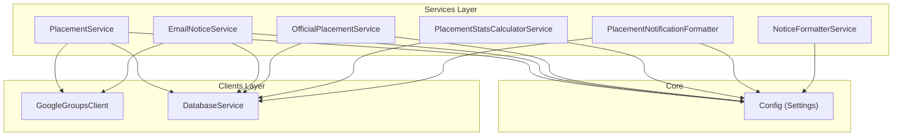
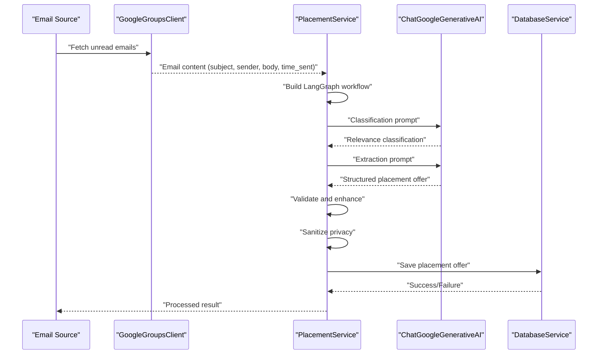
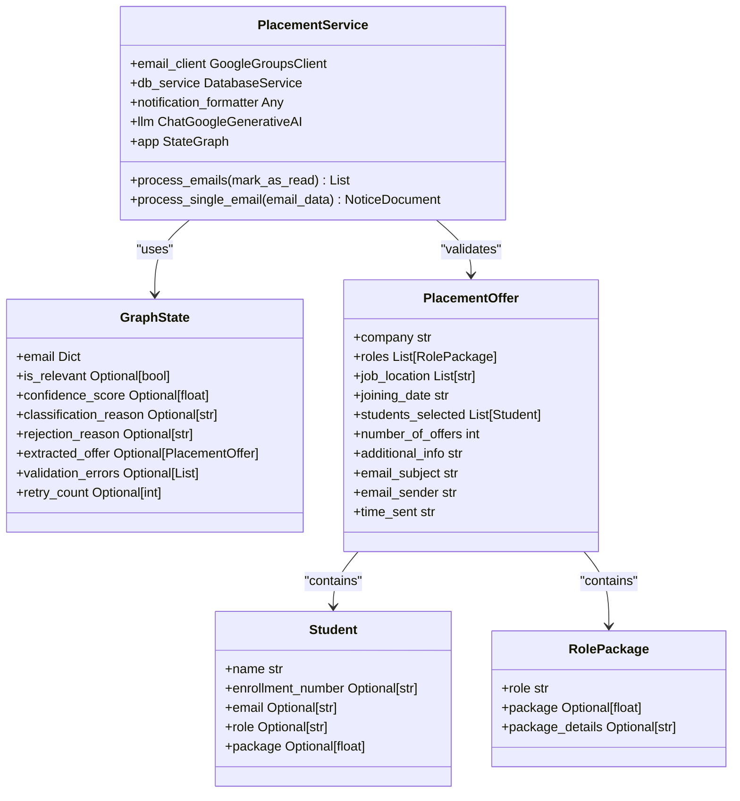
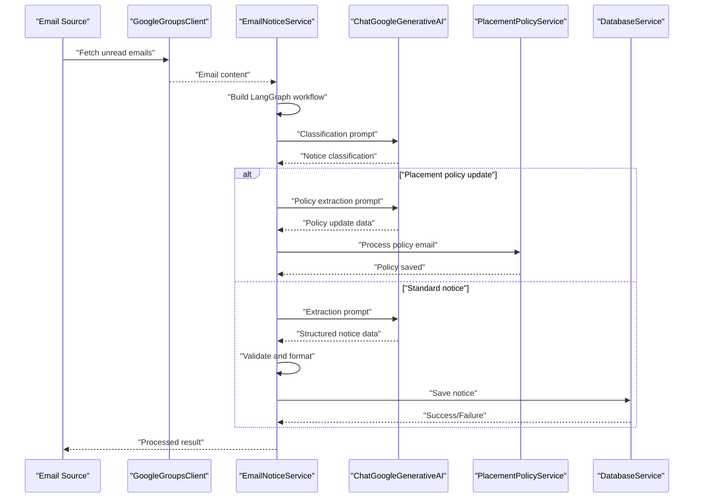
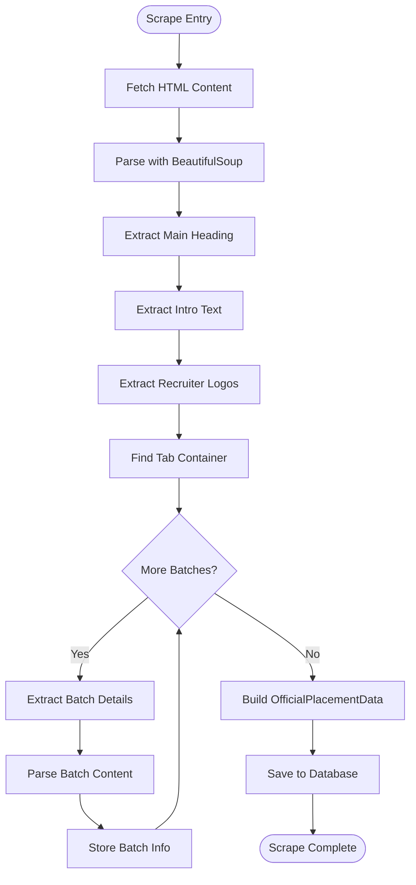
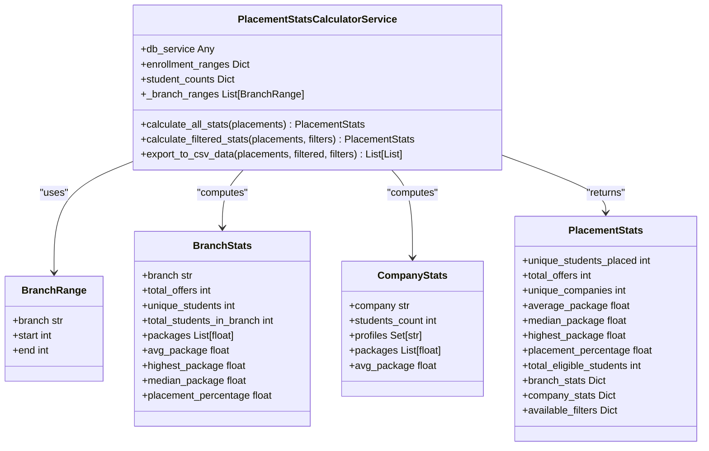
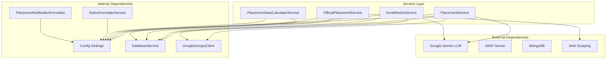

# Content Processing Services

<cite>
**Referenced Files in This Document**
- [placement_service.py](file://app/services/placement_service.py)
- [email_notice_service.py](file://app/services/email_notice_service.py)
- [official_placement_service.py](file://app/services/official_placement_service.py)
- [placement_stats_calculator_service.py](file://app/services/placement_stats_calculator_service.py)
- [notice_formatter_service.py](file://app/services/notice_formatter_service.py)
- [placement_notification_formatter.py](file://app/services/placement_notification_formatter.py)
- [google_groups_client.py](file://app/clients/google_groups_client.py)
- [database_service.py](file://app/services/database_service.py)
- [config.py](file://app/core/config.py)
- [__init__.py](file://app/services/__init__.py)
</cite>

## Table of Contents
1. [Introduction](#introduction)
2. [Project Structure](#project-structure)
3. [Core Components](#core-components)
4. [Architecture Overview](#architecture-overview)
5. [Detailed Component Analysis](#detailed-component-analysis)
6. [Dependency Analysis](#dependency-analysis)
7. [Performance Considerations](#performance-considerations)
8. [Troubleshooting Guide](#troubleshooting-guide)
9. [Conclusion](#conclusion)

## Introduction
This document provides comprehensive technical documentation for the content processing services that power intelligent data extraction and transformation across the system. These services are responsible for transforming raw, unstructured data from emails and official university sources into structured, actionable information for notification delivery. The focus areas include:

- PlacementService: Extracting structured placement offer data from unstructured emails using Google Gemini LLM integration, with robust classification, extraction, validation, privacy sanitization, and retry mechanisms.
- EmailNoticeService: Classifying and extracting structured notices from general email sources, including placement policy updates and non-placement notices.
- OfficialPlacementService: Scraping and processing placement data from official university websites.
- PlacementStatsCalculatorService: Generating analytics and statistics from processed placement data, enabling insights across branches, companies, and package distributions.

The documentation covers LLM integration patterns, data validation processes, content formatting workflows, and how these services collectively transform raw data into structured, actionable information for notification delivery.

## Project Structure
The content processing services are organized within the services layer, with clear separation of concerns and dependency injection support. The services leverage reusable clients for external integrations and centralized configuration management.

**Diagram sources**
- [__init__.py](file://app/services/__init__.py#L1-L23)
- [config.py](file://app/core/config.py#L18-L186)

**Section sources**
- [__init__.py](file://app/services/__init__.py#L1-L23)
- [config.py](file://app/core/config.py#L18-L186)

## Core Components
This section introduces the four primary content processing services and their responsibilities:

- PlacementService: Orchestrates a LangGraph pipeline to classify, extract, validate, sanitize, and display placement offer data from emails using Google Gemini LLM.
- EmailNoticeService: Processes general notices from email sources, including placement policy updates, with LLM-based classification and extraction.
- OfficialPlacementService: Scrapes official university placement pages to extract structured data about batches, recruiters, and package distributions.
- PlacementStatsCalculatorService: Computes comprehensive statistics from placement offers, including branch-wise, company-wise, and package distribution metrics.

Each service implements dependency injection for flexibility and testability, integrates with configuration management, and interacts with the database service for persistence.

**Section sources**
- [placement_service.py](file://app/services/placement_service.py#L419-L479)
- [email_notice_service.py](file://app/services/email_notice_service.py#L335-L393)
- [official_placement_service.py](file://app/services/official_placement_service.py#L81-L106)
- [placement_stats_calculator_service.py](file://app/services/placement_stats_calculator_service.py#L354-L391)

## Architecture Overview
The content processing architecture follows a modular, layered design with clear boundaries between services, clients, and core configuration. The services utilize LangGraph for workflow orchestration and Google Gemini for LLM-powered extraction and classification. External integrations are abstracted through dedicated clients, and configuration is centralized via environment variables.

**Diagram sources**
- [google_groups_client.py](file://app/clients/google_groups_client.py#L110-L168)
- [placement_service.py](file://app/services/placement_service.py#L484-L506)
- [database_service.py](file://app/services/database_service.py#L80-L105)

## Detailed Component Analysis

### PlacementService Analysis
PlacementService implements a sophisticated LangGraph pipeline to process placement offers from emails. The pipeline consists of four stages: classification, extraction, validation, and privacy sanitization, each with robust error handling and retry logic.

Key implementation patterns:
- LangGraph workflow with conditional edges for decision-making
- Pydantic models for strong data validation
- LLM prompts designed for strict classification and extraction
- Privacy sanitization to remove sensitive information
- Retry mechanisms for robust extraction

**Diagram sources**
- [placement_service.py](file://app/services/placement_service.py#L75-L86)
- [placement_service.py](file://app/services/placement_service.py#L55-L68)
- [placement_service.py](file://app/services/placement_service.py#L37-L44)

LLM Integration Patterns:
- Classification stage uses keyword-based scoring with confidence thresholds
- Extraction stage employs structured prompts with strict schema enforcement
- Privacy sanitization removes headers, forwarded markers, and sensitive metadata
- Retry logic with exponential backoff for validation failures

Data Validation Processes:
- Pydantic validation ensures data integrity and type safety
- Confidence scoring prevents false positives
- Package extraction follows strict conversion rules (LPA, monthly to annual)
- Role assignment defaults and enhancement logic

Content Formatting Workflows:
- Privacy-first approach strips sensitive information
- Structured JSON output with standardized schema
- Enhanced metadata including sender, time_sent, and rejection reasons

**Section sources**
- [placement_service.py](file://app/services/placement_service.py#L419-L830)

### EmailNoticeService Analysis
EmailNoticeService processes general notices from email sources using a LangGraph pipeline with LLM-based classification and extraction. The service distinguishes between placement notices, policy updates, and general announcements.

Key implementation patterns:
- Unified LangGraph workflow for notice processing
- LLM-based classification eliminating manual keyword filtering
- Specialized handling for placement policy updates
- Notice formatting and database persistence

**Diagram sources**
- [email_notice_service.py](file://app/services/email_notice_service.py#L398-L418)
- [email_notice_service.py](file://app/services/email_notice_service.py#L435-L552)

Notice Types and Extraction:
- Announcement, job posting, shortlisting, update, webinar, reminder, hackathon, internship_noc
- Structured extraction with type-specific fields and validation
- Privacy-preserving content extraction

Policy Update Processing:
- Dedicated extraction for placement policy documents
- Advanced LLM prompting for policy content
- Integration with PlacementPolicyService for storage

**Section sources**
- [email_notice_service.py](file://app/services/email_notice_service.py#L335-L830)

### OfficialPlacementService Analysis
OfficialPlacementService scrapes official university placement pages to extract structured data about batches, recruiters, and package distributions. The service focuses on parsing HTML content and converting it into standardized data models.

Key implementation patterns:
- HTML parsing with BeautifulSoup for robust content extraction
- Data model validation using Pydantic
- Batch processing across multiple tabs and content sections
- Image URL normalization and metadata extraction

**Diagram sources**
- [official_placement_service.py](file://app/services/official_placement_service.py#L150-L208)
- [official_placement_service.py](file://app/services/official_placement_service.py#L209-L374)

Data Extraction Strategies:
- Targeted selectors for main heading, introductory text, and recruiter logos
- Batch navigation parsing with active state detection
- Package distribution table extraction with category mapping
- Pointer list extraction for placement achievements

**Section sources**
- [official_placement_service.py](file://app/services/official_placement_service.py#L81-L422)

### PlacementStatsCalculatorService Analysis
PlacementStatsCalculatorService computes comprehensive statistics from processed placement data, enabling insights across branches, companies, and package distributions. The service implements sophisticated aggregation logic with configurable enrollment ranges and student counts.

Key implementation patterns:
- Branch range resolution using enrollment number patterns
- Package calculation with highest-per-student logic
- Multi-dimensional statistics computation (branch-wise, company-wise)
- Filterable analytics with CSV export capability

**Diagram sources**
- [placement_stats_calculator_service.py](file://app/services/placement_stats_calculator_service.py#L109-L131)
- [placement_stats_calculator_service.py](file://app/services/placement_stats_calculator_service.py#L133-L143)
- [placement_stats_calculator_service.py](file://app/services/placement_stats_calculator_service.py#L144-L158)

Statistical Computation Logic:
- Enrollment range mapping for branch identification
- Highest package per unique student for fair statistics
- Placement percentage calculation using eligible student pools
- Multi-level aggregation with filtering capabilities

Filtering and Export Capabilities:
- Branch exclusion for JUIT, Other, MTech categories
- Company, role, location, and package range filters
- CSV export with standardized column headers
- Search query support across multiple fields

**Section sources**
- [placement_stats_calculator_service.py](file://app/services/placement_stats_calculator_service.py#L354-L1034)

## Dependency Analysis
The content processing services exhibit clear dependency relationships and integration points:

**Diagram sources**
- [placement_service.py](file://app/services/placement_service.py#L468-L476)
- [email_notice_service.py](file://app/services/email_notice_service.py#L367-L387)
- [official_placement_service.py](file://app/services/official_placement_service.py#L102-L104)
- [placement_stats_calculator_service.py](file://app/services/placement_stats_calculator_service.py#L367-L383)

Dependency Coupling and Cohesion:
- High cohesion within each service around specific responsibilities
- Low coupling through dependency injection and interface abstraction
- Centralized configuration management reducing cross-service coupling
- Clear separation between data extraction and formatting concerns

Integration Points:
- Google Gemini API for LLM-powered processing
- IMAP protocol for email ingestion
- MongoDB for persistent storage
- Web scraping for official placement data

**Section sources**
- [config.py](file://app/core/config.py#L18-L186)
- [database_service.py](file://app/services/database_service.py#L16-L46)

## Performance Considerations
The content processing services implement several performance optimizations:

- LangGraph workflow optimization: Parallel processing of independent nodes, minimal state copying, and efficient conditional routing
- LLM cost optimization: Temperature control set to zero for deterministic responses, structured prompts to reduce token usage
- Database efficiency: Bulk operations where possible, indexed lookups for notice existence checks, and selective field projections
- Memory management: Streaming HTML parsing for large documents, lazy evaluation of expensive computations
- Retry strategies: Exponential backoff for LLM extraction failures, avoiding infinite loops through retry limits

Best practices for deployment:
- Environment variable caching for configuration access
- Connection pooling for database operations
- Asynchronous processing for independent notice processing
- Monitoring and logging for performance metrics

## Troubleshooting Guide
Common issues and their resolutions:

**LLM Integration Issues:**
- API key configuration errors: Verify GOOGLE_API_KEY environment variable
- Model availability problems: Check Gemini model quotas and rate limits
- Prompt formatting errors: Review structured prompt templates for schema compliance

**Email Processing Issues:**
- Authentication failures: Verify PLCAMENT_EMAIL and PLCAMENT_APP_PASSWORD
- IMAP connectivity problems: Check network connectivity and firewall settings
- Forwarded email parsing: Use extract_forwarded_date and extract_forwarded_sender utilities

**Data Validation Errors:**
- Pydantic validation failures: Review schema requirements and data types
- Package extraction inconsistencies: Verify LPA conversion rules and monthly to annual conversions
- Branch resolution mismatches: Check enrollment range configurations

**Database Connectivity:**
- Connection string issues: Validate MONGO_CONNECTION_STR environment variable
- Collection initialization failures: Ensure database migrations are complete
- Write operation errors: Check write permissions and document size limits

**Section sources**
- [config.py](file://app/core/config.py#L52-L57)
- [google_groups_client.py](file://app/clients/google_groups_client.py#L63-L76)
- [database_service.py](file://app/services/database_service.py#L80-L105)

## Conclusion
The content processing services provide a robust, scalable foundation for transforming raw data into structured, actionable information. Through careful separation of concerns, LLM-powered intelligence, and comprehensive validation, these services enable reliable notification delivery across placement offers, general notices, and official placement data. The modular architecture supports easy maintenance, testing, and extension for future requirements.

The services demonstrate best practices in:
- LLM integration patterns with structured prompts and validation
- Data validation using Pydantic models and confidence scoring
- Privacy-preserving content processing and sanitization
- Comprehensive analytics and reporting capabilities
- Dependency injection and configuration management

These components work together to create a comprehensive content processing pipeline that reliably transforms diverse data sources into consistent, useful information for notification systems.