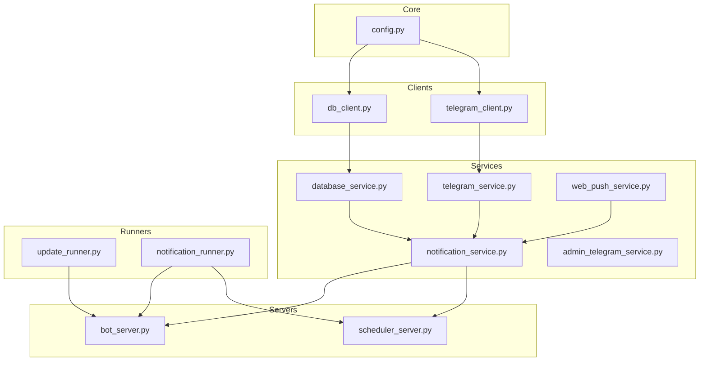
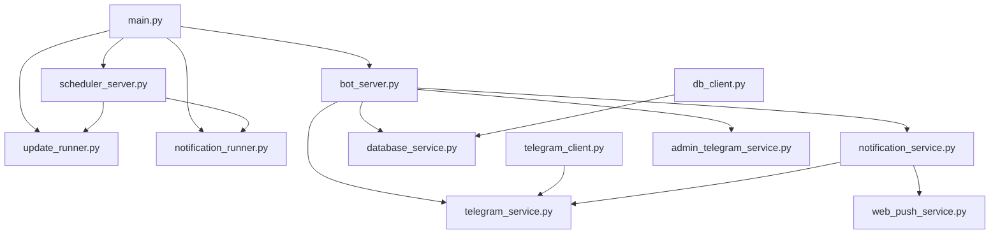
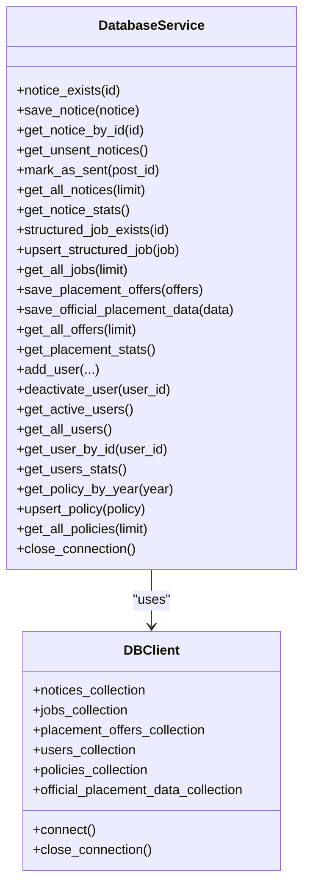
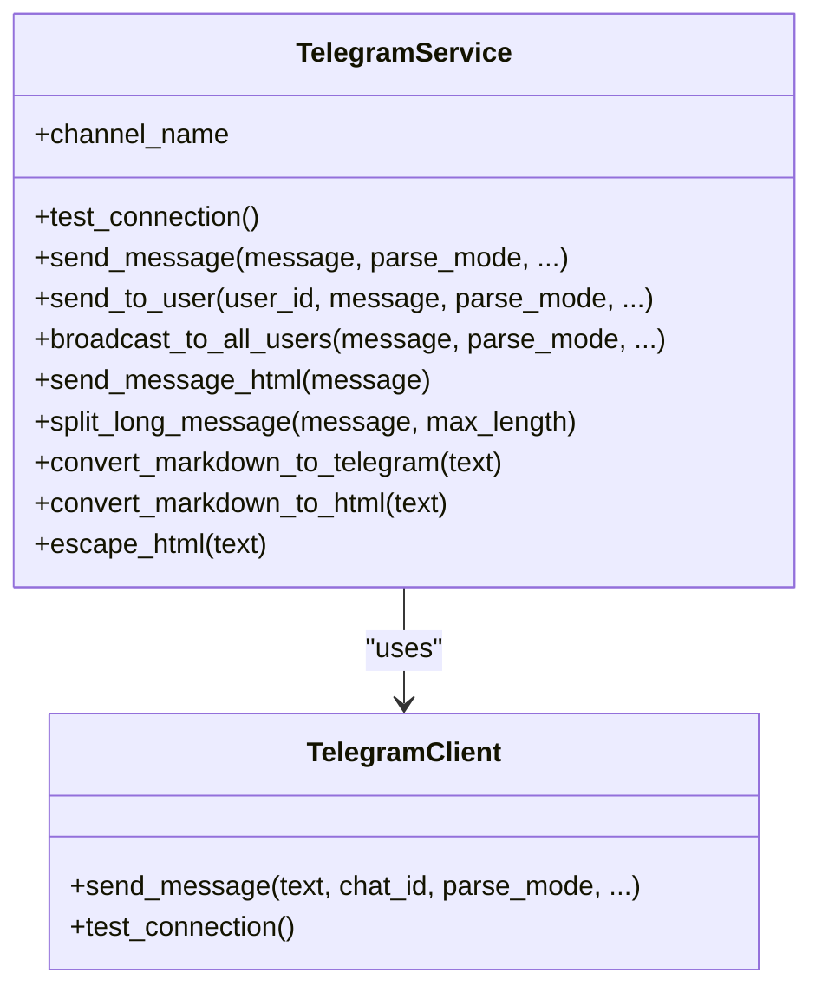
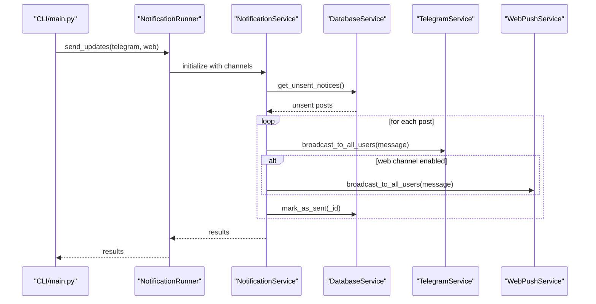
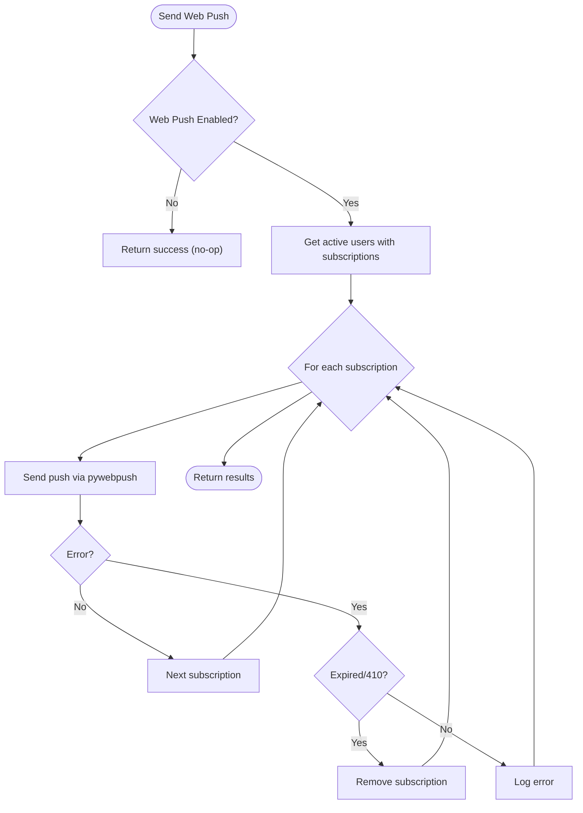
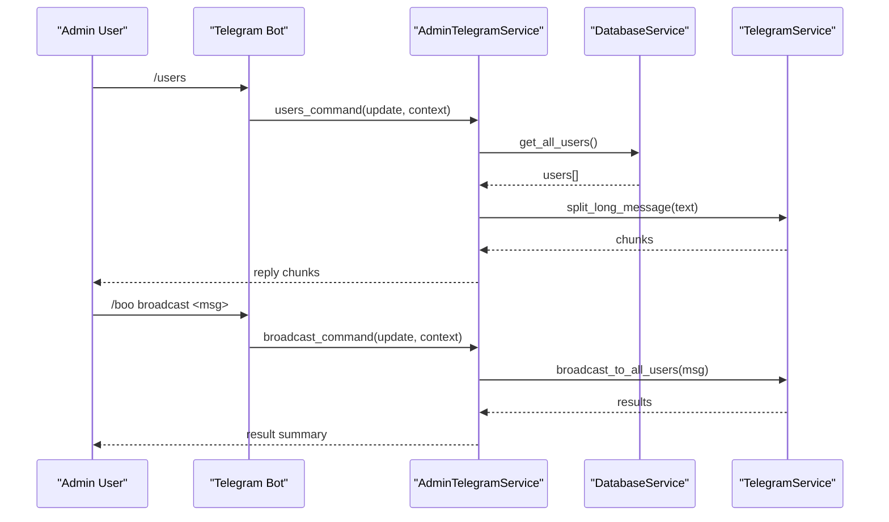
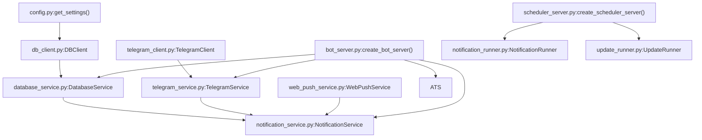

# Core Services

<cite>
**Referenced Files in This Document**
- [database_service.py](file://app/services/database_service.py)
- [telegram_service.py](file://app/services/telegram_service.py)
- [notification_service.py](file://app/services/notification_service.py)
- [web_push_service.py](file://app/services/web_push_service.py)
- [admin_telegram_service.py](file://app/services/admin_telegram_service.py)
- [db_client.py](file://app/clients/db_client.py)
- [telegram_client.py](file://app/clients/telegram_client.py)
- [config.py](file://app/core/config.py)
- [main.py](file://app/main.py)
- [notification_runner.py](file://app/runners/notification_runner.py)
- [update_runner.py](file://app/runners/update_runner.py)
- [bot_server.py](file://app/servers/bot_server.py)
- [scheduler_server.py](file://app/servers/scheduler_server.py)
</cite>

## Table of Contents
1. [Introduction](#introduction)
2. [Project Structure](#project-structure)
3. [Core Components](#core-components)
4. [Architecture Overview](#architecture-overview)
5. [Detailed Component Analysis](#detailed-component-analysis)
6. [Dependency Analysis](#dependency-analysis)
7. [Performance Considerations](#performance-considerations)
8. [Troubleshooting Guide](#troubleshooting-guide)
9. [Conclusion](#conclusion)

## Introduction
This document explains the core foundational services that power the notification bot’s infrastructure. It focuses on:
- DatabaseService: MongoDB connectivity, CRUD operations, and persistence patterns
- TelegramService: bot initialization, message handling, and user interaction patterns
- NotificationService: orchestrator routing messages across channels (Telegram, Web Push) and managing delivery workflows
It also covers service initialization patterns, dependency injection mechanisms, and how these services form the backbone of the application architecture. Practical usage examples, error handling strategies, and integration patterns are included.

## Project Structure
The application is organized into modular layers:
- Core configuration and utilities
- Clients for external systems (MongoDB, Telegram Bot API)
- Services for business logic (database, notifications, web push, admin)
- Runners for operational tasks (update and notification dispatch)
- Servers for runtime (Telegram bot and scheduler)
- CLI entry point for orchestration

**Diagram sources**
- [config.py](file://app/core/config.py#L156-L186)
- [db_client.py](file://app/clients/db_client.py#L16-L104)
- [telegram_client.py](file://app/clients/telegram_client.py#L19-L126)
- [database_service.py](file://app/services/database_service.py#L16-L795)
- [telegram_service.py](file://app/services/telegram_service.py#L20-L351)
- [notification_service.py](file://app/services/notification_service.py#L13-L237)
- [web_push_service.py](file://app/services/web_push_service.py#L27-L242)
- [admin_telegram_service.py](file://app/services/admin_telegram_service.py#L19-L349)
- [update_runner.py](file://app/runners/update_runner.py#L21-L278)
- [notification_runner.py](file://app/runners/notification_runner.py#L21-L160)
- [bot_server.py](file://app/servers/bot_server.py#L29-L519)
- [scheduler_server.py](file://app/servers/scheduler_server.py#L33-L388)

**Section sources**
- [config.py](file://app/core/config.py#L156-L186)
- [db_client.py](file://app/clients/db_client.py#L16-L104)
- [telegram_client.py](file://app/clients/telegram_client.py#L19-L126)
- [database_service.py](file://app/services/database_service.py#L16-L795)
- [telegram_service.py](file://app/services/telegram_service.py#L20-L351)
- [notification_service.py](file://app/services/notification_service.py#L13-L237)
- [web_push_service.py](file://app/services/web_push_service.py#L27-L242)
- [admin_telegram_service.py](file://app/services/admin_telegram_service.py#L19-L349)
- [update_runner.py](file://app/runners/update_runner.py#L21-L278)
- [notification_runner.py](file://app/runners/notification_runner.py#L21-L160)
- [bot_server.py](file://app/servers/bot_server.py#L29-L519)
- [scheduler_server.py](file://app/servers/scheduler_server.py#L33-L388)

## Core Components
This section documents the three core services that underpin the application.

### DatabaseService
Responsibilities:
- MongoDB connectivity and collection access via DBClient
- Notice CRUD: existence checks, insertions, retrieval, and status reporting
- Structured job upserts and retrieval
- Placement offers merge logic with event emission for notifications
- Official placement data deduplication and storage
- User management: add/reactivate, deactivate, listing, and statistics
- Policy management: upsert by year and retrieval
- Utility helpers: serialization and statistics aggregation

Key capabilities:
- Notice lifecycle: existence checks, insertion with timestamps, retrieval, and marking as sent
- Job lifecycle: upsert with merge semantics and retrieval
- Placement offers: merge roles and students, compute newly added students, emit events
- User lifecycle: add/reactivate/deactivate and stats
- Policy lifecycle: upsert by year and retrieval

Error handling:
- Centralized safe printing and exception wrapping for robustness
- Graceful fallbacks when collections are uninitialized

Persistence patterns:
- Timestamp fields for auditability
- Sent flags to coordinate delivery workflows
- Content hashing for official placement data deduplication

**Section sources**
- [database_service.py](file://app/services/database_service.py#L16-L795)
- [db_client.py](file://app/clients/db_client.py#L16-L104)

### TelegramService
Responsibilities:
- Telegram bot initialization via TelegramClient
- Message sending to default channel, specific users, and broadcasting to all users
- Message formatting: MarkdownV2 and HTML conversion with escaping
- Long message splitting with chunking and retry logic
- Connection testing and robust retries with exponential backoff

Key capabilities:
- Single and chunked message sending with parse modes
- User-targeted messaging and bulk broadcasts
- HTML and MarkdownV2 formatting with escaping and fallbacks
- Rate-limit handling via Telegram API responses

Integration patterns:
- Delegates to TelegramClient for HTTP requests
- Uses DatabaseService for user lookups during broadcasts

**Section sources**
- [telegram_service.py](file://app/services/telegram_service.py#L20-L351)
- [telegram_client.py](file://app/clients/telegram_client.py#L19-L126)

### NotificationService
Responsibilities:
- Aggregates multiple channels (Telegram, Web Push) behind a unified interface
- Routes messages to enabled channels and coordinates broadcasts
- Sends unsent notices to target channels and marks them as sent upon success
- Orchestrates delivery workflows across channels

Key capabilities:
- Channel registration and dynamic addition
- Broadcast to all users per channel
- Delivery coordination for unsent notices
- Results aggregation per channel

Integration patterns:
- Works with DatabaseService to fetch unsent notices
- Accepts channel implementations that expose channel_name and broadcast_to_all_users/send_message

**Section sources**
- [notification_service.py](file://app/services/notification_service.py#L13-L237)

### WebPushService
Responsibilities:
- Implements INotificationChannel for Web Push notifications
- Uses VAPID for authentication and pywebpush for delivery
- Manages subscriptions via DatabaseService and removes expired ones
- Broadcasts to all users with push subscriptions

Key capabilities:
- Conditional enablement based on VAPID configuration
- Per-subscription push delivery with error handling
- Subscription lifecycle management hooks

**Section sources**
- [web_push_service.py](file://app/services/web_push_service.py#L27-L242)

### AdminTelegramService
Responsibilities:
- Administrative commands for the Telegram bot
- User listing, targeted broadcasting, forced updates, logs viewing, and scheduler control
- Admin authentication against configured chat ID

Integration patterns:
- Uses DatabaseService for user and statistics queries
- Leverages TelegramService for message delivery
- Interacts with scheduler daemon controls

**Section sources**
- [admin_telegram_service.py](file://app/services/admin_telegram_service.py#L19-L349)

## Architecture Overview
The system follows a layered architecture with clear separation of concerns:
- Core configuration and logging
- Clients for external APIs (MongoDB, Telegram Bot API)
- Business services encapsulating domain logic
- Runners for operational tasks
- Servers for runtime exposure
- CLI for orchestration

**Diagram sources**
- [main.py](file://app/main.py#L370-L632)
- [bot_server.py](file://app/servers/bot_server.py#L455-L519)
- [scheduler_server.py](file://app/servers/scheduler_server.py#L365-L388)
- [update_runner.py](file://app/runners/update_runner.py#L254-L278)
- [notification_runner.py](file://app/runners/notification_runner.py#L132-L160)
- [db_client.py](file://app/clients/db_client.py#L16-L104)
- [telegram_client.py](file://app/clients/telegram_client.py#L19-L126)
- [database_service.py](file://app/services/database_service.py#L16-L795)
- [telegram_service.py](file://app/services/telegram_service.py#L20-L351)
- [notification_service.py](file://app/services/notification_service.py#L13-L237)
- [web_push_service.py](file://app/services/web_push_service.py#L27-L242)
- [admin_telegram_service.py](file://app/services/admin_telegram_service.py#L19-L349)

## Detailed Component Analysis

### DatabaseService Analysis
DatabaseService encapsulates MongoDB operations and exposes a clean interface for notices, jobs, placement offers, users, and policies. It delegates collection access to DBClient and centralizes error handling and logging.

**Diagram sources**
- [database_service.py](file://app/services/database_service.py#L16-L795)
- [db_client.py](file://app/clients/db_client.py#L16-L104)

Key operations:
- Notice CRUD: existence checks, insertions, retrieval, and marking as sent
- Job upsert: merge semantics for existing jobs
- Placement offers: merge roles and students, compute newly added students, emit events
- User management: add/reactivate/deactivate and stats
- Policy management: upsert by year and retrieval

Error handling:
- Safe printing and exception wrapping
- Graceful fallbacks when collections are uninitialized

**Section sources**
- [database_service.py](file://app/services/database_service.py#L56-L200)
- [database_service.py](file://app/services/database_service.py#L205-L269)
- [database_service.py](file://app/services/database_service.py#L274-L442)
- [database_service.py](file://app/services/database_service.py#L443-L601)
- [database_service.py](file://app/services/database_service.py#L616-L729)
- [database_service.py](file://app/services/database_service.py#L730-L795)

### TelegramService Analysis
TelegramService provides a high-level interface for Telegram messaging, delegating HTTP interactions to TelegramClient and handling formatting and rate limits.

**Diagram sources**
- [telegram_service.py](file://app/services/telegram_service.py#L20-L351)
- [telegram_client.py](file://app/clients/telegram_client.py#L19-L126)

Message flow:
- Long messages are split into chunks and sent sequentially with delays
- Formatting conversions support both MarkdownV2 and HTML with fallbacks
- Rate-limit handling via Telegram API responses

**Section sources**
- [telegram_service.py](file://app/services/telegram_service.py#L58-L122)
- [telegram_service.py](file://app/services/telegram_service.py#L140-L173)
- [telegram_service.py](file://app/services/telegram_service.py#L174-L213)
- [telegram_service.py](file://app/services/telegram_service.py#L218-L351)
- [telegram_client.py](file://app/clients/telegram_client.py#L39-L111)

### NotificationService Analysis
NotificationService orchestrates delivery across multiple channels and coordinates with DatabaseService for unsent notices.

**Diagram sources**
- [notification_runner.py](file://app/runners/notification_runner.py#L60-L116)
- [notification_service.py](file://app/services/notification_service.py#L93-L167)
- [database_service.py](file://app/services/database_service.py#L116-L148)
- [telegram_service.py](file://app/services/telegram_service.py#L140-L173)
- [web_push_service.py](file://app/services/web_push_service.py#L120-L156)

Delivery workflow:
- Fetch unsent notices from DatabaseService
- Broadcast to target channels (Telegram/Web Push)
- Mark as sent upon successful delivery

**Section sources**
- [notification_service.py](file://app/services/notification_service.py#L47-L92)
- [notification_service.py](file://app/services/notification_service.py#L93-L167)
- [notification_service.py](file://app/services/notification_service.py#L169-L237)

### WebPushService Analysis
WebPushService implements INotificationChannel for Web Push notifications using VAPID authentication.

**Diagram sources**
- [web_push_service.py](file://app/services/web_push_service.py#L120-L156)
- [web_push_service.py](file://app/services/web_push_service.py#L157-L194)

**Section sources**
- [web_push_service.py](file://app/services/web_push_service.py#L76-L89)
- [web_push_service.py](file://app/services/web_push_service.py#L120-L156)
- [web_push_service.py](file://app/services/web_push_service.py#L157-L194)

### AdminTelegramService Analysis
AdminTelegramService provides administrative commands for the Telegram bot, including user listing, broadcasting, forced updates, logs viewing, and scheduler control.

**Diagram sources**
- [admin_telegram_service.py](file://app/services/admin_telegram_service.py#L57-L108)
- [admin_telegram_service.py](file://app/services/admin_telegram_service.py#L109-L192)
- [database_service.py](file://app/services/database_service.py#L694-L703)
- [telegram_service.py](file://app/services/telegram_service.py#L218-L254)

**Section sources**
- [admin_telegram_service.py](file://app/services/admin_telegram_service.py#L43-L56)
- [admin_telegram_service.py](file://app/services/admin_telegram_service.py#L57-L108)
- [admin_telegram_service.py](file://app/services/admin_telegram_service.py#L109-L192)

## Dependency Analysis
The application uses dependency injection and factory functions to wire services together.

**Diagram sources**
- [config.py](file://app/core/config.py#L156-L186)
- [db_client.py](file://app/clients/db_client.py#L16-L104)
- [database_service.py](file://app/services/database_service.py#L16-L795)
- [telegram_client.py](file://app/clients/telegram_client.py#L19-L126)
- [telegram_service.py](file://app/services/telegram_service.py#L20-L351)
- [notification_service.py](file://app/services/notification_service.py#L13-L237)
- [web_push_service.py](file://app/services/web_push_service.py#L27-L242)
- [bot_server.py](file://app/servers/bot_server.py#L455-L519)
- [scheduler_server.py](file://app/servers/scheduler_server.py#L365-L388)
- [notification_runner.py](file://app/runners/notification_runner.py#L21-L160)
- [update_runner.py](file://app/runners/update_runner.py#L21-L278)

Service initialization patterns:
- Factory functions create and wire services with configuration
- NotificationRunner and UpdateRunner demonstrate dependency injection with optional overrides
- BotServer and SchedulerServer instantiate services and configure scheduling

**Section sources**
- [bot_server.py](file://app/servers/bot_server.py#L455-L519)
- [scheduler_server.py](file://app/servers/scheduler_server.py#L365-L388)
- [notification_runner.py](file://app/runners/notification_runner.py#L28-L116)
- [update_runner.py](file://app/runners/update_runner.py#L28-L55)

## Performance Considerations
- DatabaseService:
  - Existence checks and retrieval use indexed fields (IDs) to minimize overhead
  - Batch operations for placement offers with merge logic reduce redundant writes
  - Hashing for official placement data prevents duplicate inserts
- TelegramService:
  - Long messages are split with newline-aware chunking to respect character limits
  - Rate-limit handling via Telegram API responses with exponential backoff
  - Broadcast loops include small delays to avoid rate limits
- NotificationService:
  - Iterates through unsent notices and broadcasts per channel, marking as sent upon success
  - Results aggregated per channel for visibility
- WebPushService:
  - Conditional enablement avoids unnecessary overhead when VAPID keys are missing
  - Error handling for expired subscriptions to keep subscription lists healthy

[No sources needed since this section provides general guidance]

## Troubleshooting Guide
Common issues and resolutions:
- MongoDB connection failures:
  - Verify MONGO_CONNECTION_STR environment variable and network connectivity
  - Check DBClient connection and ping response
- Telegram bot configuration:
  - Ensure TELEGRAM_BOT_TOKEN and TELEGRAM_CHAT_ID are set
  - Use test_connection to validate bot token
- Rate limiting:
  - Telegram API returns 429 with Retry-After header; service waits and retries
  - Adjust broadcast delays if still encountering limits
- Web Push:
  - Confirm VAPID keys are configured; service disables itself if missing
  - Expired subscriptions are removed automatically on WebPushException with 404/410
- Logging:
  - Use setup_logging to configure file and stream handlers
  - Enable verbose mode (-v) for debug-level logs

**Section sources**
- [db_client.py](file://app/clients/db_client.py#L42-L72)
- [telegram_client.py](file://app/clients/telegram_client.py#L113-L126)
- [telegram_service.py](file://app/services/telegram_service.py#L58-L61)
- [web_push_service.py](file://app/services/web_push_service.py#L62-L70)
- [web_push_service.py](file://app/services/web_push_service.py#L185-L194)
- [config.py](file://app/core/config.py#L188-L254)

## Conclusion
The core services provide a robust, modular foundation for the notification bot:
- DatabaseService ensures reliable persistence and efficient data operations
- TelegramService delivers messages with formatting and resilience
- NotificationService orchestrates cross-channel delivery and integrates with DatabaseService
- WebPushService adds modern browser notifications with VAPID support
- AdminTelegramService enables operational control via Telegram
- Dependency injection and factory patterns promote testability and maintainability

These components work together to deliver timely, formatted notifications across multiple channels while maintaining clear separation of concerns and strong error handling.