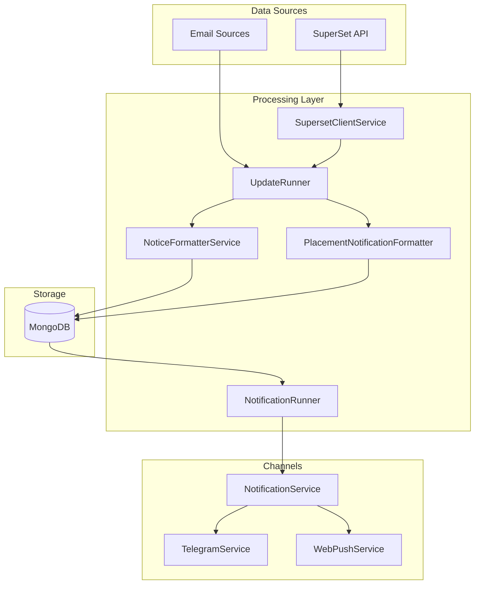
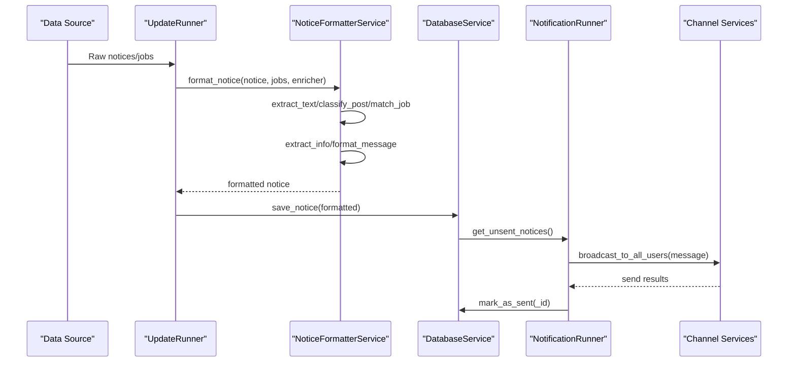
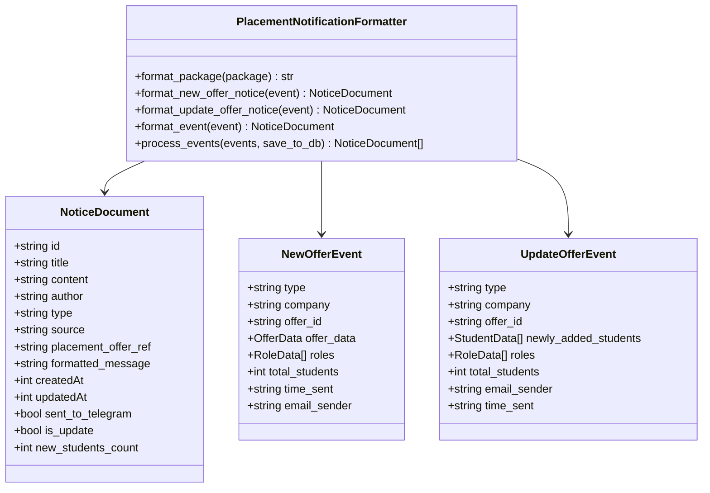
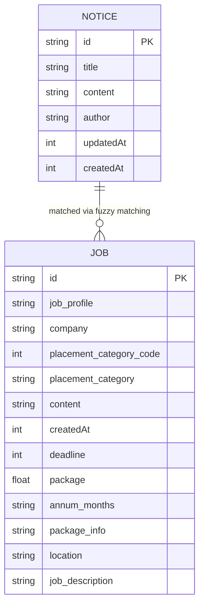
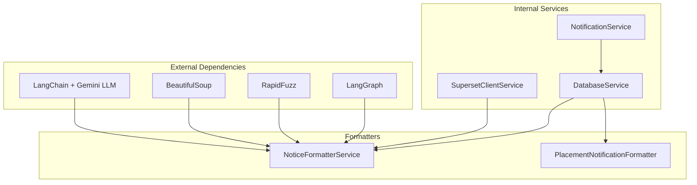

# Formatting Services

<cite>
**Referenced Files in This Document**
- [notice_formatter_service.py](file://app/services/notice_formatter_service.py)
- [placement_notification_formatter.py](file://app/services/placement_notification_formatter.py)
- [notification_service.py](file://app/services/notification_service.py)
- [superset_client.py](file://app/clients/superset_client.py)
- [update_runner.py](file://app/runners/update_runner.py)
- [notification_runner.py](file://app/runners/notification_runner.py)
- [main.py](file://app/main.py)
- [config.py](file://app/core/config.py)
- [structured_job_listings.json](file://app/data/structured_job_listings.json)
- [placement_offers.json](file://app/data/placement_offers.json)
</cite>

## Table of Contents
1. [Introduction](#introduction)
2. [Project Structure](#project-structure)
3. [Core Components](#core-components)
4. [Architecture Overview](#architecture-overview)
5. [Detailed Component Analysis](#detailed-component-analysis)
6. [Dependency Analysis](#dependency-analysis)
7. [Performance Considerations](#performance-considerations)
8. [Troubleshooting Guide](#troubleshooting-guide)
9. [Conclusion](#conclusion)

## Introduction
This document provides comprehensive documentation for the formatting services responsible for transforming processed data into notification-ready formats. It covers:
- NoticeFormatterService: Converts categorized notices into standardized notification templates with proper formatting and metadata using LLM-based categorization, fuzzy matching, and structured extraction.
- PlacementNotificationFormatter: Creates rich, structured notifications for placement offers including company details, role descriptions, and student eligibility criteria.
- Template systems, formatting patterns, and consistency mechanisms across notification channels.
- Examples of input/output transformations and customization options for different notification types.

## Project Structure
The formatting services are part of a modular notification pipeline:
- Data ingestion from SuperSet and email sources
- Structured job and notice models
- LLM-powered notice formatting
- Placement-specific formatting
- Channel-agnostic notification routing



**Diagram sources**
- [update_runner.py](file://app/runners/update_runner.py#L56-L148)
- [notification_runner.py](file://app/runners/notification_runner.py#L60-L115)
- [notice_formatter_service.py](file://app/services/notice_formatter_service.py#L48-L800)
- [placement_notification_formatter.py](file://app/services/placement_notification_formatter.py#L102-L380)

**Section sources**
- [notice_formatter_service.py](file://app/services/notice_formatter_service.py#L1-L866)
- [placement_notification_formatter.py](file://app/services/placement_notification_formatter.py#L1-L380)
- [update_runner.py](file://app/runners/update_runner.py#L1-L278)
- [notification_runner.py](file://app/runners/notification_runner.py#L1-L160)

## Core Components
This section introduces the two primary formatting services and their roles in the notification pipeline.

### NoticeFormatterService
A LangGraph-based LLM service that:
- Extracts and normalizes raw notice content
- Classifies notices into categories (update, shortlisting, announcement, hackathon, webinar, job posting)
- Performs fuzzy matching against job listings to enrich notices with structured job data
- Extracts structured information based on category
- Generates final formatted messages with consistent metadata and formatting

Key capabilities:
- Category classification with explicit tie-break rules
- Company name extraction and fuzzy matching with configurable thresholds
- Structured extraction using LLM prompts tailored to each category
- Consistent formatting patterns with bold headers, bullet lists, and IST timestamp formatting
- Job enrichment callback for on-demand detail fetching

**Section sources**
- [notice_formatter_service.py](file://app/services/notice_formatter_service.py#L48-L800)

### PlacementNotificationFormatter
A dedicated service for placement offer notifications that:
- Processes placement events (new offers, updates)
- Builds role and student breakdowns with counts and package details
- Generates placement-specific summaries with emoji indicators and structured layouts
- Maintains consistent metadata for database storage and channel distribution

Key capabilities:
- Role breakdown calculation with package aggregation
- Student selection tracking with role assignment
- Placement update detection and messaging differentiation
- Consistent NoticeDocument generation for database persistence

**Section sources**
- [placement_notification_formatter.py](file://app/services/placement_notification_formatter.py#L102-L380)

## Architecture Overview
The formatting services operate within a broader notification architecture with clear separation of concerns:



**Diagram sources**
- [update_runner.py](file://app/runners/update_runner.py#L150-L222)
- [notice_formatter_service.py](file://app/services/notice_formatter_service.py#L795-L800)
- [notification_runner.py](file://app/runners/notification_runner.py#L60-L115)

**Section sources**
- [update_runner.py](file://app/runners/update_runner.py#L1-L278)
- [notification_runner.py](file://app/runners/notification_runner.py#L1-L160)

## Detailed Component Analysis

### NoticeFormatterService Analysis
The NoticeFormatterService implements a multi-stage LangGraph workflow:

```mermaid
flowchart TD
START([Start]) --> EXTRACT["extract_text()<br/>HTML parsing + text normalization"]
EXTRACT --> CLASSIFY["classify_post()<br/>Category classification"]
CLASSIFY --> MATCH["match_job()<br/>Company fuzzy matching"]
MATCH --> ENRICH["enrich_matched_job()<br/>Optional job enrichment"]
ENRICH --> EXTRACT_INFO["extract_info()<br/>Structured extraction"]
EXTRACT_INFO --> FORMAT["format_message()<br/>Final formatting"]
FORMAT --> END([End])
STYLE_DEFAULT fill:#fff,stroke:#333,color:#000
```

**Diagram sources**
- [notice_formatter_service.py](file://app/services/notice_formatter_service.py#L202-L792)

#### Classification Categories and Rules
The service uses explicit tie-break rules for category classification:
- **update**: Operational/procedural info, timetable shifts, portal status
- **shortlisting**: Lists of selected candidates with names/enrollments
- **announcement**: General broad notices to all students
- **hackathon**: Coding competitions with themes, durations, prizes
- **webinar**: Online/offline seminars with speakers and topics
- **job posting**: Job/internship/placement opportunities

#### Structured Extraction Patterns
Each category defines specific extraction targets:
- **shortlisting**: Students with name and enrollment, company_name, role
- **job posting**: company_name, role, package, deadline, location, hiring_flow, eligibility_criteria
- **webinar**: event_name, topic, speaker, date/time, venue/platform, registration_link, deadline
- **hackathon**: event_name, theme, start/end dates, registration_deadline, registration_link, prize_pool, team_size, venue
- **others**: relevant contextual details (message, event_name)

#### Formatting Templates and Consistency
The service enforces consistent formatting:
- Bold headers for key labels (Company, Role, Location, etc.)
- Bullet-point lists for structured information
- IST timestamp formatting for deadlines and posting dates
- Metadata footer with author and timestamp
- Category-specific emojis and layout variations

**Section sources**
- [notice_formatter_service.py](file://app/services/notice_formatter_service.py#L217-L391)
- [notice_formatter_service.py](file://app/services/notice_formatter_service.py#L392-L774)

### PlacementNotificationFormatter Analysis
The PlacementNotificationFormatter focuses on placement-specific notifications:



**Diagram sources**
- [placement_notification_formatter.py](file://app/services/placement_notification_formatter.py#L102-L380)

#### Role Breakdown and Package Formatting
The formatter calculates role distributions with:
- Package aggregation per role when available
- Pluralization and suffix handling ("offer" vs "offers")
- Consistent package display ("LPA" for lakhs per annum, "LPM" for lakhs per month)

#### Placement Update Differentiation
- New offers: Standard congratulatory messaging with role breakdowns
- Updates: Emphasized "🔄 Placement Update" with newly added student counts
- Consistent metadata for database tracking and channel distribution

**Section sources**
- [placement_notification_formatter.py](file://app/services/placement_notification_formatter.py#L120-L302)

### Integration with Data Models
Both formatters rely on structured data models:



**Diagram sources**
- [superset_client.py](file://app/clients/superset_client.py#L37-L86)

**Section sources**
- [superset_client.py](file://app/clients/superset_client.py#L37-L86)

## Dependency Analysis
The formatting services integrate with the broader notification ecosystem:



**Diagram sources**
- [notice_formatter_service.py](file://app/services/notice_formatter_service.py#L14-L25)
- [update_runner.py](file://app/runners/update_runner.py#L13-L15)

**Section sources**
- [notice_formatter_service.py](file://app/services/notice_formatter_service.py#L1-L30)
- [update_runner.py](file://app/runners/update_runner.py#L1-L20)

## Performance Considerations
- **LLM Cost Optimization**: NoticeFormatterService uses targeted prompts and structured JSON extraction to minimize token usage while maintaining accuracy.
- **Fuzzy Matching Efficiency**: RapidFuzz provides fast similarity scoring with configurable thresholds to balance accuracy and performance.
- **Selective Enrichment**: Job enrichment occurs only when LLM identifies a likely match, avoiding unnecessary API calls.
- **Batch Processing**: PlacementNotificationFormatter processes multiple events efficiently and maintains consistent metadata for database operations.
- **Memory Management**: Both formatters avoid loading entire datasets into memory by processing incrementally and using generators where appropriate.

## Troubleshooting Guide
Common issues and resolutions:

### LLM Classification Failures
- **Symptom**: Notices misclassified or missing categories
- **Resolution**: Verify Google API key configuration and LLM model settings in environment variables
- **Debugging**: Check classification prompts and category definitions in the service code

### Fuzzy Matching Issues
- **Symptom**: Companies not matched despite presence in notices
- **Resolution**: Adjust matching thresholds and verify job listing data completeness
- **Debugging**: Examine extracted company names and job listing company names for normalization differences

### Formatting Inconsistencies
- **Symptom**: Inconsistent timestamp formats or layout variations
- **Resolution**: Verify IST timezone configuration and formatting helper functions
- **Debugging**: Check timestamp conversion functions and formatting templates

**Section sources**
- [notice_formatter_service.py](file://app/services/notice_formatter_service.py#L82-L102)
- [notice_formatter_service.py](file://app/services/notice_formatter_service.py#L161-L200)

## Conclusion
The formatting services provide a robust, extensible foundation for transforming raw data into consistent, channel-ready notifications. The NoticeFormatterService leverages LLM capabilities for intelligent categorization and structuring, while the PlacementNotificationFormatter ensures specialized placement offer communications maintain rich detail and consistent presentation. Together, they support reliable multi-channel notification delivery with clear separation of concerns and maintainable architecture.