# Service Architecture

<cite>
**Referenced Files in This Document**
- [main.py](file://app/main.py)
- [database_service.py](file://app/services/database_service.py)
- [notification_service.py](file://app/services/notification_service.py)
- [placement_service.py](file://app/services/placement_service.py)
- [email_notice_service.py](file://app/services/email_notice_service.py)
- [telegram_service.py](file://app/services/telegram_service.py)
- [web_push_service.py](file://app/services/web_push_service.py)
- [notice_formatter_service.py](file://app/services/notice_formatter_service.py)
- [placement_notification_formatter.py](file://app/services/placement_notification_formatter.py)
- [official_placement_service.py](file://app/services/official_placement_service.py)
- [placement_policy_service.py](file://app/services/placement_policy_service.py)
- [placement_stats_calculator_service.py](file://app/services/placement_stats_calculator_service.py)
- [admin_telegram_service.py](file://app/services/admin_telegram_service.py)
- [__init__.py](file://app/services/__init__.py)
</cite>

## Table of Contents
1. [Introduction](#introduction)
2. [Project Structure](#project-structure)
3. [Core Components](#core-components)
4. [Architecture Overview](#architecture-overview)
5. [Detailed Component Analysis](#detailed-component-analysis)
6. [Dependency Analysis](#dependency-analysis)
7. [Performance Considerations](#performance-considerations)
8. [Troubleshooting Guide](#troubleshooting-guide)
9. [Conclusion](#conclusion)

## Introduction
This document describes the service architecture of the SuperSet Telegram Notification Bot. The system is built around a modular, dependency-injected design where 12+ services encapsulate distinct responsibilities: data persistence, content processing, notification delivery, and administrative operations. The main entry point orchestrates service creation and coordinates workflows, enabling independent testing, maintenance, and deployment of each component.

## Project Structure
The service layer resides under app/services and exposes cohesive modules for data access, processing, formatting, and delivery. The main entry point initializes services and wires them together for different operational modes (CLI commands, servers, daemons).

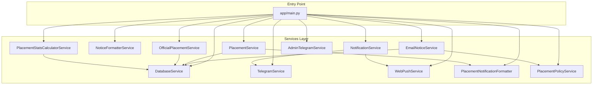

**Diagram sources**
- [main.py](file://app/main.py#L370-L632)
- [database_service.py](file://app/services/database_service.py#L16-L795)
- [notification_service.py](file://app/services/notification_service.py#L13-L237)
- [telegram_service.py](file://app/services/telegram_service.py#L20-L351)
- [web_push_service.py](file://app/services/web_push_service.py#L27-L242)
- [notice_formatter_service.py](file://app/services/notice_formatter_service.py#L48-L866)
- [placement_notification_formatter.py](file://app/services/placement_notification_formatter.py#L102-L380)
- [email_notice_service.py](file://app/services/email_notice_service.py#L335-L1155)
- [placement_service.py](file://app/services/placement_service.py#L419-L1176)
- [official_placement_service.py](file://app/services/official_placement_service.py#L81-L459)
- [placement_policy_service.py](file://app/services/placement_policy_service.py#L200-L588)
- [placement_stats_calculator_service.py](file://app/services/placement_stats_calculator_service.py#L354-L1034)
- [admin_telegram_service.py](file://app/services/admin_telegram_service.py#L19-L349)

**Section sources**
- [main.py](file://app/main.py#L370-L632)
- [__init__.py](file://app/services/__init__.py#L1-L23)

## Core Components
The core processing layer consists of the following services, each with a single responsibility and well-defined interfaces:

- DatabaseService: MongoDB wrapper for notices, jobs, placement offers, users, and policies.
- NotificationService: Aggregates channels and orchestrates sending unsent notices.
- TelegramService: Channel implementation for Telegram messaging and broadcasting.
- WebPushService: Channel implementation for browser push notifications.
- NoticeFormatterService: LLM-driven notice formatting with classification, enrichment, and message composition.
- PlacementNotificationFormatter: Formats placement events into notices for storage and delivery.
- EmailNoticeService: Processes non-placement notices from Google Groups with LLM extraction and policy detection.
- PlacementService: Extracts placement offers from emails using a LangGraph pipeline with classification, extraction, validation, and privacy sanitization.
- OfficialPlacementService: Scrapes official placement data and persists it.
- PlacementPolicyService: Manages placement policy documents (MongoDB CRUD, TOC generation, year extraction).
- PlacementStatsCalculatorService: Computes placement statistics (overall, branch-wise, company-wise).
- AdminTelegramService: Administrative commands for users, broadcasts, scraping, daemon control, and logs viewing.

These services communicate through constructor injection and method calls, avoiding internal instantiation and enabling testability.

**Section sources**
- [database_service.py](file://app/services/database_service.py#L16-L795)
- [notification_service.py](file://app/services/notification_service.py#L13-L237)
- [telegram_service.py](file://app/services/telegram_service.py#L20-L351)
- [web_push_service.py](file://app/services/web_push_service.py#L27-L242)
- [notice_formatter_service.py](file://app/services/notice_formatter_service.py#L48-L866)
- [placement_notification_formatter.py](file://app/services/placement_notification_formatter.py#L102-L380)
- [email_notice_service.py](file://app/services/email_notice_service.py#L335-L1155)
- [placement_service.py](file://app/services/placement_service.py#L419-L1176)
- [official_placement_service.py](file://app/services/official_placement_service.py#L81-L459)
- [placement_policy_service.py](file://app/services/placement_policy_service.py#L200-L588)
- [placement_stats_calculator_service.py](file://app/services/placement_stats_calculator_service.py#L354-L1034)
- [admin_telegram_service.py](file://app/services/admin_telegram_service.py#L19-L349)

## Architecture Overview
The system follows a dependency injection pattern at the application entry point. Commands in main.py instantiate shared dependencies (e.g., DBClient, DatabaseService) and pass them into services. This ensures services remain stateless and easily testable.

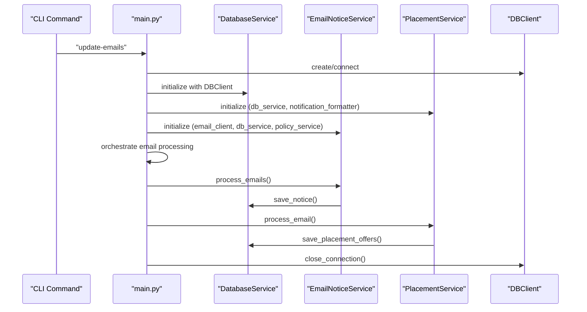

**Diagram sources**
- [main.py](file://app/main.py#L105-L242)
- [email_notice_service.py](file://app/services/email_notice_service.py#L636-L740)
- [placement_service.py](file://app/services/placement_service.py#L800-L1176)
- [database_service.py](file://app/services/database_service.py#L274-L442)

## Detailed Component Analysis

### DatabaseService
- Responsibilities: MongoDB operations for notices, jobs, placement offers, users, and policies.
- Key operations: Upsert/save notices, save placement offers with merge logic, compute placement statistics, manage users, upsert policies.
- Design: Wraps DBClient; delegates collections; centralized persistence interface.

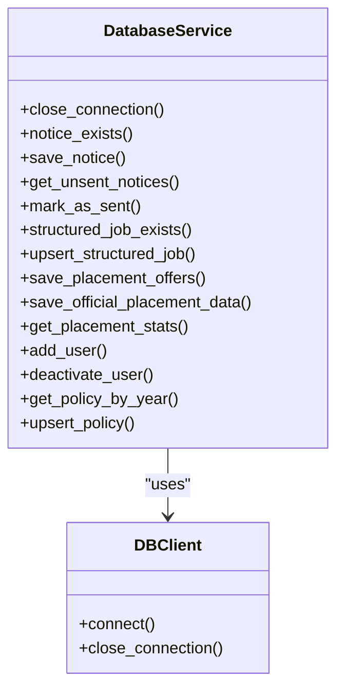

**Diagram sources**
- [database_service.py](file://app/services/database_service.py#L16-L795)

**Section sources**
- [database_service.py](file://app/services/database_service.py#L16-L795)

### NotificationService
- Responsibilities: Routing and broadcasting to enabled channels (Telegram, Web Push).
- Key operations: Broadcast to all users, send to specific channel, send unsent notices, integrate with DatabaseService.
- Design: Aggregator pattern; maintains a list of channel implementations.

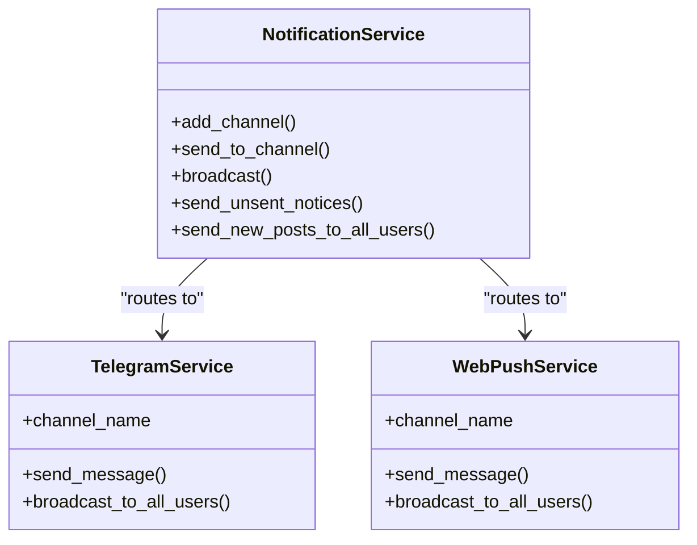

**Diagram sources**
- [notification_service.py](file://app/services/notification_service.py#L13-L237)
- [telegram_service.py](file://app/services/telegram_service.py#L20-L351)
- [web_push_service.py](file://app/services/web_push_service.py#L27-L242)

**Section sources**
- [notification_service.py](file://app/services/notification_service.py#L13-L237)

### TelegramService
- Responsibilities: Telegram-specific messaging, formatting, and broadcasting.
- Key operations: Send to default chat, send to user, broadcast to all users, message splitting and formatting.
- Design: Implements channel interface; depends on TelegramClient.

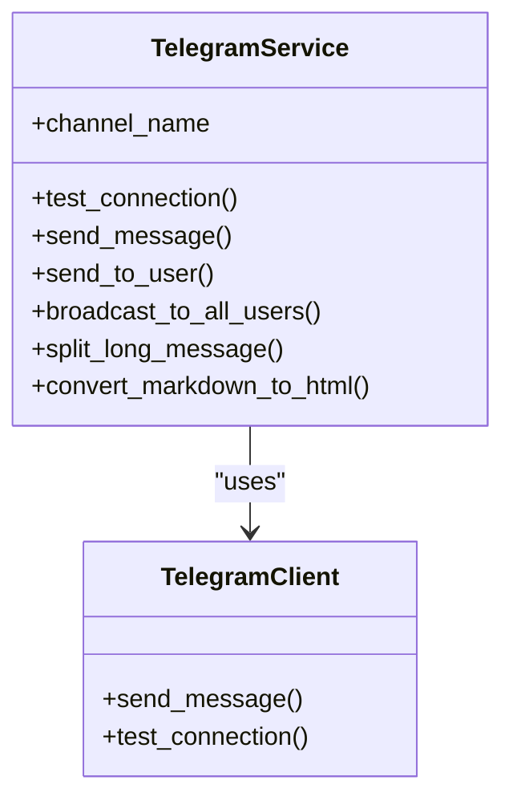

**Diagram sources**
- [telegram_service.py](file://app/services/telegram_service.py#L20-L351)

**Section sources**
- [telegram_service.py](file://app/services/telegram_service.py#L20-L351)

### WebPushService
- Responsibilities: Web push notifications via VAPID; manages subscriptions and broadcasting.
- Key operations: Send to user, broadcast to all users, enable/disable based on configuration.
- Design: Optional dependency; gracefully degrades if pywebpush unavailable.

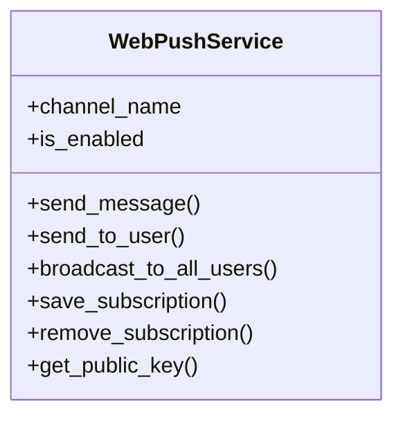

**Diagram sources**
- [web_push_service.py](file://app/services/web_push_service.py#L27-L242)

**Section sources**
- [web_push_service.py](file://app/services/web_push_service.py#L27-L242)

### NoticeFormatterService
- Responsibilities: LLM-driven notice formatting with classification, job matching, enrichment, and message composition.
- Key operations: Build LangGraph pipeline, classify posts, match jobs, extract info, format messages.
- Design: Stateless formatter; integrates with external LLM and job data.

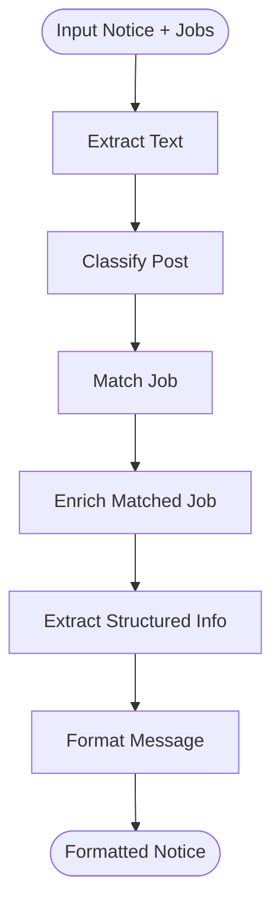

**Diagram sources**
- [notice_formatter_service.py](file://app/services/notice_formatter_service.py#L777-L792)

**Section sources**
- [notice_formatter_service.py](file://app/services/notice_formatter_service.py#L48-L866)

### PlacementNotificationFormatter
- Responsibilities: Converts placement events into notices for storage and delivery.
- Key operations: Format new offer notices, format update notices, process events, save to DB.
- Design: Decoupled from persistence; relies on DatabaseService for storage.

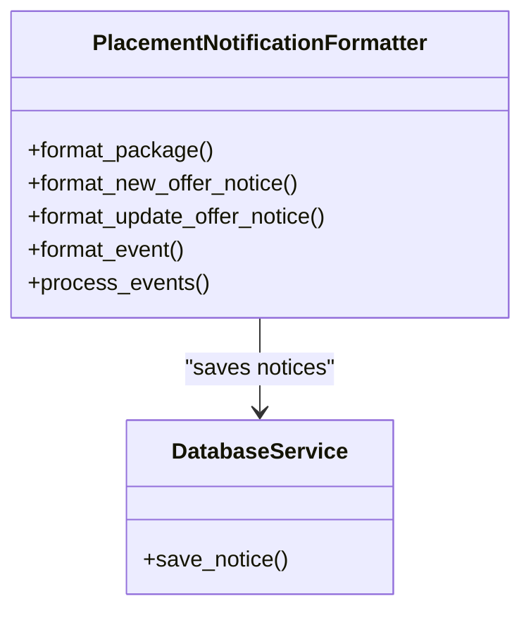

**Diagram sources**
- [placement_notification_formatter.py](file://app/services/placement_notification_formatter.py#L102-L380)
- [database_service.py](file://app/services/database_service.py#L80-L105)

**Section sources**
- [placement_notification_formatter.py](file://app/services/placement_notification_formatter.py#L102-L380)

### EmailNoticeService
- Responsibilities: Processes non-placement notices from Google Groups; detects policy updates; saves to DB.
- Key operations: Fetch unread emails, classify and extract notices, validate, save, handle policy updates.
- Design: LangGraph pipeline; integrates with NoticeFormatterService and PlacementPolicyService.

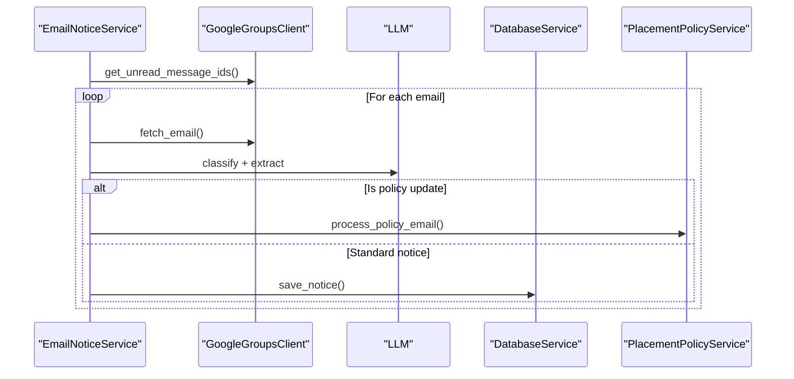

**Diagram sources**
- [email_notice_service.py](file://app/services/email_notice_service.py#L636-L740)
- [placement_policy_service.py](file://app/services/placement_policy_service.py#L541-L588)

**Section sources**
- [email_notice_service.py](file://app/services/email_notice_service.py#L335-L1155)

### PlacementService
- Responsibilities: Extracts placement offers from emails using a LangGraph pipeline.
- Key operations: Classification, robust extraction with retries, validation, privacy sanitization, display results.
- Design: LLM-based pipeline with typed models and privacy safeguards.

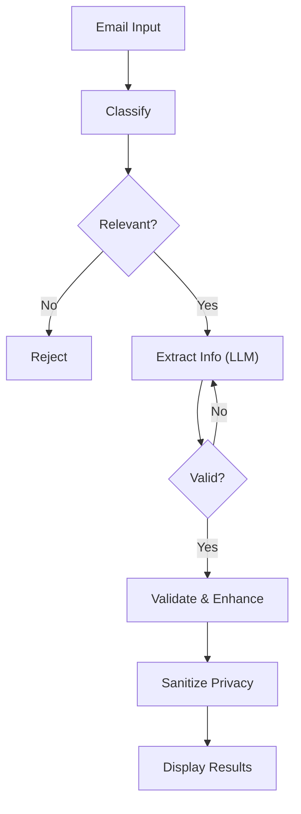

**Diagram sources**
- [placement_service.py](file://app/services/placement_service.py#L484-L506)

**Section sources**
- [placement_service.py](file://app/services/placement_service.py#L419-L1176)

### OfficialPlacementService
- Responsibilities: Scrapes official placement data and persists it.
- Key operations: Fetch HTML, parse batches, extract pointers and distributions, save to DB.
- Design: Web scraping with BeautifulSoup; integrates with DatabaseService.

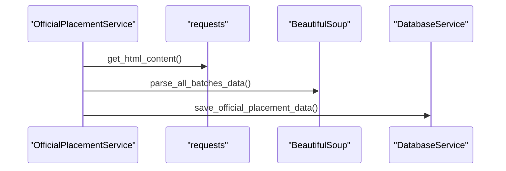

**Diagram sources**
- [official_placement_service.py](file://app/services/official_placement_service.py#L375-L422)

**Section sources**
- [official_placement_service.py](file://app/services/official_placement_service.py#L81-L459)

### PlacementPolicyService
- Responsibilities: Manages placement policy documents (MongoDB CRUD, TOC generation, year extraction).
- Key operations: Extract year, generate TOC, create/update policies, process policy emails.
- Design: LLM-assisted extraction; robust slug generation for headings.

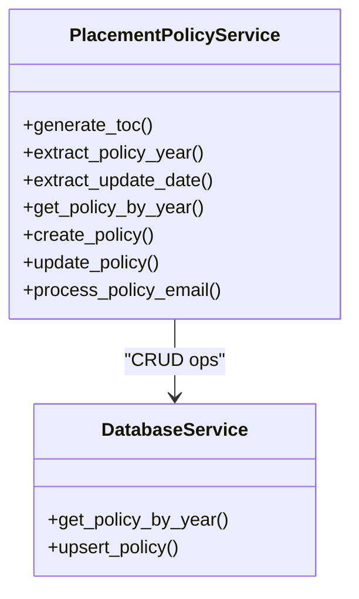

**Diagram sources**
- [placement_policy_service.py](file://app/services/placement_policy_service.py#L200-L588)
- [database_service.py](file://app/services/database_service.py#L730-L795)

**Section sources**
- [placement_policy_service.py](file://app/services/placement_policy_service.py#L200-L588)

### PlacementStatsCalculatorService
- Responsibilities: Calculates comprehensive placement statistics (overall, branch-wise, company-wise).
- Key operations: Flatten students, filter by criteria, compute package stats, branch/company aggregations, extract filters.
- Design: Configurable enrollment ranges and student counts; supports filtering and search.

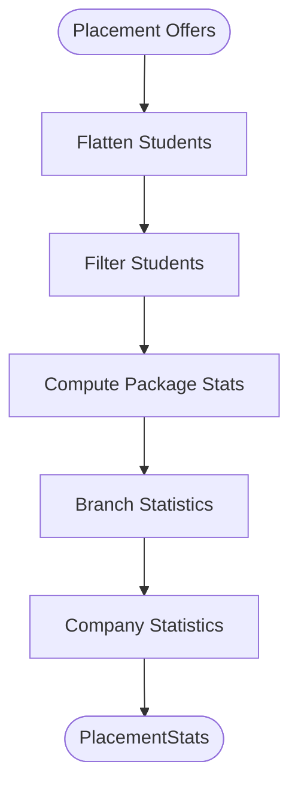

**Diagram sources**
- [placement_stats_calculator_service.py](file://app/services/placement_stats_calculator_service.py#L708-L800)

**Section sources**
- [placement_stats_calculator_service.py](file://app/services/placement_stats_calculator_service.py#L354-L1034)

### AdminTelegramService
- Responsibilities: Administrative commands for users, broadcasts, scraping, daemon control, and logs viewing.
- Key operations: Authenticate admin, list users, broadcast messages, trigger scraping, stop scheduler, view logs.
- Design: Integrates with TelegramService, DatabaseService, and daemon utilities.

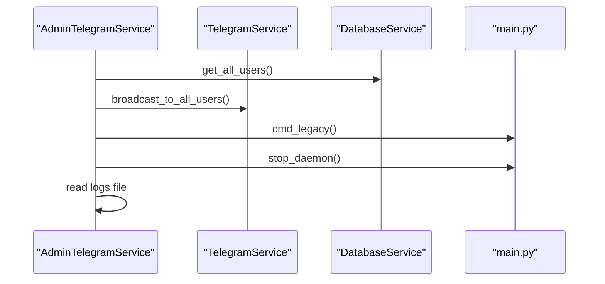

**Diagram sources**
- [admin_telegram_service.py](file://app/services/admin_telegram_service.py#L57-L349)
- [main.py](file://app/main.py#L319-L335)

**Section sources**
- [admin_telegram_service.py](file://app/services/admin_telegram_service.py#L19-L349)

## Dependency Analysis
- Coupling: Services depend on shared interfaces (DatabaseService) and external clients (TelegramClient, GoogleGroupsClient). NotificationService acts as a channel aggregator, minimizing cross-service coupling.
- Cohesion: Each service encapsulates a single responsibility (persistence, formatting, processing, delivery).
- External dependencies: LLM providers, MongoDB, Telegram API, Google Groups API, optional web push library.
- Circular dependencies: None observed; dependencies flow from main.py into services.

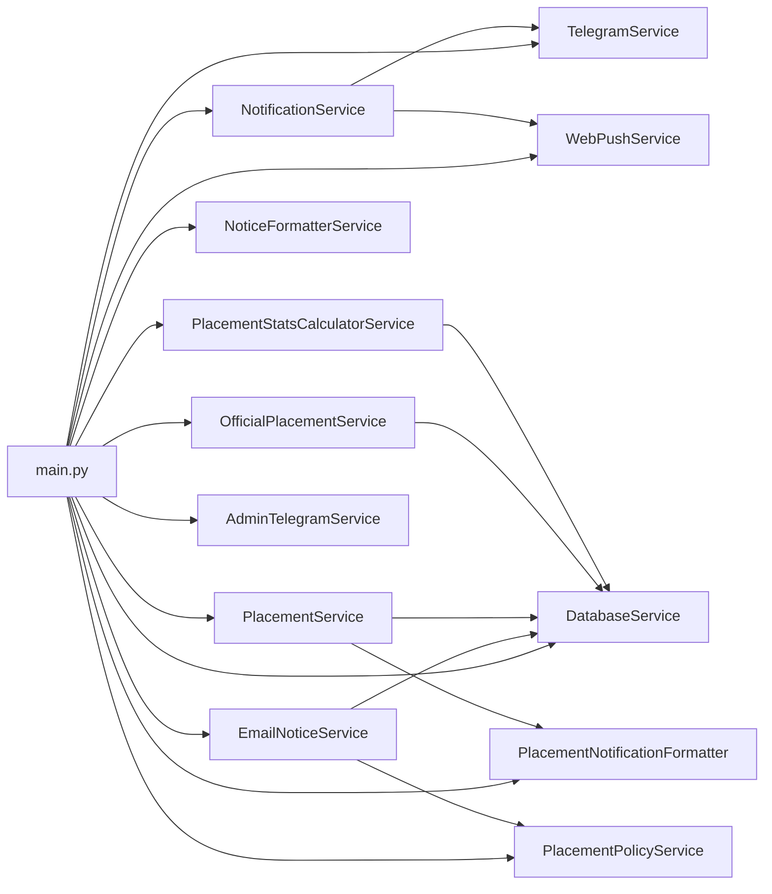

**Diagram sources**
- [main.py](file://app/main.py#L105-L242)
- [notification_service.py](file://app/services/notification_service.py#L13-L237)
- [email_notice_service.py](file://app/services/email_notice_service.py#L335-L1155)
- [placement_service.py](file://app/services/placement_service.py#L419-L1176)
- [placement_notification_formatter.py](file://app/services/placement_notification_formatter.py#L102-L380)
- [official_placement_service.py](file://app/services/official_placement_service.py#L81-L459)
- [placement_policy_service.py](file://app/services/placement_policy_service.py#L200-L588)
- [placement_stats_calculator_service.py](file://app/services/placement_stats_calculator_service.py#L354-L1034)
- [admin_telegram_service.py](file://app/services/admin_telegram_service.py#L19-L349)

**Section sources**
- [main.py](file://app/main.py#L105-L242)
- [__init__.py](file://app/services/__init__.py#L1-L23)

## Performance Considerations
- Asynchronous operations: TelegramService uses synchronous HTTP calls; consider async alternatives for high-throughput broadcasting.
- LLM costs and retries: PlacementService and EmailNoticeService include retry logic; tune max retries and prompts to balance accuracy and latency.
- Database writes: Batch operations for notices and placement offers reduce overhead; ensure proper indexing on MongoDB collections.
- Message size limits: TelegramService splits long messages; ensure formatted content respects limits to avoid truncation.
- Web push availability: WebPushService gracefully degrades; monitor VAPID configuration and subscription cleanup.

## Troubleshooting Guide
- Telegram connectivity: Use TelegramService.test_connection() to validate bot token and chat ID.
- Web push failures: Inspect VAPID keys and handle expired subscriptions; the service removes invalid endpoints.
- LLM extraction errors: Review validation errors and retry counts in PlacementService and EmailNoticeService.
- Database connectivity: Verify DBClient connection lifecycle and ensure close_connection() is called after operations.
- Daemon control: Use AdminTelegramService commands to stop scheduler and view logs.

**Section sources**
- [telegram_service.py](file://app/services/telegram_service.py#L58-L122)
- [web_push_service.py](file://app/services/web_push_service.py#L157-L208)
- [placement_service.py](file://app/services/placement_service.py#L601-L705)
- [email_notice_service.py](file://app/services/email_notice_service.py#L535-L569)
- [database_service.py](file://app/services/database_service.py#L47-L51)
- [admin_telegram_service.py](file://app/services/admin_telegram_service.py#L249-L276)

## Conclusion
The SuperSet Telegram Notification Bot employs a clean, dependency-injected service architecture. The main entry point centralizes initialization and orchestration, while services maintain focused responsibilities and well-defined interfaces. This design enables independent testing, modular maintenance, and scalable extension across data sources, processing pipelines, and delivery channels.