# Service architecture

## Introduction
This page describes the service architecture of the SuperSet Telegram Notification Bot. The system is built around a modular, dependency-injected design where 12+ services encapsulate distinct responsibilities: data persistence, content processing, notification delivery, and administrative operations. The main entry point orchestrates service creation and coordinates workflows, enabling independent testing, maintenance, and deployment of each component.

## Project structure
The service layer resides under app/services and exposes cohesive modules for data access, processing, formatting, and delivery. The main entry point initializes services and wires them together for different operational modes (CLI commands, servers, daemons).

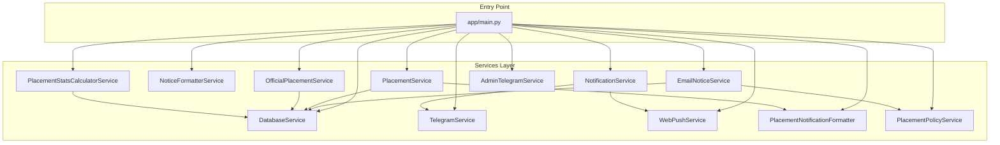
```mermaid
graph TB
subgraph "Entry Point"
MAIN["app/main.py"]
end
subgraph "Services Layer"
DB["DatabaseService"]
NOTIF["NotificationService"]
TELEGRAM["TelegramService"]
WEBPUSH["WebPushService"]
NOTICE_FMT["NoticeFormatterService"]
PLACEMENT_NOTIF_FMT["PlacementNotificationFormatter"]
EMAIL_NOTICE["EmailNoticeService"]
PLACEMENT["PlacementService"]
OFFICIAL["OfficialPlacementService"]
POLICY["PlacementPolicyService"]
STATS["PlacementStatsCalculatorService"]
ADMIN["AdminTelegramService"]
end
MAIN --> DB
MAIN --> NOTIF
MAIN --> TELEGRAM
MAIN --> WEBPUSH
MAIN --> NOTICE_FMT
MAIN --> PLACEMENT_NOTIF_FMT
MAIN --> EMAIL_NOTICE
MAIN --> PLACEMENT
MAIN --> OFFICIAL
MAIN --> POLICY
MAIN --> STATS
MAIN --> ADMIN
NOTIF --> TELEGRAM
NOTIF --> WEBPUSH
EMAIL_NOTICE --> DB
EMAIL_NOTICE --> POLICY
PLACEMENT --> DB
PLACEMENT --> PLACEMENT_NOTIF_FMT
OFFICIAL --> DB
STATS --> DB
```

## Core components
The core processing layer consists of the following services, each with a single responsibility and well-defined interfaces:

- DatabaseService: MongoDB wrapper for notices, jobs, placement offers, users, and policies.
- NotificationService: Aggregates channels and orchestrates sending unsent notices.
- TelegramService: Channel implementation for Telegram messaging and broadcasting.
- WebPushService: Channel implementation for browser push notifications.
- NoticeFormatterService: LLM-driven notice formatting with classification, enrichment, and message composition.
- PlacementNotificationFormatter: Formats placement events into notices for storage and delivery.
- EmailNoticeService: Processes non-placement notices from Google Groups with LLM extraction and policy detection.
- PlacementService: Extracts placement offers from emails using a LangGraph pipeline with classification, extraction, validation, and privacy sanitization.
- OfficialPlacementService: Scrapes official placement data and persists it.
- PlacementPolicyService: Manages placement policy documents (MongoDB CRUD, TOC generation, year extraction).
- PlacementStatsCalculatorService: Computes placement statistics (overall, branch-wise, company-wise).
- AdminTelegramService: Administrative commands for users, broadcasts, scraping, daemon control, and logs viewing.

These services communicate through constructor injection and method calls, avoiding internal instantiation and enabling testability.

## Architecture overview
The system follows a dependency injection pattern at the application entry point. Commands in main.py instantiate shared dependencies (e.g., DBClient, DatabaseService) and pass them into services. This ensures services remain stateless and easily testable.

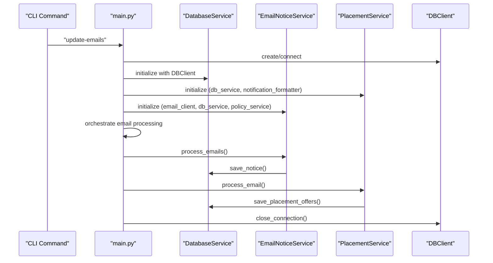
```mermaid
sequenceDiagram
participant CLI as "CLI Command"
participant Main as "main.py"
participant DB as "DatabaseService"
participant EmailSvc as "EmailNoticeService"
participant PlSvc as "PlacementService"
participant DBClient as "DBClient"
CLI->>Main : "update-emails"
Main->>DBClient : create/connect
Main->>DB : initialize with DBClient
Main->>PlSvc : initialize (db_service, notification_formatter)
Main->>EmailSvc : initialize (email_client, db_service, policy_service)
Main->>Main : orchestrate email processing
Main->>EmailSvc : process_emails()
EmailSvc->>DB : save_notice()
Main->>PlSvc : process_email()
PlSvc->>DB : save_placement_offers()
Main->>DBClient : close_connection()
```

## Detailed component analysis

### DatabaseService
- Responsibilities: MongoDB operations for notices, jobs, placement offers, users, and policies.
- Key operations: Upsert/save notices, save placement offers with merge logic, compute placement statistics, manage users, upsert policies.
- Design: Wraps DBClient; delegates collections; centralized persistence interface.

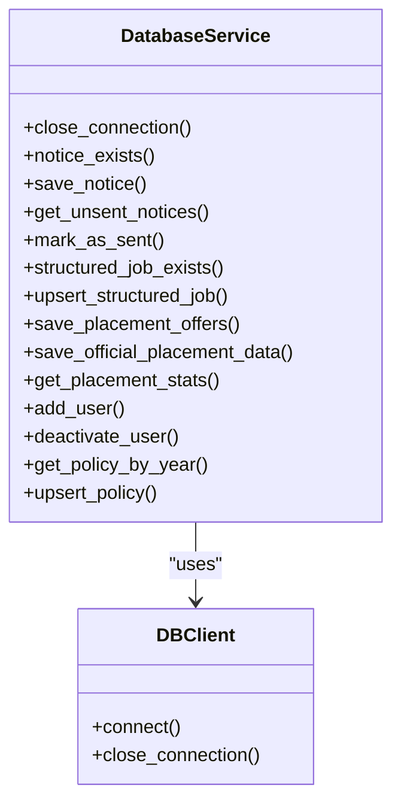
```mermaid
classDiagram
class DatabaseService {
+close_connection()
+notice_exists()
+save_notice()
+get_unsent_notices()
+mark_as_sent()
+structured_job_exists()
+upsert_structured_job()
+save_placement_offers()
+save_official_placement_data()
+get_placement_stats()
+add_user()
+deactivate_user()
+get_policy_by_year()
+upsert_policy()
}
class DBClient {
+connect()
+close_connection()
}
DatabaseService --> DBClient : "uses"
```

### NotificationService
- Responsibilities: Routing and broadcasting to enabled channels (Telegram, Web Push).
- Key operations: Broadcast to all users, send to specific channel, send unsent notices, integrate with DatabaseService.
- Design: Aggregator pattern; maintains a list of channel implementations.

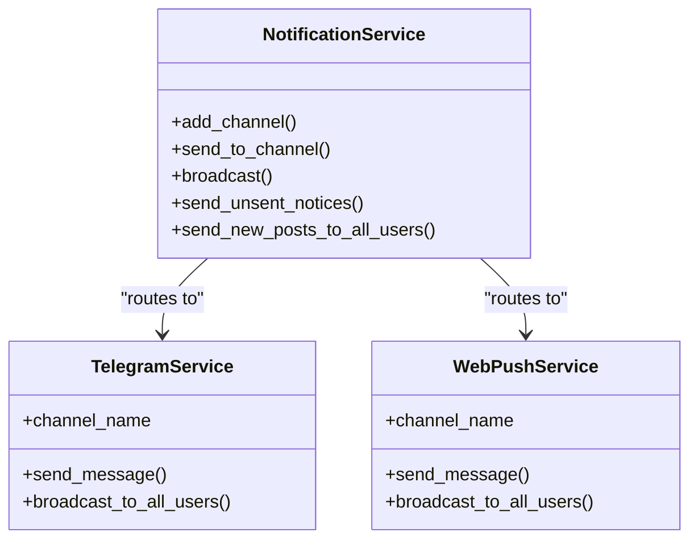
```mermaid
classDiagram
class NotificationService {
+add_channel()
+send_to_channel()
+broadcast()
+send_unsent_notices()
+send_new_posts_to_all_users()
}
class TelegramService {
+channel_name
+send_message()
+broadcast_to_all_users()
}
class WebPushService {
+channel_name
+send_message()
+broadcast_to_all_users()
}
NotificationService --> TelegramService : "routes to"
NotificationService --> WebPushService : "routes to"
```

### TelegramService
- Responsibilities: Telegram-specific messaging, formatting, and broadcasting.
- Key operations: Send to default chat, send to user, broadcast to all users, message splitting and formatting.
- Design: Implements channel interface; depends on TelegramClient.

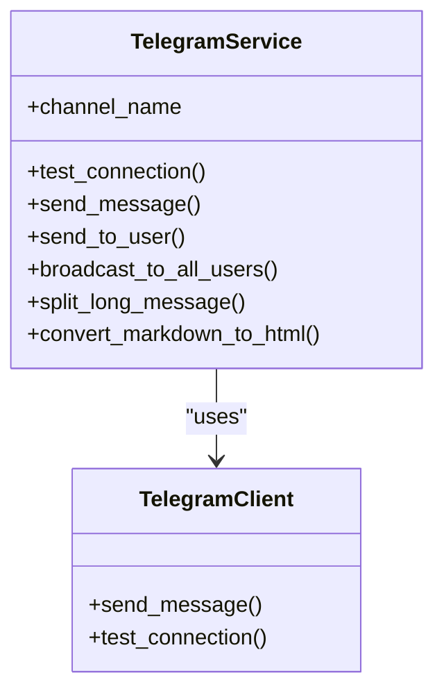
```mermaid
classDiagram
class TelegramService {
+channel_name
+test_connection()
+send_message()
+send_to_user()
+broadcast_to_all_users()
+split_long_message()
+convert_markdown_to_html()
}
class TelegramClient {
+send_message()
+test_connection()
}
TelegramService --> TelegramClient : "uses"
```

### WebPushService
- Responsibilities: Web push notifications via VAPID; manages subscriptions and broadcasting.
- Key operations: Send to user, broadcast to all users, enable/disable based on configuration.
- Design: Optional dependency; gracefully degrades if pywebpush unavailable.

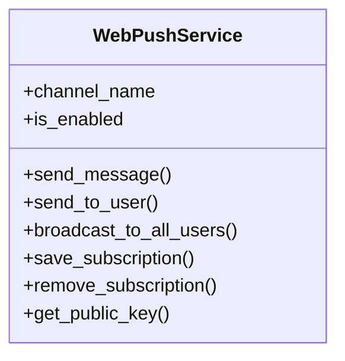
```mermaid
classDiagram
class WebPushService {
+channel_name
+is_enabled
+send_message()
+send_to_user()
+broadcast_to_all_users()
+save_subscription()
+remove_subscription()
+get_public_key()
}
```

### NoticeFormatterService
- Responsibilities: LLM-driven notice formatting with classification, job matching, enrichment, and message composition.
- Key operations: Build LangGraph pipeline, classify posts, match jobs, extract info, format messages.
- Design: Stateless formatter; integrates with external LLM and job data.

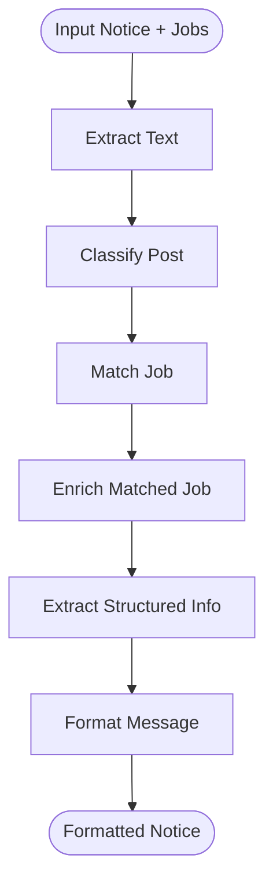
```mermaid
flowchart TD
Start(["Input Notice + Jobs"]) --> Extract["Extract Text"]
Extract --> Classify["Classify Post"]
Classify --> Match["Match Job"]
Match --> Enrich["Enrich Matched Job"]
Enrich --> ExtractInfo["Extract Structured Info"]
ExtractInfo --> Format["Format Message"]
Format --> End(["Formatted Notice"])
```

### PlacementNotificationFormatter
- Responsibilities: Converts placement events into notices for storage and delivery.
- Key operations: Format new offer notices, format update notices, process events, save to DB.
- Design: Decoupled from persistence; relies on DatabaseService for storage.

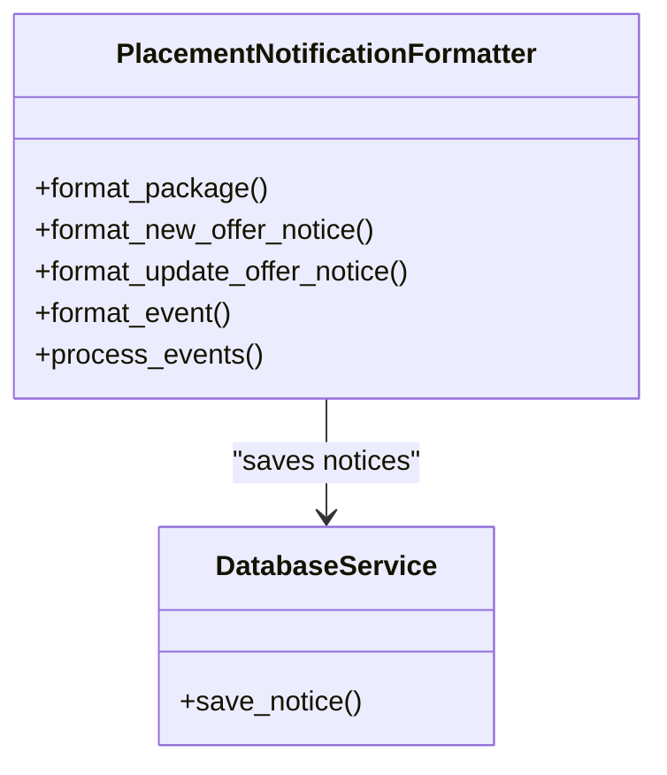
```mermaid
classDiagram
class PlacementNotificationFormatter {
+format_package()
+format_new_offer_notice()
+format_update_offer_notice()
+format_event()
+process_events()
}
class DatabaseService {
+save_notice()
}
PlacementNotificationFormatter --> DatabaseService : "saves notices"
```

### EmailNoticeService
- Responsibilities: Processes non-placement notices from Google Groups; detects policy updates; saves to DB.
- Key operations: Fetch unread emails, classify and extract notices, validate, save, handle policy updates.
- Design: LangGraph pipeline; integrates with NoticeFormatterService and PlacementPolicyService.

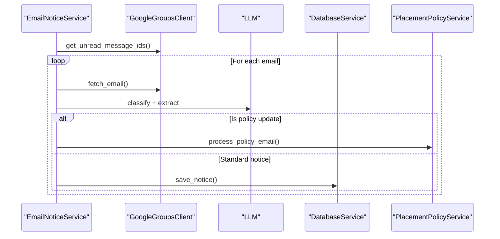
```mermaid
sequenceDiagram
participant EmailSvc as "EmailNoticeService"
participant GGC as "GoogleGroupsClient"
participant LLM as "LLM"
participant DB as "DatabaseService"
participant Policy as "PlacementPolicyService"
EmailSvc->>GGC : get_unread_message_ids()
loop For each email
EmailSvc->>GGC : fetch_email()
EmailSvc->>LLM : classify + extract
alt Is policy update
EmailSvc->>Policy : process_policy_email()
else Standard notice
EmailSvc->>DB : save_notice()
end
end
```

### PlacementService
- Responsibilities: Extracts placement offers from emails using a LangGraph pipeline.
- Key operations: Classification, reliable extraction with retries, validation, privacy sanitization, display results.
- Design: LLM-based pipeline with typed models and privacy safeguards.

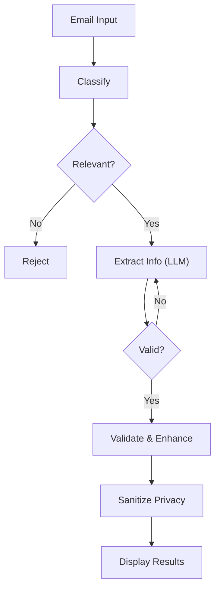
```mermaid
flowchart TD
A["Email Input"] --> B["Classify"]
B --> C{"Relevant?"}
C --> |No| Z["Reject"]
C --> |Yes| D["Extract Info (LLM)"]
D --> E{"Valid?"}
E --> |No| D
E --> |Yes| F["Validate & Enhance"]
F --> G["Sanitize Privacy"]
G --> H["Display Results"]
```

### OfficialPlacementService
- Responsibilities: Scrapes official placement data and persists it.
- Key operations: Fetch HTML, parse batches, extract pointers and distributions, save to DB.
- Design: Web scraping with BeautifulSoup; integrates with DatabaseService.

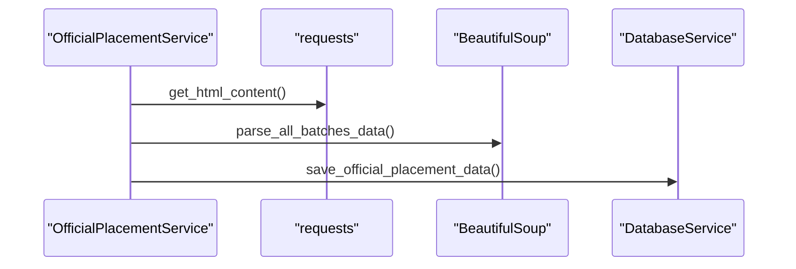
```mermaid
sequenceDiagram
participant Official as "OfficialPlacementService"
participant HTTP as "requests"
participant Soup as "BeautifulSoup"
participant DB as "DatabaseService"
Official->>HTTP : get_html_content()
Official->>Soup : parse_all_batches_data()
Official->>DB : save_official_placement_data()
```

### PlacementPolicyService
- Responsibilities: Manages placement policy documents (MongoDB CRUD, TOC generation, year extraction).
- Key operations: Extract year, generate TOC, create/update policies, process policy emails.
- Design: LLM-assisted extraction; reliable slug generation for headings.

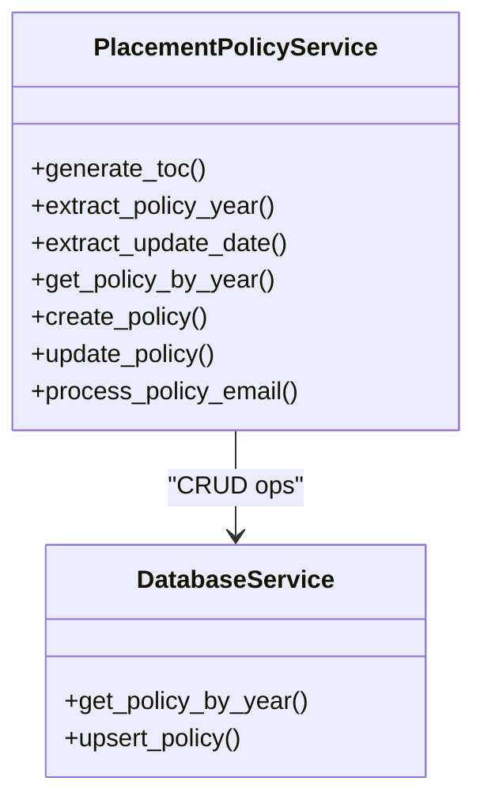
```mermaid
classDiagram
class PlacementPolicyService {
+generate_toc()
+extract_policy_year()
+extract_update_date()
+get_policy_by_year()
+create_policy()
+update_policy()
+process_policy_email()
}
class DatabaseService {
+get_policy_by_year()
+upsert_policy()
}
PlacementPolicyService --> DatabaseService : "CRUD ops"
```

### PlacementStatsCalculatorService
- Responsibilities: Calculates detailed placement statistics (overall, branch-wise, company-wise).
- Key operations: Flatten students, filter by criteria, compute package stats, branch/company aggregations, extract filters.
- Design: Configurable enrollment ranges and student counts; supports filtering and search.

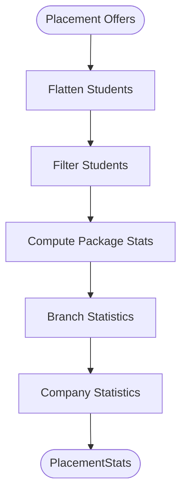
```mermaid
flowchart TD
Start(["Placement Offers"]) --> Flatten["Flatten Students"]
Flatten --> Filter["Filter Students"]
Filter --> Packages["Compute Package Stats"]
Packages --> Branch["Branch Statistics"]
Branch --> Company["Company Statistics"]
Company --> Output(["PlacementStats"])
```

### AdminTelegramService
- Responsibilities: Administrative commands for users, broadcasts, scraping, daemon control, and logs viewing.
- Key operations: Authenticate admin, list users, broadcast messages, trigger scraping, stop scheduler, view logs.
- Design: Integrates with TelegramService, DatabaseService, and daemon utilities.

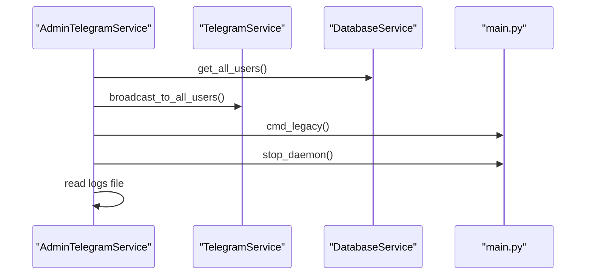
```mermaid
sequenceDiagram
participant Admin as "AdminTelegramService"
participant TG as "TelegramService"
participant DB as "DatabaseService"
participant Main as "main.py"
Admin->>DB : get_all_users()
Admin->>TG : broadcast_to_all_users()
Admin->>Main : cmd_legacy()
Admin->>Main : stop_daemon()
Admin->>Admin : read logs file
```

## Dependency analysis
- Coupling: Services depend on shared interfaces (DatabaseService) and external clients (TelegramClient, GoogleGroupsClient). NotificationService acts as a channel aggregator, minimizing cross-service coupling.
- Cohesion: Each service encapsulates a single responsibility (persistence, formatting, processing, delivery).
- External dependencies: LLM providers, MongoDB, Telegram API, Google Groups API, optional web push library.
- Circular dependencies: None observed; dependencies flow from main.py into services.

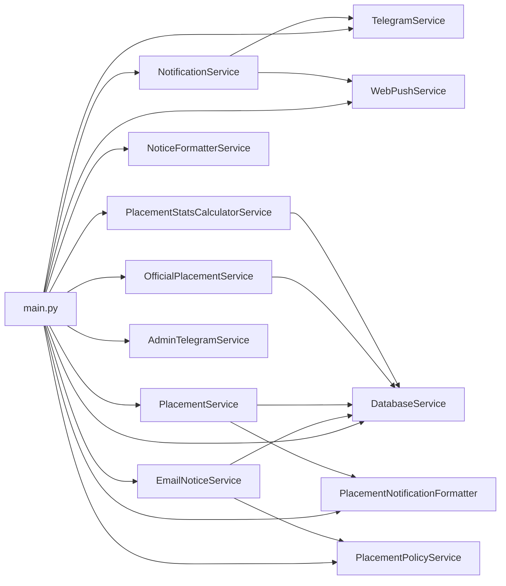
```mermaid
graph LR
MAIN["main.py"] --> DB["DatabaseService"]
MAIN --> NOTIF["NotificationService"]
MAIN --> TELEGRAM["TelegramService"]
MAIN --> WEBPUSH["WebPushService"]
MAIN --> EMAIL["EmailNoticeService"]
MAIN --> PLACEMENT["PlacementService"]
MAIN --> FORMATTER["NoticeFormatterService"]
MAIN --> PLACEMENT_NOTIF["PlacementNotificationFormatter"]
MAIN --> OFFICIAL["OfficialPlacementService"]
MAIN --> POLICY["PlacementPolicyService"]
MAIN --> STATS["PlacementStatsCalculatorService"]
MAIN --> ADMIN["AdminTelegramService"]
NOTIF --> TELEGRAM
NOTIF --> WEBPUSH
EMAIL --> DB
EMAIL --> POLICY
PLACEMENT --> DB
PLACEMENT --> PLACEMENT_NOTIF
OFFICIAL --> DB
STATS --> DB
```

## Performance considerations
- Asynchronous operations: TelegramService uses synchronous HTTP calls; consider async alternatives for high-throughput broadcasting.
- LLM costs and retries: PlacementService and EmailNoticeService include retry logic; tune max retries and prompts to balance accuracy and latency.
- Database writes: Batch operations for notices and placement offers reduce overhead; ensure proper indexing on MongoDB collections.
- Message size limits: TelegramService splits long messages; ensure formatted content respects limits to avoid truncation.
- Web push availability: WebPushService gracefully degrades; monitor VAPID configuration and subscription cleanup.

## Troubleshooting guide
- Telegram connectivity: Use TelegramService.test_connection() to validate bot token and chat ID.
- Web push failures: Inspect VAPID keys and handle expired subscriptions; the service removes invalid endpoints.
- LLM extraction errors: Review validation errors and retry counts in PlacementService and EmailNoticeService.
- Database connectivity: Verify DBClient connection lifecycle and ensure close_connection() is called after operations.
- Daemon control: Use AdminTelegramService commands to stop scheduler and view logs.

## Conclusion
The SuperSet Telegram Notification Bot employs a clean, dependency-injected service architecture. The main entry point centralizes initialization and orchestration, while services maintain focused responsibilities and well-defined interfaces. This design enables independent testing, modular maintenance, and scalable extension across data sources, processing pipelines, and delivery channels.
