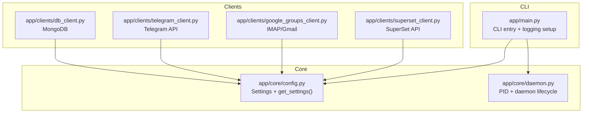
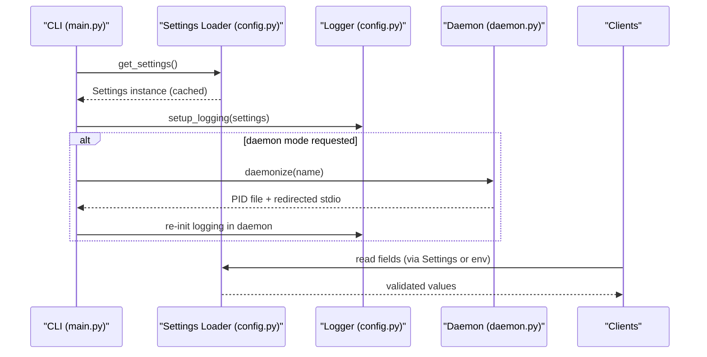
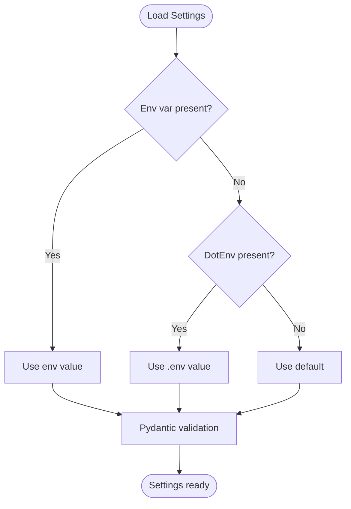
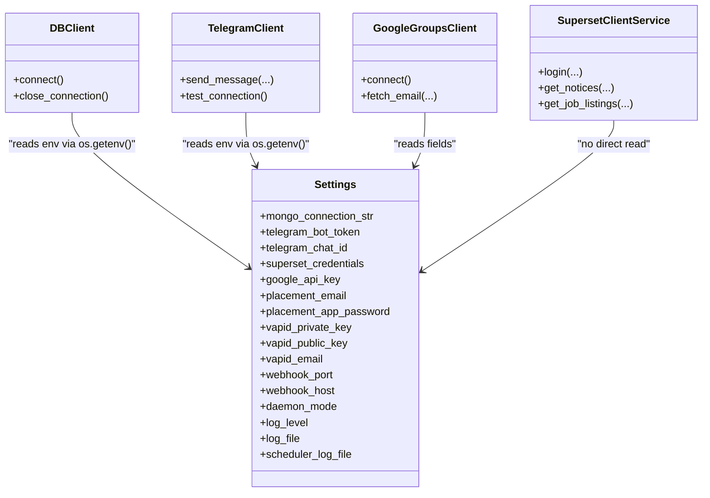
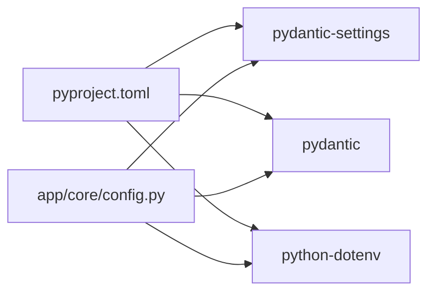

# Configuration & Environment

<cite>
**Referenced Files in This Document**
- [config.py](file://app/core/config.py)
- [main.py](file://app/main.py)
- [daemon.py](file://app/core/daemon.py)
- [db_client.py](file://app/clients/db_client.py)
- [telegram_client.py](file://app/clients/telegram_client.py)
- [google_groups_client.py](file://app/clients/google_groups_client.py)
- [superset_client.py](file://app/clients/superset_client.py)
- [pyproject.toml](file://app/pyproject.toml)
- [requirements.txt](file://app/requirements.txt)
- [docker-compose.dev.yaml](file://app/docker-compose.dev.yaml)
- [CONFIGURATION.md](file://docs/CONFIGURATION.md)
</cite>

## Table of Contents
1. [Introduction](#introduction)
2. [Project Structure](#project-structure)
3. [Core Components](#core-components)
4. [Architecture Overview](#architecture-overview)
5. [Detailed Component Analysis](#detailed-component-analysis)
6. [Dependency Analysis](#dependency-analysis)
7. [Performance Considerations](#performance-considerations)
8. [Troubleshooting Guide](#troubleshooting-guide)
9. [Conclusion](#conclusion)

## Introduction
This document explains the configuration and environment management for the SuperSet Telegram Notification Bot. It covers the Pydantic-based settings system, environment variable handling, credential management, configuration hierarchy, defaults, overrides, validation rules, and error handling. It also provides security best practices, backup strategies, and environment-specific guidance for development, staging, and production.

## Project Structure
Configuration is centralized in a single module that defines strongly-typed settings, loads from environment variables, and supports caching. Clients and services consume configuration through the settings object or environment variables directly when appropriate. The CLI orchestrates daemonization and logging initialization.

**Diagram sources**
- [config.py](file://app/core/config.py#L18-L127)
- [main.py](file://app/main.py#L31-L589)
- [daemon.py](file://app/core/daemon.py#L114-L232)
- [db_client.py](file://app/clients/db_client.py#L21-L29)
- [telegram_client.py](file://app/clients/telegram_client.py#L24-L34)
- [google_groups_client.py](file://app/clients/google_groups_client.py#L30-L46)
- [superset_client.py](file://app/clients/superset_client.py#L104-L119)

**Section sources**
- [config.py](file://app/core/config.py#L1-L254)
- [main.py](file://app/main.py#L1-L632)
- [daemon.py](file://app/core/daemon.py#L1-L251)

## Core Components
- Centralized Settings: Strongly typed configuration using Pydantic Settings with validation aliases and defaults.
- Configuration Loader: Lazy-loading with caching and .env discovery.
- Logging Setup: Initializes loggers with configurable levels and handlers, supporting daemon mode.
- Daemon Utilities: PID file management and Unix-style daemonization for background processes.
- Client Integrations: Clients read credentials either from Settings or environment variables directly.

Key responsibilities:
- Settings define all configuration fields, validation rules, and defaults.
- get_settings() loads from .env and environment variables, caches results.
- setup_logging() configures handlers and levels, respecting daemon mode.
- Daemon utilities manage process lifecycle and logging redirection for background runs.

**Section sources**
- [config.py](file://app/core/config.py#L18-L127)
- [config.py](file://app/core/config.py#L156-L185)
- [config.py](file://app/core/config.py#L188-L253)
- [daemon.py](file://app/core/daemon.py#L114-L232)
- [db_client.py](file://app/clients/db_client.py#L21-L29)
- [telegram_client.py](file://app/clients/telegram_client.py#L24-L34)
- [google_groups_client.py](file://app/clients/google_groups_client.py#L30-L46)

## Architecture Overview
The configuration system follows a layered approach:
- Layer 1: Settings definition with Pydantic Fields and validation aliases.
- Layer 2: Loader that resolves .env and environment variables, caches instances.
- Layer 3: CLI initializes logging and optionally daemonizes.
- Layer 4: Clients access configuration via Settings or environment variables.

**Diagram sources**
- [main.py](file://app/main.py#L582-L589)
- [config.py](file://app/core/config.py#L156-L185)
- [config.py](file://app/core/config.py#L188-L253)
- [daemon.py](file://app/core/daemon.py#L114-L232)
- [db_client.py](file://app/clients/db_client.py#L21-L29)
- [telegram_client.py](file://app/clients/telegram_client.py#L24-L34)
- [google_groups_client.py](file://app/clients/google_groups_client.py#L30-L46)

## Detailed Component Analysis

### Settings Model and Environment Resolution
- Settings class defines all configuration fields with explicit validation aliases and defaults.
- .env loading occurs before returning the Settings instance.
- get_settings() caches the instance for the process lifetime.

Configuration categories:
- Database: MongoDB connection string.
- Telegram: Bot token and default chat ID.
- SuperSet: JSON list of credentials.
- Google AI (Gemini): API key.
- Email (placement): Email address and app password.
- Web Push (VAPID): Private/public key and contact email.
- Server: Host and port for webhook server.
- Daemon: Toggle to suppress stdout.
- Logging: Levels and file paths for bot and scheduler logs.

Environment resolution order:
1. Environment variables (highest precedence).
2. .env file (if present).
3. Code defaults (lowest precedence).

**Diagram sources**
- [config.py](file://app/core/config.py#L124-L127)
- [config.py](file://app/core/config.py#L156-L185)

**Section sources**
- [config.py](file://app/core/config.py#L18-L127)
- [config.py](file://app/core/config.py#L156-L185)

### Configuration Loading and Caching
- get_settings() determines .env location relative to the config module, tries project root and app subdirectory, then falls back to default behavior.
- Uses python-dotenv to load variables from .env.
- Returns a cached Settings instance using LRU cache.

Operational notes:
- Daemon processes clear the cache before reinitializing logging to ensure fresh settings.
- Absolute log paths are resolved consistently with the same base directory logic.

**Section sources**
- [config.py](file://app/core/config.py#L163-L185)
- [config.py](file://app/core/config.py#L204-L212)
- [main.py](file://app/main.py#L44-L51)
- [main.py](file://app/main.py#L75-L78)

### Logging Configuration
- setup_logging() configures file and optional console handlers based on daemon mode.
- Ensures log directories exist and normalizes relative paths.
- Reduces noise from third-party libraries.

Daemon-specific behavior:
- In daemon mode, console handler is suppressed; logs are written to files.
- Scheduler uses a separate log file path override.

**Section sources**
- [config.py](file://app/core/config.py#L188-L253)
- [main.py](file://app/main.py#L66-L81)

### Daemon Utilities
- daemonize() performs Unix-style double-fork, writes PID file, redirects stdio to log files, and prepares the process for background operation.
- PID files are stored under a dedicated directory.
- stop_daemon() sends termination signals and cleans up PID files.

Integration with configuration:
- CLI clears settings cache and reinitializes logging after daemonization.
- Scheduler overrides log file path before logging setup.

**Section sources**
- [daemon.py](file://app/core/daemon.py#L114-L232)
- [main.py](file://app/main.py#L42-L54)
- [main.py](file://app/main.py#L65-L81)

### Client Credential Access Patterns
- DBClient: Reads MONGO_CONNECTION_STR from environment if not provided.
- TelegramClient: Reads TELEGRAM_BOT_TOKEN and TELEGRAM_CHAT_ID from environment.
- GoogleGroupsClient: Reads PLACEMENT_EMAIL and PLACEMENT_APP_PASSWORD from Settings.
- SupersetClient: Does not read credentials via Settings; credentials are passed programmatically.

**Diagram sources**
- [config.py](file://app/core/config.py#L26-L86)
- [db_client.py](file://app/clients/db_client.py#L21-L29)
- [telegram_client.py](file://app/clients/telegram_client.py#L24-L34)
- [google_groups_client.py](file://app/clients/google_groups_client.py#L30-L46)
- [superset_client.py](file://app/clients/superset_client.py#L136-L172)

**Section sources**
- [db_client.py](file://app/clients/db_client.py#L21-L29)
- [telegram_client.py](file://app/clients/telegram_client.py#L24-L34)
- [google_groups_client.py](file://app/clients/google_groups_client.py#L30-L46)
- [superset_client.py](file://app/clients/superset_client.py#L136-L172)

### Environment Variables and Validation Rules
The following environment variables are recognized by the Settings model and related components. Required vs optional status is derived from the Settings defaults and client behavior.

- Database
  - MONGO_CONNECTION_STR (required): MongoDB connection URI. Used by DBClient.

- Telegram
  - TELEGRAM_BOT_TOKEN (required): Telegram bot token. Used by TelegramClient.
  - TELEGRAM_CHAT_ID (required): Default chat ID. Used by TelegramClient.

- SuperSet
  - SUPERSET_CREDENTIALS (optional): JSON array of SuperSet credentials. Used by services that scrape SuperSet.

- Google AI (Gemini)
  - GOOGLE_API_KEY (optional): API key for Gemini LLM. Used by LLM-enabled services.

- Email (placement)
  - PLACEMENT_EMAIL (optional): Gmail address for monitoring. Used by GoogleGroupsClient.
  - PLACEMENT_APP_PASSWORD (optional): App password for Gmail. Used by GoogleGroupsClient.

- Web Push (VAPID)
  - VAPID_PRIVATE_KEY (optional): Private key for web push.
  - VAPID_PUBLIC_KEY (optional): Public key for web push.
  - VAPID_EMAIL (optional): Contact email for VAPID.

- Server
  - WEBHOOK_PORT (optional): Port for webhook server. Used by CLI.
  - WEBHOOK_HOST (optional): Host for webhook server. Used by CLI.

- Daemon
  - DAEMON_MODE (optional): Suppress stdout in daemon mode. Used by CLI and logging.

- Logging
  - LOG_LEVEL (optional): Logging level. Used by setup_logging.
  - LOG_FILE (optional): Log file path for bot. Used by setup_logging.
  - SCHEDULER_LOG_FILE (optional): Log file path for scheduler. Used by CLI.

Notes:
- Some variables documented in project docs (e.g., SCHEDULER_ENABLED, UPDATE_SCHEDULE, DEBUG, TESTING, etc.) are not defined in the Settings class shown in the code. They appear to be handled elsewhere or via environment variables consumed directly by services.

**Section sources**
- [config.py](file://app/core/config.py#L26-L86)
- [db_client.py](file://app/clients/db_client.py#L21-L29)
- [telegram_client.py](file://app/clients/telegram_client.py#L24-L34)
- [google_groups_client.py](file://app/clients/google_groups_client.py#L30-L46)
- [CONFIGURATION.md](file://docs/CONFIGURATION.md#L45-L724)

### Security Best Practices for Credentials
- Never commit tokens or passwords to version control.
- Use app-specific passwords for email services.
- Limit API key scopes and rotate keys periodically.
- Store secrets externally (e.g., secret managers) and inject via environment variables.
- Restrict filesystem permissions for .env and log files.
- Avoid printing sensitive values; sanitize logs.

[No sources needed since this section provides general guidance]

### Configuration Backup Strategies
- Maintain separate .env files per environment (development, staging, production).
- Version only non-sensitive defaults; keep secrets out of version control.
- Use CI/CD secret stores to populate environment variables at runtime.
- Periodically audit and rotate secrets.

[No sources needed since this section provides general guidance]

### Environment-Specific Configurations
- Development: Local MongoDB, verbose logging, debug flags.
- Staging/Production: Cloud database URIs, restricted log levels, daemon mode, secure secrets management.

[No sources needed since this section provides general guidance]

## Dependency Analysis
External dependencies relevant to configuration:
- pydantic-settings: Provides BaseSettings and environment variable loading/validation.
- python-dotenv: Loads .env files.
- pydantic: Provides Field and validation capabilities.

**Diagram sources**
- [pyproject.toml](file://app/pyproject.toml#L7-L26)
- [config.py](file://app/core/config.py#L14-L15)

**Section sources**
- [pyproject.toml](file://app/pyproject.toml#L7-L26)
- [requirements.txt](file://app/requirements.txt#L53-L58)

## Performance Considerations
- Settings are cached per-process to avoid repeated .env parsing and validation overhead.
- Logging initialization is performed once; daemon mode avoids console overhead.
- Client-side environment reads are O(1); avoid excessive repeated getenv calls.

[No sources needed since this section provides general guidance]

## Troubleshooting Guide
Common issues and resolutions:
- Missing or invalid database connection string:
  - Symptom: Connection errors during DBClient.connect().
  - Action: Verify MONGO_CONNECTION_STR format and credentials; ensure database name is correct.

- Telegram token/chat ID misconfiguration:
  - Symptom: Messages fail to send or rate-limited responses.
  - Action: Confirm TELEGRAM_BOT_TOKEN and TELEGRAM_CHAT_ID values; ensure bot has permissions.

- Email credentials errors:
  - Symptom: IMAP login failures.
  - Action: Verify PLACEMENT_EMAIL and PLACEMENT_APP_PASSWORD; ensure 2FA and app password are configured.

- Daemon logging anomalies:
  - Symptom: Logs not visible or missing after daemonization.
  - Action: Clear settings cache, reinitialize logging, and confirm PID/log file paths.

**Section sources**
- [db_client.py](file://app/clients/db_client.py#L42-L72)
- [telegram_client.py](file://app/clients/telegram_client.py#L39-L125)
- [google_groups_client.py](file://app/clients/google_groups_client.py#L52-L86)
- [main.py](file://app/main.py#L42-L54)
- [main.py](file://app/main.py#L65-L81)

## Conclusion
The configuration system is centralized, type-safe, and environment-driven. It supports flexible loading from .env and environment variables, with strong defaults and validation. Clients integrate seamlessly by reading from Settings or environment variables directly. Adhering to the outlined best practices ensures secure, maintainable, and reliable deployments across environments.