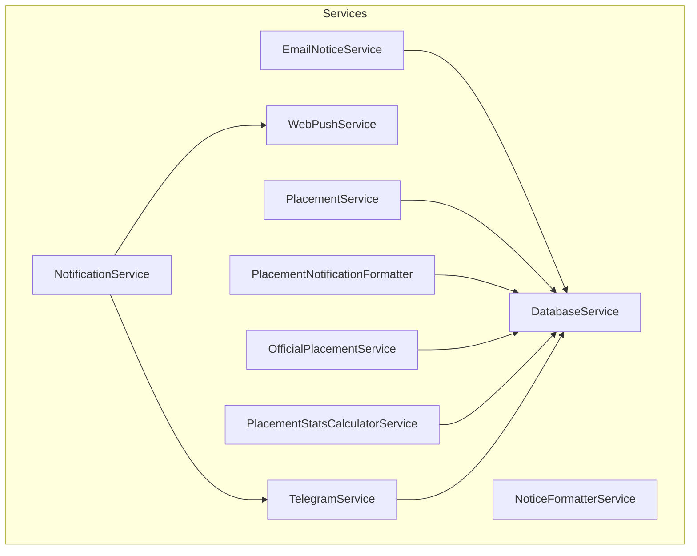
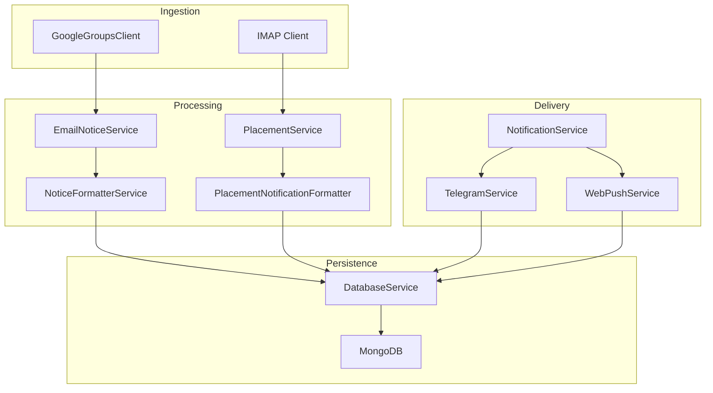
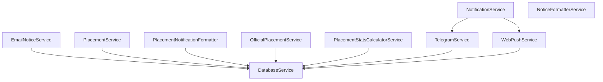

# Core Services

<cite>
**Referenced Files in This Document**
- [app/services/__init__.py](file://app/services/__init__.py)
- [app/services/database_service.py](file://app/services/database_service.py)
- [app/services/notification_service.py](file://app/services/notification_service.py)
- [app/services/telegram_service.py](file://app/services/telegram_service.py)
- [app/services/email_notice_service.py](file://app/services/email_notice_service.py)
- [app/services/placement_service.py](file://app/services/placement_service.py)
- [app/services/web_push_service.py](file://app/services/web_push_service.py)
- [app/services/notice_formatter_service.py](file://app/services/notice_formatter_service.py)
- [app/services/placement_notification_formatter.py](file://app/services/placement_notification_formatter.py)
- [app/services/official_placement_service.py](file://app/services/official_placement_service.py)
- [app/services/placement_stats_calculator_service.py](file://app/services/placement_stats_calculator_service.py)
- [app/services/admin_telegram_service.py](file://app/services/admin_telegram_service.py)
</cite>

## Table of Contents
1. [Introduction](#introduction)
2. [Project Structure](#project-structure)
3. [Core Components](#core-components)
4. [Architecture Overview](#architecture-overview)
5. [Detailed Component Analysis](#detailed-component-analysis)
6. [Dependency Analysis](#dependency-analysis)
7. [Performance Considerations](#performance-considerations)
8. [Troubleshooting Guide](#troubleshooting-guide)
9. [Conclusion](#conclusion)

## Introduction
This document describes the core service layer of the SuperSet Telegram Notification Bot. It explains the responsibilities, interfaces, and implementation patterns of the primary services: DatabaseService, NotificationService, TelegramService, EmailNoticeService, PlacementService, and WebPushService. It also covers how services depend on each other, initialization patterns, lifecycle management, error handling strategies, performance considerations, public APIs, configuration requirements, and integration points with external systems.

## Project Structure
The services are organized under app/services and expose a cohesive API surface for ingestion, processing, formatting, and delivery of notifications and placement data. The module exports a curated set of services for consumption by higher-level components.

**Diagram sources**
- [app/services/__init__.py](file://app/services/__init__.py#L1-L23)
- [app/services/database_service.py](file://app/services/database_service.py#L16-L795)
- [app/services/notification_service.py](file://app/services/notification_service.py#L13-L237)
- [app/services/telegram_service.py](file://app/services/telegram_service.py#L20-L351)
- [app/services/email_notice_service.py](file://app/services/email_notice_service.py#L335-L1155)
- [app/services/placement_service.py](file://app/services/placement_service.py#L419-L1176)
- [app/services/web_push_service.py](file://app/services/web_push_service.py#L27-L242)
- [app/services/notice_formatter_service.py](file://app/services/notice_formatter_service.py#L48-L866)
- [app/services/placement_notification_formatter.py](file://app/services/placement_notification_formatter.py#L102-L380)
- [app/services/official_placement_service.py](file://app/services/official_placement_service.py#L81-L459)
- [app/services/placement_stats_calculator_service.py](file://app/services/placement_stats_calculator_service.py#L354-L1034)

**Section sources**
- [app/services/__init__.py](file://app/services/__init__.py#L1-L23)

## Core Components
- DatabaseService: Central persistence layer for notices, jobs, placement offers, users, and policies. Provides CRUD and aggregation helpers for MongoDB collections.
- NotificationService: Orchestrates multi-channel delivery (Telegram, Web Push) and broadcasts unsent notices.
- TelegramService: Implements Telegram-specific messaging, formatting, and broadcasting to users.
- WebPushService: Implements browser push notifications using VAPID with graceful degradation when dependencies are missing.
- EmailNoticeService: Processes non-placement notices from Google Groups using a LangGraph pipeline with LLM-based classification and extraction.
- PlacementService: Processes placement offers from emails using a LangGraph pipeline with keyword-based classification, LLM extraction, validation, and privacy sanitization.
- NoticeFormatterService: Formats notices into Telegram-ready messages using LLM classification, fuzzy matching, and structured extraction.
- PlacementNotificationFormatter: Converts placement events into notice documents for storage and delivery.
- OfficialPlacementService: Scrapes official placement data from the JIIT website and persists it to MongoDB.
- PlacementStatsCalculatorService: Computes placement statistics from stored offers with filtering and branch/company breakdowns.

**Section sources**
- [app/services/database_service.py](file://app/services/database_service.py#L16-L795)
- [app/services/notification_service.py](file://app/services/notification_service.py#L13-L237)
- [app/services/telegram_service.py](file://app/services/telegram_service.py#L20-L351)
- [app/services/web_push_service.py](file://app/services/web_push_service.py#L27-L242)
- [app/services/email_notice_service.py](file://app/services/email_notice_service.py#L335-L1155)
- [app/services/placement_service.py](file://app/services/placement_service.py#L419-L1176)
- [app/services/notice_formatter_service.py](file://app/services/notice_formatter_service.py#L48-L866)
- [app/services/placement_notification_formatter.py](file://app/services/placement_notification_formatter.py#L102-L380)
- [app/services/official_placement_service.py](file://app/services/official_placement_service.py#L81-L459)
- [app/services/placement_stats_calculator_service.py](file://app/services/placement_stats_calculator_service.py#L354-L1034)

## Architecture Overview
The service layer follows a dependency-injection style with clear separation of concerns:
- Data access is encapsulated in DatabaseService.
- Delivery orchestration is handled by NotificationService, which delegates to channel-specific services.
- Channel services (TelegramService, WebPushService) implement a common interface conceptually and are wired into NotificationService.
- LLM-driven pipelines live in EmailNoticeService and PlacementService, producing structured data consumed by downstream services.
- Formatting services transform raw data into Telegram-friendly messages.
- Scraping and statistics services integrate with persistence via DatabaseService.

**Diagram sources**
- [app/services/email_notice_service.py](file://app/services/email_notice_service.py#L335-L1155)
- [app/services/placement_service.py](file://app/services/placement_service.py#L419-L1176)
- [app/services/notice_formatter_service.py](file://app/services/notice_formatter_service.py#L48-L866)
- [app/services/placement_notification_formatter.py](file://app/services/placement_notification_formatter.py#L102-L380)
- [app/services/database_service.py](file://app/services/database_service.py#L16-L795)
- [app/services/notification_service.py](file://app/services/notification_service.py#L13-L237)
- [app/services/telegram_service.py](file://app/services/telegram_service.py#L20-L351)
- [app/services/web_push_service.py](file://app/services/web_push_service.py#L27-L242)

## Detailed Component Analysis

### DatabaseService
Responsibilities:
- Manages MongoDB collections for notices, jobs, placement offers, users, and policies.
- Provides CRUD operations, existence checks, and bulk operations with deduplication and merging logic.
- Computes statistics for notices and placement offers.
- Handles user lifecycle (add/reactivate/deactivate) and policy upserts.

Implementation highlights:
- Delegates to DBClient for collection access and connection lifecycle.
- Uses structured documents with consistent fields (e.g., createdAt, updatedAt, saved_at).
- Implements merge logic for placement offers to track new students and emit events.
- Provides serialization helpers for MongoDB ObjectId handling.

Public APIs:
- Notice operations: notice_exists, get_all_notice_ids, save_notice, get_notice_by_id, get_unsent_notices, mark_as_sent, get_all_notices, get_notice_stats.
- Job operations: structured_job_exists, get_all_job_ids, upsert_structured_job, get_all_jobs.
- Placement offers: save_placement_offers (with event emission), get_all_offers, get_placement_stats, save_official_placement_data.
- Users: add_user, deactivate_user, get_active_users, get_all_users, get_user_by_id, get_users_stats.
- Policies: get_policy_by_year, upsert_policy, get_all_policies.

Lifecycle and error handling:
- Initializes with DBClient and logs initialization.
- Wraps operations in try/catch with safe_print logging and returns safe defaults on failure.
- Exposes close_connection for cleanup.

Performance considerations:
- Uses aggregation pipelines for statistics.
- Applies sorting and limits for pagination.
- Merge logic for offers minimizes duplicate writes.

**Section sources**
- [app/services/database_service.py](file://app/services/database_service.py#L16-L795)

### NotificationService
Responsibilities:
- Aggregates multiple notification channels and orchestrates broadcasts.
- Sends unsent notices to Telegram and/or Web Push channels.
- Supports dynamic channel addition and per-channel broadcasting.

Implementation highlights:
- Accepts a list of channel objects and a DatabaseService instance.
- Iterates through channels and routes messages by channel_name.
- Broadcasts to all users via channel-specific methods and marks notices as sent upon success.

Public APIs:
- add_channel(channel): Adds a channel dynamically.
- send_to_channel(message, channel_name, **kwargs): Sends to a specific channel.
- broadcast(message, channels=None, **kwargs): Broadcasts to specified channels.
- send_unsent_notices(telegram=True, web=False): Sends pending notices to target channels and marks as sent.
- send_new_posts_to_all_users(telegram=True, web=False): Main entry point for scheduled jobs.

Lifecycle and error handling:
- Logs channel names on initialization.
- Catches and logs exceptions per channel to prevent partial failures from halting the pipeline.
- Returns structured results per channel.

**Section sources**
- [app/services/notification_service.py](file://app/services/notification_service.py#L13-L237)

### TelegramService
Responsibilities:
- Implements Telegram-specific messaging and broadcasting.
- Handles message formatting (MarkdownV2 and HTML), long message splitting, and rate limiting.
- Integrates with DatabaseService for user lookup and broadcasting.

Implementation highlights:
- Uses TelegramClient for HTTP interactions.
- Provides channel_name property for compatibility with NotificationService.
- Implements test_connection, send_message, send_to_user, broadcast_to_all_users, and HTML-specific send methods.
- Includes robust message splitting and fallback mechanisms.

Public APIs:
- test_connection(): Validates bot configuration.
- send_message(message, parse_mode="HTML", **kwargs): Sends to default chat.
- send_to_user(user_id, message, parse_mode="HTML", **kwargs): Sends to a specific user.
- broadcast_to_all_users(message, parse_mode="HTML", **kwargs): Broadcasts to all active users.
- send_message_html(message): Convenience for HTML-only messages.
- split_long_message(message, max_length=4000): Splits long messages.
- convert_markdown_to_telegram(text), convert_markdown_to_html(text), escape_html(text), escape_markdown_v2(text).

Lifecycle and error handling:
- Initializes TelegramClient with bot token and chat ID from environment if not provided.
- Retries without formatting on failures.
- Applies small delays between sends to respect rate limits.

**Section sources**
- [app/services/telegram_service.py](file://app/services/telegram_service.py#L20-L351)

### WebPushService
Responsibilities:
- Implements browser push notifications using VAPID.
- Manages subscriptions via DatabaseService and gracefully degrades if pywebpush is unavailable.

Implementation highlights:
- Uses pywebpush with VAPID claims for authentication.
- Provides send_message, send_to_user, and broadcast_to_all_users.
- Tracks enabled state based on availability of pywebpush and VAPID keys.
- Handles WebPushException to remove invalid/expired subscriptions.

Public APIs:
- send_message(message, **kwargs): Broadcasts to all subscriptions.
- send_to_user(user_id, message, **kwargs): Sends to a user’s subscriptions.
- broadcast_to_all_users(message, **kwargs): Broadcasts to all users with subscriptions.
- save_subscription(user_id, subscription), remove_subscription(user_id, endpoint): Subscription management hooks.
- get_public_key(): Returns VAPID public key for clients.

Lifecycle and error handling:
- Checks availability of pywebpush and VAPID configuration at initialization.
- Logs warnings and disables functionality when not configured.
- Removes expired subscriptions on receiving 404/410 responses.

**Section sources**
- [app/services/web_push_service.py](file://app/services/web_push_service.py#L27-L242)

### EmailNoticeService
Responsibilities:
- Processes non-placement notices from Google Groups emails.
- Uses a LangGraph pipeline with LLM classification and extraction.
- Produces NoticeDocument objects and saves them to the database.

Implementation highlights:
- Defines Pydantic models for extracted notices and documents.
- Builds a StateGraph with nodes for classification, extraction, validation, and display.
- Uses ChatGoogleGenerativeAI with a custom prompt to extract structured data.
- Handles policy updates separately and forwards them to PlacementPolicyService.

Public APIs:
- process_emails(mark_as_read=True): Processes unread emails sequentially and saves valid notices.
- process_single_email(email_data): Runs the pipeline for a single email and returns NoticeDocument or None.
- _create_notice_document(extracted_notice, email_data): Converts extracted data into a NoticeDocument.

Lifecycle and error handling:
- Fetches unread IDs and processes each email with retry and marking semantics.
- Logs and continues on errors to avoid blocking the pipeline.
- Validates extracted data and retries up to a configured limit.

**Section sources**
- [app/services/email_notice_service.py](file://app/services/email_notice_service.py#L335-L1155)

### PlacementService
Responsibilities:
- Processes placement offer emails using a LangGraph pipeline.
- Implements keyword-based classification, LLM extraction, validation, privacy sanitization, and enrichment.
- Emits events for new offers and updates for downstream notice creation.

Implementation highlights:
- Defines Pydantic models for students, roles, and offers.
- Uses a classification graph with keyword scoring and confidence thresholds.
- Applies privacy sanitization to remove headers and forwarded markers.
- Emits events with newly added students to trigger notices.

Public APIs:
- _build_graph(): Constructs the LangGraph workflow.
- _classify_email(state): Keyword-based classification.
- _extract_info(state): LLM extraction with retry logic.
- _validate_and_enhance(state): Validates and enhances extracted data.
- _sanitize_privacy(state): Removes sensitive information.
- _display_results(state): Displays final results.
- scrape_and_save(): Main entry point to process and persist offers.

Lifecycle and error handling:
- Uses retry logic for LLM extraction failures.
- Handles empty responses and validation errors gracefully.
- Sanitizes content to protect privacy.

**Section sources**
- [app/services/placement_service.py](file://app/services/placement_service.py#L419-L1176)

### NoticeFormatterService
Responsibilities:
- Formats notices into Telegram-ready messages using LLM classification, fuzzy matching, and structured extraction.
- Normalizes dates, packages, and HTML content for readability.

Implementation highlights:
- Uses LangGraph to extract text, classify posts, match jobs, enrich matched jobs, extract info, and format messages.
- Implements helpers for pretty-printing, package formatting, and HTML breakdown conversion.
- Supports job enrichment callbacks for richer content.

Public APIs:
- format_notice(notice, jobs, job_enricher=None): Runs the graph and returns formatted message.

Lifecycle and error handling:
- Ensures string content from LLM responses.
- Handles missing or malformed data with safe defaults.

**Section sources**
- [app/services/notice_formatter_service.py](file://app/services/notice_formatter_service.py#L48-L866)

### PlacementNotificationFormatter
Responsibilities:
- Transforms placement events into NoticeDocument objects for storage and delivery.
- Provides formatting for new offers and updates with role breakdowns and counts.

Implementation highlights:
- Defines Pydantic models for role data, student data, offer data, and notice documents.
- Calculates role breakdowns and counts for concise summaries.
- Supports both new offer and update notices.

Public APIs:
- format_new_offer_notice(event): Creates a notice for new offers.
- format_update_offer_notice(event): Creates a notice for updates.
- format_event(event): Dispatches to appropriate formatter.
- process_events(events, save_to_db=True): Processes multiple events and optionally saves to DB.

Lifecycle and error handling:
- Logs and continues on processing errors.
- Uses DatabaseService to save notices.

**Section sources**
- [app/services/placement_notification_formatter.py](file://app/services/placement_notification_formatter.py#L102-L380)

### OfficialPlacementService
Responsibilities:
- Scrapes official placement data from the JIIT website.
- Parses HTML to extract batch details, pointers, and package distributions.
- Saves data to MongoDB via DatabaseService.

Implementation highlights:
- Uses requests and BeautifulSoup to fetch and parse HTML.
- Extracts recruiter logos, batch details, and package distributions.
- Generates OfficialPlacementData and persists it to MongoDB.

Public APIs:
- get_html_content(url=None): Fetches HTML content.
- extract_batch_details(container_element, context_label="Unknown"): Extracts pointers and distribution table.
- parse_all_batches_data(html_content): Parses all batches and returns OfficialPlacementData.
- scrape(): Executes scraping and returns data.
- scrape_and_save(): Scrapes and saves to database.

Lifecycle and error handling:
- Handles timeouts, connection errors, and HTTP errors with detailed logging.
- Returns None on failure and logs critical errors.

**Section sources**
- [app/services/official_placement_service.py](file://app/services/official_placement_service.py#L81-L459)

### PlacementStatsCalculatorService
Responsibilities:
- Computes comprehensive placement statistics from stored offers.
- Supports filtering by company, role, location, and package range.
- Provides branch-wise and company-wise breakdowns with placement percentages.

Implementation highlights:
- Defines data models for branch ranges, branch stats, and company stats.
- Implements enrollment-to-branch resolution with configurable ranges.
- Calculates package statistics (average, median, highest) and placement percentages.
- Supports filtering and extraction of available filter options.

Public APIs:
- calculate_all_stats(placements=None): Computes overall and detailed statistics.
- _flatten_students(placements): Flattens offers into student records.
- _filter_students(students, ...): Applies filters for branches, companies, roles, locations, package ranges, and search queries.
- _calculate_package_stats(students): Computes package metrics.
- _calculate_branch_stats(students): Computes branch-wise stats.
- _calculate_company_stats(students): Computes company-wise stats.
- _extract_filter_options(placements): Extracts filter options.

Lifecycle and error handling:
- Falls back to fetching placements from DatabaseService if not provided.
- Returns empty stats when no data is available.

**Section sources**
- [app/services/placement_stats_calculator_service.py](file://app/services/placement_stats_calculator_service.py#L354-L1034)

## Dependency Analysis
Service dependencies and coupling:
- DatabaseService is a shared dependency across EmailNoticeService, PlacementService, PlacementNotificationFormatter, OfficialPlacementService, and PlacementStatsCalculatorService for persistence operations.
- NotificationService depends on TelegramService and WebPushService for delivery and on DatabaseService for fetching unsent notices.
- EmailNoticeService and PlacementService both depend on LLM providers and Google Groups/IMAP clients respectively.
- NoticeFormatterService and PlacementNotificationFormatter depend on DatabaseService for job data and notice persistence.
- WebPushService depends on DatabaseService for user subscription management.

**Diagram sources**
- [app/services/database_service.py](file://app/services/database_service.py#L16-L795)
- [app/services/notification_service.py](file://app/services/notification_service.py#L13-L237)
- [app/services/telegram_service.py](file://app/services/telegram_service.py#L20-L351)
- [app/services/web_push_service.py](file://app/services/web_push_service.py#L27-L242)
- [app/services/email_notice_service.py](file://app/services/email_notice_service.py#L335-L1155)
- [app/services/placement_service.py](file://app/services/placement_service.py#L419-L1176)
- [app/services/notice_formatter_service.py](file://app/services/notice_formatter_service.py#L48-L866)
- [app/services/placement_notification_formatter.py](file://app/services/placement_notification_formatter.py#L102-L380)
- [app/services/official_placement_service.py](file://app/services/official_placement_service.py#L81-L459)
- [app/services/placement_stats_calculator_service.py](file://app/services/placement_stats_calculator_service.py#L354-L1034)

**Section sources**
- [app/services/__init__.py](file://app/services/__init__.py#L1-L23)

## Performance Considerations
- DatabaseService:
  - Uses aggregation pipelines for statistics to minimize client-side computation.
  - Applies sorting and limits for pagination to control memory usage.
  - Merge logic for placement offers reduces duplicate writes.
- NotificationService:
  - Iterates through channels and users; consider batching and rate limiting at the channel level.
  - Broadcasting to users applies small delays to respect rate limits.
- TelegramService:
  - Long messages are split and sent sequentially with short delays to avoid rate limits.
  - Fallback to plain text on formatting failures.
- WebPushService:
  - Graceful degradation when pywebpush is unavailable.
  - Removes invalid/expired subscriptions on receiving 404/410 responses.
- EmailNoticeService and PlacementService:
  - Retry logic for LLM extraction prevents transient failures from blocking processing.
  - Structured prompts reduce ambiguity and improve extraction quality.
- PlacementStatsCalculatorService:
  - Precomputes branch ranges for efficient enrollment-to-branch resolution.
  - Calculates package statistics in a single pass per metric.

[No sources needed since this section provides general guidance]

## Troubleshooting Guide
Common issues and resolutions:
- Telegram bot configuration errors:
  - Symptoms: Messages fail to send or connection tests fail.
  - Resolution: Verify bot token and chat ID environment variables; use test_connection to validate.
- Web push failures:
  - Symptoms: pywebpush import errors or 404/410 responses.
  - Resolution: Install pywebpush; configure VAPID keys; expired subscriptions are removed automatically.
- LLM extraction failures:
  - Symptoms: Empty responses or validation errors.
  - Resolution: Review prompts and retry logic; ensure Google API key is configured.
- Database connectivity:
  - Symptoms: Collection not initialized or operations failing.
  - Resolution: Confirm DBClient initialization and connection lifecycle; check logs for safe_print messages.
- Rate limiting:
  - Symptoms: Telegram API throttling.
  - Resolution: Respect built-in delays between sends; consider external rate limiting if needed.

**Section sources**
- [app/services/telegram_service.py](file://app/services/telegram_service.py#L58-L122)
- [app/services/web_push_service.py](file://app/services/web_push_service.py#L62-L194)
- [app/services/email_notice_service.py](file://app/services/email_notice_service.py#L553-L624)
- [app/services/placement_service.py](file://app/services/placement_service.py#L663-L704)
- [app/services/database_service.py](file://app/services/database_service.py#L47-L51)

## Conclusion
The core service layer provides a robust, modular foundation for ingesting, processing, formatting, and delivering notifications and placement data. It leverages dependency injection, clear separation of concerns, and resilient error handling to maintain reliability. The integration of LLM pipelines ensures high-quality extraction and formatting, while database-centric design supports scalability and observability.