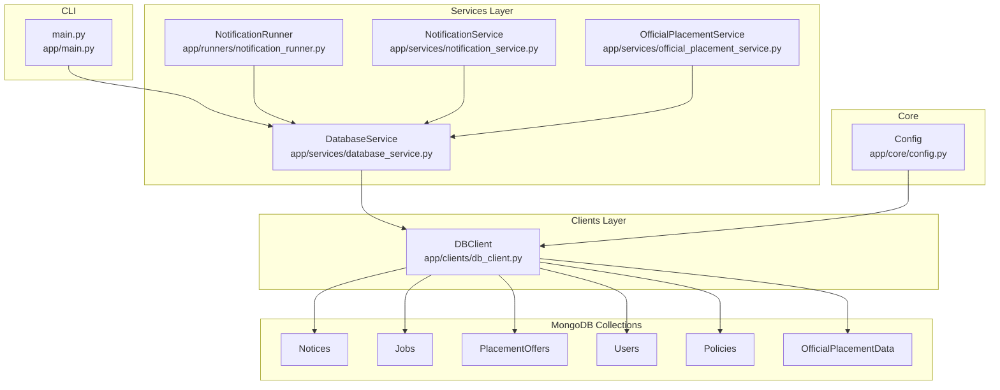
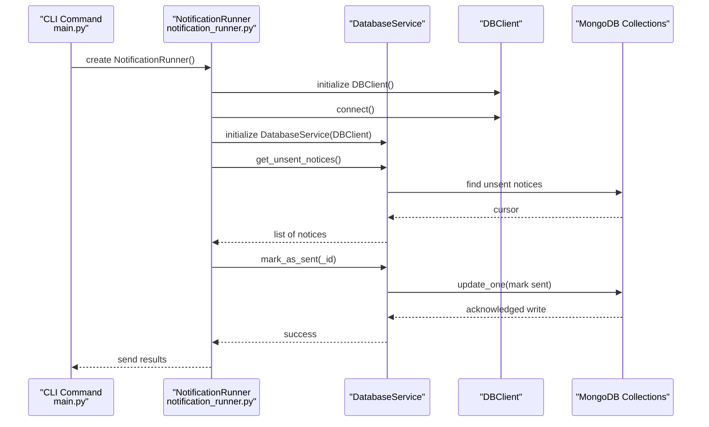
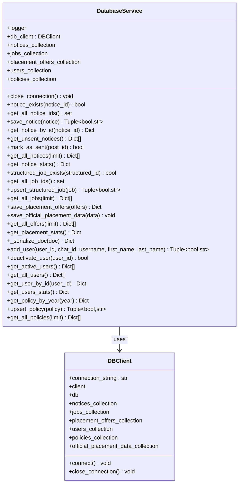
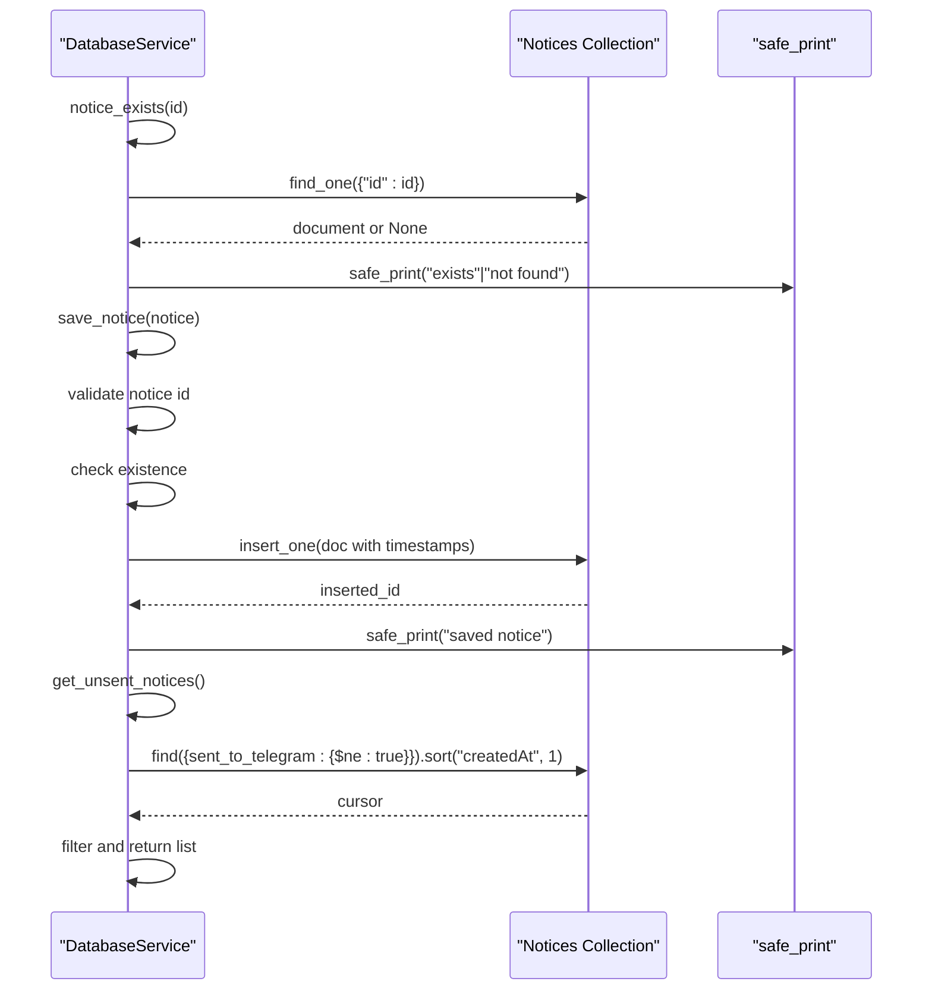
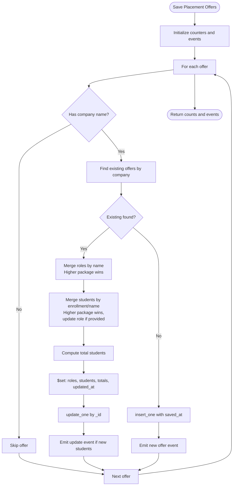
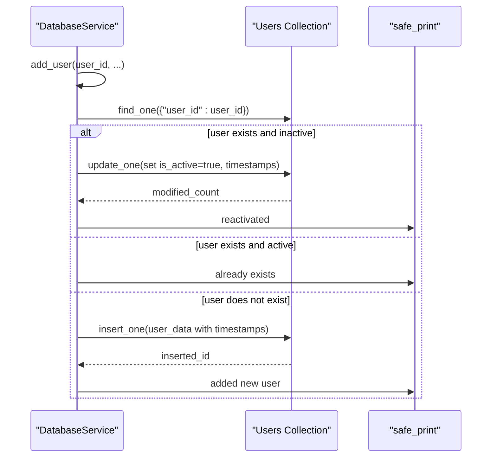
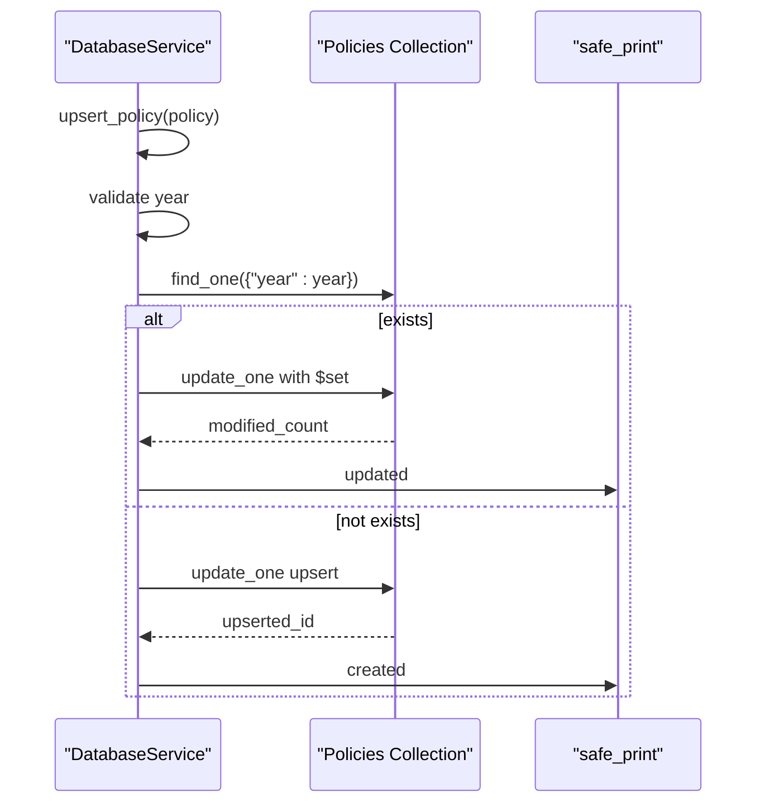
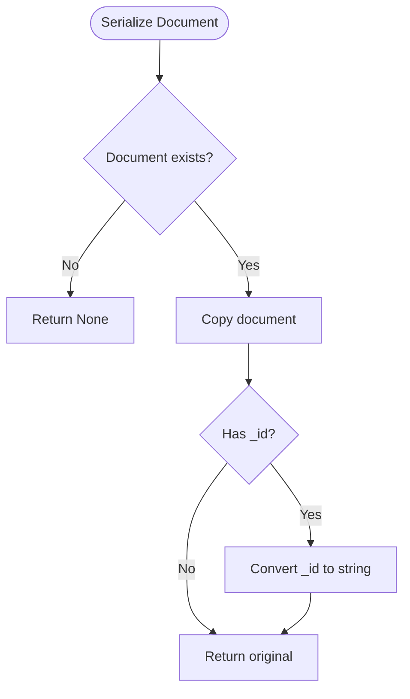
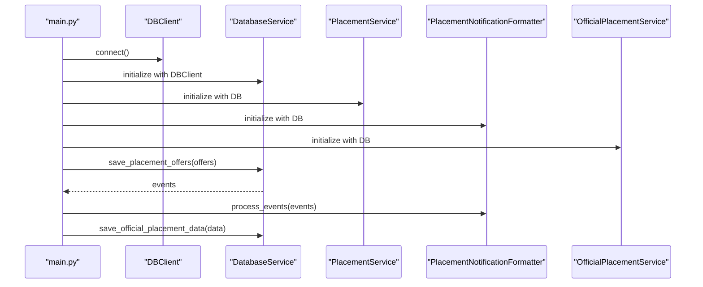
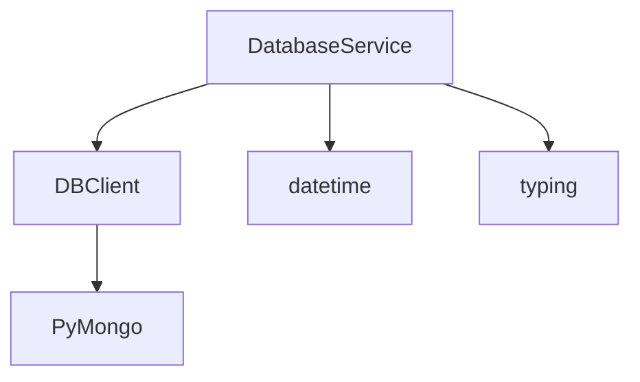

# Database Service

<cite>
**Referenced Files in This Document**
- [database_service.py](file://app/services/database_service.py)
- [db_client.py](file://app/clients/db_client.py)
- [config.py](file://app/core/config.py)
- [main.py](file://app/main.py)
- [DATABASE.md](file://docs/DATABASE.md)
- [notification_runner.py](file://app/runners/notification_runner.py)
- [notification_service.py](file://app/services/notification_service.py)
- [official_placement_service.py](file://app/services/official_placement_service.py)
</cite>

## Table of Contents
1. [Introduction](#introduction)
2. [Project Structure](#project-structure)
3. [Core Components](#core-components)
4. [Architecture Overview](#architecture-overview)
5. [Detailed Component Analysis](#detailed-component-analysis)
6. [Dependency Analysis](#dependency-analysis)
7. [Performance Considerations](#performance-considerations)
8. [Troubleshooting Guide](#troubleshooting-guide)
9. [Conclusion](#conclusion)
10. [Appendices](#appendices)

## Introduction
This document provides comprehensive documentation for the DatabaseService component, which serves as the central MongoDB abstraction layer in the SuperSet Telegram Notification Bot. The service implements a protocol-like interface for MongoDB operations and encapsulates all data persistence concerns for notices, jobs, placement offers, users, and policies. It provides a clean separation between data access logic and business services, enabling dependency injection, testability, and modular operation across the system.

Key responsibilities include:
- Centralized MongoDB access via DBClient
- Notice lifecycle management (existence checks, insertion, retrieval, marking as sent)
- Structured job upsert operations
- Complex merge logic for placement offers with role merging and package comparisons
- User management (add/reactivate/deactivate)
- Policy operations (upsert by year)
- Serialization of ObjectId fields for JSON transport
- Error handling and logging

## Project Structure
The DatabaseService resides in the services layer and collaborates with the DBClient for raw MongoDB connectivity. It integrates with other system components through dependency injection, enabling flexible orchestration in both CLI commands and runtime services.



**Diagram sources**
- [database_service.py](file://app/services/database_service.py#L16-L51)
- [db_client.py](file://app/clients/db_client.py#L16-L104)
- [config.py](file://app/core/config.py#L18-L186)
- [main.py](file://app/main.py#L117-L148)
- [notification_runner.py](file://app/runners/notification_runner.py#L21-L59)
- [notification_service.py](file://app/services/notification_service.py#L13-L41)
- [official_placement_service.py](file://app/services/official_placement_service.py#L80-L105)

**Section sources**
- [database_service.py](file://app/services/database_service.py#L16-L51)
- [db_client.py](file://app/clients/db_client.py#L16-L104)
- [config.py](file://app/core/config.py#L18-L186)
- [main.py](file://app/main.py#L117-L148)

## Core Components
- DatabaseService: Implements MongoDB operations for notices, jobs, placement offers, users, and policies. Provides CRUD methods, merge logic for placement offers, and serialization helpers.
- DBClient: Handles MongoDB connection establishment, collection initialization, and connection lifecycle.
- Configuration: Centralized settings management including MongoDB connection string and logging configuration.

Key capabilities:
- Notice management: existence checks, insertions, retrieval, unsent notice enumeration, and marking as sent.
- Structured job upsert: merges incoming job data with existing records.
- Placement offers: bulk save with sophisticated merge logic for roles and student packages, emitting events for downstream processing.
- User management: add/reactivate/deactivate users with soft delete semantics.
- Policy operations: upsert by year with change detection.
- Serialization: converts ObjectId fields to strings for JSON transport.

**Section sources**
- [database_service.py](file://app/services/database_service.py#L16-L51)
- [db_client.py](file://app/clients/db_client.py#L16-L104)
- [config.py](file://app/core/config.py#L18-L186)

## Architecture Overview
The DatabaseService follows a layered architecture:
- Clients layer: DBClient manages raw MongoDB connectivity and exposes typed collection properties.
- Services layer: DatabaseService wraps DBClient and adds business logic for CRUD operations, merge algorithms, and serialization.
- Orchestration layer: CLI commands and runners instantiate DBClient and DatabaseService, passing them to dependent services.



**Diagram sources**
- [main.py](file://app/main.py#L117-L148)
- [notification_runner.py](file://app/runners/notification_runner.py#L21-L77)
- [database_service.py](file://app/services/database_service.py#L106-L147)
- [db_client.py](file://app/clients/db_client.py#L42-L79)

## Detailed Component Analysis

### DatabaseService Class
The DatabaseService class encapsulates all MongoDB operations and acts as the primary data access object for notices, jobs, placement offers, users, and policies.



**Diagram sources**
- [database_service.py](file://app/services/database_service.py#L16-L795)
- [db_client.py](file://app/clients/db_client.py#L16-L104)

**Section sources**
- [database_service.py](file://app/services/database_service.py#L16-L795)
- [db_client.py](file://app/clients/db_client.py#L16-L104)

### Notice Operations
The notice subsystem provides lifecycle management for notifications:
- Existence checks by unique notice id
- Bulk retrieval of notice ids for efficient lookups
- Insertion with automatic timestamps and sent flags
- Retrieval by id and chronological enumeration of unsent notices
- Marking as sent with timestamps



**Diagram sources**
- [database_service.py](file://app/services/database_service.py#L56-L160)

**Section sources**
- [database_service.py](file://app/services/database_service.py#L56-L160)

### Structured Job Operations
Structured job upsert maintains normalized job listings:
- Existence checks by structured id
- Upsert logic that merges incoming data with existing records
- Timestamp management for created/updated records

```mermaid
flowchart TD
Start([Upsert Structured Job]) --> Validate["Validate job id"]
Validate --> Exists{"Existing record?"}
Exists --> |Yes| Merge["Merge incoming with existing"]
Merge --> Replace["replace_one with updated_at"]
Exists --> |No| Insert["insert_one with saved_at"]
Replace --> Done([Success])
Insert --> Done
Validate --> |No| Error([Return False, "Missing id"])
```

**Diagram sources**
- [database_service.py](file://app/services/database_service.py#L205-L257)

**Section sources**
- [database_service.py](file://app/services/database_service.py#L205-L257)

### Placement Offer Processing with Merge Logic
The placement offers subsystem implements a complex merge algorithm designed to:
- Group offers by company name
- Merge roles with package comparison (higher package wins)
- Merge students with package comparison and role updates
- Track newly added students for event emission
- Emit events for new offers and updated offers



**Diagram sources**
- [database_service.py](file://app/services/database_service.py#L274-L441)

**Section sources**
- [database_service.py](file://app/services/database_service.py#L274-L441)

### User Management
User management provides soft-deletion semantics:
- Add or reactivate users with activation flag
- Deactivate users (soft delete)
- Retrieve active users and user statistics



**Diagram sources**
- [database_service.py](file://app/services/database_service.py#L616-L668)

**Section sources**
- [database_service.py](file://app/services/database_service.py#L616-L668)

### Policy Operations
Policy operations manage official policy documents by year:
- Upsert by year with upsert semantics
- Change detection and logging
- Retrieval of published policies



**Diagram sources**
- [database_service.py](file://app/services/database_service.py#L741-L777)

**Section sources**
- [database_service.py](file://app/services/database_service.py#L741-L777)

### Serialization Mechanisms for MongoDB ObjectId
The DatabaseService provides a serialization helper to convert ObjectId fields to strings for JSON transport:
- Converts top-level _id field to string
- Can be extended for nested ObjectId fields if needed



**Diagram sources**
- [database_service.py](file://app/services/database_service.py#L602-L610)

**Section sources**
- [database_service.py](file://app/services/database_service.py#L602-L610)

### Integration Patterns with Other System Components
DatabaseService integrates with other components through dependency injection:
- CLI commands: main.py orchestrates DBClient and DatabaseService creation for email processing and official data updates
- NotificationRunner: creates its own DBClient/DatabaseService instance for sending unsent notices
- NotificationService: relies on DatabaseService for fetching unsent notices and marking them as sent
- OfficialPlacementService: uses DatabaseService to persist scraped official placement data



**Diagram sources**
- [main.py](file://app/main.py#L117-L148)
- [official_placement_service.py](file://app/services/official_placement_service.py#L406-L421)

**Section sources**
- [main.py](file://app/main.py#L117-L148)
- [notification_runner.py](file://app/runners/notification_runner.py#L21-L77)
- [notification_service.py](file://app/services/notification_service.py#L93-L167)
- [official_placement_service.py](file://app/services/official_placement_service.py#L406-L421)

## Dependency Analysis
The DatabaseService exhibits low coupling and high cohesion:
- Coupling: Minimal direct coupling to DBClient; all MongoDB operations delegated to DBClient collections
- Cohesion: High cohesion around data access patterns and business logic for each entity type
- External dependencies: PyMongo for MongoDB connectivity, datetime for timestamps, typing for type hints



**Diagram sources**
- [database_service.py](file://app/services/database_service.py#L8-L13)
- [db_client.py](file://app/clients/db_client.py#L11-L13)

**Section sources**
- [database_service.py](file://app/services/database_service.py#L8-L13)
- [db_client.py](file://app/clients/db_client.py#L11-L13)

## Performance Considerations
- Connection pooling: DBClient uses PyMongo’s built-in connection pooling; ensure appropriate pool sizing for production workloads
- Index usage: The database schema defines indexes for frequent query patterns (e.g., notices by sent flags, jobs by deadlines)
- Query optimization: Prefer targeted queries with projections and limits; avoid loading entire collections
- Batch operations: Use bulk operations for large-scale updates (e.g., marking notices as sent)
- Serialization overhead: ObjectId conversion is lightweight; avoid unnecessary conversions in hot paths
- Logging impact: safe_print is used for operational logging; consider structured logging for production monitoring

[No sources needed since this section provides general guidance]

## Troubleshooting Guide
Common issues and resolutions:
- Connection failures: Verify MONGO_CONNECTION_STR environment variable and network connectivity
- Missing collections: Ensure database initialization occurs before accessing collections
- Duplicate key errors: Use upsert operations for notices/jobs/policies; placement offers merge prevents duplicates
- Serialization errors: Use _serialize_doc for ObjectId fields when returning JSON responses
- Performance bottlenecks: Review query plans and add missing indexes as per DATABASE.md

**Section sources**
- [db_client.py](file://app/clients/db_client.py#L42-L79)
- [DATABASE.md](file://docs/DATABASE.md#L425-L458)

## Conclusion
DatabaseService provides a robust, dependency-injected abstraction over MongoDB operations, enabling clean separation of concerns and facilitating integration across the system. Its comprehensive coverage of CRUD operations, sophisticated merge logic for placement offers, and serialization mechanisms make it a cornerstone of the data layer. Proper configuration, indexing, and logging practices ensure reliable operation in production environments.

[No sources needed since this section summarizes without analyzing specific files]

## Appendices

### Practical Examples

#### Service Initialization
- CLI-driven initialization: main.py creates DBClient, connects, and passes it to DatabaseService for email processing and official data updates
- Runner-driven initialization: NotificationRunner creates its own DBClient/DatabaseService instance for sending unsent notices

**Section sources**
- [main.py](file://app/main.py#L117-L148)
- [notification_runner.py](file://app/runners/notification_runner.py#L44-L59)

#### Common Operations
- Notice management: existence checks, insertion, retrieval, unsent enumeration, and marking as sent
- Structured job upsert: merge incoming job data with existing records
- Placement offers: bulk save with merge logic and event emission
- User management: add/reactivate/deactivate users
- Policy operations: upsert by year with change detection

**Section sources**
- [database_service.py](file://app/services/database_service.py#L56-L160)
- [database_service.py](file://app/services/database_service.py#L205-L257)
- [database_service.py](file://app/services/database_service.py#L274-L441)
- [database_service.py](file://app/services/database_service.py#L616-L668)
- [database_service.py](file://app/services/database_service.py#L741-L777)

### Database Schema Reference
The database schema defines five main collections with specific indexes and data models. Notices, Jobs, PlacementOffers, Users, and OfficialPlacementData each have tailored schemas optimized for their respective use cases.

**Section sources**
- [DATABASE.md](file://docs/DATABASE.md#L32-L424)