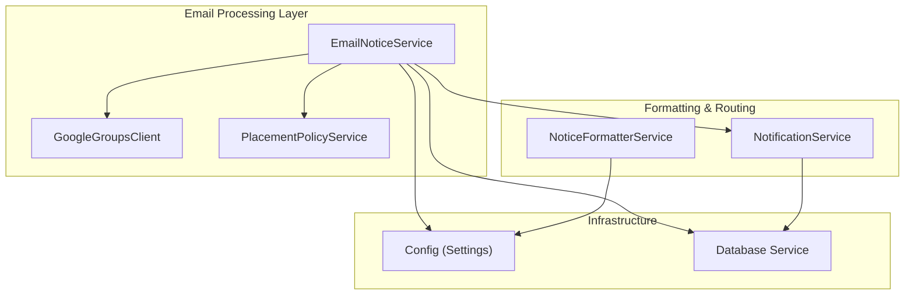
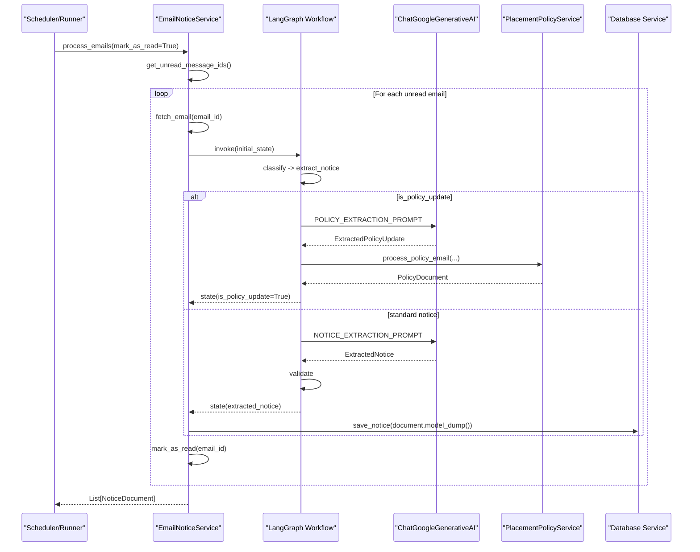
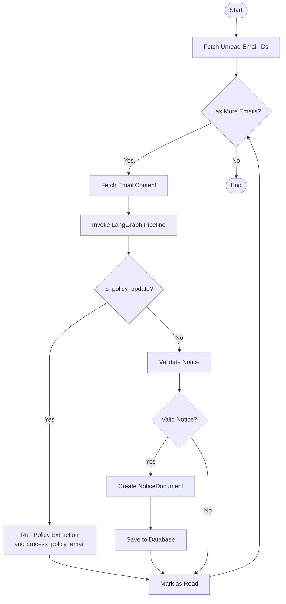
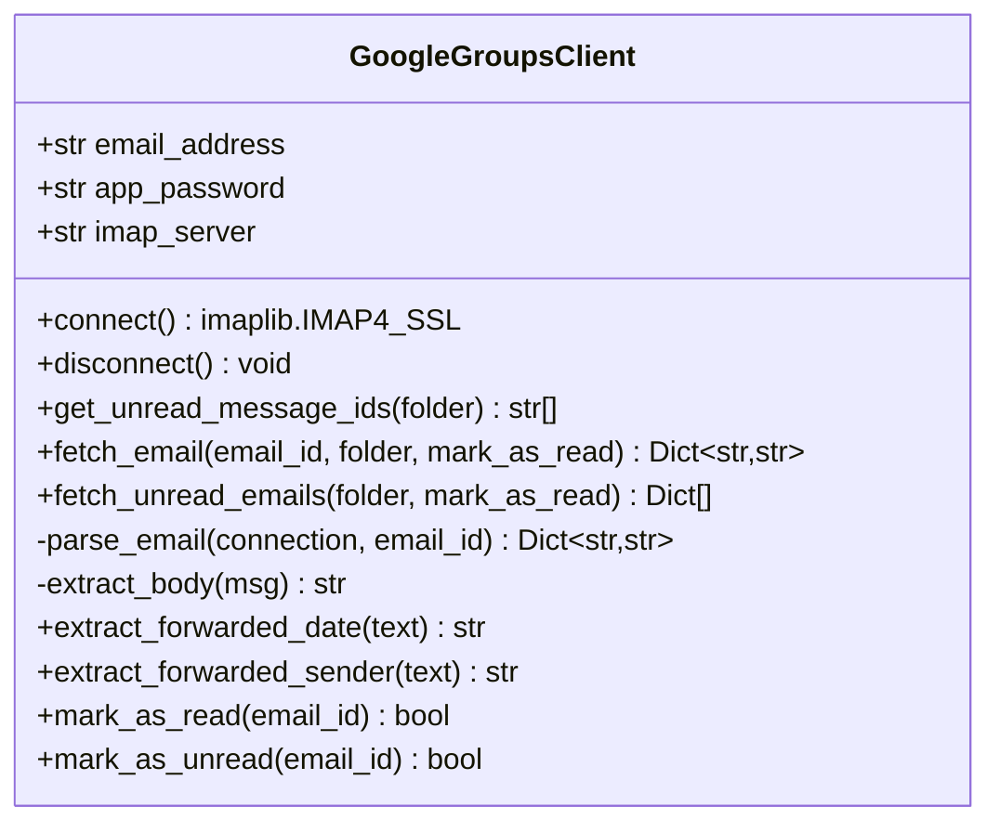
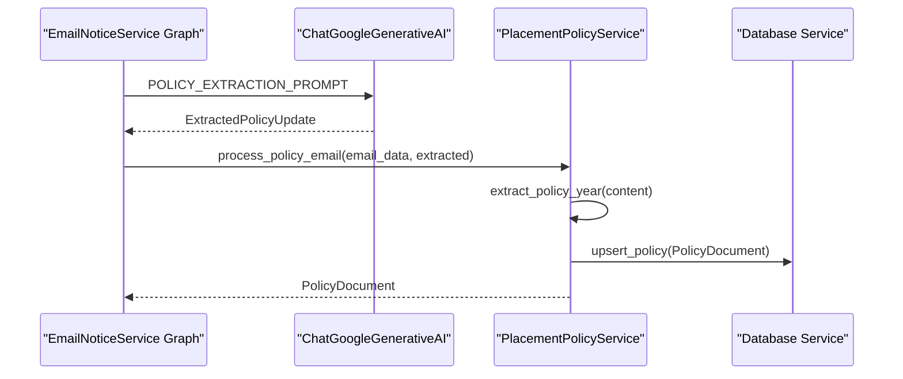
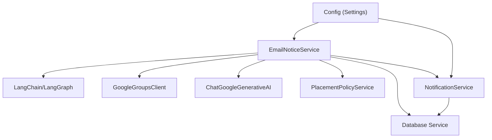

# Email Notice Service

<cite>
**Referenced Files in This Document**
- [email_notice_service.py](file://app/services/email_notice_service.py)
- [google_groups_client.py](file://app/clients/google_groups_client.py)
- [notification_service.py](file://app/services/notification_service.py)
- [placement_policy_service.py](file://app/services/placement_policy_service.py)
- [notice_formatter_service.py](file://app/services/notice_formatter_service.py)
- [config.py](file://app/core/config.py)
- [update_runner.py](file://app/runners/update_runner.py)
</cite>

## Table of Contents
1. [Introduction](#introduction)
2. [Project Structure](#project-structure)
3. [Core Components](#core-components)
4. [Architecture Overview](#architecture-overview)
5. [Detailed Component Analysis](#detailed-component-analysis)
6. [Dependency Analysis](#dependency-analysis)
7. [Performance Considerations](#performance-considerations)
8. [Troubleshooting Guide](#troubleshooting-guide)
9. [Conclusion](#conclusion)

## Introduction
This document provides comprehensive documentation for the Email Notice Service, a LangGraph-based workflow pipeline that processes non-placement notices from Google Groups emails. The service classifies incoming emails, extracts structured notice data using Google Gemini, validates the results, and stores them for downstream notification routing. It also includes advanced handling for placement policy updates, integrating with the broader notification system for distribution to Telegram and other channels.

The service focuses on general notices such as announcements, hackathons, job postings, shortlistings, updates, webinars, reminders, and internship NOCs. It leverages robust prompt engineering, retry mechanisms, and careful error handling to ensure reliable processing and integration with the rest of the notification infrastructure.

## Project Structure
The Email Notice Service resides within the application’s services layer and integrates with clients for email retrieval, database persistence, and notification dispatch. The key modules involved are:

- Email Notice Service: Orchestrates the LangGraph pipeline and manages state transitions.
- Google Groups Client: Provides IMAP-based email fetching and parsing.
- Placement Policy Service: Handles placement policy update detection and extraction.
- Notification Service: Routes processed notices to Telegram and other channels.
- Notice Formatter Service: Formats notices for display (used by the broader system).
- Configuration: Centralized settings management for API keys and environment variables.
- Update Runner: Coordinates fetching and processing of updates from external sources (complementary to email processing).

**Diagram sources**
- [email_notice_service.py](file://app/services/email_notice_service.py#L335-L392)
- [google_groups_client.py](file://app/clients/google_groups_client.py#L19-L50)
- [placement_policy_service.py](file://app/services/placement_policy_service.py#L200-L230)
- [notification_service.py](file://app/services/notification_service.py#L13-L40)
- [notice_formatter_service.py](file://app/services/notice_formatter_service.py#L48-L62)
- [config.py](file://app/core/config.py#L18-L185)

**Section sources**
- [email_notice_service.py](file://app/services/email_notice_service.py#L1-L120)
- [google_groups_client.py](file://app/clients/google_groups_client.py#L1-L50)
- [placement_policy_service.py](file://app/services/placement_policy_service.py#L1-L50)
- [notification_service.py](file://app/services/notification_service.py#L1-L40)
- [notice_formatter_service.py](file://app/services/notice_formatter_service.py#L1-L40)
- [config.py](file://app/core/config.py#L1-L50)

## Core Components
This section outlines the primary building blocks of the Email Notice Service and related components.

- Pydantic Models
  - ExtractedNotice: Represents the structured notice data extracted from emails, including fields for title, content, type, source, deadlines, links, and type-specific attributes (e.g., students, company_name, package, venue).
  - NoticeDocument: The normalized document ready for database storage, including metadata such as author, formatted_message, timestamps, and optional student lists.

- NoticeGraphState: The LangGraph state container that tracks email content, classification results, extraction outcomes, validation status, retry count, and policy update detection.

- NOTICE_EXTRACTION_PROMPT: A comprehensive prompt template guiding the LLM to classify emails and extract structured data for the supported notice types, with strict JSON output requirements and privacy safeguards.

- EmailNoticeService: The main orchestrator that builds the LangGraph workflow, connects to Google Gemini, and executes the pipeline for each email.

- GoogleGroupsClient: IMAP client responsible for fetching unread emails, parsing content, extracting forwarded sender/date, and marking emails as read.

- PlacementPolicyService: Handles detection and extraction of placement policy updates, converting raw email content into structured policy documents.

- NotificationService: Routes processed notices to Telegram and other channels, supporting unsent notice broadcasts and per-channel delivery statistics.

- NoticeFormatterService: Provides formatting logic for notices (used by the broader system), including classification, fuzzy matching, enrichment, and message formatting.

- Config: Centralized settings management for API keys, email credentials, logging, and daemon mode.

**Section sources**
- [email_notice_service.py](file://app/services/email_notice_service.py#L36-L139)
- [email_notice_service.py](file://app/services/email_notice_service.py#L147-L327)
- [email_notice_service.py](file://app/services/email_notice_service.py#L335-L392)
- [google_groups_client.py](file://app/clients/google_groups_client.py#L19-L168)
- [placement_policy_service.py](file://app/services/placement_policy_service.py#L23-L140)
- [notification_service.py](file://app/services/notification_service.py#L13-L91)
- [notice_formatter_service.py](file://app/services/notice_formatter_service.py#L28-L46)
- [config.py](file://app/core/config.py#L18-L120)

## Architecture Overview
The Email Notice Service implements a LangGraph workflow that processes each email through a series of nodes: classification, extraction, validation, and display. The workflow conditionally handles placement policy updates by invoking a specialized prompt and service.

**Diagram sources**
- [email_notice_service.py](file://app/services/email_notice_service.py#L636-L697)
- [email_notice_service.py](file://app/services/email_notice_service.py#L398-L417)
- [email_notice_service.py](file://app/services/email_notice_service.py#L435-L569)
- [email_notice_service.py](file://app/services/email_notice_service.py#L725-L738)
- [placement_policy_service.py](file://app/services/placement_policy_service.py#L541-L587)

## Detailed Component Analysis

### EmailNoticeService
The EmailNoticeService is the central orchestrator for email-based notice processing. It initializes dependencies, constructs the LangGraph pipeline, and executes the workflow for each email.

Key responsibilities:
- Initialize Google Gemini LLM, formatter service, and policy service.
- Build a StateGraph with nodes for classification, extraction, validation, and display.
- Manage state transitions and conditional edges based on classification and validation outcomes.
- Handle retry logic for extraction failures with up to two attempts.
- Convert extracted notices into NoticeDocument objects and persist them to the database.
- Detect and route placement policy updates to the PlacementPolicyService.

Processing workflow:
- Fetch unread email IDs from Google Groups.
- For each email, fetch content and run through the LangGraph pipeline.
- On success, create NoticeDocument and save to the database.
- Mark the email as read (even if not relevant) to avoid reprocessing.

**Diagram sources**
- [email_notice_service.py](file://app/services/email_notice_service.py#L636-L697)
- [email_notice_service.py](file://app/services/email_notice_service.py#L398-L417)
- [email_notice_service.py](file://app/services/email_notice_service.py#L570-L590)
- [email_notice_service.py](file://app/services/email_notice_service.py#L785-L800)

**Section sources**
- [email_notice_service.py](file://app/services/email_notice_service.py#L335-L392)
- [email_notice_service.py](file://app/services/email_notice_service.py#L398-L417)
- [email_notice_service.py](file://app/services/email_notice_service.py#L435-L569)
- [email_notice_service.py](file://app/services/email_notice_service.py#L570-L590)
- [email_notice_service.py](file://app/services/email_notice_service.py#L636-L697)
- [email_notice_service.py](file://app/services/email_notice_service.py#L785-L800)

### GoogleGroupsClient
The GoogleGroupsClient encapsulates IMAP connectivity and email retrieval for Google Groups. It supports fetching unread emails, parsing multipart messages, extracting forwarded sender and date, and marking emails as read or unread.

Key capabilities:
- Connect/disconnect to Gmail IMAP securely.
- Retrieve unread message IDs and fetch email content.
- Parse email bodies (prefer plain text), extract forwarded metadata, and normalize dates to ISO format in IST.
- Robust error handling for network and parsing failures.

**Diagram sources**
- [google_groups_client.py](file://app/clients/google_groups_client.py#L19-L168)

**Section sources**
- [google_groups_client.py](file://app/clients/google_groups_client.py#L52-L168)

### PlacementPolicyService
The PlacementPolicyService detects and processes placement policy updates embedded in emails. It runs a specialized prompt to extract structured policy documents and persists them to the database.

Key features:
- POLICY_EXTRACTION_PROMPT: Strict JSON extraction of policy metadata, content, TOC, and source attribution.
- ExtractedPolicyUpdate: Pydantic model capturing policy update details.
- process_policy_email: Orchestrates policy year extraction, content normalization, and database upsert.

**Diagram sources**
- [email_notice_service.py](file://app/services/email_notice_service.py#L455-L530)
- [placement_policy_service.py](file://app/services/placement_policy_service.py#L23-L140)
- [placement_policy_service.py](file://app/services/placement_policy_service.py#L541-L587)

**Section sources**
- [placement_policy_service.py](file://app/services/placement_policy_service.py#L23-L140)
- [placement_policy_service.py](file://app/services/placement_policy_service.py#L177-L193)
- [placement_policy_service.py](file://app/services/placement_policy_service.py#L541-L587)

### NoticeFormatterService
The NoticeFormatterService provides formatting logic for notices, including classification, fuzzy matching with job listings, enrichment callbacks, and message formatting. While primarily used by the broader system, it demonstrates complementary formatting patterns and LLM integration.

Highlights:
- PostState: TypedDict defining the workflow state.
- Nodes: extract_text, classify_post, match_job, enrich_matched_job, extract_info, format_message.
- Formatting rules tailored to each notice category with consistent footers and deadlines.

**Section sources**
- [notice_formatter_service.py](file://app/services/notice_formatter_service.py#L28-L46)
- [notice_formatter_service.py](file://app/services/notice_formatter_service.py#L202-L390)
- [notice_formatter_service.py](file://app/services/notice_formatter_service.py#L392-L774)

### NotificationService
The NotificationService routes notices to multiple channels (Telegram, Web Push) and supports broadcasting unsent notices. It integrates with the database to fetch notices and marks them as sent upon successful delivery.

Key operations:
- broadcast: Sends messages to specified channels.
- send_unsent_notices: Resends previously unsent notices.
- send_new_posts_to_all_users: Main entry point for scheduled jobs.

**Section sources**
- [notification_service.py](file://app/services/notification_service.py#L61-L167)
- [notification_service.py](file://app/services/notification_service.py#L169-L236)

### Configuration
The configuration module centralizes environment variable loading and validation, exposing settings for MongoDB, Telegram, SuperSet credentials, Google AI API key, placement email credentials, logging, and daemon mode.

**Section sources**
- [config.py](file://app/core/config.py#L18-L120)
- [config.py](file://app/core/config.py#L156-L185)

## Dependency Analysis
The Email Notice Service depends on several modules and external integrations:

- LangChain and LangGraph: For constructing and executing the workflow graph.
- Google Gemini (ChatGoogleGenerativeAI): For LLM-powered classification and extraction.
- Pydantic: For data validation and serialization of notice models.
- Database Service: For storing NoticeDocument instances.
- GoogleGroupsClient: For retrieving and parsing emails.
- PlacementPolicyService: For handling policy update emails.
- NotificationService: For distributing notices to channels.

**Diagram sources**
- [email_notice_service.py](file://app/services/email_notice_service.py#L363-L392)
- [google_groups_client.py](file://app/clients/google_groups_client.py#L19-L50)
- [placement_policy_service.py](file://app/services/placement_policy_service.py#L200-L230)
- [notification_service.py](file://app/services/notification_service.py#L13-L40)
- [config.py](file://app/core/config.py#L18-L120)

**Section sources**
- [email_notice_service.py](file://app/services/email_notice_service.py#L363-L392)
- [google_groups_client.py](file://app/clients/google_groups_client.py#L19-L50)
- [placement_policy_service.py](file://app/services/placement_policy_service.py#L200-L230)
- [notification_service.py](file://app/services/notification_service.py#L13-L40)
- [config.py](file://app/core/config.py#L18-L120)

## Performance Considerations
- Retry Mechanism: Extraction errors trigger up to two retries before marking the state as invalid, reducing transient LLM failures.
- Conditional Edges: The workflow avoids unnecessary processing for irrelevant emails by checking classification results early.
- Batch Processing: The service processes emails sequentially to maintain state consistency and avoid race conditions.
- IMAP Efficiency: Fetching unread IDs first minimizes redundant downloads; emails are marked as read after processing to prevent reprocessing.
- LLM Temperature: The LLM is configured with temperature 0 for deterministic responses during extraction and classification.

[No sources needed since this section provides general guidance]

## Troubleshooting Guide
Common issues and resolutions:

- LLM JSON Parsing Failures
  - Symptom: Validation errors indicating malformed JSON.
  - Resolution: The service retries extraction up to twice. If persistent, review the NOTICE_EXTRACTION_PROMPT and ensure the LLM returns strict JSON without markdown fences.

- Email Retrieval Errors
  - Symptom: Exceptions when fetching unread IDs or parsing emails.
  - Resolution: Verify Google email credentials and app password. Ensure IMAP is enabled and firewall rules allow outbound connections to Gmail IMAP.

- Policy Update Extraction Failures
  - Symptom: Advanced policy extraction returns unexpected results.
  - Resolution: The service falls back to basic extraction if the advanced path fails. Confirm the POLICY_EXTRACTION_PROMPT is correctly configured and the email contains expected metadata.

- Database Save Failures
  - Symptom: Notices are extracted but not persisted.
  - Resolution: Check database connectivity and permissions. Ensure the NoticeDocument schema matches the database collection structure.

- Notification Delivery Issues
  - Symptom: Notices are saved but not delivered to Telegram/web.
  - Resolution: Verify Telegram bot token and chat ID. Use NotificationService broadcast methods to resend unsent notices and inspect channel-specific errors.

**Section sources**
- [email_notice_service.py](file://app/services/email_notice_service.py#L553-L569)
- [email_notice_service.py](file://app/services/email_notice_service.py#L655-L660)
- [email_notice_service.py](file://app/services/email_notice_service.py#L686-L694)
- [placement_policy_service.py](file://app/services/placement_policy_service.py#L541-L587)
- [notification_service.py](file://app/services/notification_service.py#L93-L167)

## Conclusion
The Email Notice Service provides a robust, LLM-powered pipeline for processing general notices from Google Groups emails. Through careful state management, structured prompts, validation, and integration with the broader notification ecosystem, it ensures reliable classification, extraction, and distribution of notices. The modular design allows for easy extension to new notice types and improved error handling, while the placement policy handling demonstrates advanced use cases for specialized extraction workflows.