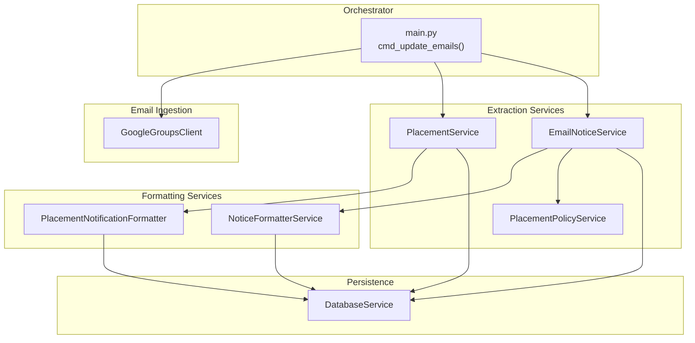
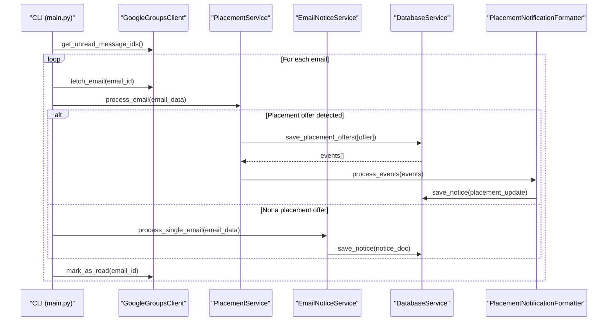
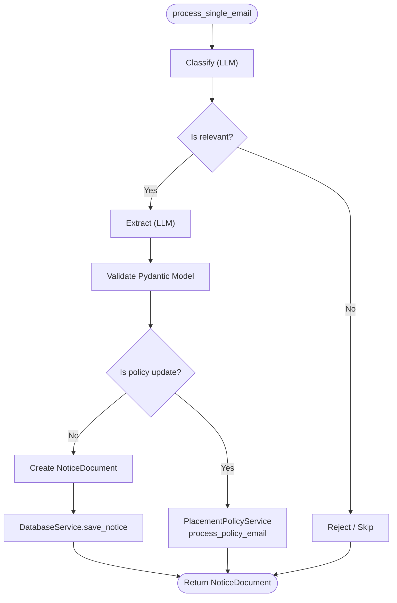
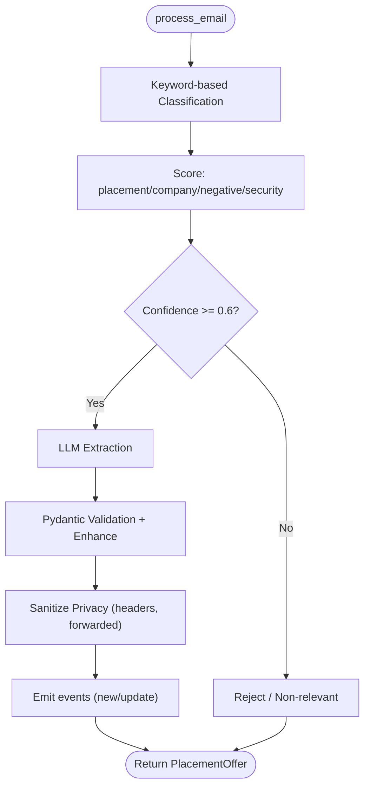
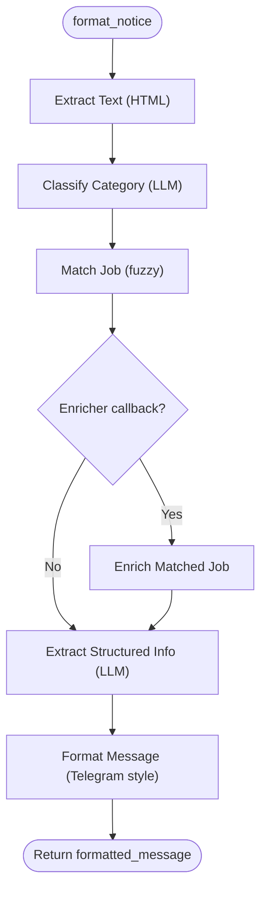
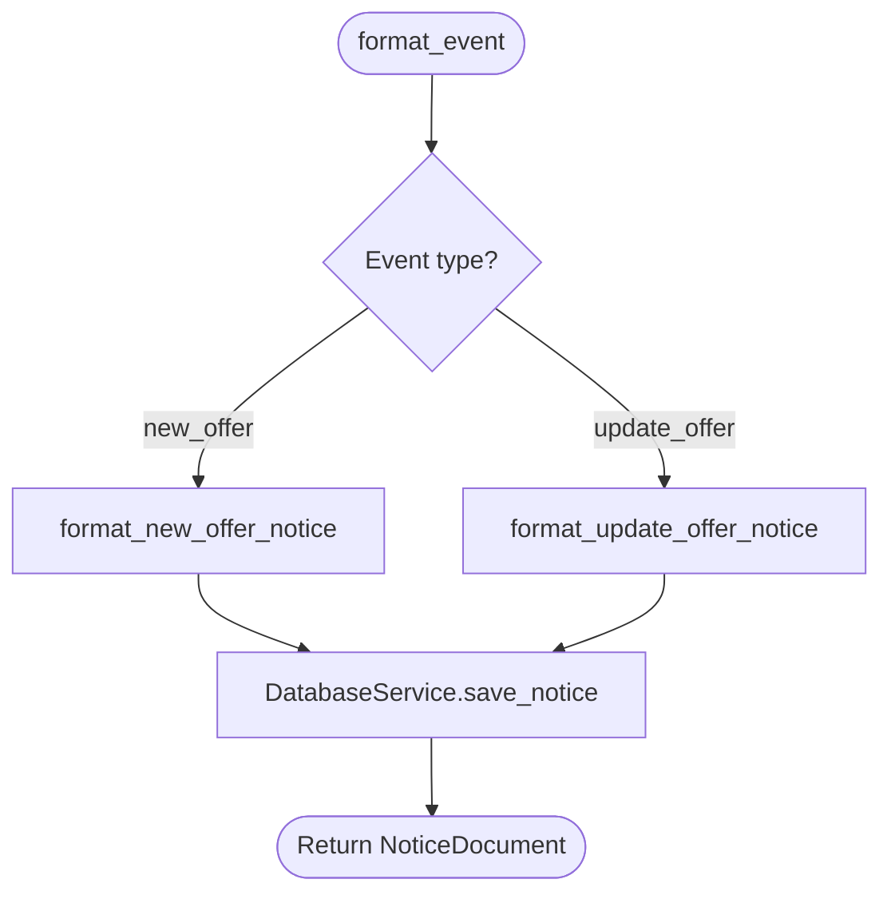
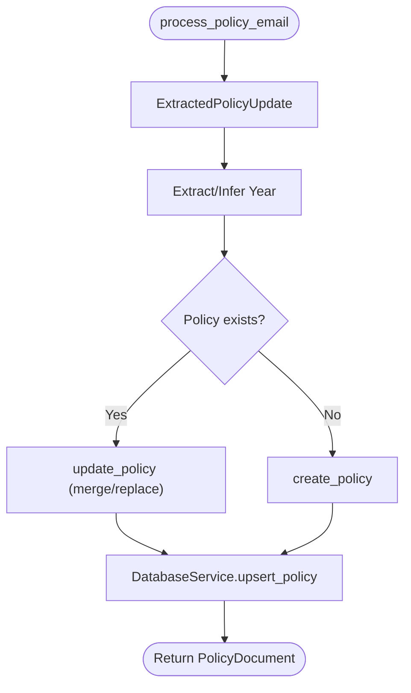
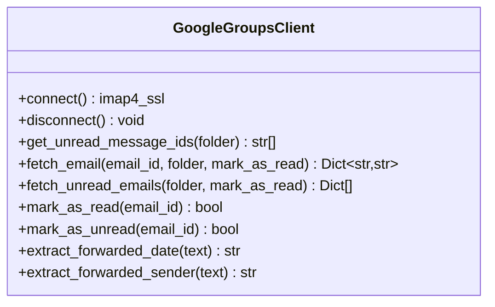
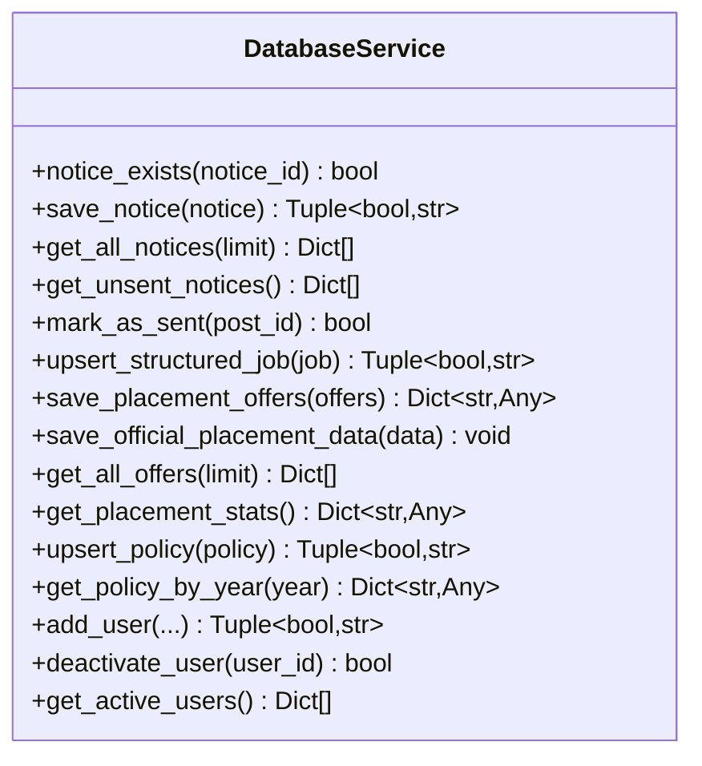
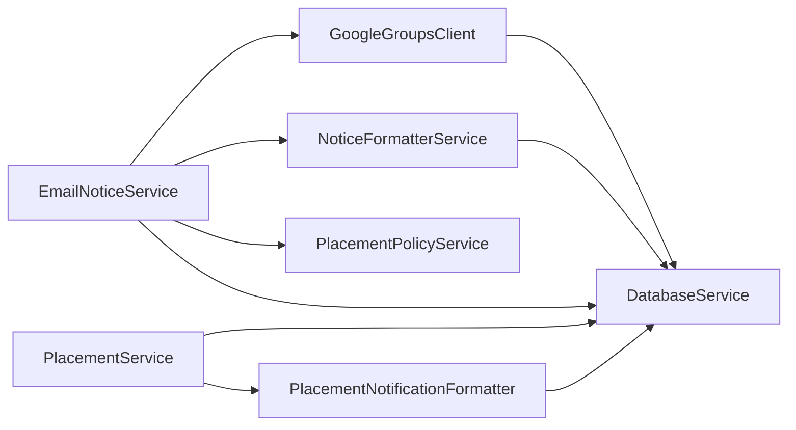

# Email Processing Services

<cite>
**Referenced Files in This Document**
- [email_notice_service.py](file://app/services/email_notice_service.py)
- [placement_service.py](file://app/services/placement_service.py)
- [notice_formatter_service.py](file://app/services/notice_formatter_service.py)
- [placement_notification_formatter.py](file://app/services/placement_notification_formatter.py)
- [placement_policy_service.py](file://app/services/placement_policy_service.py)
- [google_groups_client.py](file://app/clients/google_groups_client.py)
- [database_service.py](file://app/services/database_service.py)
- [main.py](file://app/main.py)
- [config.py](file://app/core/config.py)
</cite>

## Table of Contents
1. [Introduction](#introduction)
2. [Project Structure](#project-structure)
3. [Core Components](#core-components)
4. [Architecture Overview](#architecture-overview)
5. [Detailed Component Analysis](#detailed-component-analysis)
6. [Dependency Analysis](#dependency-analysis)
7. [Performance Considerations](#performance-considerations)
8. [Troubleshooting Guide](#troubleshooting-guide)
9. [Conclusion](#conclusion)

## Introduction
This document explains the email processing services that power intelligent notice classification, content extraction, and standardized formatting for placement and general notices. It covers:
- EmailNoticeService for general notice classification and extraction
- PlacementService for LLM-powered placement offer extraction
- Formatter services for content transformation and notification-ready output
- Integration with Google Gemini LLMs, including prompt engineering and structured data extraction
- The end-to-end pipeline from raw email ingestion to structured data storage and notification delivery

## Project Structure
The email processing system is organized around modular services and clients:
- Services: EmailNoticeService, PlacementService, NoticeFormatterService, PlacementNotificationFormatter, PlacementPolicyService
- Clients: GoogleGroupsClient for email ingestion
- Database: DatabaseService for persistence
- Orchestration: main.py coordinates email processing and integrates with the broader notification system

**Diagram sources**
- [main.py](file://app/main.py#L105-L242)
- [google_groups_client.py](file://app/clients/google_groups_client.py#L19-L168)
- [email_notice_service.py](file://app/services/email_notice_service.py#L335-L798)
- [placement_service.py](file://app/services/placement_service.py#L419-L805)
- [notice_formatter_service.py](file://app/services/notice_formatter_service.py#L48-L792)
- [placement_notification_formatter.py](file://app/services/placement_notification_formatter.py#L102-L380)
- [placement_policy_service.py](file://app/services/placement_policy_service.py#L200-L588)
- [database_service.py](file://app/services/database_service.py#L16-L795)

**Section sources**
- [main.py](file://app/main.py#L105-L242)
- [google_groups_client.py](file://app/clients/google_groups_client.py#L19-L168)
- [email_notice_service.py](file://app/services/email_notice_service.py#L335-L798)
- [placement_service.py](file://app/services/placement_service.py#L419-L805)
- [notice_formatter_service.py](file://app/services/notice_formatter_service.py#L48-L792)
- [placement_notification_formatter.py](file://app/services/placement_notification_formatter.py#L102-L380)
- [placement_policy_service.py](file://app/services/placement_policy_service.py#L200-L588)
- [database_service.py](file://app/services/database_service.py#L16-L795)

## Core Components
- EmailNoticeService: LLM-driven classification and extraction of general notices (announcements, job postings, webinars, hackathons, shortlistings, reminders, internship NOCs). Integrates with NoticeFormatterService for standardized formatting and PlacementPolicyService for policy updates.
- PlacementService: Keyword-based classification plus LLM extraction for final placement offers, with privacy sanitization and structured validation.
- NoticeFormatterService: LLM-based notice formatting pipeline (text extraction, classification, fuzzy matching, structured extraction, and message formatting) for general notices.
- PlacementNotificationFormatter: Creates notification-ready documents for placement events (new offers and updates).
- PlacementPolicyService: Manages placement policy documents (Markdown, TOC generation, year extraction, CRUD).
- GoogleGroupsClient: IMAP-based email retrieval and forwarded metadata extraction.
- DatabaseService: MongoDB operations for notices, jobs, placement offers, policies, and user management.

**Section sources**
- [email_notice_service.py](file://app/services/email_notice_service.py#L335-L798)
- [placement_service.py](file://app/services/placement_service.py#L419-L805)
- [notice_formatter_service.py](file://app/services/notice_formatter_service.py#L48-L792)
- [placement_notification_formatter.py](file://app/services/placement_notification_formatter.py#L102-L380)
- [placement_policy_service.py](file://app/services/placement_policy_service.py#L200-L588)
- [google_groups_client.py](file://app/clients/google_groups_client.py#L19-L168)
- [database_service.py](file://app/services/database_service.py#L16-L795)

## Architecture Overview
The system orchestrates email processing through a unified command that:
1. Fetches unread email IDs
2. Attempts PlacementService classification/extraction
3. Falls back to EmailNoticeService for general notices
4. Persists results to MongoDB
5. Generates placement notifications via PlacementNotificationFormatter

**Diagram sources**
- [main.py](file://app/main.py#L105-L242)
- [google_groups_client.py](file://app/clients/google_groups_client.py#L88-L168)
- [placement_service.py](file://app/services/placement_service.py#L419-L805)
- [email_notice_service.py](file://app/services/email_notice_service.py#L636-L738)
- [database_service.py](file://app/services/database_service.py#L274-L441)
- [placement_notification_formatter.py](file://app/services/placement_notification_formatter.py#L304-L380)

## Detailed Component Analysis

### EmailNoticeService
- Purpose: Classify and extract general notices from Google Groups emails using LLM prompts and LangGraph.
- Key features:
  - LLM-based classification (no keyword filtering) with a dedicated prompt template
  - Structured extraction into ExtractedNotice with comprehensive fields (job postings, webinars, hackathons, shortlistings, internship NOCs, reminders)
  - Retry logic with validation and error handling
  - Integration with NoticeFormatterService for standardized formatting
  - Special handling for placement policy updates via PlacementPolicyService
  - Creation of NoticeDocument for database storage and Telegram formatting
- Processing pipeline:
  - Classify -> Extract -> Validate -> Display
  - JSON extraction from LLM responses with robust error handling
  - Advanced policy extraction with a secondary prompt for policy updates

**Diagram sources**
- [email_notice_service.py](file://app/services/email_notice_service.py#L419-L738)
- [placement_policy_service.py](file://app/services/placement_policy_service.py#L541-L588)
- [database_service.py](file://app/services/database_service.py#L80-L104)

**Section sources**
- [email_notice_service.py](file://app/services/email_notice_service.py#L147-L327)
- [email_notice_service.py](file://app/services/email_notice_service.py#L335-L798)
- [email_notice_service.py](file://app/services/email_notice_service.py#L799-L1155)

### PlacementService
- Purpose: Extract final placement offers from emails using keyword-based classification and LLM extraction.
- Key features:
  - Keyword scoring for placement-related signals, company indicators, and negative filters
  - LLM extraction with structured validation and retry logic
  - Privacy sanitization to remove headers and forwarded metadata
  - Enhanced validation (roles, students, packages)
  - Integration with PlacementNotificationFormatter for notification creation
- Processing pipeline:
  - Classify (keyword scoring) -> Extract (LLM) -> Validate & Enhance -> Sanitize Privacy -> Display

**Diagram sources**
- [placement_service.py](file://app/services/placement_service.py#L507-L805)
- [placement_notification_formatter.py](file://app/services/placement_notification_formatter.py#L304-L380)

**Section sources**
- [placement_service.py](file://app/services/placement_service.py#L93-L143)
- [placement_service.py](file://app/services/placement_service.py#L151-L246)
- [placement_service.py](file://app/services/placement_service.py#L419-L805)

### NoticeFormatterService
- Purpose: Standardize and format notices into notification-ready content using LLM prompts and LangGraph.
- Key features:
  - Text extraction from HTML content
  - Single-label classification (update, shortlisting, announcement, hackathon, webinar, job posting)
  - Fuzzy company name matching against job listings
  - Structured extraction based on category
  - Formatting into Telegram-ready messages with consistent styles and deadlines
- Processing pipeline:
  - Extract Text -> Classify -> Match Job -> Enrich Matched Job -> Extract Info -> Format Message

**Diagram sources**
- [notice_formatter_service.py](file://app/services/notice_formatter_service.py#L202-L792)

**Section sources**
- [notice_formatter_service.py](file://app/services/notice_formatter_service.py#L48-L792)

### PlacementNotificationFormatter
- Purpose: Create notification-ready documents for placement events (new offers and updates).
- Key features:
  - Role breakdown and counts
  - Package formatting helpers
  - New offer and update offer formatting
  - Integration with DatabaseService for persistence
- Processing:
  - NewOfferEvent -> format_new_offer_notice
  - UpdateOfferEvent -> format_update_offer_notice
  - process_events orchestrates multiple events and saves to DB

**Diagram sources**
- [placement_notification_formatter.py](file://app/services/placement_notification_formatter.py#L304-L380)
- [database_service.py](file://app/services/database_service.py#L80-L104)

**Section sources**
- [placement_notification_formatter.py](file://app/services/placement_notification_formatter.py#L102-L380)

### PlacementPolicyService
- Purpose: Manage placement policy documents (Markdown, TOC, year extraction, CRUD).
- Key features:
  - Advanced LLM extraction for policy updates with strict JSON schema
  - Slug generation for GitHub-style TOC IDs
  - Year and update date extraction
  - Upsert operations for MongoDB
- Processing:
  - process_policy_email orchestrates extraction and persistence

**Diagram sources**
- [placement_policy_service.py](file://app/services/placement_policy_service.py#L541-L588)
- [database_service.py](file://app/services/database_service.py#L741-L777)

**Section sources**
- [placement_policy_service.py](file://app/services/placement_policy_service.py#L23-L140)
- [placement_policy_service.py](file://app/services/placement_policy_service.py#L200-L588)

### GoogleGroupsClient
- Purpose: Decoupled email ingestion for Google Groups using IMAP.
- Key features:
  - Connect/disconnect management
  - Fetch unread IDs and emails
  - Forwarded date and sender extraction
  - Mark as read/unread

**Diagram sources**
- [google_groups_client.py](file://app/clients/google_groups_client.py#L19-L465)

**Section sources**
- [google_groups_client.py](file://app/clients/google_groups_client.py#L19-L465)

### DatabaseService
- Purpose: Centralized MongoDB operations for notices, jobs, placement offers, policies, and users.
- Key features:
  - Notice CRUD and stats
  - Job upsert and retrieval
  - Placement offers save with merge logic and event emission
  - Official placement data save with content hashing
  - Policies CRUD and retrieval
  - Users management

**Diagram sources**
- [database_service.py](file://app/services/database_service.py#L16-L795)

**Section sources**
- [database_service.py](file://app/services/database_service.py#L16-L795)

## Dependency Analysis
- EmailNoticeService depends on:
  - GoogleGroupsClient for email ingestion
  - NoticeFormatterService for standardized formatting
  - PlacementPolicyService for policy update handling
  - DatabaseService for persistence
- PlacementService depends on:
  - DatabaseService for saving offers and emitting events
  - PlacementNotificationFormatter for notification creation
- NoticeFormatterService depends on:
  - LLM prompts and LangGraph for classification and extraction
  - DatabaseService for job matching and enrichment
- PlacementNotificationFormatter depends on:
  - DatabaseService for saving notices
- GoogleGroupsClient is a standalone email ingestion client
- DatabaseService is a central persistence layer

**Diagram sources**
- [email_notice_service.py](file://app/services/email_notice_service.py#L335-L798)
- [placement_service.py](file://app/services/placement_service.py#L419-L805)
- [notice_formatter_service.py](file://app/services/notice_formatter_service.py#L48-L792)
- [placement_notification_formatter.py](file://app/services/placement_notification_formatter.py#L102-L380)
- [placement_policy_service.py](file://app/services/placement_policy_service.py#L200-L588)
- [google_groups_client.py](file://app/clients/google_groups_client.py#L19-L168)
- [database_service.py](file://app/services/database_service.py#L16-L795)

**Section sources**
- [email_notice_service.py](file://app/services/email_notice_service.py#L335-L798)
- [placement_service.py](file://app/services/placement_service.py#L419-L805)
- [notice_formatter_service.py](file://app/services/notice_formatter_service.py#L48-L792)
- [placement_notification_formatter.py](file://app/services/placement_notification_formatter.py#L102-L380)
- [placement_policy_service.py](file://app/services/placement_policy_service.py#L200-L588)
- [google_groups_client.py](file://app/clients/google_groups_client.py#L19-L168)
- [database_service.py](file://app/services/database_service.py#L16-L795)

## Performance Considerations
- LLM calls: Both EmailNoticeService and PlacementService use LLMs for extraction. Consider rate limits and cost by batching and caching where appropriate.
- Retry logic: PlacementService includes retry attempts for validation failures; EmailNoticeService retries on extraction errors up to a limit.
- IMAP operations: Fetching and parsing emails can be I/O bound; process emails sequentially to avoid connection thrashing.
- Database writes: Batch operations where possible; PlacementService’s save_placement_offers merges updates efficiently.
- Formatting: NoticeFormatterService performs multiple LLM calls; cache or reuse results when feasible.

[No sources needed since this section provides general guidance]

## Troubleshooting Guide
Common issues and resolutions:
- LLM JSON parsing failures:
  - PlacementService: Validates JSON and retries up to a maximum; check LLM prompt templates and content normalization.
  - EmailNoticeService: Extracts JSON from fenced blocks and retries on validation errors.
- Email fetching errors:
  - GoogleGroupsClient raises clear exceptions for missing credentials and connection failures; verify environment variables and network connectivity.
- Privacy sanitization:
  - PlacementService strips headers and forwarded markers; ensure additional_info and package details are sanitized consistently.
- Database persistence:
  - DatabaseService returns explicit success/error tuples; inspect returned messages for detailed failure reasons.
- Daemon mode:
  - Safe printing is disabled in daemon mode; rely on logging to file for visibility.

**Section sources**
- [placement_service.py](file://app/services/placement_service.py#L663-L704)
- [email_notice_service.py](file://app/services/email_notice_service.py#L553-L568)
- [google_groups_client.py](file://app/clients/google_groups_client.py#L63-L76)
- [database_service.py](file://app/services/database_service.py#L80-L104)
- [config.py](file://app/core/config.py#L145-L154)

## Conclusion
The email processing services provide a robust, LLM-powered pipeline for extracting, classifying, validating, and formatting placement and general notices. The modular design enables clear separation of concerns, strong integration with MongoDB, and extensible formatting for notifications. The orchestration in main.py demonstrates a practical approach to handling mixed email sources and ensuring reliable persistence and delivery.