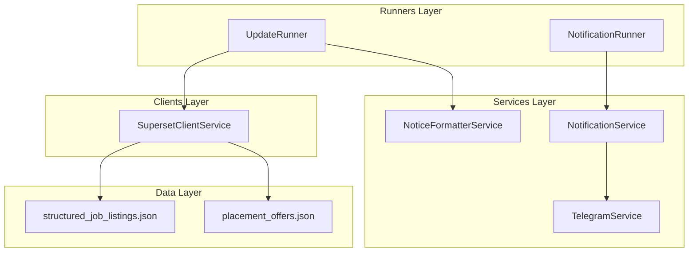
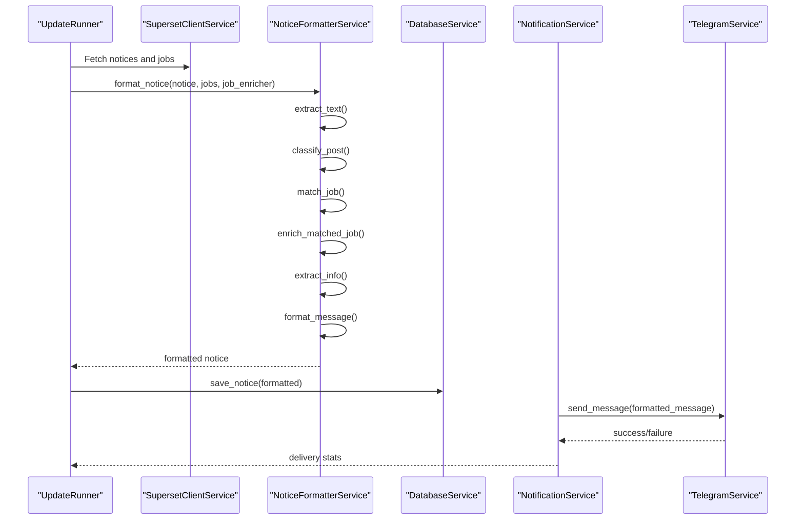
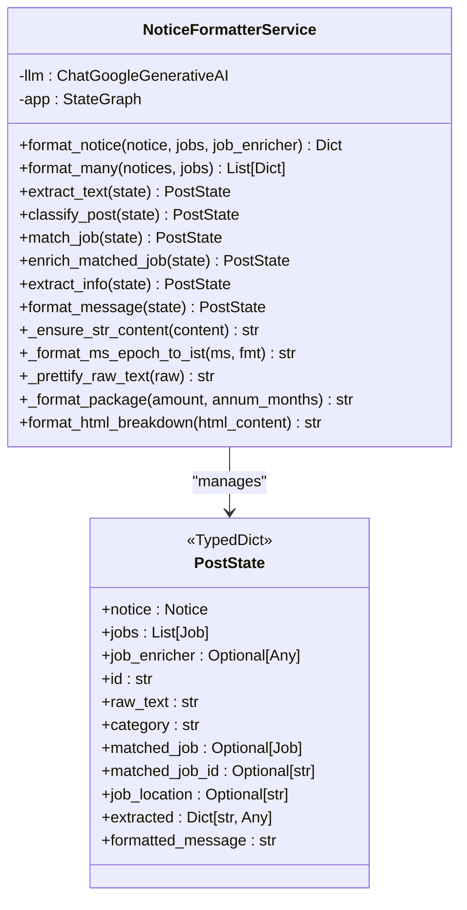
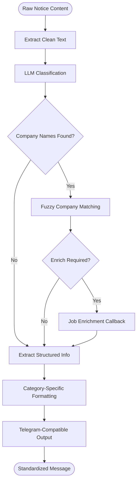
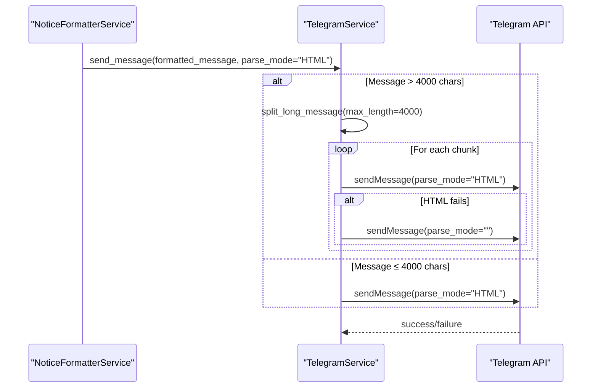
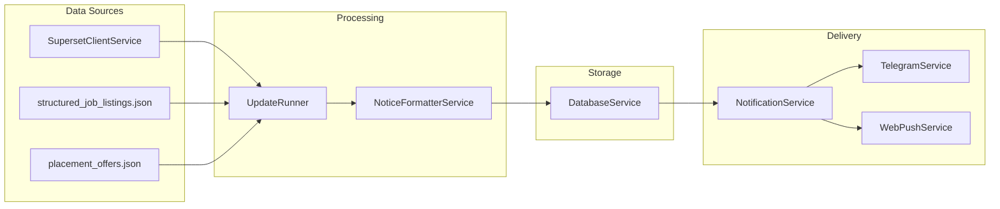
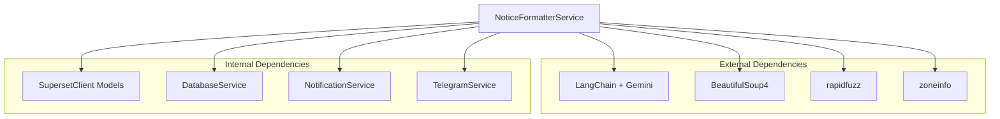

# Notice Formatter Service

<cite>
**Referenced Files in This Document**
- [notice_formatter_service.py](file://app/services/notice_formatter_service.py)
- [superset_client.py](file://app/clients/superset_client.py)
- [notification_service.py](file://app/services/notification_service.py)
- [telegram_service.py](file://app/services/telegram_service.py)
- [update_runner.py](file://app/runners/update_runner.py)
- [main.py](file://app/main.py)
- [structured_job_listings.json](file://app/data/structured_job_listings.json)
- [placement_offers.json](file://app/data/placement_offers.json)
</cite>

## Table of Contents
1. [Introduction](#introduction)
2. [Project Structure](#project-structure)
3. [Core Components](#core-components)
4. [Architecture Overview](#architecture-overview)
5. [Detailed Component Analysis](#detailed-component-analysis)
6. [Dependency Analysis](#dependency-analysis)
7. [Performance Considerations](#performance-considerations)
8. [Troubleshooting Guide](#troubleshooting-guide)
9. [Conclusion](#conclusion)

## Introduction
The Notice Formatter Service is a sophisticated pipeline that transforms raw notice content from the SuperSet portal into standardized, human-readable messages optimized for multiple notification channels, with a focus on Telegram. It leverages LLM-based classification, fuzzy matching, and structured extraction to deliver consistent, audience-appropriate formatting across different notice types including job postings, webinars, hackathons, shortlistings, and general announcements.

The service integrates tightly with the broader notification ecosystem, supporting both automated scheduling and manual triggering via CLI commands. It ensures content safety through HTML cleaning, link handling, and Markdown/HTML rendering compatibility, while respecting Telegram's character limits and formatting capabilities.

## Project Structure
The Notice Formatter Service resides within the application's services layer and interacts with data clients, database services, and notification channels through a well-defined dependency injection architecture.

**Diagram sources**
- [notice_formatter_service.py](file://app/services/notice_formatter_service.py#L48-L866)
- [superset_client.py](file://app/clients/superset_client.py#L88-L604)
- [notification_service.py](file://app/services/notification_service.py#L13-L237)
- [telegram_service.py](file://app/services/telegram_service.py#L20-L351)
- [update_runner.py](file://app/runners/update_runner.py#L21-L278)

**Section sources**
- [notice_formatter_service.py](file://app/services/notice_formatter_service.py#L1-L866)
- [superset_client.py](file://app/clients/superset_client.py#L1-L604)
- [notification_service.py](file://app/services/notification_service.py#L1-L237)
- [telegram_service.py](file://app/services/telegram_service.py#L1-L351)
- [update_runner.py](file://app/runners/update_runner.py#L1-L278)

## Core Components
The Notice Formatter Service is built around a LangGraph-based state machine that processes notices through distinct stages: text extraction, classification, job matching, enrichment, structured extraction, and final formatting. It maintains a compact set of helper utilities for date formatting, currency display, HTML breakdown parsing, and content prettification.

Key capabilities include:
- Multi-stage LLM classification into categories (job posting, shortlisting, webinar, hackathon, announcement, update)
- Fuzzy company name matching against structured job listings
- Structured information extraction tailored to each notice category
- Category-specific formatting templates with consistent Markdown/HTML output
- Integration hooks for job enrichment callbacks
- Content cleaning and sanitization for Telegram compatibility

**Section sources**
- [notice_formatter_service.py](file://app/services/notice_formatter_service.py#L28-L866)

## Architecture Overview
The formatter operates as a stateful pipeline that transforms unstructured notice content into standardized messages. The architecture emphasizes modularity, allowing for easy extension to new notice types and integration with additional channels.

**Diagram sources**
- [update_runner.py](file://app/runners/update_runner.py#L150-L222)
- [notice_formatter_service.py](file://app/services/notice_formatter_service.py#L202-L866)
- [notification_service.py](file://app/services/notification_service.py#L93-L167)
- [telegram_service.py](file://app/services/telegram_service.py#L62-L121)

## Detailed Component Analysis

### NoticeFormatterService Class
The core formatter implements a LangGraph StateGraph with six nodes representing the processing pipeline. Each node encapsulates a specific transformation step with explicit input/output contracts.

**Diagram sources**
- [notice_formatter_service.py](file://app/services/notice_formatter_service.py#L28-L866)

**Section sources**
- [notice_formatter_service.py](file://app/services/notice_formatter_service.py#L48-L866)

### Content Transformation Pipeline
The pipeline transforms raw HTML content through multiple stages, each with specific responsibilities:

1. **Text Extraction**: Converts HTML to plain text while preserving structure
2. **Classification**: LLM-driven categorization using strict labeling rules
3. **Job Matching**: Entity extraction and fuzzy matching against job listings
4. **Enrichment**: Optional detailed job retrieval for matched entries
5. **Structured Extraction**: Category-specific JSON parsing with validation
6. **Formatting**: Template-based message composition with Telegram compatibility

**Diagram sources**
- [notice_formatter_service.py](file://app/services/notice_formatter_service.py#L202-L774)

**Section sources**
- [notice_formatter_service.py](file://app/services/notice_formatter_service.py#L202-L774)

### Category-Specific Formatting Templates
The formatter implements distinct templates for each notice type, ensuring consistent presentation across channels:

#### Job Posting Template
- **Header**: "📢 Job Posting" with company and role
- **Key Sections**: Location, CTC with package breakdown, eligibility criteria, hiring flow
- **Deadlines**: Prominent warning with IST formatting
- **Links**: Direct job details URL when available

#### Shortlisting Template
- **Header**: "🎉 Shortlisting Update"
- **Lists**: Total shortlisted count and student names with enrollment numbers
- **Context**: Company, role, location, package information
- **Process**: Hiring flow steps when available

#### Webinar Template
- **Header**: "🎓 Webinar Details"
- **Timing**: Flexible date/time formatting with IST timezone
- **Venue**: Platform or physical location
- **Registration**: Direct link handling with deadline warnings

#### Hackathon Template
- **Header**: "🏁 Hackathon"
- **Duration**: Start/end date formatting
- **Structure**: Theme, team size, prize pool, venue
- **Registration**: Deadline and link handling

#### Announcement Template
- **Header**: Bold title with passthrough content
- **Attribution**: Author and timestamp footer
- **Minimal Processing**: Light cleanup for readability

**Section sources**
- [notice_formatter_service.py](file://app/services/notice_formatter_service.py#L482-L774)

### Integration with Telegram Message Formatting
The formatter produces content compatible with Telegram's HTML parsing, with automatic fallback to MarkdownV2 escaping when needed. The Telegram service handles:
- Character limit enforcement (4000 character chunks)
- Automatic message splitting with line-aware boundaries
- Markdown/HTML conversion with special handling for links and headers
- Retry mechanisms with plain text fallback

**Diagram sources**
- [telegram_service.py](file://app/services/telegram_service.py#L74-L121)
- [notice_formatter_service.py](file://app/services/notice_formatter_service.py#L795-L866)

**Section sources**
- [telegram_service.py](file://app/services/telegram_service.py#L62-L212)
- [notice_formatter_service.py](file://app/services/notice_formatter_service.py#L795-L866)

### Content Cleaning and Safety Features
The formatter implements comprehensive content cleaning to ensure safe, readable output:

- **HTML Stripping**: BeautifulSoup-based extraction with table parsing and paragraph handling
- **Line Normalization**: Collapse excessive blank lines and trim trailing whitespace
- **Special Character Encoding**: Proper handling of non-breaking spaces and Unicode characters
- **Link Preservation**: Maintains hyperlinks while ensuring proper HTML anchor tags
- **Markdown Compatibility**: Automatic escaping for Telegram MarkdownV2 special characters

**Section sources**
- [notice_formatter_service.py](file://app/services/notice_formatter_service.py#L105-L200)
- [telegram_service.py](file://app/services/telegram_service.py#L256-L351)

### Integration with Notification Delivery System
The formatted notices integrate seamlessly with the broader notification infrastructure:

**Diagram sources**
- [update_runner.py](file://app/runners/update_runner.py#L1-L278)
- [notification_service.py](file://app/services/notification_service.py#L1-L237)
- [superset_client.py](file://app/clients/superset_client.py#L1-L604)

**Section sources**
- [update_runner.py](file://app/runners/update_runner.py#L1-L278)
- [notification_service.py](file://app/services/notification_service.py#L1-L237)

## Dependency Analysis
The Notice Formatter Service maintains loose coupling with external dependencies through well-defined interfaces and typed data models.

**Diagram sources**
- [notice_formatter_service.py](file://app/services/notice_formatter_service.py#L8-L25)
- [superset_client.py](file://app/clients/superset_client.py#L37-L86)

**Section sources**
- [notice_formatter_service.py](file://app/services/notice_formatter_service.py#L8-L25)
- [superset_client.py](file://app/clients/superset_client.py#L37-L86)

## Performance Considerations
The formatter is optimized for production use with several performance-conscious design decisions:

- **Selective Enrichment**: Jobs are only enriched when matched during notice processing, avoiding unnecessary API calls
- **Fuzzy Matching Thresholds**: Configurable similarity thresholds (80+) prevent false positives while maintaining accuracy
- **State Machine Efficiency**: LangGraph minimizes memory overhead through state reuse
- **Batch Processing**: Support for formatting multiple notices in sequence
- **Caching Opportunities**: Job lookup dictionaries prevent repeated database queries

## Troubleshooting Guide
Common issues and their resolutions:

### LLM Parsing Failures
**Symptoms**: Empty extracted fields or JSON parsing errors
**Causes**: 
- LLM output format inconsistencies
- Complex HTML structures causing extraction ambiguity
- Insufficient context for classification

**Resolutions**:
- Verify LLM prompt templates are properly formatted
- Check HTML content complexity and consider preprocessing
- Monitor classification confidence scores

### Telegram Message Limits
**Symptoms**: Truncated messages or delivery failures
**Causes**: 
- Messages exceeding 4000 characters
- Improper HTML/Markdown formatting

**Resolutions**:
- Enable automatic message splitting in TelegramService
- Validate message length before sending
- Test with simplified content first

### Job Matching Issues
**Symptoms**: Missed job matches or incorrect fuzzy matches
**Causes**:
- Company name variations in notices vs. job listings
- Low similarity threshold settings
- Missing job enrichment callback

**Resolutions**:
- Adjust fuzzy matching thresholds (currently >80)
- Implement job enrichment callback for matched entries
- Verify company name normalization

**Section sources**
- [notice_formatter_service.py](file://app/services/notice_formatter_service.py#L294-L318)
- [telegram_service.py](file://app/services/telegram_service.py#L218-L253)

## Conclusion
The Notice Formatter Service provides a robust, extensible foundation for standardizing notice content across multiple channels. Its LLM-powered classification, structured extraction, and category-specific formatting ensure consistent, professional presentations while maintaining flexibility for future enhancements. The integration with Telegram's formatting requirements and the broader notification ecosystem makes it a critical component of the system's communication infrastructure.

The service's modular design, comprehensive error handling, and performance optimizations position it well for scaling to additional notice types and notification channels as requirements evolve.