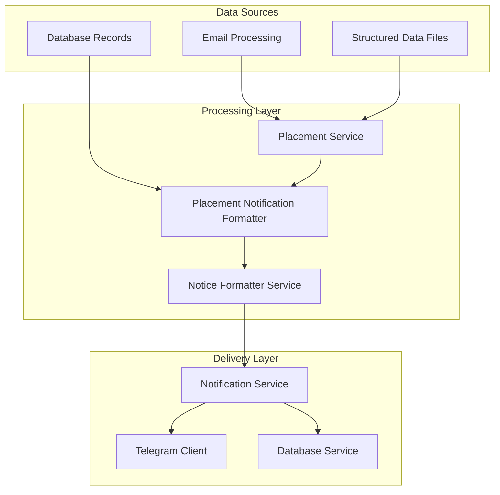
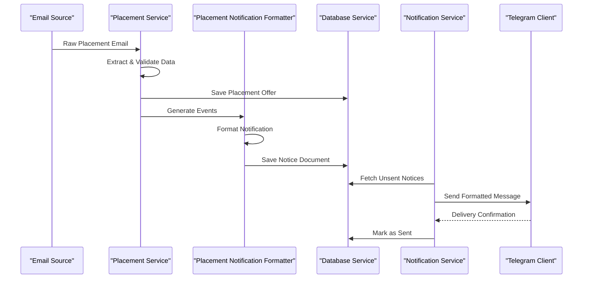
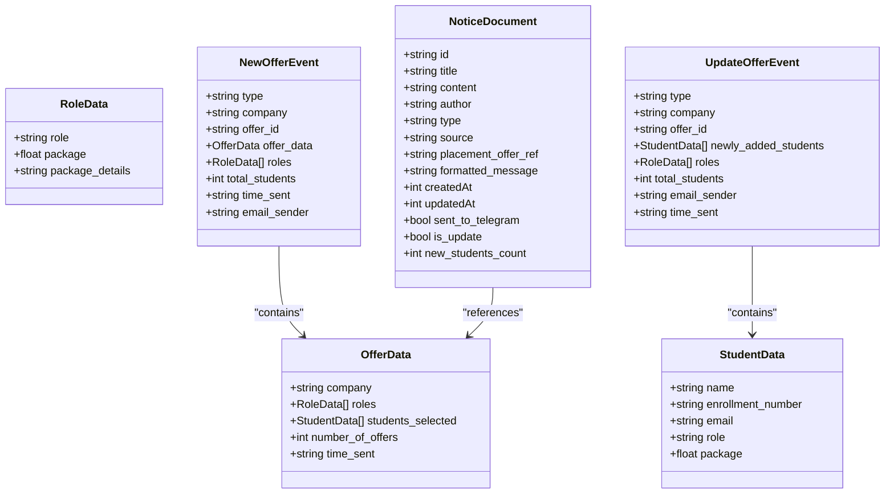
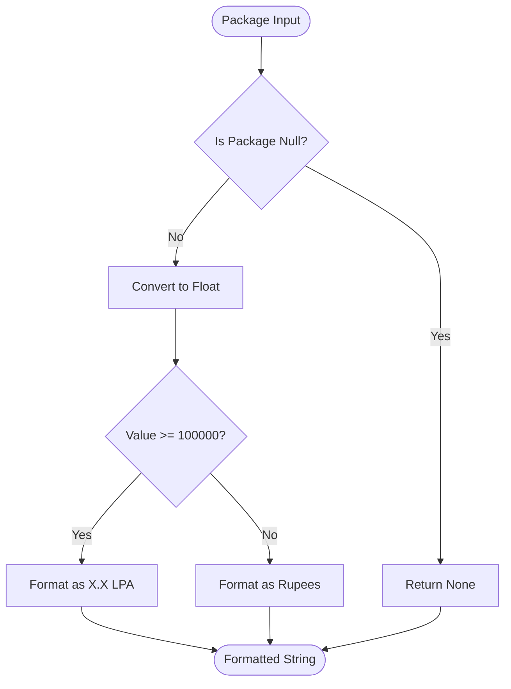
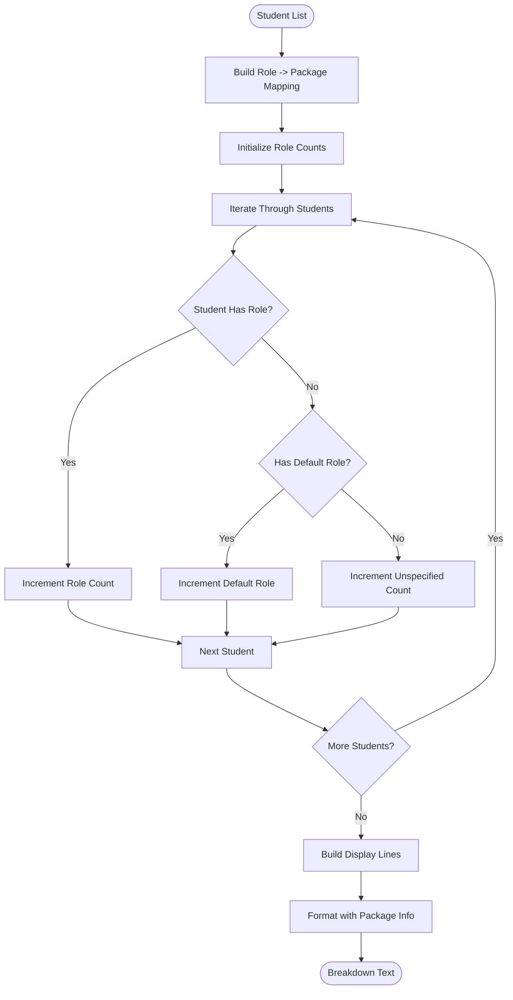
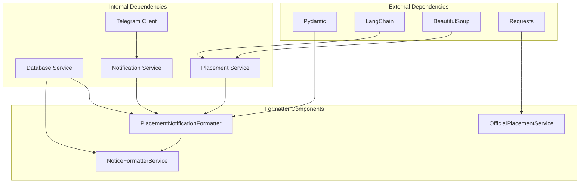

# Placement Notification Formatter

<cite>
**Referenced Files in This Document**
- [placement_notification_formatter.py](file://app/services/placement_notification_formatter.py)
- [placement_service.py](file://app/services/placement_service.py)
- [notification_service.py](file://app/services/notification_service.py)
- [telegram_client.py](file://app/clients/telegram_client.py)
- [database_service.py](file://app/services/database_service.py)
- [main.py](file://app/main.py)
- [placement_offers.json](file://app/data/placement_offers.json)
</cite>

## Table of Contents
1. [Introduction](#introduction)
2. [Project Structure](#project-structure)
3. [Core Components](#core-components)
4. [Architecture Overview](#architecture-overview)
5. [Detailed Component Analysis](#detailed-component-analysis)
6. [Dependency Analysis](#dependency-analysis)
7. [Performance Considerations](#performance-considerations)
8. [Troubleshooting Guide](#troubleshooting-guide)
9. [Conclusion](#conclusion)

## Introduction
The Placement Notification Formatter is a specialized service responsible for transforming structured placement offer data into notification-ready content for delivery channels. This system handles the complete lifecycle from raw placement offer extraction to formatted message delivery, with particular emphasis on creating readable, informative notifications for Telegram and other channels.

The formatter operates independently of database operations, maintaining clean separation of concerns while integrating seamlessly with the broader notification ecosystem. It processes placement events (new offers and updates) and generates standardized, human-friendly content that preserves important details while optimizing for readability and character limits.

## Project Structure
The placement notification system is organized within the application's services layer, with clear boundaries between data extraction, formatting, and delivery components.

**Diagram sources**
- [placement_notification_formatter.py](file://app/services/placement_notification_formatter.py#L102-L380)
- [placement_service.py](file://app/services/placement_service.py#L419-L800)
- [notification_service.py](file://app/services/notification_service.py#L13-L237)

**Section sources**
- [placement_notification_formatter.py](file://app/services/placement_notification_formatter.py#L1-L380)
- [main.py](file://app/main.py#L105-L242)

## Core Components
The Placement Notification Formatter consists of several key components that work together to transform raw placement data into notification-ready content:

### Data Models and Structures
The formatter defines comprehensive data models for representing placement offers, students, roles, and notification documents. These models ensure type safety and provide clear contracts for data transformation.

### Formatting Algorithms
Specialized algorithms handle the transformation of raw placement data into human-readable notifications, with particular attention to:
- Company information presentation
- Student listing organization
- Package details formatting
- Selection criteria summarization

### Template Generation
The system implements template-based approaches for different placement scenarios, ensuring consistent formatting across various types of placement events.

**Section sources**
- [placement_notification_formatter.py](file://app/services/placement_notification_formatter.py#L17-L100)

## Architecture Overview
The placement notification system follows a layered architecture with clear separation of concerns and dependency injection for testability.

**Diagram sources**
- [main.py](file://app/main.py#L105-L242)
- [placement_notification_formatter.py](file://app/services/placement_notification_formatter.py#L346-L380)
- [notification_service.py](file://app/services/notification_service.py#L93-L167)

## Detailed Component Analysis

### PlacementNotificationFormatter Class
The core formatter class implements sophisticated algorithms for transforming placement offer data into notification-ready content.

#### Data Model Definitions
The formatter defines several Pydantic models that serve as the foundation for data transformation:

**Diagram sources**
- [placement_notification_formatter.py](file://app/services/placement_notification_formatter.py#L18-L100)

#### Package Formatting Algorithm
The formatter includes a sophisticated package formatting algorithm that converts raw numeric values into human-readable strings:

**Diagram sources**
- [placement_notification_formatter.py](file://app/services/placement_notification_formatter.py#L120-L139)

#### Role Breakdown Algorithm
The role breakdown algorithm organizes student placements by role with intelligent counting and formatting:

**Diagram sources**
- [placement_notification_formatter.py](file://app/services/placement_notification_formatter.py#L140-L190)

#### Notification Template Generation
The formatter implements template-based approaches for different placement scenarios:

**Final Selection Templates:**
- Company placement summary with student count
- Role breakdown with package information
- Time sent information when available
- Congratulations message

**Update Templates:**
- Incremental placement update with new student count
- Total placement counter
- New position breakdown
- Update-specific messaging

**Section sources**
- [placement_notification_formatter.py](file://app/services/placement_notification_formatter.py#L120-L380)

### Integration with Notification System
The formatter integrates deeply with the broader notification ecosystem through several key mechanisms:

#### Database Integration
The formatter maintains loose coupling with database operations through dependency injection, allowing for flexible storage backends while preserving clean separation of concerns.

#### Channel Delivery
Notifications are delivered through a unified notification service that supports multiple channels including Telegram and web push notifications.

#### Event Processing Pipeline
The formatter participates in a complete pipeline that includes email processing, data extraction, validation, and notification delivery.

**Section sources**
- [placement_notification_formatter.py](file://app/services/placement_notification_formatter.py#L110-L119)
- [notification_service.py](file://app/services/notification_service.py#L13-L237)

## Dependency Analysis
The placement notification system exhibits well-structured dependencies that promote maintainability and testability.

**Diagram sources**
- [placement_notification_formatter.py](file://app/services/placement_notification_formatter.py#L8-L14)
- [placement_service.py](file://app/services/placement_service.py#L24-L29)
- [notification_service.py](file://app/services/notification_service.py#L7-L11)

### Coupling and Cohesion Analysis
The system demonstrates excellent separation of concerns with low internal coupling and high external coupling. The formatter focuses solely on presentation logic while delegating data persistence and delivery to specialized services.

### Circular Dependencies
No circular dependencies were identified in the placement notification system, contributing to its maintainability and testability.

**Section sources**
- [placement_notification_formatter.py](file://app/services/placement_notification_formatter.py#L1-L380)
- [database_service.py](file://app/services/database_service.py#L16-L46)

## Performance Considerations
The placement notification formatter is designed with several performance optimizations:

### Memory Efficiency
- Streaming processing of large datasets
- Lazy evaluation of formatted content
- Efficient string concatenation using join operations

### Processing Optimizations
- Early termination for non-relevant emails
- Caching of frequently accessed data
- Minimal object creation during formatting

### Scalability Features
- Asynchronous processing capabilities
- Configurable batch sizes
- Resource-aware operation limits

## Troubleshooting Guide
Common issues and their solutions when working with the placement notification formatter:

### Data Transformation Issues
- **Problem**: Incorrect package formatting
  - **Solution**: Verify numeric values are properly converted and handle edge cases
  - **Check**: Ensure package values are numeric and within expected ranges

- **Problem**: Missing role information in student listings
  - **Solution**: Implement default role assignment when single role exists
  - **Check**: Validate role assignment logic for multi-role scenarios

### Notification Delivery Problems
- **Problem**: Telegram message delivery failures
  - **Solution**: Check rate limiting and implement exponential backoff
  - **Check**: Verify bot token and chat ID configuration

- **Problem**: Database storage conflicts
  - **Solution**: Implement conflict resolution and retry logic
  - **Check**: Verify unique identifier generation and collision handling

### Integration Challenges
- **Problem**: Email processing inconsistencies
  - **Solution**: Implement robust error handling and retry mechanisms
  - **Check**: Validate email parsing and extraction logic

**Section sources**
- [telegram_client.py](file://app/clients/telegram_client.py#L39-L111)
- [database_service.py](file://app/services/database_service.py#L80-L104)

## Conclusion
The Placement Notification Formatter represents a sophisticated solution for transforming structured placement offer data into notification-ready content. Its design emphasizes clean separation of concerns, extensibility, and maintainability while providing robust functionality for handling various placement scenarios.

The system's modular architecture enables easy integration with different data sources and delivery channels, while its comprehensive error handling and performance optimizations ensure reliable operation in production environments. The formatter's ability to adapt to different placement types and maintain consistent presentation standards makes it an essential component of the broader notification ecosystem.

Through careful attention to data modeling, formatting algorithms, and integration patterns, the Placement Notification Formatter provides a solid foundation for scalable placement notification systems that can evolve with changing requirements and data sources.