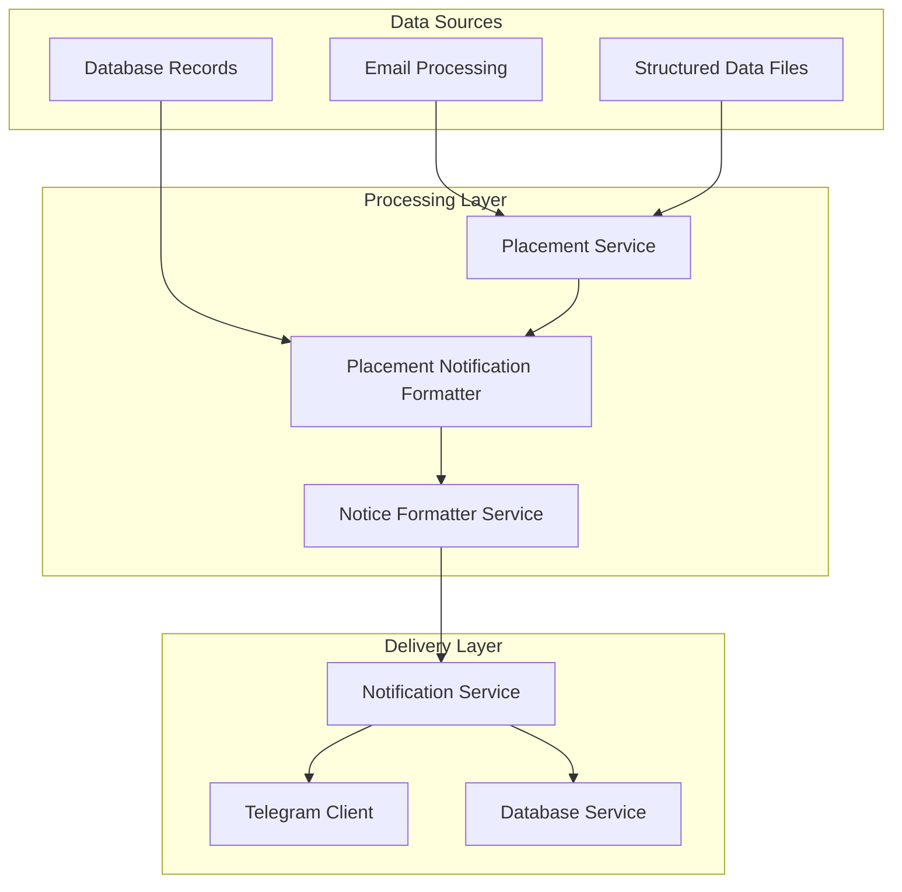
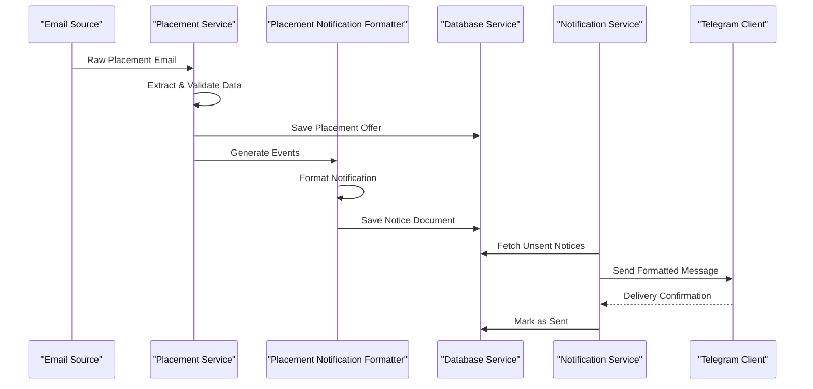
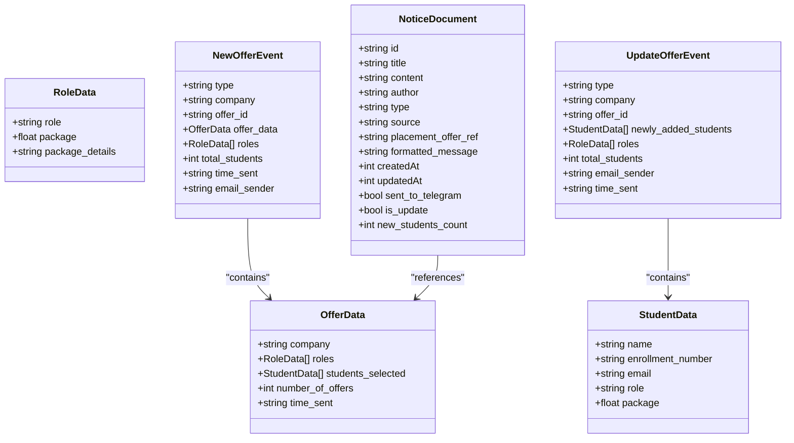
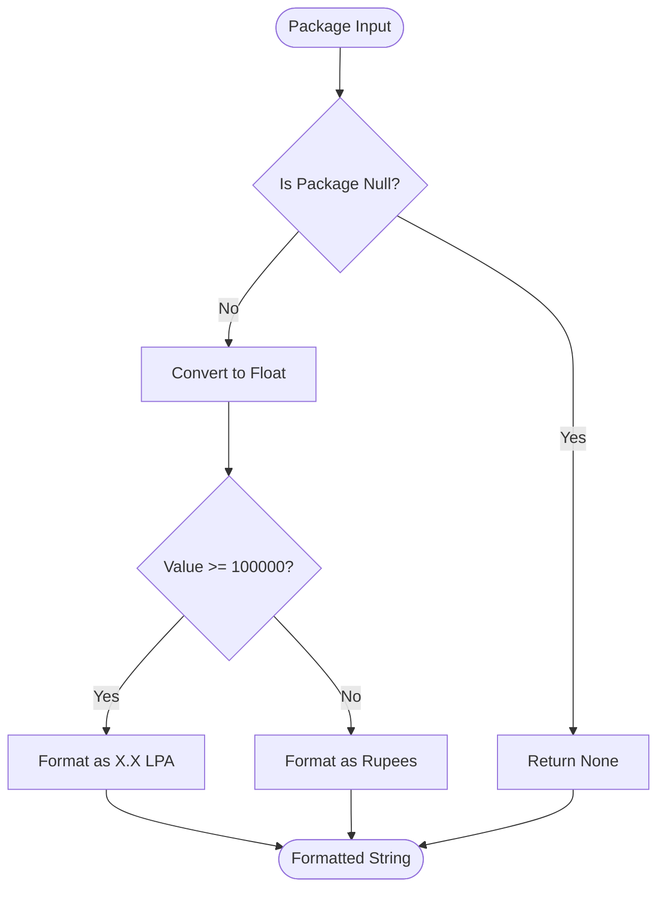
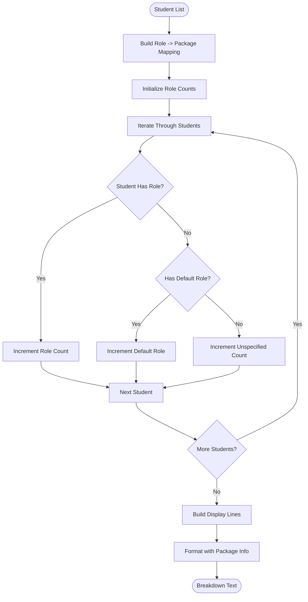
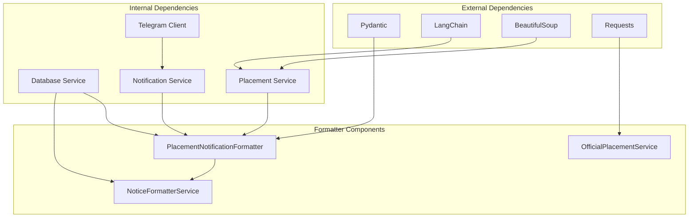

# Placement notification formatter

## Introduction
PlacementNotificationFormatter turns offer documents into channel-ready text. Templates for final selections versus updates, HTML/Markdown choices, and the fields each template expects.

## Project structure
The placement notification system is organized within the application's services layer, with clear boundaries between data extraction, formatting, and delivery components.

```mermaid
graph TB
subgraph "Data Sources"
A[Email Processing]
B[Structured Data Files]
C[Database Records]
end
subgraph "Processing Layer"
D[Placement Service]
E[Placement Notification Formatter]
F[Notice Formatter Service]
end
subgraph "Delivery Layer"
G[Notification Service]
H[Telegram Client]
I[Database Service]
end
A --> D
B --> D
C --> E
D --> E
E --> F
F --> G
G --> H
G --> I
```

## Core components
The Placement Notification Formatter consists of several key components that work together to transform raw placement data into notification-ready content:

### Data models and structures
The formatter defines detailed data models for representing placement offers, students, roles, and notification documents. These models ensure type safety and provide clear contracts for data transformation.

### Formatting algorithms
Specialized algorithms handle the transformation of raw placement data into human-readable notifications, with particular attention to:
- Company information presentation
- Student listing organization
- Package details formatting
- Selection criteria summarization

### Template generation
The system implements template-based approaches for different placement scenarios, so final selections and updates share the same layout rules.

## Architecture overview
The placement notification system follows a layered architecture and dependency injection for testability.

```mermaid
sequenceDiagram
participant Email as "Email Source"
participant Service as "Placement Service"
participant Formatter as "Placement Notification Formatter"
participant DB as "Database Service"
participant Notifier as "Notification Service"
participant Telegram as "Telegram Client"
Email->>Service : Raw Placement Email
Service->>Service : Extract & Validate Data
Service->>DB : Save Placement Offer
Service->>Formatter : Generate Events
Formatter->>Formatter : Format Notification
Formatter->>DB : Save Notice Document
Notifier->>DB : Fetch Unsent Notices
Notifier->>Telegram : Send Formatted Message
Telegram-->>Notifier : Delivery Confirmation
Notifier->>DB : Mark as Sent
```

## Detailed component analysis

### PlacementNotificationFormatter class
The formatter turns placement offer docs into notification text.

#### Data model definitions
The formatter defines several Pydantic models that are the foundation for data transformation:

```mermaid
classDiagram
class RoleData {
+string role
+float package
+string package_details
}
class StudentData {
+string name
+string enrollment_number
+string email
+string role
+float package
}
class OfferData {
+string company
+RoleData[] roles
+StudentData[] students_selected
+int number_of_offers
+string time_sent
}
class NewOfferEvent {
+string type
+string company
+string offer_id
+OfferData offer_data
+RoleData[] roles
+int total_students
+string time_sent
+string email_sender
}
class UpdateOfferEvent {
+string type
+string company
+string offer_id
+StudentData[] newly_added_students
+RoleData[] roles
+int total_students
+string email_sender
+string time_sent
}
class NoticeDocument {
+string id
+string title
+string content
+string author
+string type
+string source
+string placement_offer_ref
+string formatted_message
+int createdAt
+int updatedAt
+bool sent_to_telegram
+bool is_update
+int new_students_count
}
NewOfferEvent --> OfferData : "contains"
UpdateOfferEvent --> StudentData : "contains"
NoticeDocument --> OfferData : "references"
```

#### Package formatting algorithm
Package formatting turns raw numbers into readable strings:

```mermaid
flowchart TD
Start([Package Input]) --> CheckNull{"Is Package Null?"}
CheckNull --> |Yes| ReturnNull["Return None"]
CheckNull --> |No| ConvertType["Convert to Float"]
ConvertType --> CheckValue{"Value >= 100000?"}
CheckValue --> |Yes| FormatLPA["Format as X.X LPA"]
CheckValue --> |No| FormatRupees["Format as Rupees"]
FormatLPA --> End([Formatted String])
FormatRupees --> End
ReturnNull --> End
```

#### Role breakdown algorithm
Role breakdown groups students by role and formats the counts:

```mermaid
flowchart TD
Start([Student List]) --> BuildMap["Build Role -> Package Mapping"]
BuildMap --> InitCounts["Initialize Role Counts"]
InitCounts --> IterateStudents["Iterate Through Students"]
IterateStudents --> CheckRole{"Student Has Role?"}
CheckRole --> |Yes| CountRole["Increment Role Count"]
CheckRole --> |No| CheckDefault{"Has Default Role?"}
CheckDefault --> |Yes| CountDefault["Increment Default Role"]
CheckDefault --> |No| CountUnspecified["Increment Unspecified Count"]
CountRole --> NextStudent["Next Student"]
CountDefault --> NextStudent
CountUnspecified --> NextStudent
NextStudent --> MoreStudents{"More Students?"}
MoreStudents --> |Yes| IterateStudents
MoreStudents --> |No| BuildLines["Build Display Lines"]
BuildLines --> FormatLines["Format with Package Info"]
FormatLines --> End([Breakdown Text])
```

#### Notification template generation
The formatter implements template-based approaches for different placement scenarios:

**Final Selection Templates.**
- Company placement summary with student count
- Role breakdown with package information
- Time sent information when available
- Congratulations message

**Update Templates.**
- Incremental placement update with new student count
- Total placement counter
- New position breakdown
- Update-specific messaging

### Integration with notification system
The formatter integrates deeply with the broader notification ecosystem through several key mechanisms:

#### Database integration
The formatter maintains loose coupling with database operations through dependency injection, allowing for flexible storage backends while preserving clean separation of concerns.

#### Channel delivery
Notifications are delivered through a unified notification service that supports multiple channels including Telegram and web push notifications.

#### Event processing pipeline
The formatter participates in a complete pipeline that includes email processing, data extraction, validation, and notification delivery.

## Dependency analysis
The placement notification system exhibits well-structured dependencies that promote maintainability and testability.

```mermaid
graph TB
subgraph "External Dependencies"
A[Pydantic]
B[LangChain]
C[BeautifulSoup]
D[Requests]
end
subgraph "Internal Dependencies"
E[Database Service]
F[Telegram Client]
G[Notification Service]
H[Placement Service]
end
subgraph "Formatter Components"
I[PlacementNotificationFormatter]
J[NoticeFormatterService]
K[OfficialPlacementService]
end
A --> I
B --> H
C --> H
D --> K
E --> I
E --> J
F --> G
G --> I
H --> I
I --> J
```

### Coupling and cohesion analysis
Formatter only formats. Persistence and delivery stay in DatabaseService and NotificationService.

### Circular dependencies
No circular dependencies were identified in the placement notification system, contributing to its maintainability and testability.

## Performance considerations
Performance notes for the formatter:

### Memory efficiency
- Streaming processing of large datasets
- Lazy evaluation of formatted content
- Efficient string concatenation using join operations

### Processing optimizations
- Early termination for non-relevant emails
- Caching of frequently accessed data
- Minimal object creation during formatting

### Scalability features
- Asynchronous processing capabilities
- Configurable batch sizes
- Resource-aware operation limits

## Troubleshooting guide
Common issues and their solutions when working with the placement notification formatter:

### Data transformation issues
- **Problem**: Incorrect package formatting
 - **Solution**: Verify numeric values are properly converted and handle edge cases
 - **Check**: Ensure package values are numeric and within expected ranges

- **Problem**: Missing role information in student listings
 - **Solution**: Implement default role assignment when single role exists
 - **Check**: Validate role assignment logic for multi-role scenarios

### Notification delivery problems
- **Problem**: Telegram message delivery failures
 - **Solution**: Check rate limiting and implement exponential backoff
 - **Check**: Verify bot token and chat ID configuration

- **Problem**: Database storage conflicts
 - **Solution**: Implement conflict resolution and retry logic
 - **Check**: Verify unique identifier generation and collision handling

### Integration challenges
- **Problem**: Email processing inconsistencies
 - **Solution**: Implement reliable error handling and retry mechanisms
 - **Check**: Validate email parsing and extraction logic

## Conclusion
Formatter turns offer docs into sendable text. Keep templates and merge logic separate and new offer shapes stay a template change.
