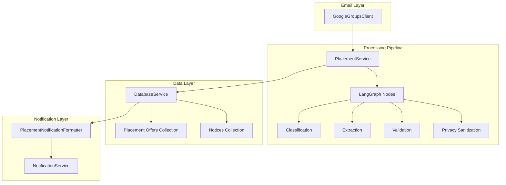
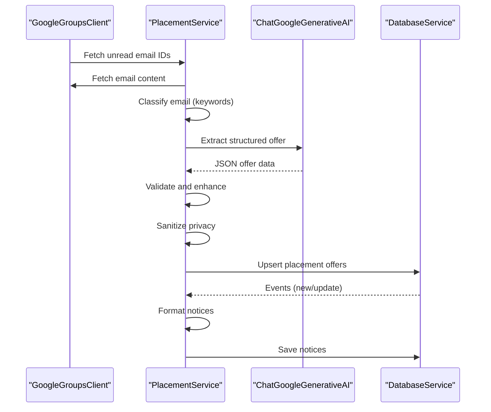
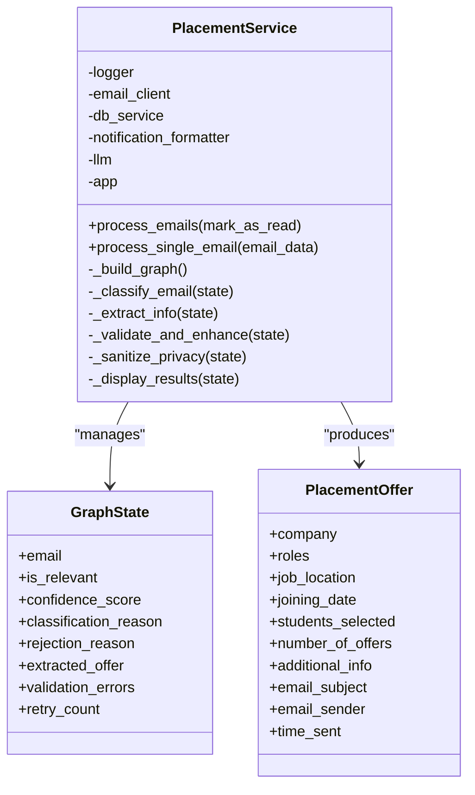
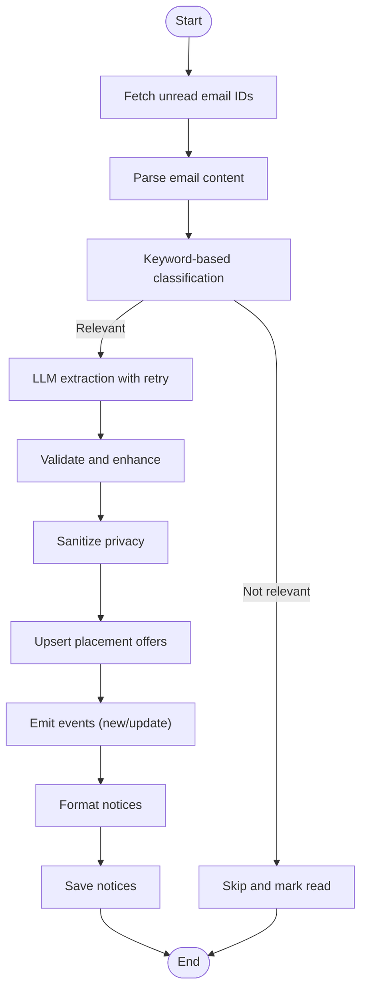
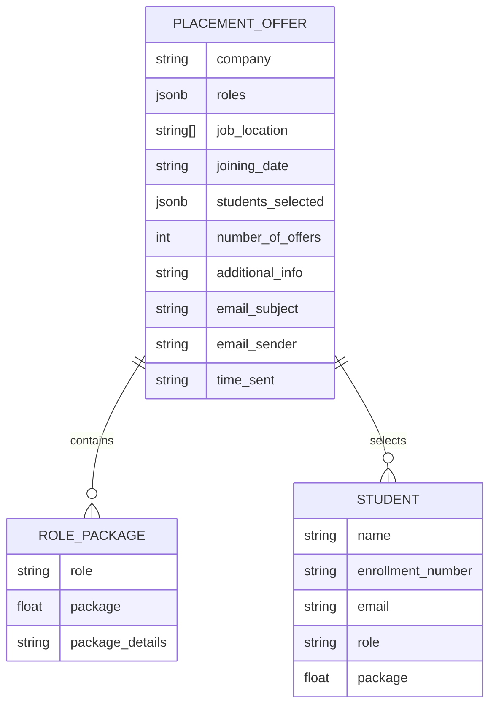
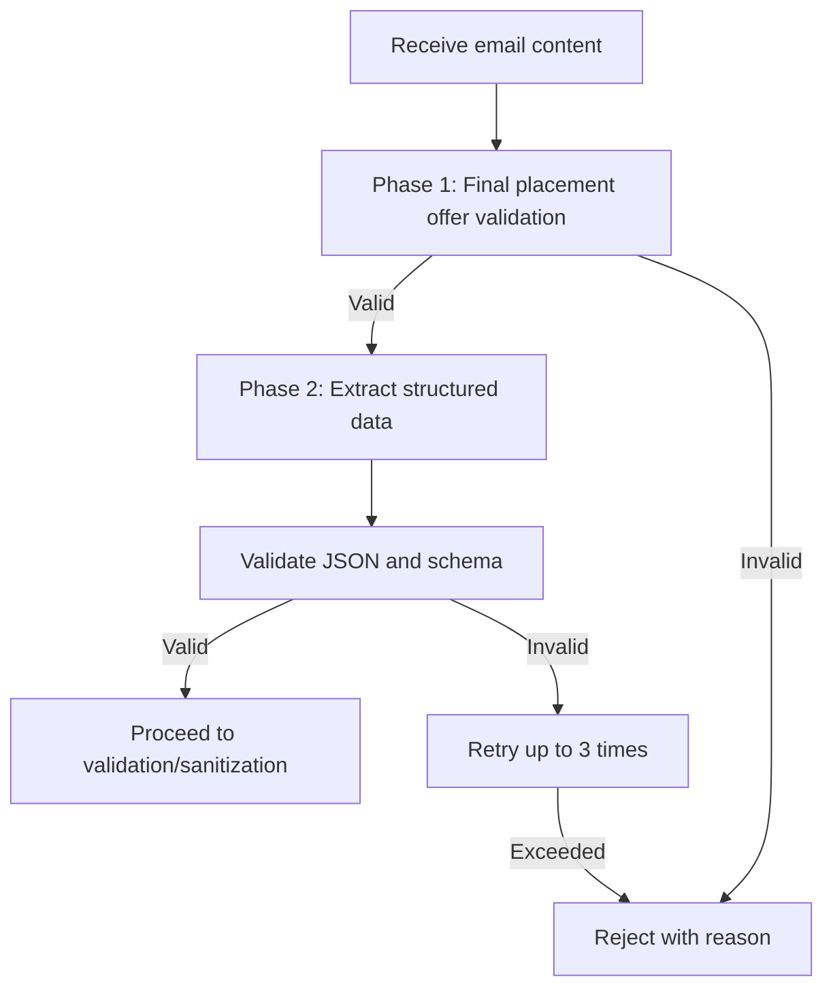
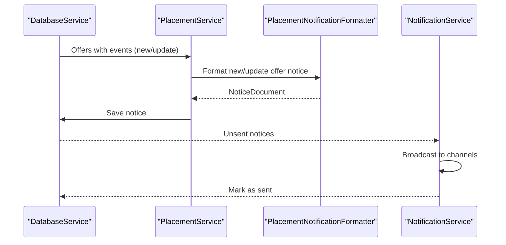
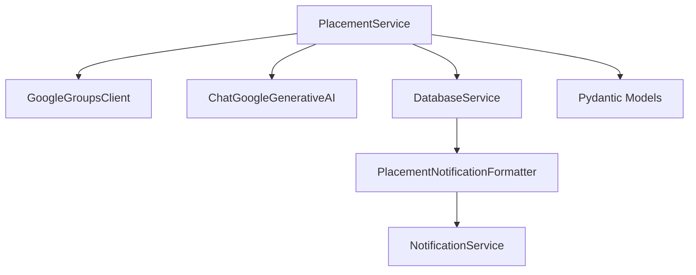

# Placement Service

<cite>
**Referenced Files in This Document**
- [app/services/placement_service.py](file://app/services/placement_service.py)
- [app/services/email_notice_service.py](file://app/services/email_notice_service.py)
- [app/services/notification_service.py](file://app/services/notification_service.py)
- [app/services/placement_notification_formatter.py](file://app/services/placement_notification_formatter.py)
- [app/clients/google_groups_client.py](file://app/clients/google_groups_client.py)
- [app/services/database_service.py](file://app/services/database_service.py)
- [app/data/placement_offers.json](file://app/data/placement_offers.json)
- [app/data/structured_job_listings.json](file://app/data/structured_job_listings.json)
</cite>

## Table of Contents
1. [Introduction](#introduction)
2. [Project Structure](#project-structure)
3. [Core Components](#core-components)
4. [Architecture Overview](#architecture-overview)
5. [Detailed Component Analysis](#detailed-component-analysis)
6. [Dependency Analysis](#dependency-analysis)
7. [Performance Considerations](#performance-considerations)
8. [Troubleshooting Guide](#troubleshooting-guide)
9. [Conclusion](#conclusion)

## Introduction
This document provides comprehensive technical documentation for the PlacementService, which powers LLM-enabled extraction of placement offers from email sources. It explains the placement offer detection algorithms, structured data extraction workflows, and integration with Google Gemini for intelligent content processing. The document covers the placement offer schema, email processing pipeline tailored for placement notifications, LLM prompt engineering, examples of processing different offer types, error handling strategies, and integration with the notification system for delivering updates to users.

## Project Structure
The placement system is composed of modular services that work together to fetch, process, validate, and publish placement offers:

- Email ingestion via Google Groups IMAP client
- LangGraph-based processing pipeline with classification, extraction, validation, and privacy sanitization
- Structured data models for placement offers and notifications
- Database persistence and retrieval
- Notification routing to Telegram and other channels

**Diagram sources**
- [app/clients/google_groups_client.py](file://app/clients/google_groups_client.py#L1-L465)
- [app/services/placement_service.py](file://app/services/placement_service.py#L419-L800)
- [app/services/database_service.py](file://app/services/database_service.py#L16-L795)
- [app/services/notification_service.py](file://app/services/notification_service.py#L13-L237)
- [app/services/placement_notification_formatter.py](file://app/services/placement_notification_formatter.py#L102-L380)

**Section sources**
- [app/clients/google_groups_client.py](file://app/clients/google_groups_client.py#L1-L465)
- [app/services/placement_service.py](file://app/services/placement_service.py#L1-L1176)
- [app/services/database_service.py](file://app/services/database_service.py#L1-L795)
- [app/services/notification_service.py](file://app/services/notification_service.py#L1-L237)
- [app/services/placement_notification_formatter.py](file://app/services/placement_notification_formatter.py#L1-L380)

## Core Components
- PlacementService: Orchestrates the end-to-end pipeline using LangGraph, integrating IMAP email fetching, LLM-based extraction, validation, and privacy sanitization.
- GoogleGroupsClient: Provides IMAP connectivity and email parsing for placement group feeds.
- DatabaseService: Manages MongoDB collections for notices, jobs, placement offers, and user data.
- PlacementNotificationFormatter: Transforms placement events into notification-ready notices.
- NotificationService: Routes formatted notices to Telegram and other channels.
- EmailNoticeService: Separate pipeline for non-placement notices (contrast to placement offers).

Key data models:
- PlacementOffer, RolePackage, Student: Structured representation of placement offers.
- NewOfferEvent, UpdateOfferEvent: Event structures for new and updated offers.
- NoticeDocument: Standardized notice format for publishing.

**Section sources**
- [app/services/placement_service.py](file://app/services/placement_service.py#L37-L86)
- [app/services/placement_notification_formatter.py](file://app/services/placement_notification_formatter.py#L17-L100)
- [app/services/email_notice_service.py](file://app/services/email_notice_service.py#L36-L118)

## Architecture Overview
The PlacementService implements a four-stage LangGraph pipeline:
1. Classification: Keyword-based relevance scoring to filter placement-related emails.
2. Extraction: LLM-based structured extraction with robust retry logic.
3. Validation: Schema validation and enhancement (role/student mapping, package normalization).
4. Privacy Sanitization: Removal of headers, forwarded markers, and sensitive metadata.

**Diagram sources**
- [app/clients/google_groups_client.py](file://app/clients/google_groups_client.py#L88-L168)
- [app/services/placement_service.py](file://app/services/placement_service.py#L484-L800)
- [app/services/database_service.py](file://app/services/database_service.py#L274-L441)

## Detailed Component Analysis

### PlacementService
The PlacementService encapsulates the LangGraph pipeline and integrates with external systems:
- Initialization: Configures LLM (Gemini), builds the workflow graph, and prepares dependencies.
- Classification: Computes a confidence score using placement-related keywords, company indicators, presence of names/emails, and negative indicators.
- Extraction: Invokes the LLM with a strict prompt template to validate final placement offers and extract structured data; includes retry logic on validation errors.
- Validation: Ensures required fields (company, roles, students), normalizes package values, and assigns default roles/packages when possible.
- Privacy Sanitization: Removes headers, forwarded markers, and sensitive metadata from extracted fields.
- Persistence: Uses DatabaseService to upsert offers and emit events for notification formatting.

**Diagram sources**
- [app/services/placement_service.py](file://app/services/placement_service.py#L419-L800)
- [app/services/placement_service.py](file://app/services/placement_service.py#L75-L86)
- [app/services/placement_service.py](file://app/services/placement_service.py#L55-L68)

**Section sources**
- [app/services/placement_service.py](file://app/services/placement_service.py#L419-L800)

### Email Processing Pipeline
The pipeline is designed specifically for placement notifications:
- Email fetching: IMAP-based retrieval of unread emails from the placement group.
- Content parsing: Decodes subject, sender, and body; extracts forwarded sender/date metadata.
- Classification: Keyword scoring and negative indicators to determine relevance.
- Extraction: Strict LLM prompt ensures only final placement offers are processed.
- Validation: Schema enforcement and data normalization.
- Privacy: Sanitization of headers and forwarded metadata.
- Storage: Upsert into placement offers collection with event emission for notifications.

**Diagram sources**
- [app/clients/google_groups_client.py](file://app/clients/google_groups_client.py#L88-L168)
- [app/services/placement_service.py](file://app/services/placement_service.py#L507-L790)
- [app/services/database_service.py](file://app/services/database_service.py#L274-L441)

**Section sources**
- [app/clients/google_groups_client.py](file://app/clients/google_groups_client.py#L110-L223)
- [app/services/placement_service.py](file://app/services/placement_service.py#L507-L790)
- [app/services/database_service.py](file://app/services/database_service.py#L274-L441)

### Placement Offer Schema
The system defines a comprehensive schema for placement offers:
- Company: Name of the organization.
- Roles: List of roles with associated packages and package details.
- Job Location: Optional locations.
- Joining Date: ISO date string.
- Students Selected: List of students with names, enrollment numbers, emails, roles, and packages.
- Number of Offers: Count of selected students.
- Additional Info: Supplementary details.
- Email Metadata: Subject, sender, and time sent.

**Diagram sources**
- [app/services/placement_service.py](file://app/services/placement_service.py#L37-L68)

**Section sources**
- [app/services/placement_service.py](file://app/services/placement_service.py#L37-L68)

### LLM Prompt Engineering
The LLM prompt enforces strict validation before extraction:
- Phase 1: Classification of final placement offers with explicit criteria (package presence, finality, placement status, training/PPO handling).
- Phase 2: Extraction into a strict schema with privacy rules forbidding headers and forwarded metadata.
- Package normalization rules: LPA conversion, range handling, stipend vs. CTC distinctions, and conditional offers.
- Retry logic: Validates JSON and Pydantic models, with up to three attempts.

**Diagram sources**
- [app/services/placement_service.py](file://app/services/placement_service.py#L151-L246)

**Section sources**
- [app/services/placement_service.py](file://app/services/placement_service.py#L151-L246)

### Examples of Processing Different Types of Placement Offers
The system handles diverse offer types:
- Full-time offers with CTC and benefits.
- Internship-only offers with stipend conversion to LPA.
- Conditional offers (PPOs) with final CTC.
- Training programs leading to FTE with package disclosure.
- Multiple roles with different packages.

Examples are visible in the stored placement offers dataset.

**Section sources**
- [app/data/placement_offers.json](file://app/data/placement_offers.json#L1-L800)

### Integration with Notification System
Placement events trigger formatted notices:
- New Offer: Creates a notice summarizing total placements and role breakdowns.
- Update Offer: Adds newly placed students and updates totals.
- NotificationService broadcasts notices to Telegram and other channels.
- DatabaseService persists notices and tracks sent status.

**Diagram sources**
- [app/services/database_service.py](file://app/services/database_service.py#L274-L441)
- [app/services/placement_notification_formatter.py](file://app/services/placement_notification_formatter.py#L192-L302)
- [app/services/notification_service.py](file://app/services/notification_service.py#L93-L167)

**Section sources**
- [app/services/placement_notification_formatter.py](file://app/services/placement_notification_formatter.py#L192-L302)
- [app/services/notification_service.py](file://app/services/notification_service.py#L93-L167)
- [app/services/database_service.py](file://app/services/database_service.py#L116-L147)

## Dependency Analysis
The PlacementService depends on:
- GoogleGroupsClient for email ingestion.
- LangChain ChatGoogleGenerativeAI for LLM processing.
- Pydantic models for validation.
- DatabaseService for persistence and event emission.
- NotificationService and PlacementNotificationFormatter for publishing.

**Diagram sources**
- [app/services/placement_service.py](file://app/services/placement_service.py#L430-L478)
- [app/clients/google_groups_client.py](file://app/clients/google_groups_client.py#L30-L50)
- [app/services/database_service.py](file://app/services/database_service.py#L28-L45)
- [app/services/placement_notification_formatter.py](file://app/services/placement_notification_formatter.py#L110-L118)
- [app/services/notification_service.py](file://app/services/notification_service.py#L21-L40)

**Section sources**
- [app/services/placement_service.py](file://app/services/placement_service.py#L430-L478)
- [app/clients/google_groups_client.py](file://app/clients/google_groups_client.py#L30-L50)
- [app/services/database_service.py](file://app/services/database_service.py#L28-L45)
- [app/services/placement_notification_formatter.py](file://app/services/placement_notification_formatter.py#L110-L118)
- [app/services/notification_service.py](file://app/services/notification_service.py#L21-L40)

## Performance Considerations
- Retry Strategy: Up to three retries for extraction/validation failures to mitigate transient LLM issues.
- Lazy IMAP Usage: Fetches email IDs first, then processes emails individually to reduce memory overhead.
- Package Normalization: Converts all amounts to LPA and handles ranges conservatively (lowest quantifiable value).
- Forwarded Metadata Extraction: Robust parsing of forwarded dates and senders to maintain accurate timestamps and attribution.
- Database Upserts: Efficient merge logic for offers to minimize duplication and maximize event generation for updates.

[No sources needed since this section provides general guidance]

## Troubleshooting Guide
Common issues and resolutions:
- Empty LLM Responses: Treated as non-placement offers; review prompt clarity and content sanitization.
- Validation Errors: Inspect missing company names, roles, or student lists; ensure single-role defaults are applied.
- JSON Parsing Failures: Verify LLM output formatting; ensure raw JSON is returned without markdown wrappers.
- IMAP Connectivity: Confirm environment variables for email and app password; verify server configuration.
- Privacy Sanitization: Ensure headers and forwarded markers are removed; confirm additional_info and package details are cleaned.
- Notification Delivery: Check unsent notices and channel configurations; verify database marking as sent.

**Section sources**
- [app/services/placement_service.py](file://app/services/placement_service.py#L601-L704)
- [app/clients/google_groups_client.py](file://app/clients/google_groups_client.py#L63-L76)
- [app/services/notification_service.py](file://app/services/notification_service.py#L93-L167)

## Conclusion
The PlacementService provides a robust, LLM-powered pipeline for extracting and publishing placement offers from email sources. Its strict classification and extraction prompts, combined with validation and privacy sanitization, ensure high-quality, normalized data. The integration with the notification system enables timely delivery of placement updates to users, while the database layer supports historical tracking and statistical reporting.