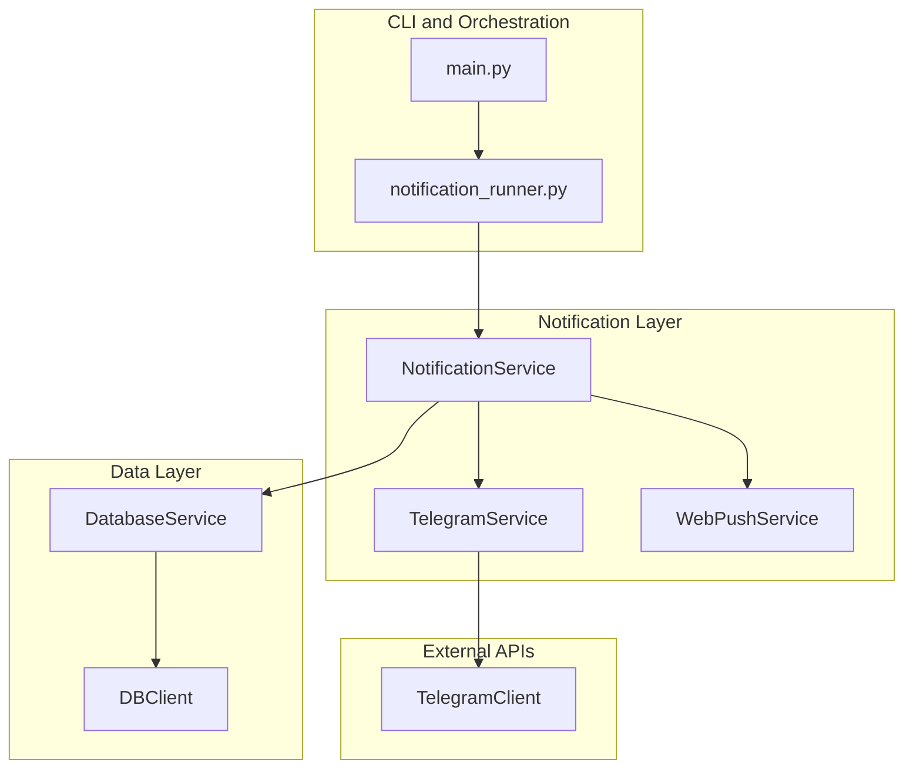
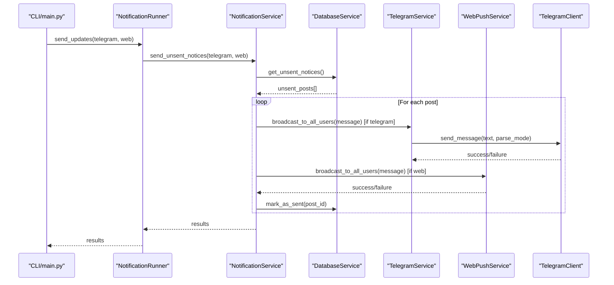
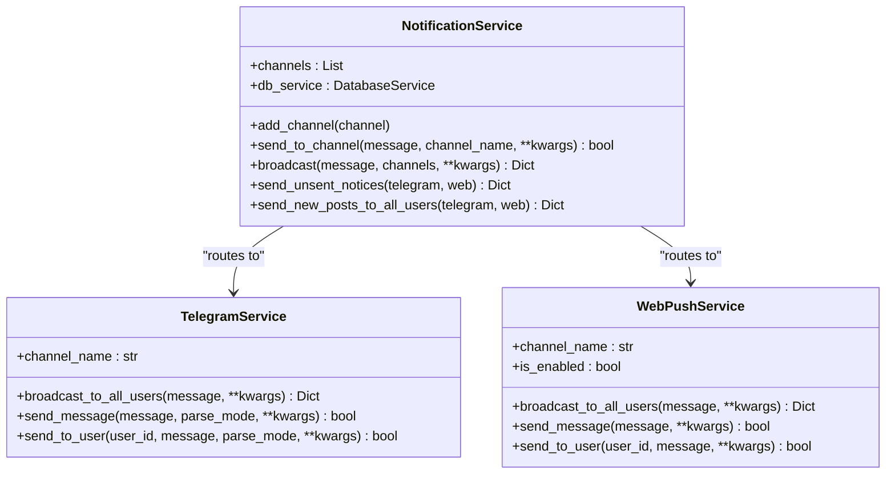
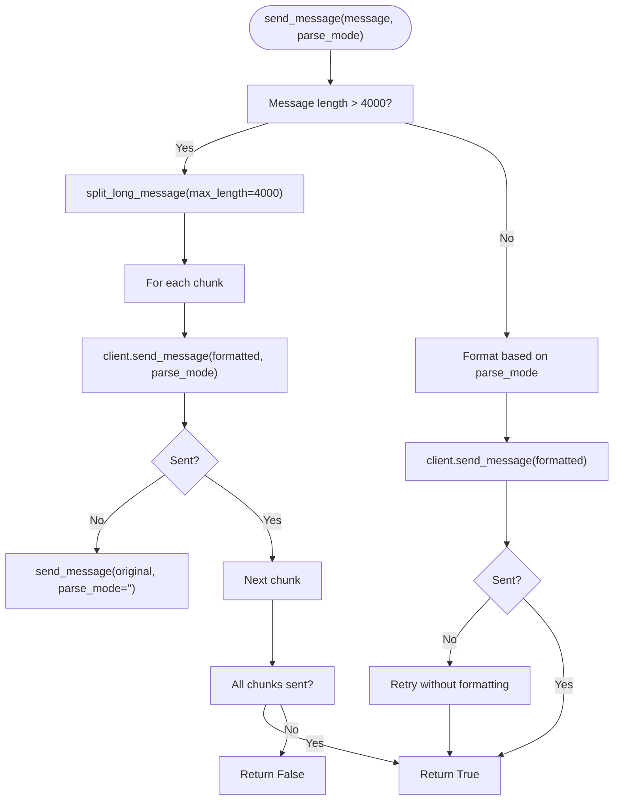
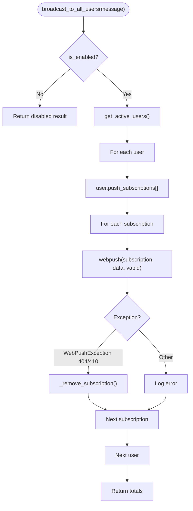
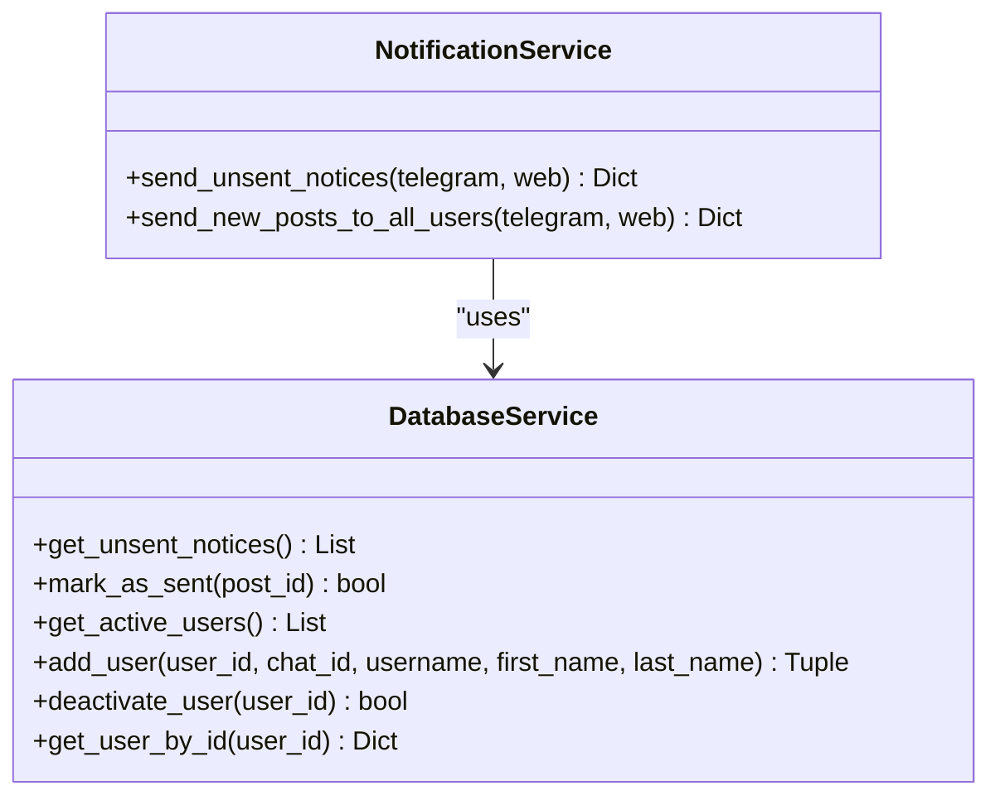
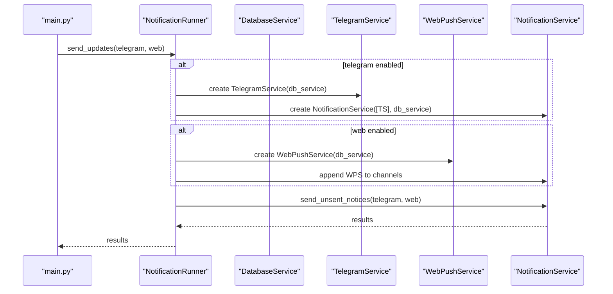
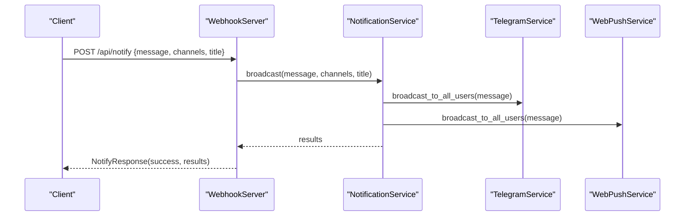
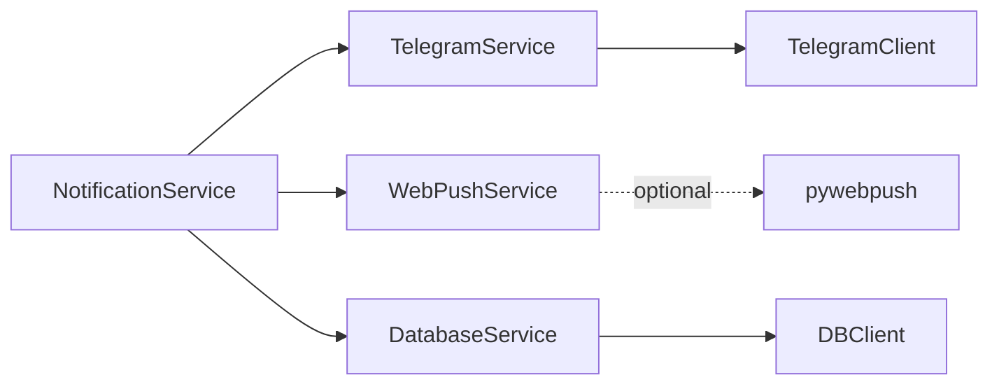

# Notification Service

<cite>
**Referenced Files in This Document**
- [notification_service.py](file://app/services/notification_service.py)
- [telegram_service.py](file://app/services/telegram_service.py)
- [web_push_service.py](file://app/services/web_push_service.py)
- [telegram_client.py](file://app/clients/telegram_client.py)
- [database_service.py](file://app/services/database_service.py)
- [db_client.py](file://app/clients/db_client.py)
- [notification_runner.py](file://app/runners/notification_runner.py)
- [webhook_server.py](file://app/servers/webhook_server.py)
- [main.py](file://app/main.py)
- [config.py](file://app/core/config.py)
- [ARCHITECTURE.md](file://docs/ARCHITECTURE.md)
</cite>

## Table of Contents
1. [Introduction](#introduction)
2. [Project Structure](#project-structure)
3. [Core Components](#core-components)
4. [Architecture Overview](#architecture-overview)
5. [Detailed Component Analysis](#detailed-component-analysis)
6. [Dependency Analysis](#dependency-analysis)
7. [Performance Considerations](#performance-considerations)
8. [Troubleshooting Guide](#troubleshooting-guide)
9. [Conclusion](#conclusion)
10. [Appendices](#appendices)

## Introduction
This document provides comprehensive documentation for the NotificationService responsible for multi-channel notification delivery. It explains the service’s architecture for coordinating notifications across Telegram, web push, and other channels, along with notification routing mechanisms, batch processing capabilities, and delivery strategies. It covers integration with user management systems, subscription handling, notification filtering based on user preferences, error handling and retry mechanisms, notification queuing, and delivery confirmation processes. It also includes examples of notification formatting, channel-specific adaptations, and the service’s role in the overall notification workflow, along with performance optimization techniques, rate limiting considerations, and monitoring approaches.

## Project Structure
The notification system is organized around a service-oriented architecture with clear separation of concerns:
- NotificationService acts as the orchestrator and router for multiple channels.
- Channel services implement a simple interface contract (channel_name property and broadcast/send methods).
- DatabaseService manages persistent state for notices and users.
- Clients encapsulate low-level interactions with external APIs (Telegram Bot API).
- Runners and servers coordinate execution and expose endpoints for triggering notifications.

**Diagram sources**
- [main.py](file://app/main.py#L265-L281)
- [notification_runner.py](file://app/runners/notification_runner.py#L60-L115)
- [notification_service.py](file://app/services/notification_service.py#L13-L40)
- [telegram_service.py](file://app/services/telegram_service.py#L20-L51)
- [web_push_service.py](file://app/services/web_push_service.py#L27-L79)
- [database_service.py](file://app/services/database_service.py#L16-L45)
- [db_client.py](file://app/clients/db_client.py#L16-L41)
- [telegram_client.py](file://app/clients/telegram_client.py#L19-L35)

**Section sources**
- [ARCHITECTURE.md](file://docs/ARCHITECTURE.md#L120-L276)
- [main.py](file://app/main.py#L370-L438)

## Core Components
- NotificationService: Central coordinator that routes notifications to enabled channels and performs batch processing of pending notices.
- TelegramService: Implements channel-specific logic for Telegram, including message formatting, chunking, and broadcasting to users.
- WebPushService: Implements channel-specific logic for web push notifications, including VAPID authentication and subscription management.
- DatabaseService: Provides access to notices and users collections, including retrieval of unsent notices and marking them as sent.
- TelegramClient: Low-level client for Telegram Bot API with retry and rate-limit handling.
- NotificationRunner: CLI runner that wires dependencies and triggers sending of unsent notices.
- WebhookServer: Exposes REST endpoints for programmatic notification dispatch and subscription management.

**Section sources**
- [notification_service.py](file://app/services/notification_service.py#L13-L40)
- [telegram_service.py](file://app/services/telegram_service.py#L20-L51)
- [web_push_service.py](file://app/services/web_push_service.py#L27-L79)
- [database_service.py](file://app/services/database_service.py#L16-L45)
- [telegram_client.py](file://app/clients/telegram_client.py#L19-L35)
- [notification_runner.py](file://app/runners/notification_runner.py#L21-L59)
- [webhook_server.py](file://app/servers/webhook_server.py#L69-L137)

## Architecture Overview
The notification workflow begins with pending notices stored in MongoDB. The NotificationService retrieves unsent notices and broadcasts them to enabled channels. TelegramService formats and sends messages to users, while WebPushService delivers push notifications to subscribed browsers. Results are recorded back to the database to mark notices as sent.

**Diagram sources**
- [main.py](file://app/main.py#L265-L281)
- [notification_runner.py](file://app/runners/notification_runner.py#L60-L115)
- [notification_service.py](file://app/services/notification_service.py#L93-L167)
- [database_service.py](file://app/services/database_service.py#L116-L147)
- [telegram_service.py](file://app/services/telegram_service.py#L140-L172)
- [web_push_service.py](file://app/services/web_push_service.py#L120-L155)
- [telegram_client.py](file://app/clients/telegram_client.py#L39-L111)

## Detailed Component Analysis

### NotificationService
- Responsibilities:
  - Aggregates multiple channels and routes notifications accordingly.
  - Performs batch processing of unsent notices.
  - Broadcasts messages to specified channels and records delivery outcomes.
- Key methods:
  - add_channel: Adds a channel implementation.
  - send_to_channel: Sends a message to a specific channel by name.
  - broadcast: Broadcasts to specified channels or all if none specified.
  - send_unsent_notices: Retrieves unsent notices and sends them to target channels, marking as sent upon success.
  - send_new_posts_to_all_users: Alternative entry point for scheduled jobs.

**Diagram sources**
- [notification_service.py](file://app/services/notification_service.py#L13-L236)
- [telegram_service.py](file://app/services/telegram_service.py#L20-L172)
- [web_push_service.py](file://app/services/web_push_service.py#L27-L155)

**Section sources**
- [notification_service.py](file://app/services/notification_service.py#L13-L236)

### TelegramService
- Responsibilities:
  - Implements channel_name property for routing.
  - Formats messages for Telegram (MarkdownV2 and HTML).
  - Splits long messages into chunks respecting Telegram limits.
  - Broadcasts to all active users with rate limiting.
  - Retries without formatting on failures.
- Key methods:
  - send_message: Sends a message to default chat with optional parse_mode.
  - send_to_user: Sends a message to a specific user.
  - broadcast_to_all_users: Iterates active users and sends messages with throttling.
  - Message formatting helpers: convert_markdown_to_telegram, convert_markdown_to_html, escape_markdown_v2, split_long_message.

**Diagram sources**
- [telegram_service.py](file://app/services/telegram_service.py#L62-L121)
- [telegram_client.py](file://app/clients/telegram_client.py#L39-L111)

**Section sources**
- [telegram_service.py](file://app/services/telegram_service.py#L20-L351)
- [telegram_client.py](file://app/clients/telegram_client.py#L19-L126)

### WebPushService
- Responsibilities:
  - Implements channel_name property for routing.
  - Checks availability of pywebpush and VAPID keys.
  - Broadcasts to all users with push subscriptions.
  - Handles subscription removal for expired endpoints.
  - Manages subscription persistence (save/remove/get_public_key).
- Key methods:
  - send_message: Broadcasts to all subscriptions.
  - send_to_user: Sends to a user’s subscriptions.
  - broadcast_to_all_users: Iterates users and subscriptions.
  - _send_push: Sends a single push with VAPID claims and handles WebPushException.

**Diagram sources**
- [web_push_service.py](file://app/services/web_push_service.py#L120-L193)

**Section sources**
- [web_push_service.py](file://app/services/web_push_service.py#L27-L242)

### DatabaseService and User Management
- Responsibilities:
  - Provides get_unsent_notices and mark_as_sent for queued notifications.
  - Supplies get_active_users for broadcasting.
  - Manages user registration and deactivation.
- Integration with NotificationService:
  - NotificationService relies on DatabaseService to fetch unsent notices and mark them as sent after successful delivery.

**Diagram sources**
- [database_service.py](file://app/services/database_service.py#L116-L147)
- [notification_service.py](file://app/services/notification_service.py#L93-L167)

**Section sources**
- [database_service.py](file://app/services/database_service.py#L16-L795)

### NotificationRunner and CLI Integration
- Responsibilities:
  - Creates and wires dependencies (TelegramService, WebPushService, DatabaseService).
  - Initializes NotificationService with selected channels.
  - Executes send_unsent_notices and returns results.
- CLI integration:
  - main.py subcommand “send” invokes send_updates with telegram/web flags.

**Diagram sources**
- [main.py](file://app/main.py#L265-L281)
- [notification_runner.py](file://app/runners/notification_runner.py#L60-L115)

**Section sources**
- [notification_runner.py](file://app/runners/notification_runner.py#L21-L129)
- [main.py](file://app/main.py#L265-L281)

### WebhookServer Integration
- Responsibilities:
  - Exposes endpoints to trigger notifications programmatically.
  - Provides subscription management for web push.
  - Integrates NotificationService and WebPushService via dependency injection.
- Endpoints:
  - POST /api/notify: Broadcast to specified channels.
  - POST /api/notify/telegram: Telegram-only.
  - POST /api/notify/web-push: Web push-only.
  - POST /api/push/subscribe and /api/push/unsubscribe: Manage subscriptions.
  - GET /api/push/vapid-key: Retrieve VAPID public key.

**Diagram sources**
- [webhook_server.py](file://app/servers/webhook_server.py#L244-L264)
- [notification_service.py](file://app/services/notification_service.py#L61-L91)

**Section sources**
- [webhook_server.py](file://app/servers/webhook_server.py#L69-L361)

## Dependency Analysis
- Coupling:
  - NotificationService depends on channel implementations via channel_name and broadcast/send contracts.
  - Channel services depend on DatabaseService for user and subscription data.
  - TelegramService depends on TelegramClient for API calls.
- Cohesion:
  - Each service has a single responsibility: routing (NotificationService), channel-specific delivery (TelegramService/WebPushService), and persistence (DatabaseService).
- External dependencies:
  - Telegram Bot API (requests).
  - Optional web push library (pywebpush) with graceful degradation.
  - MongoDB via PyMongo.

**Diagram sources**
- [notification_service.py](file://app/services/notification_service.py#L33-L35)
- [telegram_service.py](file://app/services/telegram_service.py#L46-L48)
- [web_push_service.py](file://app/services/web_push_service.py#L16-L24)
- [database_service.py](file://app/services/database_service.py#L36-L43)
- [db_client.py](file://app/clients/db_client.py#L31-L40)

**Section sources**
- [notification_service.py](file://app/services/notification_service.py#L33-L40)
- [telegram_service.py](file://app/services/telegram_service.py#L46-L51)
- [web_push_service.py](file://app/services/web_push_service.py#L16-L24)
- [database_service.py](file://app/services/database_service.py#L36-L45)

## Performance Considerations
- Rate limiting:
  - TelegramService applies throttling between user sends to avoid rate limits.
  - TelegramClient handles 429 responses with Retry-After header.
- Message chunking:
  - TelegramService splits long messages into chunks respecting Telegram’s character limits.
- Graceful degradation:
  - WebPushService disables itself if pywebpush is unavailable or VAPID keys are missing.
- Batch processing:
  - NotificationService processes unsent notices in batches and marks as sent upon success.
- Caching and reuse:
  - Settings are cached to reduce repeated environment parsing.
- Indexing:
  - MongoDB collections are indexed for frequent queries (e.g., notices by sent flags, users by user_id).

**Section sources**
- [telegram_service.py](file://app/services/telegram_service.py#L163-L163)
- [telegram_client.py](file://app/clients/telegram_client.py#L90-L96)
- [web_push_service.py](file://app/services/web_push_service.py#L60-L70)
- [database_service.py](file://app/services/database_service.py#L601-L612)
- [config.py](file://app/core/config.py#L156-L185)

## Troubleshooting Guide
- Telegram configuration issues:
  - Missing bot token or chat ID leads to early return in TelegramService and TelegramClient.
  - Rate limiting: TelegramClient retries with exponential backoff and respects Retry-After.
- Web push configuration issues:
  - Missing pywebpush or VAPID keys disables web push functionality.
  - Expired subscriptions (404/410) are handled by removing them.
- Database connectivity:
  - DBClient requires MONGO_CONNECTION_STR; connection failures are logged and raised.
  - DatabaseService wraps operations with try/catch and logs errors.
- Notification delivery failures:
  - NotificationService logs errors per channel and continues processing remaining posts.
  - WebhookServer returns HTTP 500 on exceptions with error details.

**Section sources**
- [telegram_client.py](file://app/clients/telegram_client.py#L32-L38)
- [telegram_client.py](file://app/clients/telegram_client.py#L90-L111)
- [web_push_service.py](file://app/services/web_push_service.py#L60-L70)
- [web_push_service.py](file://app/services/web_push_service.py#L185-L193)
- [db_client.py](file://app/clients/db_client.py#L46-L72)
- [database_service.py](file://app/services/database_service.py#L66-L78)
- [notification_service.py](file://app/services/notification_service.py#L85-L89)
- [webhook_server.py](file://app/servers/webhook_server.py#L192-L208)

## Conclusion
The NotificationService provides a clean, extensible foundation for multi-channel notification delivery. Its design emphasizes separation of concerns, dependency injection, and graceful degradation. By leveraging channel-specific services and robust error handling, it ensures reliable delivery across Telegram and web push channels while maintaining operational simplicity and observability.

## Appendices

### Notification Routing Mechanisms
- Channel selection:
  - Channels are added to NotificationService dynamically and identified by channel_name.
  - send_to_channel routes to a specific channel by name; broadcast targets specified channels or all.
- Delivery strategies:
  - TelegramService formats and chunks messages, retries without formatting on failure.
  - WebPushService broadcasts to all subscriptions, handles expiration, and gracefully degrades.

**Section sources**
- [notification_service.py](file://app/services/notification_service.py#L42-L91)
- [telegram_service.py](file://app/services/telegram_service.py#L62-L121)
- [web_push_service.py](file://app/services/web_push_service.py#L81-L155)

### Batch Processing and Queuing
- Queuing:
  - Notices are queued by storing them in MongoDB with sent flags.
- Batch processing:
  - NotificationService retrieves unsent notices and attempts delivery to target channels.
  - On success, notices are marked as sent; otherwise, failures are tracked.

**Section sources**
- [database_service.py](file://app/services/database_service.py#L116-L147)
- [notification_service.py](file://app/services/notification_service.py#L93-L167)

### Integration with User Management and Subscriptions
- User management:
  - DatabaseService provides add_user, deactivate_user, get_active_users, and get_user_by_id.
- Subscription handling:
  - WebPushService manages subscriptions via save_subscription and remove_subscription.
  - WebhookServer exposes endpoints for subscription management and VAPID key retrieval.

**Section sources**
- [database_service.py](file://app/services/database_service.py#L616-L712)
- [web_push_service.py](file://app/services/web_push_service.py#L213-L237)
- [webhook_server.py](file://app/servers/webhook_server.py#L186-L238)

### Error Handling and Retry Mechanisms
- Telegram:
  - TelegramClient retries with exponential backoff and respects rate limits.
  - TelegramService retries without formatting on initial failure.
- Web push:
  - WebPushService catches WebPushException and removes expired subscriptions.
- General:
  - NotificationService logs per-channel errors and continues processing.
  - WebhookServer returns HTTP 500 with error details on failures.

**Section sources**
- [telegram_client.py](file://app/clients/telegram_client.py#L83-L111)
- [telegram_service.py](file://app/services/telegram_service.py#L116-L121)
- [web_push_service.py](file://app/services/web_push_service.py#L185-L193)
- [notification_service.py](file://app/services/notification_service.py#L85-L89)
- [webhook_server.py](file://app/servers/webhook_server.py#L207-L208)

### Monitoring and Delivery Confirmation
- Logging:
  - Centralized logging via setup_logging with configurable log levels and daemon mode.
  - Safe printing for non-daemon mode to avoid noisy output.
- Statistics:
  - DatabaseService provides notice and user statistics for monitoring.
  - WebhookServer exposes /api/stats endpoints for placement, notices, and users.

**Section sources**
- [config.py](file://app/core/config.py#L188-L253)
- [database_service.py](file://app/services/database_service.py#L161-L199)
- [webhook_server.py](file://app/servers/webhook_server.py#L306-L340)