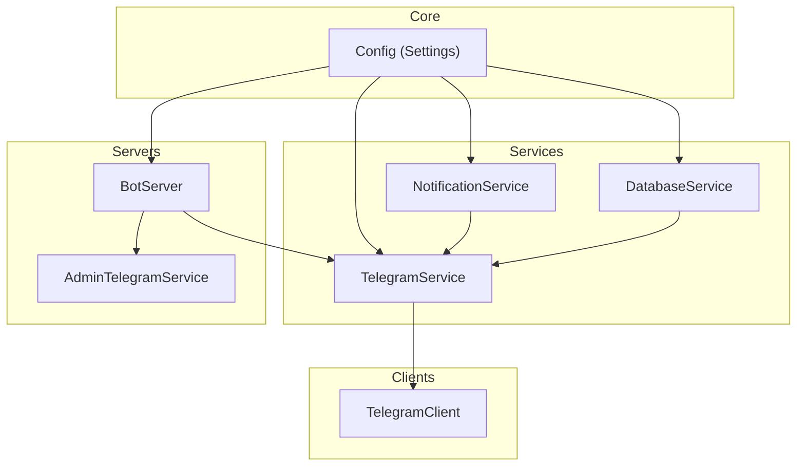
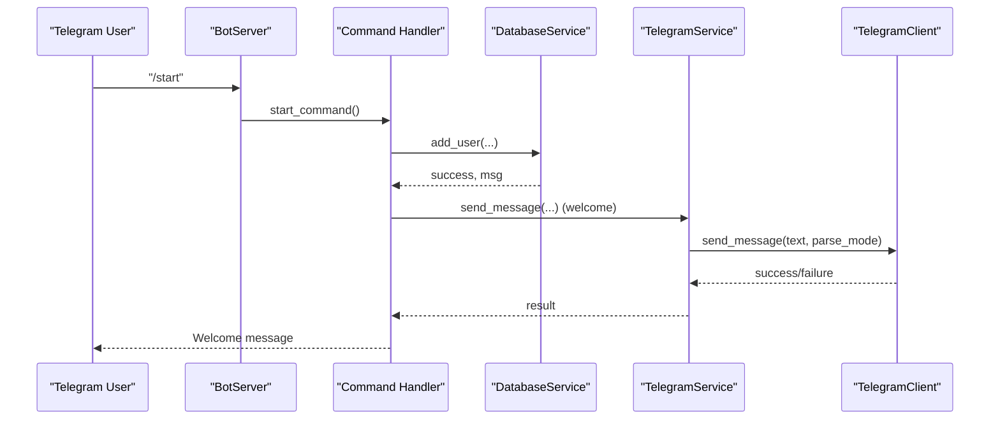
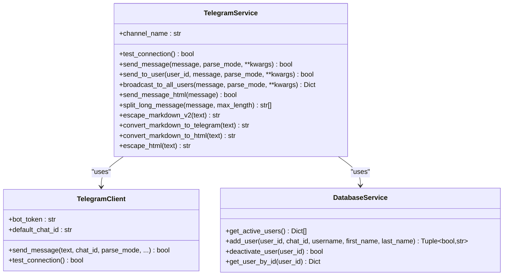
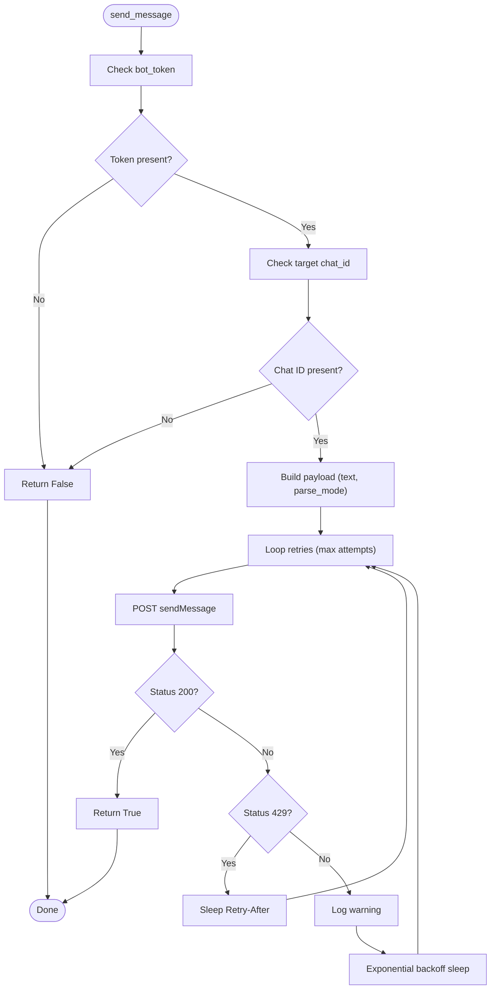
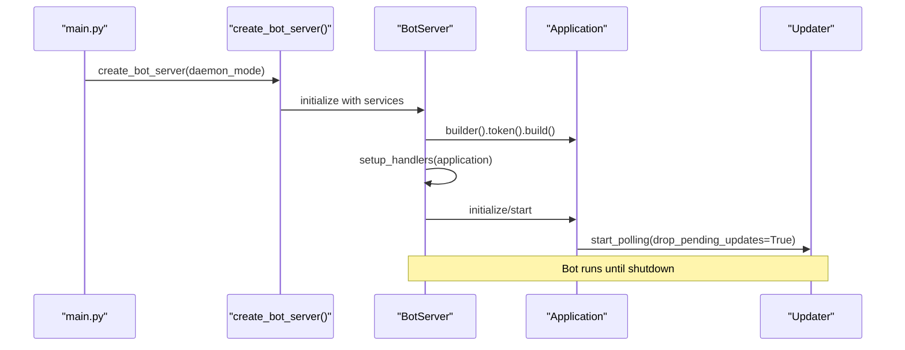
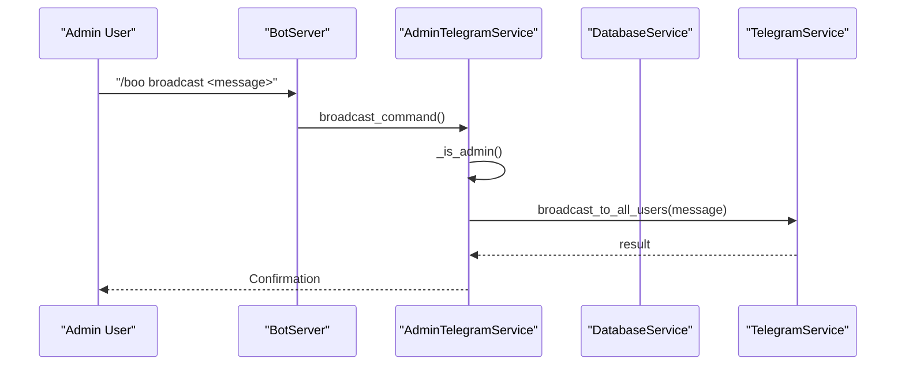
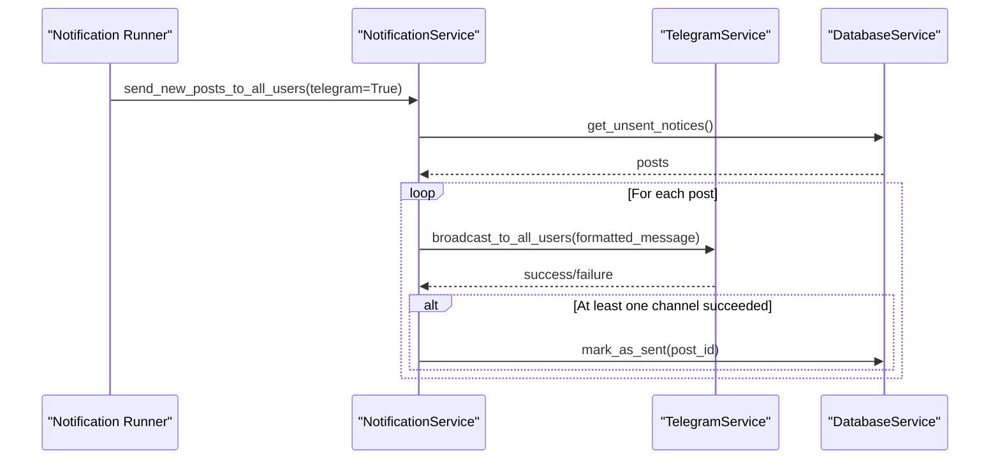
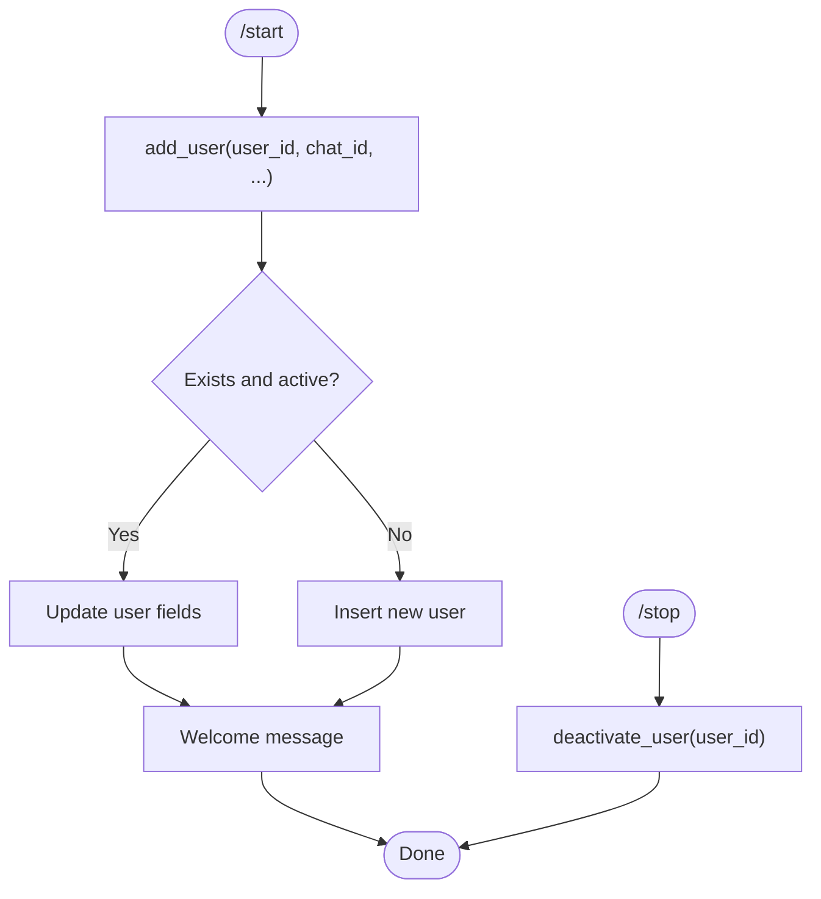
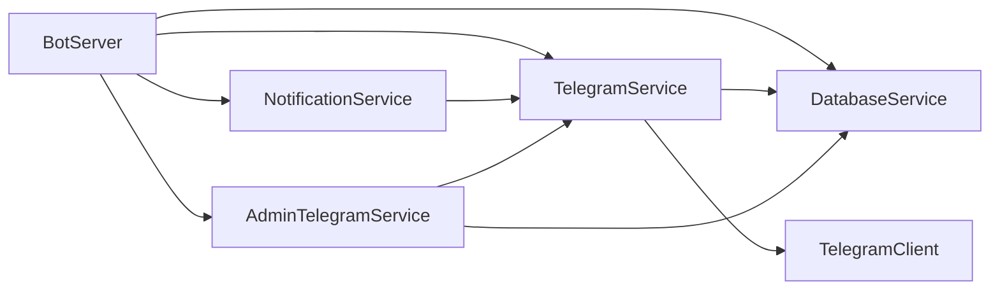

# Telegram Service

<cite>
**Referenced Files in This Document**
- [telegram_service.py](file://app/services/telegram_service.py)
- [bot_server.py](file://app/servers/bot_server.py)
- [telegram_client.py](file://app/clients/telegram_client.py)
- [admin_telegram_service.py](file://app/services/admin_telegram_service.py)
- [config.py](file://app/core/config.py)
- [notification_service.py](file://app/services/notification_service.py)
- [database_service.py](file://app/services/database_service.py)
- [main.py](file://app/main.py)
- [README.md](file://README.md)
- [ARCHITECTURE.md](file://docs/ARCHITECTURE.md)
- [CONFIGURATION.md](file://docs/CONFIGURATION.md)
</cite>

## Table of Contents
1. [Introduction](#introduction)
2. [Project Structure](#project-structure)
3. [Core Components](#core-components)
4. [Architecture Overview](#architecture-overview)
5. [Detailed Component Analysis](#detailed-component-analysis)
6. [Dependency Analysis](#dependency-analysis)
7. [Performance Considerations](#performance-considerations)
8. [Troubleshooting Guide](#troubleshooting-guide)
9. [Conclusion](#conclusion)
10. [Appendices](#appendices)

## Introduction
This document provides comprehensive documentation for the TelegramService component that powers the Telegram bot functionality and user interaction within the SuperSet placement notification system. It explains how TelegramService integrates with the python-telegram-bot library, handles command processing, manages users, and participates in the broader notification ecosystem. It also covers the bot server implementation, message handling patterns, subscription management, and security considerations.

## Project Structure
The TelegramService resides in the services layer and collaborates with the bot server, database service, and notification service. The configuration module centralizes environment-driven settings, and the main entry point wires the dependency injection for the Telegram bot server.

**Diagram sources**
- [telegram_service.py](file://app/services/telegram_service.py#L20-L51)
- [bot_server.py](file://app/servers/bot_server.py#L29-L82)
- [telegram_client.py](file://app/clients/telegram_client.py#L19-L35)
- [notification_service.py](file://app/services/notification_service.py#L13-L41)
- [database_service.py](file://app/services/database_service.py#L16-L46)
- [config.py](file://app/core/config.py#L18-L44)

**Section sources**
- [telegram_service.py](file://app/services/telegram_service.py#L1-L51)
- [bot_server.py](file://app/servers/bot_server.py#L1-L82)
- [telegram_client.py](file://app/clients/telegram_client.py#L1-L35)
- [notification_service.py](file://app/services/notification_service.py#L1-L41)
- [database_service.py](file://app/services/database_service.py#L1-L46)
- [config.py](file://app/core/config.py#L1-L44)

## Core Components
- TelegramService: Implements the Telegram channel for notifications, including message formatting, long message splitting, and user broadcasting.
- TelegramClient: Low-level client for Telegram Bot API interactions, including retries, rate-limit handling, and connection testing.
- BotServer: Asynchronous Telegram bot server that registers command handlers and manages lifecycle.
- AdminTelegramService: Provides admin-only commands and authentication enforcement.
- DatabaseService: User management and persistence for subscriptions.
- NotificationService: Aggregates channels and routes notifications to Telegram and other channels.

**Section sources**
- [telegram_service.py](file://app/services/telegram_service.py#L20-L351)
- [telegram_client.py](file://app/clients/telegram_client.py#L19-L126)
- [bot_server.py](file://app/servers/bot_server.py#L29-L519)
- [admin_telegram_service.py](file://app/services/admin_telegram_service.py#L19-L349)
- [database_service.py](file://app/services/database_service.py#L16-L795)
- [notification_service.py](file://app/services/notification_service.py#L13-L237)

## Architecture Overview
The TelegramService sits at the intersection of user commands, message formatting, and outbound notifications. It relies on TelegramClient for API interactions and integrates with DatabaseService for user management and NotificationService for broadcast orchestration.

**Diagram sources**
- [bot_server.py](file://app/servers/bot_server.py#L87-L163)
- [database_service.py](file://app/services/database_service.py#L616-L668)
- [telegram_service.py](file://app/services/telegram_service.py#L62-L122)
- [telegram_client.py](file://app/clients/telegram_client.py#L39-L111)

## Detailed Component Analysis

### TelegramService
TelegramService encapsulates Telegram-specific functionality:
- Channel identity and connection testing
- Message sending to default channel, specific users, and broadcasting to all active users
- Message formatting helpers for MarkdownV2 and HTML
- Long message splitting and chunked delivery
- Fallback to plain text on formatting failures

Key responsibilities:
- Implementing the INotificationChannel protocol for Telegram
- Integrating with TelegramClient for API calls
- Leveraging DatabaseService for user lookups during broadcasts
- Providing convenience methods for HTML-formatted messages

**Diagram sources**
- [telegram_service.py](file://app/services/telegram_service.py#L20-L351)
- [telegram_client.py](file://app/clients/telegram_client.py#L19-L126)
- [database_service.py](file://app/services/database_service.py#L616-L728)

**Section sources**
- [telegram_service.py](file://app/services/telegram_service.py#L20-L351)

### TelegramClient
TelegramClient provides low-level API interactions:
- Validates presence of bot token and target chat ID
- Sends messages with parse modes and disables web page preview
- Implements retry logic with exponential backoff
- Handles Telegram’s rate limiting (HTTP 429) with Retry-After header
- Tests authentication via getMe endpoint

**Diagram sources**
- [telegram_client.py](file://app/clients/telegram_client.py#L39-L111)

**Section sources**
- [telegram_client.py](file://app/clients/telegram_client.py#L19-L126)

### BotServer
BotServer initializes and runs the Telegram bot:
- Dependency injection for services (DatabaseService, NotificationService, AdminTelegramService, PlacementStatsCalculatorService)
- Registers command handlers for user-facing commands (/start, /help, /stop, /status, /stats, /noticestats, /userstats, /web)
- Registers admin commands via AdminTelegramService
- Starts asynchronous polling with drop_pending_updates
- Supports daemon mode and graceful shutdown

**Diagram sources**
- [bot_server.py](file://app/servers/bot_server.py#L405-L453)
- [bot_server.py](file://app/servers/bot_server.py#L455-L519)

**Section sources**
- [bot_server.py](file://app/servers/bot_server.py#L29-L519)

### AdminTelegramService
AdminTelegramService enforces admin-only commands:
- Authenticates commands by comparing chat ID with configured admin chat ID
- Provides commands: users (list users), broadcast (broadcast or targeted send), scrape (force update), logs (view logs), kill (stop scheduler)
- Uses TelegramService for broadcasting and message sending
- Uses DatabaseService for user and statistics queries

**Diagram sources**
- [admin_telegram_service.py](file://app/services/admin_telegram_service.py#L109-L192)
- [admin_telegram_service.py](file://app/services/admin_telegram_service.py#L43-L55)

**Section sources**
- [admin_telegram_service.py](file://app/services/admin_telegram_service.py#L19-L349)

### NotificationService Integration
NotificationService aggregates channels and routes notifications:
- Adds TelegramService as a channel
- Broadcasts to Telegram via TelegramService.broadcast_to_all_users
- Sends unsent notices to Telegram and marks them sent upon success

**Diagram sources**
- [notification_service.py](file://app/services/notification_service.py#L169-L237)
- [telegram_service.py](file://app/services/telegram_service.py#L140-L173)
- [database_service.py](file://app/services/database_service.py#L116-L147)

**Section sources**
- [notification_service.py](file://app/services/notification_service.py#L13-L237)

### DatabaseService User Management
DatabaseService handles user lifecycle:
- Registration on /start: add_user with activation
- Deactivation on /stop: deactivate_user
- Status checks: get_user_by_id and get_active_users
- Admin user listing: get_all_users

**Diagram sources**
- [database_service.py](file://app/services/database_service.py#L616-L668)
- [database_service.py](file://app/services/database_service.py#L670-L682)

**Section sources**
- [database_service.py](file://app/services/database_service.py#L616-L728)

## Dependency Analysis
- TelegramService depends on TelegramClient for API calls and DatabaseService for user data during broadcasts.
- BotServer composes services via dependency injection and registers command handlers.
- AdminTelegramService depends on DatabaseService and TelegramService for admin operations.
- NotificationService depends on TelegramService for channel routing and DatabaseService for unsent notices.

**Diagram sources**
- [bot_server.py](file://app/servers/bot_server.py#L455-L519)
- [telegram_service.py](file://app/services/telegram_service.py#L31-L51)
- [admin_telegram_service.py](file://app/services/admin_telegram_service.py#L29-L42)
- [notification_service.py](file://app/services/notification_service.py#L21-L41)

**Section sources**
- [bot_server.py](file://app/servers/bot_server.py#L455-L519)
- [telegram_service.py](file://app/services/telegram_service.py#L31-L51)
- [admin_telegram_service.py](file://app/services/admin_telegram_service.py#L29-L42)
- [notification_service.py](file://app/services/notification_service.py#L21-L41)

## Performance Considerations
- Rate limiting: TelegramClient respects Retry-After headers and applies exponential backoff.
- Broadcast throttling: TelegramService adds small delays between sends to avoid rate limits.
- Long message handling: TelegramService splits messages into chunks and sends sequentially with short sleeps.
- Efficient user queries: DatabaseService provides active user lists for targeted broadcasts.

[No sources needed since this section provides general guidance]

## Troubleshooting Guide
Common issues and resolutions:
- Telegram bot token or chat ID not configured: TelegramService and TelegramClient return False and log warnings.
- Rate limiting: TelegramClient handles 429 with Retry-After; consider reducing broadcast concurrency.
- Formatting failures: TelegramService falls back to plain text when parse_mode fails.
- Admin command unauthorized: AdminTelegramService checks chat ID and rejects non-admins.
- Logging: Use safe_print and centralized logging via setup_logging.

**Section sources**
- [telegram_service.py](file://app/services/telegram_service.py#L58-L122)
- [telegram_client.py](file://app/clients/telegram_client.py#L83-L111)
- [admin_telegram_service.py](file://app/services/admin_telegram_service.py#L43-L55)
- [config.py](file://app/core/config.py#L188-L254)

## Conclusion
The TelegramService provides a robust, modular foundation for Telegram bot functionality within the notification system. It integrates cleanly with the broader architecture, handles user onboarding and subscription management, and ensures reliable message delivery with built-in resilience against API limitations. AdminTelegramService enhances operational capabilities, while NotificationService and DatabaseService round out the ecosystem for scalable, production-grade notifications.

[No sources needed since this section summarizes without analyzing specific files]

## Appendices

### Configuration and Environment
- TELEGRAM_BOT_TOKEN and TELEGRAM_CHAT_ID are required for TelegramService and BotServer.
- Daemon mode and logging levels are configurable via Settings.

**Section sources**
- [CONFIGURATION.md](file://docs/CONFIGURATION.md#L92-L193)
- [config.py](file://app/core/config.py#L18-L123)

### Command Reference
- User commands: /start, /help, /stop, /status, /stats, /noticestats, /userstats, /web
- Admin commands: /users, /boo, /fu, /logs, /kill

**Section sources**
- [bot_server.py](file://app/servers/bot_server.py#L366-L402)
- [admin_telegram_service.py](file://app/services/admin_telegram_service.py#L57-L349)

### Security Considerations
- Bot token and admin chat ID are validated and never logged.
- Admin commands require exact chat ID match.
- TelegramClient avoids exposing tokens in logs.

**Section sources**
- [CONFIGURATION.md](file://docs/CONFIGURATION.md#L123-L126)
- [admin_telegram_service.py](file://app/services/admin_telegram_service.py#L43-L55)
- [telegram_client.py](file://app/clients/telegram_client.py#L113-L126)