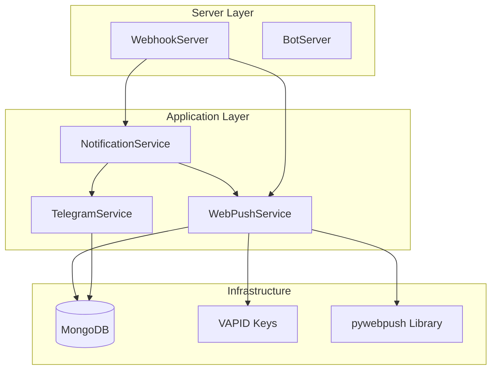
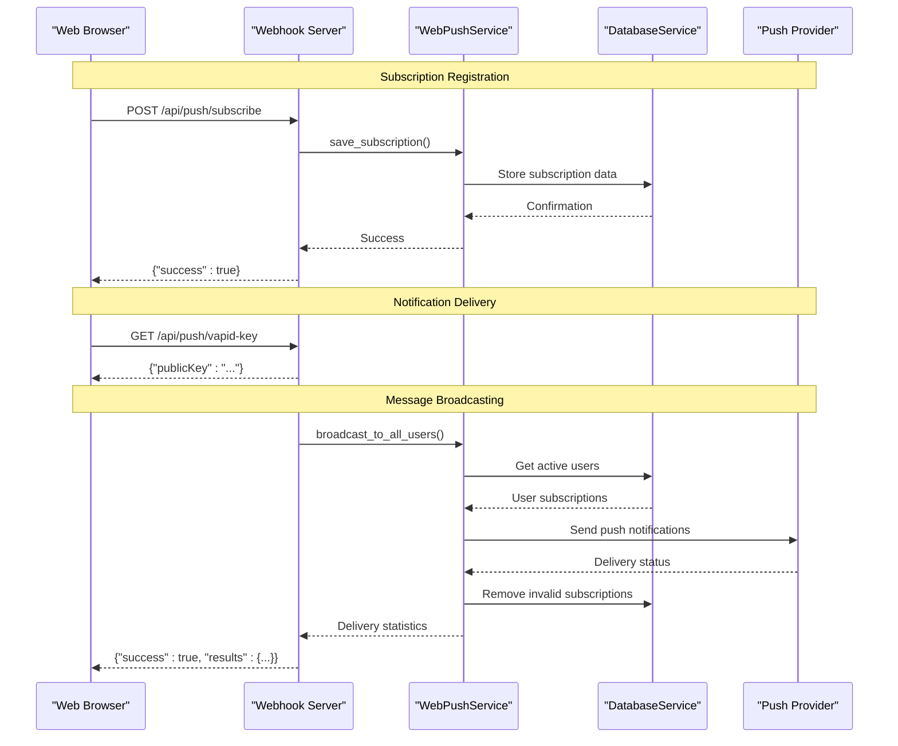
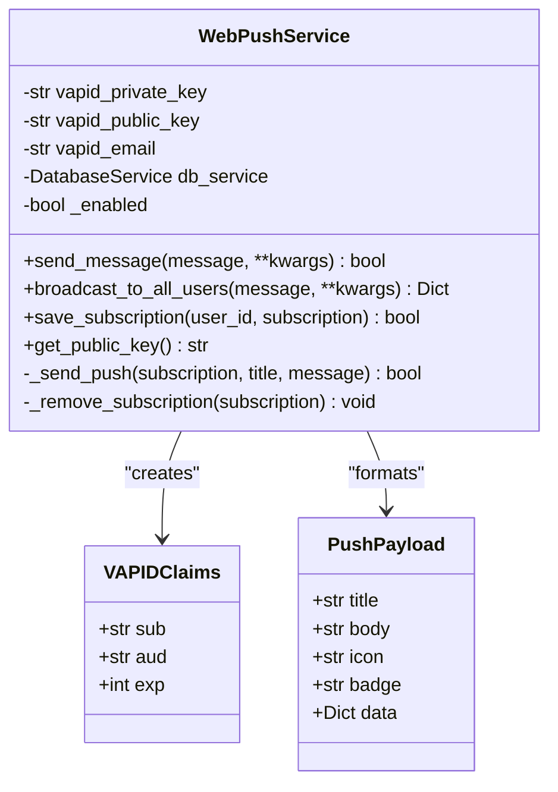
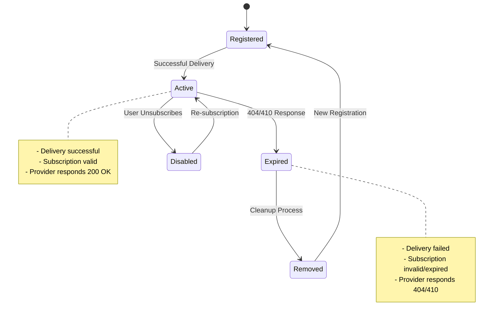
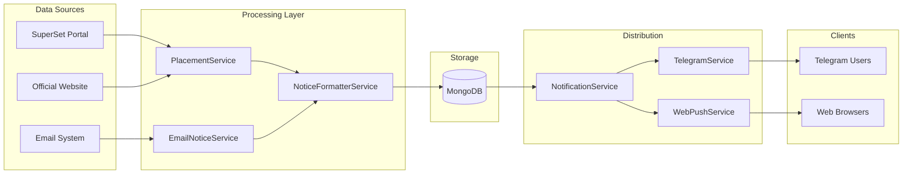
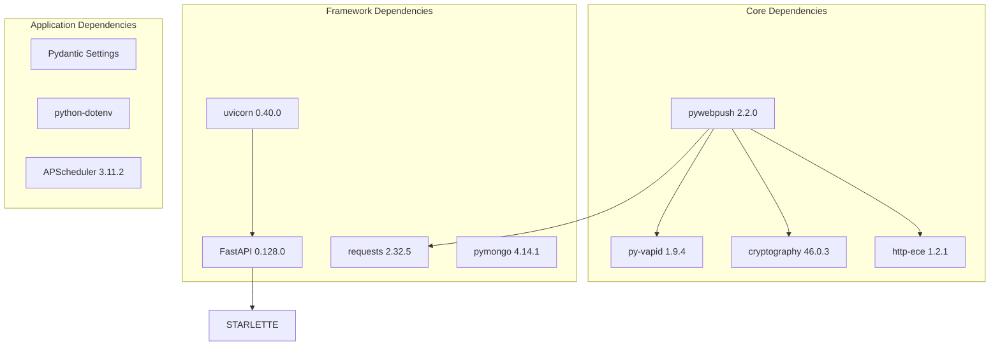

# Web push service

## Introduction
Web Push via VAPID: subscribe, unsubscribe, send, and clean up dead endpoints. How payloads differ from Telegram and where subscriptions live in MongoDB.

## Project structure
The Web Push Service is organized within the application's modular architecture, following service-oriented design principles :

```mermaid
graph TB
subgraph "Application Layer"
WS[WebPushService]
NS[NotificationService]
TS[TelegramService]
end
subgraph "Server Layer"
WH[WebhookServer]
BS[BotServer]
end
subgraph "Infrastructure"
DB[(MongoDB)]
VAPID[VAPID Keys]
PYWP[pywebpush Library]
end
WS --> DB
NS --> WS
NS --> TS
WH --> WS
WH --> NS
WS --> VAPID
WS --> PYWP
TS --> DB
```

## Core components
The Web Push Service consists of several interconnected components that work together to provide reliable browser notification delivery:

### WebPushService class
The primary service class that implements the INotificationChannel protocol, handling all aspects of web push notification delivery including VAPID authentication, subscription management, and payload formatting.

### VAPID authentication system
Implements Voluntary Application Server Identification for secure push notification delivery, requiring cryptographic keys and contact email for authentication with push providers.

### Subscription management
Manages user subscriptions through the database service, storing subscription endpoints and cryptographic keys associated with each user's browser installations.

### Notification delivery pipeline
Processes notification requests through a structured pipeline that formats payloads, applies VAPID signatures, and handles delivery failures with automatic cleanup of invalid subscriptions.

## Architecture overview
The Web Push Service operates within a detailed notification architecture that supports multiple delivery channels:

```mermaid
sequenceDiagram
participant Client as "Web Browser"
participant Server as "Webhook Server"
participant Service as "WebPushService"
participant DB as "DatabaseService"
participant Provider as "Push Provider"
Note over Client,Provider : Subscription Registration
Client->>Server : POST /api/push/subscribe
Server->>Service : save_subscription()
Service->>DB : Store subscription data
DB-->>Service : Confirmation
Service-->>Server : Success
Server-->>Client : {"success" : true}
Note over Client,Provider : Notification Delivery
Client->>Server : GET /api/push/vapid-key
Server-->>Client : {"publicKey" : "..."}
Note over Client,Provider : Message Broadcasting
Server->>Service : broadcast_to_all_users()
Service->>DB : Get active users
DB-->>Service : User subscriptions
Service->>Provider : Send push notifications
Provider-->>Service : Delivery status
Service->>DB : Remove invalid subscriptions
Service-->>Server : Delivery statistics
Server-->>Client : {"success" : true, "results" : {...}}
```

The architecture ensures smooth integration between web browsers and the notification system, with automatic handling of subscription lifecycle management and delivery failures.

## Detailed component analysis

### VAPID encryption implementation
The Web Push Service implements VAPID (Voluntary Application Server Identification) encryption for secure notification delivery:

```mermaid
classDiagram
class WebPushService {
-str vapid_private_key
-str vapid_public_key
-str vapid_email
-DatabaseService db_service
-bool _enabled
+send_message(message, **kwargs) bool
+broadcast_to_all_users(message, **kwargs) Dict
+save_subscription(user_id, subscription) bool
+get_public_key() str
-_send_push(subscription, title, message) bool
-_remove_subscription(subscription) void
}
class VAPIDClaims {
+str sub
+str aud
+int exp
}
class PushPayload {
+str title
+str body
+str icon
+str badge
+Dict data
}
WebPushService --> VAPIDClaims : "creates"
WebPushService --> PushPayload : "formats"
```

The VAPID implementation includes:
- **Private Key Management**: Cryptographic key for signing push requests
- **Public Key Distribution**: Shared with web clients for subscription verification
- **Claims Generation**: Creation of authentication claims with contact email
- **Signature Validation**: Verification of push provider authentication

### Browser subscription management
The service manages browser subscriptions through a structured lifecycle:

```mermaid
stateDiagram-v2
[*] --> Registered
Registered --> Active : Successful Delivery
Active --> Expired : 404/410 Response
Active --> Disabled : User Unsubscribes
Expired --> Removed : Cleanup Process
Disabled --> Active : Re-subscription
Removed --> Registered : New Registration
note right of Active
- Delivery successful
- Subscription valid
- Provider responds 200 OK
end note
note right of Expired
- Delivery failed
- Subscription invalid/expired
- Provider responds 404/410
end note
```

Subscription management includes:
- **Registration**: Storing subscription endpoints and cryptographic keys
- **Validation**: Periodic verification of subscription validity
- **Cleanup**: Automatic removal of expired or invalid subscriptions
- **Persistence**: Database storage of subscription data linked to user profiles

### Push notification delivery mechanisms
The notification delivery pipeline follows a standardized process:

```mermaid
flowchart TD
Start([Notification Request]) --> ValidateConfig["Validate VAPID Configuration"]
ValidateConfig --> ConfigOK{"Configuration Valid?"}
ConfigOK --> |No| SkipDelivery["Skip Delivery<br/>Return Success"]
ConfigOK --> |Yes| LoadSubscriptions["Load User Subscriptions"]
LoadSubscriptions --> HasSubs{"Has Subscriptions?"}
HasSubs --> |No| ReturnSuccess["Return Success<br/>No Subscriptions"]
HasSubs --> |Yes| FormatPayload["Format Notification Payload"]
FormatPayload --> SignVAPID["Apply VAPID Signature"]
SignVAPID --> SendPush["Send to Push Provider"]
SendPush --> CheckResponse{"Delivery Success?"}
CheckResponse --> |Yes| Success["Increment Success Count"]
CheckResponse --> |No| CheckStatus{"HTTP 404/410?"}
CheckStatus --> |Yes| RemoveSub["Remove Invalid Subscription"]
CheckStatus --> |No| LogError["Log Error"]
RemoveSub --> NextSub["Next Subscription"]
LogError --> NextSub
Success --> NextSub
NextSub --> MoreSubs{"More Subscriptions?"}
MoreSubs --> |Yes| SendPush
MoreSubs --> |No| ReturnResults["Return Delivery Statistics"]
SkipDelivery --> End([End])
ReturnSuccess --> End
ReturnResults --> End
```

### Integration with multi-channel notification ecosystem
The Web Push Service integrates with the broader notification ecosystem:

```mermaid
graph LR
subgraph "Data Sources"
SS[SuperSet Portal]
EM[Email System]
OW[Official Website]
end
subgraph "Processing Layer"
PS[PlacementService]
ES[EmailNoticeService]
FS[NoticeFormatterService]
end
subgraph "Storage"
DB[(MongoDB)]
end
subgraph "Distribution"
NS[NotificationService]
TS[TelegramService]
WS[WebPushService]
end
subgraph "Clients"
TG[Telegram Users]
WB[Web Browsers]
end
SS --> PS
EM --> ES
OW --> PS
PS --> FS
ES --> FS
FS --> DB
DB --> NS
NS --> TS
NS --> WS
TS --> TG
WS --> WB
```

## Dependency analysis
The Web Push Service relies on several key dependencies for secure and reliable operation:

```mermaid
graph TB
subgraph "Core Dependencies"
PYWP[pywebpush 2.2.0]
VAPID[py-vapid 1.9.4]
CRYPTO[cryptography 46.0.3]
HTTP_ECE[http-ece 1.2.1]
end
subgraph "Framework Dependencies"
FASTAPI[FastAPI 0.128.0]
UVICORN[uvicorn 0.40.0]
REQUESTS[requests 2.32.5]
PYMONGO[pymongo 4.14.1]
end
subgraph "Application Dependencies"
CONFIG[Pydantic Settings]
DOTENV[python-dotenv]
APSCHED[APScheduler 3.11.2]
end
PYWP --> VAPID
PYWP --> CRYPTO
PYWP --> HTTP_ECE
PYWP --> REQUESTS
FASTAPI --> STARLETTE
UVICORN --> FASTAPI
```

Dependency graph for the production path:
- **pywebpush**: Web Push protocol
- **py-vapid**: VAPID signatures
- **cryptography**: crypto primitives
- **http-ece**: payload encryption
- **FastAPI/uvicorn**: HTTP API

## Performance considerations
Performance notes:

### Asynchronous processing
- Non-blocking: webhook server uses FastAPI async handlers
- Connection pooling via PyMongo
- Batch sends where parallel is safe

### Resource management
- Lazy-load optional deps so missing VAPID libs do not crash import
- Truncate payloads; stream when it helps
- Reuse DB connections for the process lifetime

### Scalability features
- Keep running without VAPID keys (push just no-ops)
- One bad subscription does not fail the batch
- Drop 404/410 subscriptions so the list stays short

## Troubleshooting guide

### Common VAPID configuration issues
**Problem**: Web push notifications not working despite proper setup
**Solution**: Verify VAPID key configuration and provider compatibility

**Problem**: Subscription registration failing with HTTP 501
**Solution**: Check VAPID key availability and service initialization

**Problem**: Delivery failures with 404/410 responses
**Solution**: Automatic cleanup removes invalid subscriptions; verify subscription validity

### Subscription management issues
**Problem**: Subscriptions not persisting in database
**Solution**: Verify database connectivity and user ID mapping

**Problem**: Duplicate subscriptions accumulating
**Solution**: Implement subscription deduplication logic in database service

### Performance issues
**Problem**: Slow notification delivery
**Solution**: Monitor database query performance and optimize subscription retrieval

**Problem**: Memory leaks during high-volume delivery
**Solution**: Implement proper resource cleanup and connection pooling

## Conclusion
Web Push Service: VAPID, subscribe/unsubscribe, send, prune dead endpoints. Same SOA shape as the Telegram path, different transport.
