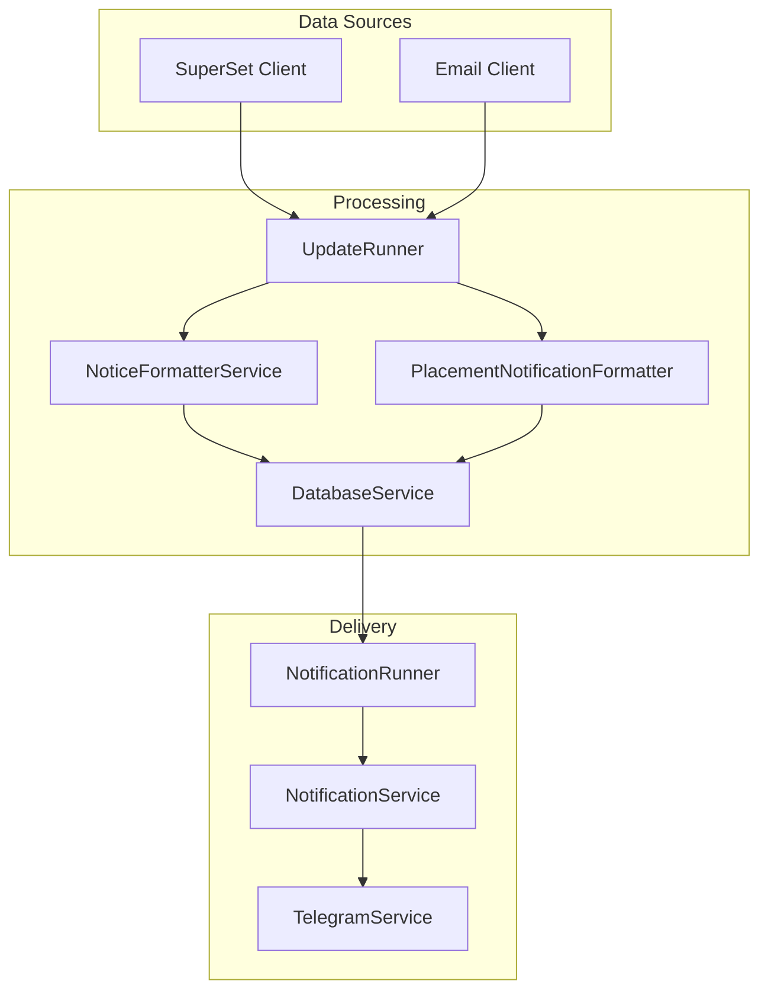
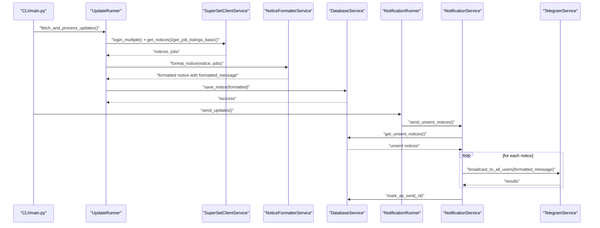
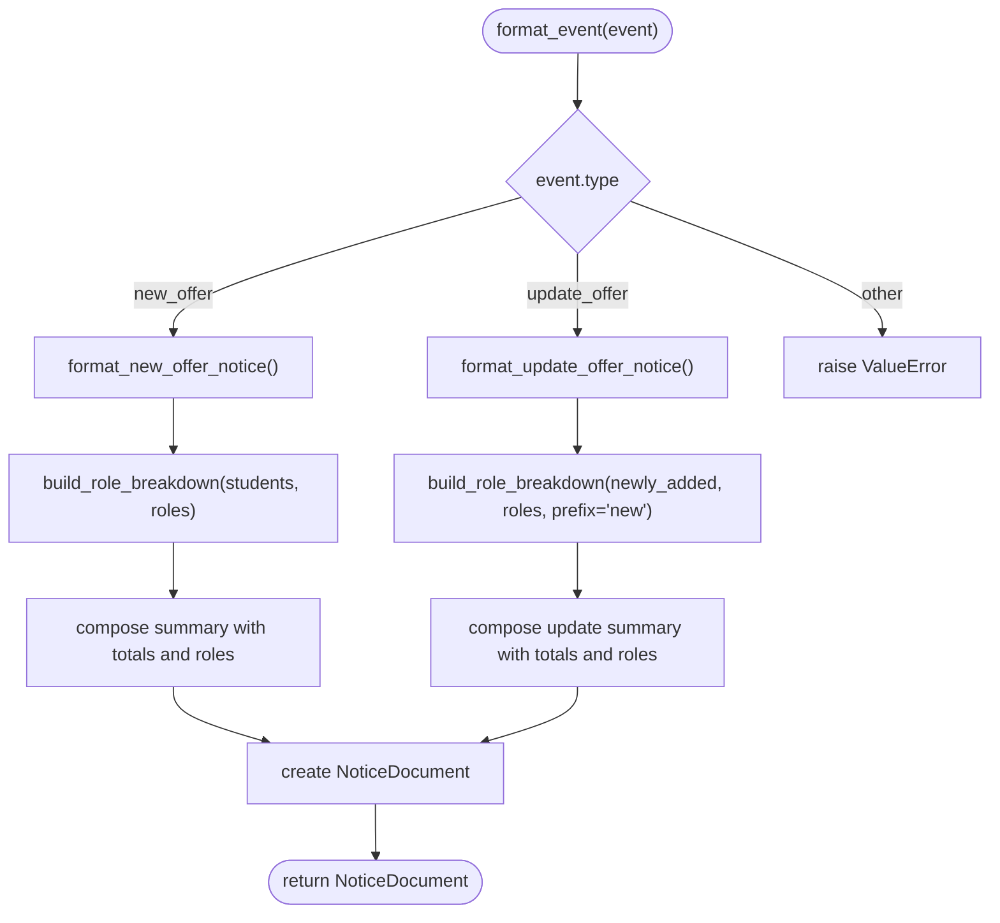
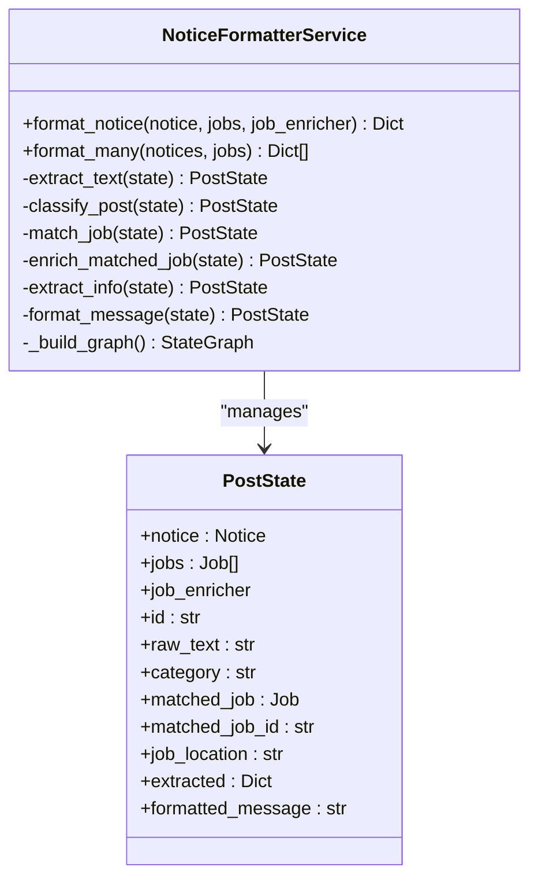
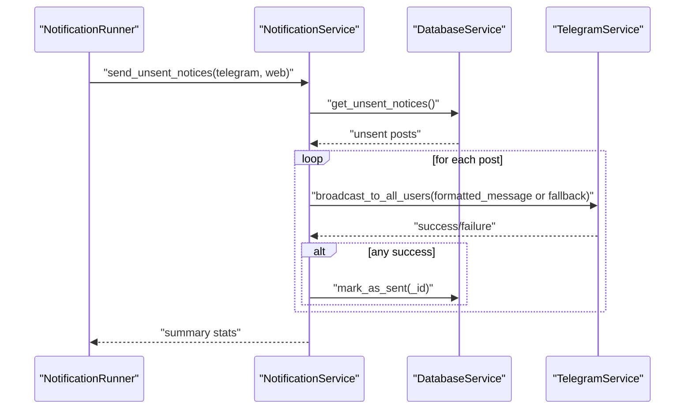
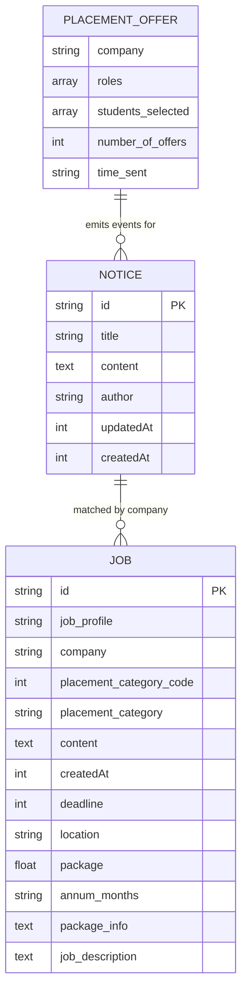
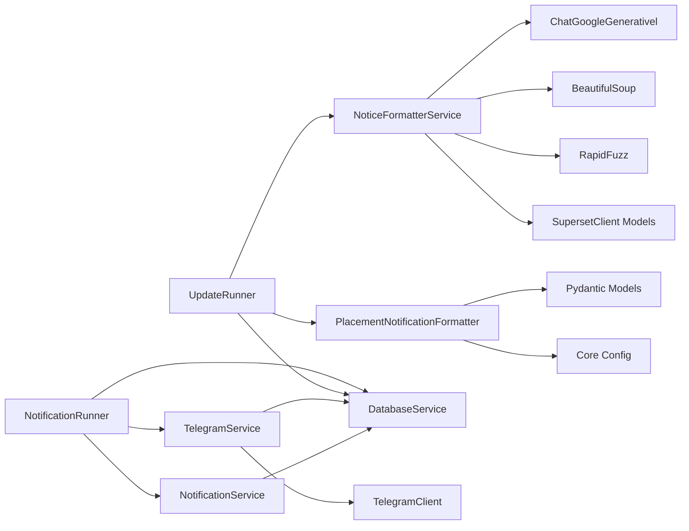

# Content Formatting & Enhancement

<cite>
**Referenced Files in This Document**
- [placement_notification_formatter.py](file://app/services/placement_notification_formatter.py)
- [notice_formatter_service.py](file://app/services/notice_formatter_service.py)
- [notification_service.py](file://app/services/notification_service.py)
- [telegram_service.py](file://app/services/telegram_service.py)
- [database_service.py](file://app/services/database_service.py)
- [notification_runner.py](file://app/runners/notification_runner.py)
- [update_runner.py](file://app/runners/update_runner.py)
- [superset_client.py](file://app/clients/superset_client.py)
- [config.py](file://app/core/config.py)
- [main.py](file://app/main.py)
- [structured_job_listings.json](file://app/data/structured_job_listings.json)
</cite>

## Table of Contents
1. [Introduction](#introduction)
2. [Project Structure](#project-structure)
3. [Core Components](#core-components)
4. [Architecture Overview](#architecture-overview)
5. [Detailed Component Analysis](#detailed-component-analysis)
6. [Dependency Analysis](#dependency-analysis)
7. [Performance Considerations](#performance-considerations)
8. [Troubleshooting Guide](#troubleshooting-guide)
9. [Conclusion](#conclusion)
10. [Appendices](#appendices)

## Introduction
This document explains the content formatting and enhancement services that transform raw, structured data into human-readable notifications for Telegram and other channels. It covers:
- Placement notification formatting for placement offers and updates
- General notice formatting with LLM-based classification, matching, and formatting
- Formatting rules, character limits, Markdown/HTML rendering, and media handling
- Integration with the notification delivery system
- Validation, sanitization, and accessibility considerations

## Project Structure
The formatting and enhancement pipeline spans multiple services:
- Data ingestion from SuperSet and email sources
- Structured job and notice models
- LLM-based notice formatter for categorization and formatting
- Placement-specific formatter for placement offers
- Database persistence and retrieval
- Notification dispatch to Telegram and web push channels

**Diagram sources**
- [update_runner.py](file://app/runners/update_runner.py#L21-L55)
- [notice_formatter_service.py](file://app/services/notice_formatter_service.py#L48-L62)
- [placement_notification_formatter.py](file://app/services/placement_notification_formatter.py#L102-L118)
- [database_service.py](file://app/services/database_service.py#L16-L46)
- [notification_runner.py](file://app/runners/notification_runner.py#L21-L59)
- [notification_service.py](file://app/services/notification_service.py#L13-L36)
- [telegram_service.py](file://app/services/telegram_service.py#L20-L52)

**Section sources**
- [main.py](file://app/main.py#L370-L439)
- [config.py](file://app/core/config.py#L18-L128)

## Core Components
- PlacementNotificationFormatter: Transforms placement offer events into NoticeDocument instances with human-readable summaries and role breakdowns.
- NoticeFormatterService: LLM-powered notice formatter that classifies content, matches jobs, extracts structured data, and formats Telegram-ready messages.
- DatabaseService: Persists notices, jobs, placement offers, and user data; provides retrieval and status reporting.
- NotificationService and TelegramService: Orchestrate and deliver notifications to Telegram and other channels, with message splitting and Markdown/HTML conversion.
- UpdateRunner and NotificationRunner: Orchestration layers that coordinate data fetching, formatting, persistence, and delivery.

**Section sources**
- [placement_notification_formatter.py](file://app/services/placement_notification_formatter.py#L102-L118)
- [notice_formatter_service.py](file://app/services/notice_formatter_service.py#L48-L62)
- [database_service.py](file://app/services/database_service.py#L16-L46)
- [notification_service.py](file://app/services/notification_service.py#L13-L36)
- [telegram_service.py](file://app/services/telegram_service.py#L20-L52)
- [update_runner.py](file://app/runners/update_runner.py#L21-L55)
- [notification_runner.py](file://app/runners/notification_runner.py#L21-L59)

## Architecture Overview
The system separates concerns across ingestion, formatting, persistence, and delivery:
- Ingestion: SuperSetClientService and email clients supply notices and jobs.
- Formatting: NoticeFormatterService uses LLM classification and extraction; PlacementNotificationFormatter builds placement summaries.
- Persistence: DatabaseService stores notices, jobs, offers, and user data.
- Delivery: NotificationService coordinates channels; TelegramService renders Markdown/HTML and splits long messages.

**Diagram sources**
- [main.py](file://app/main.py#L98-L102)
- [update_runner.py](file://app/runners/update_runner.py#L56-L148)
- [superset_client.py](file://app/clients/superset_client.py#L88-L120)
- [notice_formatter_service.py](file://app/services/notice_formatter_service.py#L795-L866)
- [database_service.py](file://app/services/database_service.py#L80-L147)
- [notification_runner.py](file://app/runners/notification_runner.py#L60-L115)
- [notification_service.py](file://app/services/notification_service.py#L93-L167)
- [telegram_service.py](file://app/services/telegram_service.py#L140-L172)

## Detailed Component Analysis

### Placement Notification Formatter
Responsibilities:
- Accept placement events (new offer or update with newly added students)
- Build role-wise breakdowns and totals
- Format human-readable summaries with optional time sent attribution
- Produce NoticeDocument objects for persistence and delivery

Key behaviors:
- Role breakdown aggregation with pluralization and optional package display
- Author attribution from email sender or default
- IST timestamp formatting for createdAt/updatedAt
- Optional time_sent inclusion from event or offer data

Formatting rules:
- New offer: concise summary of total placements and role breakdowns
- Update offer: highlights newly placed students, total count, and role breakdowns with “new” prefix
- Package formatting: converts numeric packages to readable strings (e.g., LPA or formatted Rupees)

**Diagram sources**
- [placement_notification_formatter.py](file://app/services/placement_notification_formatter.py#L304-L344)
- [placement_notification_formatter.py](file://app/services/placement_notification_formatter.py#L192-L247)
- [placement_notification_formatter.py](file://app/services/placement_notification_formatter.py#L249-L302)

**Section sources**
- [placement_notification_formatter.py](file://app/services/placement_notification_formatter.py#L102-L118)
- [placement_notification_formatter.py](file://app/services/placement_notification_formatter.py#L120-L139)
- [placement_notification_formatter.py](file://app/services/placement_notification_formatter.py#L140-L190)
- [placement_notification_formatter.py](file://app/services/placement_notification_formatter.py#L192-L247)
- [placement_notification_formatter.py](file://app/services/placement_notification_formatter.py#L249-L302)
- [placement_notification_formatter.py](file://app/services/placement_notification_formatter.py#L304-L344)
- [placement_notification_formatter.py](file://app/services/placement_notification_formatter.py#L346-L379)

### Notice Formatter Service (LLM-based)
Responsibilities:
- Classify notices into categories (update, shortlisting, announcement, hackathon, webinar, job posting)
- Extract structured information based on category
- Match notices to jobs and optionally enrich matched jobs
- Format Telegram-ready messages with Markdown/HTML

Processing pipeline:
- extract_text: Clean text from HTML content
- classify_post: Single-label classification using LLM
- match_job: Extract company names and fuzzy-match to jobs
- enrich_matched_job: Optional enrichment callback
- extract_info: JSON extraction of structured fields
- format_message: Compose final formatted message with category-specific formatting rules

Formatting rules:
- Announcement: Lightweight passthrough with attribution footer
- Update: LLM-guided concise formatting with Markdown/HTML
- Shortlisting: Lists total shortlisted and student names with role/company
- Webinar/Hackathon: Date/time, venue/platform, registration link, deadlines
- Job posting: Company, role, location, package (with monthly/yearly suffix), eligibility criteria, hiring flow, deadline, and link to details

**Diagram sources**
- [notice_formatter_service.py](file://app/services/notice_formatter_service.py#L28-L46)
- [notice_formatter_service.py](file://app/services/notice_formatter_service.py#L48-L62)
- [notice_formatter_service.py](file://app/services/notice_formatter_service.py#L202-L215)
- [notice_formatter_service.py](file://app/services/notice_formatter_service.py#L217-L255)
- [notice_formatter_service.py](file://app/services/notice_formatter_service.py#L257-L319)
- [notice_formatter_service.py](file://app/services/notice_formatter_service.py#L321-L348)
- [notice_formatter_service.py](file://app/services/notice_formatter_service.py#L350-L390)
- [notice_formatter_service.py](file://app/services/notice_formatter_service.py#L392-L774)

**Section sources**
- [notice_formatter_service.py](file://app/services/notice_formatter_service.py#L48-L62)
- [notice_formatter_service.py](file://app/services/notice_formatter_service.py#L202-L215)
- [notice_formatter_service.py](file://app/services/notice_formatter_service.py#L217-L255)
- [notice_formatter_service.py](file://app/services/notice_formatter_service.py#L257-L319)
- [notice_formatter_service.py](file://app/services/notice_formatter_service.py#L321-L348)
- [notice_formatter_service.py](file://app/services/notice_formatter_service.py#L350-L390)
- [notice_formatter_service.py](file://app/services/notice_formatter_service.py#L392-L774)
- [notice_formatter_service.py](file://app/services/notice_formatter_service.py#L776-L792)
- [notice_formatter_service.py](file://app/services/notice_formatter_service.py#L795-L866)

### Notification Delivery Pipeline
Responsibilities:
- Aggregate multiple channels (Telegram, Web Push)
- Retrieve unsent notices from database
- Broadcast messages to users with rate limiting and retries
- Mark notices as sent upon successful delivery

Key behaviors:
- Channel routing and broadcasting
- Fallback to content if formatted_message is missing
- Chunking and retry logic for long messages
- Markdown/HTML conversion and escaping

**Diagram sources**
- [notification_runner.py](file://app/runners/notification_runner.py#L60-L115)
- [notification_service.py](file://app/services/notification_service.py#L93-L167)
- [database_service.py](file://app/services/database_service.py#L116-L147)
- [telegram_service.py](file://app/services/telegram_service.py#L140-L172)

**Section sources**
- [notification_service.py](file://app/services/notification_service.py#L13-L36)
- [notification_service.py](file://app/services/notification_service.py#L61-L92)
- [notification_service.py](file://app/services/notification_service.py#L93-L167)
- [notification_service.py](file://app/services/notification_service.py#L169-L236)
- [telegram_service.py](file://app/services/telegram_service.py#L20-L52)
- [telegram_service.py](file://app/services/telegram_service.py#L62-L122)
- [telegram_service.py](file://app/services/telegram_service.py#L140-L172)
- [telegram_service.py](file://app/services/telegram_service.py#L174-L212)
- [telegram_service.py](file://app/services/telegram_service.py#L218-L253)
- [telegram_service.py](file://app/services/telegram_service.py#L282-L301)
- [telegram_service.py](file://app/services/telegram_service.py#L304-L345)

### Data Models and Integration
- Notice and Job models define the structure for notices and job listings.
- Structured job listings are persisted and used for matching.
- Placement offers are merged and emitted as events for notification formatting.

**Diagram sources**
- [superset_client.py](file://app/clients/superset_client.py#L37-L86)
- [database_service.py](file://app/services/database_service.py#L274-L437)

**Section sources**
- [superset_client.py](file://app/clients/superset_client.py#L37-L86)
- [database_service.py](file://app/services/database_service.py#L205-L268)
- [database_service.py](file://app/services/database_service.py#L274-L437)
- [structured_job_listings.json](file://app/data/structured_job_listings.json#L1-L800)

## Dependency Analysis
- NoticeFormatterService depends on:
  - LLM (ChatGoogleGenerativel) for classification and extraction
  - BeautifulSoup for HTML parsing
  - RapidFuzz for fuzzy matching of company names
  - SupersetClient models (Notice, Job, EligibilityMark) for unified typing
- PlacementNotificationFormatter depends on:
  - Pydantic models for typed data structures
  - Core config for safe printing/logging
- NotificationService and TelegramService depend on:
  - DatabaseService for retrieving unsent notices and user lists
  - TelegramClient for actual message sending
- UpdateRunner and NotificationRunner orchestrate dependencies via DI.

**Diagram sources**
- [notice_formatter_service.py](file://app/services/notice_formatter_service.py#L14-L25)
- [notice_formatter_service.py](file://app/services/notice_formatter_service.py#L48-L62)
- [placement_notification_formatter.py](file://app/services/placement_notification_formatter.py#L102-L118)
- [notification_service.py](file://app/services/notification_service.py#L13-L36)
- [telegram_service.py](file://app/services/telegram_service.py#L20-L52)
- [update_runner.py](file://app/runners/update_runner.py#L21-L55)
- [notification_runner.py](file://app/runners/notification_runner.py#L21-L59)

**Section sources**
- [notice_formatter_service.py](file://app/services/notice_formatter_service.py#L14-L25)
- [placement_notification_formatter.py](file://app/services/placement_notification_formatter.py#L102-L118)
- [notification_service.py](file://app/services/notification_service.py#L13-L36)
- [telegram_service.py](file://app/services/telegram_service.py#L20-L52)
- [update_runner.py](file://app/runners/update_runner.py#L21-L55)
- [notification_runner.py](file://app/runners/notification_runner.py#L21-L59)

## Performance Considerations
- LLM calls: Classification, extraction, and formatting involve external LLM calls. Use batching and caching where appropriate.
- Message length: Telegram messages are chunked at 4000 characters; ensure formatted content respects this limit to avoid truncation.
- Rate limiting: TelegramService applies small delays between broadcasts to avoid rate limits.
- Database operations: Efficient ID lookups and bulk operations reduce latency for notice/job synchronization.
- Fuzzy matching: Company name matching uses token-set ratio scoring; tune thresholds to balance precision/recall.

[No sources needed since this section provides general guidance]

## Troubleshooting Guide
Common issues and resolutions:
- LLM formatting failures: Extraction JSON parsing errors are handled gracefully; review extracted blocks and refine prompts.
- Telegram delivery failures: TelegramService retries without formatting when parse_mode fails; verify bot token and chat ID configuration.
- Long messages: Automatic chunking occurs; verify chunk sizes and ensure message continuity.
- Notice persistence: DatabaseService returns explicit errors for missing IDs or initialization issues; confirm collection availability.
- Job enrichment: Enrichment callback requires matched job presence; otherwise, fallback to extracted data.

**Section sources**
- [notice_formatter_service.py](file://app/services/notice_formatter_service.py#L380-L390)
- [telegram_service.py](file://app/services/telegram_service.py#L97-L99)
- [telegram_service.py](file://app/services/telegram_service.py#L116-L121)
- [telegram_service.py](file://app/services/telegram_service.py#L180-L200)
- [telegram_service.py](file://app/services/telegram_service.py#L218-L253)
- [database_service.py](file://app/services/database_service.py#L80-L104)
- [database_service.py](file://app/services/database_service.py#L116-L147)

## Conclusion
The formatting and enhancement services provide a robust pipeline for transforming diverse content into consistent, readable notifications. PlacementNotificationFormatter focuses on placement-specific summaries, while NoticeFormatterService leverages LLM classification and extraction for general notices. The system integrates cleanly with database persistence and multi-channel delivery, with careful attention to message length, formatting, and reliability.

[No sources needed since this section summarizes without analyzing specific files]

## Appendices

### Formatting Rules and Examples

- Placement new offer summary:
  - Example structure: Total placements, role breakdowns, optional time_sent attribution, and a celebratory note.
  - Use case: Announce placement results for a company.

- Placement update summary:
  - Example structure: Highlight newly placed students, total count, role breakdowns with “new” prefix, and celebratory note.

- Announcement passthrough:
  - Example structure: Title bolded, body lightly prettified, attribution footer with author and posted date.

- Update via LLM:
  - Example structure: Category-specific concise formatting with Markdown/HTML, emojis, and footers.

- Shortlisting:
  - Example structure: Total shortlisted, student list, role/company, optional package info and hiring flow.

- Webinar:
  - Example structure: Event title, topic, speaker, date/time, venue/platform, registration link, deadline.

- Hackathon:
  - Example structure: Event title, theme, duration, team size, prize pool, venue/platform, registration link, deadline.

- Job posting:
  - Example structure: Company, role, location, package (with monthly/yearly suffix), eligibility criteria, hiring flow, deadline, and link to details.

**Section sources**
- [placement_notification_formatter.py](file://app/services/placement_notification_formatter.py#L192-L247)
- [placement_notification_formatter.py](file://app/services/placement_notification_formatter.py#L249-L302)
- [notice_formatter_service.py](file://app/services/notice_formatter_service.py#L414-L424)
- [notice_formatter_service.py](file://app/services/notice_formatter_service.py#L426-L480)
- [notice_formatter_service.py](file://app/services/notice_formatter_service.py#L482-L528)
- [notice_formatter_service.py](file://app/services/notice_formatter_service.py#L529-L590)
- [notice_formatter_service.py](file://app/services/notice_formatter_service.py#L591-L653)
- [notice_formatter_service.py](file://app/services/notice_formatter_service.py#L654-L774)

### Character Limits and Media Handling
- Telegram message length: Messages exceeding 4000 characters are automatically split into chunks.
- Media attachments: The current implementation focuses on text formatting; images or documents are not embedded by default. Links and HTML anchors are supported for external resources.

**Section sources**
- [telegram_service.py](file://app/services/telegram_service.py#L74-L96)
- [telegram_service.py](file://app/services/telegram_service.py#L181-L196)
- [telegram_service.py](file://app/services/telegram_service.py#L218-L253)
- [telegram_service.py](file://app/services/telegram_service.py#L304-L345)

### Integration with Notification Delivery
- Channels: Telegram and Web Push channels are supported; channel selection is configurable.
- Fallbacks: If formatted_message is missing, a fallback composed from title and content is used.
- Persistence: Notices are marked as sent after successful delivery to at least one channel.

**Section sources**
- [notification_runner.py](file://app/runners/notification_runner.py#L77-L98)
- [notification_service.py](file://app/services/notification_service.py#L61-L92)
- [notification_service.py](file://app/services/notification_service.py#L169-L236)
- [database_service.py](file://app/services/database_service.py#L135-L147)

### Configuration and Environment
- Settings include Telegram bot token, chat ID, SuperSet credentials, Google API key, and logging configuration.
- Safe printing and daemon mode support are integrated for production runs.

**Section sources**
- [config.py](file://app/core/config.py#L18-L128)
- [config.py](file://app/core/config.py#L145-L154)
- [config.py](file://app/core/config.py#L188-L253)