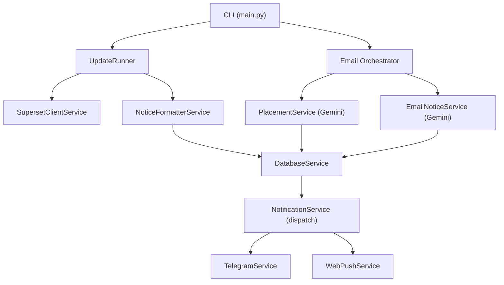
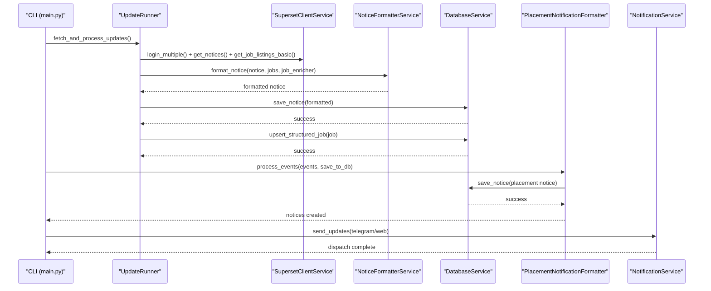
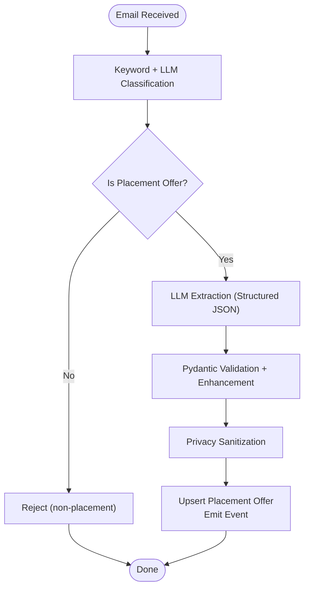
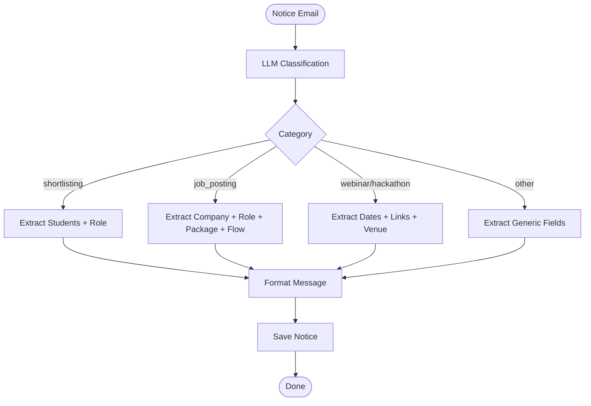
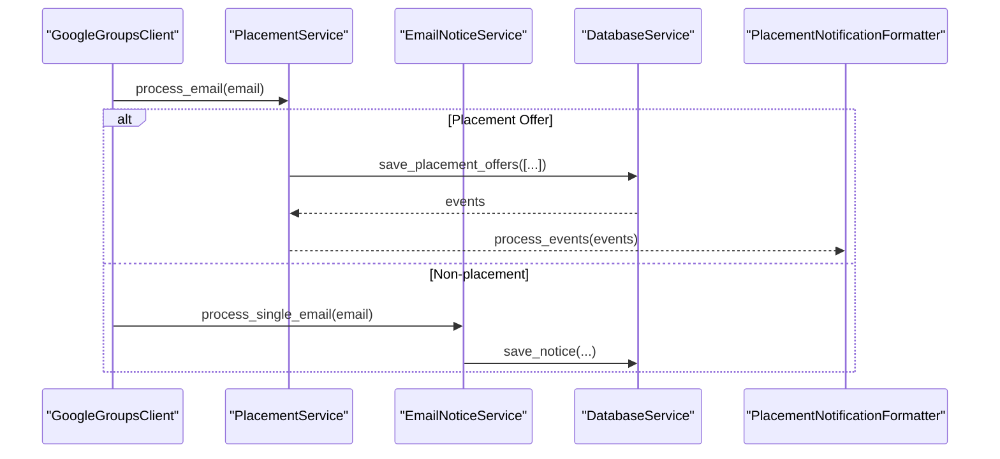
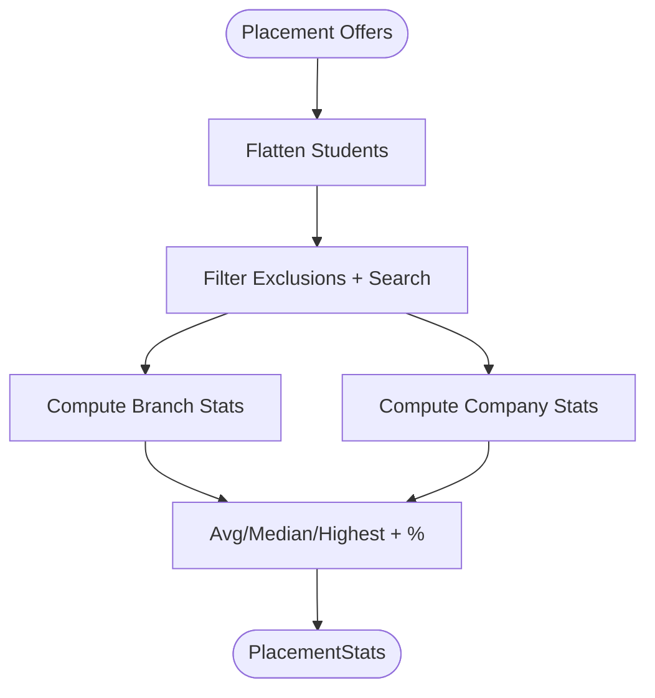
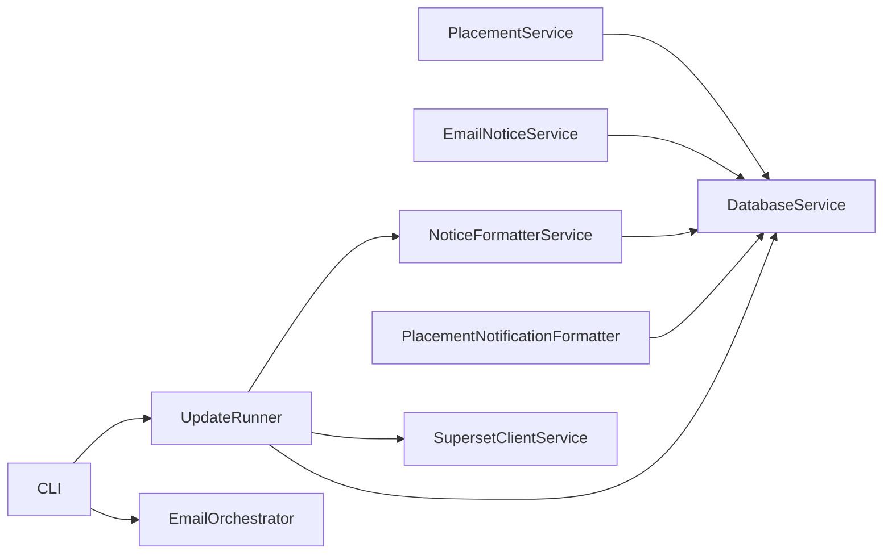

# Data Processing & Content Extraction

<cite>
**Referenced Files in This Document**
- [app/main.py](file://app/main.py)
- [app/README.md](file://app/README.md)
- [docs/ARCHITECTURE.md](file://docs/ARCHITECTURE.md)
- [app/services/placement_service.py](file://app/services/placement_service.py)
- [app/services/email_notice_service.py](file://app/services/email_notice_service.py)
- [app/services/notice_formatter_service.py](file://app/services/notice_formatter_service.py)
- [app/services/placement_notification_formatter.py](file://app/services/placement_notification_formatter.py)
- [app/services/placement_stats_calculator_service.py](file://app/services/placement_stats_calculator_service.py)
- [app/services/database_service.py](file://app/services/database_service.py)
- [app/runners/update_runner.py](file://app/runners/update_runner.py)
</cite>

## Table of Contents
1. [Introduction](#introduction)
2. [Project Structure](#project-structure)
3. [Core Components](#core-components)
4. [Architecture Overview](#architecture-overview)
5. [Detailed Component Analysis](#detailed-component-analysis)
6. [Dependency Analysis](#dependency-analysis)
7. [Performance Considerations](#performance-considerations)
8. [Troubleshooting Guide](#troubleshooting-guide)
9. [Conclusion](#conclusion)

## Introduction
This document explains the data processing and content extraction pipeline of the SuperSet Telegram Notification Bot. It focuses on:
- LLM-powered placement offer extraction using Google Gemini
- Content formatting and enhancement for notices
- Notice classification algorithms
- Transformation of raw portal data and emails into structured notifications
- Placement statistics computation
- Content validation and sanitization
- Duplicate detection mechanisms
- LangChain integration and prompt engineering
- Quality assurance measures
- Consistency of processed data across notification channels

## Project Structure
The system is organized as a modular, service-oriented architecture with clear separation of concerns:
- CLI entry point orchestrates data ingestion, processing, and distribution
- Services encapsulate domain logic (extraction, formatting, persistence, statistics)
- Clients abstract external integrations (SuperSet, Google Groups, Telegram)
- Runners coordinate update cycles
- Docs define architecture and configuration

**Diagram sources**
- [app/main.py](file://app/main.py#L98-L242)
- [app/runners/update_runner.py](file://app/runners/update_runner.py#L56-L148)
- [app/services/placement_service.py](file://app/services/placement_service.py#L419-L800)
- [app/services/email_notice_service.py](file://app/services/email_notice_service.py#L335-L800)
- [app/services/notice_formatter_service.py](file://app/services/notice_formatter_service.py#L48-L800)
- [app/services/database_service.py](file://app/services/database_service.py#L16-L795)

**Section sources**
- [app/README.md](file://app/README.md#L1-L252)
- [docs/ARCHITECTURE.md](file://docs/ARCHITECTURE.md#L1-L678)

## Core Components
- PlacementService: LLM-based classification and extraction of placement offers from emails; privacy sanitization; emits events for notifications
- EmailNoticeService: LLM-based classification and extraction of general notices; supports policy updates
- NoticeFormatterService: Formats notices for Telegram consumption; enriches matched jobs and applies content enhancements
- PlacementNotificationFormatter: Transforms placement events into notification-ready notices
- DatabaseService: Upserts notices/jobs/placement offers; generates events; deduplicates; tracks sent status
- UpdateRunner: Coordinates portal data fetching and processing; optimizes by pre-checking existing IDs
- CLI orchestrator: Executes update-emails, update-supersets, and combined update + send flows

**Section sources**
- [app/services/placement_service.py](file://app/services/placement_service.py#L419-L800)
- [app/services/email_notice_service.py](file://app/services/email_notice_service.py#L335-L800)
- [app/services/notice_formatter_service.py](file://app/services/notice_formatter_service.py#L48-L800)
- [app/services/placement_notification_formatter.py](file://app/services/placement_notification_formatter.py#L102-L380)
- [app/services/database_service.py](file://app/services/database_service.py#L16-L795)
- [app/runners/update_runner.py](file://app/runners/update_runner.py#L21-L278)
- [app/main.py](file://app/main.py#L98-L242)

## Architecture Overview
The pipeline integrates three primary data sources:
- SuperSet portal: Notices and job profiles
- Google Groups/Gmail: Placement offers and general notices
- Official website: Placement statistics

**Diagram sources**
- [app/runners/update_runner.py](file://app/runners/update_runner.py#L56-L237)
- [app/services/notice_formatter_service.py](file://app/services/notice_formatter_service.py#L777-L792)
- [app/services/database_service.py](file://app/services/database_service.py#L80-L148)
- [app/services/placement_notification_formatter.py](file://app/services/placement_notification_formatter.py#L346-L380)
- [app/main.py](file://app/main.py#L265-L281)

## Detailed Component Analysis

### Placement Offer Extraction with Google Gemini
- Classification: Keyword-based confidence scoring plus LLM final validation
- Extraction: Structured JSON schema enforced by LLM prompts; robust retry logic
- Validation: Pydantic models, cross-field consistency checks, package normalization
- Privacy: Sanitization of headers, forwarded markers, and sender metadata
- Events: Emits new_offer/update_offer events for downstream notification formatting

**Diagram sources**
- [app/services/placement_service.py](file://app/services/placement_service.py#L507-L800)
- [app/services/database_service.py](file://app/services/database_service.py#L274-L441)

**Section sources**
- [app/services/placement_service.py](file://app/services/placement_service.py#L146-L246)
- [app/services/placement_service.py](file://app/services/placement_service.py#L419-L800)
- [app/services/database_service.py](file://app/services/database_service.py#L274-L441)

### Notice Classification and Content Formatting
- Classification: Strict single-label classifier for categories (update, shortlisting, announcement, hackathon, webinar, job posting)
- Extraction: Structured extraction per category with JSON schema enforcement
- Enrichment: Optional job enrichment callback to fetch detailed job info mid-pipeline
- Formatting: Human-friendly Telegram messages with emojis, bold headers, and deadlines

**Diagram sources**
- [app/services/email_notice_service.py](file://app/services/email_notice_service.py#L147-L327)
- [app/services/notice_formatter_service.py](file://app/services/notice_formatter_service.py#L217-L774)

**Section sources**
- [app/services/email_notice_service.py](file://app/services/email_notice_service.py#L147-L327)
- [app/services/notice_formatter_service.py](file://app/services/notice_formatter_service.py#L217-L774)

### Data Transformation Pipeline (Raw → Structured → Notifications)
- SuperSet:
  - Fetch notices and basic job listings
  - Filter by existing IDs
  - Enrich only new jobs
  - Format notices with optional job enrichment
  - Persist notices and jobs
- Emails:
  - Sequential orchestration: fetch unread IDs, process one by one, mark read after success
  - PlacementService first; if not placement, EmailNoticeService
  - Upsert notices/placement offers; emit events for notifications

**Diagram sources**
- [app/main.py](file://app/main.py#L152-L242)
- [app/services/placement_service.py](file://app/services/placement_service.py#L419-L800)
- [app/services/email_notice_service.py](file://app/services/email_notice_service.py#L335-L800)
- [app/services/database_service.py](file://app/services/database_service.py#L274-L441)
- [app/services/placement_notification_formatter.py](file://app/services/placement_notification_formatter.py#L346-L380)

**Section sources**
- [app/main.py](file://app/main.py#L152-L242)
- [app/services/database_service.py](file://app/services/database_service.py#L274-L441)

### Placement Statistics Calculation Service
- Flattens placement offers into student records
- Filters by branch rules and exclusions
- Computes unique students, total offers, average/median/highest packages
- Aggregates by branch and company
- Provides available filters for UI

**Diagram sources**
- [app/services/placement_stats_calculator_service.py](file://app/services/placement_stats_calculator_service.py#L418-L800)

**Section sources**
- [app/services/placement_stats_calculator_service.py](file://app/services/placement_stats_calculator_service.py#L1-L800)

### Content Validation and Sanitization
- PlacementService:
  - Validation: Company length, presence of students, role consistency, number_of_offers alignment
  - Enhancement: Assign default role/package when single role exists
  - Privacy: Strip headers, forwarded markers, inline sender mentions
- EmailNoticeService:
  - Validation: Title/content/type presence
  - Privacy: Restrict to notice content; avoid forwarding headers
- NoticeFormatterService:
  - Pretty-printing, package formatting, date/time localization, HTML breakdown parsing

**Section sources**
- [app/services/placement_service.py](file://app/services/placement_service.py#L706-L790)
- [app/services/email_notice_service.py](file://app/services/email_notice_service.py#L570-L590)
- [app/services/notice_formatter_service.py](file://app/services/notice_formatter_service.py#L104-L200)

### Duplicate Detection Mechanisms
- Notices: Upsert by ID; existence check prevents duplicates
- Jobs: Upsert by ID; merges updates preserving timestamps
- Placement Offers: Upsert by company; merges roles and students; detects newly added students to emit update events
- Policies: Hash-based content comparison to avoid repeated inserts

**Section sources**
- [app/services/database_service.py](file://app/services/database_service.py#L56-L104)
- [app/services/database_service.py](file://app/services/database_service.py#L205-L257)
- [app/services/database_service.py](file://app/services/database_service.py#L274-L441)
- [app/services/database_service.py](file://app/services/database_service.py#L443-L484)

### LangChain Integration and Prompt Engineering
- LangGraph workflows for PlacementService, EmailNoticeService, and NoticeFormatterService
- ChatGoogleGenerativeAI integration with Gemini models
- Carefully crafted prompts:
  - Placement extraction: strict criteria for “final placement offer,” package requirements, privacy rules
  - Notice classification: single-label taxonomy with tie-break rules
  - Notice extraction: category-specific JSON schemas
  - Notice formatting: style and structure rules for Telegram readability

**Section sources**
- [app/services/placement_service.py](file://app/services/placement_service.py#L146-L246)
- [app/services/email_notice_service.py](file://app/services/email_notice_service.py#L147-L327)
- [app/services/notice_formatter_service.py](file://app/services/notice_formatter_service.py#L217-L480)

### Quality Assurance Measures
- Retry logic for LLM extraction failures
- Graceful degradation: continue processing despite individual failures
- Sequential email processing to prevent data loss and race conditions
- Validation layers at multiple stages (schema, content, privacy)
- Event-driven notifications to decouple formatting from persistence

**Section sources**
- [app/services/placement_service.py](file://app/services/placement_service.py#L601-L705)
- [app/services/email_notice_service.py](file://app/services/email_notice_service.py#L532-L568)
- [app/main.py](file://app/main.py#L169-L226)

## Dependency Analysis
- Coupling: Services depend on DatabaseService and external clients via constructor injection
- Cohesion: Each service has a single responsibility (extraction, formatting, persistence, statistics)
- External dependencies: LangChain, Google Gemini, MongoDB, Telegram Bot API, Web Push
- No circular dependencies observed among core services

**Diagram sources**
- [app/services/placement_service.py](file://app/services/placement_service.py#L419-L478)
- [app/services/email_notice_service.py](file://app/services/email_notice_service.py#L335-L392)
- [app/services/notice_formatter_service.py](file://app/services/notice_formatter_service.py#L48-L792)
- [app/services/placement_notification_formatter.py](file://app/services/placement_notification_formatter.py#L102-L118)
- [app/runners/update_runner.py](file://app/runners/update_runner.py#L21-L54)
- [app/main.py](file://app/main.py#L98-L151)

**Section sources**
- [app/services/database_service.py](file://app/services/database_service.py#L16-L795)
- [docs/ARCHITECTURE.md](file://docs/ARCHITECTURE.md#L120-L296)

## Performance Considerations
- Sequential email processing avoids DB conflicts and ensures reliability
- Batch operations: process multiple emails sequentially; batch notifications by channel
- Caching: settings cached; reuse DB connections within service lifetime
- Indexing: MongoDB indexes on frequently queried fields (IDs, sent flags)
- LLM retries: bounded retry with exponential backoff-like behavior

[No sources needed since this section provides general guidance]

## Troubleshooting Guide
- LLM extraction failures:
  - PlacementService: retry up to threshold; logs validation errors; returns rejection reason
  - EmailNoticeService: retry twice; falls back to basic extraction if advanced policy extraction fails
- Email processing:
  - Sequential orchestration marks read only after successful save or irrelevant classification
  - Errors are logged; email remains unread to allow retry
- Database errors:
  - Existence checks and upserts prevent duplicates; errors logged with context
- CLI commands:
  - Use verbose mode for detailed logs
  - Use stop/status to manage daemons

**Section sources**
- [app/services/placement_service.py](file://app/services/placement_service.py#L601-L705)
- [app/services/email_notice_service.py](file://app/services/email_notice_service.py#L532-L568)
- [app/main.py](file://app/main.py#L169-L226)
- [app/services/database_service.py](file://app/services/database_service.py#L56-L104)

## Conclusion
The SuperSet Telegram Notification Bot implements a robust, modular pipeline that transforms raw data from SuperSet and emails into structured, formatted notifications. Through LLM-powered classification and extraction, strict validation and sanitization, and event-driven notification formatting, it ensures high-quality, consistent delivery across Telegram and Web Push channels. The design emphasizes reliability, maintainability, and scalability via dependency injection, LangGraph workflows, and careful duplicate detection.