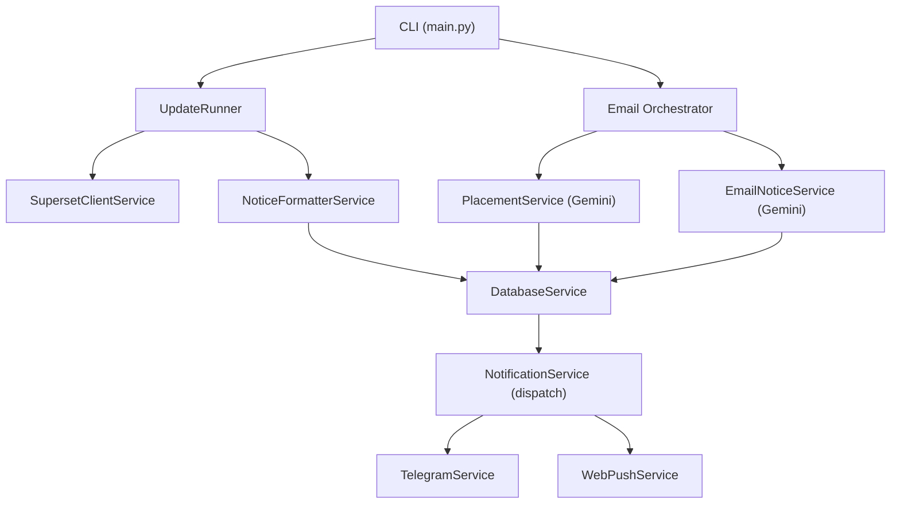
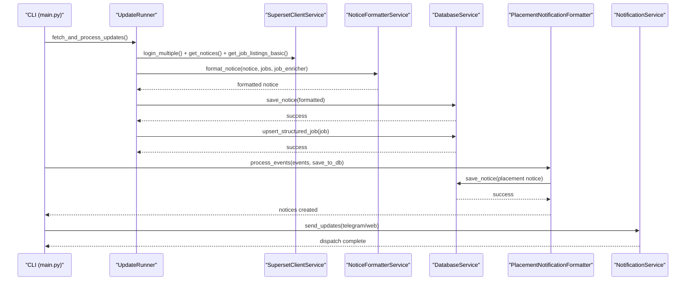
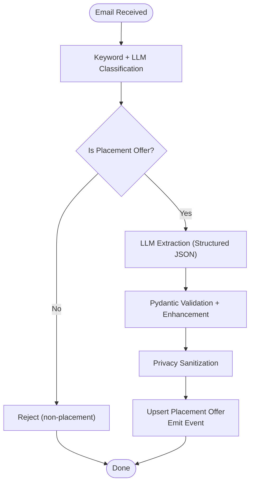
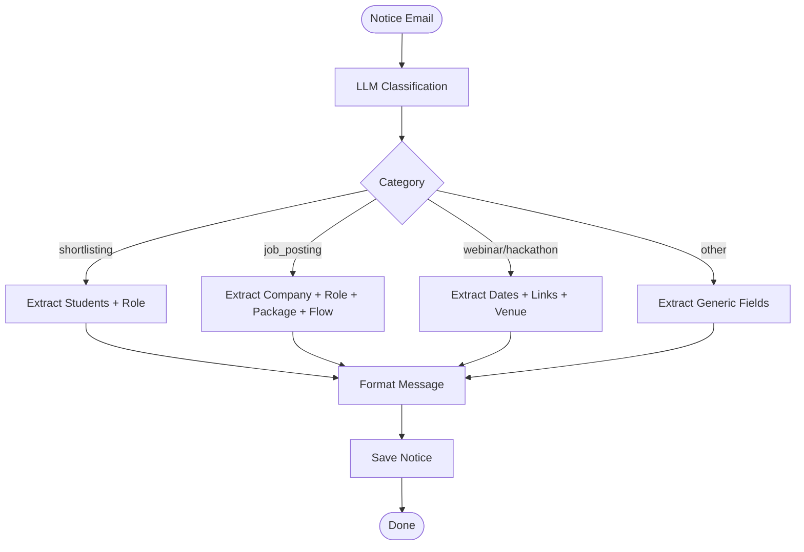
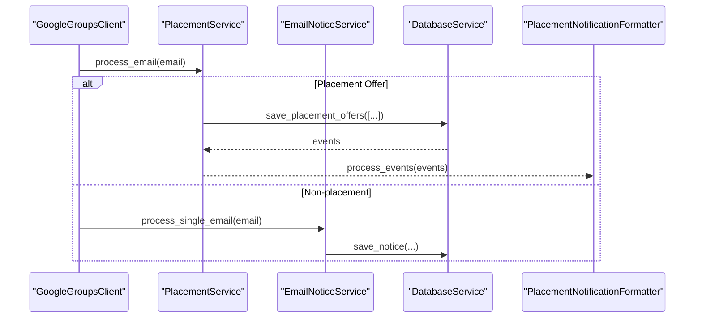
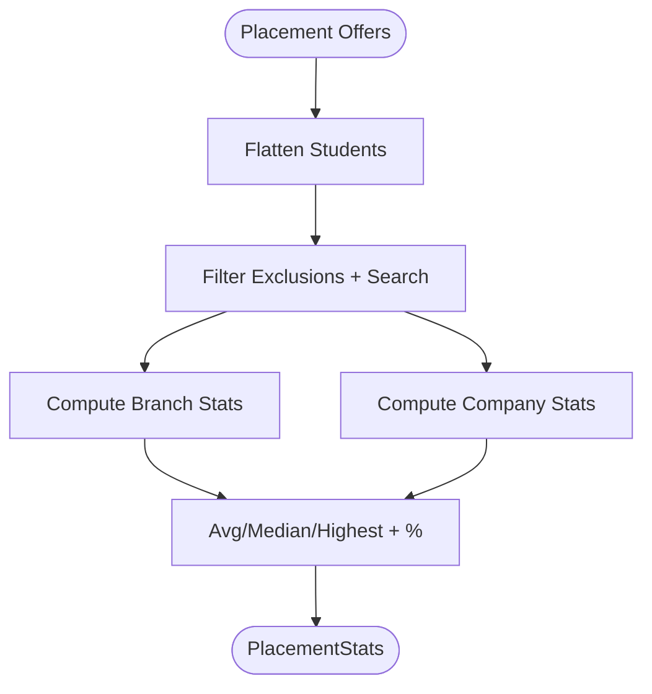
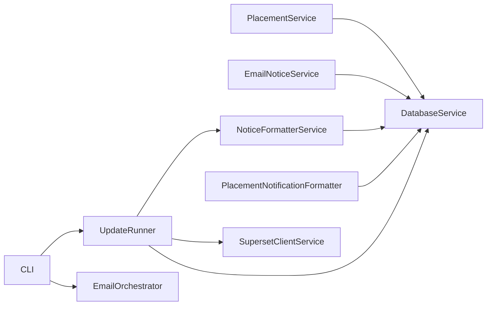

# Data processing & content extraction

## Introduction
This page explains the data processing and content extraction pipeline of the SuperSet Telegram Notification Bot. It focuses on:
- LLM-powered placement offer extraction using Google Gemini
- Content formatting and enhancement for notices
- Notice classification algorithms
- Transformation of raw portal data and emails into structured notifications
- Placement statistics computation
- Content validation and sanitization
- Duplicate detection mechanisms
- LangChain integration and prompt engineering
- Quality assurance measures
- Consistency of processed data across notification channels

## Project structure
The system is organized as a modular, service-oriented architecture with clear separation of concerns:
- CLI entry point orchestrates data ingestion, processing, and distribution
- Services encapsulate domain logic (extraction, formatting, persistence, statistics)
- Clients abstract external integrations (SuperSet, Google Groups, Telegram)
- Runners coordinate update cycles
- Docs define architecture and configuration

```mermaid
graph TB
CLI["CLI (main.py)"] --> UpdateRunner["UpdateRunner"]
CLI --> EmailOrchestrator["Email Orchestrator"]
UpdateRunner --> SupersetClient["SupersetClientService"]
UpdateRunner --> NoticeFormatter["NoticeFormatterService"]
EmailOrchestrator --> PlacementService["PlacementService (Gemini)"]
EmailOrchestrator --> EmailNoticeService["EmailNoticeService (Gemini)"]
PlacementService --> DB["DatabaseService"]
EmailNoticeService --> DB
NoticeFormatter --> DB
DB --> Notifier["NotificationService (dispatch)"]
Notifier --> Telegram["TelegramService"]
Notifier --> WebPush["WebPushService"]
```

## Core components
- PlacementService: LLM-based classification and extraction of placement offers from emails; privacy sanitization; emits events for notifications
- EmailNoticeService: LLM-based classification and extraction of general notices; supports policy updates
- NoticeFormatterService: Formats notices for Telegram consumption; enriches matched jobs and applies content enhancements
- PlacementNotificationFormatter: Transforms placement events into notification-ready notices
- DatabaseService: Upserts notices/jobs/placement offers; generates events; deduplicates; tracks sent status
- UpdateRunner: Coordinates portal data fetching and processing; optimizes by pre-checking existing IDs
- CLI orchestrator: Executes update-emails, update-supersets, and combined update + send flows

## Architecture overview
The pipeline integrates three primary data sources:
- SuperSet portal: Notices and job profiles
- Google Groups/Gmail: Placement offers and general notices
- Official website: Placement statistics

```mermaid
sequenceDiagram
participant CLI as "CLI (main.py)"
participant UR as "UpdateRunner"
participant SC as "SupersetClientService"
participant NFS as "NoticeFormatterService"
participant DB as "DatabaseService"
participant PNF as "PlacementNotificationFormatter"
participant NS as "NotificationService"
CLI->>UR : fetch_and_process_updates()
UR->>SC : login_multiple() + get_notices() + get_job_listings_basic()
UR->>NFS : format_notice(notice, jobs, job_enricher)
NFS-->>UR : formatted notice
UR->>DB : save_notice(formatted)
DB-->>UR : success
UR->>DB : upsert_structured_job(job)
DB-->>UR : success
CLI->>PNF : process_events(events, save_to_db)
PNF->>DB : save_notice(placement notice)
DB-->>PNF : success
PNF-->>CLI : notices created
CLI->>NS : send_updates(telegram/web)
NS-->>CLI : dispatch complete
```

## Detailed component analysis

### Placement offer extraction with Google gemini
- Classification: Keyword-based confidence scoring plus LLM final validation
- Extraction: Structured JSON schema enforced by LLM prompts; reliable retry logic
- Validation: Pydantic models, cross-field consistency checks, package normalization
- Privacy: Sanitization of headers, forwarded markers, and sender metadata
- Events: Emits new_offer/update_offer events for downstream notification formatting

```mermaid
flowchart TD
Start(["Email Received"]) --> Classify["Keyword + LLM Classification"]
Classify --> IsRel{"Is Placement Offer?"}
IsRel --> |No| Skip["Reject (non-placement)"]
IsRel --> |Yes| Extract["LLM Extraction (Structured JSON)"]
Extract --> Validate["Pydantic Validation + Enhancement"]
Validate --> Sanitize["Privacy Sanitization"]
Sanitize --> Upsert["Upsert Placement Offer<br/>Emit Event"]
Skip --> End(["Done"])
Upsert --> End
```

### Notice classification and content formatting
- Classification: Strict single-label classifier for categories (update, shortlisting, announcement, hackathon, webinar, job posting)
- Extraction: Structured extraction per category with JSON schema enforcement
- Enrichment: Optional job enrichment callback to fetch detailed job info mid-pipeline
- Formatting: Human-friendly Telegram messages with emojis, bold headers, and deadlines

```mermaid
flowchart TD
Start(["Notice Email"]) --> LLMClass["LLM Classification"]
LLMClass --> Cat{"Category"}
Cat --> |shortlisting| ExtractShortlist["Extract Students + Role"]
Cat --> |job_posting| ExtractJob["Extract Company + Role + Package + Flow"]
Cat --> |webinar/hackathon| ExtractEvent["Extract Dates + Links + Venue"]
Cat --> |other| ExtractGeneric["Extract Generic Fields"]
ExtractShortlist --> Format["Format Message"]
ExtractJob --> Format
ExtractEvent --> Format
ExtractGeneric --> Format
Format --> Save["Save Notice"]
Save --> End(["Done"])
```

### Data transformation pipeline (raw → structured → notifications)
- SuperSet:
  - Fetch notices and basic job listings
  - Filter by existing IDs
  - Enrich only new jobs
  - Format notices with optional job enrichment
  - Persist notices and jobs
- Emails:
  - Sequential orchestration: fetch unread IDs, process one by one, mark read after success
  - PlacementService first; if not placement, EmailNoticeService
  - Upsert notices/placement offers; emit events for notifications

```mermaid
sequenceDiagram
participant G as "GoogleGroupsClient"
participant PS as "PlacementService"
participant DNS as "EmailNoticeService"
participant DB as "DatabaseService"
participant PNF as "PlacementNotificationFormatter"
G->>PS : process_email(email)
alt Placement Offer
PS->>DB : save_placement_offers([...])
DB-->>PS : events
PS-->>PNF : process_events(events)
else Non-placement
G->>DNS : process_single_email(email)
DNS->>DB : save_notice(...)
end
```

### Placement statistics calculation service
- Flattens placement offers into student records
- Filters by branch rules and exclusions
- Computes unique students, total offers, average/median/highest packages
- Aggregates by branch and company
- Provides available filters for UI

```mermaid
flowchart TD
Start(["Placement Offers"]) --> Flatten["Flatten Students"]
Flatten --> Filter["Filter Exclusions + Search"]
Filter --> Branch["Compute Branch Stats"]
Filter --> Company["Compute Company Stats"]
Branch --> Metrics["Avg/Median/Highest + %"]
Company --> Metrics
Metrics --> Output(["PlacementStats"])
```

### Content validation and sanitization
- PlacementService:
  - Validation: Company length, presence of students, role consistency, number_of_offers alignment
  - Enhancement: Assign default role/package when single role exists
  - Privacy: Strip headers, forwarded markers, inline sender mentions
- EmailNoticeService:
  - Validation: Title/content/type presence
  - Privacy: Restrict to notice content; avoid forwarding headers
- NoticeFormatterService:
  - Pretty-printing, package formatting, date/time localization, HTML breakdown parsing

### Duplicate detection mechanisms
- Notices: Upsert by ID; existence check prevents duplicates
- Jobs: Upsert by ID; merges updates preserving timestamps
- Placement Offers: Upsert by company; merges roles and students; detects newly added students to emit update events
- Policies: Hash-based content comparison to avoid repeated inserts

### LangChain integration and prompt engineering
- LangGraph workflows for PlacementService, EmailNoticeService, and NoticeFormatterService
- ChatGoogleGenerativeAI integration with Gemini models
- Carefully crafted prompts:
  - Placement extraction: strict criteria for "final placement offer," package requirements, privacy rules
  - Notice classification: single-label taxonomy with tie-break rules
  - Notice extraction: category-specific JSON schemas
  - Notice formatting: style and structure rules for Telegram readability

### Quality assurance measures
- Retry logic for LLM extraction failures
- Graceful degradation: continue processing despite individual failures
- Sequential email processing to prevent data loss and race conditions
- Validation layers at multiple stages (schema, content, privacy)
- Event-driven notifications to decouple formatting from persistence

## Dependency analysis
- Coupling: Services depend on DatabaseService and external clients via constructor injection
- Cohesion: Each service has a single responsibility (extraction, formatting, persistence, statistics)
- External dependencies: LangChain, Google Gemini, MongoDB, Telegram Bot API, Web Push
- No circular dependencies observed among core services

```mermaid
graph LR
PlacementService --> DatabaseService
EmailNoticeService --> DatabaseService
NoticeFormatterService --> DatabaseService
PlacementNotificationFormatter --> DatabaseService
UpdateRunner --> SupersetClientService
UpdateRunner --> NoticeFormatterService
UpdateRunner --> DatabaseService
CLI --> UpdateRunner
CLI --> EmailOrchestrator
```

## Performance considerations
- Sequential email processing avoids DB conflicts and ensures reliability
- Batch operations: process multiple emails sequentially; batch notifications by channel
- Caching: settings cached; reuse DB connections within service lifetime
- Indexing: MongoDB indexes on frequently queried fields (IDs, sent flags)
- LLM retries: bounded retry with exponential backoff-like behavior

[No sources needed since this section provides general guidance]

## Troubleshooting guide
- LLM extraction failures:
  - PlacementService: retry up to threshold; logs validation errors; returns rejection reason
  - EmailNoticeService: retry twice; falls back to basic extraction if advanced policy extraction fails
- Email processing:
  - Sequential orchestration marks read only after successful save or irrelevant classification
  - Errors are logged; email remains unread to allow retry
- Database errors:
  - Existence checks and upserts prevent duplicates; errors logged with context
- CLI commands:
  - Use verbose mode for detailed logs
  - Use stop/status to manage daemons

## Conclusion
The SuperSet Telegram Notification Bot implements a reliable, modular pipeline that transforms raw data from SuperSet and emails into structured, formatted notifications. Through LLM-powered classification and extraction, strict validation and sanitization, and event-driven notification formatting, it ensures high-quality, consistent delivery across Telegram and Web Push channels. The design emphasizes reliability, maintainability, and scalability via dependency injection, LangGraph workflows, and careful duplicate detection.
