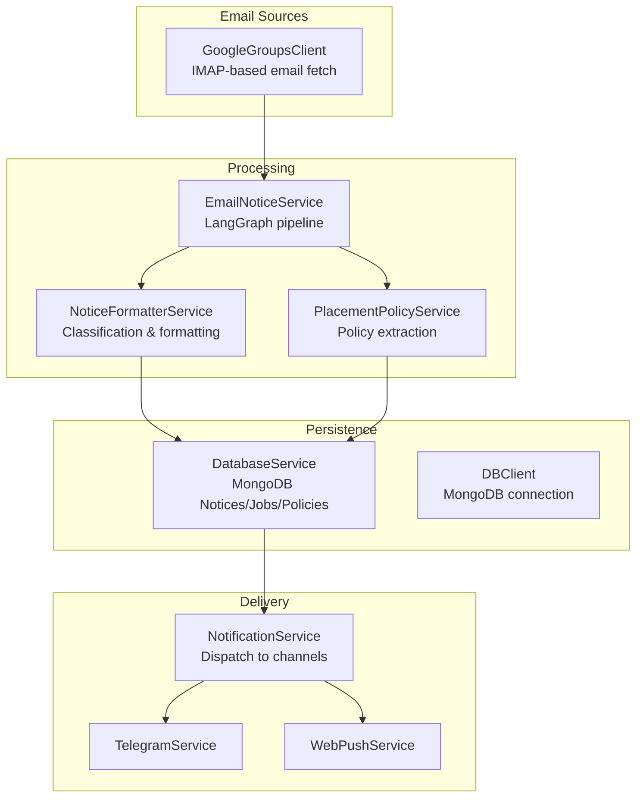
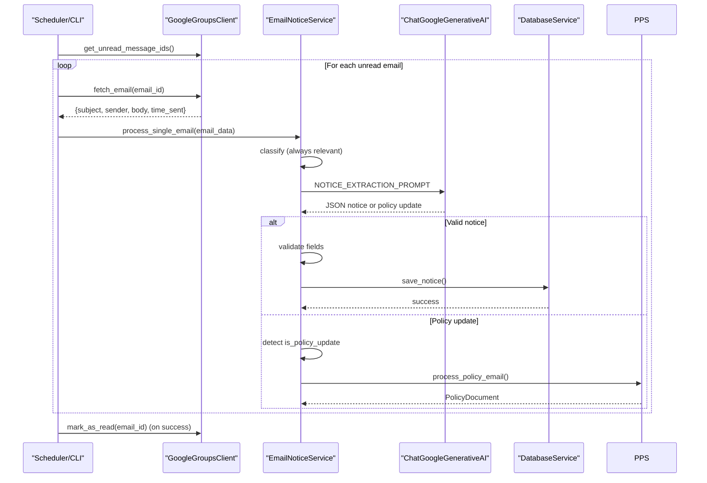
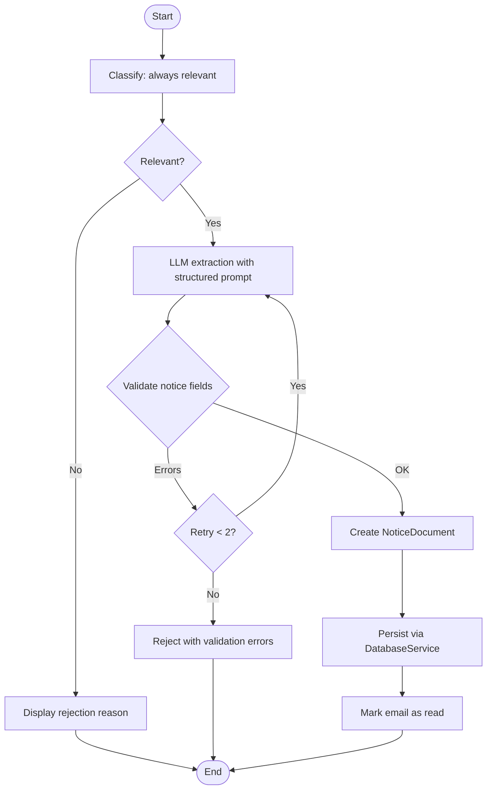
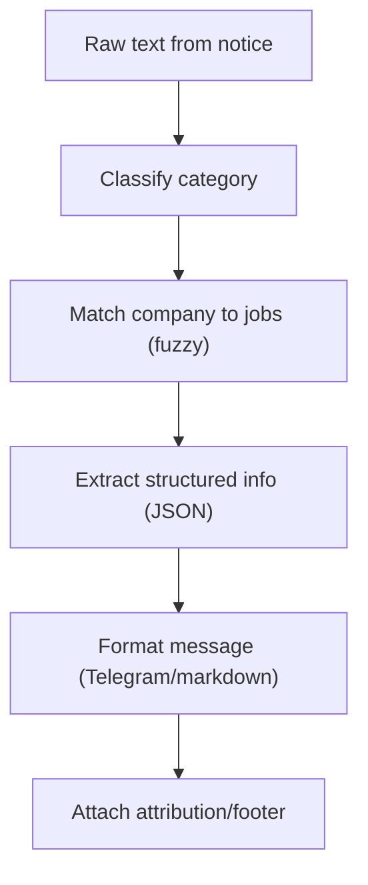
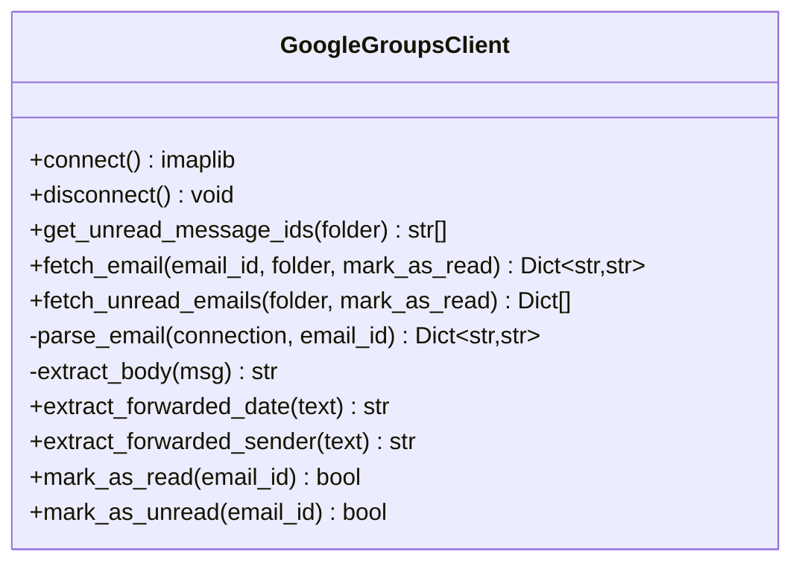
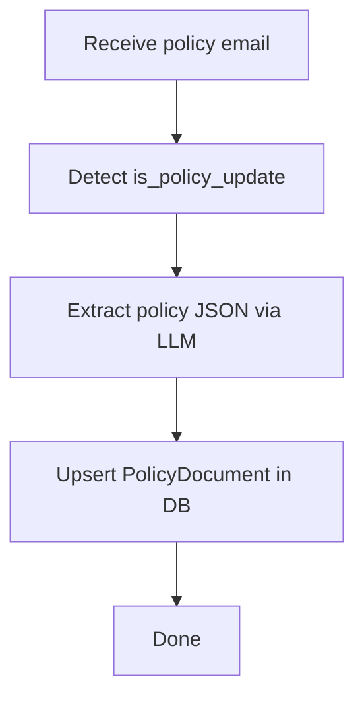
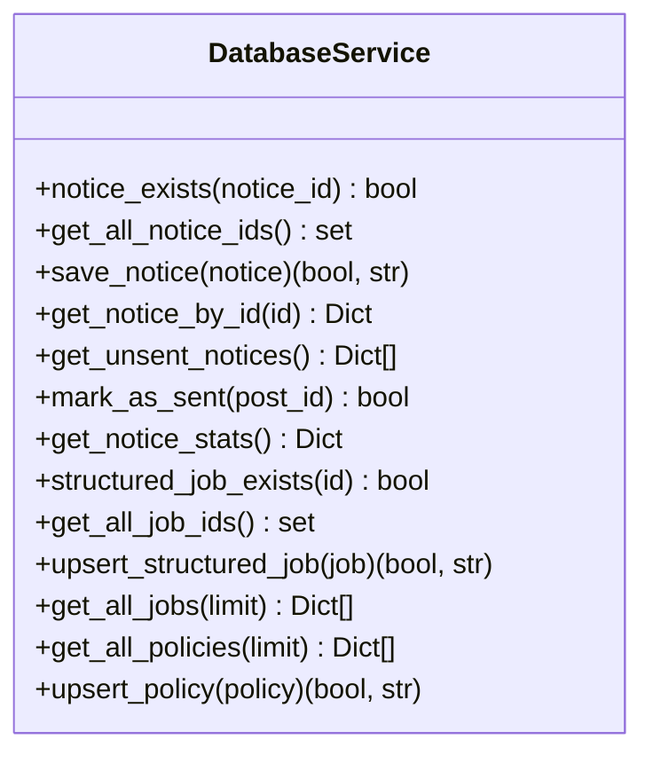
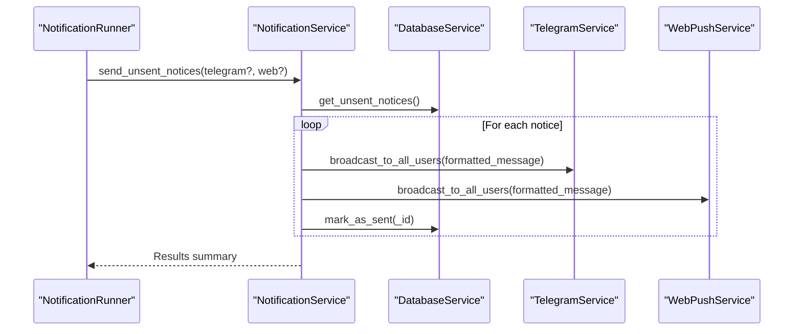
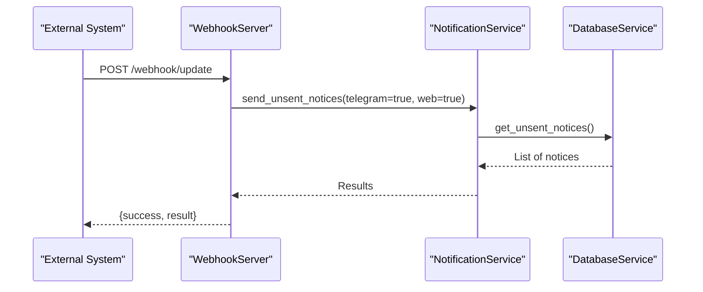
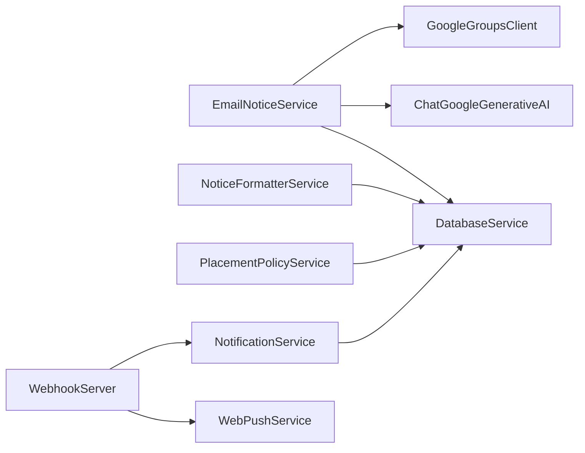

# Email Processing & Classification

<cite>
**Referenced Files in This Document**
- [email_notice_service.py](file://app/services/email_notice_service.py)
- [notice_formatter_service.py](file://app/services/notice_formatter_service.py)
- [google_groups_client.py](file://app/clients/google_groups_client.py)
- [placement_policy_service.py](file://app/services/placement_policy_service.py)
- [database_service.py](file://app/services/database_service.py)
- [notification_service.py](file://app/services/notification_service.py)
- [webhook_server.py](file://app/servers/webhook_server.py)
- [update_runner.py](file://app/runners/update_runner.py)
- [notification_runner.py](file://app/runners/notification_runner.py)
- [main.py](file://app/main.py)
- [config.py](file://app/core/config.py)
- [db_client.py](file://app/clients/db_client.py)
- [README.md](file://README.md)
</cite>

## Table of Contents
1. [Introduction](#introduction)
2. [Project Structure](#project-structure)
3. [Core Components](#core-components)
4. [Architecture Overview](#architecture-overview)
5. [Detailed Component Analysis](#detailed-component-analysis)
6. [Dependency Analysis](#dependency-analysis)
7. [Performance Considerations](#performance-considerations)
8. [Troubleshooting Guide](#troubleshooting-guide)
9. [Conclusion](#conclusion)
10. [Appendices](#appendices)

## Introduction
This document explains the email processing and classification system that powers the notification pipeline for general notices and updates. It covers:
- Notice classification algorithms using LLM-based prompts
- Email parsing pipeline (headers, bodies, metadata)
- Notice types, priority, filtering, and content enrichment
- Integration with email clients, authentication, and batch processing
- Examples of processed data structures, accuracy considerations, and handling of malformed or suspicious emails

## Project Structure
The email processing system centers around a LangGraph pipeline that classifies incoming emails and extracts structured notices. It integrates with:
- Google Groups client for fetching unread emails
- LLM prompts for classification and extraction
- Database persistence for notices and policy documents
- Notification dispatch for Telegram and web push

**Diagram sources**
- [email_notice_service.py](file://app/services/email_notice_service.py#L335-L800)
- [notice_formatter_service.py](file://app/services/notice_formatter_service.py#L48-L800)
- [google_groups_client.py](file://app/clients/google_groups_client.py#L19-L465)
- [placement_policy_service.py](file://app/services/placement_policy_service.py#L200-L588)
- [database_service.py](file://app/services/database_service.py#L16-L795)
- [notification_service.py](file://app/services/notification_service.py#L13-L237)

**Section sources**
- [README.md](file://README.md#L176-L233)
- [main.py](file://app/main.py#L105-L243)

## Core Components
- EmailNoticeService: Orchestrates LLM-based classification and extraction for general notices; handles placement policy detection and fallbacks.
- NoticeFormatterService: Provides classification, enrichment, and formatting for notices and job postings.
- GoogleGroupsClient: Decodes email headers, extracts forwarded metadata, and normalizes dates to IST.
- PlacementPolicyService: Specialized extraction for placement policy updates into structured Markdown with TOC generation.
- DatabaseService: Persists notices, jobs, policies, and manages deduplication and stats.
- NotificationService: Routes formatted notices to Telegram and web push channels.
- Webhook server: Exposes health, stats, and notification endpoints for external integrations.

**Section sources**
- [email_notice_service.py](file://app/services/email_notice_service.py#L335-L800)
- [notice_formatter_service.py](file://app/services/notice_formatter_service.py#L48-L800)
- [google_groups_client.py](file://app/clients/google_groups_client.py#L19-L465)
- [placement_policy_service.py](file://app/services/placement_policy_service.py#L200-L588)
- [database_service.py](file://app/services/database_service.py#L16-L795)
- [notification_service.py](file://app/services/notification_service.py#L13-L237)
- [webhook_server.py](file://app/servers/webhook_server.py#L69-L387)

## Architecture Overview
The email processing pipeline follows a LangGraph workflow:
- Input: Unread email IDs fetched from Google Groups
- Nodes: classify → extract_notice → validate → display_results
- Decision edges: classify → extract_notice if relevant; retry extraction on validation errors; skip if not a valid notice
- Outputs: Persisted NoticeDocument or policy updates

**Diagram sources**
- [email_notice_service.py](file://app/services/email_notice_service.py#L398-L740)
- [google_groups_client.py](file://app/clients/google_groups_client.py#L88-L168)
- [database_service.py](file://app/services/database_service.py#L80-L105)
- [placement_policy_service.py](file://app/services/placement_policy_service.py#L541-L588)

## Detailed Component Analysis

### EmailNoticeService: Classification and Extraction
- Classification: Always marks as relevant and delegates to LLM for classification; rejects irrelevant/spam/placement-offer emails.
- Extraction: Uses a structured prompt to return JSON with fields for title, content, type, source, deadlines, links, and type-specific fields.
- Validation: Ensures minimum length for title/content and presence of type.
- Retry logic: Retries extraction up to two times on validation errors.
- Policy detection: Detects placement policy updates and triggers a secondary extraction with a specialized prompt.

**Diagram sources**
- [email_notice_service.py](file://app/services/email_notice_service.py#L398-L624)

**Section sources**
- [email_notice_service.py](file://app/services/email_notice_service.py#L147-L327)
- [email_notice_service.py](file://app/services/email_notice_service.py#L398-L624)
- [email_notice_service.py](file://app/services/email_notice_service.py#L636-L740)

### NoticeFormatterService: Classification, Matching, and Formatting
- Classification: Single-label classifier for categories: update, shortlisting, announcement, hackathon, webinar, job posting.
- Matching: Extracts company names and fuzzy-matches against job listings for enrichment.
- Formatting: Produces Telegram-ready messages with consistent structure, IST date formatting, and optional job enrichment.

**Diagram sources**
- [notice_formatter_service.py](file://app/services/notice_formatter_service.py#L202-L391)

**Section sources**
- [notice_formatter_service.py](file://app/services/notice_formatter_service.py#L217-L256)
- [notice_formatter_service.py](file://app/services/notice_formatter_service.py#L257-L319)
- [notice_formatter_service.py](file://app/services/notice_formatter_service.py#L350-L391)
- [notice_formatter_service.py](file://app/services/notice_formatter_service.py#L392-L775)

### GoogleGroupsClient: Email Parsing and Metadata Extraction
- Fetches unread emails and parses multipart messages.
- Extracts forwarded sender and forwarded date, normalizing to IST.
- Provides safe marking/unmarking of emails as read/unread.

**Diagram sources**
- [google_groups_client.py](file://app/clients/google_groups_client.py#L19-L465)

**Section sources**
- [google_groups_client.py](file://app/clients/google_groups_client.py#L88-L168)
- [google_groups_client.py](file://app/clients/google_groups_client.py#L170-L252)
- [google_groups_client.py](file://app/clients/google_groups_client.py#L253-L341)
- [google_groups_client.py](file://app/clients/google_groups_client.py#L420-L465)

### PlacementPolicyService: Policy Extraction and Storage
- Detects placement policy emails and converts them into structured Markdown with TOC.
- Generates slugs and validates years from content.
- Upserts policy documents into MongoDB.

**Diagram sources**
- [placement_policy_service.py](file://app/services/placement_policy_service.py#L23-L140)
- [placement_policy_service.py](file://app/services/placement_policy_service.py#L541-L588)

**Section sources**
- [placement_policy_service.py](file://app/services/placement_policy_service.py#L23-L140)
- [placement_policy_service.py](file://app/services/placement_policy_service.py#L148-L194)
- [placement_policy_service.py](file://app/services/placement_policy_service.py#L417-L536)
- [placement_policy_service.py](file://app/services/placement_policy_service.py#L541-L588)

### DatabaseService: Persistence and Deduplication
- Saves notices and jobs, deduplicates by ID, and tracks sent status.
- Provides stats and retrieval helpers for unsent notices and collections.

**Diagram sources**
- [database_service.py](file://app/services/database_service.py#L16-L795)

**Section sources**
- [database_service.py](file://app/services/database_service.py#L56-L105)
- [database_service.py](file://app/services/database_service.py#L116-L148)
- [database_service.py](file://app/services/database_service.py#L161-L200)
- [database_service.py](file://app/services/database_service.py#L205-L258)
- [database_service.py](file://app/services/database_service.py#L730-L778)

### NotificationService: Channel Routing and Delivery
- Aggregates channels (Telegram, Web Push) and broadcasts messages to unsent notices.
- Supports targeted channels and detailed per-channel results.

**Diagram sources**
- [notification_service.py](file://app/services/notification_service.py#L93-L168)
- [notification_runner.py](file://app/runners/notification_runner.py#L60-L116)

**Section sources**
- [notification_service.py](file://app/services/notification_service.py#L93-L168)
- [notification_runner.py](file://app/runners/notification_runner.py#L60-L116)

### Webhook Server: External Integrations
- Exposes health, stats, push subscription, and notification endpoints.
- Enables external systems to trigger update jobs and send notifications.

**Diagram sources**
- [webhook_server.py](file://app/servers/webhook_server.py#L346-L361)

**Section sources**
- [webhook_server.py](file://app/servers/webhook_server.py#L172-L181)
- [webhook_server.py](file://app/servers/webhook_server.py#L306-L341)
- [webhook_server.py](file://app/servers/webhook_server.py#L346-L361)

## Dependency Analysis
- EmailNoticeService depends on GoogleGroupsClient for fetching, LLM for classification/extraction, and DatabaseService for persistence.
- NoticeFormatterService depends on Notice and Job models and uses LLM for classification and extraction.
- PlacementPolicyService depends on DatabaseService for upserting policy documents.
- NotificationService depends on channel implementations and DatabaseService for unsent notices.
- Webhook server composes NotificationService and WebPushService for integrations.

**Diagram sources**
- [email_notice_service.py](file://app/services/email_notice_service.py#L335-L392)
- [notice_formatter_service.py](file://app/services/notice_formatter_service.py#L48-L62)
- [placement_policy_service.py](file://app/services/placement_policy_service.py#L200-L226)
- [notification_service.py](file://app/services/notification_service.py#L13-L41)
- [webhook_server.py](file://app/servers/webhook_server.py#L69-L130)

**Section sources**
- [email_notice_service.py](file://app/services/email_notice_service.py#L335-L392)
- [notice_formatter_service.py](file://app/services/notice_formatter_service.py#L48-L62)
- [placement_policy_service.py](file://app/services/placement_policy_service.py#L200-L226)
- [notification_service.py](file://app/services/notification_service.py#L13-L41)
- [webhook_server.py](file://app/servers/webhook_server.py#L69-L130)

## Performance Considerations
- Batch processing: The CLI orchestrator fetches unread IDs and processes emails sequentially, marking as read upon success to prevent reprocessing.
- Retry strategy: Up to two retries for extraction failures to improve robustness.
- Lazy enrichment: Jobs are enriched only when matched by the LLM, minimizing expensive API calls.
- Connection reuse: GoogleGroupsClient connects per-operation and disconnects to avoid stale connections.
- Logging and daemon mode: Centralized logging and daemon mode reduce overhead in production.

[No sources needed since this section provides general guidance]

## Troubleshooting Guide
Common issues and resolutions:
- Authentication failures (IMAP): Verify placement email and app password environment variables.
- LLM extraction errors: Inspect validation errors and retry attempts; ensure prompt compliance.
- Database connectivity: Confirm MongoDB connection string and collection initialization.
- Webhook endpoints: Check VAPID keys and CORS configuration for push endpoints.
- Duplicate notices: DatabaseService deduplicates by ID; ensure consistent notice IDs.

**Section sources**
- [google_groups_client.py](file://app/clients/google_groups_client.py#L63-L76)
- [email_notice_service.py](file://app/services/email_notice_service.py#L553-L569)
- [database_service.py](file://app/services/database_service.py#L42-L73)
- [webhook_server.py](file://app/servers/webhook_server.py#L192-L238)
- [database_service.py](file://app/services/database_service.py#L56-L67)

## Conclusion
The email processing and classification system leverages LLM-driven prompts to reliably extract and structure notices from multiple sources. It integrates seamlessly with email clients, enforces deduplication, and delivers notifications across channels while maintaining a modular, testable architecture.

[No sources needed since this section summarizes without analyzing specific files]

## Appendices

### Data Model: ExtractedNotice and NoticeDocument
- ExtractedNotice: Fields include is_notice, rejection_reason, title, content, type, source, deadline, links, additional_info, and type-specific fields (students, company_name, role, package, location, eligibility_criteria, hiring_flow, job_type, event_name, topic, theme, speaker, date, time, registration_link, start_date, end_date, registration_deadline, prize_pool, team_size, organizer).
- NoticeDocument: Stored representation with id, title, content, author, type, source, formatted_message, createdAt, updatedAt, sent_to_telegram, time_sent, deadline, links, students, students_count.

**Section sources**
- [email_notice_service.py](file://app/services/email_notice_service.py#L36-L119)

### Classification Criteria and Notice Types
- Notice types supported: announcement, hackathon, job_posting, shortlisting, update, webinar, reminder, internship_noc.
- Classification is LLM-based; irrelevant/spam/placement-offer emails are rejected early.
- Category classification for formatting: update, shortlisting, announcement, hackathon, webinar, job posting.

**Section sources**
- [email_notice_service.py](file://app/services/email_notice_service.py#L147-L327)
- [notice_formatter_service.py](file://app/services/notice_formatter_service.py#L217-L256)

### Priority Assignment and Filtering
- Priority is implicit: placement offers are handled by a separate pipeline; general notices are processed after placement offers in the orchestrated email update flow.
- Filtering: LLM determines relevance; validation ensures minimal quality; deduplication prevents repeated notifications.

**Section sources**
- [main.py](file://app/main.py#L105-L243)
- [email_notice_service.py](file://app/services/email_notice_service.py#L570-L591)
- [database_service.py](file://app/services/database_service.py#L56-L67)

### Integration with Email Clients and Authentication
- GoogleGroupsClient authenticates via IMAP and app password; supports fetching unread emails, extracting forwarded metadata, and marking read/unread.
- Configuration: Environment variables for placement email and app password.

**Section sources**
- [google_groups_client.py](file://app/clients/google_groups_client.py#L30-L50)
- [config.py](file://app/core/config.py#L59-L69)

### Batch Processing Workflows
- CLI orchestrator: Iterates unread emails, tries placement offer detection first, then general notice extraction, persists results, and marks as read.
- NotificationRunner: Sends unsent notices via Telegram and/or Web Push channels.

**Section sources**
- [main.py](file://app/main.py#L105-L243)
- [notification_runner.py](file://app/runners/notification_runner.py#L60-L116)

### Spam Detection and Duplicate Filtering
- Spam detection: LLM prompt explicitly rejects spam or irrelevant content.
- Duplicate filtering: DatabaseService checks existence by ID before insertion.

**Section sources**
- [email_notice_service.py](file://app/services/email_notice_service.py#L179-L186)
- [database_service.py](file://app/services/database_service.py#L56-L67)

### Content Enrichment and Formatting
- NoticeFormatterService enriches notices with job matching and formats Telegram-ready messages with IST timestamps and attribution.
- Email date normalization: Forwarded dates and email Date headers are normalized to IST.

**Section sources**
- [notice_formatter_service.py](file://app/services/notice_formatter_service.py#L392-L775)
- [google_groups_client.py](file://app/clients/google_groups_client.py#L253-L341)