# LLM-Powered Content Extraction

<cite>
**Referenced Files in This Document**
- [placement_service.py](file://app/services/placement_service.py)
- [email_notice_service.py](file://app/services/email_notice_service.py)
- [placement_notification_formatter.py](file://app/services/placement_notification_formatter.py)
- [google_groups_client.py](file://app/clients/google_groups_client.py)
- [config.py](file://app/core/config.py)
- [main.py](file://app/main.py)
- [database_service.py](file://app/services/database_service.py)
</cite>

## Table of Contents
1. [Introduction](#introduction)
2. [Project Structure](#project-structure)
3. [Core Components](#core-components)
4. [Architecture Overview](#architecture-overview)
5. [Detailed Component Analysis](#detailed-component-analysis)
6. [Dependency Analysis](#dependency-analysis)
7. [Performance Considerations](#performance-considerations)
8. [Troubleshooting Guide](#troubleshooting-guide)
9. [Conclusion](#conclusion)
10. [Appendices](#appendices)

## Introduction
This document explains the LLM-powered content extraction system that processes placement-related emails using Google Gemini (via LangChain and LangGraph). The system implements a four-stage pipeline:
1. Intelligent email classification using keyword scoring and confidence thresholds
2. Robust information extraction guided by strict schema requirements and JSON formatting
3. Validation and enhancement of extracted data
4. Privacy sanitization to remove sensitive metadata

It also documents the Pydantic models used for data representation, the LangGraph state machine, integration with LangChain/LangGraph, and practical guidance for retry mechanisms, error handling, and data sanitization.

## Project Structure
The system is organized around services and clients that encapsulate responsibilities:
- Services: PlacementService (extraction pipeline), EmailNoticeService (non-placement notices), PlacementNotificationFormatter (notification formatting)
- Clients: GoogleGroupsClient (email fetching)
- Core: Configuration and logging utilities
- Orchestration: main.py coordinates fetching and processing

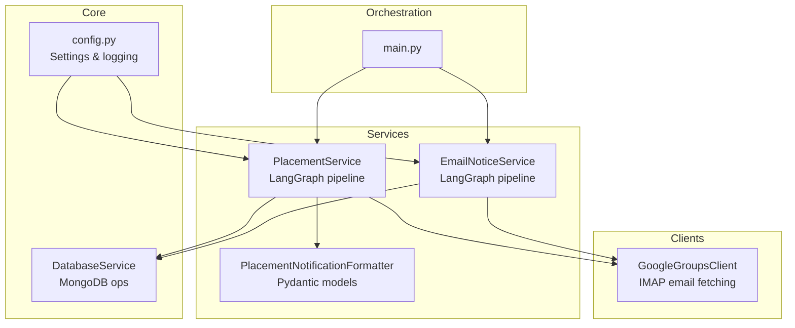

**Diagram sources**
- [main.py](file://app/main.py#L105-L242)
- [placement_service.py](file://app/services/placement_service.py#L419-L478)
- [email_notice_service.py](file://app/services/email_notice_service.py#L335-L392)
- [placement_notification_formatter.py](file://app/services/placement_notification_formatter.py#L102-L119)
- [google_groups_client.py](file://app/clients/google_groups_client.py#L19-L50)
- [config.py](file://app/core/config.py#L18-L185)
- [database_service.py](file://app/services/database_service.py#L16-L46)

**Section sources**
- [main.py](file://app/main.py#L105-L242)
- [placement_service.py](file://app/services/placement_service.py#L419-L478)
- [email_notice_service.py](file://app/services/email_notice_service.py#L335-L392)
- [placement_notification_formatter.py](file://app/services/placement_notification_formatter.py#L102-L119)
- [google_groups_client.py](file://app/clients/google_groups_client.py#L19-L50)
- [config.py](file://app/core/config.py#L18-L185)
- [database_service.py](file://app/services/database_service.py#L16-L46)

## Core Components
- PlacementService: Implements the four-stage LangGraph pipeline for placement offers, including classification, extraction, validation/enhancement, and privacy sanitization.
- EmailNoticeService: Processes non-placement notices via a separate LangGraph pipeline with LLM-based classification and extraction.
- PlacementNotificationFormatter: Formats extracted data into notices using Pydantic models.
- GoogleGroupsClient: Fetches unread emails from Google Groups via IMAP and extracts forwarded metadata.
- DatabaseService: Persists notices and placement offers to MongoDB and computes statistics.
- Configuration: Centralized settings and logging utilities.

Key implementation highlights:
- LangGraph StateGraph with typed state dictionaries
- Strict JSON extraction prompts with privacy rules
- Retry logic with bounded attempts for validation errors
- Pydantic models for strong schema enforcement
- Privacy sanitization removing headers and forwarded metadata

**Section sources**
- [placement_service.py](file://app/services/placement_service.py#L75-L86)
- [email_notice_service.py](file://app/services/email_notice_service.py#L126-L139)
- [placement_notification_formatter.py](file://app/services/placement_notification_formatter.py#L17-L78)
- [google_groups_client.py](file://app/clients/google_groups_client.py#L19-L50)
- [database_service.py](file://app/services/database_service.py#L16-L46)
- [config.py](file://app/core/config.py#L18-L185)

## Architecture Overview
The system orchestrates email fetching, classification, extraction, validation, and persistence. The primary flow is driven by PlacementService’s LangGraph pipeline.

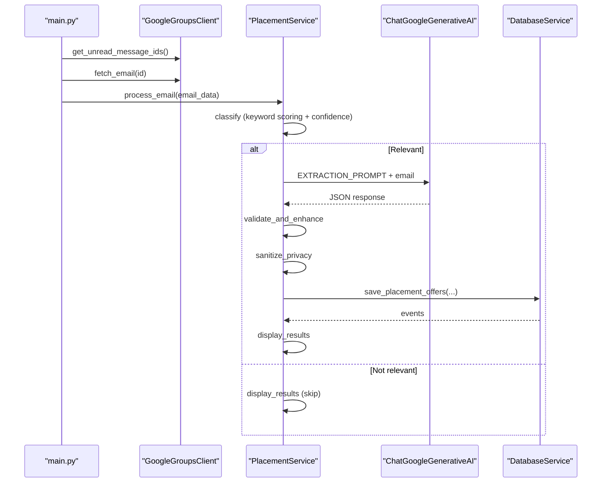

**Diagram sources**
- [main.py](file://app/main.py#L155-L226)
- [google_groups_client.py](file://app/clients/google_groups_client.py#L88-L168)
- [placement_service.py](file://app/services/placement_service.py#L507-L599)
- [placement_service.py](file://app/services/placement_service.py#L601-L704)
- [placement_service.py](file://app/services/placement_service.py#L706-L754)
- [placement_service.py](file://app/services/placement_service.py#L756-L789)
- [placement_service.py](file://app/services/placement_service.py#L791-L814)
- [database_service.py](file://app/services/database_service.py#L500-L600)

## Detailed Component Analysis

### PlacementService: Four-Stage Pipeline
- State management: GraphState defines the pipeline state (email, classification flags, extracted data, validation errors, retry count).
- Classification: Keyword scoring over sender, subject, and body; confidence aggregation; threshold-based decision.
- Extraction: LLM prompt enforces strict schema and JSON output; privacy rules disallow headers/forwarding metadata.
- Validation and Enhancement: Pydantic validation, consistency checks, defaults assignment for roles/packages.
- Privacy Sanitization: Removes headers/forwarded markers from extracted fields.
- Conditional Edges: Decide whether to extract based on relevance/confidence; retry extraction on validation errors.

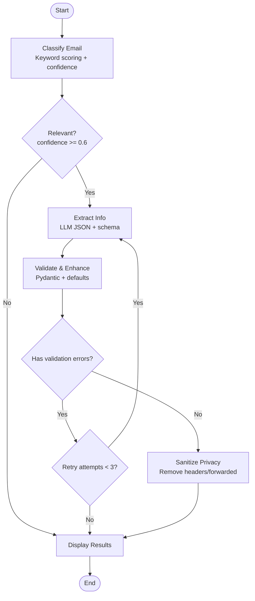

**Diagram sources**
- [placement_service.py](file://app/services/placement_service.py#L507-L599)
- [placement_service.py](file://app/services/placement_service.py#L601-L704)
- [placement_service.py](file://app/services/placement_service.py#L706-L754)
- [placement_service.py](file://app/services/placement_service.py#L756-L789)
- [placement_service.py](file://app/services/placement_service.py#L816-L844)

**Section sources**
- [placement_service.py](file://app/services/placement_service.py#L75-L86)
- [placement_service.py](file://app/services/placement_service.py#L507-L599)
- [placement_service.py](file://app/services/placement_service.py#L601-L704)
- [placement_service.py](file://app/services/placement_service.py#L706-L754)
- [placement_service.py](file://app/services/placement_service.py#L756-L789)
- [placement_service.py](file://app/services/placement_service.py#L816-L844)

### Classification Algorithm: Keyword Scoring and Confidence
- Placement keywords: presence increases score (bounded weight).
- Company indicators: presence adds modest weight.
- Negative keywords: reduce confidence (spam/security indicators).
- Heuristics: presence of names, numbers, email formats.
- Threshold: classification is relevant if confidence >= 0.6.

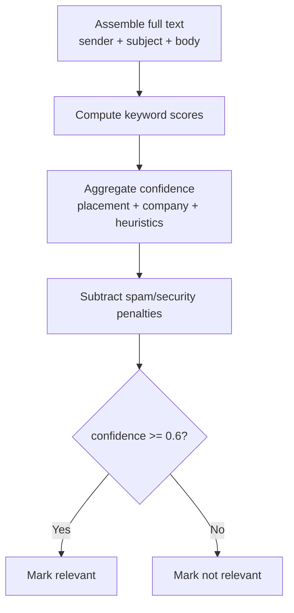

**Diagram sources**
- [placement_service.py](file://app/services/placement_service.py#L507-L599)

**Section sources**
- [placement_service.py](file://app/services/placement_service.py#L93-L143)
- [placement_service.py](file://app/services/placement_service.py#L507-L599)

### Extraction Prompt Engineering and JSON Formatting
- Two-phase prompt:
  - Phase 1: Final placement offer classification with strict criteria.
  - Phase 2: Structured extraction with strict schema and privacy rules.
- Output format: Raw JSON only, no markdown or explanations.
- Privacy rules: Do not include headers, sender info, or forwarded markers in extracted fields.

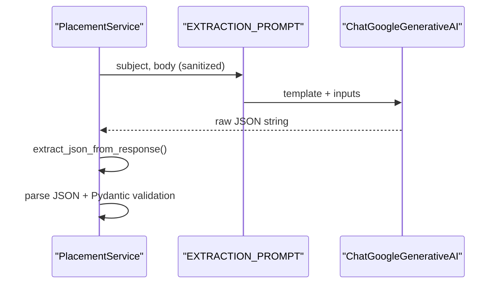

**Diagram sources**
- [placement_service.py](file://app/services/placement_service.py#L151-L246)
- [placement_service.py](file://app/services/placement_service.py#L601-L661)
- [placement_service.py](file://app/services/placement_service.py#L407-L411)

**Section sources**
- [placement_service.py](file://app/services/placement_service.py#L151-L246)
- [placement_service.py](file://app/services/placement_service.py#L407-L411)

### Validation and Enhancement
- Pydantic validation ensures schema compliance.
- Consistency checks: company name length, presence of students/roles, number_of_offers alignment.
- Enhancement: default role/package assignment when single role exists; normalize counts.

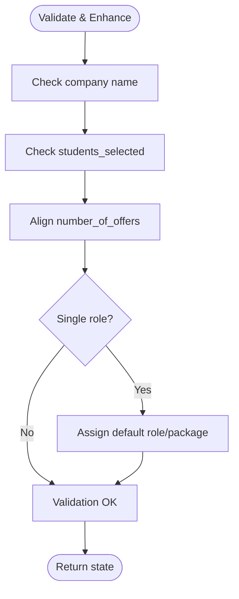

**Diagram sources**
- [placement_service.py](file://app/services/placement_service.py#L706-L754)

**Section sources**
- [placement_service.py](file://app/services/placement_service.py#L706-L754)

### Privacy Sanitization
- Removes email headers and forwarded markers from extracted fields (additional_info, roles.package_details, job_location).
- Ensures no sender/forwarding metadata appears in user-facing content.

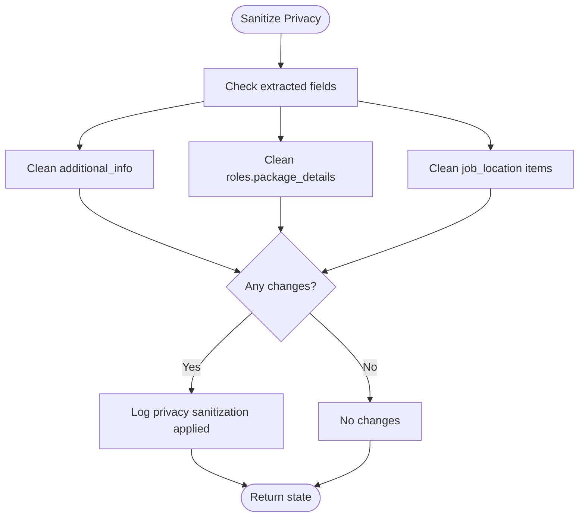

**Diagram sources**
- [placement_service.py](file://app/services/placement_service.py#L756-L789)

**Section sources**
- [placement_service.py](file://app/services/placement_service.py#L254-L285)
- [placement_service.py](file://app/services/placement_service.py#L756-L789)

### Pydantic Models and State Management
- Student: name, enrollment_number, email, role, package
- RolePackage: role, package, package_details
- PlacementOffer: company, roles, job_location, joining_date, students_selected, number_of_offers, additional_info, email_subject, email_sender, time_sent
- GraphState: email, is_relevant, confidence_score, classification_reason, rejection_reason, extracted_offer, validation_errors, retry_count

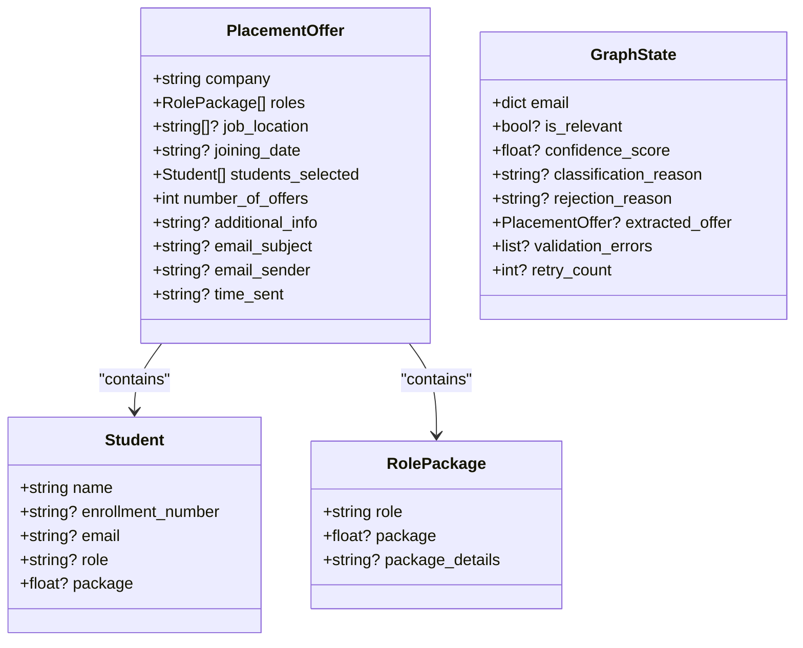

**Diagram sources**
- [placement_service.py](file://app/services/placement_service.py#L37-L67)
- [placement_service.py](file://app/services/placement_service.py#L75-L86)

**Section sources**
- [placement_service.py](file://app/services/placement_service.py#L37-L67)
- [placement_service.py](file://app/services/placement_service.py#L75-L86)

### Integration with LangChain and LangGraph
- ChatGoogleGenerativeAI configured with model and temperature.
- StateGraph with nodes for classify, extract_info, validate_and_enhance, sanitize_privacy, display_results.
- Conditional edges for decision-making and retries.

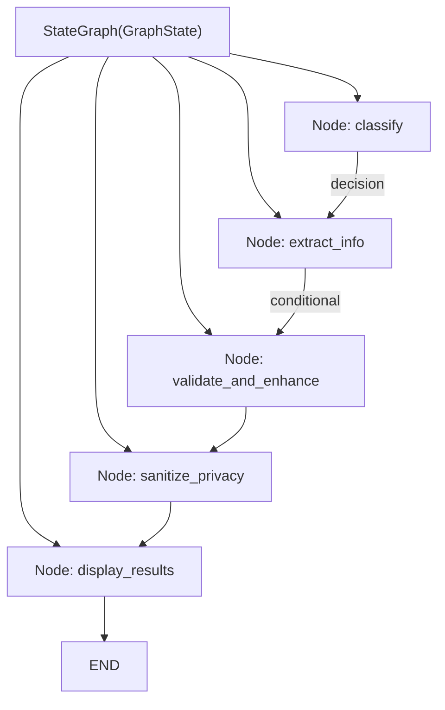

**Diagram sources**
- [placement_service.py](file://app/services/placement_service.py#L484-L505)

**Section sources**
- [placement_service.py](file://app/services/placement_service.py#L468-L478)
- [placement_service.py](file://app/services/placement_service.py#L484-L505)

### Email Fetching and Orchestration
- GoogleGroupsClient fetches unread emails, parses bodies, and extracts forwarded metadata/time.
- main.py orchestrates email processing: fetch IDs, iterate emails, try PlacementService first, then EmailNoticeService, persist results, and mark read.

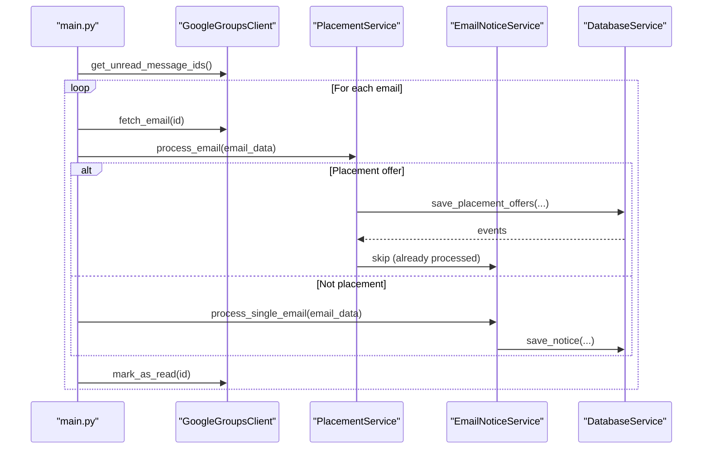

**Diagram sources**
- [main.py](file://app/main.py#L155-L226)
- [google_groups_client.py](file://app/clients/google_groups_client.py#L88-L168)
- [placement_service.py](file://app/services/placement_service.py#L998-L1012)
- [email_notice_service.py](file://app/services/email_notice_service.py#L699-L738)
- [database_service.py](file://app/services/database_service.py#L16-L46)

**Section sources**
- [google_groups_client.py](file://app/clients/google_groups_client.py#L88-L168)
- [main.py](file://app/main.py#L155-L226)
- [placement_service.py](file://app/services/placement_service.py#L998-L1012)
- [email_notice_service.py](file://app/services/email_notice_service.py#L699-L738)
- [database_service.py](file://app/services/database_service.py#L16-L46)

## Dependency Analysis
External dependencies include LangChain, LangGraph, and Pydantic for LLM integration, state management, and schema enforcement. Internal dependencies show clear separation of concerns:
- PlacementService depends on GoogleGroupsClient, ChatGoogleGenerativeAI, and DatabaseService.
- EmailNoticeService depends on GoogleGroupsClient, ChatGoogleGenerativeAI, and PlacementPolicyService.
- PlacementNotificationFormatter depends on Pydantic models and DatabaseService.

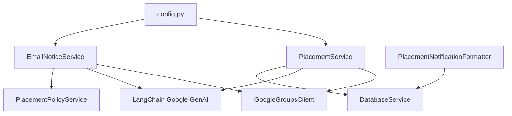

**Diagram sources**
- [placement_service.py](file://app/services/placement_service.py#L456-L478)
- [email_notice_service.py](file://app/services/email_notice_service.py#L346-L392)
- [placement_notification_formatter.py](file://app/services/placement_notification_formatter.py#L102-L119)
- [config.py](file://app/core/config.py#L18-L185)

**Section sources**
- [placement_service.py](file://app/services/placement_service.py#L456-L478)
- [email_notice_service.py](file://app/services/email_notice_service.py#L346-L392)
- [placement_notification_formatter.py](file://app/services/placement_notification_formatter.py#L102-L119)
- [config.py](file://app/core/config.py#L18-L185)

## Performance Considerations
- Sequential processing of emails: safer and allows granular error handling and retry logic.
- Retry limits: bounded attempts (e.g., 3) prevent infinite loops and reduce LLM cost.
- JSON parsing and validation: early failure detection reduces downstream processing overhead.
- Privacy sanitization: minimal overhead via regex-based cleaning; applied only when needed.
- Logging and daemon mode: configurable logging minimizes I/O impact in production.

[No sources needed since this section provides general guidance]

## Troubleshooting Guide
Common issues and resolutions:
- Empty or malformed LLM response: treated as non-placement offer; pipeline proceeds to display results.
- JSON parsing failures: retry up to configured limit; on exhaustion, record validation errors and rejection reason.
- Validation errors (schema mismatch): retry with bounded attempts; otherwise mark as invalid.
- Privacy leakage: ensure privacy sanitization runs after extraction; verify headers/forwarded markers are removed.
- Email fetching failures: check credentials and network connectivity; re-run with verbose logging.

Operational tips:
- Use verbose logging to inspect confidence scores and classification reasons.
- Monitor retry counts and validation errors to identify prompt/schema drift.
- Verify forwarded metadata extraction and sanitization for accurate timestamps and sender attribution.

**Section sources**
- [placement_service.py](file://app/services/placement_service.py#L621-L643)
- [placement_service.py](file://app/services/placement_service.py#L684-L704)
- [placement_service.py](file://app/services/placement_service.py#L749-L751)
- [placement_service.py](file://app/services/placement_service.py#L787-L788)
- [google_groups_client.py](file://app/clients/google_groups_client.py#L63-L86)

## Conclusion
The LLM-powered content extraction system leverages Google Gemini through LangChain and LangGraph to deliver a robust, schema-driven pipeline for placement offers. Its four-stage design—classification, extraction, validation/enhancement, and privacy sanitization—ensures high-quality, privacy-compliant outputs. Strong Pydantic models, retry logic, and careful privacy handling make the system resilient and maintainable.

[No sources needed since this section summarizes without analyzing specific files]

## Appendices

### Example Input/Output Transformations
- Input: Email subject/body with forwarded headers and metadata.
- Transformation: Headers and forwarded markers removed; LLM extracts JSON aligned to PlacementOffer schema.
- Output: PlacementOffer object persisted to database with derived metadata and sanitized fields.

[No sources needed since this section provides general guidance]