# LLM-Powered content extraction

## Introduction
This page explains the LLM-powered content extraction system that processes placement-related emails using Google Gemini (via LangChain and LangGraph). The system implements a four-stage pipeline:
1. Intelligent email classification using keyword scoring and confidence thresholds
2. Reliable information extraction guided by strict schema requirements and JSON formatting
3. Validation and enhancement of extracted data
4. Privacy sanitization to remove sensitive metadata

It also documents the Pydantic models used for data representation, the LangGraph state machine, integration with LangChain/LangGraph, and practical guidance for retry mechanisms, error handling, and data sanitization.

## Project structure
The system is organized around services and clients that encapsulate responsibilities:
- Services: PlacementService (extraction pipeline), EmailNoticeService (non-placement notices), PlacementNotificationFormatter (notification formatting)
- Clients: GoogleGroupsClient (email fetching)
- Core: Configuration and logging utilities
- Orchestration: main.py coordinates fetching and processing

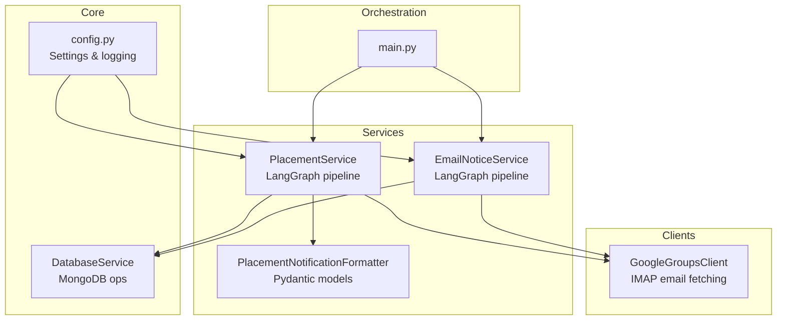
```mermaid
graph TB
subgraph "Orchestration"
MAIN["main.py"]
end
subgraph "Services"
PS["PlacementService<br/>LangGraph pipeline"]
ENS["EmailNoticeService<br/>LangGraph pipeline"]
PN["PlacementNotificationFormatter<br/>Pydantic models"]
end
subgraph "Clients"
GGC["GoogleGroupsClient<br/>IMAP email fetching"]
end
subgraph "Core"
CFG["config.py<br/>Settings & logging"]
DB["DatabaseService<br/>MongoDB ops"]
end
MAIN --> PS
MAIN --> ENS
PS --> GGC
ENS --> GGC
PS --> DB
ENS --> DB
PS --> PN
CFG --> PS
CFG --> ENS
```

## Core components
- PlacementService: Implements the four-stage LangGraph pipeline for placement offers, including classification, extraction, validation/enhancement, and privacy sanitization.
- EmailNoticeService: Processes non-placement notices via a separate LangGraph pipeline with LLM-based classification and extraction.
- PlacementNotificationFormatter: Formats extracted data into notices using Pydantic models.
- GoogleGroupsClient: Fetches unread emails from Google Groups via IMAP and extracts forwarded metadata.
- DatabaseService: Persists notices and placement offers to MongoDB and computes statistics.
- Configuration: Centralized settings and logging utilities.

Key implementation highlights:
- LangGraph StateGraph with typed state dictionaries
- Strict JSON extraction prompts with privacy rules
- Retry logic with bounded attempts for validation errors
- Pydantic models for strong schema enforcement
- Privacy sanitization removing headers and forwarded metadata

## Architecture overview
The system orchestrates email fetching, classification, extraction, validation, and persistence. The primary flow is driven by PlacementService's LangGraph pipeline.

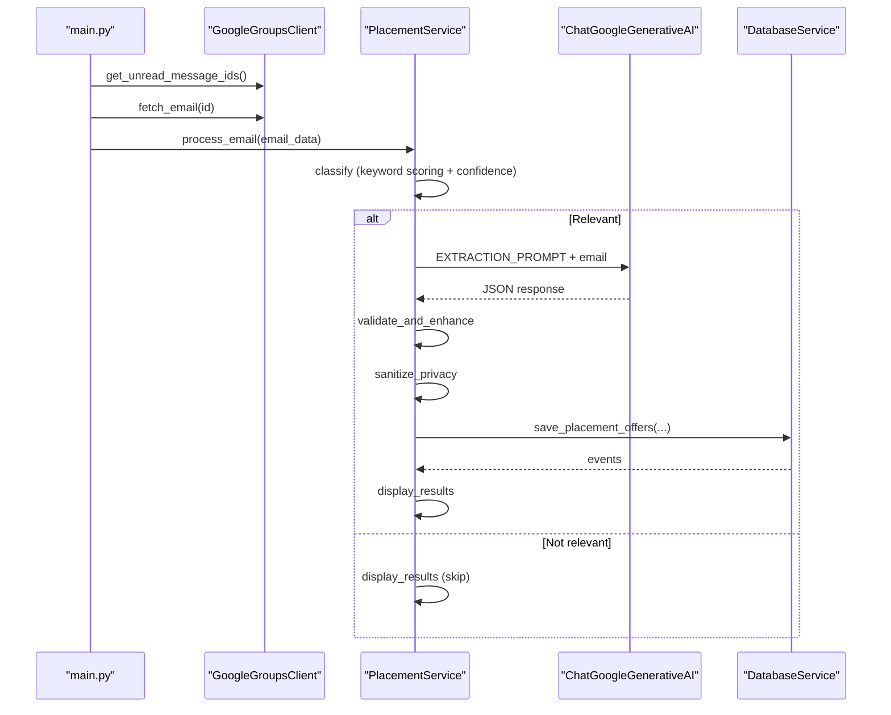
```mermaid
sequenceDiagram
participant Orchestrator as "main.py"
participant GGC as "GoogleGroupsClient"
participant PS as "PlacementService"
participant LLM as "ChatGoogleGenerativeAI"
participant DB as "DatabaseService"
Orchestrator->>GGC : get_unread_message_ids()
Orchestrator->>GGC : fetch_email(id)
Orchestrator->>PS : process_email(email_data)
PS->>PS : classify (keyword scoring + confidence)
alt Relevant
PS->>LLM : EXTRACTION_PROMPT + email
LLM-->>PS : JSON response
PS->>PS : validate_and_enhance
PS->>PS : sanitize_privacy
PS->>DB : save_placement_offers(...)
DB-->>PS : events
PS->>PS : display_results
else Not relevant
PS->>PS : display_results (skip)
end
```

## Detailed component analysis

### PlacementService: four-stage pipeline
- State management: GraphState defines the pipeline state (email, classification flags, extracted data, validation errors, retry count).
- Classification: Keyword scoring over sender, subject, and body; confidence aggregation; threshold-based decision.
- Extraction: LLM prompt enforces strict schema and JSON output; privacy rules disallow headers/forwarding metadata.
- Validation and Enhancement: Pydantic validation, consistency checks, defaults assignment for roles/packages.
- Privacy Sanitization: Removes headers/forwarded markers from extracted fields.
- Conditional Edges: Decide whether to extract based on relevance/confidence; retry extraction on validation errors.

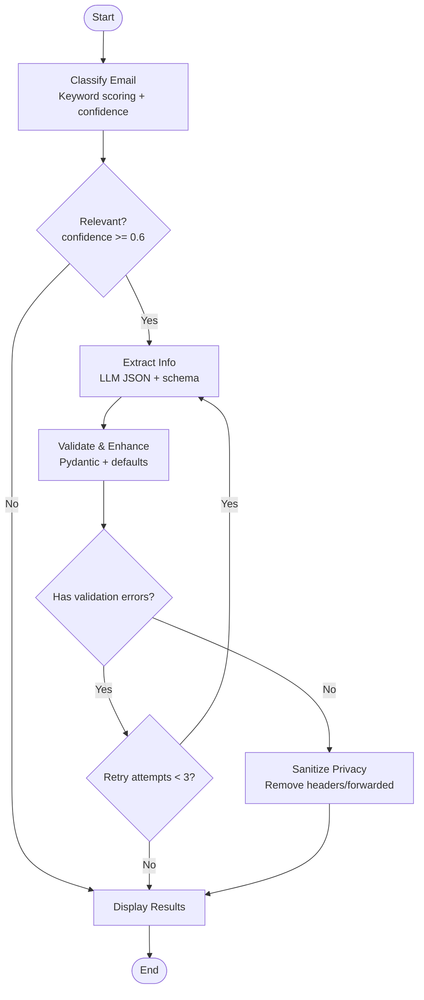
```mermaid
flowchart TD
Start(["Start"]) --> Classify["Classify Email<br/>Keyword scoring + confidence"]
Classify --> IsRelevant{"Relevant?<br/>confidence >= 0.6"}
IsRelevant --> |No| Display["Display Results"]
IsRelevant --> |Yes| Extract["Extract Info<br/>LLM JSON + schema"]
Extract --> Validate["Validate & Enhance<br/>Pydantic + defaults"]
Validate --> HasErrors{"Has validation errors?"}
HasErrors --> |Yes| Retry{"Retry attempts < 3?"}
Retry --> |Yes| Extract
Retry --> |No| Display
HasErrors --> |No| Sanitize["Sanitize Privacy<br/>Remove headers/forwarded"]
Sanitize --> Display["Display Results"]
Display --> End(["End"])
```

### Classification algorithm: keyword scoring and confidence
- Placement keywords: presence increases score (bounded weight).
- Company indicators: presence adds modest weight.
- Negative keywords: reduce confidence (spam/security indicators).
- Heuristics: presence of names, numbers, email formats.
- Threshold: classification is relevant if confidence >= 0.6.

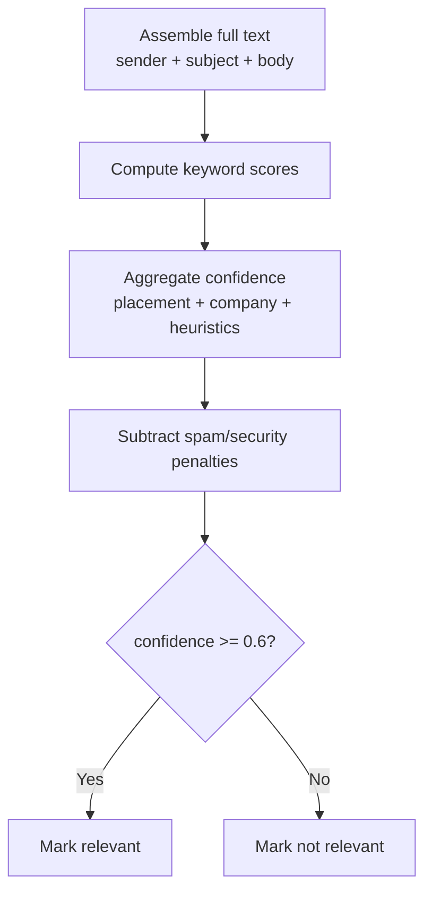
```mermaid
flowchart TD
A["Assemble full text<br/>sender + subject + body"] --> B["Compute keyword scores"]
B --> C["Aggregate confidence<br/>placement + company + heuristics"]
C --> D["Subtract spam/security penalties"]
D --> E{"confidence >= 0.6?"}
E --> |Yes| F["Mark relevant"]
E --> |No| G["Mark not relevant"]
```

### Extraction prompt engineering and JSON formatting
- Two-phase prompt:
  - Phase 1: Final placement offer classification with strict criteria.
  - Phase 2: Structured extraction with strict schema and privacy rules.
- Output format: Raw JSON only, no markdown or explanations.
- Privacy rules: Do not include headers, sender info, or forwarded markers in extracted fields.

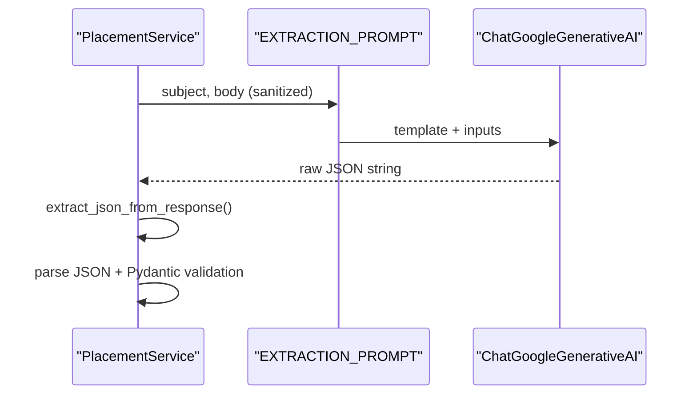
```mermaid
sequenceDiagram
participant PS as "PlacementService"
participant Prompt as "EXTRACTION_PROMPT"
participant LLM as "ChatGoogleGenerativeAI"
PS->>Prompt : subject, body (sanitized)
Prompt->>LLM : template + inputs
LLM-->>PS : raw JSON string
PS->>PS : extract_json_from_response()
PS->>PS : parse JSON + Pydantic validation
```

### Validation and enhancement
- Pydantic validation ensures schema compliance.
- Consistency checks: company name length, presence of students/roles, number_of_offers alignment.
- Enhancement: default role/package assignment when single role exists; normalize counts.

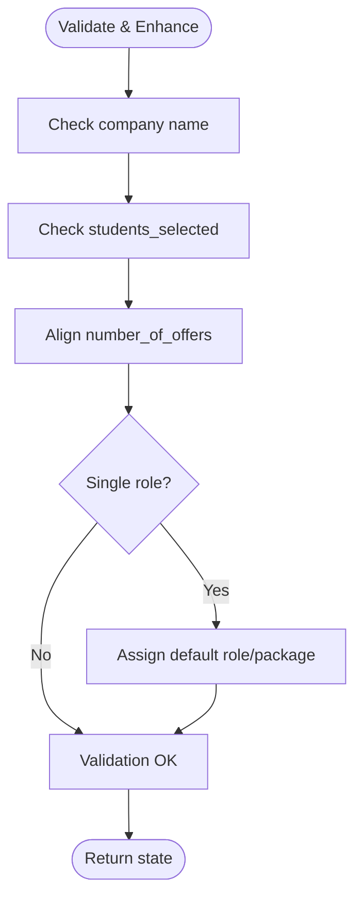
```mermaid
flowchart TD
Start(["Validate & Enhance"]) --> CheckCompany["Check company name"]
CheckCompany --> CheckStudents["Check students_selected"]
CheckStudents --> AlignCount["Align number_of_offers"]
AlignCount --> SingleRole{"Single role?"}
SingleRole --> |Yes| AssignDefaults["Assign default role/package"]
SingleRole --> |No| Done["Validation OK"]
AssignDefaults --> Done
Done --> End(["Return state"])
```

### Privacy sanitization
- Removes email headers and forwarded markers from extracted fields (additional_info, roles.package_details, job_location).
- Ensures no sender/forwarding metadata appears in user-facing content.

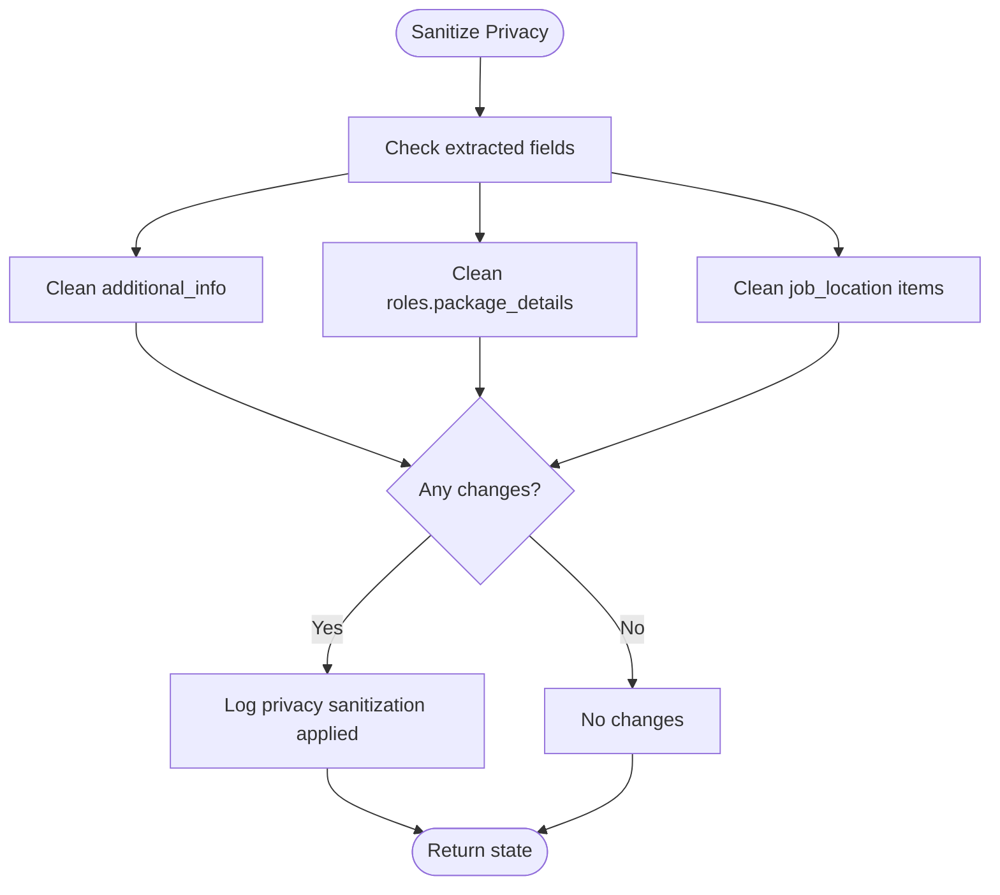
```mermaid
flowchart TD
Start(["Sanitize Privacy"]) --> CheckFields["Check extracted fields"]
CheckFields --> CleanAdditional["Clean additional_info"]
CheckFields --> CleanRoles["Clean roles.package_details"]
CheckFields --> CleanLocations["Clean job_location items"]
CleanAdditional --> Changed{"Any changes?"}
CleanRoles --> Changed
CleanLocations --> Changed
Changed --> |Yes| Log["Log privacy sanitization applied"]
Changed --> |No| Skip["No changes"]
Log --> End(["Return state"])
Skip --> End
```

### Pydantic models and state management
- Student: name, enrollment_number, email, role, package
- RolePackage: role, package, package_details
- PlacementOffer: company, roles, job_location, joining_date, students_selected, number_of_offers, additional_info, email_subject, email_sender, time_sent
- GraphState: email, is_relevant, confidence_score, classification_reason, rejection_reason, extracted_offer, validation_errors, retry_count

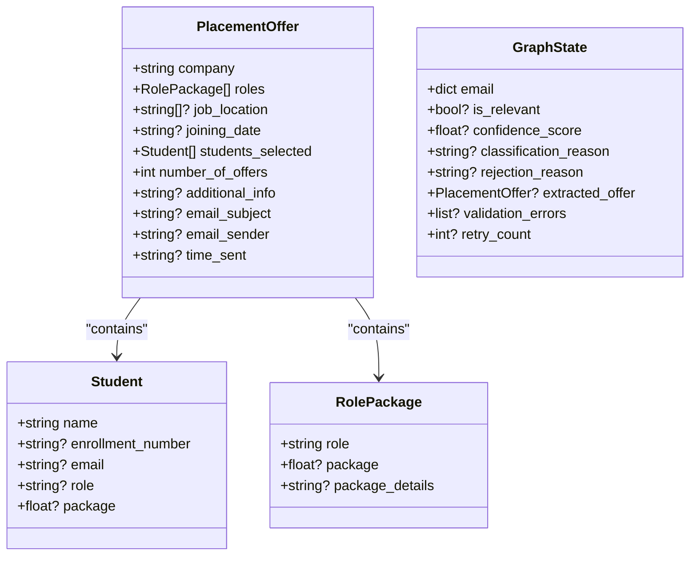
```mermaid
classDiagram
class Student {
+string name
+string? enrollment_number
+string? email
+string? role
+float? package
}
class RolePackage {
+string role
+float? package
+string? package_details
}
class PlacementOffer {
+string company
+RolePackage[] roles
+string[]? job_location
+string? joining_date
+Student[] students_selected
+int number_of_offers
+string? additional_info
+string? email_subject
+string? email_sender
+string? time_sent
}
class GraphState {
+dict email
+bool? is_relevant
+float? confidence_score
+string? classification_reason
+string? rejection_reason
+PlacementOffer? extracted_offer
+list? validation_errors
+int? retry_count
}
PlacementOffer --> Student : "contains"
PlacementOffer --> RolePackage : "contains"
```

### Integration with LangChain and LangGraph
- ChatGoogleGenerativeAI configured with model and temperature.
- StateGraph with nodes for classify, extract_info, validate_and_enhance, sanitize_privacy, display_results.
- Conditional edges for decision-making and retries.

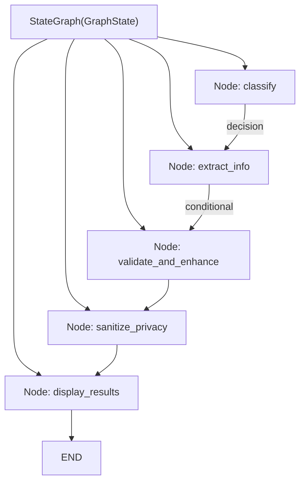
```mermaid
graph TB
SG["StateGraph(GraphState)"] --> N1["Node: classify"]
SG --> N2["Node: extract_info"]
SG --> N3["Node: validate_and_enhance"]
SG --> N4["Node: sanitize_privacy"]
SG --> N5["Node: display_results"]
N1 --> |decision| N2
N2 --> |conditional| N3
N3 --> N4 --> N5 --> END["END"]
```

### Email fetching and orchestration
- GoogleGroupsClient fetches unread emails, parses bodies, and extracts forwarded metadata/time.
- main.py orchestrates email processing: fetch IDs, iterate emails, try PlacementService first, then EmailNoticeService, persist results, and mark read.

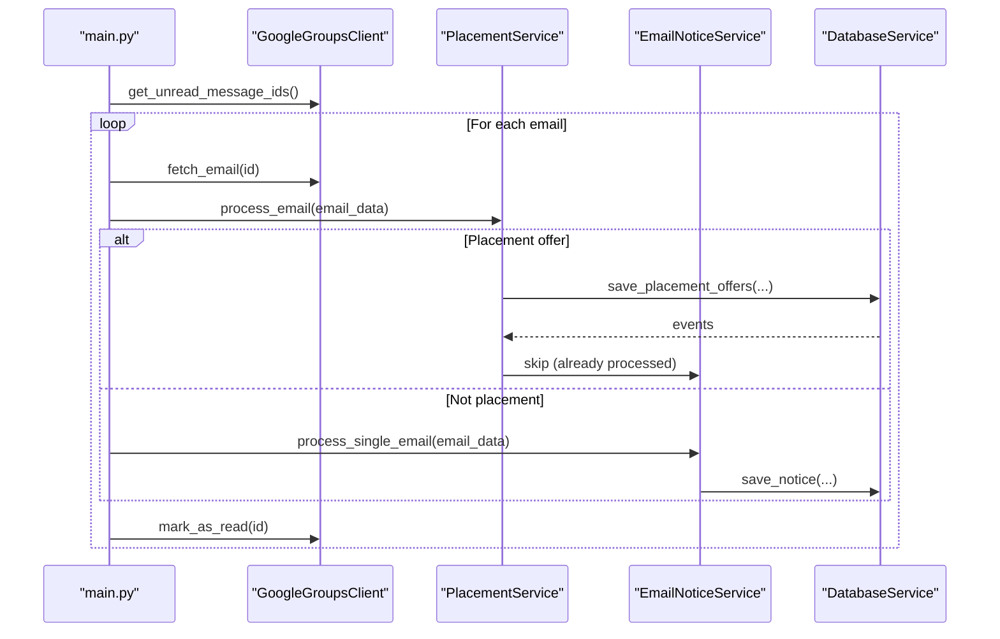
```mermaid
sequenceDiagram
participant MAIN as "main.py"
participant GGC as "GoogleGroupsClient"
participant PS as "PlacementService"
participant ENS as "EmailNoticeService"
participant DB as "DatabaseService"
MAIN->>GGC : get_unread_message_ids()
loop For each email
MAIN->>GGC : fetch_email(id)
MAIN->>PS : process_email(email_data)
alt Placement offer
PS->>DB : save_placement_offers(...)
DB-->>PS : events
PS->>ENS : skip (already processed)
else Not placement
MAIN->>ENS : process_single_email(email_data)
ENS->>DB : save_notice(...)
end
MAIN->>GGC : mark_as_read(id)
end
```

## Dependency analysis
External dependencies include LangChain, LangGraph, and Pydantic for LLM integration, state management, and schema enforcement. Internal dependencies show clear separation of concerns:
- PlacementService depends on GoogleGroupsClient, ChatGoogleGenerativeAI, and DatabaseService.
- EmailNoticeService depends on GoogleGroupsClient, ChatGoogleGenerativeAI, and PlacementPolicyService.
- PlacementNotificationFormatter depends on Pydantic models and DatabaseService.

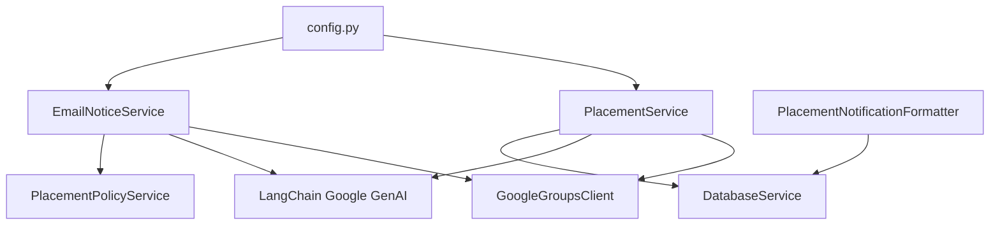
```mermaid
graph TB
PS["PlacementService"] --> GGC["GoogleGroupsClient"]
PS --> LCGG["LangChain Google GenAI"]
PS --> DB["DatabaseService"]
ENS["EmailNoticeService"] --> GGC
ENS --> LCGG
ENS --> PPS["PlacementPolicyService"]
PN["PlacementNotificationFormatter"] --> DB
CFG["config.py"] --> PS
CFG --> ENS
```

## Performance considerations
- Sequential processing of emails: safer and allows granular error handling and retry logic.
- Retry limits: bounded attempts (e.g., 3) prevent infinite loops and reduce LLM cost.
- JSON parsing and validation: early failure detection reduces downstream processing overhead.
- Privacy sanitization: minimal overhead via regex-based cleaning; applied only when needed.
- Logging and daemon mode: configurable logging minimizes I/O impact in production.

[No sources needed since this section provides general guidance]

## Troubleshooting guide
Common issues and resolutions:
- Empty or malformed LLM response: treated as non-placement offer; pipeline proceeds to display results.
- JSON parsing failures: retry up to configured limit; on exhaustion, record validation errors and rejection reason.
- Validation errors (schema mismatch): retry with bounded attempts; otherwise mark as invalid.
- Privacy leakage: ensure privacy sanitization runs after extraction; verify headers/forwarded markers are removed.
- Email fetching failures: check credentials and network connectivity; re-run with verbose logging.

Operational tips:
- Use verbose logging to inspect confidence scores and classification reasons.
- Monitor retry counts and validation errors to identify prompt/schema drift.
- Verify forwarded metadata extraction and sanitization for accurate timestamps and sender attribution.

## Conclusion
The LLM-powered content extraction system uses Google Gemini through LangChain and LangGraph to deliver a reliable, schema-driven pipeline for placement offers. Its four-stage design, classification, extraction, validation/enhancement, and privacy sanitization, ensures high-quality, privacy-compliant outputs. Strong Pydantic models, retry logic, and careful privacy handling make the system resilient and maintainable.

[No sources needed since this section summarizes without analyzing specific files]

## Appendices

### Example input/output transformations
- Input: Email subject/body with forwarded headers and metadata.
- Transformation: Headers and forwarded markers removed; LLM extracts JSON aligned to PlacementOffer schema.
- Output: PlacementOffer object persisted to database with derived metadata and sanitized fields.

[No sources needed since this section provides general guidance]
