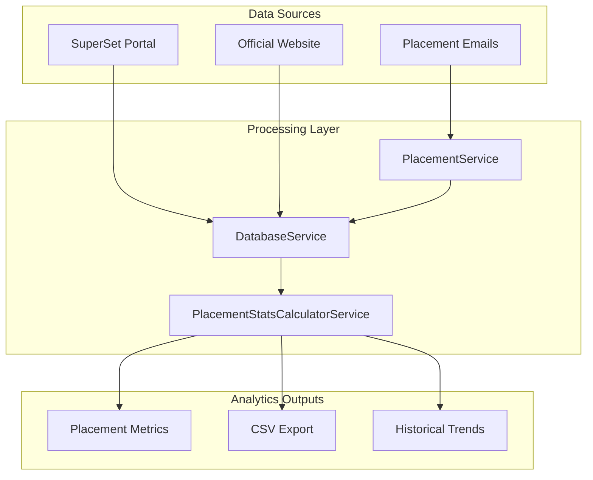
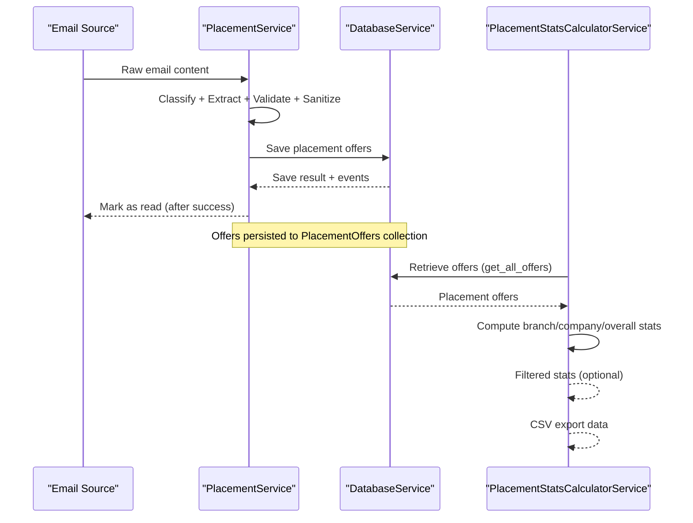
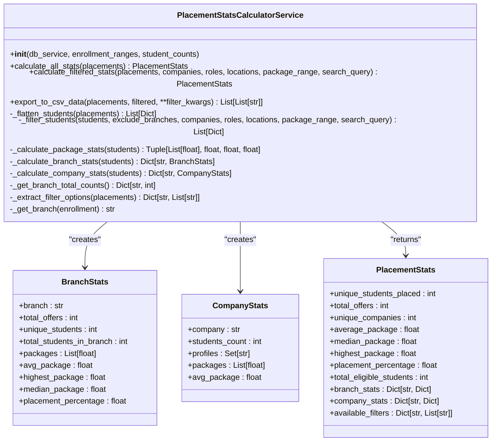
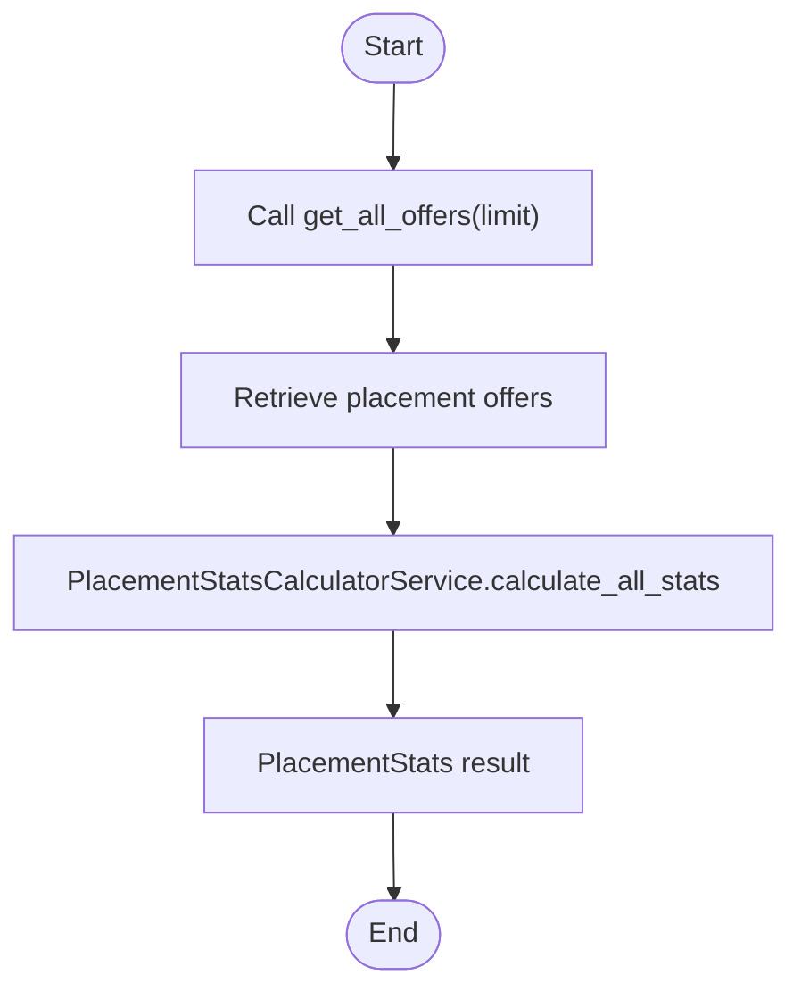
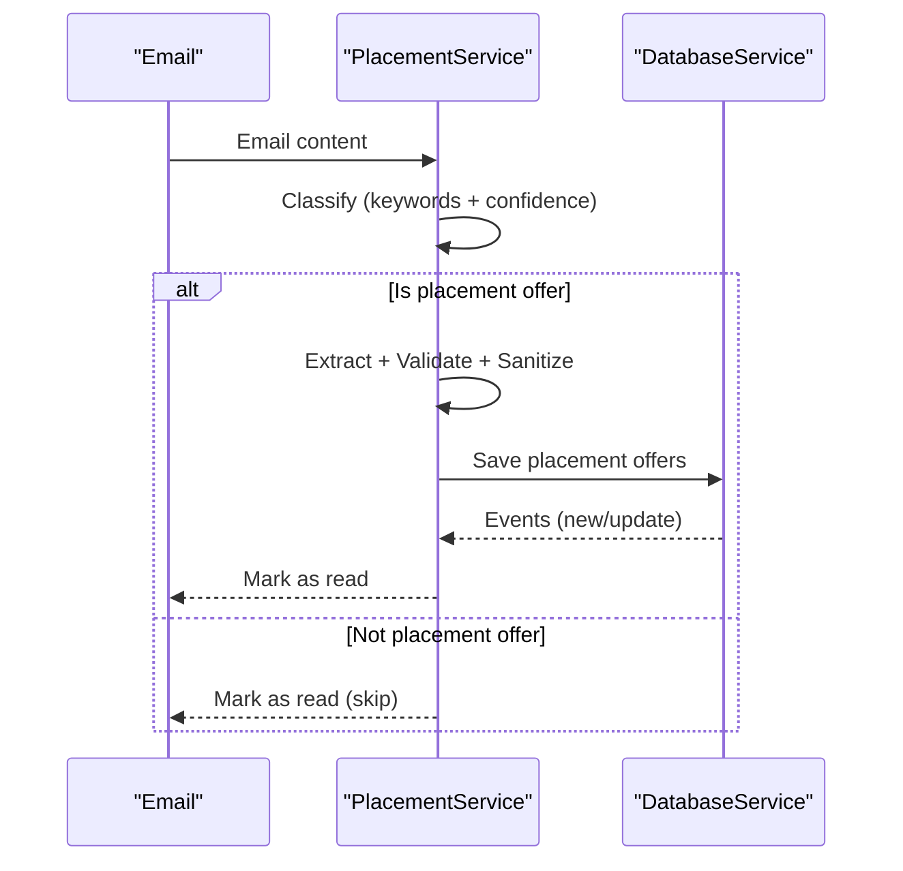
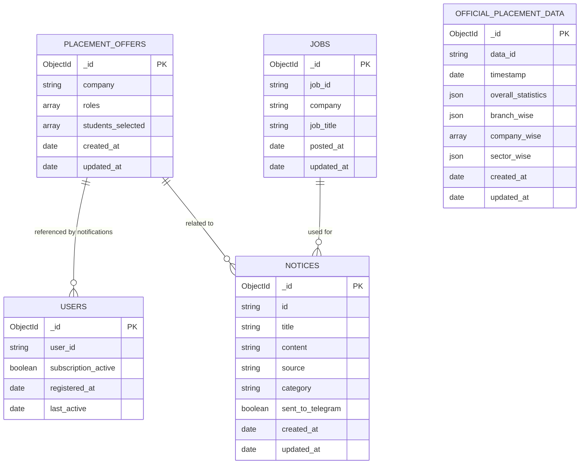
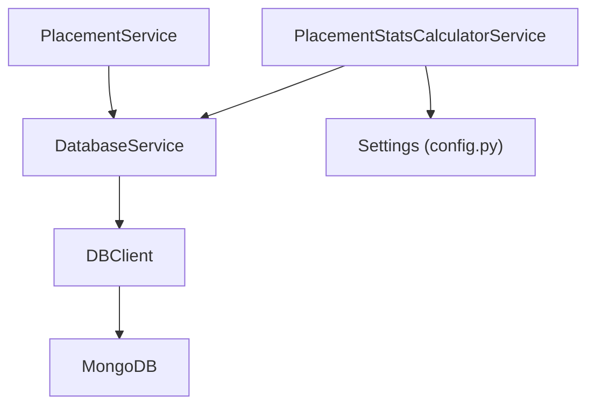

# Statistics Calculation & Analytics

<cite>
**Referenced Files in This Document**
- [placement_stats_calculator_service.py](file://app/services/placement_stats_calculator_service.py)
- [placement_service.py](file://app/services/placement_service.py)
- [database_service.py](file://app/services/database_service.py)
- [db_client.py](file://app/clients/db_client.py)
- [config.py](file://app/core/config.py)
- [placement_offers.json](file://app/data/placement_offers.json)
- [structured_job_listings.json](file://app/data/structured_job_listings.json)
- [README.md](file://README.md)
- [ARCHITECTURE.md](file://docs/ARCHITECTURE.md)
- [DATABASE.md](file://docs/DATABASE.md)
</cite>

## Table of Contents
1. [Introduction](#introduction)
2. [Project Structure](#project-structure)
3. [Core Components](#core-components)
4. [Architecture Overview](#architecture-overview)
5. [Detailed Component Analysis](#detailed-component-analysis)
6. [Dependency Analysis](#dependency-analysis)
7. [Performance Considerations](#performance-considerations)
8. [Troubleshooting Guide](#troubleshooting-guide)
9. [Conclusion](#conclusion)
10. [Appendices](#appendices)

## Introduction
This document provides comprehensive documentation for the statistics calculation and analytics service powering placement analytics at JIIT. It explains how placement statistics are computed, including company-wise offer counts, package distribution analysis, student selection trends, and placement rate calculations. It also covers data aggregation for historical tracking, trend analysis, and statistical reporting, along with calculation methods for average packages, highest/lowest offers, branch-wise placement statistics, and time-series analysis. Integration with the database for data retrieval, caching strategies for performance optimization, and real-time statistics updates are documented. Examples of calculated metrics, visualization data formats, export capabilities, and data privacy considerations are included.

## Project Structure
The statistics service is implemented as a modular Python service integrated into the broader notification bot ecosystem. Key components include:
- Placement statistics calculator service for computing branch-wise, company-wise, and overall metrics
- Database service for retrieving and persisting placement offers and statistics
- Email processing pipeline that extracts and structures placement offers for analytics
- Configuration and client modules for environment management and database connectivity

**Diagram sources**
- [placement_service.py](file://app/services/placement_service.py#L419-L830)
- [database_service.py](file://app/services/database_service.py#L16-L795)
- [placement_stats_calculator_service.py](file://app/services/placement_stats_calculator_service.py#L354-L1034)

**Section sources**
- [README.md](file://README.md#L176-L233)
- [ARCHITECTURE.md](file://docs/ARCHITECTURE.md#L120-L296)

## Core Components
This section outlines the core components responsible for statistics computation and analytics.

- PlacementStatsCalculatorService
  - Computes overall statistics, branch-wise metrics, and company-wise aggregations
  - Filters students by company, role, location, package range, and search query
  - Provides CSV export functionality for administrative reporting
  - Calculates average, median, and highest packages per unique student
  - Computes placement percentages by branch and overall

- DatabaseService
  - Retrieves placement offers from MongoDB for analytics
  - Provides raw statistics computation for official placement data
  - Manages collections for notices, jobs, placement offers, users, and official placement data

- PlacementService
  - Extracts and structures placement offers from emails using LLM orchestration
  - Sanitizes privacy-sensitive information
  - Emits events for new offers and updates for real-time updates

- DBClient and Configuration
  - Manages MongoDB connection and collection access
  - Centralized configuration via Pydantic Settings with environment variables

**Section sources**
- [placement_stats_calculator_service.py](file://app/services/placement_stats_calculator_service.py#L354-L1034)
- [database_service.py](file://app/services/database_service.py#L16-L795)
- [placement_service.py](file://app/services/placement_service.py#L419-L830)
- [db_client.py](file://app/clients/db_client.py#L16-L104)
- [config.py](file://app/core/config.py#L18-L254)

## Architecture Overview
The statistics architecture integrates data ingestion, processing, persistence, and analytics computation across services and databases.

**Diagram sources**
- [placement_service.py](file://app/services/placement_service.py#L419-L830)
- [database_service.py](file://app/services/database_service.py#L485-L600)
- [placement_stats_calculator_service.py](file://app/services/placement_stats_calculator_service.py#L708-L936)

## Detailed Component Analysis

### PlacementStatsCalculatorService
This service encapsulates all statistics computation logic, including:
- Branch resolution from enrollment numbers using predefined ranges
- Package calculation prioritizing student-specific packages, matching role packages, single-role packages, and maximum among multiple roles
- Unique student counting per branch and per placement offer
- Average, median, and highest package computations using the highest package per unique student
- Branch-wise placement percentages based on eligible student counts
- Company-wise statistics including student counts, role profiles, and average packages
- Filtering pipeline supporting company, role, location, package range, and search query
- CSV export generation for administrative reporting

**Diagram sources**
- [placement_stats_calculator_service.py](file://app/services/placement_stats_calculator_service.py#L109-L158)
- [placement_stats_calculator_service.py](file://app/services/placement_stats_calculator_service.py#L354-L1034)

**Section sources**
- [placement_stats_calculator_service.py](file://app/services/placement_stats_calculator_service.py#L165-L271)
- [placement_stats_calculator_service.py](file://app/services/placement_stats_calculator_service.py#L288-L347)
- [placement_stats_calculator_service.py](file://app/services/placement_stats_calculator_service.py#L515-L675)
- [placement_stats_calculator_service.py](file://app/services/placement_stats_calculator_service.py#L708-L936)
- [placement_stats_calculator_service.py](file://app/services/placement_stats_calculator_service.py#L978-L1034)

### Database Integration and Data Retrieval
The DatabaseService provides:
- Retrieval of placement offers for analytics via get_all_offers
- Raw statistics computation for official placement data
- Upsert logic for merging offers and emitting events for new and updated offers
- Collection access for notices, jobs, placement offers, users, and official placement data

**Diagram sources**
- [database_service.py](file://app/services/database_service.py#L485-L500)
- [placement_stats_calculator_service.py](file://app/services/placement_stats_calculator_service.py#L708-L740)

**Section sources**
- [database_service.py](file://app/services/database_service.py#L485-L600)
- [db_client.py](file://app/clients/db_client.py#L16-L104)

### Email Processing and Privacy Sanitization
The PlacementService orchestrates intelligent classification, extraction, validation, and privacy sanitization of placement emails. It ensures only final placement offers are processed and sanitized to protect privacy.

**Diagram sources**
- [placement_service.py](file://app/services/placement_service.py#L507-L805)

**Section sources**
- [placement_service.py](file://app/services/placement_service.py#L507-L805)

### Data Models and Storage
The system stores placement offers and related data in MongoDB collections. The PlacementOffers collection holds extracted offers with company, roles, students, and metadata. The OfficialPlacementData collection stores aggregated statistics snapshots.

**Diagram sources**
- [DATABASE.md](file://docs/DATABASE.md#L169-L424)

**Section sources**
- [DATABASE.md](file://docs/DATABASE.md#L169-L424)

## Dependency Analysis
The statistics service depends on:
- DatabaseService for data retrieval and persistence
- PlacementService for extracting and structuring placement offers
- Configuration and DBClient for environment and database connectivity

**Diagram sources**
- [placement_stats_calculator_service.py](file://app/services/placement_stats_calculator_service.py#L365-L390)
- [database_service.py](file://app/services/database_service.py#L28-L45)
- [db_client.py](file://app/clients/db_client.py#L21-L80)
- [config.py](file://app/core/config.py#L18-L31)

**Section sources**
- [placement_stats_calculator_service.py](file://app/services/placement_stats_calculator_service.py#L365-L390)
- [database_service.py](file://app/services/database_service.py#L28-L45)
- [db_client.py](file://app/clients/db_client.py#L21-L80)
- [config.py](file://app/core/config.py#L18-L31)

## Performance Considerations
- Caching: Settings are cached via lru_cache to avoid repeated environment loading
- Batch operations: DatabaseService uses bulk upserts and aggregation for statistics
- Indexing: Recommended indexes on frequently queried fields (e.g., company, processing_status, timestamps)
- Connection pooling: PyMongo manages connection pooling automatically
- Real-time updates: Events emitted on new/updated offers trigger immediate recalculations

[No sources needed since this section provides general guidance]

## Troubleshooting Guide
Common issues and resolutions:
- Database connection failures: Verify MONGO_CONNECTION_STR and IP whitelist for MongoDB Atlas
- Empty statistics: Ensure placement offers exist in PlacementOffers collection and are not filtered out by exclusions
- Privacy concerns: PlacementService sanitizes email headers and forwarded information before saving
- Export issues: Confirm CSV export filters and ensure placements are available

**Section sources**
- [config.py](file://app/core/config.py#L26-L31)
- [database_service.py](file://app/services/database_service.py#L485-L600)
- [placement_service.py](file://app/services/placement_service.py#L756-L790)

## Conclusion
The statistics calculation and analytics service provides a robust, modular framework for computing placement metrics, enabling branch-wise and company-wise analysis, filtering, and export capabilities. Through integration with the database and email processing pipeline, it supports real-time updates and historical trend analysis while maintaining privacy and performance best practices.

[No sources needed since this section summarizes without analyzing specific files]

## Appendices

### Calculation Methods and Metrics
- Average package: Sum of highest packages per unique student divided by count
- Median package: Middle value of sorted packages for unique students
- Highest package: Maximum package among unique students
- Placement percentage: Unique placed students in tracked branches divided by total eligible students, multiplied by 100
- Company-wise average package: Sum of packages per company divided by number of packages
- Branch-wise statistics: Total offers, unique students, total eligible students, average/median/highest packages, and placement percentage

**Section sources**
- [placement_stats_calculator_service.py](file://app/services/placement_stats_calculator_service.py#L539-L633)
- [database_service.py](file://app/services/database_service.py#L501-L600)

### Visualization Data Formats
- Branch-wise metrics: Dictionary with branch names as keys and computed statistics as values
- Company-wise metrics: Dictionary with company names as keys and counts, profiles, and average packages
- Available filters: Lists of companies, roles, and locations derived from placements

**Section sources**
- [placement_stats_calculator_service.py](file://app/services/placement_stats_calculator_service.py#L792-L829)
- [placement_stats_calculator_service.py](file://app/services/placement_stats_calculator_service.py#L807-L830)
- [placement_stats_calculator_service.py](file://app/services/placement_stats_calculator_service.py#L828-L829)

### Export Capabilities
- CSV export: Generates rows with student name, enrollment number, company, role, package, job location, and joining date
- Filtered exports: Applies filters before generating CSV rows

**Section sources**
- [placement_stats_calculator_service.py](file://app/services/placement_stats_calculator_service.py#L978-L1034)

### Data Privacy and Compliance
- Privacy sanitization: Removal of email headers, forwarded markers, and sender information during extraction
- Data retention: Consider TTL indexes for auto-cleanup of logs and temporary data
- Institutional policies: Ensure compliance with educational institution data policies and student privacy regulations

**Section sources**
- [placement_service.py](file://app/services/placement_service.py#L254-L286)
- [placement_service.py](file://app/services/placement_service.py#L756-L790)
- [DATABASE.md](file://docs/DATABASE.md#L589-L614)