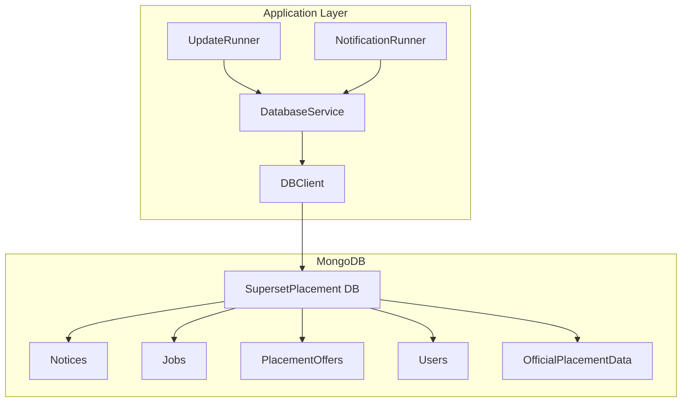
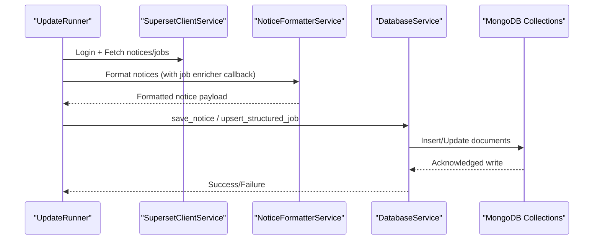
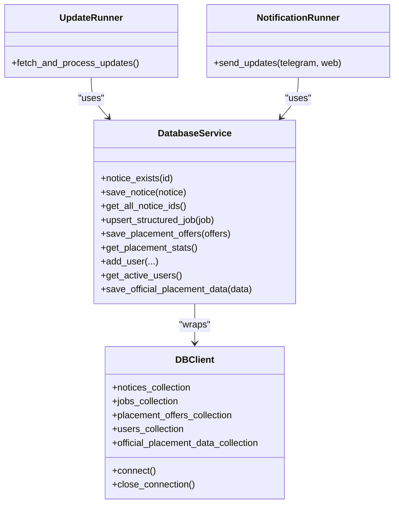

# Database Schema & Models

<cite>
**Referenced Files in This Document**
- [DATABASE.md](file://docs/DATABASE.md)
- [database_service.py](file://app/services/database_service.py)
- [db_client.py](file://app/clients/db_client.py)
- [config.py](file://app/core/config.py)
- [update_runner.py](file://app/runners/update_runner.py)
- [notification_runner.py](file://app/runners/notification_runner.py)
- [placement_offers.json](file://app/data/placement_offers.json)
- [structured_job_listings.json](file://app/data/structured_job_listings.json)
- [notices.json](file://app/data/notices.json)
</cite>

## Table of Contents
1. [Introduction](#introduction)
2. [Project Structure](#project-structure)
3. [Core Components](#core-components)
4. [Architecture Overview](#architecture-overview)
5. [Detailed Component Analysis](#detailed-component-analysis)
6. [Dependency Analysis](#dependency-analysis)
7. [Performance Considerations](#performance-considerations)
8. [Troubleshooting Guide](#troubleshooting-guide)
9. [Conclusion](#conclusion)
10. [Appendices](#appendices)

## Introduction
This document provides comprehensive database schema documentation for the SuperSet Telegram Notification Bot’s MongoDB implementation. It covers the five main collections (Notices, Jobs, PlacementOffers, Users, OfficialData), their field definitions, data types, validation rules, entity relationships, indexes, and query patterns. It also explains data modeling decisions, normalization strategies, performance considerations, sample documents, common queries, data lifecycle management, retention policies, backup strategies, and integrity constraints.

## Project Structure
The database layer is implemented as a service that wraps a MongoDB client. The service exposes CRUD and aggregation operations for each collection, while the client manages the connection and collection references. Runners orchestrate data ingestion and notification dispatch, relying on the database service for persistence and retrieval.

**Diagram sources**
- [update_runner.py](file://app/runners/update_runner.py#L21-L148)
- [notification_runner.py](file://app/runners/notification_runner.py#L21-L115)
- [database_service.py](file://app/services/database_service.py#L16-L46)
- [db_client.py](file://app/clients/db_client.py#L16-L104)

**Section sources**
- [update_runner.py](file://app/runners/update_runner.py#L21-L148)
- [notification_runner.py](file://app/runners/notification_runner.py#L21-L115)
- [database_service.py](file://app/services/database_service.py#L16-L46)
- [db_client.py](file://app/clients/db_client.py#L16-L104)

## Core Components
- DatabaseService: Centralized service exposing operations for Notices, Jobs, PlacementOffers, Users, Policies, and OfficialPlacementData. It encapsulates MongoDB collection access and implements CRUD, upserts, aggregations, and statistics.
- DBClient: Thin wrapper around PyMongo to manage connection, database selection, and collection initialization.
- Runners: UpdateRunner orchestrates fetching notices/jobs from SuperSet, enriching and saving to DB; NotificationRunner retrieves unsent notices and broadcasts via Telegram/WebPush.

Key responsibilities:
- Notices: Store formatted notices with sent status per channel.
- Jobs: Structured job listings with enrichment and deduplication.
- PlacementOffers: Offers extracted from emails with merge logic and event emission.
- Users: Subscription and preference management.
- OfficialPlacementData: Aggregated placement statistics snapshots.

**Section sources**
- [database_service.py](file://app/services/database_service.py#L16-L795)
- [db_client.py](file://app/clients/db_client.py#L16-L104)
- [update_runner.py](file://app/runners/update_runner.py#L56-L148)
- [notification_runner.py](file://app/runners/notification_runner.py#L60-L115)

## Architecture Overview
The system follows a layered architecture:
- Clients: DBClient connects to MongoDB and exposes collections.
- Services: DatabaseService abstracts operations and enforces data shaping.
- Runners: Orchestrate ingestion and notifications using injected services.

**Diagram sources**
- [update_runner.py](file://app/runners/update_runner.py#L56-L237)
- [database_service.py](file://app/services/database_service.py#L80-L257)

**Section sources**
- [update_runner.py](file://app/runners/update_runner.py#L56-L237)
- [database_service.py](file://app/services/database_service.py#L80-L257)

## Detailed Component Analysis

### Notices Collection
Purpose: Store all types of notifications (job postings, announcements, updates) with channel-specific sent flags and metadata.

Fields and types:
- _id: ObjectId
- id: String (unique)
- title: String
- content: String
- source: String ('superset' | 'email' | 'official')
- category: String (e.g., 'announcement', 'job_posting', 'shortlisting', 'internship_noc', 'hackathon', 'webinar', 'update')
- formatted_content: String
- sent_to_telegram: { value: Boolean, timestamp: Date }
- sent_to_webpush: { value: Boolean, timestamp: Date }
- metadata: { company: String, role: String, deadline: Date, tags: [String] }
- created_at: Date
- updated_at: Date
- scraped_at: Date

Validation rules:
- Unique index on id.
- Compound indexes for efficient filtering by sent status and creation time.
- Category/source filters enable targeted retrieval.

Indexes:
- Unique: { id: 1 }
- Non-unique: { sent_to_telegram: 1 }, { sent_to_webpush: 1 }, { created_at: -1 }, { source: 1, category: 1 }

Sample documents:
- See example in [DATABASE.md](file://docs/DATABASE.md#L67-L94).

Common queries:
- Find unsent notices: see [DATABASE.md](file://docs/DATABASE.md#L506-L515).
- Bulk update sent timestamps: see [DATABASE.md](file://docs/DATABASE.md#L551-L558).

Operational usage:
- Existence checks and ID retrieval for deduplication during ingestion.
- Chronological retrieval for notification dispatch.

**Section sources**
- [DATABASE.md](file://docs/DATABASE.md#L32-L97)
- [database_service.py](file://app/services/database_service.py#L56-L104)
- [database_service.py](file://app/services/database_service.py#L116-L148)

### Jobs Collection
Purpose: Structured job profiles extracted from SuperSet, with eligibility criteria, positions, compensation, and deadlines.

Fields and types:
- _id: ObjectId
- job_id: String (unique)
- company: String
- job_title: String
- job_description: String
- qualification_criteria: { min_cgpa: Number, branches: [String], batch_years: [String] }
- position_details: { total_positions: Number, job_location: String, job_type: String }
- compensation: { base_salary: Number, bonus: Number, currency: String }
- application_deadline: Date
- posted_at: Date
- source_url: String
- created_at: Date
- updated_at: Date

Indexes:
- Unique: { job_id: 1 }
- Non-unique: { company: 1 }, { application_deadline: 1 }

Sample documents:
- See example in [DATABASE.md](file://docs/DATABASE.md#L133-L162).

Operational usage:
- Upsert job records with merge of updated_at.
- Retrieval sorted by creation time for recent listings.

**Section sources**
- [DATABASE.md](file://docs/DATABASE.md#L98-L168)
- [database_service.py](file://app/services/database_service.py#L205-L257)

### PlacementOffers Collection
Purpose: Offers extracted from emails, with roles, selected students, and processing status.

Fields and types:
- _id: ObjectId
- offer_id: String (unique)
- company: String
- role: String
- package: { base: Number, bonus: Number, total: Number, currency: String }
- students_selected: [{ name: String, email: String, branch: String, enrollment_number: String }]
- offer_status: String ('pending', 'confirmed', 'completed')
- source_email: String
- processing_status: String ('new', 'processed', 'notified')
- notifications_sent: { telegram: Boolean, webpush: Boolean }
- extracted_at: Date
- created_at: Date
- updated_at: Date

Indexes:
- Unique: { offer_id: 1 }
- Non-unique: { company: 1 }, { processing_status: 1 }, { created_at: -1 }

Sample documents:
- See example in [DATABASE.md](file://docs/DATABASE.md#L207-L244).

Operational usage:
- Merge logic for updating offers and students, emitting events for new/updated offers.
- Stats computation across offers and students.

**Section sources**
- [DATABASE.md](file://docs/DATABASE.md#L169-L251)
- [database_service.py](file://app/services/database_service.py#L274-L441)

### Users Collection
Purpose: User subscription and preferences, including web push subscriptions.

Fields and types:
- _id: ObjectId
- user_id: String (unique)
- first_name: String
- username: String
- subscription_active: Boolean
- notification_preferences: { telegram: Boolean, webpush: Boolean, email: Boolean }
- webpush_subscriptions: [{ subscription_id: String, endpoint: String, keys: { p256dh: String, auth: String }, created_at: Date }]
- registered_at: Date
- last_active: Date
- notifications_sent: Number
- metadata: { branch: String, batch_year: String, device_type: String }

Indexes:
- Unique: { user_id: 1 }
- Non-unique: { subscription_active: 1 }, { last_active: -1 }, { registered_at: 1 }

Sample documents:
- See example in [DATABASE.md](file://docs/DATABASE.md#L291-L324).

Operational usage:
- Add or reactivate users, soft-deactivate on unsubscribe.
- Retrieve active users for broadcasting.

**Section sources**
- [DATABASE.md](file://docs/DATABASE.md#L252-L330)
- [database_service.py](file://app/services/database_service.py#L616-L702)

### OfficialPlacementData Collection
Purpose: Aggregated placement statistics snapshots from official sources.

Fields and types:
- _id: ObjectId
- data_id: String (unique)
- timestamp: Date
- overall_statistics: { total_students: Number, total_placed: Number, placement_percentage: Number, average_package: Number, highest_package: Number, lowest_package: Number }
- branch_wise: Map of branch to { total: Number, placed: Number, percentage: Number, average_package: Number }
- company_wise: [{ company: String, students_placed: Number, average_package: Number, roles: [String] }]
- sector_wise: Map of sector to count
- source_url: String
- created_at: Date
- updated_at: Date

Indexes:
- Unique: { data_id: 1 }
- Non-unique: { timestamp: -1 }

Sample documents:
- See example in [DATABASE.md](file://docs/DATABASE.md#L374-L418).

Operational usage:
- Deduplicate by content hash and update scrape timestamps.
- Retrieve latest snapshot for stats.

**Section sources**
- [DATABASE.md](file://docs/DATABASE.md#L331-L424)
- [database_service.py](file://app/services/database_service.py#L443-L484)

### Entity Relationships and Normalization
- One-way relationships:
  - Notices may link to Jobs via enrichment during formatting; no foreign key is stored.
  - PlacementOffers are independent snapshots; no explicit links to Users.
- Denormalization:
  - Notices embed sent flags per channel to avoid joins and simplify dispatch.
  - Jobs embed structured fields for fast filtering and display.
- Event-driven updates:
  - PlacementOffers emits events for new offers and updates to trigger notifications.

**Section sources**
- [update_runner.py](file://app/runners/update_runner.py#L149-L222)
- [database_service.py](file://app/services/database_service.py#L274-L441)

### Indexing Strategy
- Notices: Unique id; sent flags; creation time; source/category.
- Jobs: Unique job_id; company; deadline.
- PlacementOffers: Unique offer_id; company; processing_status; creation time.
- Users: Unique user_id; subscription and activity.
- OfficialPlacementData: Unique data_id; timestamp.

Index creation and usage examples are documented in [DATABASE.md](file://docs/DATABASE.md#L425-L468).

**Section sources**
- [DATABASE.md](file://docs/DATABASE.md#L425-L468)

### Query Patterns and Examples
- Find unsent notices: see [DATABASE.md](file://docs/DATABASE.md#L506-L515).
- Get recent placements: see [DATABASE.md](file://docs/DATABASE.md#L517-L523).
- Count active users: see [DATABASE.md](file://docs/DATABASE.md#L525-L531).
- Get branch-wise stats: see [DATABASE.md](file://docs/DATABASE.md#L533-L539).
- Find company offers: see [DATABASE.md](file://docs/DATABASE.md#L542-L549).
- Bulk update sent timestamps: see [DATABASE.md](file://docs/DATABASE.md#L551-L558).

**Section sources**
- [DATABASE.md](file://docs/DATABASE.md#L504-L558)

### Data Modeling Decisions
- Embedded arrays for students and roles allow atomic updates and reduce joins.
- Separate sent flags per channel enable idempotent dispatch and auditability.
- Structured job fields enable fast filtering and display without joins.
- Official data snapshots capture time-series aggregates for reporting.

**Section sources**
- [DATABASE.md](file://docs/DATABASE.md#L32-L424)

### Sample Documents
- Notices: [DATABASE.md](file://docs/DATABASE.md#L67-L94)
- Jobs: [DATABASE.md](file://docs/DATABASE.md#L133-L162)
- PlacementOffers: [DATABASE.md](file://docs/DATABASE.md#L207-L244)
- Users: [DATABASE.md](file://docs/DATABASE.md#L291-L324)
- OfficialPlacementData: [DATABASE.md](file://docs/DATABASE.md#L374-L418)

**Section sources**
- [DATABASE.md](file://docs/DATABASE.md#L32-L424)

### Common Query Examples
- Unsent notices: [DATABASE.md](file://docs/DATABASE.md#L506-L515)
- Recent offers: [DATABASE.md](file://docs/DATABASE.md#L517-L523)
- Active users count: [DATABASE.md](file://docs/DATABASE.md#L525-L531)
- Branch stats: [DATABASE.md](file://docs/DATABASE.md#L533-L539)
- Company offers aggregation: [DATABASE.md](file://docs/DATABASE.md#L542-L549)
- Bulk sent timestamp update: [DATABASE.md](file://docs/DATABASE.md#L551-L558)

**Section sources**
- [DATABASE.md](file://docs/DATABASE.md#L504-L558)

### Data Lifecycle Management
- Ingestion: UpdateRunner fetches notices/jobs, filters duplicates, enriches jobs, formats notices, and persists to DB.
- Dispatch: NotificationRunner retrieves unsent notices and sends via Telegram/WebPush, marking sent flags.
- Stats: Placement stats computed from PlacementOffers; official stats deduplicated by content hash.

**Section sources**
- [update_runner.py](file://app/runners/update_runner.py#L56-L237)
- [notification_runner.py](file://app/runners/notification_runner.py#L60-L115)
- [database_service.py](file://app/services/database_service.py#L501-L600)

### Retention Policies and Backup Strategies
- TTL indexes: Recommended for auto-cleanup of logs and temporary data (see [DATABASE.md](file://docs/DATABASE.md#L589-L597)).
- Snapshots: OfficialPlacementData captures periodic snapshots; deduplication via content hash (see [database_service.py](file://app/services/database_service.py#L443-L484)).
- Backups: Use MongoDB native tools or cloud provider backups; schedule regular snapshots of all collections.

**Section sources**
- [DATABASE.md](file://docs/DATABASE.md#L589-L597)
- [database_service.py](file://app/services/database_service.py#L443-L484)

### Integrity Constraints and Validation
- Unique indexes enforce uniqueness for identifiers (id, job_id, offer_id, user_id, data_id).
- Existence checks prevent duplicate writes.
- Sent flags and processing statuses act as audit trails for idempotent operations.

**Section sources**
- [DATABASE.md](file://docs/DATABASE.md#L425-L468)
- [database_service.py](file://app/services/database_service.py#L56-L89)
- [database_service.py](file://app/services/database_service.py#L205-L240)

## Dependency Analysis
The database layer depends on:
- DBClient for connection and collection access.
- DatabaseService for operations and data shaping.
- Runners for orchestration and invoking service methods.

**Diagram sources**
- [db_client.py](file://app/clients/db_client.py#L16-L104)
- [database_service.py](file://app/services/database_service.py#L16-L795)
- [update_runner.py](file://app/runners/update_runner.py#L21-L148)
- [notification_runner.py](file://app/runners/notification_runner.py#L21-L115)

**Section sources**
- [db_client.py](file://app/clients/db_client.py#L16-L104)
- [database_service.py](file://app/services/database_service.py#L16-L795)
- [update_runner.py](file://app/runners/update_runner.py#L21-L148)
- [notification_runner.py](file://app/runners/notification_runner.py#L21-L115)

## Performance Considerations
- Efficient queries: Filter early and limit results (see [DATABASE.md](file://docs/DATABASE.md#L562-L572)).
- Projections: Select only needed fields to reduce payload size (see [DATABASE.md](file://docs/DATABASE.md#L574-L581)).
- Batch operations: Insert/update in batches for throughput (see [DATABASE.md](file://docs/DATABASE.md#L583-L587)).
- TTL indexes: Automatic cleanup for temporary data (see [DATABASE.md](file://docs/DATABASE.md#L589-L597)).
- Connection pooling: Leverage PyMongo defaults; tune pool size as needed (see [DATABASE.md](file://docs/DATABASE.md#L599-L604)).

**Section sources**
- [DATABASE.md](file://docs/DATABASE.md#L560-L604)

## Troubleshooting Guide
- Connection failures: Verify MONGO_CONNECTION_STR and DBClient connection logic.
- Missing collections: Ensure DBClient initializes all required collections.
- Duplicate inserts: Use notice_exists/get_all_notice_ids and upsert patterns.
- Slow queries: Confirm appropriate indexes exist and queries use indexed fields.
- Broadcast failures: Check Telegram bot token/chat ID and rate limits.

**Section sources**
- [db_client.py](file://app/clients/db_client.py#L21-L72)
- [database_service.py](file://app/services/database_service.py#L56-L89)
- [database_service.py](file://app/services/database_service.py#L116-L148)
- [notification_runner.py](file://app/runners/notification_runner.py#L79-L98)

## Conclusion
The MongoDB schema for the SuperSet Telegram Notification Bot emphasizes denormalization, embedded arrays, and channel-specific sent flags to enable efficient ingestion, formatting, and dispatch. The five collections are designed for high-cardinality, time-series, and preference-driven workflows. Proper indexing, batch operations, and TTL-based cleanup ensure scalability and maintainability.

## Appendices

### Appendix A: Index Creation Commands
See [DATABASE.md](file://docs/DATABASE.md#L429-L458).

**Section sources**
- [DATABASE.md](file://docs/DATABASE.md#L429-L458)

### Appendix B: Data Samples
- Notices: [DATABASE.md](file://docs/DATABASE.md#L67-L94)
- Jobs: [DATABASE.md](file://docs/DATABASE.md#L133-L162)
- PlacementOffers: [DATABASE.md](file://docs/DATABASE.md#L207-L244)
- Users: [DATABASE.md](file://docs/DATABASE.md#L291-L324)
- OfficialPlacementData: [DATABASE.md](file://docs/DATABASE.md#L374-L418)

**Section sources**
- [DATABASE.md](file://docs/DATABASE.md#L32-L424)

### Appendix C: Operational Scripts and Data Sources
- Notices ingestion sample: [notices.json](file://app/data/notices.json#L1-L200)
- Jobs ingestion sample: [structured_job_listings.json](file://app/data/structured_job_listings.json#L1-L200)
- Placement offers sample: [placement_offers.json](file://app/data/placement_offers.json#L1-L200)

**Section sources**
- [notices.json](file://app/data/notices.json#L1-L200)
- [structured_job_listings.json](file://app/data/structured_job_listings.json#L1-L200)
- [placement_offers.json](file://app/data/placement_offers.json#L1-L200)