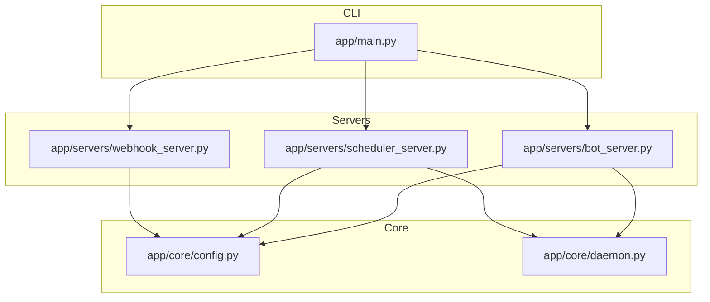
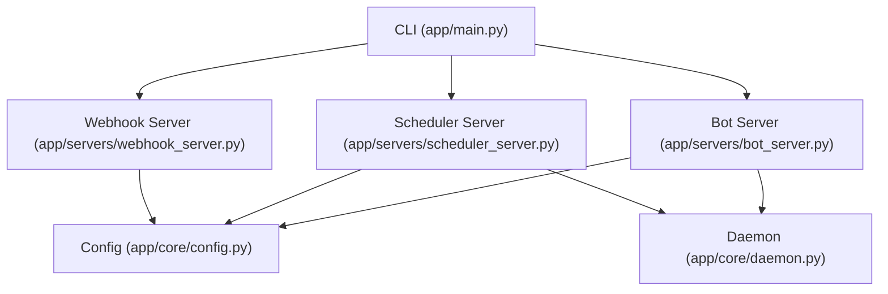
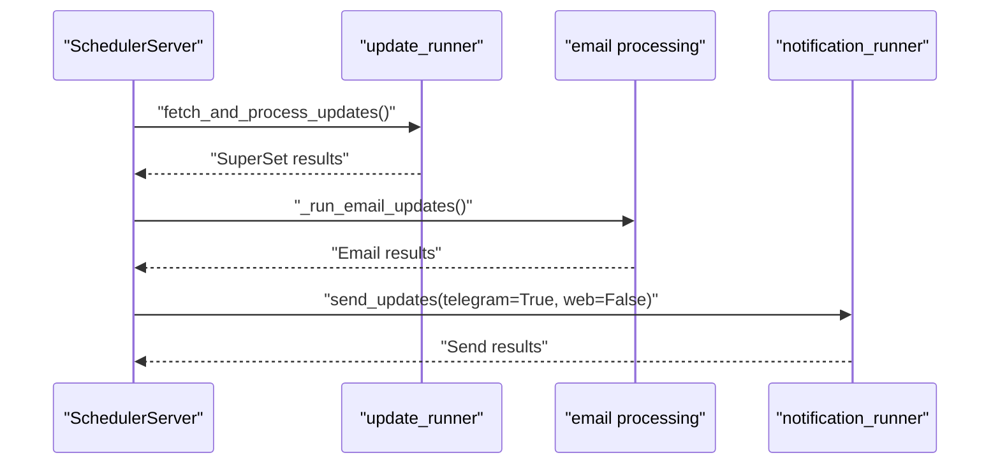
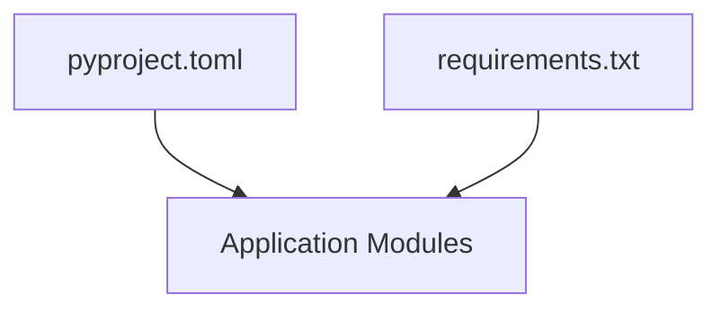
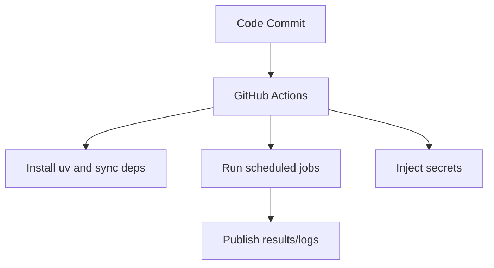

# Deployment & Operations

<cite>
**Referenced Files in This Document**
- [main.py](file://app/main.py)
- [config.py](file://app/core/config.py)
- [daemon.py](file://app/core/daemon.py)
- [bot_server.py](file://app/servers/bot_server.py)
- [scheduler_server.py](file://app/servers/scheduler_server.py)
- [webhook_server.py](file://app/servers/webhook_server.py)
- [docker-compose.dev.yaml](file://app/docker-compose.dev.yaml)
- [pyproject.toml](file://app/pyproject.toml)
- [requirements.txt](file://app/requirements.txt)
- [daily-run.yml.legacy](file://.github/workflows/daily-run.yml.legacy)
- [noon-run.yml.legacy](file://.github/workflows/noon-run.yml.legacy)
</cite>

## Table of Contents
1. [Introduction](#introduction)
2. [Project Structure](#project-structure)
3. [Core Components](#core-components)
4. [Architecture Overview](#architecture-overview)
5. [Detailed Component Analysis](#detailed-component-analysis)
6. [Dependency Analysis](#dependency-analysis)
7. [Performance Considerations](#performance-considerations)
8. [Troubleshooting Guide](#troubleshooting-guide)
9. [Conclusion](#conclusion)
10. [Appendices](#appendices)

## Introduction
This document provides comprehensive deployment and operations guidance for the SuperSet Telegram Notification Bot. It covers production deployment strategies across local machines/VPS, Docker, and cloud platforms (Heroku, Railway, Render). It also documents daemon mode configuration, process management, monitoring approaches, CI/CD pipelines, infrastructure requirements, scaling, performance optimization, maintenance, logging, backups, disaster recovery, and security hardening.

## Project Structure
The application is organized around a modular CLI entry point and three primary runtime servers:
- Telegram bot server for user commands and admin controls
- Scheduler server for automated update jobs
- Webhook/FastAPI server for health checks, web push subscriptions, and administrative APIs

Supporting modules include configuration management, daemon utilities, and runner modules for updates and notifications.

**Diagram sources**
- [main.py](file://app/main.py#L370-L632)
- [config.py](file://app/core/config.py#L156-L254)
- [daemon.py](file://app/core/daemon.py#L114-L251)
- [bot_server.py](file://app/servers/bot_server.py#L29-L519)
- [scheduler_server.py](file://app/servers/scheduler_server.py#L33-L388)
- [webhook_server.py](file://app/servers/webhook_server.py#L69-L387)

**Section sources**
- [main.py](file://app/main.py#L1-L632)
- [config.py](file://app/core/config.py#L1-L254)
- [daemon.py](file://app/core/daemon.py#L1-L251)
- [bot_server.py](file://app/servers/bot_server.py#L1-L519)
- [scheduler_server.py](file://app/servers/scheduler_server.py#L1-L388)
- [webhook_server.py](file://app/servers/webhook_server.py#L1-L387)

## Core Components
- CLI entry point orchestrates commands for bot, scheduler, webhook, update, send, official, and daemon control.
- Configuration module centralizes environment-driven settings with type safety and logging setup.
- Daemon utilities manage Unix-style daemonization, PID tracking, and graceful stop.
- Servers encapsulate runtime behavior: Telegram bot commands, scheduled jobs, and webhook APIs.

Key operational capabilities:
- Daemon mode for background processes with PID files and redirected stdout/stderr.
- Logging configuration supports both console and file outputs, with daemon-aware behavior.
- Separate servers enable horizontal scaling and independent management.

**Section sources**
- [main.py](file://app/main.py#L370-L632)
- [config.py](file://app/core/config.py#L156-L254)
- [daemon.py](file://app/core/daemon.py#L114-L251)
- [bot_server.py](file://app/servers/bot_server.py#L29-L519)
- [scheduler_server.py](file://app/servers/scheduler_server.py#L33-L388)
- [webhook_server.py](file://app/servers/webhook_server.py#L69-L387)

## Architecture Overview
The system comprises three cooperating servers and a shared configuration layer. The CLI routes commands to appropriate server factories, which inject services and clients. The scheduler coordinates recurring tasks, while the webhook server exposes REST endpoints for external integrations.

**Diagram sources**
- [main.py](file://app/main.py#L370-L632)
- [config.py](file://app/core/config.py#L156-L254)
- [daemon.py](file://app/core/daemon.py#L114-L251)
- [bot_server.py](file://app/servers/bot_server.py#L29-L519)
- [scheduler_server.py](file://app/servers/scheduler_server.py#L33-L388)
- [webhook_server.py](file://app/servers/webhook_server.py#L69-L387)

## Detailed Component Analysis

### CLI and Command Dispatch
- Provides unified entry point for running servers, triggering updates, sending notifications, and managing daemons.
- Supports daemon mode flags for bot and scheduler commands.
- Includes legacy mode for backward compatibility.

Operational implications:
- Use daemon mode for long-running processes to detach from terminals.
- Use verbose mode for debugging during development.

**Section sources**
- [main.py](file://app/main.py#L370-L632)

### Configuration Management
- Centralized settings via typed configuration with environment variable loading.
- Logging initialization supports file and stream handlers, with daemon-aware suppression of stdout.
- Provides helpers for safe printing and caching settings.

Operational implications:
- Store secrets in environment variables or .env files.
- Adjust log levels and file paths per environment.

**Section sources**
- [config.py](file://app/core/config.py#L156-L254)

### Daemon Utilities
- Implements true Unix daemonization with double-fork, PID file management, and signal handling.
- Provides stop and status utilities for controlled lifecycle management.
- Redirects stdio to log files in daemon mode.

Operational implications:
- PID files are stored under a dedicated data directory.
- Graceful termination uses SIGTERM with fallback to SIGKILL.

**Section sources**
- [daemon.py](file://app/core/daemon.py#L114-L251)

### Telegram Bot Server
- Handles user commands, admin functions, and statistics queries.
- Integrates with database and notification services.
- Runs in polling mode with graceful shutdown.

Operational implications:
- Requires Telegram bot token and optional chat ID.
- Can run as a standalone server or as a daemon.

**Section sources**
- [bot_server.py](file://app/servers/bot_server.py#L29-L519)

### Scheduler Server
- Runs automated update jobs at multiple times per day and daily official placement scraping.
- Mirrors the legacy update flow: fetch SuperSet and emails, then send notifications.
- Uses an async scheduler with timezone-aware cron jobs.

Operational implications:
- Ideal for running as a separate daemon process.
- Schedules align with IST business hours plus midnight.

**Section sources**
- [scheduler_server.py](file://app/servers/scheduler_server.py#L33-L388)

### Webhook Server (FastAPI)
- Exposes health checks, push subscription endpoints, notification dispatch, and statistics.
- Supports CORS and dependency injection for services.
- Can run standalone or behind reverse proxies/load balancers.

Operational implications:
- Configure CORS origins for production.
- Use HTTPS and authentication for sensitive endpoints.

**Section sources**
- [webhook_server.py](file://app/servers/webhook_server.py#L69-L387)

### Sequence: Scheduled Update Flow

**Diagram sources**
- [scheduler_server.py](file://app/servers/scheduler_server.py#L78-L117)
- [scheduler_server.py](file://app/servers/scheduler_server.py#L118-L237)

## Dependency Analysis
Runtime dependencies are declared via pyproject.toml and pinned in requirements.txt. The application relies on:
- Asynchronous scheduling and Telegram integration
- FastAPI and Uvicorn for the webhook server
- MongoDB client for persistence
- Web push and VAPID for browser notifications
- LLM integration for email processing

**Diagram sources**
- [pyproject.toml](file://app/pyproject.toml#L1-L27)
- [requirements.txt](file://app/requirements.txt#L1-L81)

**Section sources**
- [pyproject.toml](file://app/pyproject.toml#L1-L27)
- [requirements.txt](file://app/requirements.txt#L1-L81)

## Performance Considerations
- Use daemon mode for persistent servers to avoid terminal ties and improve reliability.
- Tune logging levels to reduce I/O overhead in production.
- For the webhook server, deploy behind a reverse proxy and enable HTTP/2 and compression.
- Optimize MongoDB connections and indexing for frequent reads/writes.
- Limit concurrent email processing and batch database writes to control latency spikes.
- Monitor scheduler job durations and adjust cron intervals to prevent overlap.

[No sources needed since this section provides general guidance]

## Troubleshooting Guide
Common operational issues and remedies:
- Daemon fails to start or leaves stale PID files: verify permissions and cleanup stale PID files.
- Logging not visible in daemon mode: confirm log file paths and permissions.
- Telegram bot not responding: validate token and network connectivity.
- Webhook server errors: check CORS configuration and service availability.
- Scheduler jobs failing: review logs for exceptions and resource limits.

**Section sources**
- [daemon.py](file://app/core/daemon.py#L59-L112)
- [config.py](file://app/core/config.py#L188-L254)
- [bot_server.py](file://app/servers/bot_server.py#L405-L453)
- [webhook_server.py](file://app/servers/webhook_server.py#L139-L144)

## Conclusion
The SuperSet Telegram Notification Bot is designed for modular, scalable deployment across local, containerized, and cloud environments. By leveraging daemon mode, centralized configuration, and separate servers, operators can achieve reliable, maintainable operations with clear separation of concerns.

[No sources needed since this section summarizes without analyzing specific files]

## Appendices

### A. Production Deployment Strategies

- Local machine/VPS
  - Install Python 3.12+ and dependencies.
  - Configure environment variables and .env file.
  - Start servers in daemon mode using CLI commands.
  - Use systemd or similar supervisors for automatic restarts.

- Docker (single service stack)
  - Use the provided compose file to run MongoDB locally.
  - Build and run the application container with environment variables mapped.
  - Persist MongoDB data via volumes.

- Cloud platforms
  - Heroku: Use a Python buildpack, configure dynos for bot/scheduler/webhook, and attach a MongoDB add-on. Set environment variables in the dashboard.
  - Railway: Provision a MongoDB service and connect via connection string. Deploy the app with environment variables.
  - Render: Provision a MongoDB service and connect via connection string. Deploy the app with environment variables.

[No sources needed since this section provides general guidance]

### B. Infrastructure Requirements
- Compute: Minimal single-core CPU and 512 MB RAM for basic operation; scale based on traffic and processing volume.
- Storage: Persistent storage for MongoDB data and logs.
- Networking: Outbound access to Telegram, email providers, and external APIs; inbound access for webhook server if exposed publicly.
- Secrets management: Environment variables for tokens, keys, and connection strings.

[No sources needed since this section provides general guidance]

### C. Scaling Considerations
- Horizontal scaling: Run multiple instances of each server behind a load balancer (for webhook server).
- Vertical scaling: Increase CPU/RAM for periods of heavy email processing or notification bursts.
- Queue-based processing: Offload heavy workloads to background workers or queues if growth demands it.

[No sources needed since this section provides general guidance]

### D. Monitoring and Observability
- Logs: Centralize logs from daemonized processes and webhook server to a log aggregation system.
- Metrics: Track job durations, error rates, and throughput.
- Health checks: Use webhook server’s health endpoints for readiness/liveness probes.
- Alerts: Configure alerts for failed jobs, high error rates, and resource exhaustion.

[No sources needed since this section provides general guidance]

### E. CI/CD Pipeline Setup
- Existing workflows demonstrate scheduled runs using GitHub Actions with uv for dependency management and environment variable injection.
- Extend workflows to include linting, unit/integration tests, and deployment stages.

**Diagram sources**
- [daily-run.yml.legacy](file://.github/workflows/daily-run.yml.legacy#L1-L72)
- [noon-run.yml.legacy](file://.github/workflows/noon-run.yml.legacy#L1-L58)

**Section sources**
- [daily-run.yml.legacy](file://.github/workflows/daily-run.yml.legacy#L1-L72)
- [noon-run.yml.legacy](file://.github/workflows/noon-run.yml.legacy#L1-L58)

### F. Maintenance Procedures
- Regularly rotate secrets and update dependencies.
- Review and prune old logs and stale PID files.
- Validate database connectivity and indexes periodically.
- Audit webhook endpoints for unauthorized access.

[No sources needed since this section provides general guidance]

### G. Log Management
- Use file logging with rotation in production.
- Ensure daemon mode does not suppress critical logs.
- Forward logs to centralized systems for retention and analysis.

[No sources needed since this section provides general guidance]

### H. Backup and Disaster Recovery
- Back up MongoDB data regularly and test restoration procedures.
- Maintain .env and configuration backups.
- Document recovery playbooks for each server and data store.

[No sources needed since this section provides general guidance]

### I. Security Hardening
- Enforce HTTPS for webhook server and external integrations.
- Restrict CORS origins to trusted domains.
- Use strong secrets and rotate them regularly.
- Apply least privilege to database and API endpoints.
- Rate-limit webhook endpoints and validate inputs.

[No sources needed since this section provides general guidance]

### J. SSL/TLS and Access Control
- Obtain TLS certificates for webhook server domain.
- Use environment variables for VAPID keys and Telegram tokens.
- Restrict admin commands to authorized users only.

[No sources needed since this section provides general guidance]

### K. Example Runtime Commands
- Start bot in background: python main.py bot -d
- Start scheduler in background: python main.py scheduler -d
- Check daemon status: python main.py status
- Stop a daemon: python main.py stop bot
- Run webhook server: python main.py webhook --host 0.0.0.0 --port 8000

**Section sources**
- [main.py](file://app/main.py#L370-L632)

### L. Docker Compose Reference
- MongoDB service with exposed port and mounted volume for persistence.

**Section sources**
- [docker-compose.dev.yaml](file://app/docker-compose.dev.yaml#L1-L15)