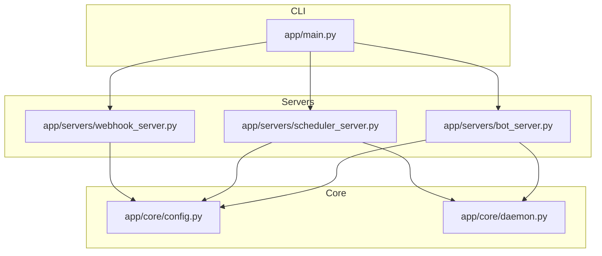
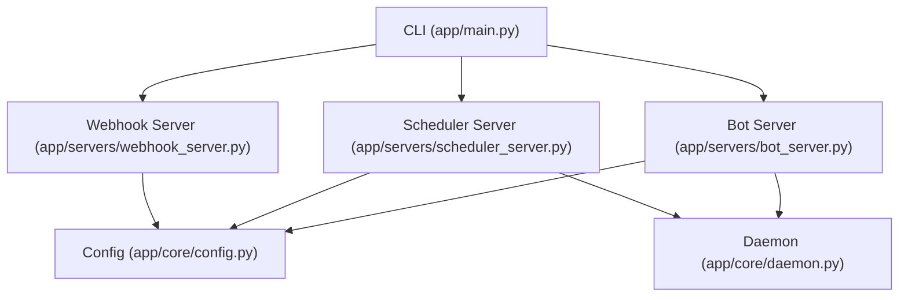
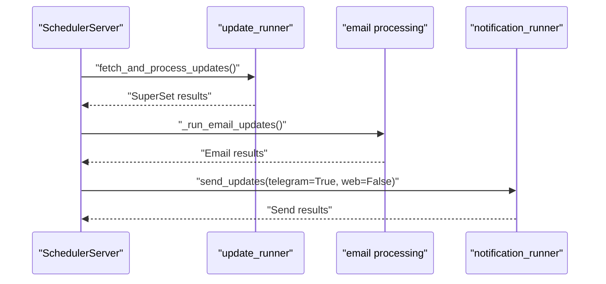
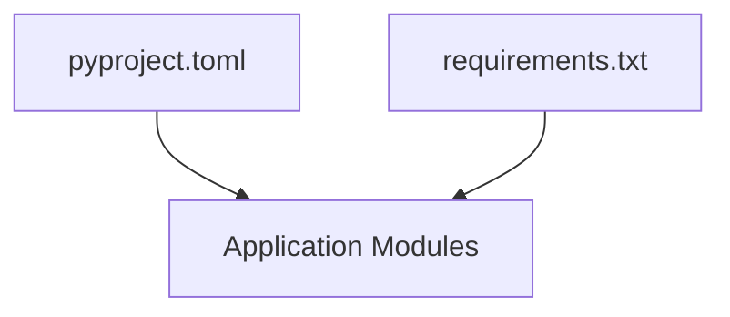

# Deployment & operations

## Introduction
Shipping and running the bot: local/VPS, Docker, Heroku/Railway/Render. Daemon mode, process managers, monitoring, backups, and the security checklist that usually gets skipped until something breaks.

## Project structure
The application is organized around a modular CLI entry point and three primary runtime servers:
- Telegram bot server for user commands and admin controls
- Scheduler server for automated update jobs
- Webhook/FastAPI server for health checks, web push subscriptions, and administrative APIs

Supporting modules include configuration management, daemon utilities, and runner modules for updates and notifications.

```mermaid
graph TB
subgraph "CLI"
MAIN["app/main.py"]
end
subgraph "Core"
CFG["app/core/config.py"]
DAE["app/core/daemon.py"]
end
subgraph "Servers"
BOT["app/servers/bot_server.py"]
SCH["app/servers/scheduler_server.py"]
WH["app/servers/webhook_server.py"]
end
MAIN --> BOT
MAIN --> SCH
MAIN --> WH
BOT --> CFG
SCH --> CFG
WH --> CFG
BOT --> DAE
SCH --> DAE
```

## Core components
- CLI entry point orchestrates commands for bot, scheduler, webhook, update, send, official, and daemon control.
- Configuration module centralizes environment-driven settings with type safety and logging setup.
- Daemon utilities manage Unix-style daemonization, PID tracking, and graceful stop.
- Servers encapsulate runtime behavior: Telegram bot commands, scheduled jobs, and webhook APIs.

Key operational capabilities:
- Daemon mode for background processes with PID files and redirected stdout/stderr.
- Logging configuration supports both console and file outputs, with daemon-aware behavior.
- Separate servers enable horizontal scaling and independent management.

## Architecture overview
The system comprises three cooperating servers and a shared configuration layer. The CLI routes commands to appropriate server factories, which inject services and clients. The scheduler coordinates recurring tasks, while the webhook server exposes REST endpoints for external integrations.

```mermaid
graph TB
CLI["CLI (app/main.py)"]
CFG["Config (app/core/config.py)"]
DAE["Daemon (app/core/daemon.py)"]
BOT["Bot Server (app/servers/bot_server.py)"]
SCH["Scheduler Server (app/servers/scheduler_server.py)"]
WH["Webhook Server (app/servers/webhook_server.py)"]
CLI --> BOT
CLI --> SCH
CLI --> WH
BOT --> CFG
SCH --> CFG
WH --> CFG
BOT --> DAE
SCH --> DAE
```

## Detailed component analysis

### CLI and command dispatch
- Provides unified entry point for running servers, triggering updates, sending notifications, and managing daemons.
- Supports daemon mode flags for bot and scheduler commands.
- Includes legacy mode for backward compatibility.

Operational implications:
- Use daemon mode for long-running processes to detach from terminals.
- Use verbose mode for debugging during development.

### Configuration management
- Centralized settings via typed configuration with environment variable loading.
- Logging initialization supports file and stream handlers, with daemon-aware suppression of stdout.
- Provides helpers for safe printing and caching settings.

Operational implications:
- Store secrets in environment variables or .env files.
- Adjust log levels and file paths per environment.

### Daemon utilities
- Implements true Unix daemonization with double-fork, PID file management, and signal handling.
- Provides stop and status utilities for controlled lifecycle management.
- Redirects stdio to log files in daemon mode.

Operational implications:
- PID files are stored under a dedicated data directory.
- Graceful termination uses SIGTERM with fallback to SIGKILL.

### Telegram bot server
- Handles user commands, admin functions, and statistics queries.
- Integrates with database and notification services.
- Runs in polling mode with graceful shutdown.

Operational implications:
- Requires Telegram bot token and optional chat ID.
- Can run as a standalone server or as a daemon.

### Scheduler server
- Runs SuperSet plus email at midnight and 8 AM through 11 PM IST, and official scrape at 12 PM IST.
- Mirrors the legacy update flow: fetch SuperSet and emails, then send Telegram.
- Uses AsyncIOScheduler with Asia/Kolkata cron jobs in `app/servers/scheduler_server.py`.

Operational implications:
- Run as its own daemon: `python main.py scheduler --daemon`.
- Overnight 1 AM through 7 AM IST is idle on purpose.

### Webhook server (FastAPI)
- Exposes health checks, push subscription endpoints, notification dispatch, and statistics.
- Supports CORS and dependency injection for services.
- Can run standalone or behind reverse proxies/load balancers.

Operational implications:
- Configure CORS origins for production.
- Use HTTPS and authentication for sensitive endpoints.

### Sequence: scheduled update flow

```mermaid
sequenceDiagram
participant SCH as "SchedulerServer"
participant UPD as "update_runner"
participant EM as "email processing"
participant NOT as "notification_runner"
SCH->>UPD : "fetch_and_process_updates()"
UPD-->>SCH : "SuperSet results"
SCH->>EM : "_run_email_updates()"
EM-->>SCH : "Email results"
SCH->>NOT : "send_updates(telegram=True, web=False)"
NOT-->>SCH : "Send results"
```

Scheduled scraping is `python main.py scheduler` on the host. Workflow files under `.github/workflows/` are `.legacy` and do not drive the live cron.

## Dependency analysis
Runtime dependencies are declared via pyproject.toml and pinned in requirements.txt. The application relies on:
- Asynchronous scheduling and Telegram integration
- FastAPI and Uvicorn for the webhook server
- MongoDB client for persistence
- Web push and VAPID for browser notifications
- LLM integration for email processing

```mermaid
graph TB
PY["pyproject.toml"]
REQ["requirements.txt"]
APP["Application Modules"]
PY --> APP
REQ --> APP
```

## Performance considerations
- Use daemon mode for persistent servers to avoid terminal ties and improve reliability.
- Tune logging levels to reduce I/O overhead in production.
- For the webhook server, deploy behind a reverse proxy and enable HTTP/2 and compression.
- Optimize MongoDB connections and indexing for frequent reads/writes.
- Limit concurrent email processing and batch database writes to control latency spikes.
- Monitor scheduler job durations and adjust cron intervals to prevent overlap.

[No sources needed since this section provides general guidance]

## Troubleshooting guide
Common operational issues and remedies:
- Daemon fails to start or leaves stale PID files: verify permissions and cleanup stale PID files.
- Logging not visible in daemon mode: confirm log file paths and permissions.
- Telegram bot not responding: validate token and network connectivity.
- Webhook server errors: check CORS configuration and service availability.
- Scheduler jobs failing: review logs for exceptions and resource limits.

## Conclusion
Local, Docker, or a PaaS box. Daemon mode, one config, three servers. Keep concerns split and the process manager boring.
