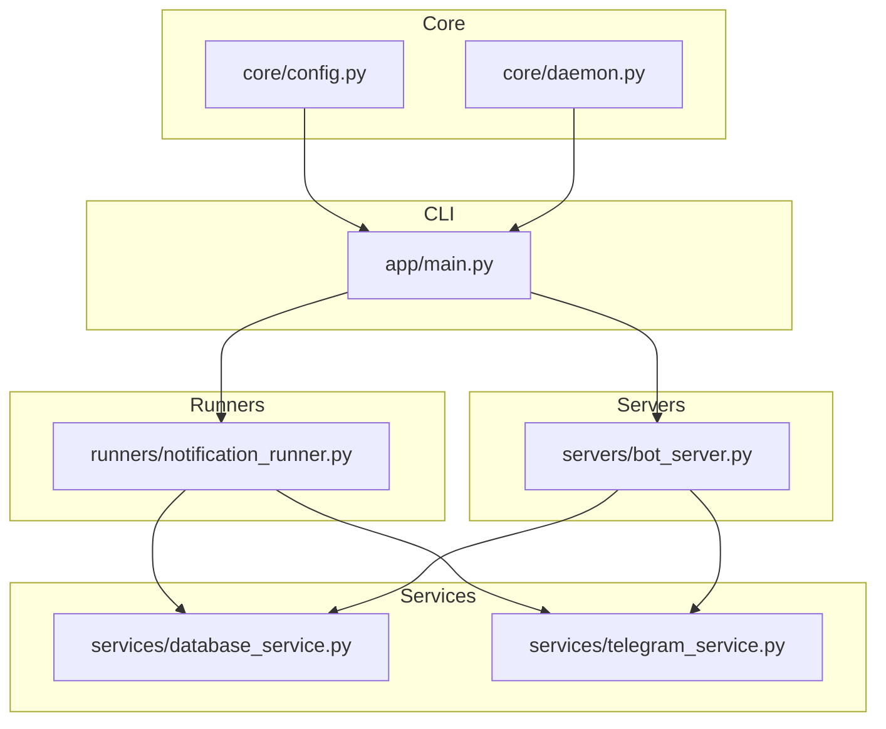
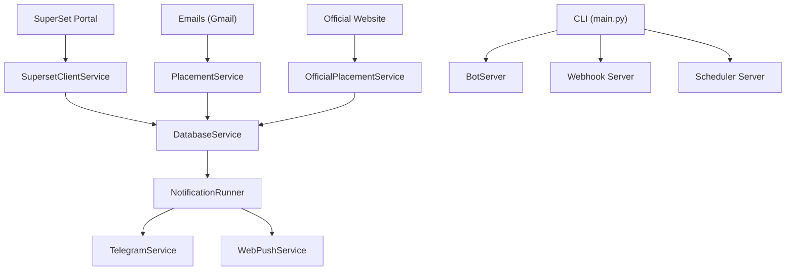
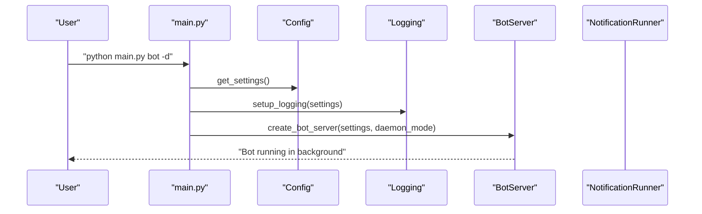
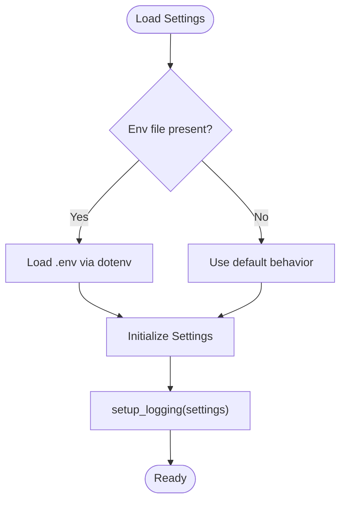
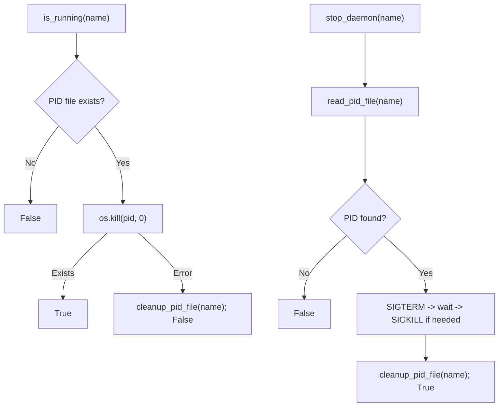
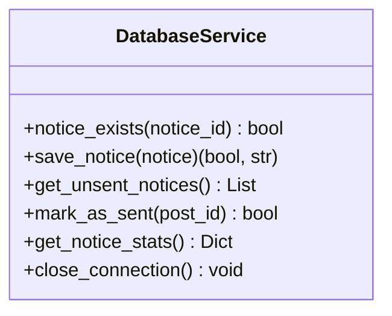
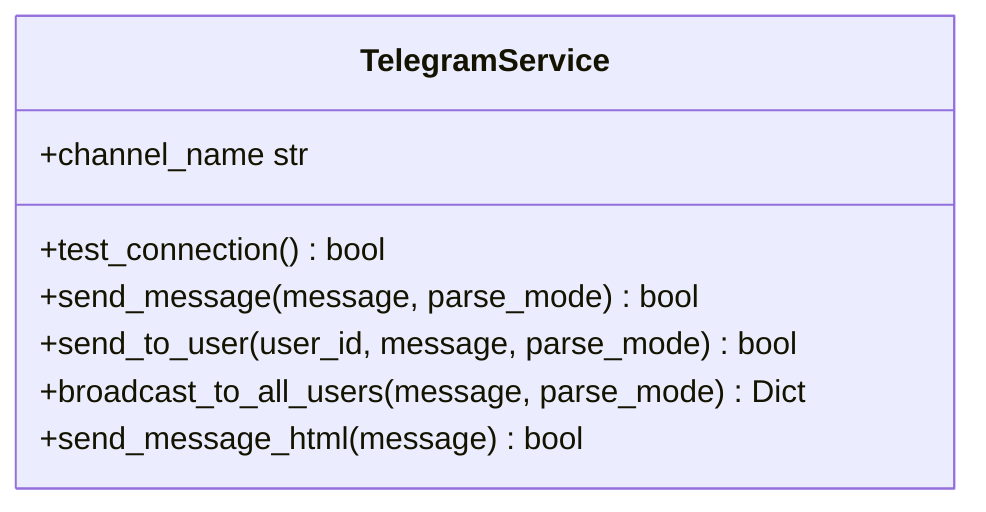
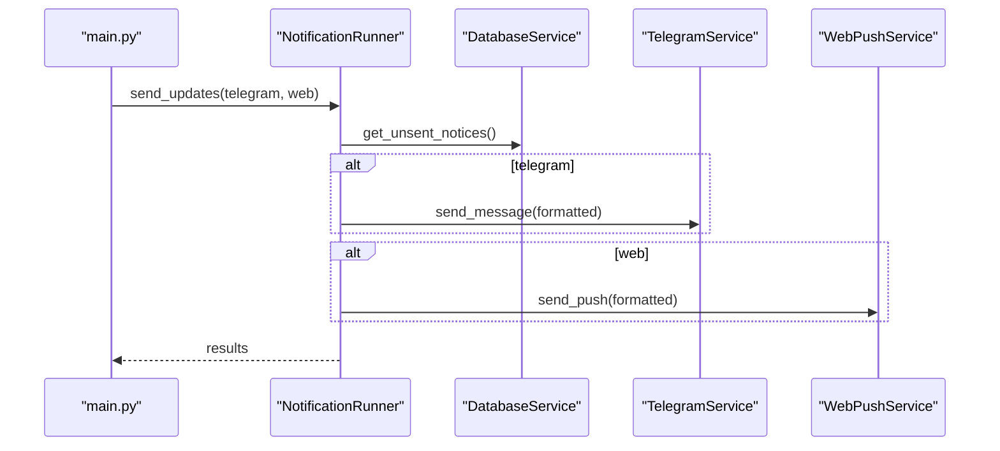
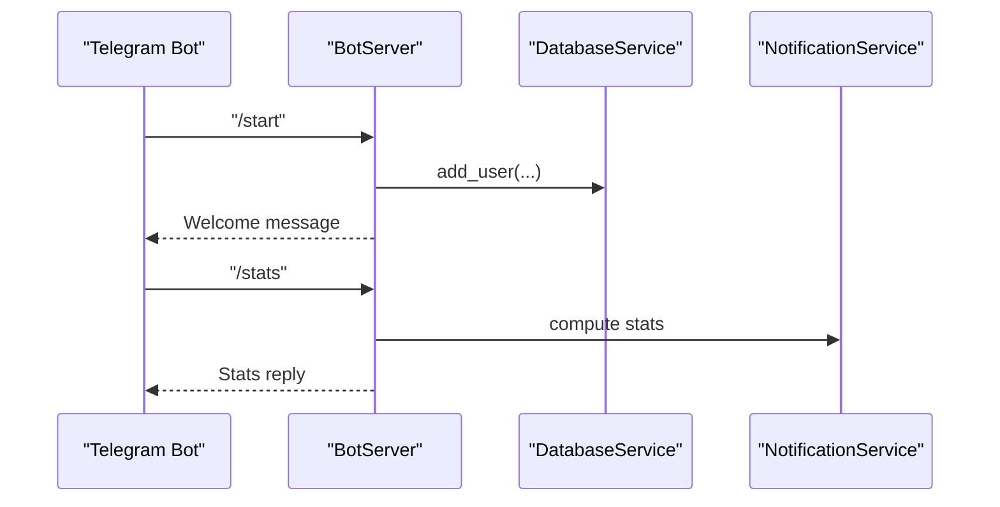
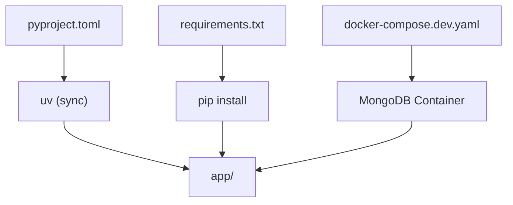

# Development & contributing

## Introduction
This page provides detailed development and contribution guidance for the SuperSet Telegram Notification Bot. It covers local setup, testing, code standards, development tools, debugging and profiling, performance optimization, CI/CD, and extension strategies for adding new notification channels and data sources.

## Project structure
The project is organized as a modular Python application under the app/ directory with clear separation of concerns:
- Core configuration and daemon utilities
- Service layer for business logic
- Servers for Telegram bot, webhook, and update orchestration
- Data models and schemas
- Tests and logs
- Development and deployment assets

```mermaid
graph TB
subgraph "Core"
CFG["core/config.py"]
DAE["core/daemon.py"]
end
subgraph "Services"
DB["services/database_service.py"]
TG["services/telegram_service.py"]
end
subgraph "Runners"
NR["runners/notification_runner.py"]
end
subgraph "Servers"
BOT["servers/bot_server.py"]
end
subgraph "CLI"
MAIN["app/main.py"]
end
CFG --> MAIN
DAE --> MAIN
MAIN --> BOT
MAIN --> NR
NR --> DB
NR --> TG
BOT --> DB
BOT --> TG
```

## Core components
- CLI entry point orchestrating commands for bot, scheduler, webhook, update, send, official, and daemon control
- Centralized configuration with Pydantic settings and logging setup
- Daemon utilities for Unix-style background processes
- Service layer for database operations, Telegram notifications, and integrations
- Notification runner coordinating dispatch across channels
- Telegram bot server handling commands and user interactions

Key responsibilities and integration points are defined in the CLI and service wiring.

## Architecture overview
The system follows a dependency-injected, modular architecture:
- Data sources (SuperSet portal, emails, official website) feed structured data into MongoDB
- Services encapsulate business logic and integrate with external APIs
- Notification channels (Telegram, Web Push) consume unsent notices from storage
- CLI and servers orchestrate execution and expose admin interfaces

```mermaid
graph TB
SRC1["SuperSet Portal"] --> SS["SupersetClientService"]
SRC2["Emails (Gmail)"] --> PS["PlacementService"]
SRC3["Official Website"] --> OPS["OfficialPlacementService"]
SS --> DB["DatabaseService"]
PS --> DB
OPS --> DB
DB --> NR["NotificationRunner"]
NR --> TG["TelegramService"]
NR --> WP["WebPushService"]
CLI["CLI (main.py)"] --> BOT["BotServer"]
CLI --> WH["Webhook Server"]
CLI --> SCH["Scheduler Server"]
```

## Detailed component analysis

### CLI and command orchestration
The CLI defines subcommands for bot, scheduler, webhook, update, send, official, and daemon control. It sets up logging, supports daemon mode, and wires services for orchestrated execution.

```mermaid
sequenceDiagram
participant U as "User"
participant CLI as "main.py"
participant CFG as "Config"
participant LOG as "Logging"
participant BOT as "BotServer"
participant NR as "NotificationRunner"
U->>CLI : "python main.py bot -d"
CLI->>CFG : get_settings()
CLI->>LOG : setup_logging(settings)
CLI->>BOT : create_bot_server(settings, daemon_mode)
BOT-->>U : "Bot running in background"
```

### Configuration and logging
Centralized settings management with Pydantic, environment loading, and configurable logging levels and destinations. Includes daemon-aware printing and PID file management.

```mermaid
flowchart TD
Start(["Load Settings"]) --> EnvCheck{"Env file present?"}
EnvCheck --> |Yes| LoadEnv["Load .env via dotenv"]
EnvCheck --> |No| DefaultEnv["Use default behavior"]
LoadEnv --> InitSettings["Initialize Settings"]
DefaultEnv --> InitSettings
InitSettings --> SetupLog["setup_logging(settings)"]
SetupLog --> Done(["Ready"])
```

### Daemon utilities
Unix-style daemonization with PID file management, graceful stop, and status reporting. Ensures background processes detach cleanly and redirect output.

```mermaid
flowchart TD
A["is_running(name)"] --> B{"PID file exists?"}
B --> |No| NotRunning["False"]
B --> |Yes| CheckProc["os.kill(pid, 0)"]
CheckProc --> |Exists| Running["True"]
CheckProc --> |Error| Clean["cleanup_pid_file(name); False"]
Stop["stop_daemon(name)"] --> ReadPID["read_pid_file(name)"]
ReadPID --> HasPID{"PID found?"}
HasPID --> |No| NotRunning2["False"]
HasPID --> |Yes| Kill["SIGTERM -> wait -> SIGKILL if needed"]
Kill --> Cleanup["cleanup_pid_file(name); True"]
```

### Database service
Encapsulates MongoDB operations for notices, jobs, placement offers, users, and policies. Provides helpers for existence checks, retrieval, and statistics.

```mermaid
classDiagram
class DatabaseService {
+notice_exists(notice_id) bool
+save_notice(notice) (bool, str)
+get_unsent_notices() List
+mark_as_sent(post_id) bool
+get_notice_stats() Dict
+close_connection() void
}
```

### Telegram service
Implements Telegram notifications with message chunking, formatting, and broadcasting capabilities. Integrates with a Telegram client wrapper.

```mermaid
classDiagram
class TelegramService {
+channel_name str
+test_connection() bool
+send_message(message, parse_mode) bool
+send_to_user(user_id, message, parse_mode) bool
+broadcast_to_all_users(message, parse_mode) Dict
+send_message_html(message) bool
}
```

### Notification runner
Coordinates sending unsent notices across channels using dependency injection. Supports Telegram and Web Push, with optional NotificationService composition.

```mermaid
sequenceDiagram
participant CLI as "main.py"
participant NR as "NotificationRunner"
participant DB as "DatabaseService"
participant TG as "TelegramService"
participant WP as "WebPushService"
CLI->>NR : send_updates(telegram, web)
NR->>DB : get_unsent_notices()
alt telegram
NR->>TG : send_message(formatted)
end
alt web
NR->>WP : send_push(formatted)
end
NR-->>CLI : results
```

### Telegram bot server
Long-polling Telegram bot with command handlers for user registration, help, status, stats, and administrative commands. Integrates with services for DB, notifications, and stats.

```mermaid
sequenceDiagram
participant TGB as "Telegram Bot"
participant BS as "BotServer"
participant DB as "DatabaseService"
participant NS as "NotificationService"
TGB->>BS : "/start"
BS->>DB : add_user(...)
BS-->>TGB : Welcome message
TGB->>BS : "/stats"
BS->>NS : compute stats
BS-->>TGB : Stats reply
```

## Dependency analysis
- Project metadata and dependencies are defined in pyproject.toml and requirements.txt
- Development uses uv for dependency management and reproducible environments
- Docker Compose provides a local MongoDB instance for development

```mermaid
graph TB
PY["pyproject.toml"] --> UV["uv (sync)"]
RT["requirements.txt"] --> PIP["pip install"]
DC["docker-compose.dev.yaml"] --> MONGO["MongoDB Container"]
UV --> APP["app/"]
PIP --> APP
MONGO --> APP
```

## Performance considerations
- Use daemon mode for background processes to reduce overhead and improve reliability
- Chunk long Telegram messages to avoid rate limits and failures
- Minimize database round-trips by batching operations and using aggregation where possible
- Use caching for settings and enable logging levels appropriate to environment
- Profile CPU and memory usage during heavy update cycles using built-in profiling tools

[No sources needed since this section provides general guidance]

## Troubleshooting guide
Common issues and remedies:
- Verify environment variables and MongoDB connectivity before running
- Check daemon status and logs for background processes
- Use verbose CLI mode for detailed logs
- Inspect scheduler job registrations and intervals
- Validate Telegram bot token and chat ID configuration

## Contribution workflow
- Fork and branch: feature/your-feature-name or fix/issue-description
- Develop with pytest for unit tests and flake8 for style checks
- Commit with conventional messages (feat:, fix:, refactor:, docs:, test:)
- Create Pull Request with checklist items addressed
- Address reviewer feedback and ensure tests pass

## Extensibility & integration guide
- Adding a new notification channel:
  - Implement a channel-specific service following the INotificationChannel pattern
  - Integrate via NotificationRunner and CLI flags
  - Add tests and update documentation
- Adding a new data source:
  - Create a client/service pair similar to SupersetClientService or PlacementService
  - Wire into update orchestration in main.py
  - Ensure idempotent persistence and event generation for notifications
- Integrating additional LLM pipelines:
  - Extend LangGraph workflows in dedicated services
  - Maintain separation of concerns and inject dependencies

## Continuous integration and release management
- Scheduled workflows run the bot hourly and scrape official data
- Python version pinned to 3.11 in CI for stability
- Secrets injected for Telegram, MongoDB, SuperSet credentials, and email access
- Use uv caching for faster dependency installs in CI

## Development & testing guide
- Local setup with uv sync and Docker Compose for MongoDB
- Run pytest for unit tests and coverage
- Use mocks for external services in tests
- Follow AGENTS.md style and best practices

## Debugging and profiling
- Use safe_print for daemon-friendly output
- Enable verbose logging via CLI flags
- Employ pdb or IDE debuggers for interactive inspection
- Profile code using cProfile for hotspots

## Code standards and style
- Python 3.12+ with type hints and docstrings
- Organized imports, consistent naming, and class structure
- Logging at appropriate levels and error handling patterns
- Configuration via Pydantic settings with validation

## Conclusion
This guide consolidates local development, testing, contribution, and operational practices for the SuperSet Telegram Notification Bot. By following the documented workflows, standards, and extension patterns, contributors can reliably add features, integrate new channels, and maintain system performance and reliability.
