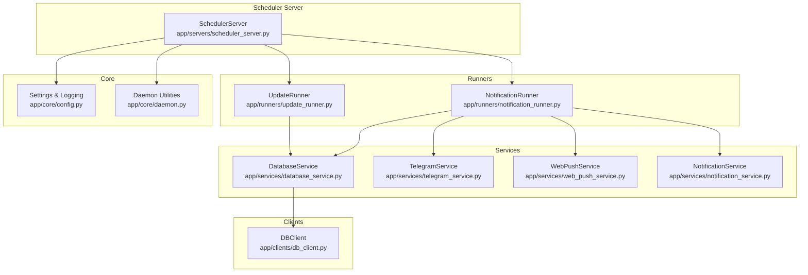
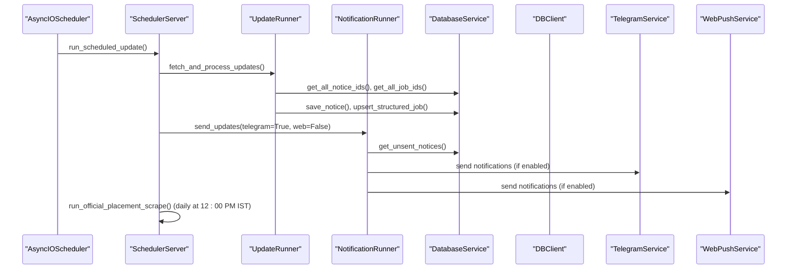
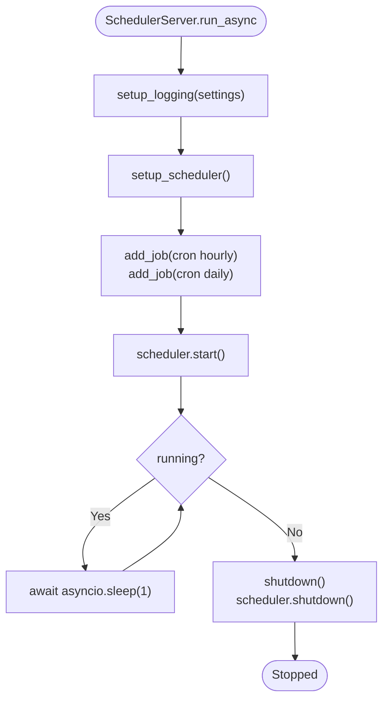
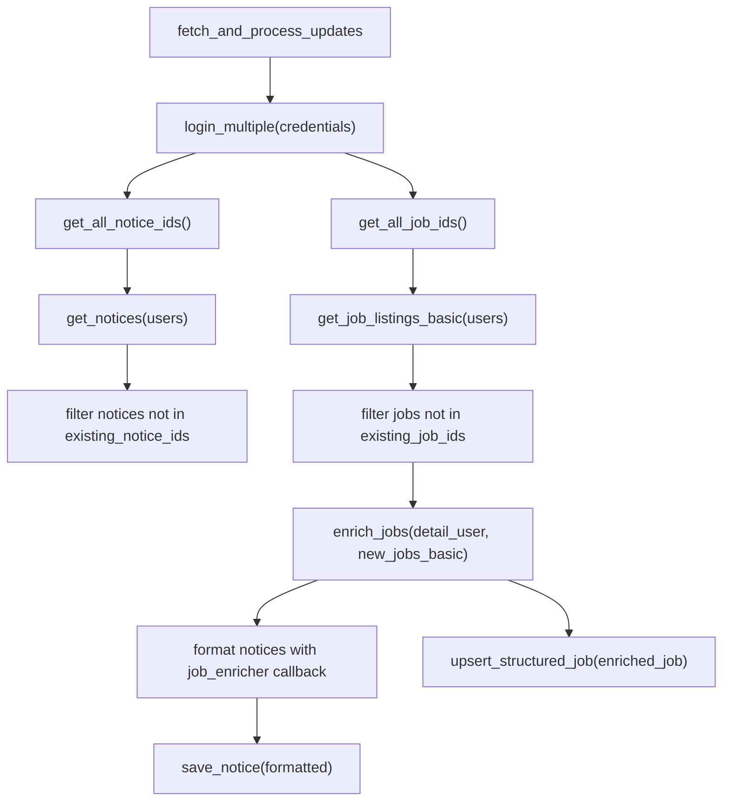
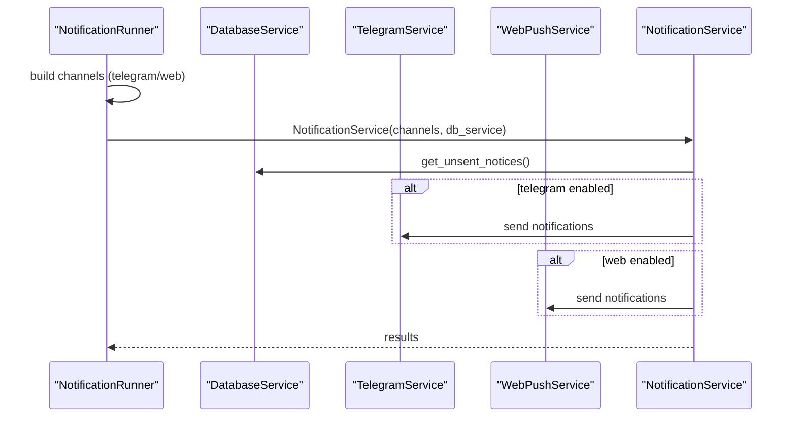
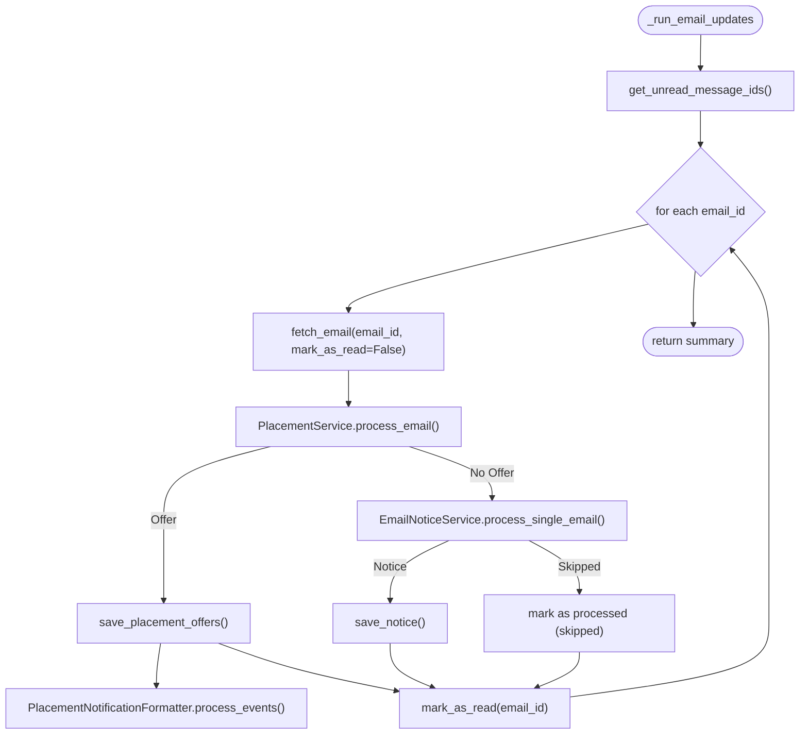
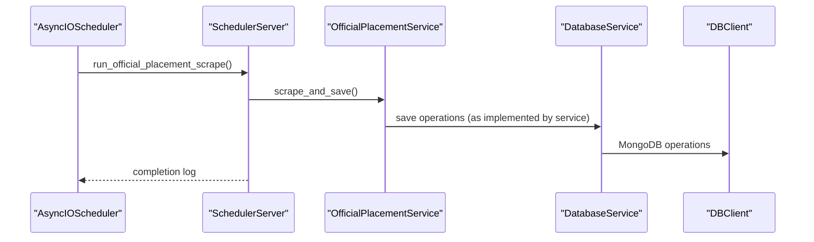
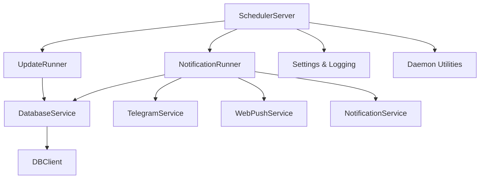

# Scheduler Server

<cite>
**Referenced Files in This Document**
- [scheduler_server.py](file://app/servers/scheduler_server.py)
- [update_runner.py](file://app/runners/update_runner.py)
- [notification_runner.py](file://app/runners/notification_runner.py)
- [config.py](file://app/core/config.py)
- [daemon.py](file://app/core/daemon.py)
- [main.py](file://app/main.py)
- [database_service.py](file://app/services/database_service.py)
- [db_client.py](file://app/clients/db_client.py)
- [pyproject.toml](file://app/pyproject.toml)
- [requirements.txt](file://app/requirements.txt)
</cite>

## Table of Contents
1. [Introduction](#introduction)
2. [Project Structure](#project-structure)
3. [Core Components](#core-components)
4. [Architecture Overview](#architecture-overview)
5. [Detailed Component Analysis](#detailed-component-analysis)
6. [Dependency Analysis](#dependency-analysis)
7. [Performance Considerations](#performance-considerations)
8. [Troubleshooting Guide](#troubleshooting-guide)
9. [Conclusion](#conclusion)

## Introduction
This document explains the Scheduler Server component responsible for automated job execution using APScheduler. It covers scheduler configuration, job scheduling patterns, and automated update workflows. It documents the UpdateRunner coordination for data collection from SuperSet portal, email processing, and official website scraping, as well as the NotificationRunner for distributing notifications across Telegram and web push channels. The guide also addresses job lifecycle management, error handling and retry mechanisms, cron job configurations, integration with external services, startup procedures, logging, and performance optimization for automated workflows.

## Project Structure
The Scheduler Server is implemented as a dedicated asynchronous server that schedules and executes periodic tasks independently from the Telegram bot server. It integrates with runner modules and services to fetch data, process it, and distribute notifications.

**Diagram sources**
- [scheduler_server.py](file://app/servers/scheduler_server.py#L33-L387)
- [update_runner.py](file://app/runners/update_runner.py#L21-L278)
- [notification_runner.py](file://app/runners/notification_runner.py#L21-L160)
- [database_service.py](file://app/services/database_service.py#L16-L200)
- [db_client.py](file://app/clients/db_client.py#L16-L104)
- [config.py](file://app/core/config.py#L18-L254)
- [daemon.py](file://app/core/daemon.py#L114-L233)

**Section sources**
- [scheduler_server.py](file://app/servers/scheduler_server.py#L1-L14)
- [main.py](file://app/main.py#L61-L85)

## Core Components
- SchedulerServer: Manages APScheduler, defines cron-triggered jobs, and orchestrates update and notification workflows.
- UpdateRunner: Coordinates fetching and processing updates from SuperSet and local email sources.
- NotificationRunner: Sends unsent notices via Telegram and/or Web Push channels.
- DatabaseService and DBClient: Provide MongoDB access for persistence and retrieval.
- Settings and Logging: Centralized configuration and logging setup for scheduler-specific logs.
- Daemon Utilities: Provide daemonization and PID file management for long-running scheduler processes.

**Section sources**
- [scheduler_server.py](file://app/servers/scheduler_server.py#L33-L387)
- [update_runner.py](file://app/runners/update_runner.py#L21-L278)
- [notification_runner.py](file://app/runners/notification_runner.py#L21-L160)
- [database_service.py](file://app/services/database_service.py#L16-L200)
- [db_client.py](file://app/clients/db_client.py#L16-L104)
- [config.py](file://app/core/config.py#L18-L254)
- [daemon.py](file://app/core/daemon.py#L114-L233)

## Architecture Overview
The Scheduler Server uses APScheduler to schedule two primary jobs:
- Periodic update job: Executes every hour from 00:00 to 23:00 IST, mirroring the legacy update-and-send behavior.
- Daily official placement scrape: Runs at 12:00 PM IST to update official placement data.

**Diagram sources**
- [scheduler_server.py](file://app/servers/scheduler_server.py#L78-L317)
- [update_runner.py](file://app/runners/update_runner.py#L56-L148)
- [notification_runner.py](file://app/runners/notification_runner.py#L60-L115)
- [database_service.py](file://app/services/database_service.py#L69-L147)
- [db_client.py](file://app/clients/db_client.py#L42-L79)

## Detailed Component Analysis

### SchedulerServer
- Responsibilities:
  - Initialize logging and settings.
  - Configure APScheduler with Asia/Kolkata timezone.
  - Schedule hourly update jobs from 00:00 to 23:00 IST.
  - Schedule daily official placement scrape at 12:00 PM IST.
  - Execute jobs by invoking runner functions and service methods.
  - Graceful shutdown on interrupt or termination.

- Job scheduling patterns:
  - Hourly cron jobs: Triggered every hour at minute 0.
  - Daily cron job: Triggered at 12:00 PM IST.

- Error handling:
  - Exceptions in scheduled jobs are caught and logged; the scheduler continues running.

- Startup and lifecycle:
  - Asynchronous run loop keeps the server alive until shutdown.
  - Daemon mode support via core.daemon utilities.

**Diagram sources**
- [scheduler_server.py](file://app/servers/scheduler_server.py#L326-L363)

**Section sources**
- [scheduler_server.py](file://app/servers/scheduler_server.py#L33-L387)

### UpdateRunner
- Responsibilities:
  - Authenticate to SuperSet using stored credentials.
  - Fetch notices and job listings, deduplicate against existing IDs in the database.
  - Enrich only new jobs with detailed information to minimize API calls.
  - Process notices and link them to jobs, using a job enricher callback when needed.
  - Upsert structured jobs and save notices to the database.

- Data flow:
  - Pre-fetch existing notice and job IDs from the database.
  - Fetch notices and basic job listings.
  - Filter new items and enrich only new jobs.
  - Process notices with job enrichment callback and save results.
  - Upsert new jobs.

**Diagram sources**
- [update_runner.py](file://app/runners/update_runner.py#L56-L237)

**Section sources**
- [update_runner.py](file://app/runners/update_runner.py#L21-L278)
- [database_service.py](file://app/services/database_service.py#L69-L147)

### NotificationRunner
- Responsibilities:
  - Initialize services for Telegram and Web Push channels.
  - Send unsent notices via selected channels.
  - Respect configuration to enable/disable channels.

- Channel selection:
  - Telegram: Enabled when requested.
  - Web Push: Enabled only if configured and marked as enabled.

- Data flow:
  - Build channel list based on flags.
  - Instantiate NotificationService with selected channels.
  - Retrieve unsent notices and dispatch to channels.

**Diagram sources**
- [notification_runner.py](file://app/runners/notification_runner.py#L60-L115)

**Section sources**
- [notification_runner.py](file://app/runners/notification_runner.py#L21-L160)

### Email Processing Orchestration (Scheduler Context)
The scheduler’s email update job mirrors the legacy email processing logic:
- Fetch unread email IDs.
- For each email:
  - Attempt to process as a placement offer via PlacementService.
  - If not a placement offer, process as a general notice via EmailNoticeService.
  - Mark as read after successful processing or determination.
- Save placement offers and notices to the database and generate notifications where applicable.

**Diagram sources**
- [scheduler_server.py](file://app/servers/scheduler_server.py#L118-L237)

**Section sources**
- [scheduler_server.py](file://app/servers/scheduler_server.py#L118-L237)

### Official Placement Website Scraping
Daily job at 12:00 PM IST scrapes official placement data and persists it to the database.

**Diagram sources**
- [scheduler_server.py](file://app/servers/scheduler_server.py#L239-L273)

**Section sources**
- [scheduler_server.py](file://app/servers/scheduler_server.py#L239-L273)

## Dependency Analysis
- External dependencies:
  - APScheduler for scheduling.
  - Pytz for timezone handling.
  - Pydantic Settings for configuration.
  - MongoDB via PyMongo for persistence.
  - Telegram Bot and Web Push for notifications.

- Internal dependencies:
  - SchedulerServer depends on runner modules and services.
  - Runners depend on DatabaseService and DBClient.
  - NotificationRunner depends on TelegramService, WebPushService, and NotificationService.

**Diagram sources**
- [scheduler_server.py](file://app/servers/scheduler_server.py#L24-L30)
- [update_runner.py](file://app/runners/update_runner.py#L12-L16)
- [notification_runner.py](file://app/runners/notification_runner.py#L11-L16)
- [database_service.py](file://app/services/database_service.py#L12-L14)
- [db_client.py](file://app/clients/db_client.py#L29-L30)
- [config.py](file://app/core/config.py#L18-L254)
- [daemon.py](file://app/core/daemon.py#L114-L233)

**Section sources**
- [pyproject.toml](file://app/pyproject.toml#L7-L26)
- [requirements.txt](file://app/requirements.txt#L7-L81)

## Performance Considerations
- Minimize redundant API calls:
  - Pre-fetch existing notice and job IDs to filter new items efficiently.
  - Enrich only new jobs with detailed information.
- Database efficiency:
  - Use set-based lookups for existing IDs to reduce query overhead.
  - Batch operations where possible (e.g., upsert structured jobs).
- Logging and I/O:
  - Use daemon mode to redirect output to files for production runs.
  - Separate scheduler logs to avoid log file contention.
- Concurrency:
  - APScheduler is event-driven; keep job functions lightweight and delegate heavy work to services.

[No sources needed since this section provides general guidance]

## Troubleshooting Guide
- Scheduler not starting:
  - Verify daemon mode and logging initialization.
  - Confirm timezone is set to Asia/Kolkata and cron expressions are valid.
- Jobs not executing:
  - Check scheduler logs for exceptions.
  - Ensure credentials for SuperSet and email services are configured.
- Notifications not sent:
  - Verify Telegram and Web Push configurations.
  - Confirm unsent notices exist in the database.
- Database connectivity:
  - Validate MongoDB connection string and collection access.
- Email processing issues:
  - Inspect unread email IDs retrieval and per-email processing logs.

**Section sources**
- [scheduler_server.py](file://app/servers/scheduler_server.py#L326-L363)
- [config.py](file://app/core/config.py#L188-L254)
- [daemon.py](file://app/core/daemon.py#L114-L233)
- [database_service.py](file://app/services/database_service.py#L47-L80)

## Conclusion
The Scheduler Server provides a robust, decoupled mechanism for automated data collection and notification distribution. By leveraging APScheduler, it schedules frequent updates and a daily official placement scrape, coordinating with runner modules and services to maintain a clean separation of concerns. Proper configuration, logging, and daemonization support enable reliable operation in production environments.