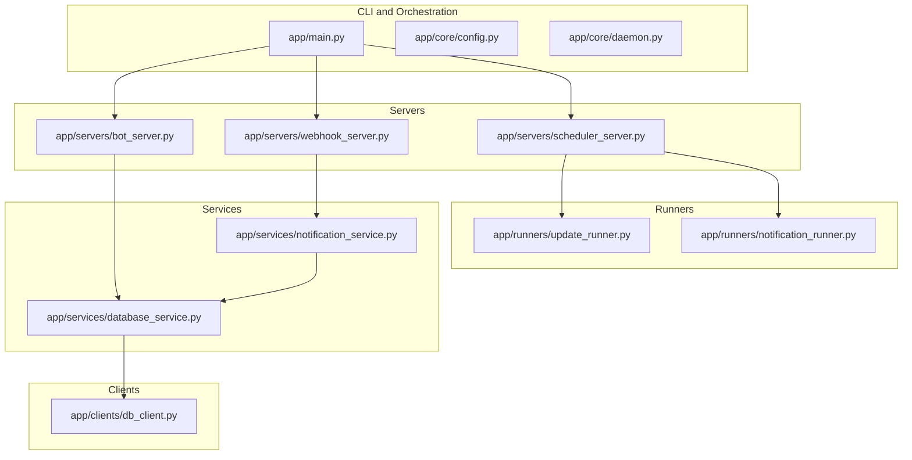
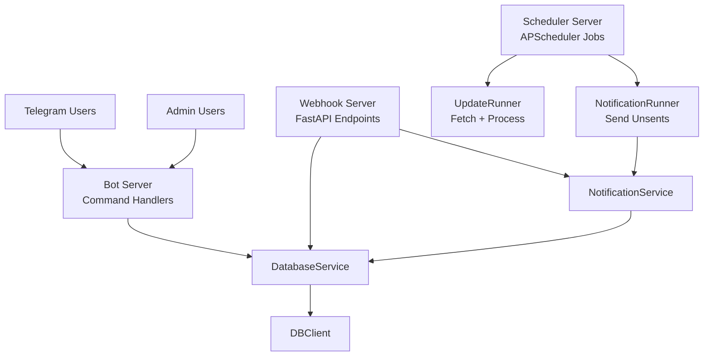
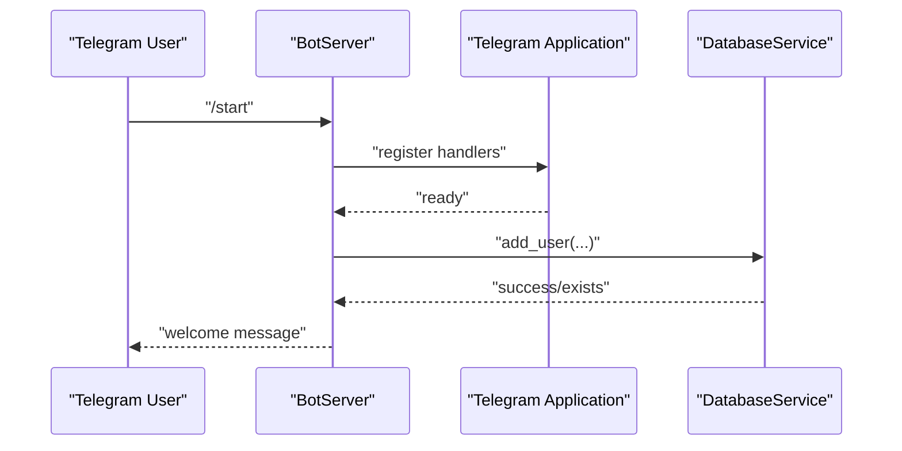
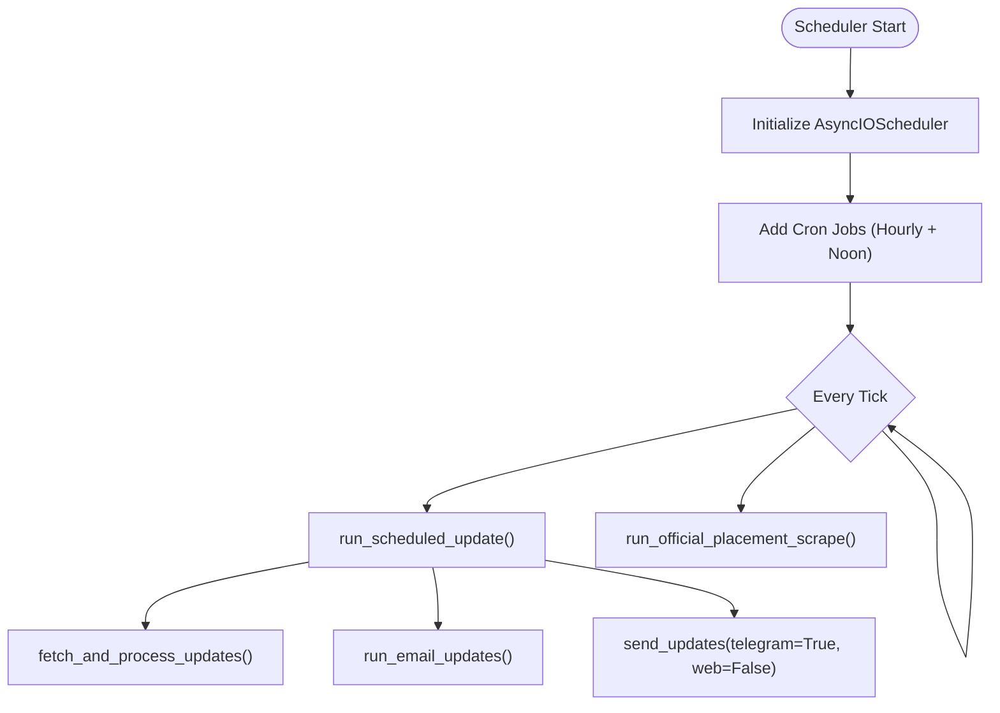
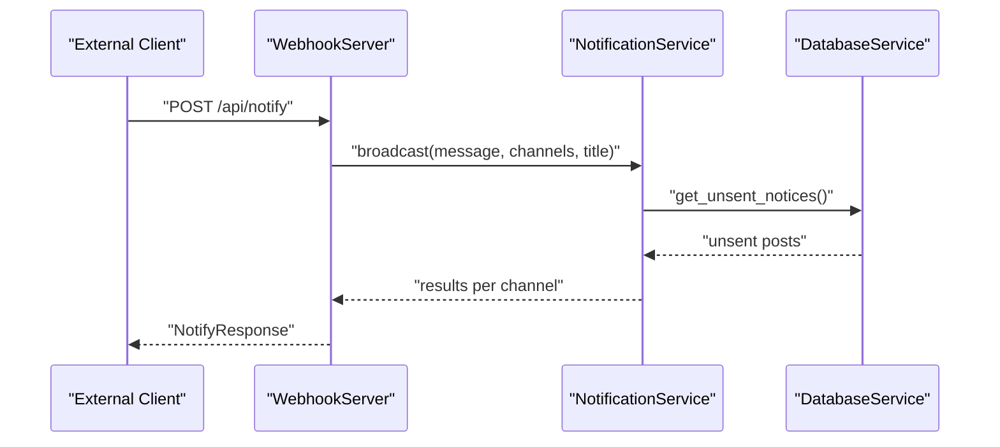
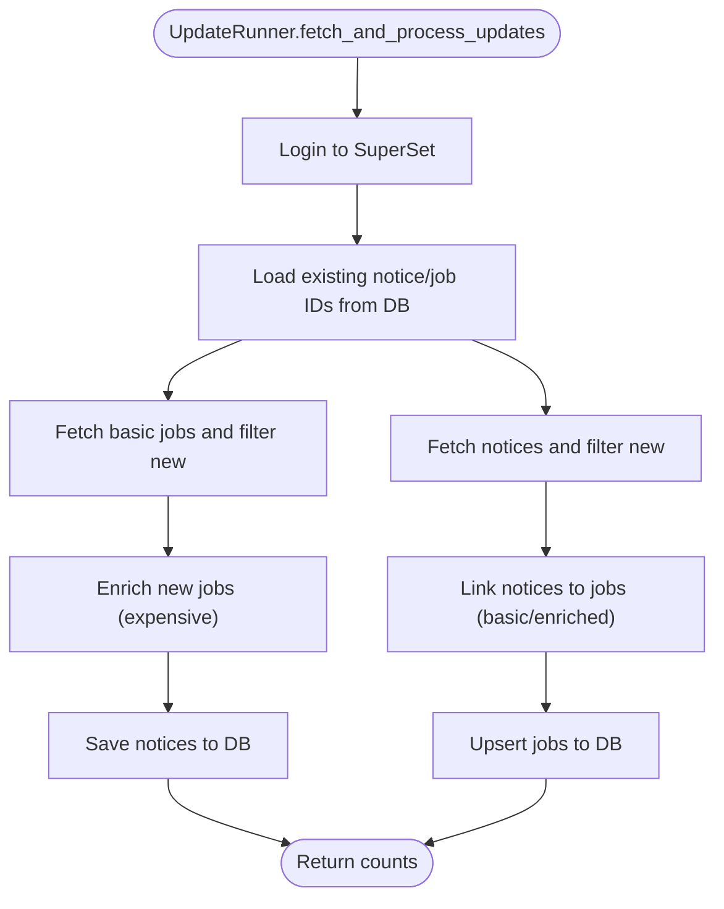
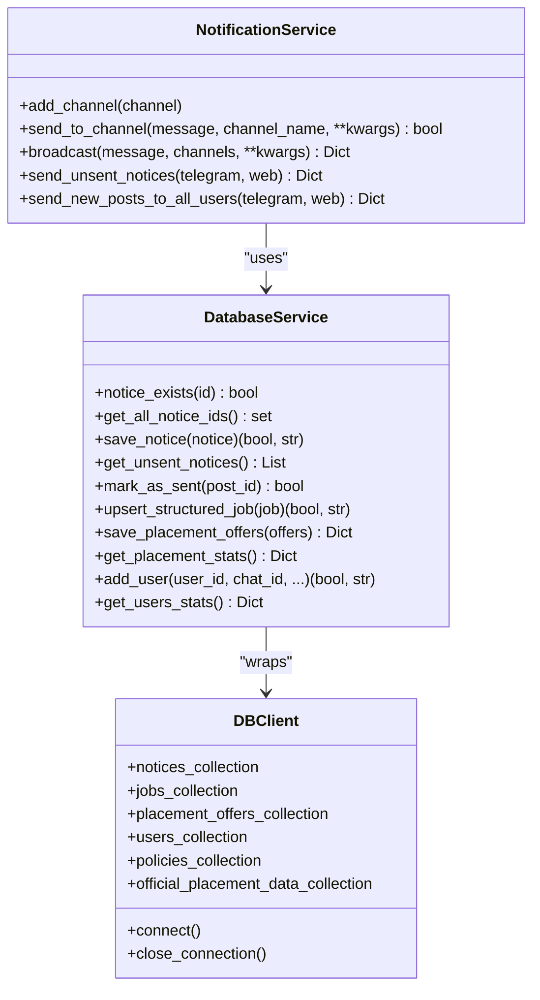
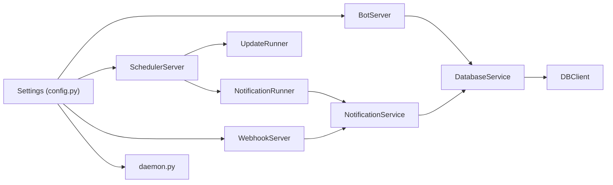

# Server Components

<cite>
**Referenced Files in This Document**
- [app/main.py](file://app/main.py)
- [app/core/config.py](file://app/core/config.py)
- [app/core/daemon.py](file://app/core/daemon.py)
- [app/servers/bot_server.py](file://app/servers/bot_server.py)
- [app/servers/scheduler_server.py](file://app/servers/scheduler_server.py)
- [app/servers/webhook_server.py](file://app/servers/webhook_server.py)
- [app/runners/update_runner.py](file://app/runners/update_runner.py)
- [app/runners/notification_runner.py](file://app/runners/notification_runner.py)
- [app/services/notification_service.py](file://app/services/notification_service.py)
- [app/services/database_service.py](file://app/services/database_service.py)
- [app/clients/db_client.py](file://app/clients/db_client.py)
- [app/docker-compose.dev.yaml](file://app/docker-compose.dev.yaml)
- [app/requirements.txt](file://app/requirements.txt)
- [app/pyproject.toml](file://app/pyproject.toml)
</cite>

## Table of Contents
1. [Introduction](#introduction)
2. [Project Structure](#project-structure)
3. [Core Components](#core-components)
4. [Architecture Overview](#architecture-overview)
5. [Detailed Component Analysis](#detailed-component-analysis)
6. [Dependency Analysis](#dependency-analysis)
7. [Performance Considerations](#performance-considerations)
8. [Security Considerations](#security-considerations)
9. [Deployment and Scaling](#deployment-and-scaling)
10. [Monitoring and Observability](#monitoring-and-observability)
11. [Troubleshooting Guide](#troubleshooting-guide)
12. [Conclusion](#conclusion)

## Introduction
This document explains the server components of the SuperSet Telegram Notification Bot. It covers:
- The Telegram bot server with command handlers and user interaction patterns
- The scheduler server using APScheduler for automated job execution
- The FastAPI webhook server for external integrations
- Runner orchestration services coordinating update workflows and notification distribution
- Startup sequences, configuration management, error handling, and monitoring approaches
- Deployment considerations, scaling strategies, and integration patterns with cloud platforms
- Security considerations, rate limiting, and performance optimization techniques

## Project Structure
The application is organized into modular servers, runners, services, and clients, with centralized configuration and daemon utilities. The main CLI coordinates server startup and operational modes.

**Diagram sources**
- [app/main.py](file://app/main.py#L370-L632)
- [app/core/config.py](file://app/core/config.py#L18-L254)
- [app/core/daemon.py](file://app/core/daemon.py#L114-L232)
- [app/servers/bot_server.py](file://app/servers/bot_server.py#L29-L519)
- [app/servers/scheduler_server.py](file://app/servers/scheduler_server.py#L33-L388)
- [app/servers/webhook_server.py](file://app/servers/webhook_server.py#L69-L387)
- [app/runners/update_runner.py](file://app/runners/update_runner.py#L21-L278)
- [app/runners/notification_runner.py](file://app/runners/notification_runner.py#L21-L160)
- [app/services/notification_service.py](file://app/services/notification_service.py#L13-L237)
- [app/services/database_service.py](file://app/services/database_service.py#L16-L795)
- [app/clients/db_client.py](file://app/clients/db_client.py#L16-L104)

**Section sources**
- [app/main.py](file://app/main.py#L370-L632)
- [app/core/config.py](file://app/core/config.py#L18-L254)
- [app/core/daemon.py](file://app/core/daemon.py#L114-L232)

## Core Components
- Telegram Bot Server: Provides user commands (/start, /help, /stop, /status, /stats, /noticestats, /userstats, /web) and admin commands via dependency-injected services. It runs in polling mode and supports graceful shutdown.
- Scheduler Server: Uses APScheduler to run periodic update jobs (SuperSet + Emails) and official placement scraping at fixed intervals.
- Webhook Server: FastAPI-based server exposing health, push subscription, notification dispatch, and statistics endpoints for external integrations.
- Runner Services: Encapsulate update fetching and notification sending logic for reuse across servers and CLI commands.
- Services and Clients: Notification routing, database operations, and MongoDB connectivity form the data and delivery backbone.

**Section sources**
- [app/servers/bot_server.py](file://app/servers/bot_server.py#L29-L519)
- [app/servers/scheduler_server.py](file://app/servers/scheduler_server.py#L33-L388)
- [app/servers/webhook_server.py](file://app/servers/webhook_server.py#L69-L387)
- [app/runners/update_runner.py](file://app/runners/update_runner.py#L21-L278)
- [app/runners/notification_runner.py](file://app/runners/notification_runner.py#L21-L160)
- [app/services/notification_service.py](file://app/services/notification_service.py#L13-L237)
- [app/services/database_service.py](file://app/services/database_service.py#L16-L795)
- [app/clients/db_client.py](file://app/clients/db_client.py#L16-L104)

## Architecture Overview
The system separates concerns across three servers and a runner layer:
- Bot Server: Interactive Telegram commands and user lifecycle
- Scheduler Server: Automated ingestion and notifications
- Webhook Server: External integrations and administrative APIs
- Runners: Shared orchestration for updates and notifications
- Services/Clients: Data persistence and channel delivery

**Diagram sources**
- [app/servers/bot_server.py](file://app/servers/bot_server.py#L366-L403)
- [app/servers/scheduler_server.py](file://app/servers/scheduler_server.py#L78-L117)
- [app/servers/webhook_server.py](file://app/servers/webhook_server.py#L244-L301)
- [app/runners/update_runner.py](file://app/runners/update_runner.py#L56-L148)
- [app/runners/notification_runner.py](file://app/runners/notification_runner.py#L60-L115)
- [app/services/notification_service.py](file://app/services/notification_service.py#L93-L167)
- [app/services/database_service.py](file://app/services/database_service.py#L116-L147)
- [app/clients/db_client.py](file://app/clients/db_client.py#L42-L80)

## Detailed Component Analysis

### Telegram Bot Server
- Responsibilities:
  - Initialize Telegram Application with DI-enabled services
  - Register command handlers for user/admin commands
  - Manage lifecycle: initialize, start polling, keep alive, graceful shutdown
- Command Handlers:
  - /start: user registration and activation
  - /help: command reference
  - /stop: deactivation
  - /status: subscription status
  - /stats: placement statistics
  - /noticestats: notice delivery stats
  - /userstats: admin-only user stats
  - /web: suite links
  - Admin commands wired via injected AdminTelegramService
- Lifecycle:
  - run_async builds Application, sets up handlers, starts polling
  - run blocks until interrupted, then shutdown gracefully

**Diagram sources**
- [app/servers/bot_server.py](file://app/servers/bot_server.py#L87-L163)
- [app/servers/bot_server.py](file://app/servers/bot_server.py#L366-L403)
- [app/servers/bot_server.py](file://app/servers/bot_server.py#L405-L452)

**Section sources**
- [app/servers/bot_server.py](file://app/servers/bot_server.py#L29-L519)

### Scheduler Server (APScheduler)
- Responsibilities:
  - Schedule periodic update jobs (SuperSet + Emails) every hour from 8 AM to 11 PM IST
  - Daily official placement scrape at noon IST
  - Orchestrate runners for update and notification sending
- Job Execution:
  - run_scheduled_update mirrors legacy behavior: fetch SuperSet updates, fetch email updates, send via Telegram
  - run_official_placement_scrape scrapes official data and persists to DB
- Scheduler Setup:
  - AsyncIOScheduler with Asia/Kolkata timezone
  - Cron-based jobs at hourly intervals plus daily official scrape

**Diagram sources**
- [app/servers/scheduler_server.py](file://app/servers/scheduler_server.py#L274-L321)
- [app/servers/scheduler_server.py](file://app/servers/scheduler_server.py#L78-L117)
- [app/servers/scheduler_server.py](file://app/servers/scheduler_server.py#L239-L273)

**Section sources**
- [app/servers/scheduler_server.py](file://app/servers/scheduler_server.py#L33-L388)

### Webhook Server (FastAPI)
- Responsibilities:
  - Health endpoints
  - Web push subscription management
  - Notification dispatch to Telegram and/or Web Push
  - Statistics endpoints for placements, notices, users
  - External webhook to trigger unsent notice delivery
- Dependencies:
  - DI via lifespan to construct DatabaseService, WebPushService, and NotificationService
  - CORS enabled for external integrations
- Endpoints:
  - GET /, GET /health
  - POST /api/push/subscribe, POST /api/push/unsubscribe, GET /api/push/vapid-key
  - POST /api/notify, POST /api/notify/telegram, POST /api/notify/web-push
  - GET /api/stats, /api/stats/placements, /api/stats/notices, /api/stats/users
  - POST /webhook/update

**Diagram sources**
- [app/servers/webhook_server.py](file://app/servers/webhook_server.py#L244-L264)
- [app/servers/webhook_server.py](file://app/servers/webhook_server.py#L306-L341)
- [app/services/notification_service.py](file://app/services/notification_service.py#L61-L91)
- [app/services/database_service.py](file://app/services/database_service.py#L116-L147)

**Section sources**
- [app/servers/webhook_server.py](file://app/servers/webhook_server.py#L69-L387)

### Runner Orchestration Services
- UpdateRunner:
  - Logs in to SuperSet, pre-fetches existing IDs, filters new notices/jobs, enriches only new jobs, processes notices with job enrichment callback, saves to DB
  - Optimizes API calls by enriching only new jobs and leveraging existing job structures for linking
- NotificationRunner:
  - Enables sending unsent notices via Telegram and/or Web Push
  - Creates channels on demand and delegates to NotificationService
  - Supports context manager for resource cleanup

**Diagram sources**
- [app/runners/update_runner.py](file://app/runners/update_runner.py#L56-L148)
- [app/runners/update_runner.py](file://app/runners/update_runner.py#L150-L237)

**Section sources**
- [app/runners/update_runner.py](file://app/runners/update_runner.py#L21-L278)
- [app/runners/notification_runner.py](file://app/runners/notification_runner.py#L21-L160)

### Notification Service and Database Service
- NotificationService:
  - Aggregates channels (Telegram, Web Push), broadcasts to all users, and tracks sent status
  - Sends unsent notices and marks them sent upon successful delivery
- DatabaseService:
  - Manages notices, jobs, placement offers, users, policies, and official placement data
  - Provides statistics and helpers for unsent notices and user management
  - Implements deduplication and merging for placement offers

**Diagram sources**
- [app/services/notification_service.py](file://app/services/notification_service.py#L13-L237)
- [app/services/database_service.py](file://app/services/database_service.py#L16-L795)
- [app/clients/db_client.py](file://app/clients/db_client.py#L16-L104)

**Section sources**
- [app/services/notification_service.py](file://app/services/notification_service.py#L13-L237)
- [app/services/database_service.py](file://app/services/database_service.py#L16-L795)
- [app/clients/db_client.py](file://app/clients/db_client.py#L16-L104)

## Dependency Analysis
- Configuration:
  - Centralized Settings with environment variable loading and logging setup
  - Daemon mode toggles stdout vs file logging
- Daemon Utilities:
  - Double-fork daemonization, PID file management, stop/status helpers
- Server-to-Service Coupling:
  - Servers depend on DI-created services; runners encapsulate orchestration
- External Dependencies:
  - Python packages pinned in requirements.txt and pyproject.toml

**Diagram sources**
- [app/core/config.py](file://app/core/config.py#L18-L254)
- [app/core/daemon.py](file://app/core/daemon.py#L114-L232)
- [app/servers/bot_server.py](file://app/servers/bot_server.py#L455-L507)
- [app/servers/scheduler_server.py](file://app/servers/scheduler_server.py#L365-L376)
- [app/servers/webhook_server.py](file://app/servers/webhook_server.py#L69-L138)
- [app/runners/notification_runner.py](file://app/runners/notification_runner.py#L21-L59)
- [app/services/notification_service.py](file://app/services/notification_service.py#L13-L41)
- [app/services/database_service.py](file://app/services/database_service.py#L16-L46)
- [app/clients/db_client.py](file://app/clients/db_client.py#L16-L41)

**Section sources**
- [app/core/config.py](file://app/core/config.py#L18-L254)
- [app/core/daemon.py](file://app/core/daemon.py#L114-L232)
- [app/requirements.txt](file://app/requirements.txt#L1-L81)
- [app/pyproject.toml](file://app/pyproject.toml#L1-L27)

## Performance Considerations
- UpdateRunner optimization:
  - Pre-fetch existing IDs to avoid redundant API calls
  - Enrich only new jobs with detailed info to minimize cost
  - Use job lookups to avoid repeated enrich calls
- Notification batching:
  - Broadcast to all users per channel and mark sent atomically
- Logging:
  - Reduce noise from third-party libraries and route to file in daemon mode
- Scheduler cadence:
  - Hourly updates balance freshness and cost; adjust cron schedule as needed

[No sources needed since this section provides general guidance]

## Security Considerations
- Environment variables:
  - Store tokens and secrets in .env; Settings validates and loads them
- Webhook server:
  - CORS enabled broadly for development; restrict origins in production
  - No built-in authentication on endpoints; consider API keys or signed requests for external integrations
- Rate limiting:
  - No explicit rate limiting in code; consider adding throttling at the FastAPI layer or upstream proxy
- Transport security:
  - Use HTTPS in production; configure reverse proxies accordingly
- Daemon logging:
  - Ensure logs do not expose sensitive data; sanitize outputs

**Section sources**
- [app/core/config.py](file://app/core/config.py#L188-L254)
- [app/servers/webhook_server.py](file://app/servers/webhook_server.py#L146-L153)

## Deployment and Scaling
- Local development:
  - docker-compose.dev.yaml provisions MongoDB locally with exposed port and volume storage
- Containerization:
  - Pin Python version and dependencies via pyproject.toml and requirements.txt
- Process management:
  - Use daemon mode (-d) for long-running servers; manage via PID files and stop/status commands
- Scaling strategies:
  - Horizontal scaling: run multiple instances behind a load balancer; ensure shared MongoDB
  - Vertical scaling: increase CPU/RAM for CPU-bound tasks (enrichment, notifications)
  - Queue-based offloading: introduce message queues for high-volume notifications
- Cloud platforms:
  - Kubernetes: deploy stateless webhook and scheduler pods; persistent MongoDB via StatefulSet or managed service
  - Platform-as-a-Service: run as separate processes (bot, scheduler, webhook) with environment variables

**Section sources**
- [app/docker-compose.dev.yaml](file://app/docker-compose.dev.yaml#L1-L15)
- [app/requirements.txt](file://app/requirements.txt#L1-L81)
- [app/pyproject.toml](file://app/pyproject.toml#L1-L27)
- [app/core/daemon.py](file://app/core/daemon.py#L114-L232)

## Monitoring and Observability
- Logging:
  - Centralized setup via setup_logging; file handler plus optional stream handler
  - Daemon mode suppresses stdout; logs written to files
- Metrics:
  - No built-in metrics endpoints; consider adding Prometheus metrics for job durations and error rates
- Health checks:
  - Webhook server exposes / and /health endpoints
- Alerting:
  - Integrate with external monitoring systems to track server uptime and error rates

**Section sources**
- [app/core/config.py](file://app/core/config.py#L188-L254)
- [app/servers/webhook_server.py](file://app/servers/webhook_server.py#L172-L180)

## Troubleshooting Guide
- Telegram bot not starting:
  - Verify TELEGRAM_BOT_TOKEN is set; ensure network connectivity to Telegram
  - Check logs for initialization errors
- Scheduler not running jobs:
  - Confirm daemon mode and logging; verify cron schedule and timezone
  - Inspect scheduler logs for exceptions during job execution
- Webhook server errors:
  - Validate MONGO_CONNECTION_STR and database availability
  - Check CORS configuration and endpoint permissions
- Database connectivity:
  - Confirm MongoDB is reachable and credentials are correct
  - Review DBClient connection logs
- Daemon control:
  - Use stop/status commands to inspect PID and process state

**Section sources**
- [app/servers/bot_server.py](file://app/servers/bot_server.py#L405-L452)
- [app/servers/scheduler_server.py](file://app/servers/scheduler_server.py#L326-L356)
- [app/servers/webhook_server.py](file://app/servers/webhook_server.py#L369-L386)
- [app/clients/db_client.py](file://app/clients/db_client.py#L42-L80)
- [app/core/daemon.py](file://app/core/daemon.py#L75-L112)

## Conclusion
The SuperSet Telegram Notification Bot is composed of three distinct servers (Telegram, Scheduler, Webhook) orchestrated by runner services and supported by robust configuration, daemon utilities, and database services. The design emphasizes modularity, dependency injection, and separation of concerns, enabling flexible deployment, scaling, and maintenance. By applying the recommendations in this document—especially around security hardening, rate limiting, and observability—you can operate the system reliably in production environments.