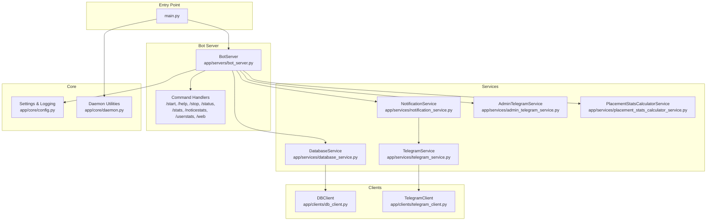
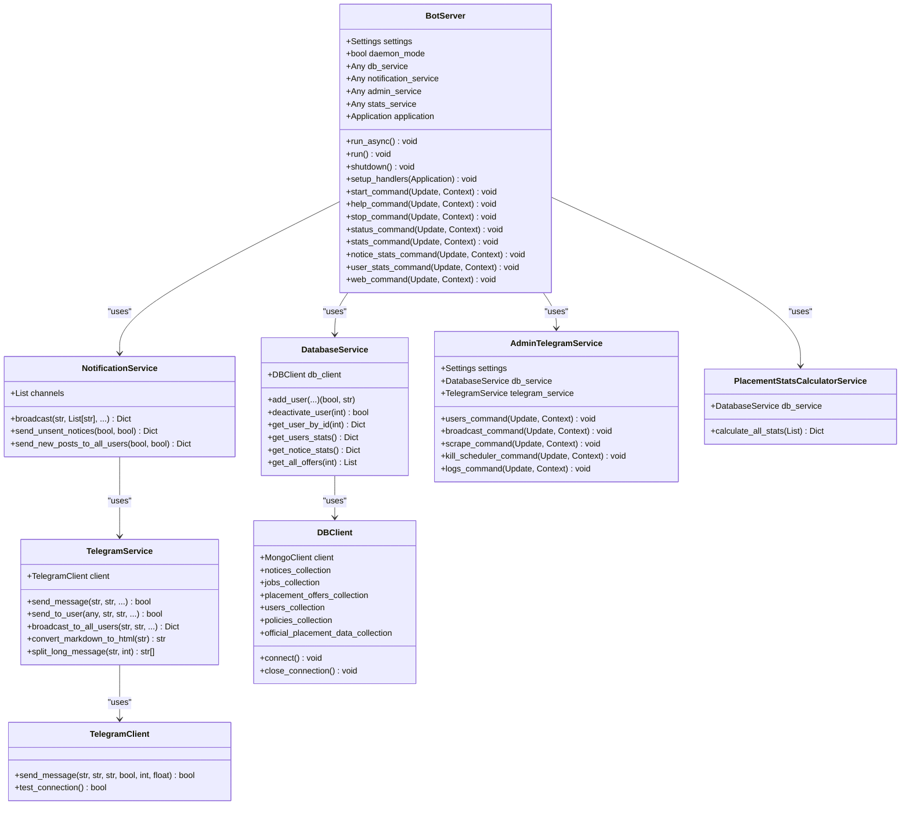
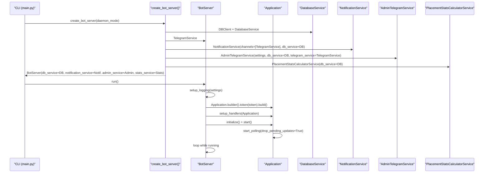
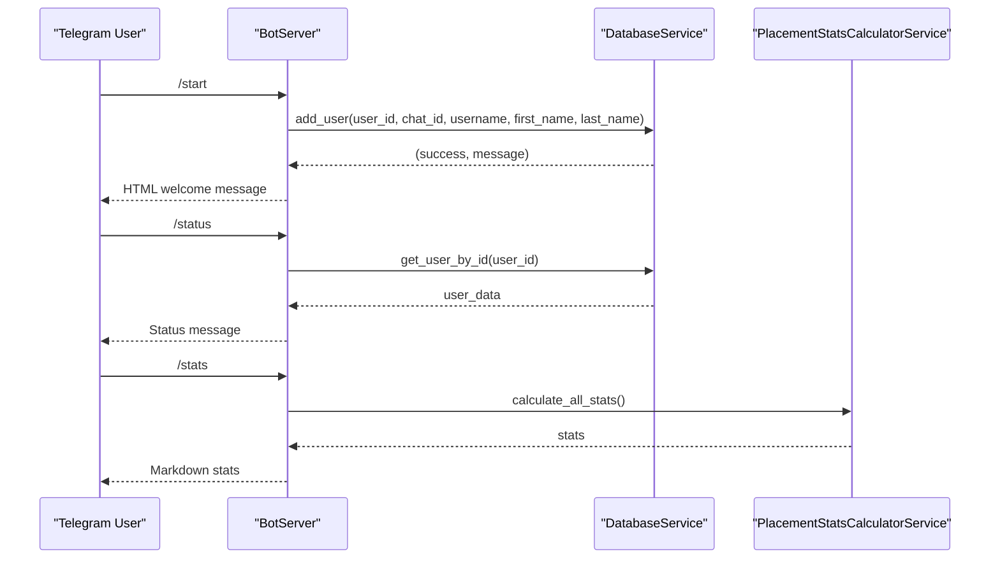
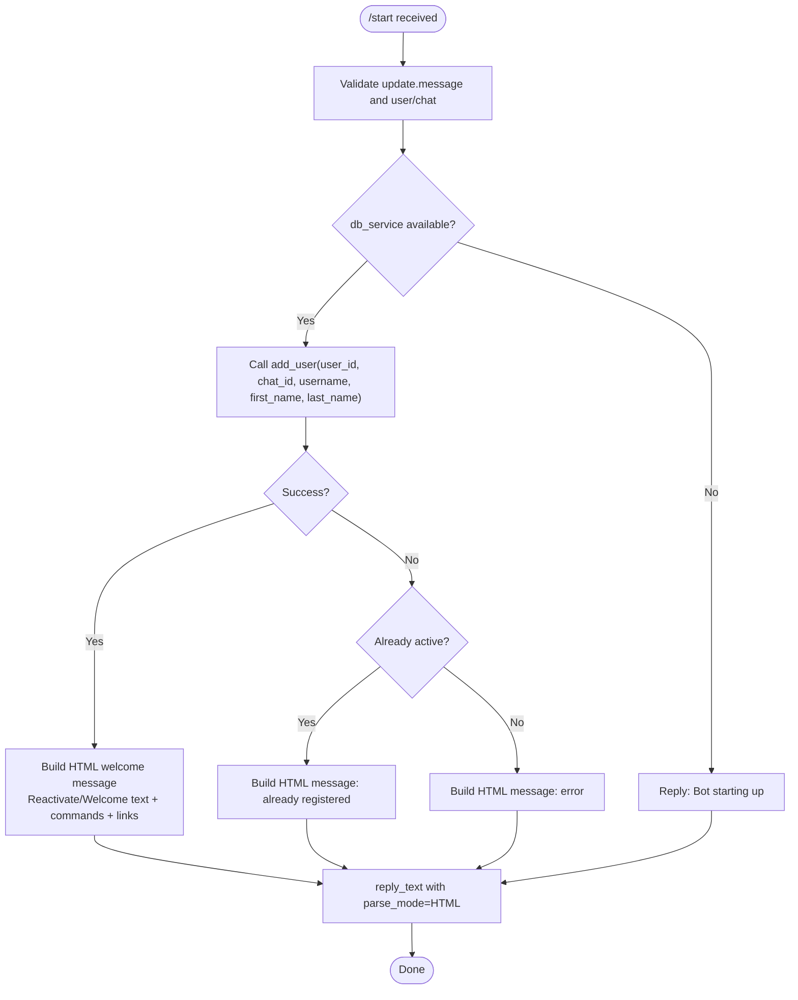
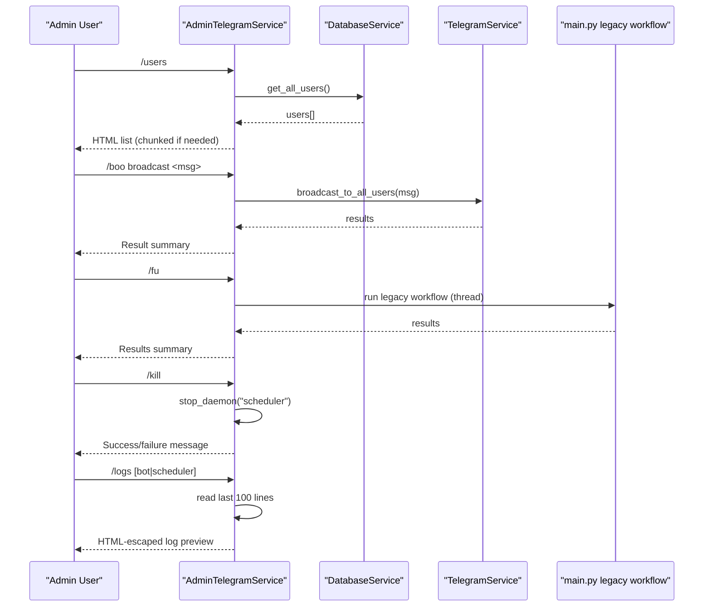
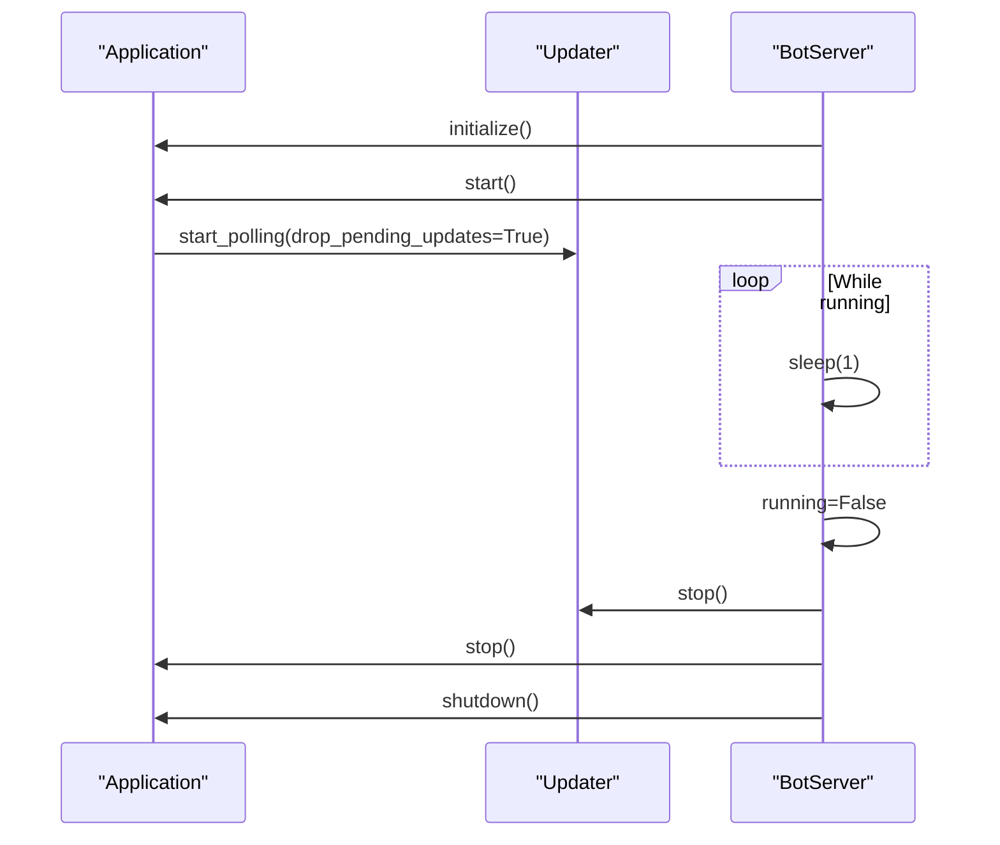
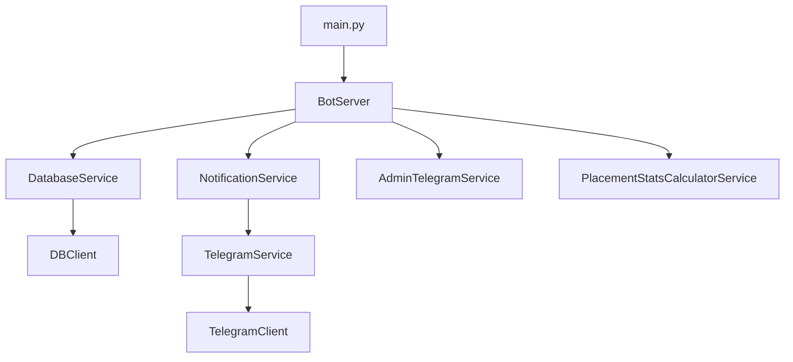

# Telegram Bot Server

<cite>
**Referenced Files in This Document**
- [bot_server.py](file://app/servers/bot_server.py)
- [main.py](file://app/main.py)
- [config.py](file://app/core/config.py)
- [daemon.py](file://app/core/daemon.py)
- [database_service.py](file://app/services/database_service.py)
- [notification_service.py](file://app/services/notification_service.py)
- [admin_telegram_service.py](file://app/services/admin_telegram_service.py)
- [telegram_service.py](file://app/services/telegram_service.py)
- [placement_stats_calculator_service.py](file://app/services/placement_stats_calculator_service.py)
- [db_client.py](file://app/clients/db_client.py)
- [telegram_client.py](file://app/clients/telegram_client.py)
- [README.md](file://README.md)
</cite>

## Table of Contents
1. [Introduction](#introduction)
2. [Project Structure](#project-structure)
3. [Core Components](#core-components)
4. [Architecture Overview](#architecture-overview)
5. [Detailed Component Analysis](#detailed-component-analysis)
6. [Dependency Analysis](#dependency-analysis)
7. [Performance Considerations](#performance-considerations)
8. [Troubleshooting Guide](#troubleshooting-guide)
9. [Conclusion](#conclusion)
10. [Appendices](#appendices)

## Introduction
This document provides comprehensive documentation for the Telegram Bot Server implementation. It explains the BotServer class architecture with dependency injection, the command handler system for /start, /help, /stop, /status, /stats, /noticestats, /userstats, and /web commands, user registration and management workflows, subscription handling, and admin command processing. It also documents the asynchronous bot lifecycle including initialization, polling mode operation, and graceful shutdown procedures. Additionally, it covers command handler implementations, user interaction patterns, message formatting with HTML and Markdown, integration with DatabaseService and NotificationService, error handling, logging mechanisms, daemon mode configuration, and security considerations for bot token management.

## Project Structure
The Telegram Bot Server resides in the servers package and integrates with services and clients for database, notifications, and Telegram API communication. The main entry point orchestrates server startup and daemon mode.

**Diagram sources**
- [bot_server.py](file://app/servers/bot_server.py#L29-L82)
- [main.py](file://app/main.py#L37-L58)
- [config.py](file://app/core/config.py#L18-L128)
- [daemon.py](file://app/core/daemon.py#L114-L232)
- [database_service.py](file://app/services/database_service.py#L16-L46)
- [notification_service.py](file://app/services/notification_service.py#L13-L41)
- [telegram_service.py](file://app/services/telegram_service.py#L20-L51)
- [admin_telegram_service.py](file://app/services/admin_telegram_service.py#L19-L42)
- [placement_stats_calculator_service.py](file://app/services/placement_stats_calculator_service.py#L354-L390)
- [db_client.py](file://app/clients/db_client.py#L16-L41)
- [telegram_client.py](file://app/clients/telegram_client.py#L19-L38)

**Section sources**
- [bot_server.py](file://app/servers/bot_server.py#L1-L519)
- [main.py](file://app/main.py#L1-L632)
- [config.py](file://app/core/config.py#L1-L254)
- [daemon.py](file://app/core/daemon.py#L1-L251)
- [database_service.py](file://app/services/database_service.py#L1-L795)
- [notification_service.py](file://app/services/notification_service.py#L1-L237)
- [telegram_service.py](file://app/services/telegram_service.py#L1-L351)
- [admin_telegram_service.py](file://app/services/admin_telegram_service.py#L1-L349)
- [placement_stats_calculator_service.py](file://app/services/placement_stats_calculator_service.py#L1-L1034)
- [db_client.py](file://app/clients/db_client.py#L1-L104)
- [telegram_client.py](file://app/clients/telegram_client.py#L1-L126)

## Core Components
- BotServer: Implements the Telegram bot server with DI support, command handlers, lifecycle management, and admin command integration.
- DatabaseService: Provides MongoDB operations for notices, jobs, placement offers, users, policies, and official placement data.
- NotificationService: Aggregates multiple notification channels and orchestrates sending unsent notices.
- TelegramService: Wraps Telegram Bot API interactions, message formatting, and broadcasting to users.
- AdminTelegramService: Handles administrative commands with authentication and operational controls.
- PlacementStatsCalculatorService: Computes comprehensive placement statistics from placement offers.
- DBClient: Manages MongoDB connection and exposes collections.
- TelegramClient: Low-level Telegram API client with retry logic and rate-limit handling.
- Settings and Logging: Centralized configuration and logging setup with daemon mode support.

**Section sources**
- [bot_server.py](file://app/servers/bot_server.py#L29-L82)
- [database_service.py](file://app/services/database_service.py#L16-L46)
- [notification_service.py](file://app/services/notification_service.py#L13-L41)
- [telegram_service.py](file://app/services/telegram_service.py#L20-L51)
- [admin_telegram_service.py](file://app/services/admin_telegram_service.py#L19-L42)
- [placement_stats_calculator_service.py](file://app/services/placement_stats_calculator_service.py#L354-L390)
- [db_client.py](file://app/clients/db_client.py#L16-L41)
- [telegram_client.py](file://app/clients/telegram_client.py#L19-L38)
- [config.py](file://app/core/config.py#L18-L128)

## Architecture Overview
The Telegram Bot Server follows a service-oriented architecture with dependency injection. The BotServer initializes services, registers command handlers, and manages the asynchronous lifecycle. Services encapsulate domain logic and integrate with clients for external APIs and databases.

**Diagram sources**
- [bot_server.py](file://app/servers/bot_server.py#L29-L82)
- [database_service.py](file://app/services/database_service.py#L16-L46)
- [notification_service.py](file://app/services/notification_service.py#L13-L41)
- [telegram_service.py](file://app/services/telegram_service.py#L20-L51)
- [admin_telegram_service.py](file://app/services/admin_telegram_service.py#L19-L42)
- [placement_stats_calculator_service.py](file://app/services/placement_stats_calculator_service.py#L354-L390)
- [db_client.py](file://app/clients/db_client.py#L16-L41)
- [telegram_client.py](file://app/clients/telegram_client.py#L19-L38)

## Detailed Component Analysis

### BotServer: Dependency Injection and Lifecycle
- Dependency Injection: BotServer accepts Settings, DatabaseService, NotificationService, AdminTelegramService, and PlacementStatsCalculatorService instances. It also supports daemon mode configuration.
- Command Handlers Registration: setup_handlers registers handlers for /start, /help, /stop, /status, /stats, /noticestats, /userstats, and /web. Admin commands are conditionally registered if AdminTelegramService is provided.
- Asynchronous Lifecycle:
  - run_async builds the Application, sets up logging, initializes and starts the application, and keeps the loop running while self.running is True.
  - run blocks and catches KeyboardInterrupt to trigger graceful shutdown.
  - shutdown stops the updater, application, and performs cleanup.
- Factory Function: create_bot_server constructs DBClient, DatabaseService, TelegramService, NotificationService, AdminTelegramService, and PlacementStatsCalculatorService, then returns a BotServer instance.

**Diagram sources**
- [bot_server.py](file://app/servers/bot_server.py#L405-L453)
- [bot_server.py](file://app/servers/bot_server.py#L455-L507)
- [main.py](file://app/main.py#L37-L58)
- [config.py](file://app/core/config.py#L188-L253)

**Section sources**
- [bot_server.py](file://app/servers/bot_server.py#L29-L82)
- [bot_server.py](file://app/servers/bot_server.py#L366-L403)
- [bot_server.py](file://app/servers/bot_server.py#L405-L453)
- [bot_server.py](file://app/servers/bot_server.py#L455-L507)
- [main.py](file://app/main.py#L37-L58)

### Command Handler System
- /start: Registers or reactivates a user via DatabaseService and responds with HTML-formatted welcome message including commands and helpful links.
- /help: Responds with Markdown-formatted help text listing available commands.
- /stop: Deactivates a user via DatabaseService and informs the user.
- /status: Retrieves user data from DatabaseService and formats a status message indicating subscription state.
- /stats: Calculates placement statistics via PlacementStatsCalculatorService and replies with Markdown-formatted statistics.
- /noticestats: Retrieves notice statistics from DatabaseService and replies with Markdown-formatted stats.
- /userstats: Retrieves user statistics from DatabaseService and replies with Markdown-formatted stats (admin-only via AdminTelegramService).
- /web: Replies with HTML-formatted links to JIIT suite tools.

**Diagram sources**
- [bot_server.py](file://app/servers/bot_server.py#L87-L163)
- [bot_server.py](file://app/servers/bot_server.py#L212-L244)
- [bot_server.py](file://app/servers/bot_server.py#L246-L298)
- [bot_server.py](file://app/servers/bot_server.py#L300-L321)
- [bot_server.py](file://app/servers/bot_server.py#L323-L344)
- [bot_server.py](file://app/servers/bot_server.py#L346-L360)
- [database_service.py](file://app/services/database_service.py#L616-L668)
- [placement_stats_calculator_service.py](file://app/services/placement_stats_calculator_service.py#L708-L740)

**Section sources**
- [bot_server.py](file://app/servers/bot_server.py#L87-L163)
- [bot_server.py](file://app/servers/bot_server.py#L165-L189)
- [bot_server.py](file://app/servers/bot_server.py#L191-L210)
- [bot_server.py](file://app/servers/bot_server.py#L212-L244)
- [bot_server.py](file://app/servers/bot_server.py#L246-L298)
- [bot_server.py](file://app/servers/bot_server.py#L300-L321)
- [bot_server.py](file://app/servers/bot_server.py#L323-L344)
- [bot_server.py](file://app/servers/bot_server.py#L346-L360)

### User Registration and Management Workflows
- Registration: On /start, BotServer calls DatabaseService.add_user with user identity and chat metadata. Responses vary depending on whether the user is newly registered, reactivated, or already active.
- Subscription Management: /stop triggers DatabaseService.deactivate_user to mark the user as inactive. /status retrieves user data and indicates active/inactive state.
- User Statistics: AdminTelegramService provides /userstats to display total and active user counts via DatabaseService.get_users_stats.

**Diagram sources**
- [bot_server.py](file://app/servers/bot_server.py#L87-L163)
- [database_service.py](file://app/services/database_service.py#L616-L668)

**Section sources**
- [bot_server.py](file://app/servers/bot_server.py#L87-L163)
- [database_service.py](file://app/services/database_service.py#L616-L668)

### Subscription Handling
- Deactivation: /stop calls DatabaseService.deactivate_user and informs the user accordingly.
- Status Checking: /status fetches user data and formats a readable status message, including registration date and user ID when available.

**Section sources**
- [bot_server.py](file://app/servers/bot_server.py#L191-L210)
- [bot_server.py](file://app/servers/bot_server.py#L212-L244)
- [database_service.py](file://app/services/database_service.py#L670-L682)
- [database_service.py](file://app/services/database_service.py#L704-L712)

### Admin Command Processing
- Authentication: AdminTelegramService verifies that the chat ID matches the configured admin chat ID.
- /users: Lists all users with status and identifiers.
- /boo: Broadcasts messages either to all users or a specific user.
- /fu or /scrapyyy: Triggers a legacy update workflow executed in a thread to avoid blocking the event loop.
- /kill: Stops the scheduler daemon.
- /logs: Reads and returns the last lines of the specified log file, HTML-escaped and truncated to fit Telegram limits.

**Diagram sources**
- [admin_telegram_service.py](file://app/services/admin_telegram_service.py#L57-L108)
- [admin_telegram_service.py](file://app/services/admin_telegram_service.py#L109-L192)
- [admin_telegram_service.py](file://app/services/admin_telegram_service.py#L193-L248)
- [admin_telegram_service.py](file://app/services/admin_telegram_service.py#L249-L276)
- [admin_telegram_service.py](file://app/services/admin_telegram_service.py#L277-L348)
- [database_service.py](file://app/services/database_service.py#L694-L702)
- [telegram_service.py](file://app/services/telegram_service.py#L140-L172)
- [daemon.py](file://app/core/daemon.py#L75-L111)
- [daemon.py](file://app/core/daemon.py#L235-L250)

**Section sources**
- [admin_telegram_service.py](file://app/services/admin_telegram_service.py#L19-L42)
- [admin_telegram_service.py](file://app/services/admin_telegram_service.py#L57-L108)
- [admin_telegram_service.py](file://app/services/admin_telegram_service.py#L109-L192)
- [admin_telegram_service.py](file://app/services/admin_telegram_service.py#L193-L248)
- [admin_telegram_service.py](file://app/services/admin_telegram_service.py#L249-L276)
- [admin_telegram_service.py](file://app/services/admin_telegram_service.py#L277-L348)

### Asynchronous Bot Lifecycle
- Initialization: create_bot_server constructs dependencies and returns a BotServer instance.
- Polling Mode: run_async initializes and starts the Application, then starts polling with drop_pending_updates to avoid replaying old updates.
- Graceful Shutdown: run catches KeyboardInterrupt and calls shutdown to stop the updater and application cleanly.

**Diagram sources**
- [bot_server.py](file://app/servers/bot_server.py#L405-L453)

**Section sources**
- [bot_server.py](file://app/servers/bot_server.py#L405-L453)

### Message Formatting with HTML and Markdown
- HTML: Used for /start welcome message, /web links, and status messages. TelegramService.convert_markdown_to_html transforms Markdown to HTML for Telegram.
- Markdown: Used for /help and statistics commands. TelegramService.convert_markdown_to_telegram adapts Markdown for Telegram’s MarkdownV2.
- Long Messages: TelegramService.split_long_message splits messages exceeding 4000 characters and sends them sequentially with delays.

**Section sources**
- [bot_server.py](file://app/servers/bot_server.py#L108-L162)
- [bot_server.py](file://app/servers/bot_server.py#L172-L189)
- [bot_server.py](file://app/servers/bot_server.py#L281-L298)
- [bot_server.py](file://app/servers/bot_server.py#L313-L321)
- [bot_server.py](file://app/servers/bot_server.py#L336-L344)
- [bot_server.py](file://app/servers/bot_server.py#L353-L360)
- [telegram_service.py](file://app/services/telegram_service.py#L303-L345)
- [telegram_service.py](file://app/services/telegram_service.py#L218-L253)

### Integration with DatabaseService and NotificationService
- DatabaseService: Provides user management, notice operations, job operations, placement offers, and statistics retrieval. Used by BotServer for user registration/status and by AdminTelegramService for user listing and stats.
- NotificationService: Orchestrates sending unsent notices to Telegram and Web Push channels. It fetches unsent notices from DatabaseService and broadcasts via TelegramService.

**Section sources**
- [database_service.py](file://app/services/database_service.py#L16-L46)
- [database_service.py](file://app/services/database_service.py#L161-L200)
- [database_service.py](file://app/services/database_service.py#L714-L728)
- [notification_service.py](file://app/services/notification_service.py#L93-L167)
- [notification_service.py](file://app/services/notification_service.py#L169-L236)

### Security Considerations for Bot Token Management
- Token Storage: BotServer reads TELEGRAM_BOT_TOKEN from Settings. TelegramClient validates presence of bot token before sending messages.
- Admin Authentication: AdminTelegramService compares the incoming chat ID with the configured admin chat ID to restrict sensitive commands.
- Daemon Mode: safe_print suppresses stdout in daemon mode and logs to files instead.

**Section sources**
- [bot_server.py](file://app/servers/bot_server.py#L69-L70)
- [telegram_client.py](file://app/clients/telegram_client.py#L36-L37)
- [admin_telegram_service.py](file://app/services/admin_telegram_service.py#L43-L55)
- [config.py](file://app/core/config.py#L145-L154)

## Dependency Analysis
The BotServer depends on DatabaseService, NotificationService, AdminTelegramService, and PlacementStatsCalculatorService. DatabaseService depends on DBClient. NotificationService depends on TelegramService. TelegramService depends on TelegramClient. The main entry point creates the BotServer and runs it, optionally in daemon mode.

**Diagram sources**
- [bot_server.py](file://app/servers/bot_server.py#L455-L507)
- [database_service.py](file://app/services/database_service.py#L28-L46)
- [notification_service.py](file://app/services/notification_service.py#L21-L41)
- [telegram_service.py](file://app/services/telegram_service.py#L31-L51)
- [db_client.py](file://app/clients/db_client.py#L21-L41)
- [telegram_client.py](file://app/clients/telegram_client.py#L24-L38)
- [main.py](file://app/main.py#L37-L58)

**Section sources**
- [bot_server.py](file://app/servers/bot_server.py#L455-L507)
- [main.py](file://app/main.py#L37-L58)

## Performance Considerations
- Rate Limiting: TelegramService applies small delays between broadcasts to Telegram users to avoid rate limits.
- Message Chunking: TelegramService.split_long_message ensures messages are within Telegram’s character limits.
- Asynchronous Polling: BotServer uses asynchronous polling to keep the event loop responsive.
- Daemon Mode: Reduces console output overhead in production environments.

[No sources needed since this section provides general guidance]

## Troubleshooting Guide
- Bot not starting: Ensure TELEGRAM_BOT_TOKEN is configured; create_bot_server raises if token is missing.
- Database connectivity: Verify MONGO_CONNECTION_STR; DBClient.connect tests the connection and logs errors.
- Admin commands failing: Confirm admin chat ID matches the configured TELEGRAM_CHAT_ID; AdminTelegramService enforces authentication.
- Logs: Use /logs admin command to retrieve recent log entries; logs are written to files configured by Settings.

**Section sources**
- [bot_server.py](file://app/servers/bot_server.py#L407-L408)
- [db_client.py](file://app/clients/db_client.py#L42-L72)
- [admin_telegram_service.py](file://app/services/admin_telegram_service.py#L43-L55)
- [admin_telegram_service.py](file://app/services/admin_telegram_service.py#L277-L348)
- [config.py](file://app/core/config.py#L188-L253)

## Conclusion
The Telegram Bot Server implements a robust, dependency-injected architecture with clear separation of concerns. It supports essential user commands, admin operations, and integrates with database and notification services. The asynchronous lifecycle, message formatting, and daemon mode configuration provide a production-ready foundation for Telegram-based notifications.

[No sources needed since this section summarizes without analyzing specific files]

## Appendices

### Configuration and Environment Variables
- TELEGRAM_BOT_TOKEN: Telegram bot token.
- TELEGRAM_CHAT_ID: Admin chat ID for authentication and default channel.
- MONGO_CONNECTION_STR: MongoDB connection string.
- SUPERSET_CREDENTIALS: JSON list of SuperSet credentials.
- GOOGLE_API_KEY: Google API key for Gemini.
- VAPID keys and contact email for web push.
- WEBHOOK_PORT and WEBHOOK_HOST for webhook server.
- LOG_LEVEL and LOG_FILE paths for logging.
- DAEMON_MODE for suppressing stdout in background mode.

**Section sources**
- [config.py](file://app/core/config.py#L26-L127)
- [README.md](file://README.md#L135-L156)