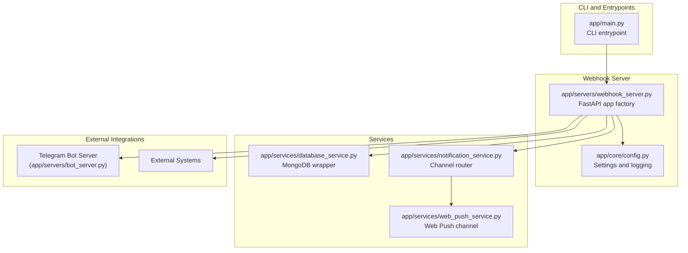
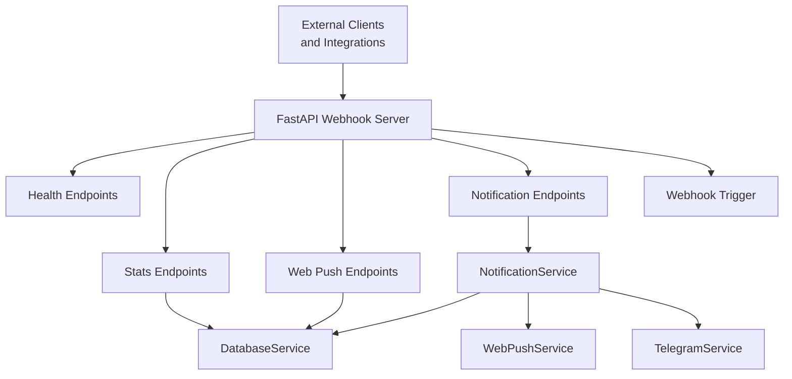
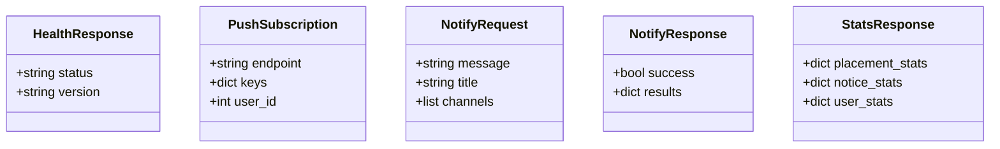
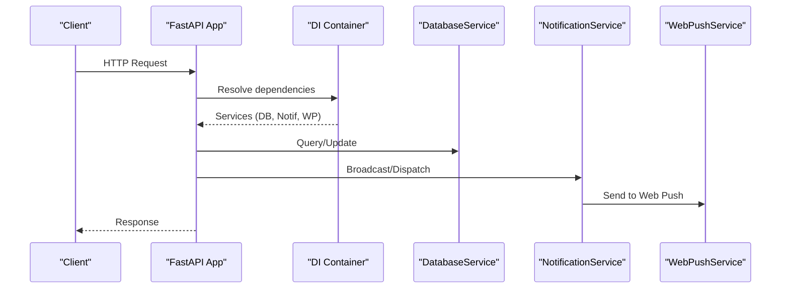
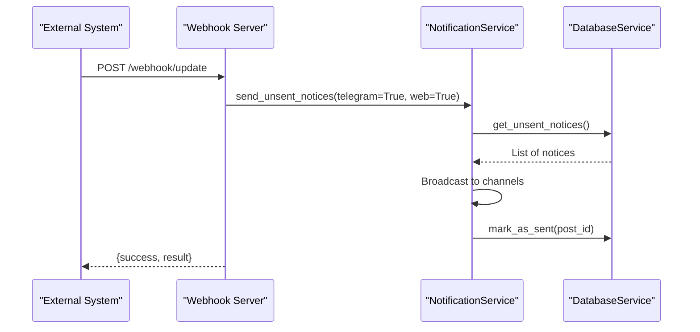
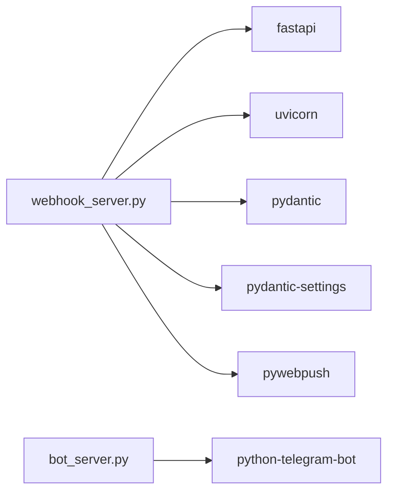

# Webhook Server

<cite>
**Referenced Files in This Document**
- [webhook_server.py](file://app/servers/webhook_server.py)
- [main.py](file://app/main.py)
- [config.py](file://app/core/config.py)
- [web_push_service.py](file://app/services/web_push_service.py)
- [notification_service.py](file://app/services/notification_service.py)
- [database_service.py](file://app/services/database_service.py)
- [bot_server.py](file://app/servers/bot_server.py)
- [requirements.txt](file://app/requirements.txt)
- [API.md](file://docs/API.md)
- [ARCHITECTURE.md](file://docs/ARCHITECTURE.md)
</cite>

## Table of Contents
1. [Introduction](#introduction)
2. [Project Structure](#project-structure)
3. [Core Components](#core-components)
4. [Architecture Overview](#architecture-overview)
5. [Detailed Component Analysis](#detailed-component-analysis)
6. [Dependency Analysis](#dependency-analysis)
7. [Performance Considerations](#performance-considerations)
8. [Troubleshooting Guide](#troubleshooting-guide)
9. [Conclusion](#conclusion)
10. [Appendices](#appendices)

## Introduction
This document describes the FastAPI-based Webhook Server designed to expose REST endpoints and webhook triggers for external integrations. It covers:
- REST API endpoints and request/response schemas
- Authentication and CORS configuration
- Webhook endpoint implementations for external service integrations
- Data validation and sanitization
- Error handling strategies
- Server configuration and deployment
- Security considerations for webhook endpoints
- Monitoring and logging
- Testing strategies for webhook integrations

## Project Structure
The webhook server is implemented as a FastAPI application with dependency injection and integrates with database and notification services. The CLI entry point supports running the webhook server alongside other servers.

**Diagram sources**
- [webhook_server.py](file://app/servers/webhook_server.py#L69-L361)
- [main.py](file://app/main.py#L88-L96)
- [config.py](file://app/core/config.py#L156-L254)
- [database_service.py](file://app/services/database_service.py#L16-L795)
- [notification_service.py](file://app/services/notification_service.py#L13-L237)
- [web_push_service.py](file://app/services/web_push_service.py#L27-L242)
- [bot_server.py](file://app/servers/bot_server.py#L29-L519)

**Section sources**
- [webhook_server.py](file://app/servers/webhook_server.py#L69-L361)
- [main.py](file://app/main.py#L88-L96)
- [config.py](file://app/core/config.py#L156-L254)

## Core Components
- FastAPI application factory with dependency injection
- Health and statistics endpoints
- Web push subscription endpoints
- Notification dispatch endpoints
- Webhook trigger endpoint for external integrations

Key responsibilities:
- Expose REST endpoints for health, stats, web push, and notifications
- Provide a webhook endpoint to trigger internal update and notification workflows
- Manage CORS and logging
- Validate request schemas using Pydantic models

**Section sources**
- [webhook_server.py](file://app/servers/webhook_server.py#L26-L361)

## Architecture Overview
The webhook server orchestrates data retrieval and notification delivery through injected services. It exposes:
- Health endpoints for readiness/liveness checks
- Statistics endpoints backed by the database service
- Web push subscription management
- Notification dispatch to multiple channels
- A webhook endpoint to trigger unsent notice broadcasts

**Diagram sources**
- [webhook_server.py](file://app/servers/webhook_server.py#L139-L361)
- [notification_service.py](file://app/services/notification_service.py#L13-L237)
- [database_service.py](file://app/services/database_service.py#L16-L795)
- [web_push_service.py](file://app/services/web_push_service.py#L27-L242)

## Detailed Component Analysis

### REST API Endpoints

#### Health Endpoints
- GET /
  - Returns a basic health status
  - Response model: HealthResponse
- GET /health
  - Returns detailed health status including version

Validation and responses:
- Response models define status and version fields
- No authentication required

**Section sources**
- [webhook_server.py](file://app/servers/webhook_server.py#L26-L31)
- [webhook_server.py](file://app/servers/webhook_server.py#L172-L181)

#### Web Push Endpoints
- POST /api/push/subscribe
  - Request body: PushSubscription
  - Response: success boolean
  - Requires web push service enabled
- POST /api/push/unsubscribe
  - Request body: PushSubscription
  - Response: success boolean
- GET /api/push/vapid-key
  - Response: public key for VAPID configuration

Validation and responses:
- Request bodies validated by Pydantic models
- HTTP 501 returned when web push is not configured
- HTTP 500 returned for unexpected errors

**Section sources**
- [webhook_server.py](file://app/servers/webhook_server.py#L33-L38)
- [webhook_server.py](file://app/servers/webhook_server.py#L186-L238)
- [web_push_service.py](file://app/services/web_push_service.py#L27-L242)

#### Notification Endpoints
- POST /api/notify
  - Request body: NotifyRequest
  - Response model: NotifyResponse
  - Broadcasts to configured channels
- POST /api/notify/telegram
  - Sends to Telegram only
- POST /api/notify/web-push
  - Sends to Web Push only

Validation and responses:
- Request bodies validated by Pydantic models
- HTTP 501 returned when notification service is not configured
- HTTP 500 returned for unexpected errors

**Section sources**
- [webhook_server.py](file://app/servers/webhook_server.py#L41-L54)
- [webhook_server.py](file://app/servers/webhook_server.py#L244-L301)
- [notification_service.py](file://app/services/notification_service.py#L13-L237)

#### Statistics Endpoints
- GET /api/stats
  - Response model: StatsResponse
- GET /api/stats/placements
- GET /api/stats/notices
- GET /api/stats/users

Validation and responses:
- HTTP 501 returned when database is not configured
- HTTP 500 returned for unexpected errors

**Section sources**
- [webhook_server.py](file://app/servers/webhook_server.py#L56-L62)
- [webhook_server.py](file://app/servers/webhook_server.py#L306-L341)
- [database_service.py](file://app/services/database_service.py#L16-L795)

#### Webhook Trigger Endpoint
- POST /webhook/update
  - Triggers unsent notice broadcast to Telegram and Web Push
  - Returns success boolean and results

Validation and responses:
- HTTP 501 returned when services are not configured
- HTTP 500 returned for unexpected errors

**Section sources**
- [webhook_server.py](file://app/servers/webhook_server.py#L346-L361)
- [notification_service.py](file://app/services/notification_service.py#L93-L167)

### Request/Response Schemas

**Diagram sources**
- [webhook_server.py](file://app/servers/webhook_server.py#L26-L62)

**Section sources**
- [webhook_server.py](file://app/servers/webhook_server.py#L26-L62)

### Dependency Injection and Service Wiring
The application uses a factory pattern to construct the FastAPI app with injected services:
- DatabaseService
- NotificationService (comprising Telegram and Web Push channels)
- WebPushService

**Diagram sources**
- [webhook_server.py](file://app/servers/webhook_server.py#L69-L138)
- [database_service.py](file://app/services/database_service.py#L16-L795)
- [notification_service.py](file://app/services/notification_service.py#L13-L237)
- [web_push_service.py](file://app/services/web_push_service.py#L27-L242)

**Section sources**
- [webhook_server.py](file://app/servers/webhook_server.py#L69-L138)

### Webhook Endpoint Implementation
The webhook endpoint triggers the internal workflow to send unsent notices to all enabled channels.

**Diagram sources**
- [webhook_server.py](file://app/servers/webhook_server.py#L346-L361)
- [notification_service.py](file://app/services/notification_service.py#L93-L167)
- [database_service.py](file://app/services/database_service.py#L116-L147)

**Section sources**
- [webhook_server.py](file://app/servers/webhook_server.py#L346-L361)
- [notification_service.py](file://app/services/notification_service.py#L93-L167)

### Data Validation and Sanitization
- Pydantic models define strict request schemas for all endpoints
- Validation occurs automatically by FastAPI
- Error responses use HTTP status codes and standardized exceptions

Common validations:
- Required fields enforced by model definitions
- Optional fields defaulted where applicable
- Exceptions raised on invalid payloads

**Section sources**
- [webhook_server.py](file://app/servers/webhook_server.py#L26-L62)
- [webhook_server.py](file://app/servers/webhook_server.py#L186-L301)

### Error Handling Strategies
- HTTP 501: Service not configured (e.g., web push, notification, database)
- HTTP 500: Unexpected runtime errors
- Exceptions are caught and mapped to appropriate HTTP responses
- Logging captures errors for diagnostics

**Section sources**
- [webhook_server.py](file://app/servers/webhook_server.py#L192-L208)
- [webhook_server.py](file://app/servers/webhook_server.py#L216-L226)
- [webhook_server.py](file://app/servers/webhook_server.py#L231-L238)
- [webhook_server.py](file://app/servers/webhook_server.py#L250-L264)
- [webhook_server.py](file://app/servers/webhook_server.py#L272-L281)
- [webhook_server.py](file://app/servers/webhook_server.py#L289-L299)
- [webhook_server.py](file://app/servers/webhook_server.py#L310-L316)
- [webhook_server.py](file://app/servers/webhook_server.py#L322-L324)
- [webhook_server.py](file://app/servers/webhook_server.py#L330-L332)
- [webhook_server.py](file://app/servers/webhook_server.py#L338-L340)

## Dependency Analysis
External dependencies relevant to the webhook server:
- FastAPI and Uvicorn for the ASGI server
- Pydantic and Pydantic Settings for configuration and validation
- PyWebPush for Web Push notifications
- python-telegram-bot for Telegram integration (used by the bot server)

**Diagram sources**
- [requirements.txt](file://app/requirements.txt#L17-L81)
- [webhook_server.py](file://app/servers/webhook_server.py#L14-L18)
- [bot_server.py](file://app/servers/bot_server.py#L13-L26)

**Section sources**
- [requirements.txt](file://app/requirements.txt#L1-L81)

## Performance Considerations
- Dependency injection avoids repeated initialization overhead
- Database operations are performed synchronously within request scope
- Web Push broadcasting iterates through subscriptions; consider batching or async processing for scale
- Logging is configured centrally to minimize overhead

[No sources needed since this section provides general guidance]

## Troubleshooting Guide
Common issues and resolutions:
- Web push not configured
  - Symptom: HTTP 501 on push endpoints
  - Resolution: Set VAPID keys and ensure pywebpush is installed
- Notification service not configured
  - Symptom: HTTP 501 on notify endpoints
  - Resolution: Verify Telegram bot token and database connectivity
- Database connectivity failures
  - Symptom: HTTP 501 on stats endpoints
  - Resolution: Check MongoDB connection string and network access
- Webhook trigger failures
  - Symptom: HTTP 500 on /webhook/update
  - Resolution: Review logs for underlying exceptions

**Section sources**
- [webhook_server.py](file://app/servers/webhook_server.py#L192-L208)
- [webhook_server.py](file://app/servers/webhook_server.py#L216-L226)
- [webhook_server.py](file://app/servers/webhook_server.py#L231-L238)
- [webhook_server.py](file://app/servers/webhook_server.py#L250-L264)
- [webhook_server.py](file://app/servers/webhook_server.py#L272-L281)
- [webhook_server.py](file://app/servers/webhook_server.py#L289-L299)
- [webhook_server.py](file://app/servers/webhook_server.py#L310-L316)
- [webhook_server.py](file://app/servers/webhook_server.py#L322-L324)
- [webhook_server.py](file://app/servers/webhook_server.py#L330-L332)
- [webhook_server.py](file://app/servers/webhook_server.py#L338-L340)

## Conclusion
The webhook server provides a focused set of REST endpoints and a webhook trigger to integrate external systems with the notification pipeline. It leverages dependency injection, Pydantic validation, and centralized logging to maintain reliability and clarity. For production deployments, ensure proper configuration of credentials, enable CORS appropriately, and monitor logs for error patterns.

[No sources needed since this section summarizes without analyzing specific files]

## Appendices

### API Documentation Summary
- Base URL: http://host:port
- Health: GET /
- Health details: GET /health
- Web Push:
  - POST /api/push/subscribe
  - POST /api/push/unsubscribe
  - GET /api/push/vapid-key
- Notifications:
  - POST /api/notify
  - POST /api/notify/telegram
  - POST /api/notify/web-push
- Statistics:
  - GET /api/stats
  - GET /api/stats/placements
  - GET /api/stats/notices
  - GET /api/stats/users
- Webhook:
  - POST /webhook/update

Authentication and CORS:
- No authentication required for webhook endpoints
- CORS allows all origins for development; restrict in production

**Section sources**
- [webhook_server.py](file://app/servers/webhook_server.py#L172-L361)
- [API.md](file://docs/API.md#L304-L498)

### Configuration and Environment Variables
Key settings for the webhook server:
- WEBHOOK_HOST, WEBHOOK_PORT
- MONGO_CONNECTION_STR
- TELEGRAM_BOT_TOKEN, TELEGRAM_CHAT_ID
- VAPID_PRIVATE_KEY, VAPID_PUBLIC_KEY, VAPID_EMAIL

**Section sources**
- [config.py](file://app/core/config.py#L88-L98)
- [config.py](file://app/core/config.py#L26-L86)

### Security Considerations
- Webhook endpoints are unauthenticated; protect at ingress or reverse proxy
- CORS configuration allows all origins by default; tighten in production
- Secrets are loaded from environment variables via Pydantic Settings
- Avoid logging sensitive data; review log outputs

**Section sources**
- [webhook_server.py](file://app/servers/webhook_server.py#L146-L153)
- [config.py](file://app/core/config.py#L156-L254)

### Monitoring and Logging
- Centralized logging setup with configurable log level and file
- Logging reduces noise from third-party libraries
- Use structured logs for webhook traffic and error analysis

**Section sources**
- [config.py](file://app/core/config.py#L188-L254)

### Testing Strategies for Webhook Integrations
- Unit tests for request/response models and service methods
- Integration tests for end-to-end flows (unsent notices -> broadcast -> mark sent)
- Load tests for Web Push broadcasting
- Mock external dependencies (Telegram, Web Push) during tests

[No sources needed since this section provides general guidance]