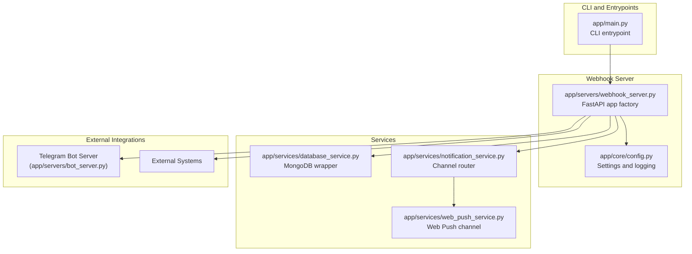
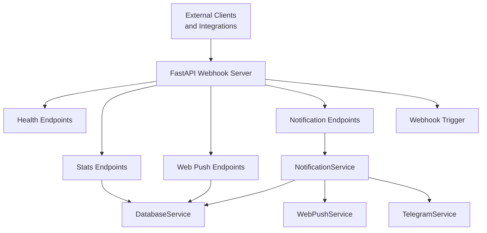
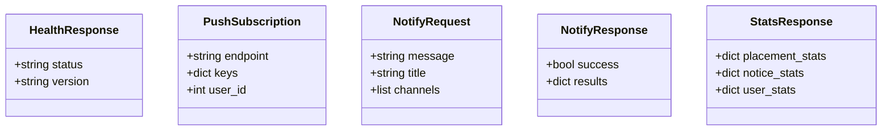
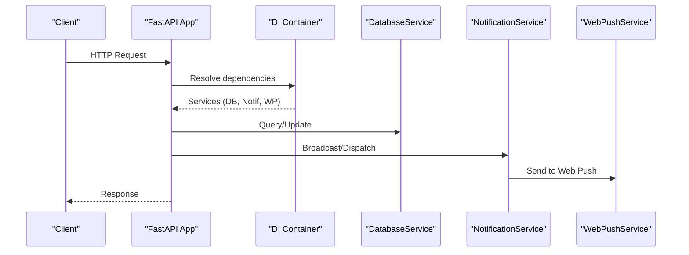
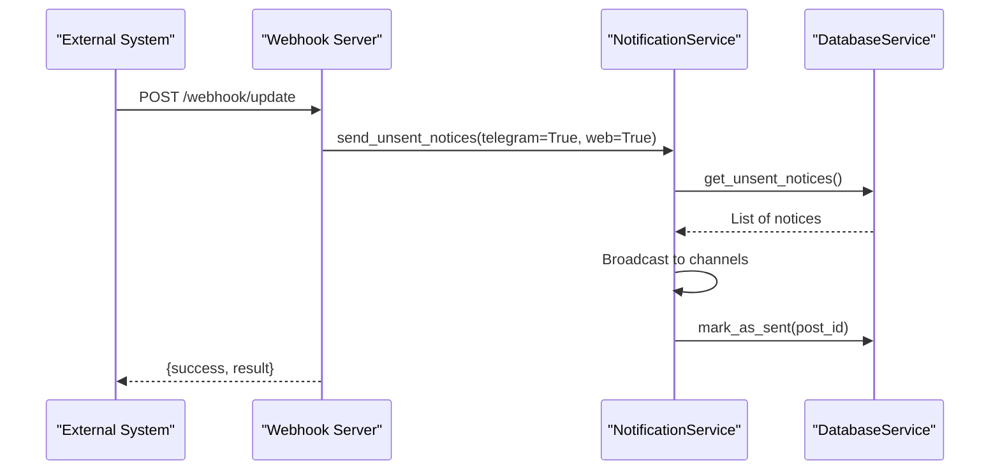
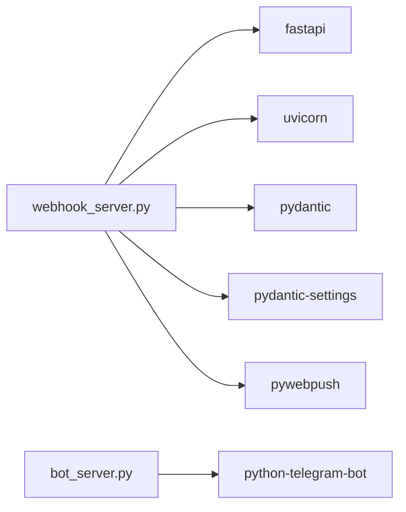

# Webhook server

## Introduction
This page describes the FastAPI-based Webhook Server designed to expose REST endpoints and webhook triggers for external integrations. It covers:
- REST API endpoints and request/response schemas
- Authentication and CORS configuration
- Webhook endpoint implementations for external service integrations
- Data validation and sanitization
- Error handling strategies
- Server configuration and deployment
- Security considerations for webhook endpoints
- Monitoring and logging
- Testing strategies for webhook integrations

## Project structure
The webhook server is implemented as a FastAPI application with dependency injection and integrates with database and notification services. The CLI entry point supports running the webhook server alongside other servers.

```mermaid
graph TB
subgraph "CLI and Entrypoints"
MAIN["app/main.py<br/>CLI entrypoint"]
end
subgraph "Webhook Server"
WS["app/servers/webhook_server.py<br/>FastAPI app factory"]
CFG["app/core/config.py<br/>Settings and logging"]
end
subgraph "Services"
DB["app/services/database_service.py<br/>MongoDB wrapper"]
NOTIF["app/services/notification_service.py<br/>Channel router"]
WP["app/services/web_push_service.py<br/>Web Push channel"]
end
subgraph "External Integrations"
TG["Telegram Bot Server<br/>(app/servers/bot_server.py)"]
EXT["External Systems"]
end
MAIN --> WS
WS --> CFG
WS --> DB
WS --> NOTIF
NOTIF --> WP
WS --> TG
WS --> EXT
```

## Core components
- FastAPI application factory with dependency injection
- Health and statistics endpoints
- Web push subscription endpoints
- Notification dispatch endpoints
- Webhook trigger endpoint for external integrations

Key responsibilities:
- Expose REST endpoints for health, stats, web push, and notifications
- Provide a webhook endpoint to trigger internal update and notification workflows
- Manage CORS and logging
- Validate request schemas using Pydantic models

## Architecture overview
The webhook server orchestrates data retrieval and notification delivery through injected services. It exposes:
- Health endpoints for readiness/liveness checks
- Statistics endpoints backed by the database service
- Web push subscription management
- Notification dispatch to multiple channels
- A webhook endpoint to trigger unsent notice broadcasts

```mermaid
graph TB
Client["External Clients<br/>and Integrations"] --> API["FastAPI Webhook Server"]
API --> Health["Health Endpoints"]
API --> Stats["Stats Endpoints"]
API --> Push["Web Push Endpoints"]
API --> Notify["Notification Endpoints"]
API --> Trigger["Webhook Trigger"]
Notify --> Router["NotificationService"]
Router --> DB["DatabaseService"]
Router --> WP["WebPushService"]
Router --> TG["TelegramService"]
Push --> DB
Stats --> DB
```

## Detailed component analysis

### REST API endpoints

#### Health endpoints
- GET /
  - Returns a basic health status
  - Response model: HealthResponse
- GET /health
  - Returns detailed health status including version

Validation and responses:
- Response models define status and version fields
- No authentication required

#### Web push endpoints
- POST /api/push/subscribe
  - Request body: PushSubscription
  - Response: success boolean
  - Requires web push service enabled
- POST /api/push/unsubscribe
  - Request body: PushSubscription
  - Response: success boolean
- GET /api/push/vapid-key
  - Response: public key for VAPID configuration

Validation and responses:
- Request bodies validated by Pydantic models
- HTTP 501 returned when web push is not configured
- HTTP 500 returned for unexpected errors

#### Notification endpoints
- POST /api/notify
  - Request body: NotifyRequest
  - Response model: NotifyResponse
  - Broadcasts to configured channels
- POST /api/notify/telegram
  - Sends to Telegram only
- POST /api/notify/web-push
  - Sends to Web Push only

Validation and responses:
- Request bodies validated by Pydantic models
- HTTP 501 returned when notification service is not configured
- HTTP 500 returned for unexpected errors

#### Statistics endpoints
- GET /api/stats
  - Response model: StatsResponse
- GET /api/stats/placements
- GET /api/stats/notices
- GET /api/stats/users

Validation and responses:
- HTTP 501 returned when database is not configured
- HTTP 500 returned for unexpected errors

#### Webhook trigger endpoint
- POST /webhook/update
  - Triggers unsent notice broadcast to Telegram and Web Push
  - Returns success boolean and results

Validation and responses:
- HTTP 501 returned when services are not configured
- HTTP 500 returned for unexpected errors

### Request/Response schemas

```mermaid
classDiagram
class HealthResponse {
+string status
+string version
}
class PushSubscription {
+string endpoint
+dict keys
+int user_id
}
class NotifyRequest {
+string message
+string title
+list channels
}
class NotifyResponse {
+bool success
+dict results
}
class StatsResponse {
+dict placement_stats
+dict notice_stats
+dict user_stats
}
```

### Dependency injection and service wiring
The application uses a factory pattern to construct the FastAPI app with injected services:
- DatabaseService
- NotificationService (comprising Telegram and Web Push channels)
- WebPushService

```mermaid
sequenceDiagram
participant Client as "Client"
participant App as "FastAPI App"
participant DI as "DI Container"
participant DB as "DatabaseService"
participant Notif as "NotificationService"
participant WP as "WebPushService"
Client->>App : HTTP Request
App->>DI : Resolve dependencies
DI-->>App : Services (DB, Notif, WP)
App->>DB : Query/Update
App->>Notif : Broadcast/Dispatch
Notif->>WP : Send to Web Push
App-->>Client : Response
```

### Webhook endpoint implementation
The webhook endpoint triggers the internal workflow to send unsent notices to all enabled channels.

```mermaid
sequenceDiagram
participant Ext as "External System"
participant API as "Webhook Server"
participant Notif as "NotificationService"
participant DB as "DatabaseService"
Ext->>API : POST /webhook/update
API->>Notif : send_unsent_notices(telegram=True, web=True)
Notif->>DB : get_unsent_notices()
DB-->>Notif : List of notices
Notif->>Notif : Broadcast to channels
Notif->>DB : mark_as_sent(post_id)
API-->>Ext : {success, result}
```

### Data validation and sanitization
- Pydantic models define strict request schemas for all endpoints
- Validation occurs automatically by FastAPI
- Error responses use HTTP status codes and standardized exceptions

Common validations:
- Required fields enforced by model definitions
- Optional fields defaulted where applicable
- Exceptions raised on invalid payloads

### Error handling strategies
- HTTP 501: Service not configured (e.g., web push, notification, database)
- HTTP 500: Unexpected runtime errors
- Exceptions are caught and mapped to appropriate HTTP responses
- Logging captures errors for diagnostics

## Dependency analysis
External dependencies relevant to the webhook server:
- FastAPI and Uvicorn for the ASGI server
- Pydantic and Pydantic Settings for configuration and validation
- PyWebPush for Web Push notifications
- python-telegram-bot for Telegram integration (used by the bot server)

```mermaid
graph LR
WS["webhook_server.py"] --> FA["fastapi"]
WS --> UV["uvicorn"]
WS --> PD["pydantic"]
WS --> PDS["pydantic-settings"]
WS --> PYW["pywebpush"]
BOT["bot_server.py"] --> PTB["python-telegram-bot"]
```

## Performance considerations
- Dependency injection avoids repeated initialization overhead
- Database operations are performed synchronously within request scope
- Web Push broadcasting iterates through subscriptions; consider batching or async processing for scale
- Logging is configured centrally to minimize overhead

[No sources needed since this section provides general guidance]

## Troubleshooting guide
Common issues and resolutions:
- Web push not configured
  - Symptom: HTTP 501 on push endpoints
  - Resolution: Set VAPID keys and ensure pywebpush is installed
- Notification service not configured
  - Symptom: HTTP 501 on notify endpoints
  - Resolution: Verify Telegram bot token and database connectivity
- Database connectivity failures
  - Symptom: HTTP 501 on stats endpoints
  - Resolution: Check MongoDB connection string and network access
- Webhook trigger failures
  - Symptom: HTTP 500 on /webhook/update
  - Resolution: Review logs for underlying exceptions

## Conclusion
The webhook server provides a focused set of REST endpoints and a webhook trigger to integrate external systems with the notification pipeline. It uses dependency injection, Pydantic validation, and centralized logging to maintain reliability and clarity. For production deployments, ensure proper configuration of credentials, enable CORS appropriately, and monitor logs for error patterns.

[No sources needed since this section summarizes without analyzing specific files]

## Appendices

### API documentation summary
- Base URL: http://host:port
- Health: GET /
- Health details: GET /health
- Web Push:
  - POST /api/push/subscribe
  - POST /api/push/unsubscribe
  - GET /api/push/vapid-key
- Notifications:
  - POST /api/notify
  - POST /api/notify/telegram
  - POST /api/notify/web-push
- Statistics:
  - GET /api/stats
  - GET /api/stats/placements
  - GET /api/stats/notices
  - GET /api/stats/users
- Webhook:
  - POST /webhook/update

Authentication and CORS:
- No authentication required for webhook endpoints
- CORS allows all origins for development; restrict in production

### Configuration and environment variables
Key settings for the webhook server:
- WEBHOOK_HOST, WEBHOOK_PORT
- MONGO_CONNECTION_STR
- TELEGRAM_BOT_TOKEN, TELEGRAM_CHAT_ID
- VAPID_PRIVATE_KEY, VAPID_PUBLIC_KEY, VAPID_EMAIL

### Security considerations
- Webhook endpoints are unauthenticated; protect at ingress or reverse proxy
- CORS configuration allows all origins by default; tighten in production
- Secrets are loaded from environment variables via Pydantic Settings
- Avoid logging sensitive data; review log outputs

### Monitoring and logging
- Centralized logging setup with configurable log level and file
- Logging reduces noise from third-party libraries
- Use structured logs for webhook traffic and error analysis

### Testing strategies for webhook integrations
- Unit tests for request/response models and service methods
- Integration tests for end-to-end flows (unsent notices -> broadcast -> mark sent)
- Load tests for Web Push broadcasting
- Mock external dependencies (Telegram, Web Push) during tests

[No sources needed since this section provides general guidance]
