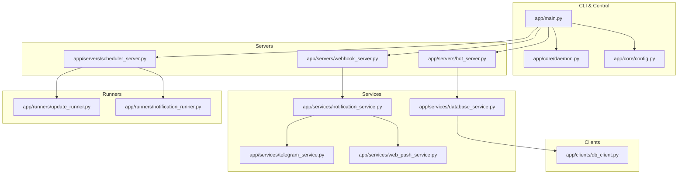
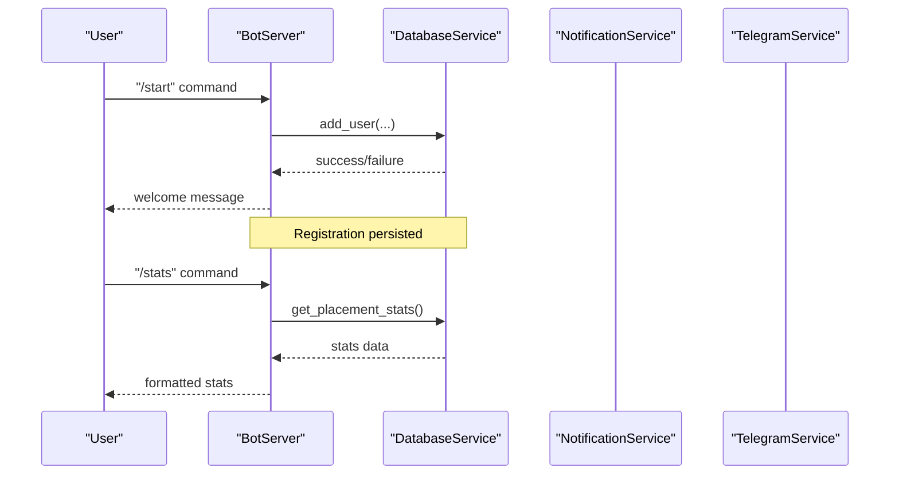
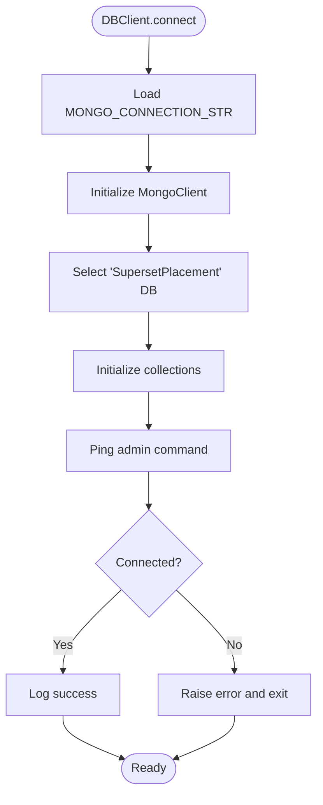
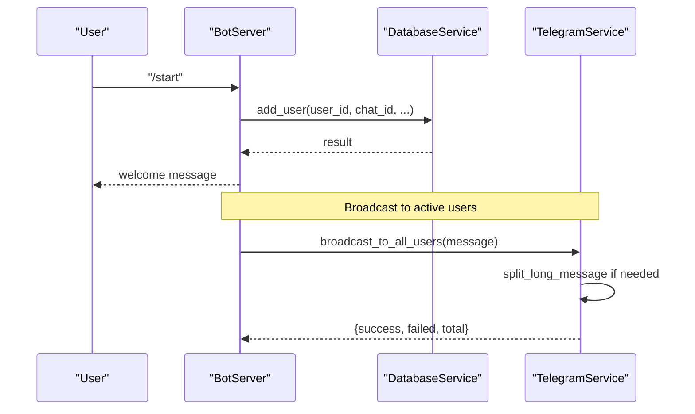
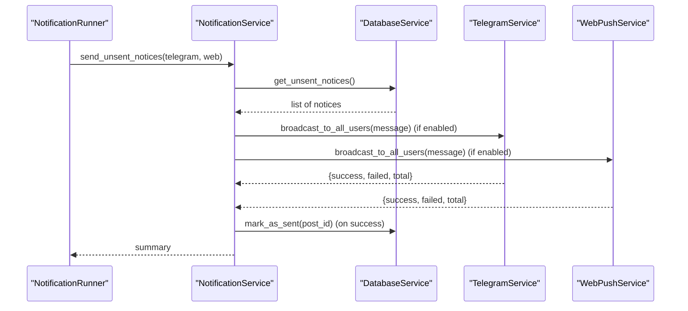
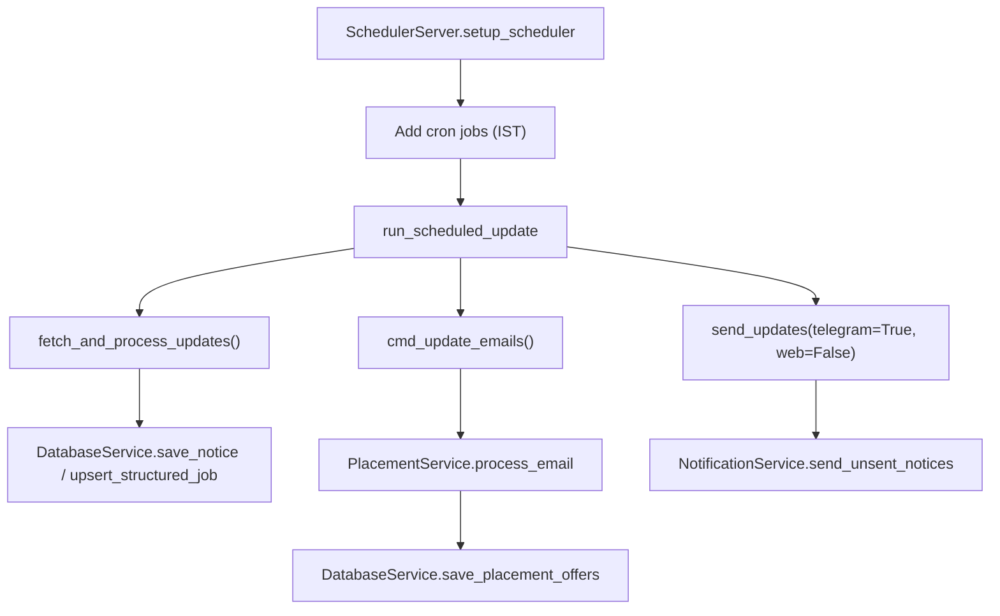
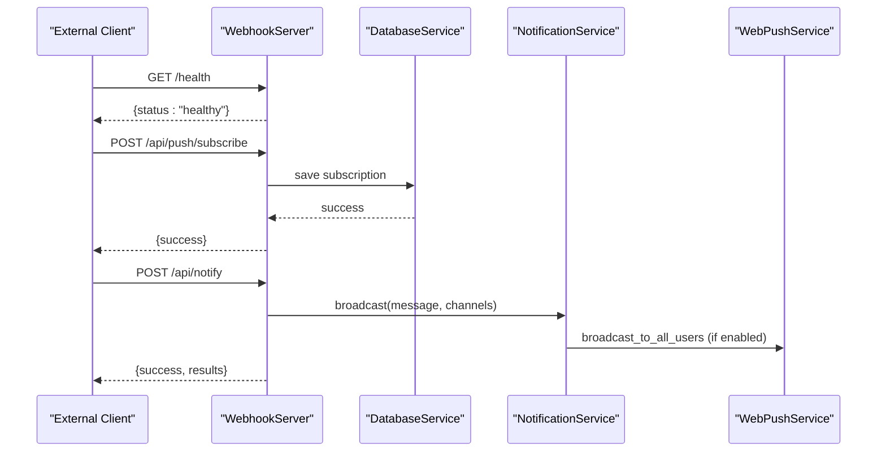
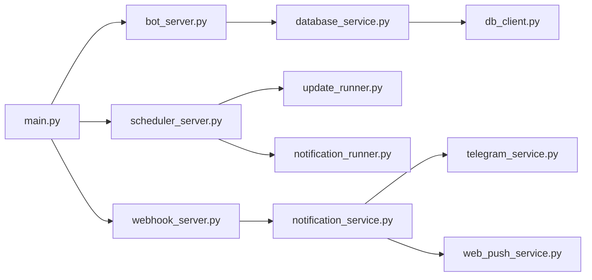

# Troubleshooting & FAQ

<cite>
**Referenced Files in This Document**
- [README.md](file://README.md)
- [docs/TROUBLESHOOTING.md](file://docs/TROUBLESHOOTING.md)
- [docs/CONFIGURATION.md](file://docs/CONFIGURATION.md)
- [docs/DATABASE.md](file://docs/DATABASE.md)
- [app/main.py](file://app/main.py)
- [app/core/config.py](file://app/core/config.py)
- [app/core/daemon.py](file://app/core/daemon.py)
- [app/servers/bot_server.py](file://app/servers/bot_server.py)
- [app/servers/scheduler_server.py](file://app/servers/scheduler_server.py)
- [app/servers/webhook_server.py](file://app/servers/webhook_server.py)
- [app/services/database_service.py](file://app/services/database_service.py)
- [app/services/notification_service.py](file://app/services/notification_service.py)
- [app/services/telegram_service.py](file://app/services/telegram_service.py)
- [app/services/web_push_service.py](file://app/services/web_push_service.py)
- [app/runners/update_runner.py](file://app/runners/update_runner.py)
- [app/runners/notification_runner.py](file://app/runners/notification_runner.py)
- [app/clients/db_client.py](file://app/clients/db_client.py)
</cite>

## Table of Contents
1. [Introduction](#introduction)
2. [Project Structure](#project-structure)
3. [Core Components](#core-components)
4. [Architecture Overview](#architecture-overview)
5. [Detailed Component Analysis](#detailed-component-analysis)
6. [Dependency Analysis](#dependency-analysis)
7. [Performance Considerations](#performance-considerations)
8. [Troubleshooting Guide](#troubleshooting-guide)
9. [Conclusion](#conclusion)
10. [Appendices](#appendices)

## Introduction
This document provides comprehensive troubleshooting and FAQ guidance for the SuperSet Telegram Notification Bot. It covers systematic diagnostics for bot communication, database connectivity, update scheduling, and notification delivery. It also includes performance tuning, memory optimization, error recovery, configuration FAQs, debugging techniques, escalation procedures, and production monitoring recommendations.

## Project Structure
The bot is organized as a modular Python application with:
- CLI entry point and daemon control
- Service-oriented architecture with dependency injection
- Dedicated servers for bot, scheduler, and webhook
- Database abstraction and services for notifications, users, and data processing
- Runners for update and notification dispatch

**Diagram sources**
- [app/main.py](file://app/main.py#L1-L632)
- [app/core/daemon.py](file://app/core/daemon.py#L1-L251)
- [app/core/config.py](file://app/core/config.py#L1-L254)
- [app/servers/bot_server.py](file://app/servers/bot_server.py#L1-L519)
- [app/servers/scheduler_server.py](file://app/servers/scheduler_server.py#L1-L388)
- [app/servers/webhook_server.py](file://app/servers/webhook_server.py#L1-L387)
- [app/services/database_service.py](file://app/services/database_service.py#L1-L795)
- [app/services/notification_service.py](file://app/services/notification_service.py#L1-L237)
- [app/services/telegram_service.py](file://app/services/telegram_service.py#L1-L351)
- [app/services/web_push_service.py](file://app/services/web_push_service.py#L1-L242)
- [app/runners/update_runner.py](file://app/runners/update_runner.py#L1-L278)
- [app/runners/notification_runner.py](file://app/runners/notification_runner.py#L1-L160)
- [app/clients/db_client.py](file://app/clients/db_client.py#L1-L104)

**Section sources**
- [README.md](file://README.md#L176-L233)
- [app/main.py](file://app/main.py#L1-L632)

## Core Components
- CLI and daemon control: centralized command routing, daemonization, logging initialization
- Servers: Telegram bot, scheduler, and webhook FastAPI server
- Services: database abstraction, notification orchestration, Telegram and Web Push channels
- Runners: update fetching and notification dispatch
- Clients: database client for MongoDB connectivity

Key responsibilities:
- Configuration and logging: type-safe settings, environment loading, log rotation
- Bot server: command handlers, user registration, stats, admin commands
- Scheduler server: cron-based update jobs, official data scraping
- Webhook server: health checks, push subscription APIs, broadcast endpoints
- Database service: CRUD operations, statistics, duplicate prevention
- Notification service: channel routing, batching, delivery tracking
- Telegram service: message formatting, rate limiting, long message splitting
- Web push service: VAPID authentication, subscription management hooks

**Section sources**
- [app/core/config.py](file://app/core/config.py#L1-L254)
- [app/servers/bot_server.py](file://app/servers/bot_server.py#L1-L519)
- [app/servers/scheduler_server.py](file://app/servers/scheduler_server.py#L1-L388)
- [app/servers/webhook_server.py](file://app/servers/webhook_server.py#L1-L387)
- [app/services/database_service.py](file://app/services/database_service.py#L1-L795)
- [app/services/notification_service.py](file://app/services/notification_service.py#L1-L237)
- [app/services/telegram_service.py](file://app/services/telegram_service.py#L1-L351)
- [app/services/web_push_service.py](file://app/services/web_push_service.py#L1-L242)
- [app/runners/update_runner.py](file://app/runners/update_runner.py#L1-L278)
- [app/runners/notification_runner.py](file://app/runners/notification_runner.py#L1-L160)
- [app/clients/db_client.py](file://app/clients/db_client.py#L1-L104)

## Architecture Overview
The system separates concerns across CLI, servers, services, and runners. The scheduler and bot servers operate independently, while the webhook server exposes REST endpoints for integrations. Services encapsulate domain logic and depend on the database client for persistence.

**Diagram sources**
- [app/servers/bot_server.py](file://app/servers/bot_server.py#L87-L163)
- [app/services/database_service.py](file://app/services/database_service.py#L616-L668)
- [app/services/telegram_service.py](file://app/services/telegram_service.py#L140-L172)

**Section sources**
- [README.md](file://README.md#L176-L233)

## Detailed Component Analysis

### Database Connectivity and Persistence
- Connection lifecycle: client creates connection, initializes collections, validates with ping
- Database service wraps collections and provides CRUD, statistics, and duplicate prevention
- Indexing strategy optimized for frequent queries (unsent notices, active users, timestamps)

**Diagram sources**
- [app/clients/db_client.py](file://app/clients/db_client.py#L42-L72)

**Section sources**
- [app/clients/db_client.py](file://app/clients/db_client.py#L1-L104)
- [app/services/database_service.py](file://app/services/database_service.py#L1-L795)
- [docs/DATABASE.md](file://docs/DATABASE.md#L425-L458)

### Telegram Bot Communication
- Command handlers for start, stop, status, stats, and admin commands
- Message formatting and long message splitting with rate limiting
- Broadcast to all active users with success/failure accounting

**Diagram sources**
- [app/servers/bot_server.py](file://app/servers/bot_server.py#L87-L163)
- [app/services/telegram_service.py](file://app/services/telegram_service.py#L140-L172)

**Section sources**
- [app/servers/bot_server.py](file://app/servers/bot_server.py#L1-L519)
- [app/services/telegram_service.py](file://app/services/telegram_service.py#L1-L351)

### Notification Delivery Pipeline
- NotificationService orchestrates channels and tracks delivery
- DatabaseService provides unsent notices and marks as sent upon successful broadcast
- TelegramService handles rate limits and long messages; WebPushService handles VAPID and subscription removal on expiration

**Diagram sources**
- [app/runners/notification_runner.py](file://app/runners/notification_runner.py#L60-L115)
- [app/services/notification_service.py](file://app/services/notification_service.py#L93-L167)
- [app/services/database_service.py](file://app/services/database_service.py#L116-L147)
- [app/services/telegram_service.py](file://app/services/telegram_service.py#L140-L172)
- [app/services/web_push_service.py](file://app/services/web_push_service.py#L120-L155)

**Section sources**
- [app/services/notification_service.py](file://app/services/notification_service.py#L1-L237)
- [app/services/database_service.py](file://app/services/database_service.py#L116-L147)
- [app/services/telegram_service.py](file://app/services/telegram_service.py#L1-L351)
- [app/services/web_push_service.py](file://app/services/web_push_service.py#L1-L242)
- [app/runners/notification_runner.py](file://app/runners/notification_runner.py#L1-L160)

### Update Scheduling and Data Processing
- SchedulerServer sets up cron jobs for updates and official data scraping
- UpdateRunner fetches notices/jobs from SuperSet and processes with job enrichment
- Email processing orchestrates LLM-based placement extraction and notice classification

**Diagram sources**
- [app/servers/scheduler_server.py](file://app/servers/scheduler_server.py#L274-L320)
- [app/runners/update_runner.py](file://app/runners/update_runner.py#L56-L148)
- [app/runners/notification_runner.py](file://app/runners/notification_runner.py#L60-L115)

**Section sources**
- [app/servers/scheduler_server.py](file://app/servers/scheduler_server.py#L1-L388)
- [app/runners/update_runner.py](file://app/runners/update_runner.py#L1-L278)
- [app/runners/notification_runner.py](file://app/runners/notification_runner.py#L1-L160)

### Webhook Server and Integrations
- Health endpoints, push subscription management, and broadcast APIs
- Dependency injection for services and graceful degradation when optional dependencies are missing

**Diagram sources**
- [app/servers/webhook_server.py](file://app/servers/webhook_server.py#L172-L361)
- [app/services/web_push_service.py](file://app/services/web_push_service.py#L120-L155)

**Section sources**
- [app/servers/webhook_server.py](file://app/servers/webhook_server.py#L1-L387)
- [app/services/web_push_service.py](file://app/services/web_push_service.py#L1-L242)

## Dependency Analysis
- Loose coupling via dependency injection and factory functions
- Centralized configuration and logging across components
- Clear separation between servers, services, and runners

**Diagram sources**
- [app/main.py](file://app/main.py#L37-L102)
- [app/servers/bot_server.py](file://app/servers/bot_server.py#L455-L507)
- [app/servers/scheduler_server.py](file://app/servers/scheduler_server.py#L365-L376)
- [app/servers/webhook_server.py](file://app/servers/webhook_server.py#L69-L130)
- [app/services/database_service.py](file://app/services/database_service.py#L28-L46)
- [app/services/notification_service.py](file://app/services/notification_service.py#L21-L41)
- [app/runners/update_runner.py](file://app/runners/update_runner.py#L21-L55)
- [app/runners/notification_runner.py](file://app/runners/notification_runner.py#L21-L60)
- [app/clients/db_client.py](file://app/clients/db_client.py#L16-L41)

**Section sources**
- [app/main.py](file://app/main.py#L1-L632)
- [app/core/config.py](file://app/core/config.py#L1-L254)

## Performance Considerations
- Database queries: leverage indexes and projections; avoid loading entire collections
- Asynchronous design: ensure non-blocking operations in async contexts
- Batch operations: bulk writes and updates to reduce overhead
- Memory usage: clear caches, avoid circular references, monitor RSS
- LLM model selection: choose appropriate model for speed vs accuracy trade-offs

[No sources needed since this section provides general guidance]

## Troubleshooting Guide

### Connection Issues
- MongoDB connection failures
  - Validate connection string format and credentials
  - Check IP whitelist and network access
  - Confirm firewall allows outbound connections to port 27017
  - Test connectivity with ping and curl
  - Use the provided connection test script in troubleshooting docs
- Email IMAP authentication failures
  - Ensure 2FA is enabled and app password is used
  - Regenerate app password if needed
- Telegram bot token invalid
  - Verify token format and ensure it is active
  - Check for spaces or typos in the token

**Section sources**
- [docs/TROUBLESHOOTING.md](file://docs/TROUBLESHOOTING.md#L16-L61)
- [docs/TROUBLESHOOTING.md](file://docs/TROUBLESHOOTING.md#L63-L91)
- [docs/TROUBLESHOOTING.md](file://docs/TROUBLESHOOTING.md#L93-L121)

### Bot Issues
- Bot not receiving messages
  - Confirm bot server is running and listening
  - Distinguish between long-polling and webhook modes
  - Ensure user has sent /start and is registered
  - Validate chat ID format and permissions
- Bot commands not responding
  - Check command format and casing
  - Verify admin-only commands require admin ID
  - Respect rate limiting and timing
- Bot crashes unexpectedly
  - Inspect logs for unhandled exceptions
  - Monitor memory usage and consider reducing batch sizes
  - Ensure database reconnection logic is in place
  - Avoid blocking operations in async code paths

**Section sources**
- [docs/TROUBLESHOOTING.md](file://docs/TROUBLESHOOTING.md#L125-L164)
- [docs/TROUBLESHOOTING.md](file://docs/TROUBLESHOOTING.md#L166-L196)
- [docs/TROUBLESHOOTING.md](file://docs/TROUBLESHOOTING.md#L198-L236)

### Data Processing Issues
- Notices not being scraped
  - Validate SuperSet credentials and portal accessibility
  - Check for portal layout changes affecting selectors
  - Review duplicate detection logic and last scraped timestamps
- Placement offers not extracted
  - Verify GOOGLE_API_KEY validity and LLM model configuration
  - Confirm email fetching is functioning
- Duplicate notifications sent
  - Inspect notice ID uniqueness and timestamp handling
  - Check manual updates and sent flags

**Section sources**
- [docs/TROUBLESHOOTING.md](file://docs/TROUBLESHOOTING.md#L240-L279)
- [docs/TROUBLESHOOTING.md](file://docs/TROUBLESHOOTING.md#L281-L323)
- [docs/TROUBLESHOOTING.md](file://docs/TROUBLESHOOTING.md#L325-L359)

### Notification Issues
- Messages not sent to Telegram
  - Reset sent flags if needed and re-send
  - Test Telegram API connectivity manually
  - Validate chat ID format and length limits
- Web push not working
  - Generate and configure VAPID keys
  - Verify user subscriptions exist
  - Ensure service worker is registered on the client
  - Handle expired subscriptions and remove them

**Section sources**
- [docs/TROUBLESHOOTING.md](file://docs/TROUBLESHOOTING.md#L363-L409)
- [docs/TROUBLESHOOTING.md](file://docs/TROUBLESHOOTING.md#L411-L452)

### Performance Issues
- Slow bot response
  - Analyze slow database queries and add indexes
  - Replace blocking I/O with async equivalents
  - Batch operations and reduce per-user loops
  - Tune LLM model for speed if latency is high
- High memory usage
  - Use lazy cursors for large queries
  - Periodically clear caches and finalize objects
  - Investigate circular references and weak references

**Section sources**
- [docs/TROUBLESHOOTING.md](file://docs/TROUBLESHOOTING.md#L456-L496)
- [docs/TROUBLESHOOTING.md](file://docs/TROUBLESHOOTING.md#L498-L532)

### FAQ
- How often should updates run?
  - Default schedule is three times daily (12 AM, 12 PM, 6 PM IST); adjust via configuration
- Can I run multiple instances?
  - Yes, coordinate via process isolation and database locking
- How do I back up data?
  - Use mongodump against the configured connection string
- How do I add a new data source?
  - Create a service class and integrate via the main CLI or scheduler
- Can I use SQLite instead of MongoDB?
  - Not without rewriting the database abstraction
- How do I change the bot token?
  - Obtain a new token from BotFather and restart the daemon
- How do I see what’s happening?
  - Tail the logs in the configured log directory
- Why aren’t notifications sent at scheduled times?
  - Verify scheduler is enabled, bot is running, and scheduler logs
- Can users filter notifications?
  - Not yet, but options are /start and /stop
- How do I contact support?
  - Use GitHub Issues or the live bot link

**Section sources**
- [docs/TROUBLESHOOTING.md](file://docs/TROUBLESHOOTING.md#L534-L615)
- [docs/CONFIGURATION.md](file://docs/CONFIGURATION.md#L289-L356)

## Conclusion
This troubleshooting guide consolidates practical diagnostics, logging strategies, and resolution steps for the SuperSet Telegram Notification Bot. By following the systematic approaches outlined—covering connection, bot, data processing, notification delivery, performance, and operational FAQs—you can maintain a reliable, production-grade notification system.

[No sources needed since this section summarizes without analyzing specific files]

## Appendices

### Systematic Diagnostic Checklist
- Environment variables validated and loaded
- Database connectivity verified
- Bot server running and reachable
- Scheduler jobs configured and logging
- Notification channels enabled and configured
- Logs reviewed for recent errors and warnings
- Resource usage monitored (CPU, memory, disk)

**Section sources**
- [docs/CONFIGURATION.md](file://docs/CONFIGURATION.md#L36-L43)
- [docs/TROUBLESHOOTING.md](file://docs/TROUBLESHOOTING.md#L14-L61)

### Escalation Procedures
- Capture logs from all components (bot, scheduler, webhook)
- Provide environment details and configuration excerpts
- Include reproduction steps and error messages
- Engage with community support channels as documented

**Section sources**
- [README.md](file://README.md#L349-L357)