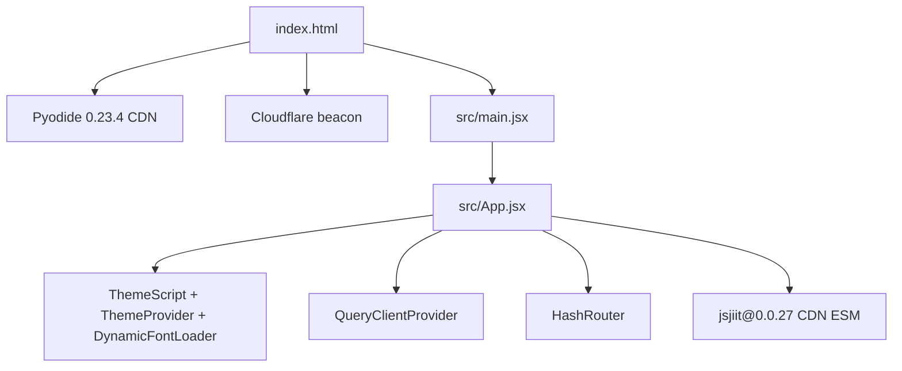
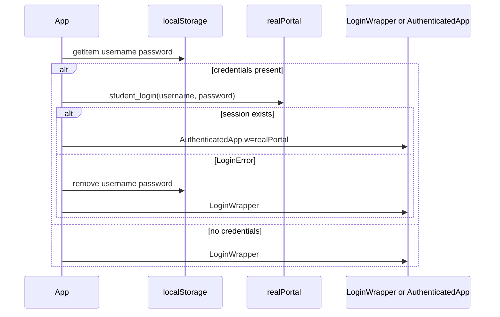
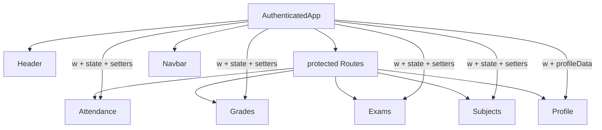
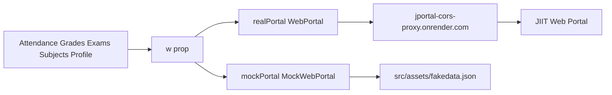

# Overview

JPortal is a client-side PWA that replaces the official JIIT web portal UI. Login skips the captcha. Attendance, grades, exams, subjects, and profile all run in the browser against jsjiit.

Live app: https://codeblech.github.io/jportal/. Public stats: https://codeblech.github.io/jportal/#/stats.

Related: [Getting Started](2-getting-started), [Architecture Overview](3-architecture-overview), [Feature Modules](4-feature-modules).

* Login without captcha through `jsjiit` (`WebPortal.student_login`)
* React 18 UI on Radix primitives and Tailwind 4
* Offline shell via `vite-plugin-pwa` and Workbox
* Theme presets in `src/utils/theme-presets.ts`
* Demo mode through `MockWebPortal` and `src/assets/fakedata.json`
* Installable on Android, iOS, and Windows

The hosted GitHub Pages site is still https://codeblech.github.io/jportal/. This docs tree follows the [tashifkhan/jportal](https://github.com/tashifkhan/jportal) fork.

## What you get

Five protected modules after login, plus a public stats page:

| Feature | Route | What it does |
| --- | --- | --- |
| Attendance | `/attendance` | Overview and daily tabs, attendance goal, subject drill-down |
| Grades | `/grades` | SGPA/CGPA chart, grade cards, marks from PDF parsing |
| Exams | `/exams` | Semester and exam event selection, schedule list |
| Subjects | `/subjects` | Registered courses and subject choices |
| Profile | `/profile` | Personal, academic, contact, family, address, qualifications |
| Analytics | `/stats` | Cloudflare Web Analytics (no login) |

### Authentication modes

`App` keeps two portal instances and picks one:

1. Real mode. `realPortal` is `new WebPortal({ useProxy: true, proxyUrl: "https://jportal-cors-proxy.onrender.com" })` from jsjiit `0.0.27`.
2. Demo mode. `mockPortal` is `MockWebPortal` reading `fakedata.json`. The login screen's Try Demo button sets `isDemoMode`.

## Technology stack

### Core framework

| Category | Package | Version | Purpose |
| --- | --- | --- | --- |
| UI | `react` | 18.3.1 | Component tree |
| Build | `vite` | 7.3.1 | Dev server and production bundle |
| Routing | `react-router-dom` | 6.27.0 | `HashRouter` |
| Theme state | `zustand` | 5.0.8 | Persisted theme store |
| Server state | `@tanstack/react-query` | 5.90.2 | Cloudflare stats hooks |
| Forms | `react-hook-form` | 7.53.1 | Login form |
| Validation | `zod` | 3.23.8 | Login schema |
| Charts | `recharts` | 2.15.4 | GPA, attendance, analytics |
| Toasts | `sonner` | 2.0.7 | Login and error toasts |
| Styling | `tailwindcss` | 4.1.12 | Utility CSS |
| PWA | `vite-plugin-pwa` | 1.2.0 | Manifest and Workbox SW |
| Portal client | `jsjiit` | 0.0.27 (CDN, not npm) | JIIT Web Portal API |
| PDF parse | Pyodide 0.23.4 + PyMuPDF + `jiit_marks-0.2.0` | Wheels in `public/artifact/` | Marks tab |

jsjiit is imported as `https://cdn.jsdelivr.net/npm/jsjiit@0.0.27/dist/jsjiit.esm.js`. It is not listed in `package.json`.

## Top-level architecture

### Application entry point and authentication flow

`App` is the auth gate:

1. On mount it reads `username` and `password` from `localStorage` and calls `realPortal.student_login`.
2. Unauthenticated users get `LoginWrapper` (`Login`).
3. Authenticated users get `AuthenticatedApp` with `w={activePortal}`.
4. `/stats` stays public and always renders `Cloudflare`.

### Feature module organization

`AuthenticatedApp` holds feature state and drills it down. Each feature gets `w`, its cache objects, and the matching setters. Navigating between hash routes does not wipe that cache.

## Application data flow

### Portal abstraction layer

Feature components call the same methods on `w` whether `w` is `WebPortal` or `MockWebPortal`.

Methods actually used:

* `student_login`
* `get_attendance_meta`, `get_attendance`, `get_subject_daily_attendance`
* `get_registered_semesters`, `get_registered_subjects_and_faculties`, `get_subject_choices`
* `get_semesters_for_exam_events`, `get_exam_events`, `get_exam_schedule`
* `get_semesters_for_grade_card`, `get_grade_card`, `get_sgpa_cgpa`
* `get_semesters_for_marks`, `download_marks`
* `get_personal_info`

There is no `get_grades()` or `get_student_info()` on this client.

### State persistence

| Data | Storage | Where |
| --- | --- | --- |
| Credentials | `localStorage` `username`, `password` | `Login.jsx` |
| Attendance goal | `localStorage` `attendanceGoal` | `AuthenticatedApp` in `App.jsx` |
| Theme | Zustand persist | `src/stores/theme-store.ts` |
| API responses | React state on `AuthenticatedApp` | Feature caches |

## PWA architecture

`VitePWA` in `jportal/vite.config.ts` generates the service worker. There is no hand-rolled `public/sw.js`.

1. Precache JS, CSS, HTML, ico, png, svg, and `.whl` files (30MB max).
2. CacheFirst for Pyodide `v0.23.4`.
3. Extra manifest entries for `jiit_marks-0.2.0` and PyMuPDF wheels under `${base}artifact/`.

| Platform | Install |
| --- | --- |
| Android (Chromium) | Add to Home screen, then Install |
| iOS (Safari) | Share, Add to Home Screen |
| Windows | Install icon in the URL bar |

## Theme system overview

* Presets live in `src/utils/theme-presets.ts` (`adefault`, `modern-minimal`, `violet-bloom`, and many more).
* Light/dark toggle uses the View Transition API when the browser supports it.
* `DynamicFontLoader` injects Google Fonts from the active preset.
* CSS custom properties on `:root` feed Tailwind `@theme inline`.
* Zustand store: `src/stores/theme-store.ts`.

See [Theme System](3.4-theme-system).

## Navigation structure

`HashRouter` so GitHub Pages does not need rewrite rules.

Public:

* `/stats` → `Cloudflare`

Protected:

* `/` and `/login` redirect to `/attendance`
* `/attendance`, `/grades`, `/exams`, `/subjects`, `/profile`

Chrome:

* `Header` (theme, stats link, logout)
* `Navbar` (five feature links)

## Getting started

* Install and run: [Getting Started](2-getting-started)
* Structure: [Architecture Overview](3-architecture-overview)
* Features: [Feature Modules](4-feature-modules)
* UI: [UI Components](5-ui-components)
* Build: [Build & Deployment](6-build-and-deployment)
* Hacking: [Development Guide](7-development-guide)
