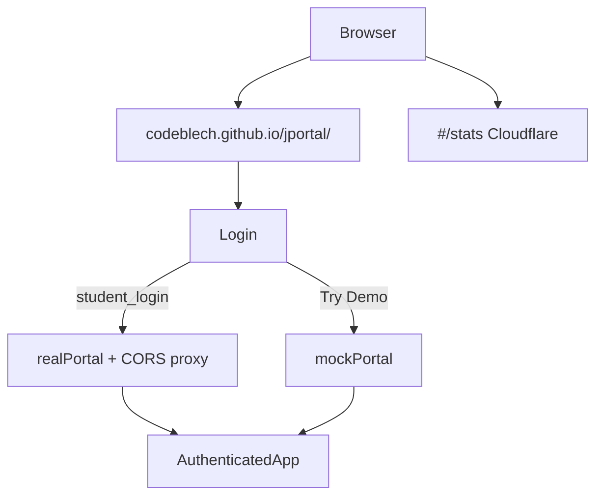
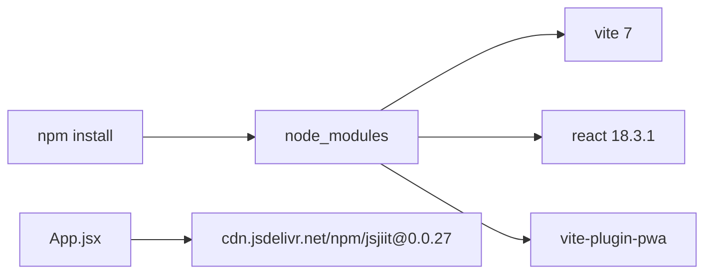
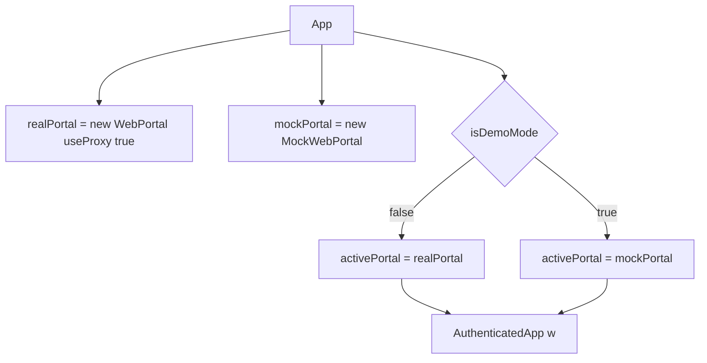
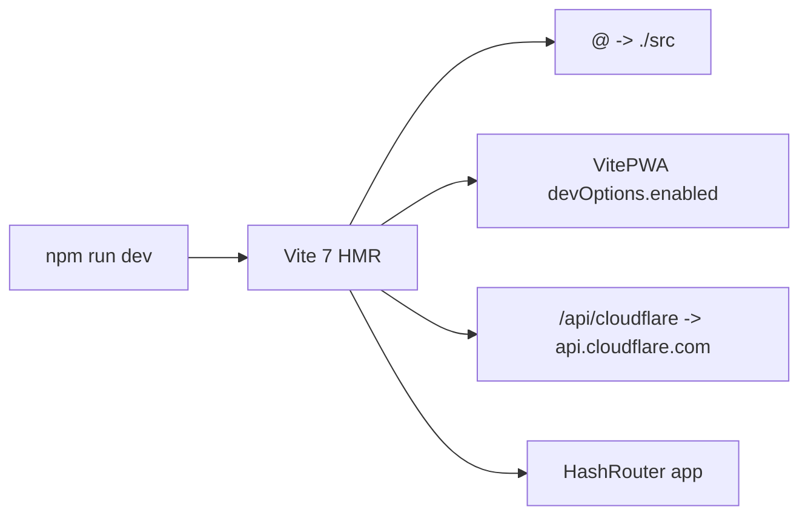
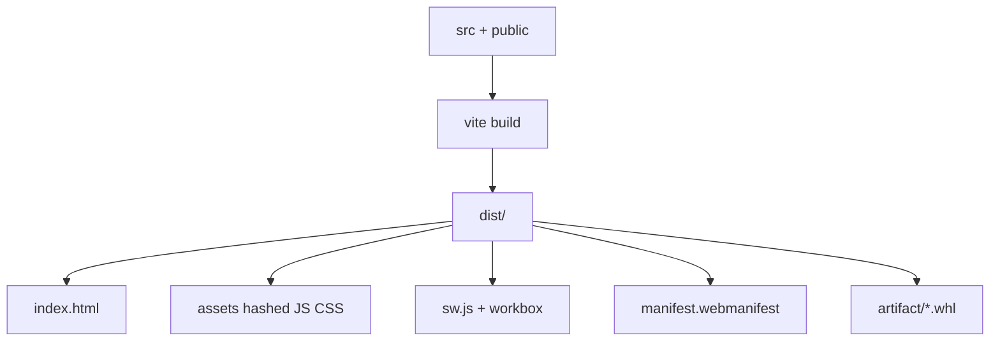
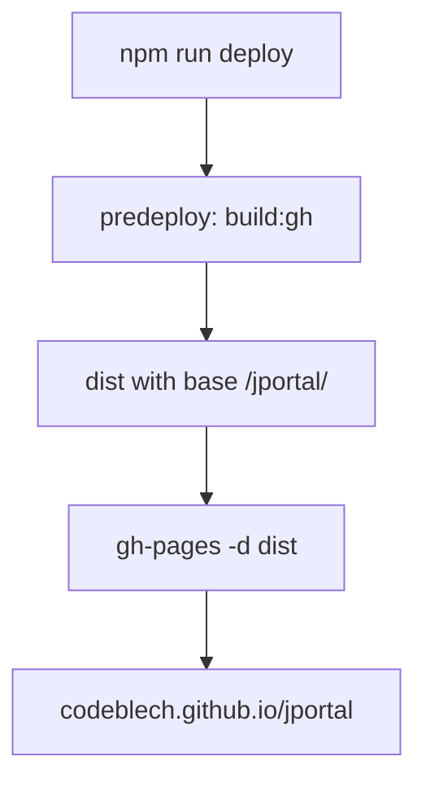
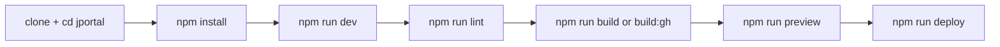

# Getting started

Run JPortal locally, configure it, and ship a production PWA build.

Related: [Architecture Overview](3-architecture-overview), [Feature Modules](4-feature-modules).

## Prerequisites

| Requirement | Minimum | Purpose |
| --- | --- | --- |
| Node.js | 18.x | Runtime |
| npm | 9.x | Install and scripts |
| Git | recent | Clone |
| Browser | current Chrome, Firefox, or Safari | Dev and PWA install |

## Quick start: using the live application

No local setup. Open https://codeblech.github.io/jportal/, sign in with JIIT credentials, or tap Try Demo.



### Installing as PWA

| Platform | Steps |
| --- | --- |
| Android (Chrome) | Three-dot menu, Add to Home screen, Install |
| iOS (Safari) | Share, Add to Home Screen, Add |
| Windows (Chrome/Edge) | Install icon in the URL bar, Install |

## Local development setup

### Step 1: clone the repository

```
git clone https://github.com/tashifkhan/jportal.git
cd jportal
```

Upstream is [codeblech/jportal](https://github.com/codeblech/jportal). Hosted Pages is still the codeblech URL.

### Step 2: enter the app directory

Application code lives in the `jportal` subdirectory:

```
cd jportal
```

### Step 3: install dependencies

```
npm install
```

From `jportal/package.json`:

* React 18.3.1
* Vite 7.3.1
* `vite-plugin-pwa` 1.2.0
* Radix UI packages
* TanStack Query 5.90.2
* Zustand 5.0.8

jsjiit is not an npm dependency. The app imports `jsjiit@0.0.27` from jsDelivr in `App.jsx` and `Login.jsx`.



## Environment configuration

Vite loads env via `loadEnv` in `vite.config.ts`. Typed vars live in `src/vite-env.d.ts`.

| Variable | Purpose | Required |
| --- | --- | --- |
| `VITE_APP_BASE_PATH` | Asset base. `build:gh` sets `/jportal/`, `build:cf` sets `/` | For production deploys |
| `VITE_CLOUDFLARE_API_TOKEN` | Injected on the Vite proxy for `/api/cloudflare` | Local stats proxy only |
| `VITE_USE_FAKE_DATA` | Declared in `vite-env.d.ts` | Unused at runtime. Demo is the Try Demo button |
| `VITE_CLOUDFLARE_BASE_URL`, `VITE_CLOUDFLARE_PROXY_URL`, `VITE_CLOUDFLARE_ACCOUNT_TAG`, `VITE_CLOUDFLARE_SITE_TAG` | Typed leftovers | Production stats use `POST /api/analytics` (`functions/api/analytics.ts`) |

### Demo mode vs real mode

Demo is not an env flag. `App` always constructs both portals. `isDemoMode` chooses `mockPortal` after Try Demo.



## Running the application

### Development server

```
npm run dev
```

Vite serves at `http://localhost:5173/` by default. Base path is `VITE_APP_BASE_PATH` or `/`. GitHub Pages builds use `/jportal/` via `npm run build:gh`.



Vite config also:

1. Enables HMR
2. Turns on the service worker in dev (`devOptions.enabled: true`)
3. Proxies `/api/cloudflare` and attaches `VITE_CLOUDFLARE_API_TOKEN`
4. Aliases `@` to `./src` and pins `lucide-react` to its ESM build

### Preview production build

```
npm run build
npm run preview
```

`preview` serves `dist/`.

### Linting

```
npm run lint
```

## Building for production

```
npm run build
```

Scripts in `package.json`:

| Script | Command | Base path |
| --- | --- | --- |
| `build` | `vite build` | `VITE_APP_BASE_PATH` or `/` |
| `build:gh` | `VITE_APP_BASE_PATH=/jportal/ vite build` | `/jportal/` |
| `build:cf` | `VITE_APP_BASE_PATH=/ vite build` | `/` |
| `predeploy` | `npm run build:gh` | GitHub Pages |
| `deploy` | `gh-pages -d dist` | `gh-pages` branch |



PWA details:

* `registerType: autoUpdate`, `injectRegister: auto`
* `maximumFileSizeToCacheInBytes`: 30MB
* glob: `**/*.{js,css,html,ico,png,svg,whl}`
* Precache Pyodide 0.23.4 plus `jiit_marks-0.2.0` and PyMuPDF wheels at `${base}artifact/`
* Manifest `start_url` follows `base`

## Deployment

```
npm run deploy
```

`predeploy` runs `build:gh`, then `gh-pages` publishes `dist/` to the `gh-pages` branch. The live URL is https://codeblech.github.io/jportal.



| Setting | Value | File |
| --- | --- | --- |
| Homepage | `https://codeblech.github.io/jportal` | `package.json` |
| GH Pages base | `/jportal/` | `build:gh` |
| Cloudflare Pages base | `/` | `build:cf` |
| Deploy | `gh-pages -d dist` | `package.json` |

## Development workflow summary



## Common commands reference

| Command | Purpose |
| --- | --- |
| `npm install` | Install deps |
| `npm run dev` | Vite dev server |
| `npm run build` | Production build |
| `npm run build:gh` | Build with `/jportal/` |
| `npm run build:cf` | Build with `/` |
| `npm run preview` | Serve `dist/` |
| `npm run lint` | ESLint |
| `npm run deploy` | `build:gh` then gh-pages |

## Project structure overview

```
jportal/
├── public/
│   ├── artifact/          # jiit_marks and PyMuPDF wheels
│   ├── icons/             # navbar SVGs
│   └── pwa-icons/
├── src/
│   ├── assets/fakedata.json
│   ├── components/        # features, theme, ui/
│   ├── hooks/cloudflare.ts
│   ├── lib/api.ts
│   ├── stores/theme-store.ts
│   ├── utils/theme-presets.ts
│   ├── App.jsx
│   └── main.jsx
├── package.json
├── vite.config.ts
└── index.html
```

Repo root also has `functions/api/analytics.ts` for Cloudflare Pages.

## Next steps

1. [Architecture Overview](3-architecture-overview)
2. [Feature Modules](4-feature-modules)
3. [Theme System](3.4-theme-system)
4. [State Management Strategy](3.2-state-management-strategy)
5. [Build & Deployment](6-build-and-deployment)
