# Architecture overview

How JPortal is put together: stack, routing, portal instances, and the patterns that show up everywhere.

Subsystem docs:

* Authentication and routing: [Application Structure & Authentication](3.1-application-structure-and-authentication)
* State: [State Management Strategy](3.2-state-management-strategy)
* Data: [Data Layer & API Integration](3.3-data-layer-and-api-integration)
* Theme: [Theme System](3.4-theme-system)
* Features: [Feature Modules](4-feature-modules)

## Technology stack

SPA in `jportal/`. Versions from `package.json`.

| Category | Technologies | Purpose |
| --- | --- | --- |
| UI | React 18.3.1 | Components |
| Build | Vite 7.3.1 | Dev server and bundle |
| Routing | React Router DOM 6.27.0 | `HashRouter` |
| Primitives | Radix UI | Dialog, Select, Tabs, Sheet |
| CSS | Tailwind CSS 4.1.12, CVA | Utilities and variants |
| Feature state | `useState` / `useEffect` | Lifted onto `AuthenticatedApp` |
| Theme state | Zustand 5.0.8 | `src/stores/theme-store.ts` |
| Forms | React Hook Form 7.53.1, Zod 3.23.8 | Login |
| Charts | Recharts 2.15.4 | GPA, attendance, stats |
| Server state | TanStack Query 5.90.2 | Cloudflare hooks in `src/hooks/cloudflare.ts` |
| PWA | `vite-plugin-pwa` 1.2.0, Workbox | SW and manifest |
| Portal | jsjiit 0.0.27 CDN | `WebPortal`, `LoginError` |
| Python in browser | Pyodide 0.23.4 | Marks PDF parse |

TanStack Query is used on `/stats`. Attendance and Grades still fetch with `useEffect` and parent state.

## Application entry point and bootstrap

### HTML and script loading

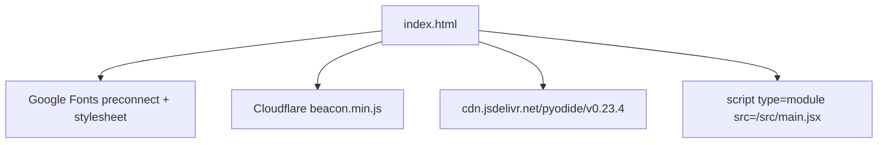

### Main entry point

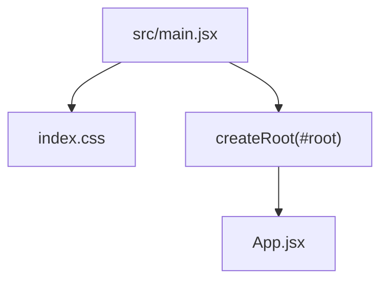

`main.jsx` only mounts `App`. Theme and Query providers live in `App`.

## Application architecture

### Top-level component structure

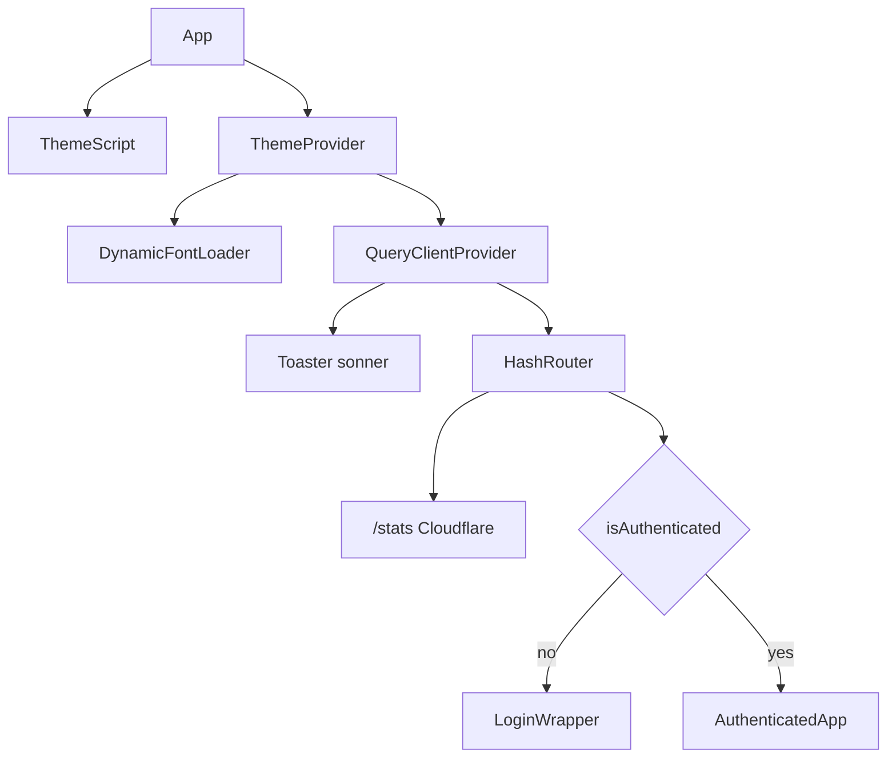

State on `App`:

* `isAuthenticated`
* `isDemoMode`
* `isLoading` (auto-login)
* `error`

### Portal instance management

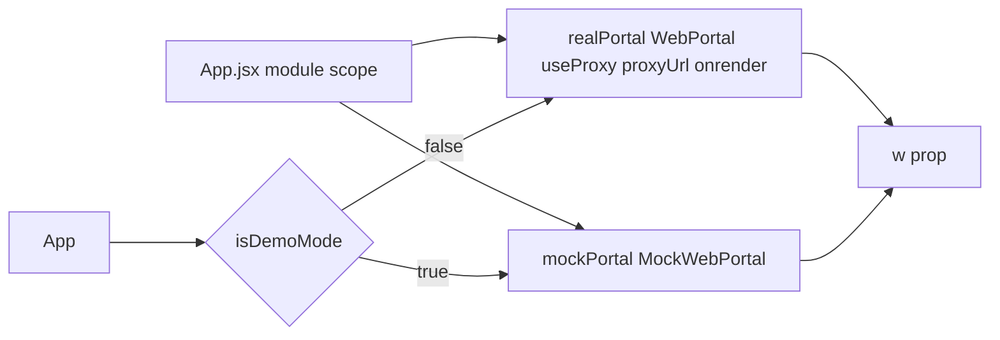

## Routing architecture

### Route structure

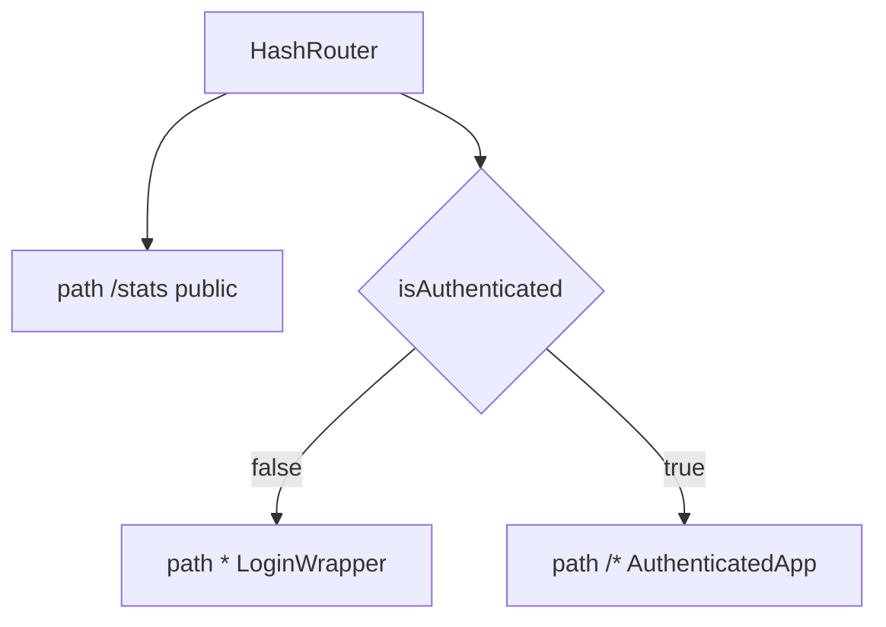

### AuthenticatedApp internal routing

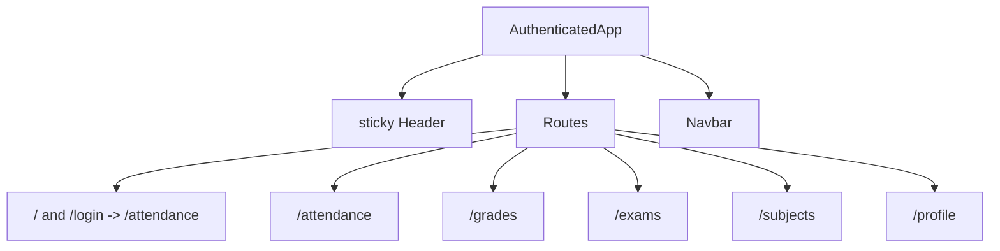

## State management architecture

### State hierarchy

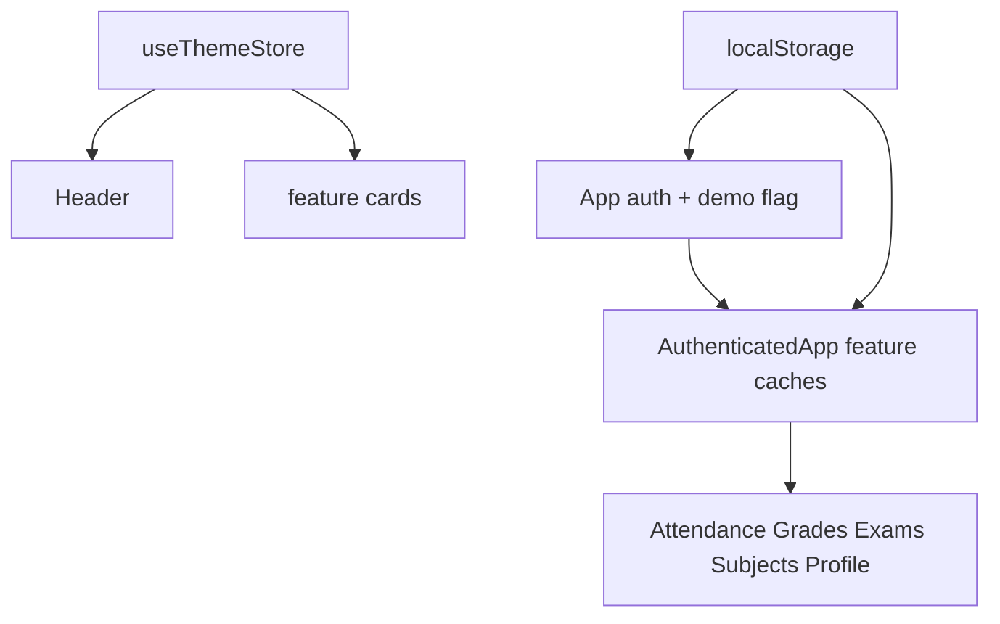

Persisted:

* `attendanceGoal` (default 75)
* `username` / `password` for auto-login

### State flow to feature components

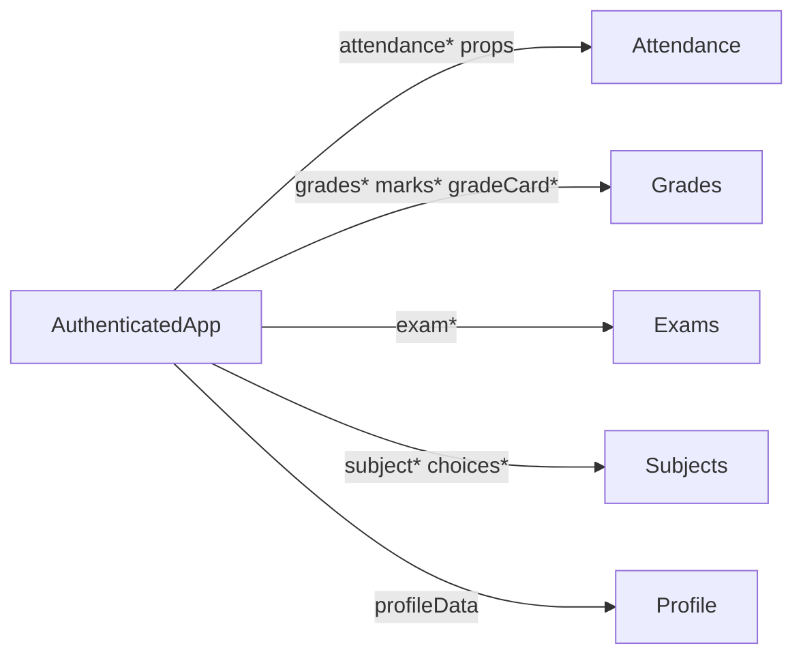

## Data access layer: portal abstraction

### Portal `w` switch

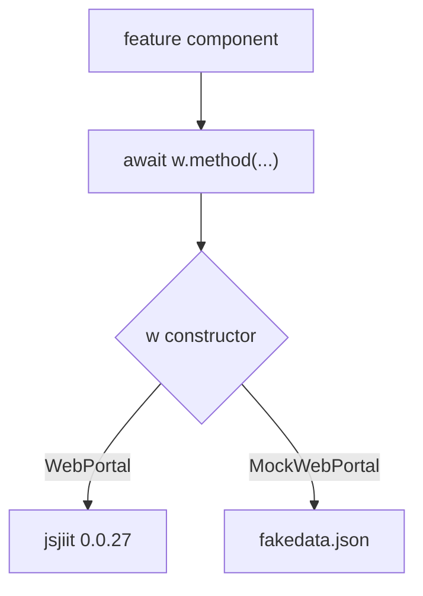

Portal methods in this app:

* `student_login(username, password)`
* `get_attendance_meta()`, `get_attendance(header, semester)`, `get_subject_daily_attendance(...)`
* `get_registered_semesters()`, `get_registered_subjects_and_faculties(semester)`, `get_subject_choices(semester)`
* `get_semesters_for_exam_events()`, `get_exam_events(semester)`, `get_exam_schedule(event)`
* `get_sgpa_cgpa()`, `get_semesters_for_grade_card()`, `get_grade_card(semester)`
* `get_semesters_for_marks()`, `download_marks(semester)`
* `get_personal_info()`

Do not invent `get_grades()` or `get_header()` as feature APIs. Attendance uses `meta.latest_header()`.

### Login flow

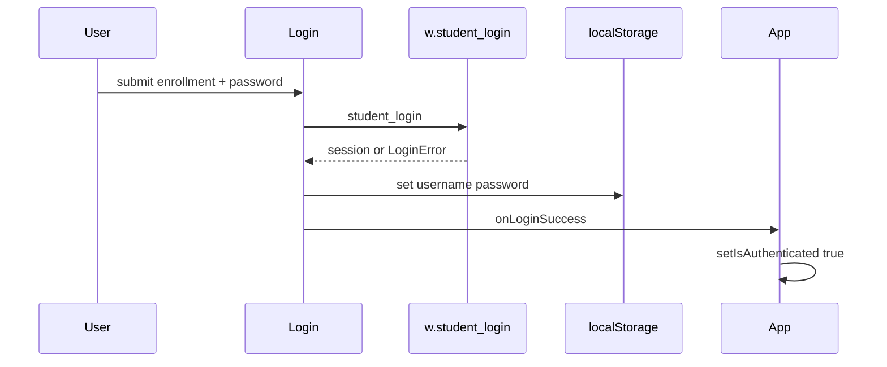

Auto-login on mount uses stored credentials against `realPortal` only.

## Theme infrastructure

### Theme state management with zustand

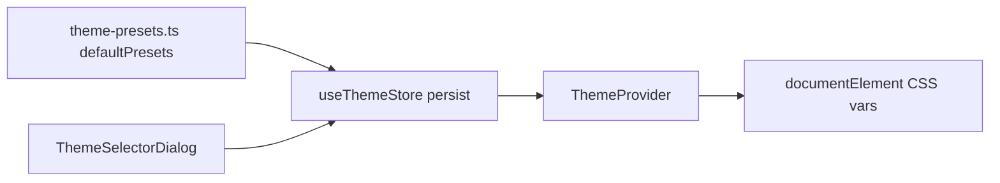

### Dynamic font loading

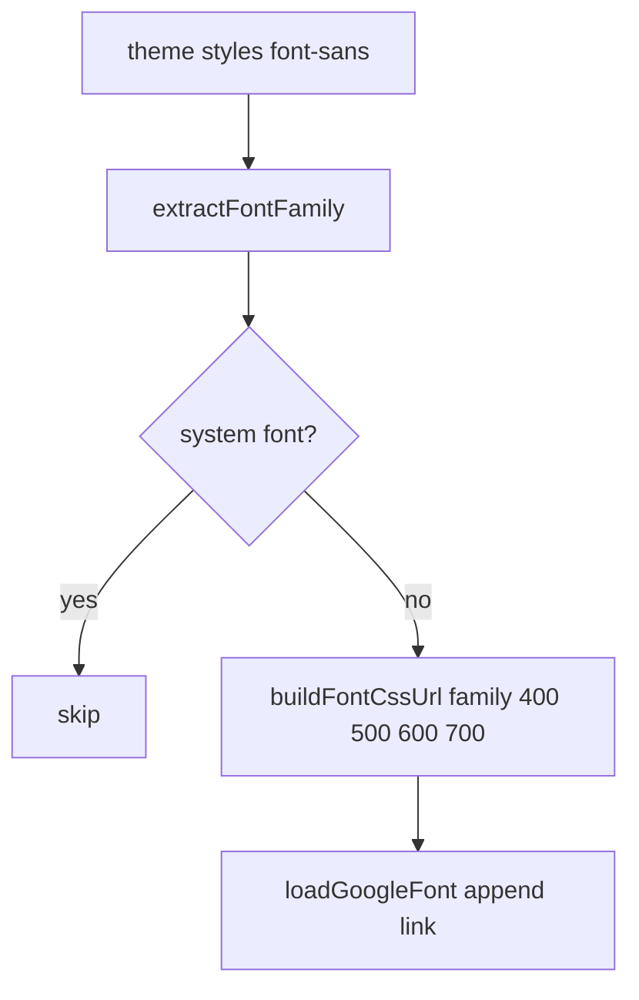

`src/utils/fonts.ts` owns `extractFontFamily`, `buildFontCssUrl`, `loadGoogleFont`. Default weights: `["400", "500", "600", "700"]`.

## Component architecture patterns

### Feature module pattern

| Aspect | Implementation |
| --- | --- |
| Props | `w`, caches, setters from `AuthenticatedApp` |
| Fetch | `useEffect` calling `w.method()` |
| Cache | Objects keyed by `registration_id` or event id |
| Loading | Booleans such as `gradesLoading`, `isAttendanceMetaLoading` |
| Errors | try/catch plus `gradesError` or cached `{ error }` |

Attendance is the heaviest prop list: `w`, `attendanceData`, semesters, goal, subject daily cache, tabs, calendar, tracker, cache status.

### Global UI components

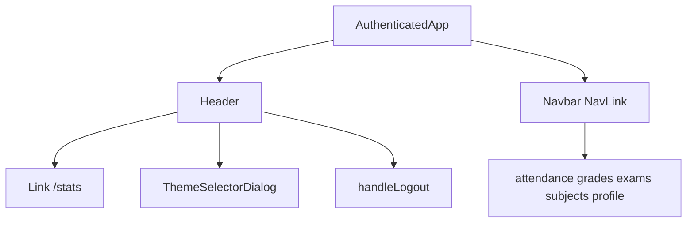

## External service integration

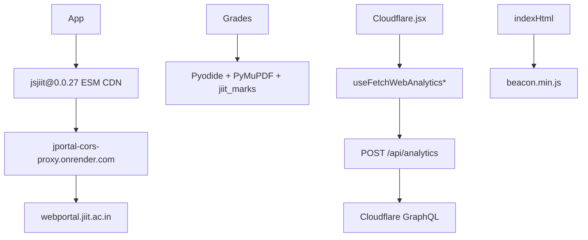

jsjiit import:

```
import { WebPortal, LoginError } from
  "https://cdn.jsdelivr.net/npm/jsjiit@0.0.27/dist/jsjiit.esm.js";
```

Pyodide is loaded from CDN in `index.html`. Grades uses it to parse marks PDFs.

## Error handling and loading states

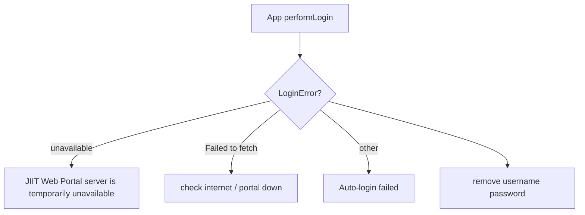

Feature-level errors (example `gradesError`) stay on `AuthenticatedApp`. Toasts use sonner.

## Summary

1. `App` gates auth. `/stats` is public.
2. `w` is `realPortal` or `mockPortal`.
3. Feature state lives on `AuthenticatedApp` and is drilled down.
4. React hooks for academic data, Zustand for theme, TanStack Query for Cloudflare stats.
5. Hash routing for GitHub Pages.
6. PWA from `vite-plugin-pwa`, not a custom `public/sw.js`.
