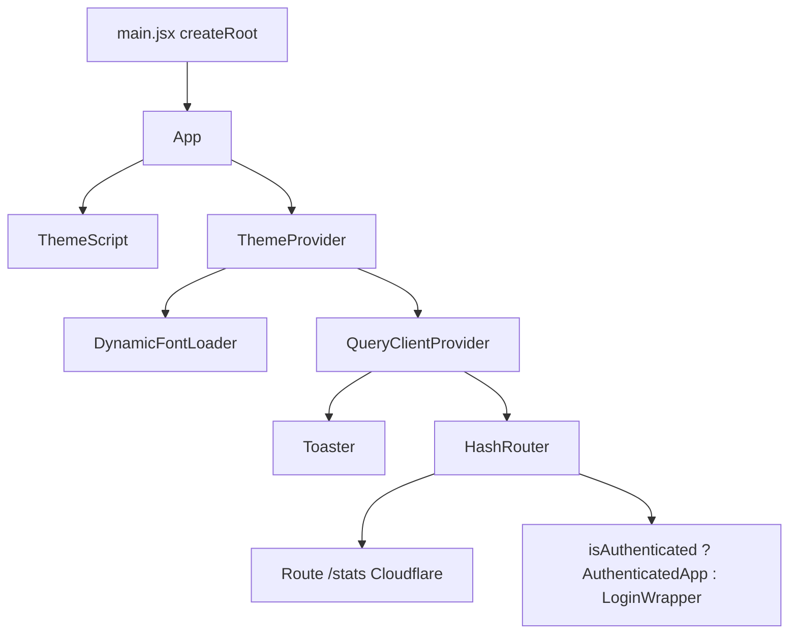
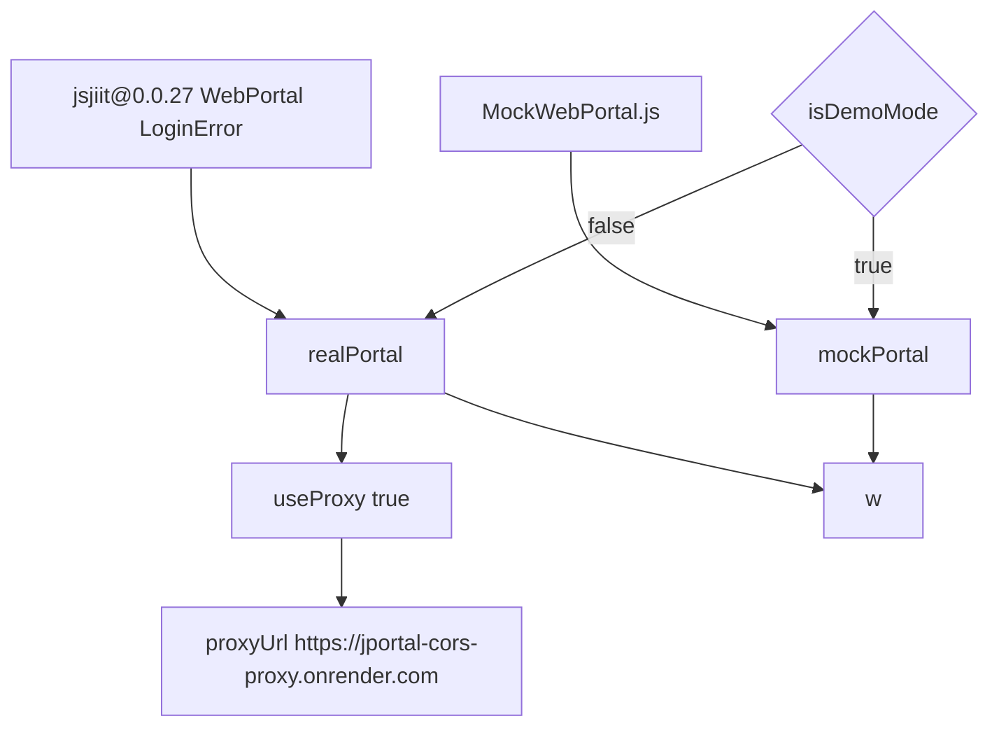
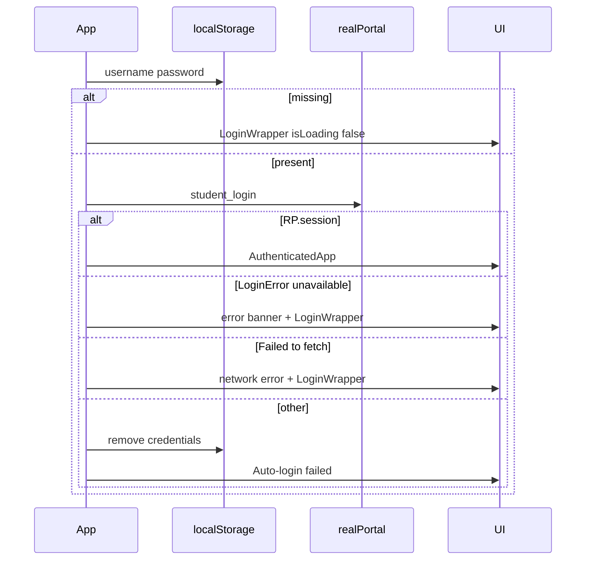
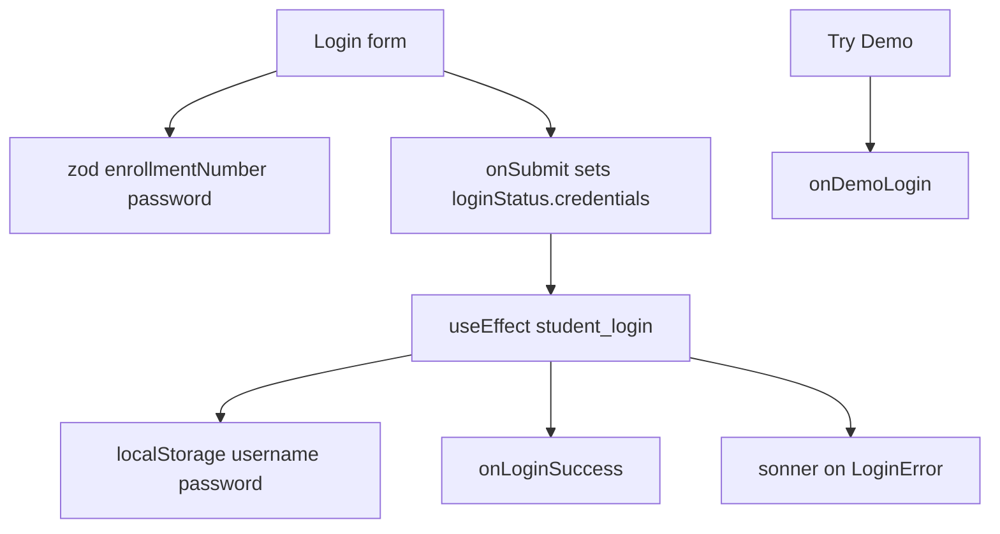
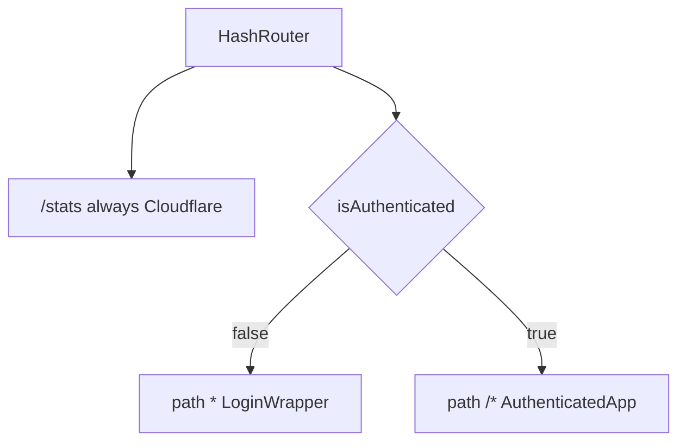
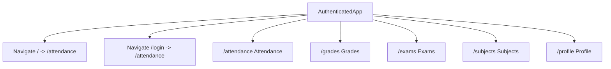
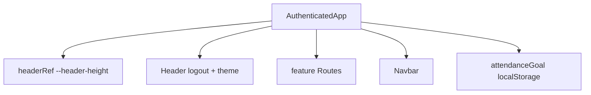
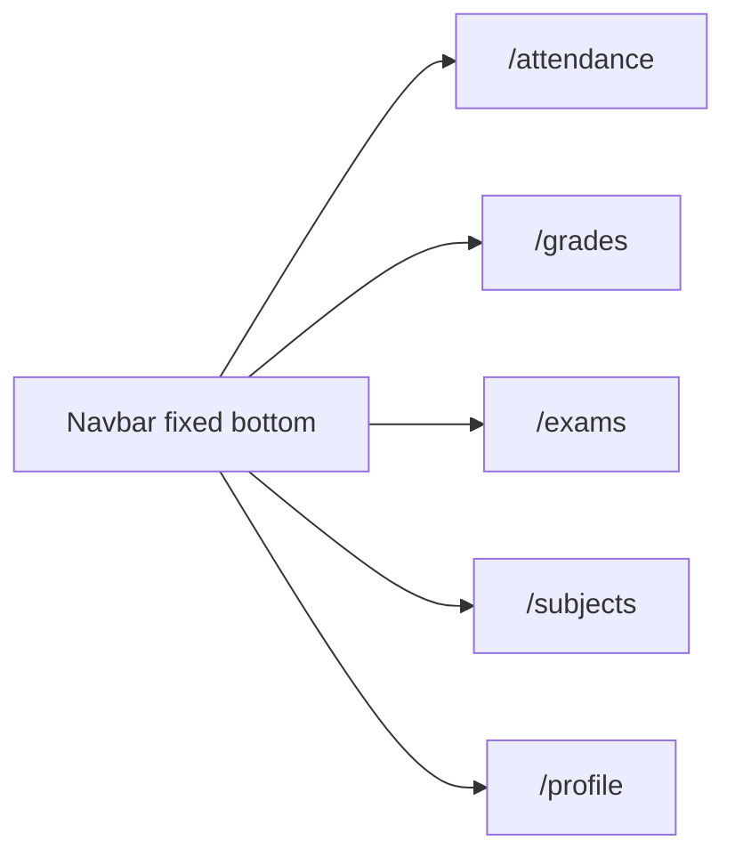
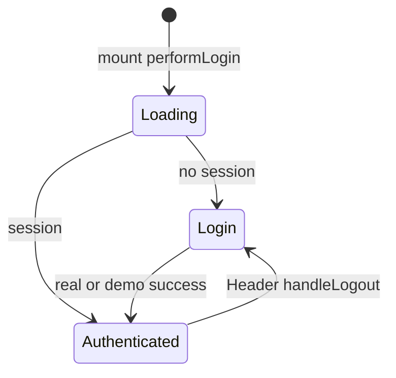

# Application structure & authentication

`App` owns auth. Real and demo login both land in `AuthenticatedApp`, which wires routes and feature modules.

Related: [State Management Strategy](3.2-state-management-strategy), [Data Layer & API Integration](3.3-data-layer-and-api-integration).

## Application entry point

`src/App.jsx` exports `App`. `src/main.jsx` mounts it. Providers and the router wrap the tree inside `App`.

### Core component structure



### Global providers

| Provider | Purpose |
| --- | --- |
| `ThemeScript` | Writes theme class before paint |
| `ThemeProvider` | Light/dark and CSS variables |
| `DynamicFontLoader` | Google Fonts for the active preset |
| `QueryClientProvider` | Shared `QueryClient` for stats |
| `Toaster` | sonner, popover colors |
| `HashRouter` | Client routes for GitHub Pages |

## Authentication system

Real login hits JIIT through jsjiit. Demo login never calls the network.

### Portal instance architecture



### Authentication state management

```
const [isAuthenticated, setIsAuthenticated] = useState(false);
const [isDemoMode, setIsDemoMode] = useState(false);
const [isLoading, setIsLoading] = useState(true);
const [error, setError] = useState(null);
```

| Variable | Role |
| --- | --- |
| `isAuthenticated` | Protected tree vs login |
| `isDemoMode` | `mockPortal` vs `realPortal` |
| `isLoading` | "Signing in..." splash during auto-login |
| `error` | Auto-login failure text |

### Auto-login flow



### Login component

`src/components/Login.jsx` is the form. Zod + react-hook-form. `LoginError` from the same jsjiit CDN import.



Login process:

1. Submit sets `loginStatus.credentials`.
2. Effect calls `w.student_login(enrollmentNumber, password)`.
3. Success writes `localStorage` and `onLoginSuccess()`.
4. `LoginWrapper` waits 100ms then `navigate("/attendance")`.

## Routing architecture

### Route guard implementation



| Condition | Pattern | Component |
| --- | --- | --- |
| Always | `/stats` | `Cloudflare` |
| Logged out | `*` | `LoginWrapper` |
| Logged in | `/*` | `AuthenticatedApp` |

### AuthenticatedApp route definitions



## AuthenticatedApp wrapper

`AuthenticatedApp` is the layout and the state hub.

### Component responsibilities



### State organization

| Feature | Examples |
| --- | --- |
| Attendance | `attendanceData`, `selectedAttendanceSem`, `attendanceGoal`, daily cache, tabs |
| Grades | `gradesData`, `gradeCards`, `marksData`, loading flags |
| Exams | `examSchedule`, `examSemesters`, `selectedExamSem`, `selectedExamEvent` |
| Subjects | `subjectData`, `subjectChoices`, tabs `registered` / `choices` |
| Profile | `profileData` |
| Shared | `w` |

Each route passes a long props list. Example Attendance: `w`, caches, goal, subject daily data, loading flags, tab, calendar, tracker.

### LocalStorage integration

```
const [attendanceGoal, setAttendanceGoal] = useState(() => {
  const savedGoal = localStorage.getItem("attendanceGoal");
  return savedGoal ? parseInt(savedGoal) : 75;
});
```

A `useEffect` writes the goal back on change.

## Navigation system

### Header component

Sticky `top-0 z-30`. Title, `/stats` icon, `ThemeSelectorDialog`, logout. Logout clears `username`, `password`, `attendanceData`, sets auth and demo false, navigates to `/login`.

### Navbar component



Icons come from `public/icons/*.svg?react`. Active `NavLink` uses `bg-primary` and `fill-primary-foreground`.

## Component lifecycle


