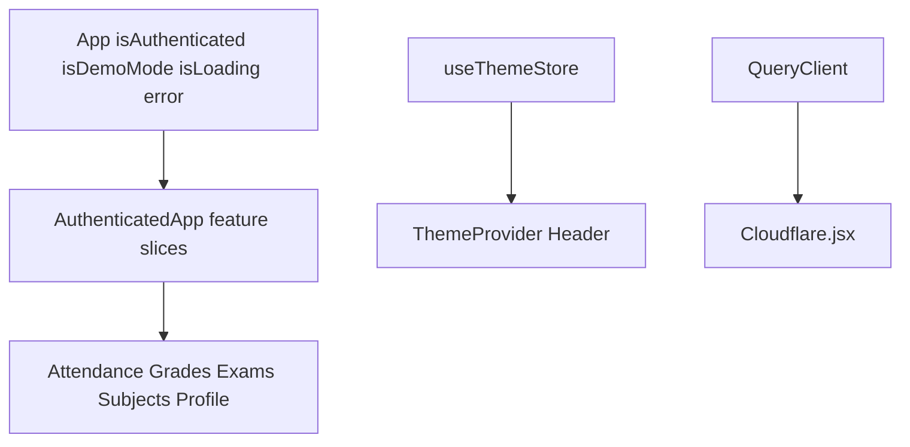
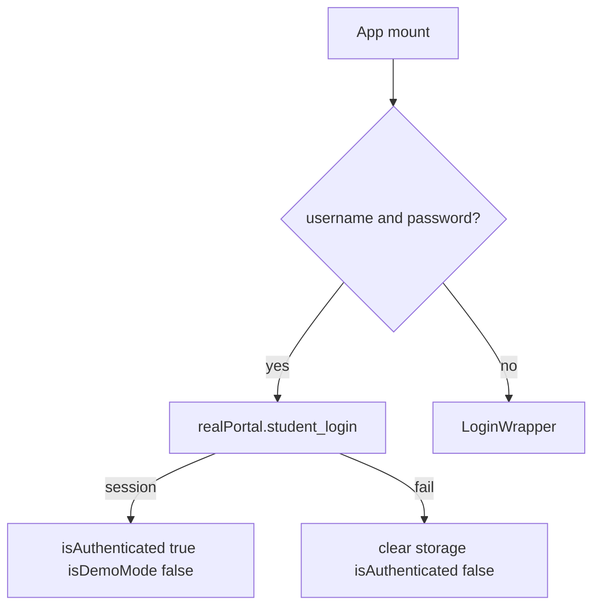
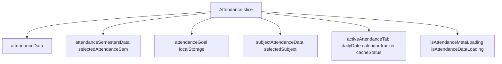
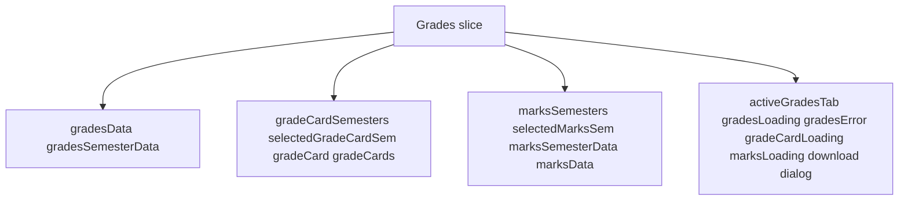
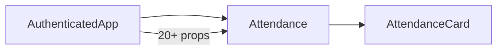
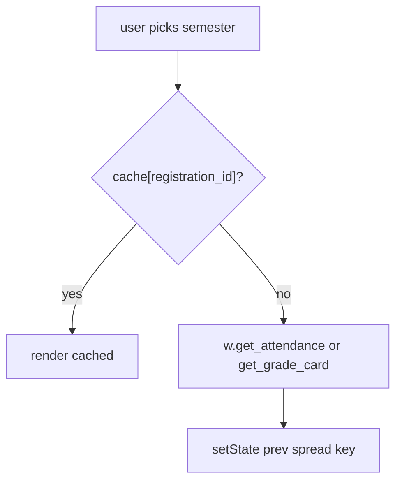
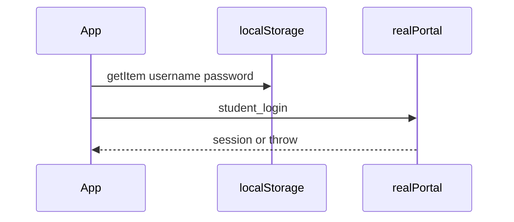
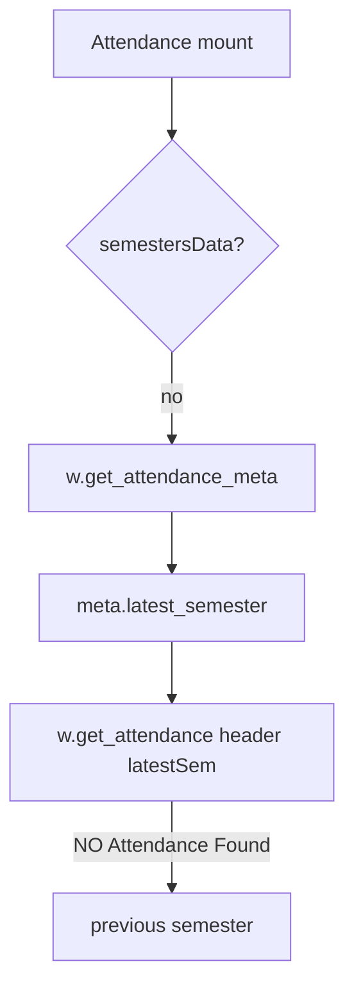
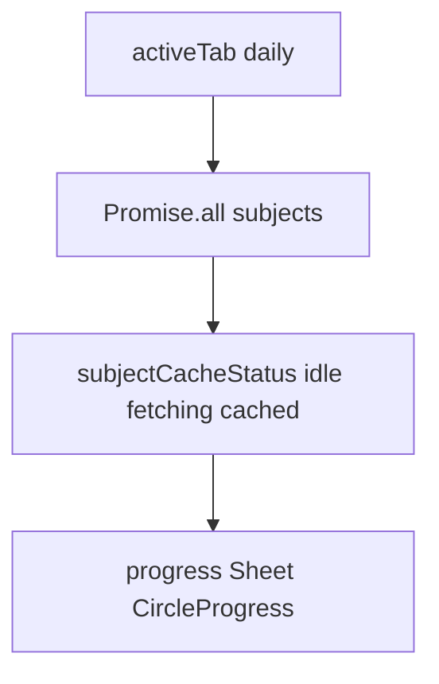
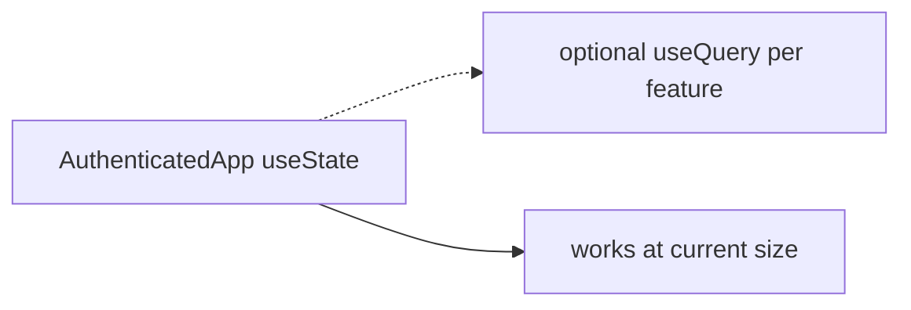

# State management strategy

React state on `App` and `AuthenticatedApp`, Zustand for theme, localStorage for credentials and the attendance goal. TanStack Query is wired for Cloudflare stats.

See [Data Layer & API Integration](3.3-data-layer-and-api-integration). Theme store is [Theme System](3.4-theme-system).

## Overview

* `useState` for auth and feature caches
* Props from `AuthenticatedApp` into feature pages
* Zustand persist for theme (`src/stores/theme-store.ts`)
* `localStorage` for `username`, `password`, `attendanceGoal`
* TanStack Query in `src/hooks/cloudflare.ts` (`useFetchWebAnalyticsAggregate` and siblings)

There is no Redux. Academic data is colocated on `AuthenticatedApp` so hash route changes keep caches.

## State hierarchy



## App-level state

| Variable | Type | Persistence |
| --- | --- | --- |
| `isAuthenticated` | boolean | no |
| `isDemoMode` | boolean | no |
| `isLoading` | boolean | no |
| `error` | string or null | no |



Portals at module scope: `realPortal`, `mockPortal`. `activePortal = isDemoMode ? mockPortal : realPortal`.

## AuthenticatedApp state coordination

### Attendance state cluster



Goal init:

```
const [attendanceGoal, setAttendanceGoal] = useState(() => {
  const savedGoal = localStorage.getItem("attendanceGoal");
  return savedGoal ? parseInt(savedGoal) : 75;
});
```

### Grades state cluster



### Other feature state clusters

Subjects: `subjectData`, `subjectSemestersData`, `subjectChoices`, `selectedSubjectsSem`, `activeSubjectsTab`, loading flags.

Exams: `examSchedule`, `examSemesters`, `selectedExamSem`, `selectedExamEvent`. `examEvents` and `loading` stay local in `Exams.jsx`.

Profile: `profileData`.

## Props drilling pattern

### Attendance component props



### Grades component props

`Grades` receives caches (`gradesData`, `gradeCards`, `marksData`), tab state, semester lists, and setters. Same hub pattern.

## Data caching strategy

### Cache-by-ID pattern



Attendance `handleSemesterChange` checks `attendanceData[value]` before `w.get_attendance(header, semester)`.

## Persistence mechanisms

| Key | Purpose |
| --- | --- |
| `username` | Auto-login |
| `password` | Auto-login |
| `attendanceGoal` | Target percent |
| Zustand persist | Theme preset and styles |

### Auto-login flow



## State initialization patterns

### Example: attendance initialization



Caches on `AuthenticatedApp` mean returning to `/attendance` does not refetch.

## State update patterns

Immutable spreads:

```
setAttendanceData(prev => ({
  ...prev,
  [semesterId]: newData
}));
```

Loading flags wrap async work (`setMarksLoading(true)` / `finally` false).

## TanStack query integration

`App` creates `new QueryClient()` and wraps the tree in `QueryClientProvider`.

Attendance and Grades do not call `useQuery`. `/stats` does:

* `useFetchWebAnalyticsAggregate`
* `useFetchWebAnalyticsBrowser`
* `useFetchWebAnalyticsOS`
* `useFetchWebAnalyticsSparkline`

Those hooks live in `src/hooks/cloudflare.ts` and POST to `/api/analytics`.

## Subject-specific caching: daily attendance



## Refactoring opportunities

Props lists are long. Cache-by-id is copied across modules. UI flags sit next to data.



Query is already in the tree for analytics. Academic modules have not migrated.

## Summary

* `App`: auth and portal pick
* `AuthenticatedApp`: feature caches
* Features: fetch through `w`, write through setters
* localStorage: credentials and goal
* Zustand: theme
* TanStack Query: Cloudflare dashboard
