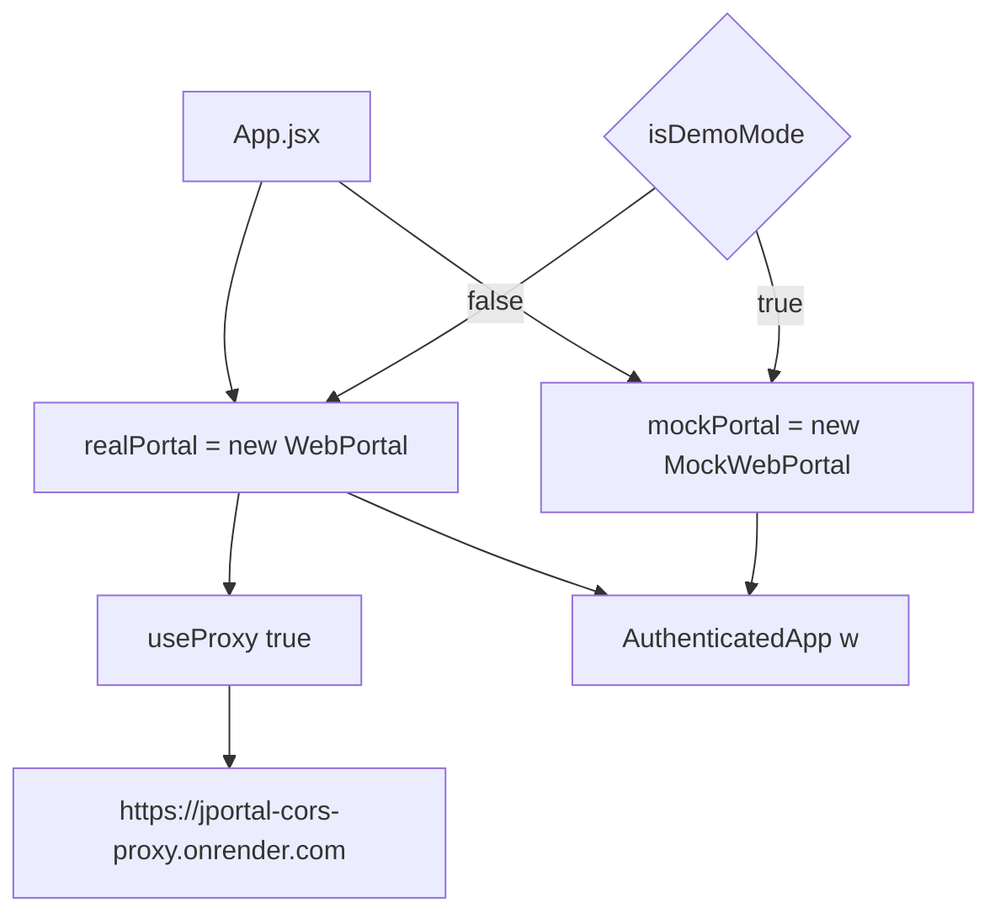
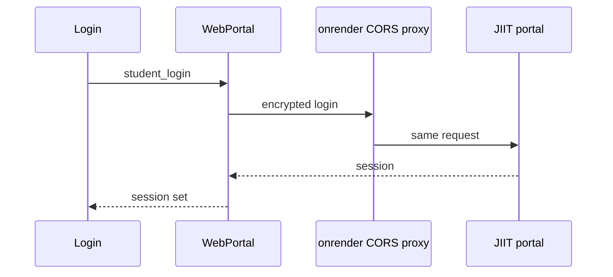
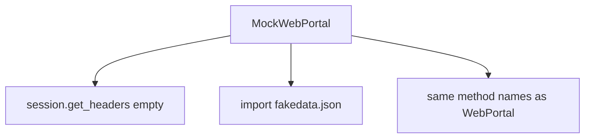
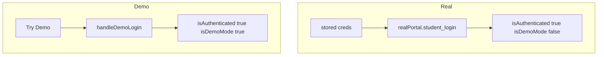
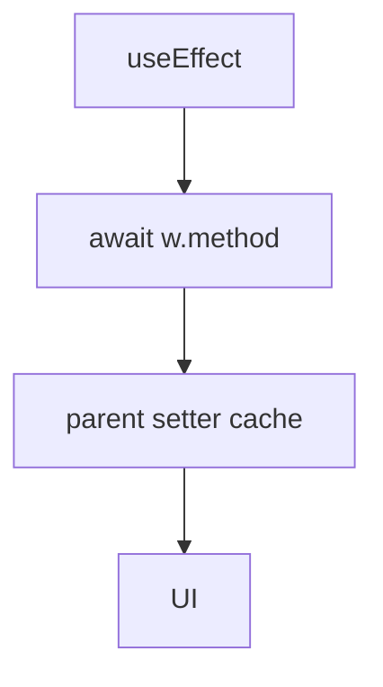
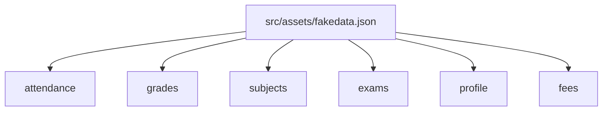

# Data layer & API integration

Two modes, one `w` prop. Real mode is jsjiit `WebPortal` through a CORS proxy. Demo mode is `MockWebPortal` plus `src/assets/fakedata.json`.

Related: [Application Structure & Authentication](3.1-application-structure-and-authentication), [State Management Strategy](3.2-state-management-strategy).

## Portal abstraction layer



Import:

```
import { WebPortal, LoginError } from
  "https://cdn.jsdelivr.net/npm/jsjiit@0.0.27/dist/jsjiit.esm.js";
```

## Portal interface contract

| Method | Args | Used by |
| --- | --- | --- |
| `student_login` | username, password | Login, App auto-login |
| `get_attendance_meta` | none | Attendance |
| `get_attendance` | header, semester | Attendance |
| `get_subject_daily_attendance` | semester, subjectid, individualsubjectcode, subjectcomponentids | Attendance |
| `get_sgpa_cgpa` | none | Grades |
| `get_semesters_for_grade_card` | none | Grades, Subjects choices tab |
| `get_grade_card` | semester | Grades |
| `get_semesters_for_marks` | none | Grades |
| `download_marks` | semester | Grades |
| `get_registered_semesters` | none | Subjects |
| `get_registered_subjects_and_faculties` | semester | Subjects |
| `get_subject_choices` | semester | Subjects |
| `get_semesters_for_exam_events` | none | Exams |
| `get_exam_events` | semester | Exams |
| `get_exam_schedule` | event | Exams |
| `get_personal_info` | none | Profile |

`MockWebPortal` also has `get_fee_summary` and `get_fines_msc_charges`. No UI calls those yet.

## Real mode: WebPortal (jsjiit library)



1. `Login` submits enrollment and password.
2. `w.student_login` runs.
3. Credentials land in `localStorage`.
4. `WebPortal.session` holds headers used later (marks PDF fetch).

Auto-login uses `realPortal` only.

`LoginError` messages:

* portal temporarily unavailable
* Failed to fetch
* generic credential failure (toast in `Login`)

## Demo mode: MockWebPortal



Constructor:

```
this.session = { get_headers: async () => ({}) };
```

`get_attendance_meta` reorders semesters by month. Jan–July prefers `EVESEM`. Aug–Dec prefers `ODDSEM`. `latest_semester()` is the first after that sort.

Lookups use `registration_code` or event id keys into `fakeData`.

## Authentication flow comparison



Demo has no auto-login.

## Data flow in feature components



Attendance: `get_attendance_meta` then `get_attendance(meta.latest_header(), meta.latest_semester())`.

Grades: `get_sgpa_cgpa`, `get_semesters_for_grade_card`, `get_grade_card`, `get_semesters_for_marks`, and either `download_marks` (demo) or Pyodide PDF parse (real).

Components never branch on mock vs real except Grades marks, which checks `w instanceof MockWebPortal`.

## Mock data structure



Attendance: `semestersData`, `attendanceData` keyed by `"2025EVESEM"`, `subjectAttendanceData` keyed by `individualsubjectcode`.

Grades: `gradesData`, `gradeCardSemesters`, `gradeCards`, `marksSemesters`, `marksData`.

Subjects: `semestersData`, `subjectData`, `choiceSubjects`.

Exams: `examSemesters`, `examEvents`, `examSchedule`.

Profile: `get_personal_info()` returns `fakeData.profile` (`generalinformation`, `qualification`, optional photo).

## Data caching strategy

```
const [attendanceData, setAttendanceData] = useState({});
```

Keys are `registration_id`. Skip fetch when the key exists.

Persisted across sessions: credentials and `attendanceGoal` only. Academic payloads stay in memory.

## Error handling and network resilience

1. Portal down. `LoginError` with "temporarily unavailable".
2. Network. message includes "Failed to fetch".
3. Bad credentials. toast "Login failed. Please check your credentials."

Try Demo still works when JIIT is down.

## Summary

1. Features talk to `w`, not to fetch URLs.
2. jsjiit 0.0.27 plus CORS proxy for production data.
3. `MockWebPortal` mirrors the method names above.
4. Caches live on `AuthenticatedApp`.
5. Stats are a separate path. TanStack Query posts to `/api/analytics`.
